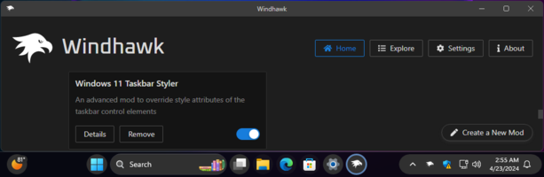

# The Windows 11 taskbar styling guide

## Table of contents

* [Introduction](#introduction)
  * [Missing customizations](#missing-customizations)
  * [Contributing](#contributing)
* [Themes](#themes)
* [General](#general)
  * [Taskbar size](#taskbar-size)
  * [Taskbar background](#taskbar-background)
  * [Taskbar border](#taskbar-border)
* [Task list](#task-list)
  * [Start button image](#start-button-image)
  * [Hide the start button](#hide-the-start-button)
  * [Task list buttons size](#task-list-buttons-size)
  * [Task list buttons corner radius](#task-list-buttons-corner-radius)
  * [Task list labels](#task-list-labels)
  * [Task list labels font](#task-list-labels-font)
  * [Task list running indicator](#task-list-running-indicator)
* [Notification area (system tray)](#notification-area-system-tray)
  * [Tray icons size](#tray-icons-size)
  * [Tray icons size (system icons)](#tray-icons-size-system-icons)
  * [Tray icons spacing](#tray-icons-spacing)
  * [Tray icons padding](#tray-icons-padding)
  * [Tray icons padding (system icons)](#tray-icons-padding-system-icons)
  * [Hide the network icon](#hide-the-network-icon)
  * [Hide the volume icon](#hide-the-volume-icon)
  * [Chevron icon width](#chevron-icon-width)
  * [Clock](#clock)
  * [Hide the notification bell icon](#hide-the-notification-bell-icon)
  * [Hide the "Show Desktop" button](#hide-the-show-desktop-button)

## Introduction

This is a collection of commonly requested taskbar styling customizations for
Windows 11. It is intended to be used with the [Windows 11 Taskbar
Styler](https://windhawk.net/mods/windows-11-taskbar-styler) Windhawk mod.

If you're not familiar with Windhawk, here are the steps for installing the mod:

* Download Windhawk from [windhawk.net](https://windhawk.net/) and install it.
* Go to "Mods" in the upper right menu.
* Find and install the "Windows 11 Taskbar Styler" mod.

After installing the mod, open its Settings tab and adjust the styles according
to your preferences.

Some customizations are best to be adjusted with other Windhawk mods. Links to
those mods are provided where applicable.

**See also**: [The Windows 11 start menu styling
guide](https://github.com/ramensoftware/windows-11-start-menu-styling-guide/blob/main/README.md).

### Missing customizations

If you're looking for a customization that is not listed here, please [open an
issue](https://github.com/ramensoftware/windows-11-taskbar-styling-guide/issues/new).

### Contributing

If you have a taskbar styling customization or theme that you would like to
share, please submit a pull request.

## Themes

Themes are collections of styles that can be imported into the Windows 11
Taskbar Styler mod. The following themes are available:

| Link  | Screenshot
| ----- | ----------
| [WinXP](Themes/WinXP/README.md) | [](Themes/WinXP/screenshot.png)
| [Bubbles](Themes/Bubbles/README.md) | [](Themes/Bubbles/screenshot.png)

## General

### Taskbar size

Use the [Taskbar height and icon
size](https://windhawk.net/mods/taskbar-icon-size) mod.

### Taskbar background

Target:
```
Rectangle#BackgroundFill
```

To set a solid color background, use the following style:
```
Fill=<color>
```

Replace `<color>` with the desired color.

A color can be a name (e.g. `Red`) or a hex code (e.g. `#FF0000`).

The color can be semi-transparent (e.g. `#80FF0000`). To have a fully
transparent background, use `Transparent`.

The background can also be a gradient. For example, to have a gradient from
yellow to red to blue to lime green, use the following style:
```
Fill:=<LinearGradientBrush StartPoint="0,0.5" EndPoint="1,0.5"><GradientStop Color="Yellow" Offset="0.0" /><GradientStop Color="Red" Offset="0.25" /><GradientStop Color="Blue" Offset="0.75" /><GradientStop Color="LimeGreen" Offset="1.0" /></LinearGradientBrush>
```

The background can also be an image:
```
Fill:=<ImageBrush Stretch="UniformToFill" ImageSource="<image>" />
```

Replace `<image>` with your own image, a URL or a local file path.

### Taskbar border

Target:
```
Rectangle#BackgroundStroke
```

It can be customized in the same way as the background, see [Taskbar
background](#taskbar-background).

## Task list

### Start button image

Target:
```
Taskbar.ExperienceToggleButton#LaunchListButton[AutomationProperties.AutomationId=StartButton] > Taskbar.TaskListButtonPanel > Border#BackgroundElement
```
Style:
```
Background:=<ImageBrush Stretch="None" ImageSource="<image>" />
```
Target:
```
Taskbar.ExperienceToggleButton#LaunchListButton[AutomationProperties.AutomationId=StartButton] > Taskbar.TaskListButtonPanel > Microsoft.UI.Xaml.Controls.AnimatedVisualPlayer.AnimatedVisualPlayer#Icon
```
Style:
```
Visibility=Collapsed
```

Replace `<image>` with your own image, a URL or a local file path (for example,
`https://i.imgur.com/BvXJlkj.png`).

### Hide the start button

Target:
```
Taskbar.ExperienceToggleButton#LaunchListButton[AutomationProperties.AutomationId=StartButton]
```
Style:
```
Visibility=Collapsed
```

### Task list buttons size

Use the [Taskbar height and icon
size](https://windhawk.net/mods/taskbar-icon-size) mod.

### Task list buttons corner radius

Targets:
```
Taskbar.ExperienceToggleButton
```
```
Taskbar.SearchBoxButton
```
```
Taskbar.TaskListButton
```
Style:
```
CornerRadius=<radius>
```

Replace `<radius>` with the desired radius. A larger value will make the corners
more rounded. Default: 4.

### Task list labels

Various task list label customizations are available in the [Taskbar Labels for
Windows 11](https://windhawk.net/mods/taskbar-labels) mod.

### Task list labels font

Target:
```
TextBlock#LabelControl
```
Style:
```
FontFamily=<font>
```

Replace `<font>` with the desired font. For a list of fonts that are shipped
with Windows 11, refer to [this page](
https://learn.microsoft.com/en-us/typography/fonts/windows_11_font_list).

### Task list running indicator

Target:
```
Taskbar.TaskListLabeledButtonPanel@RunningIndicatorStates > Rectangle#RunningIndicator
```

Various styles can be applied to the running indicator. Here are some examples:

Styles:
```
Fill=#FFED7014
```
```
Height=2
```
```
Width=12
```
```
Fill@ActiveRunningIndicator=Red
```
```
Width@ActiveRunningIndicator=20
```

The following visual states can be used:
* `ActiveRunningIndicator`
* `InactiveRunningIndicator`
* `RequestingAttentionRunningIndicator`

Some customizations for the running indicator are available in the [Taskbar
Labels for Windows 11](https://windhawk.net/mods/taskbar-labels) mod.

## Notification area (system tray)

### Tray icons size

Target:
```
SystemTray.ImageIconContent > Grid#ContainerGrid > Image
```
Styles: 
```
Width=<size>
```
```
Height=<size>
```

Replace `<size>` with the desired size. Default: 16.

### Tray icons size (system icons)

Target:
```
SystemTray.TextIconContent > Grid#ContainerGrid > SystemTray.AdaptiveTextBlock#Base > TextBlock#InnerTextBlock
```
Style:
```
FontSize=<size>
```

Replace `<size>` with the desired size. Default: 32.

### Tray icons spacing

Target:
```
SystemTray.NotifyIconView#NotifyItemIcon
```
Style:
```
MinWidth=<width>
```

Replace `<width>` with the desired width for the icon and the spacing. Default:
32.

### Tray icons padding

Target:
```
SystemTray.ImageIconContent > Grid#ContainerGrid
```
Style:
```
Padding=<padding>
```

To reduce the spacing even more, replace `<padding>` with the desired padding.
Default: `4,0`.

### Tray icons padding (system icons)

Target:
```
SystemTray.TextIconContent > Grid#ContainerGrid
```
Style:
```
Padding=<padding>
```

Replace `<padding>` with the desired padding. Default: `4,0`.

### Hide the network icon

Target:
```
SystemTray.OmniButton#ControlCenterButton > Grid > ContentPresenter > ItemsPresenter > StackPanel > ContentPresenter[1] > SystemTray.IconView > Grid > Grid
```
Style:
```
Visibility=Collapsed
```

### Hide the volume icon

Target:
```
SystemTray.OmniButton#ControlCenterButton > Grid > ContentPresenter > ItemsPresenter > StackPanel > ContentPresenter[2] > SystemTray.IconView > Grid > Grid
```
Style:
```
Visibility=Collapsed
```

### Chevron icon width

Target:
```
SystemTray.ChevronIconView
```
Style:
```
MinWidth=<width>
```

Replace `<width>` with the desired width. Default: 32.

### Clock

Clock customizations are available in the [Taskbar Clock
Customization](https://windhawk.net/mods/taskbar-clock-customization) mod.

### Hide the notification bell icon

Target:
```
SystemTray.OmniButton#NotificationCenterButton > Grid > ContentPresenter > ItemsPresenter > StackPanel > ContentPresenter > SystemTray.IconView#SystemTrayIcon > Grid > Grid > SystemTray.TextIconContent
```
Style:
```
Visibility=Collapsed
```

### Hide the "Show Desktop" button

Target:
```
SystemTray.Stack#ShowDesktopStack
```
Style:
```
Visibility=Collapsed
```
