# The Windows 11 taskbar styling guide

## Table of contents

* [Introduction](#introduction)
  * [Supported components](#supported-components)
  * [Finding targets](#finding-targets)
  * [Missing customizations](#missing-customizations)
  * [Contributing](#contributing)
* [Themes](#themes)
* [General](#general)
  * [Taskbar size](#taskbar-size)
  * [Taskbar background](#taskbar-background)
  * [Taskbar border](#taskbar-border)
  * [Thumbnail preview background](#thumbnail-preview-background)
* [Task list](#task-list)
  * [Start button image](#start-button-image)
  * [Hide the start button](#hide-the-start-button)
  * [Task list buttons size](#task-list-buttons-size)
  * [Task list buttons corner radius](#task-list-buttons-corner-radius)
  * [Task list labels](#task-list-labels)
  * [Task list labels font](#task-list-labels-font)
  * [Task list running indicator](#task-list-running-indicator)
* [Notification area (system tray)](#notification-area-system-tray)
  * [Tray overflow background](#tray-overflow-background)
  * [Tray icons size](#tray-icons-size)
  * [Tray icons size (system icons)](#tray-icons-size-system-icons)
  * [Tray icons spacing](#tray-icons-spacing)
  * [Tray icons padding](#tray-icons-padding)
  * [Tray icons padding (system icons)](#tray-icons-padding-system-icons)
  * [Hide the network icon](#hide-the-network-icon)
  * [Hide the volume icon](#hide-the-volume-icon)
  * [Chevron icon width](#chevron-icon-width)
  * [Clock](#clock)
  * [Hide the notification bell icon](#hide-the-notification-bell-icon)
  * [Copilot button image](#copilot-button-image)
  * [Hide the "Show Desktop" button](#hide-the-show-desktop-button)
  * [Hide the entire system tray](#hide-the-entire-system-tray)
* [Alt+Tab](#alttab)
  * [Alt+Tab background](#alttab-background)
* [Task view](#task-view)
  * [Task view background](#task-view-background)
  * [Hide virtual desktops](#hide-virtual-desktops)
* [Volume popup](#volume-popup)
  * [Slider thickness](#slider-thickness)
* [Transforms](#transforms)
  * [Translate](#translate)
  * [Rotate](#rotate)
  * [Scale](#scale)
  * [Skew](#skew)
  * [Other properties and attributes](#other-properties-and-attributes)
* [Colors](#colors)
  * [Solid color](#solid-color)
  * [Accent colors](#accent-colors)
  * [Transparent color](#transparent-color)
  * [Acrylic effect as color](#acrylic-effect-as-color)
  * [WindhawkBlur effect as color](#windhawkblur-effect-as-color)
  * [Mica effect as color](#mica-effect-as-color)
  * [Gradient as color](#gradient-as-color)
  * [Image as color](#image-as-color)

## Introduction

This is a collection of commonly requested taskbar styling customizations for
Windows 11. It is intended to be used with the [Windows 11 Taskbar
Styler](https://windhawk.net/mods/windows-11-taskbar-styler) Windhawk mod.

If you're not familiar with Windhawk, here are the steps for installing the mod:

* Download Windhawk from [windhawk.net](https://windhawk.net/) and install it.
* Go to "Mods" in the upper right menu.
* Find and install the "Windows 11 Taskbar Styler" mod.

After installing the mod, open its Settings tab and adjust the styles according
to your preferences.

Some customizations are best adjusted with other Windhawk mods. Links to those
mods are provided where applicable.

**See also**: [The Windows 11 start menu styling
guide](https://github.com/ramensoftware/windows-11-start-menu-styling-guide/blob/main/README.md),
[The Windows 11 notification center styling
guide](https://github.com/ramensoftware/windows-11-notification-center-styling-guide/blob/main/README.md).

### Supported components

As of version 1.5 of Windows 11 Taskbar Styler, the following components can be styled along with the taskbar:
* Alt+Tab
* Task view (Win+Tab)
* Volume popup
* Language popup
* Snap layout popups

### Finding targets

[How to find targets using UWPSpy](https://github.com/bbmaster123/FWFU/blob/main/Guides/uwpspy.md).

### Missing customizations

If you're looking for a customization that is not listed here, please [open an
issue](https://github.com/ramensoftware/windows-11-taskbar-styling-guide/issues/new).

### Contributing

If you have a taskbar styling customization or theme that you would like to
share, please submit a pull request.

## Themes

Themes are collections of styles that can be imported into the Windows 11
Taskbar Styler mod. The following themes are available:

| Link  | Screenshot
| ----- | ----------
| [TranslucentTaskbar](Themes/TranslucentTaskbar/README.md) | [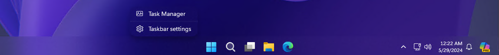](Themes/TranslucentTaskbar/screenshot.png)
| [DockLike](Themes/DockLike/README.md) | [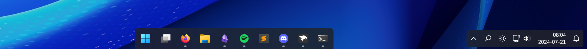](Themes/DockLike/screenshot.png)
| [SimplyTransparent](Themes/SimplyTransparent/README.md) | [](Themes/SimplyTransparent/screenshot.png)
| [Squircle](Themes/Squircle/README.md) | [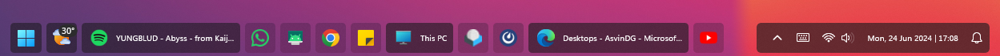](Themes/Squircle/screenshot.png)
| [Matter](Themes/Matter/README.md) | [](Themes/Matter/screenshot.png)
| [WinXP](Themes/WinXP/README.md) | [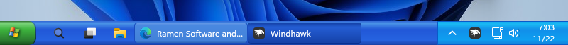](Themes/WinXP/screenshot.png)
| [Bubbles](Themes/Bubbles/README.md) | [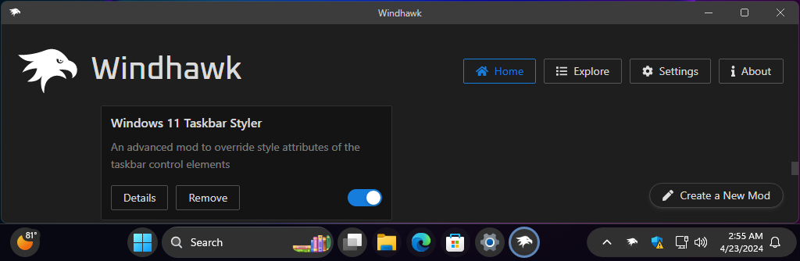](Themes/Bubbles/screenshot.png)
| [RosePine](Themes/RosePine/README.md) | [](Themes/RosePine/screenshot.png)
| [WinVista](Themes/WinVista/README.md) | [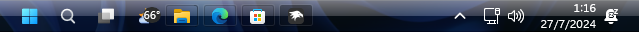](Themes/WinVista/screenshot.png)
| [CleanSlate](Themes/CleanSlate/README.md) | [](Themes/CleanSlate/screenshot.png)
| [Lucent](Themes/Lucent/README.md) | [](Themes/Lucent/screenshot.png)
| [SunValley](Themes/SunValley/README.md) | [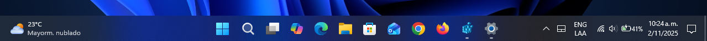](Themes/SunValley/screenshot.png)
| [SunValley (Legacy)](Themes/21996Taskbar/README.md) | [](Themes/21996Taskbar/screenshot.png)
| [BottomDensy](Themes/BottomDensy/README.md) | [](Themes/BottomDensy/screenshot.png)
| [TaskbarXII](Themes/TaskbarXII/README.md) | [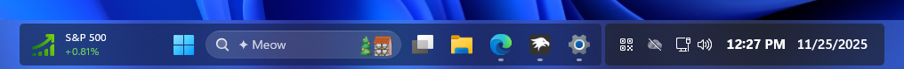](Themes/TaskbarXII/screenshot.png)
| [xdark](Themes/xdark/README.md) | [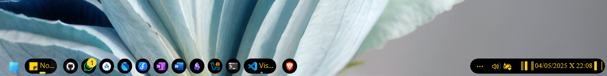](Themes/xdark/screenshot.png)
| [Windows7](Themes/Windows7/README.md) | [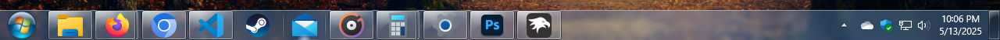](Themes/Windows7/screenshot.png)
| [Aeris](Themes/Aeris/README.md) | [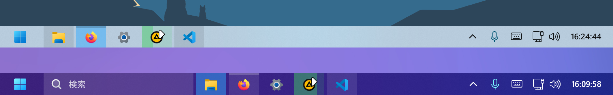](Themes/Aeris/screenshot.png)
| [Plasma](Themes/Plasma/README.md) | [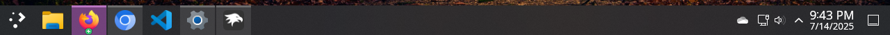](Themes/Plasma/screenshot.png)
| [WindowGlass](Themes/WindowGlass/README.md) | [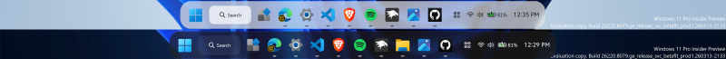](Themes/WindowGlass/screenshot.png)
| [Surface](Themes/Surface/README.md) | [](Themes/Surface/screenshot.png)
| [Oversimplified&Accentuated](Themes/Oversimplified&Accentuated/README.md) | [](Themes/Oversimplified&Accentuated/screenshot.png)
| [Luminosity](Themes/Luminosity/README.md) | [](Themes/Luminosity/screenshot.png)
| [LayerMicaUI](Themes/LayerMicaUI/README.md) | [](Themes/LayerMicaUI/screenshot.png)

## General

### Taskbar size

Use the [Taskbar height and icon
size](https://windhawk.net/mods/taskbar-icon-size) mod.

### Taskbar background

Target:
```
Taskbar.TaskbarFrame > Grid#RootGrid > Taskbar.TaskbarBackground > Grid > Rectangle#BackgroundFill
```

Style:
```
Fill=<color>
```

Replace `<color>` with the desired color. See [colors section](#colors) for all
options (e.g. if you want blurred background effect).

> [!NOTE]
> There's a known limitation with `AcrylicBrush` which only works if there's a
> single taskbar. For details, refer to [Acrylic effect as
> color](#acrylic-effect-as-color).

> [!NOTE]
> For some themes, a different target has to be used to customize the taskbar
> background:
> * The [WinXP](Themes/WinXP/README.md) theme spans the taskbar border over the
>   full taskbar height. To customize the background, use the
>   `Rectangle#BackgroundStroke` target.
> * The [DockLike](Themes/DockLike/README.md) theme hides the standard taskbar
>   background element. To customize the background, use the `Grid#RootGrid`
>   target and the `Background=<color>` style.

### Taskbar border

Target:
```
Rectangle#BackgroundStroke
```

It can be customized in the same way as the background, see [Taskbar
background](#taskbar-background).

### Thumbnail preview background

Target:
```
Taskbar.TaskbarBackground#HoverFlyoutBackgroundControl > Grid > Rectangle#BackgroundFill
```

Style:
```
Fill=<color>
```

## Task list

### Start button image

Target:
```
Taskbar.ExperienceToggleButton#LaunchListButton[AutomationProperties.AutomationId=StartButton] > Taskbar.TaskListButtonPanel > Border#BackgroundElement
```
Style:
```
Background:=<ImageBrush Stretch="Uniform" ImageSource="<image>" />
```
Target:
```
Taskbar.ExperienceToggleButton#LaunchListButton[AutomationProperties.AutomationId=StartButton] > Taskbar.TaskListButtonPanel > Microsoft.UI.Xaml.Controls.AnimatedVisualPlayer#Icon
```
Style:
```
Visibility=Collapsed
```

Replace `<image>` with your own image, a local file path or a URL, for example:
* Windows 10:
  `https://raw.githubusercontent.com/ramensoftware/windows-11-taskbar-styling-guide/refs/heads/main/Assets/OrbWin10.png`.
* Windows XP:
  `https://raw.githubusercontent.com/ramensoftware/windows-11-taskbar-styling-guide/refs/heads/main/Assets/OrbWinXP.png`
  (use with `Stretch="None"`).

To set a different image for each Start button state - normal, hovered, pressed -
refer to [this
comment](https://github.com/ramensoftware/windows-11-taskbar-styling-guide/issues/153#issuecomment-2569892017).

### Hide the start button

Target:
```
Taskbar.ExperienceToggleButton#LaunchListButton[AutomationProperties.AutomationId=StartButton]
```
Style:
```
Visibility=Collapsed
```

### Task list buttons size

Use the [Taskbar height and icon
size](https://windhawk.net/mods/taskbar-icon-size) mod.

### Task list buttons corner radius

Targets:
```
Taskbar.ExperienceToggleButton
```
```
Taskbar.SearchBoxButton
```
```
Taskbar.TaskListButton
```
Style:
```
CornerRadius=<radius>
```

Replace `<radius>` with the desired radius. A larger value will make the corners
more rounded. Default: 4.

### Task list labels

Various task list label customizations are available in the [Taskbar Labels for
Windows 11](https://windhawk.net/mods/taskbar-labels) mod.

### Task list labels font

Target:
```
TextBlock#LabelControl
```
Style:
```
FontFamily=<font>
```

Replace `<font>` with the desired font. For a list of fonts that are shipped
with Windows 11, refer to [this page](
https://learn.microsoft.com/en-us/typography/fonts/windows_11_font_list).

### Task list running indicator

Target:
```
Taskbar.TaskListLabeledButtonPanel@RunningIndicatorStates > Rectangle#RunningIndicator
```

Various styles can be applied to the running indicator. Here are some examples:

Styles:
```
Fill=#FFED7014
```
```
Height=2
```
```
Width=12
```
```
Fill@ActiveRunningIndicator=Red
```
```
Width@ActiveRunningIndicator=20
```

The following visual states[^1] can be used:
* `ActiveRunningIndicator`
* `InactiveRunningIndicator`
* `RequestingAttentionRunningIndicator`

Some customizations for the running indicator are available in the [Taskbar
Labels for Windows 11](https://windhawk.net/mods/taskbar-labels) mod.

## Notification area (system tray)

### Tray overflow background

Target:
```
Border#OverflowFlyoutBackgroundBorder
```

Style:
```
Background=<color>
```

### Tray icons size

Target:
```
SystemTray.ImageIconContent > Grid#ContainerGrid > Image
```
Styles:
```
Width=<size>
```
```
Height=<size>
```

Replace `<size>` with the desired size. Default: 16.

### Tray icons size (system icons)

Target:
```
SystemTray.TextIconContent > Grid#ContainerGrid > SystemTray.AdaptiveTextBlock#Base > TextBlock#InnerTextBlock
```
Style:
```
FontSize=<size>
```

Replace `<size>` with the desired size. Default: 32.

### Tray icons spacing

Target:
```
SystemTray.NotifyIconView#NotifyItemIcon
```
Style:
```
MinWidth=<width>
```

Replace `<width>` with the desired width for the icon and the spacing. Default:
32.

### Tray icons padding

Target:
```
SystemTray.ImageIconContent > Grid#ContainerGrid
```
Style:
```
Padding=<padding>
```

To reduce the spacing even more, replace `<padding>` with the desired padding.
Default: `4,0`.

### Tray icons padding (system icons)

Target:
```
SystemTray.TextIconContent > Grid#ContainerGrid
```
Style:
```
Padding=<padding>
```

Replace `<padding>` with the desired padding. Default: `4,0`.

### Hide the network icon

Target:
```
SystemTray.OmniButton#ControlCenterButton > Grid > ContentPresenter > ItemsPresenter > StackPanel > ContentPresenter[1] > SystemTray.IconView > Grid > Grid
```
Style:
```
Visibility=Collapsed
```

### Hide the volume icon

Target:
```
SystemTray.OmniButton#ControlCenterButton > Grid > ContentPresenter > ItemsPresenter > StackPanel > ContentPresenter[2] > SystemTray.IconView > Grid > Grid
```
Style:
```
Visibility=Collapsed
```

### Chevron icon width

Target:
```
SystemTray.ChevronIconView
```
Style:
```
MinWidth=<width>
```

Replace `<width>` with the desired width. Default: 32.

### Clock

Clock customizations are available in the [Taskbar Clock
Customization](https://windhawk.net/mods/taskbar-clock-customization) mod.

### Hide the notification bell icon

Target:
```
SystemTray.OmniButton#NotificationCenterButton > Grid > ContentPresenter > ItemsPresenter > StackPanel > ContentPresenter > SystemTray.IconView#SystemTrayIcon > Grid > Grid > SystemTray.TextIconContent
```
Style:
```
Visibility=Collapsed
```

### Copilot button image

Target:
```
ContentPresenter#ContentPresenter > Grid#ContentGrid > Microsoft.UI.Xaml.Controls.AnimatedVisualPlayer#LottieIcon
```
Style:
```
Visibility=Collapsed
```
Target:
```
SystemTray.CopilotIcon#CopilotIcon > Grid#ContainerGrid > Border#BackgroundBorder
```
Style:
```
Background:=<ImageBrush Stretch="None" ImageSource="<image>" />
```

* Copilot icon without preview label:
  `https://raw.githubusercontent.com/ramensoftware/windows-11-taskbar-styling-guide/refs/heads/main/Assets/CopilotWithoutPreview.png`.
* Old Copilot icon:
  `https://raw.githubusercontent.com/ramensoftware/windows-11-taskbar-styling-guide/refs/heads/main/Assets/CopilotOld.png`.

### Hide the "Show Desktop" button

Target:
```
SystemTray.Stack#ShowDesktopStack
```
Style:
```
Visibility=Collapsed
```

### Hide the entire system tray

Target:
```
Grid#SystemTrayFrameGrid
```
Style:
```
Visibility=Collapsed
```

## Alt+Tab

### Alt+Tab background

Target:
```
Windows.UI.Xaml.Controls.Grid#ModalRootGrid > Windows.UI.Xaml.Controls.Border#BackgroundElement
```
Style:
```
Background=<color>
```

## Task view

### Task view background

Target:
```
Windows.UI.Xaml.Controls.Border#BackgroundDimmingLayer
```
Style:
```
Background=<color>
```
### Hide virtual desktops

Target:
```
WindowsInternal.ComposableShell.Experiences.Switcher.VirtualDesktopBarElement#VirtualDesktopBar
```
Style:
```
Visibility=Collapsed
```

## Volume popup

### Slider thickness

Target:
```
Windows.UI.Xaml.Shapes.Rectangle#HorizontalTrackRect
```
Style:
```
Height=<value>
```

## Transforms

You can use transformation styles to translate, rotate, scale, or skew elements.

> [!TIP]
> **Should I use `RenderTransform` or `Transform3D`?**
>
> For 2D transformations, it is best to stick to `RenderTransform` in most cases. Using `Transform3D` for 2D transformations can cause elements to become blurry. For 3D transformations, you must use `Transform3D`.

> [!TIP]
> You can mix and match transformations when using `Transform3D`! You can also use `RenderTransform` and `Transform3D` together.
>
> For example: `Transform3D:=<CompositeTransform3D ScaleX="1.5" TranslateY="-15" RotationZ="15" />`

### Translate

```
RenderTransform:=<TranslateTransform X="15" Y="-15" />
```

-- or --

```
Transform3D:=<CompositeTransform3D TranslateX="15" TranslateY="-15" TranslateZ="-15" />
```

### Rotate

```
RenderTransform:=<RotateTransform Angle="15" />
```

-- or --

```
Transform3D:=<CompositeTransform3D RotationX="-15" RotationY="15" RotationZ="-15" />
```

- `X`: 3D vertical rotation.
- `Y`: 3D horizontal rotation.
- `Z`: 2D rotation.

### Scale

```
RenderTransform:=<ScaleTransform ScaleX="1.5" ScaleY="-1.5" />
```

-- or --

```
Transform3D:=<CompositeTransform3D ScaleX="-1.5" ScaleY="1.5" ScaleZ="-1.5" />
```

### Skew

```
RenderTransform:=<SkewTransform AngleX="-15" AngleY="15" />
```

### Other properties and attributes
- Applies to Rotate, Scale and Skew:
  - `CenterX`: Offsets the transform's origin on the X axis.
  - `CenterY`: Offsets the transform's origin on the Y axis.
  - `CenterZ`: Offsets the transform's origin on the Z axis. (Only for `Transform3D`)

  Example:
  ```
  RenderTransform:=<RotateTransform Angle="15" CenterX="10" CenterY="20" />
  ```
- `RenderTransformOrigin`
  - Applies to `RenderTransform` only, `Transform3D` does not support this attribute. It is a separate attribute and is not set inside of the `RenderTransform` like `CenterX/Y/Z`.
  - Sets the transform origin relative to its target's width and height. Format is `X,Y` and both numbers range from 0-1.

  Example:

  ```
  RenderTransformOrigin=0.5,0.5
  ```
  This centers the transform's origin.
- `TransformGroup`
  - Applies to `RenderTransform` only, `Transform3D` does not support this attribute. It is a separate attribute and is not set inside of the `RenderTransform` like `CenterX/Y/Z`.
  - Allows you to combine RenderTransforms together into one style, mimicking Transform3D's functionality.

  Example:
  ```
  RenderTransform:=<TransformGroup><RotateTransform Angle="15" /><TranslateTransform X="15" Y="-15" /></TransformGroup>
  ```
## Colors

In the following examples, we're going to use `Fill` as an example, but this
also works for other properties that accept colors, like `Background`.

### Solid color

```
Fill=<color>
```

Replace `<color>` with the desired color.

A color can be a name (e.g. `Red`) or a hex code (e.g. `#FF0000`).

The color can be semi-transparent (e.g. `#80FF0000`). To have a fully
transparent background, use `Transparent`.

### Accent colors

A color can also be a `ThemeResource` or `StaticResource`. There are many such
styles built into Windows.

```
Fill:=<SolidColorBrush Color="{ThemeResource SystemAccentColor}" Opacity="0.8" />
```

Accent colors have different lightness available, like `SystemAccentColorLight2`
or `SystemAccentColorDark1`. The word `Light` or `Dark` is appended at the end
with a number ranging from 1 to 3. Check out [the official Microsoft
docs](https://learn.microsoft.com/en-us/windows/apps/design/style/color#accent-color-palette)
for all variations.

```
Fill:=<SolidColorBrush Color="{ThemeResource SystemAccentColorDark2}" Opacity="0.5" />
```

### Transparent color

To have a fully transparent background, use the following style:

```
Fill=Transparent
```

### Acrylic effect as color

> [!NOTE]
> There's [a known
> limitation](https://github.com/ramensoftware/windhawk-mods/issues/742) with
> `AcrylicBrush` which only works if there's a single taskbar. The following
> workarounds are available for multiple taskbars:
> * Use `WindhawkBlur` instead of `AcrylicBrush`.
> * Use a transparent background together with the [Taskbar Background
Helper](https://windhawk.net/mods/taskbar-background-helper) mod.

In order to have an acrylic effect (a blurred background), you can use
`AcrylicBrush`. It comes with `TintOpacity`, which defines how much of the color
needs to be applied.

```
Fill:=<AcrylicBrush TintColor="Black" TintOpacity="0.8" />
```

You can also mix acrylic with a variation of an accent color for a more dynamic
look that fits the current theme.

```
Fill:=<AcrylicBrush TintColor="{ThemeResource SystemAccentColorDark2}" TintOpacity="0.3" />
```

### WindhawkBlur effect as color

An alternative to Acrylic is the mod's own blur implementation called `WindhawkBlur`. It differs from Acrylic because it has a customizable blur radius and has fewer bugs (e.g. https://github.com/ramensoftware/windhawk-mods/issues/742).

```
Fill:=<WindhawkBlur BlurAmount="10" TintColor="#80ff0000" />
```
_This example sets a blur that is tinted with red at 50% opacity._

- `BlurAmount`: Radius of blur effect (set to 30 to mimic Acrylic).
- `TintColor`: Hex color in `#AARRGGBB` format that is applied to the blur.
  - `ThemeResource` colors and color names (e.g. `Red`) are currently not supported.

### Mica effect as color

> [!NOTE]
> Unfortunately, it is not possible to set a Mica effect at this time with any of Windhawk's styler mods.

### Gradient as color

The background can also be a gradient. For example, to have a gradient from
yellow to red to blue to lime green, use the following style:

```
Fill:=<LinearGradientBrush StartPoint="0,0.5" EndPoint="1,0.5"><GradientStop Color="Yellow" Offset="0.0" /><GradientStop Color="Red" Offset="0.25" /><GradientStop Color="Blue" Offset="0.75" /><GradientStop Color="LimeGreen" Offset="1.0" /></LinearGradientBrush>
```

### Image as color

The background can also be an image:

```
Fill:=<ImageBrush Stretch="UniformToFill" ImageSource="<image>" />
```

Replace `<image>` with your own image, a URL or a local file path.

[^1]: See [Finding targets](#finding-targets) on how to use UWPSpy to find all of the available visual states for an element
