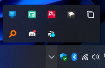
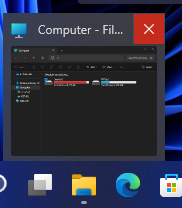

# 21996 Taskbar theme for Windows 11 Taskbar Styler

This theme tries to recreate earlier versions of the Windows 11 Taskbar, which includes:
* Windows 10 style system tray and tray overflow
* 21H2 search icon and early version of the taskbar searchbox
* Windows 10 Window thumbnails (For newer 11 builds which contain the new Window Thumbnails)
* 21370-22000.9-like acrylic with accent color support
#
**Author**: [Tails](https://github.com/milesprower2293)
#
**Taskbar**

[](screenshot.png)

**Tray Overflow**

[](screenshot-overflow.png)

**Window Thumbnails**

[](screenshot-thumbnails.png)
#
## Theme selection

The theme is integrated into the mod, and can be simply selected from the mod's
settings:

* Open the Windows 11 Taskbar Styler mod in Windhawk.
* Go to the "Settings" tab.
* Select the theme and save the settings.

## Manual installation

The theme styles can also be imported manually. To do that, follow these steps:

* Open the Windows 11 Taskbar Styler mod in Windhawk.
* Go to the "Advanced" tab.
* Copy the content below to the text box under "Mod settings" and click "Save".

<details>
<summary>Content to import (click to expand)</summary>

```json
{
"controlStyles[0].target":"Taskbar.SearchBoxButton#SearchBoxButton > Taskbar.TaskListButtonPanel#ExperienceToggleButtonRootPanel > Windows.UI.Xaml.Controls.Border#BackgroundElement",
"controlStyles[0].styles[0]":"CornerRadius=4",
"controlStyles[1].target":"Taskbar.SearchBoxButton",
"controlStyles[1].styles[0]":"Height=48",
"controlStyles[2].target":"SystemTray.OmniButton#NotificationCenterButton > Grid > ContentPresenter > ItemsPresenter > StackPanel > ContentPresenter > SystemTray.IconView#SystemTrayIcon > Grid > Grid > SystemTray.TextIconContent > Windows.UI.Xaml.Controls.Grid > SystemTray.AdaptiveTextBlock > Windows.UI.Xaml.Controls.TextBlock",
"controlStyles[2].styles[0]":"Visibility=Visible",
"controlStyles[2].styles[1]":"Text=‎ ‎‎‎",
"controlStyles[2].styles[2]":"FontSize=16.4",
"controlStyles[2].styles[3]":"FontFamily=Segoe MDL2 Assets",
"controlStyles[2].styles[4]":"Width=30",
"controlStyles[2].styles[5]":"FontWeight=ExtraLight",
"controlStyles[2].styles[6]":"Foreground:=<SolidColorBrush Color=\"{ThemeResource SystemBaseHighColor}\" />",
"controlStyles[3].target":"Windows.UI.Xaml.Controls.FontIcon#SearchBoxFontIcon",
"controlStyles[3].styles[0]":"FontFamily=Segoe Fluent Icons",
"controlStyles[3].styles[1]":"Transform3D:=<CompositeTransform3D RotationY=\"180\" TranslateX=\"16\" />",
"controlStyles[4].target":"Windows.UI.Xaml.Controls.TextBlock#SearchBoxTextBlock",
"controlStyles[4].styles[0]":"Text=Search",
"controlStyles[4].styles[1]":"FontSize=14",
"controlStyles[5].target":"SystemTray.NotifyIconView#NotifyItemIcon",
"controlStyles[5].styles[0]":"CornerRadius=0",
"controlStyles[5].styles[1]":"Height=61",
"controlStyles[5].styles[2]":"Margin=0,-5,0,0",
"controlStyles[6].target":"SystemTray.ChevronIconView",
"controlStyles[6].styles[0]":"CornerRadius=0",
"controlStyles[6].styles[1]":"Height=61",
"controlStyles[6].styles[2]":"Margin=-7,-6,0,0",
"controlStyles[6].styles[3]":"Width=24",
"controlStyles[6].styles[4]":"FontFamily=Segoe MDL2 Assets",
"controlStyles[7].target":"Taskbar.SearchBoxButton#SearchBoxButton[AutomationProperties.AutomationId=SearchButton] > Taskbar.TaskListButtonPanel > Microsoft.UI.Xaml.Controls.AnimatedVisualPlayer#Icon",
"controlStyles[7].styles[0]":"FlowDirection=1",
"controlStyles[8].target":"Windows.UI.Xaml.Controls.Grid > Windows.UI.Xaml.Controls.Button#GleamEntryPointButton > Windows.UI.Xaml.Controls.Border",
"controlStyles[8].styles[0]":"CornerRadius=4",
"controlStyles[9].target":"Windows.UI.Xaml.Controls.Grid#DynamicSearchBoxGleamContainer",
"controlStyles[9].styles[0]":"CornerRadius=4",
"controlStyles[10].target":"SystemTray.OmniButton#NotificationCenterButton",
"controlStyles[10].styles[0]":"CornerRadius=0",
"controlStyles[10].styles[1]":"Padding=0,0,0,0",
"controlStyles[10].styles[2]":"Margin=0,0,0,0",
"controlStyles[11].target":"SystemTray.Stack#NonActivatableStack",
"controlStyles[11].styles[0]":"Height=61",
"controlStyles[11].styles[1]":"CornerRadius=0",
"controlStyles[11].styles[2]":"Margin=0,-7.5,-6,0",
"controlStyles[12].target":"Rectangle#ShowDesktopPipe@CommonStates",
"controlStyles[12].styles[0]":"Width=9",
"controlStyles[12].styles[1]":"Margin=0,0,-10,0",
"controlStyles[12].styles[2]":"Height=500",
"controlStyles[12].styles[3]":"Fill@Active:=<AcrylicBrush TintColor=\"{ThemeResource SystemBaseLowColor}\" TintOpacity=\"0.5\" Opacity=\"0\"/>",
"controlStyles[12].styles[4]":"Stroke:=<SolidColorBrush Color=\"{ThemeResource SystemBaseHighColor}\" Opacity=\"0.5\"/>",
"controlStyles[13].target":"SystemTray.OmniButton#ControlCenterButton",
"controlStyles[13].styles[0]":"Padding=0",
"controlStyles[13].styles[1]":"CornerRadius=0",
"controlStyles[13].styles[2]":"Margin=0,0,0,0",
"controlStyles[14].target":"SystemTray.AdaptiveTextBlock#LanguageInnerTextBlock > TextBlock#InnerTextBlock",
"controlStyles[14].styles[0]":"FontFamily=Segoe UI",
"controlStyles[14].styles[1]":"Margin=-8,0,0,0",
"controlStyles[14].styles[2]":"FontSize=12",
"controlStyles[15].target":"SystemTray.SystemTrayFrame > Windows.UI.Xaml.Controls.Grid#SystemTrayFrameGrid > SystemTray.Stack#NotifyIconStack > Windows.UI.Xaml.Controls.Grid#Content > SystemTray.StackListView#IconStack > Windows.UI.Xaml.Controls.ItemsPresenter > Windows.UI.Xaml.Controls.StackPanel > Windows.UI.Xaml.Controls.ContentPresenter > SystemTray.ChevronIconView > Windows.UI.Xaml.Controls.Grid#ContainerGrid > Windows.UI.Xaml.Controls.ContentPresenter#ContentPresenter > Windows.UI.Xaml.Controls.Grid#ContentGrid > SystemTray.TextIconContent > Windows.UI.Xaml.Controls.Grid#ContainerGrid > SystemTray.AdaptiveTextBlock#Base > Windows.UI.Xaml.Controls.TextBlock#InnerTextBlock",
"controlStyles[15].styles[0]":"FontFamily=Segoe MDL2 Assets",
"controlStyles[15].styles[1]":"FontSize=12.4",
"controlStyles[15].styles[2]":"Width=22",
"controlStyles[16].target":"SystemTray.SystemTrayFrame > Windows.UI.Xaml.Controls.Grid#SystemTrayFrameGrid > SystemTray.Stack#NotifyIconStack > Windows.UI.Xaml.Controls.Grid#Content > SystemTray.StackListView#IconStack > Windows.UI.Xaml.Controls.ItemsPresenter > Windows.UI.Xaml.Controls.StackPanel > Windows.UI.Xaml.Controls.ContentPresenter",
"controlStyles[16].styles[0]":"Width=30",
"controlStyles[17].target":"SystemTray.AdaptiveTextBlock#Base > Windows.UI.Xaml.Controls.TextBlock#InnerTextBlock",
"controlStyles[17].styles[0]":"FontFamily=Segoe MDL2 Assets",
"controlStyles[18].target":"SystemTray.AdaptiveTextBlock#AccentOverlay > Windows.UI.Xaml.Controls.TextBlock#InnerTextBlock",
"controlStyles[18].styles[0]":"FontFamily=Segoe MDL2 Assets",
"controlStyles[19].target":"SystemTray.AdaptiveTextBlock#Underlay > Windows.UI.Xaml.Controls.TextBlock#InnerTextBlock",
"controlStyles[19].styles[0]":"FontFamily=Segoe MDL2 Assets",
"controlStyles[20].target":"SystemTray.OmniButton#ControlCenterButton > Grid > ContentPresenter > ItemsPresenter > StackPanel > ContentPresenter[1] > SystemTray.IconView > Grid > Grid",
"controlStyles[20].styles[0]":"Margin=-6,0,0,0",
"controlStyles[21].target":"SystemTray.Stack#MainStack > Windows.UI.Xaml.Controls.Grid#Content",
"controlStyles[21].styles[0]":"CornerRadius=0",
"controlStyles[21].styles[1]":"Height=61",
"controlStyles[21].styles[2]":"Margin=-4,-7,-4,0",
"controlStyles[22].target":"Windows.UI.Xaml.Controls.StackPanel > Windows.UI.Xaml.Controls.TextBlock#TimeInnerTextBlock",
"controlStyles[22].styles[0]":"FontFamily=Segoe UI",
"controlStyles[22].styles[1]":"TextAlignment=0",
"controlStyles[22].styles[2]":"FontSize=12",
"controlStyles[22].styles[3]":"Margin=0,-1,0,0",
"controlStyles[23].target":"Windows.UI.Xaml.Controls.StackPanel > Windows.UI.Xaml.Controls.TextBlock#DateInnerTextBlock",
"controlStyles[23].styles[0]":"FontFamily=Segoe UI",
"controlStyles[23].styles[1]":"TextAlignment=0",
"controlStyles[23].styles[2]":"FontSize=12",
"controlStyles[23].styles[3]":"Margin=0,2,0,0",
"controlStyles[24].target":"SystemTray.NotificationAreaIcons#NotificationAreaIcons > Windows.UI.Xaml.Controls.ItemsPresenter > Windows.UI.Xaml.Controls.StackPanel > Windows.UI.Xaml.Controls.ContentPresenter",
"controlStyles[24].styles[0]":"Width=23",
"controlStyles[24].styles[1]":"Margin=0,-2,0,0",
"controlStyles[25].target":"SystemTray.NotificationAreaIcons#NotificationAreaIcons > Windows.UI.Xaml.Controls.ItemsPresenter > Windows.UI.Xaml.Controls.StackPanel > Windows.UI.Xaml.Controls.ContentPresenter > SystemTray.NotifyIconView#NotifyItemIcon > Windows.UI.Xaml.Controls.Grid#ContainerGrid",
"controlStyles[25].styles[0]":"Margin=-9,0,0,0",
"controlStyles[26].target":"SystemTray.Stack#NotifyIconStack",
"controlStyles[26].styles[0]":"Width=24",
"controlStyles[27].target":"SystemTray.OmniButton#ControlCenterButton > Grid > ContentPresenter > ItemsPresenter > StackPanel > ContentPresenter > SystemTray.IconView#SystemTrayIcon > Grid > Grid > SystemTray.TextIconContent > Windows.UI.Xaml.Controls.Grid > SystemTray.AdaptiveTextBlock > Windows.UI.Xaml.Controls.TextBlock",
"controlStyles[27].styles[0]":"FontSize=16",
"controlStyles[27].styles[1]":"Margin=0,-1,-0,0",
"controlStyles[27].styles[2]":"FontWeight=0",
"controlStyles[28].target":"SystemTray.CopilotIcon#CopilotIcon",
"controlStyles[28].styles[0]":"Visibility=Visible",
"controlStyles[28].styles[1]":"Margin=0,-7,0,0",
"controlStyles[28].styles[2]":"Height=61",
"controlStyles[29].target":"SystemTray.NotificationAreaOverflow > Windows.UI.Xaml.Controls.Grid#OverflowRootGrid > Windows.UI.Xaml.Controls.Border#OverflowFlyoutBackgroundBorder",
"controlStyles[29].styles[0]":"CornerRadius=0",
"controlStyles[29].styles[1]":"Background:=<AcrylicBrush TintColor=\"{ThemeResource SystemChromeMediumColor}\" TintOpacity=\"0.76\" TintLuminosityOpacity=\"0.77\" FallbackColor=\"{ThemeResource SystemChromeMediumColor}\" />",
"controlStyles[30].target":"SystemTray.NotificationAreaOverflow > Windows.UI.Xaml.Controls.Grid#OverflowRootGrid > Windows.UI.Xaml.Controls.ItemsControl > Windows.UI.Xaml.Controls.ItemsPresenter > Windows.UI.Xaml.Controls.WrapGrid",
"controlStyles[30].styles[0]":"Margin=0,0,0,0",
"controlStyles[31].target":"SystemTray.NotifyIconView",
"controlStyles[31].styles[0]":"CornerRadius=0",
"controlStyles[32].target":"Windows.UI.Xaml.Controls.ScrollViewer > Windows.UI.Xaml.Controls.ScrollContentPresenter > Windows.UI.Xaml.Controls.Border > SystemTray.NotificationAreaOverflow",
"controlStyles[32].styles[0]":"Transform3D:=<CompositeTransform3D TranslateY=\"15\" />",
"controlStyles[33].target":"SystemTray.OmniButton#ControlCenterButton",
"controlStyles[33].styles[0]":"Visibility=Visible",
"controlStyles[34].target":"Windows.UI.Xaml.Controls.Grid#RootGrid",
"controlStyles[34].styles[0]":"Background:=<AcrylicBrush TintColor=\"{ThemeResource SystemChromeMediumHighColor}\" TintOpacity=\"0\" TintLuminosityOpacity=\"0.8\" FallbackColor=\"{ThemeResource SystemChromeMediumColor}\" />",
"controlStyles[35].target":"Taskbar.TaskbarBackground#BackgroundControl > Grid > Windows.UI.Xaml.Shapes.Rectangle#BackgroundFill",
"controlStyles[35].styles[0]":"Opacity=0.5",
"controlStyles[36].target":"Windows.UI.Xaml.Shapes.Rectangle#BackgroundStroke",
"controlStyles[36].styles[0]":"Visibility=Collapsed",
"controlStyles[37].target":"SystemTray.OmniButton#ControlCenterButton > Grid > ContentPresenter > ItemsPresenter > StackPanel > ContentPresenter[3] > SystemTray.IconView > Grid > Grid",
"controlStyles[37].styles[0]":"Margin=0,0,-6,0",
"controlStyles[38].target":"Windows.UI.Xaml.Controls.ContentPresenter#HoverFlyoutContent",
"controlStyles[38].styles[0]":"CornerRadius=0",
"controlStyles[38].styles[1]":"Margin=0,0,0,-15",
"controlStyles[38].styles[2]":"Background:=<AcrylicBrush TintColor=\"{ThemeResource SystemChromeMediumHighColor}\" TintOpacity=\"0.76\" TintLuminosityOpacity=\"0.67\" FallbackColor=\"{ThemeResource SystemChromeMediumColor}\" />",
"controlStyles[39].target":"Taskbar.TaskItemThumbnailView > Grid > TextBlock",
"controlStyles[39].styles[0]":"FontFamily=Segoe UI",
"controlStyles[39].styles[1]":"FontSize=12",
"controlStyles[39].styles[2]":"Margin=3,0,8,8",
"controlStyles[40].target":"Taskbar.TaskItemThumbnailView > Windows.UI.Xaml.Controls.Grid > Microsoft.UI.Xaml.Controls.ItemsRepeater > Windows.UI.Xaml.Controls.Image",
"controlStyles[40].styles[0]":"Margin=0,-7,0,0",
"controlStyles[41].target":"Taskbar.TaskItemThumbnailView > Grid > Button > ContentPresenter > TextBlock",
"controlStyles[41].styles[0]":"FontFamily=Segoe MDL2 Assets",
"controlStyles[42].target":"Taskbar.TaskItemThumbnailView > Grid > Button",
"controlStyles[42].styles[0]":"CornerRadius=0",
"controlStyles[42].styles[1]":"Height=32",
"controlStyles[42].styles[2]":"Margin=0,0,0,9",
"controlStyles[42].styles[3]":"Width=32",
"controlStyles[43].target":"Grid#DetailedViewGrid",
"controlStyles[43].styles[0]":"Margin=0,-7,0,0",
"controlStyles[44].target":"Taskbar.TaskItemThumbnailView > Grid > Border",
"controlStyles[44].styles[0]":"BorderBrush:=<SolidColorBrush Color=\"{ThemeResource SystemBaseHighColor}\" Opacity=\"0.5\" />", "controlStyles[44].styles[1]":"CornerRadius=0",
"controlStyles[45].target":"SystemTray.OmniButton#NotificationCenterButton > Windows.UI.Xaml.Controls.Grid > Windows.UI.Xaml.Controls.ContentPresenter > Windows.UI.Xaml.Controls.ItemsPresenter > Windows.UI.Xaml.Controls.StackPanel > Windows.UI.Xaml.Controls.ContentPresenter > SystemTray.IconView > Windows.UI.Xaml.Controls.Grid > Windows.UI.Xaml.Controls.ContentPresenter > Windows.UI.Xaml.Controls.Grid > SystemTray.TextIconContent > Windows.UI.Xaml.Controls.Grid > SystemTray.AdaptiveTextBlock#Base > Windows.UI.Xaml.Controls.TextBlock",
"controlStyles[45].styles[0]":"Text=‎",
"controlStyles[45].styles[1]":"FontWeight=Light",
"controlStyles[45].styles[2]":"FontSize=16.4",
"controlStyles[46].target":"SystemTray.OmniButton#NotificationCenterButton > Windows.UI.Xaml.Controls.Grid > Windows.UI.Xaml.Controls.ContentPresenter > Windows.UI.Xaml.Controls.ItemsPresenter > Windows.UI.Xaml.Controls.StackPanel > Windows.UI.Xaml.Controls.ContentPresenter > SystemTray.IconView",
"controlStyles[45].styles[3]":"Foreground:=<SolidColorBrush Color=\"{ThemeResource SystemBaseHighColor}\" />",
"controlStyles[45].styles[4]":"Margin=-1,0,1,0",
"controlStyles[46].styles[0]":"CornerRadius=0",
"controlStyles[46].styles[1]":"Padding=0,0,0,0",
"controlStyles[47].target":"SystemTray.DateTimeIconContent > Windows.UI.Xaml.Controls.Grid > Windows.UI.Xaml.Controls.StackPanel > Windows.UI.Xaml.Controls.TextBlock",
"controlStyles[47].styles[0]":"FontFamily=Segoe UI",
"controlStyles[47].styles[1]":"TextAlignment=Center"
}
```
</details>
