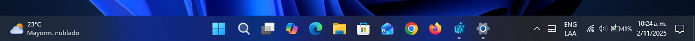
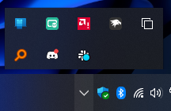

# SunValley (Legacy, formerly 21996Taskbar) theme for Windows 11 Taskbar Styler

> [!NOTE]
> This theme was superseded by the new [SunValley theme](https://github.com/ramensoftware/windows-11-taskbar-styling-guide/blob/main/Themes/SunValley/README.md)
>
> This theme will not be updated to support newer versions of Windows 11, and the reason why I decided to keep it here is for archival purposes.

This theme tries to recreate earlier versions of the Windows 11 Taskbar, which includes:
* Windows 10 style system tray and tray overflow
* Windows 10 Window thumbnails (For newer 11 builds which contain the new Window Thumbnails)
* 21370-22000.9-like acrylic with accent color support

#
**Author**: [Tails](https://github.com/milestprower92)

#
**Taskbar**

[](screenshot.png)

**Tray Overflow**

[](screenshot-overflow.png)

**Window Thumbnails**

[](screenshot-thumbnails.png)
#
## Theme selection

The theme is integrated into the mod and can be selected directly from the mod's
settings:

* Open the Windows 11 Taskbar Styler mod in Windhawk.
* Go to the "Settings" tab.
* Select the theme and save the settings.

## Manual installation

The theme styles can also be imported manually. To do that, follow these steps:

* Open the Windows 11 Taskbar Styler mod in Windhawk.
* Go to the "Settings" tab and select "Textual mode".
* Copy the content below to the text box and click "Save settings".

<details>
<summary>Content to import (click to expand)</summary>

```yaml
controlStyles:
  - target: Taskbar.SearchBoxButton#SearchBoxButton > Taskbar.TaskListButtonPanel#ExperienceToggleButtonRootPanel > Windows.UI.Xaml.Controls.Border#BackgroundElement
    styles:
      - CornerRadius=4
      - BorderThickness=0
  - target: Taskbar.SearchBoxButton
    styles:
      - Margin=0
  - target: SystemTray.OmniButton#NotificationCenterButton > Grid > ContentPresenter > ItemsPresenter > StackPanel > ContentPresenter > SystemTray.IconView#SystemTrayIcon > Grid > Grid > SystemTray.TextIconContent > Windows.UI.Xaml.Controls.Grid > SystemTray.AdaptiveTextBlock > Windows.UI.Xaml.Controls.TextBlock
    styles:
      - Visibility=Visible
      - 'Text=‎ ‎‎‎ '
      - FontSize=16.4
      - FontFamily=Segoe MDL2 Assets
      - Width=30
      - FontWeight=ExtraLight
      - Foreground:=<SolidColorBrush Color="{ThemeResource SystemBaseHighColor}" />
  - target: Windows.UI.Xaml.Controls.FontIcon#SearchBoxFontIcon
    styles:
      - FontFamily=Segoe Fluent Icons
  - target: Windows.UI.Xaml.Controls.TextBlock#SearchBoxTextBlock
    styles:
      - Text=Type here to search
      - FontSize=14
  - target: SystemTray.NotifyIconView#NotifyItemIcon
    styles:
      - CornerRadius=0
      - Height=Auto
      - Margin=0,0,0,0
      - Padding=0
      - BorderThickness=0
  - target: SystemTray.ChevronIconView
    styles:
      - CornerRadius=0
      - Height=Auto
      - Width=24
      - BorderThickness=0
      - Padding=0
  - target: Windows.UI.Xaml.Controls.Grid > Windows.UI.Xaml.Controls.Button#GleamEntryPointButton > Windows.UI.Xaml.Controls.Border
    styles:
      - CornerRadius=4
  - target: Windows.UI.Xaml.Controls.Grid#DynamicSearchBoxGleamContainer
    styles:
      - CornerRadius=4
  - target: SystemTray.OmniButton#NotificationCenterButton
    styles:
      - CornerRadius=0
      - Padding=0,0,0,0
      - Margin=0,0,0,0
      - BorderThickness=0
  - target: SystemTray.Stack#NonActivatableStack
    styles:
      - Height=Auto
      - CornerRadius=0
      - Margin=0,0,0,0
      - Padding=0
      - BorderThickness=0
  - target: Rectangle#ShowDesktopPipe@CommonStates
    styles:
      - Width=9
      - Margin=0,0,-10,0
      - Height=500
      - Fill@Active:=<AcrylicBrush TintColor="{ThemeResource SystemBaseLowColor}" TintOpacity="0.5" Opacity="0"/>
      - Stroke:=<SolidColorBrush Color="{ThemeResource SystemBaseHighColor}" Opacity="0.5"/>
  - target: SystemTray.OmniButton#ControlCenterButton
    styles:
      - Padding=0
      - CornerRadius=0
      - Margin=0,0,0,0
      - BorderThickness=0
  - target: SystemTray.AdaptiveTextBlock#LanguageInnerTextBlock > TextBlock#InnerTextBlock
    styles:
      - FontFamily=Segoe UI
      - Margin=-8,0,0,0
      - FontSize=12
  - target: SystemTray.SystemTrayFrame > Windows.UI.Xaml.Controls.Grid#SystemTrayFrameGrid > SystemTray.Stack#NotifyIconStack > Windows.UI.Xaml.Controls.Grid#Content > SystemTray.StackListView#IconStack > Windows.UI.Xaml.Controls.ItemsPresenter > Windows.UI.Xaml.Controls.StackPanel > Windows.UI.Xaml.Controls.ContentPresenter > SystemTray.ChevronIconView > Windows.UI.Xaml.Controls.Grid#ContainerGrid > Windows.UI.Xaml.Controls.ContentPresenter#ContentPresenter > Windows.UI.Xaml.Controls.Grid#ContentGrid > SystemTray.TextIconContent > Windows.UI.Xaml.Controls.Grid#ContainerGrid > SystemTray.AdaptiveTextBlock#Base > Windows.UI.Xaml.Controls.TextBlock#InnerTextBlock
    styles:
      - FontFamily=Segoe MDL2 Assets
      - FontSize=12.4
      - Foreground:=<SolidColorBrush Color="{ThemeResource SystemBaseHighColor}" />
  - target: SystemTray.SystemTrayFrame > Windows.UI.Xaml.Controls.Grid#SystemTrayFrameGrid > SystemTray.Stack#NotifyIconStack > Windows.UI.Xaml.Controls.Grid#Content > SystemTray.StackListView#IconStack > Windows.UI.Xaml.Controls.ItemsPresenter > Windows.UI.Xaml.Controls.StackPanel > Windows.UI.Xaml.Controls.ContentPresenter
    styles:
      - Width=30
  - target: SystemTray.AdaptiveTextBlock#Base > Windows.UI.Xaml.Controls.TextBlock#InnerTextBlock
    styles:
      - FontFamily=Segoe MDL2 Assets
      - Foreground:=<SolidColorBrush Color="{ThemeResource SystemBaseHighColor}" />
  - target: SystemTray.AdaptiveTextBlock#AccentOverlay > Windows.UI.Xaml.Controls.TextBlock#InnerTextBlock
    styles:
      - FontFamily=Segoe MDL2 Assets
  - target: SystemTray.AdaptiveTextBlock#Underlay > Windows.UI.Xaml.Controls.TextBlock#InnerTextBlock
    styles:
      - FontFamily=Segoe MDL2 Assets
  - target: SystemTray.OmniButton#ControlCenterButton > Grid > ContentPresenter > ItemsPresenter > StackPanel > ContentPresenter[1] > SystemTray.IconView > Grid > Grid
    styles:
      - Margin=-6,0,0,0
  - target: SystemTray.Stack#MainStack > Windows.UI.Xaml.Controls.Grid#Content
    styles:
      - CornerRadius=0
      - Height=Auto
      - Margin=0,0,0,0
      - Padding=0
      - BorderThickness=0
  - target: Windows.UI.Xaml.Controls.StackPanel > Windows.UI.Xaml.Controls.TextBlock#TimeInnerTextBlock
    styles:
      - FontFamily=Segoe UI
      - TextAlignment=0
      - FontSize=12
      - Margin=0,-1,0,0
  - target: Windows.UI.Xaml.Controls.StackPanel > Windows.UI.Xaml.Controls.TextBlock#DateInnerTextBlock
    styles:
      - FontFamily=Segoe UI
      - TextAlignment=0
      - FontSize=12
      - Margin=0,2,0,0
  - target: SystemTray.NotificationAreaIcons#NotificationAreaIcons > Windows.UI.Xaml.Controls.ItemsPresenter > Windows.UI.Xaml.Controls.StackPanel > Windows.UI.Xaml.Controls.ContentPresenter
    styles:
      - Width=23
      - Margin=0,-2,0,0
  - target: SystemTray.NotificationAreaIcons#NotificationAreaIcons > Windows.UI.Xaml.Controls.ItemsPresenter > Windows.UI.Xaml.Controls.StackPanel > Windows.UI.Xaml.Controls.ContentPresenter > SystemTray.NotifyIconView#NotifyItemIcon > Windows.UI.Xaml.Controls.Grid#ContainerGrid
    styles:
      - Transform3D:=<CompositeTransform3D TranslateY="0" TranslateX="0" />
      - HorizontalAlignment=0
  - target: SystemTray.Stack#NotifyIconStack
    styles:
      - Width=24
  - target: SystemTray.OmniButton#ControlCenterButton > Grid > ContentPresenter > ItemsPresenter > StackPanel > ContentPresenter > SystemTray.IconView#SystemTrayIcon > Grid > Grid > SystemTray.TextIconContent > Windows.UI.Xaml.Controls.Grid > SystemTray.AdaptiveTextBlock > Windows.UI.Xaml.Controls.TextBlock
    styles:
      - FontSize=16
      - Margin=0,-1,-0,0
      - FontWeight=0
  - target: SystemTray.CopilotIcon#CopilotIcon
    styles:
      - Visibility=Visible
      - Margin=0,-7,0,0
      - Height=61
  - target: SystemTray.NotificationAreaOverflow > Windows.UI.Xaml.Controls.Grid#OverflowRootGrid > Windows.UI.Xaml.Controls.Border#OverflowFlyoutBackgroundBorder
    styles:
      - CornerRadius=0
      - Background:=<AcrylicBrush TintColor="{ThemeResource SystemAltHighColor}" TintOpacity="0.7" FallbackColor="{ThemeResource SystemChromeMediumColor}" />
  - target: SystemTray.NotificationAreaOverflow > Windows.UI.Xaml.Controls.Grid#OverflowRootGrid > Windows.UI.Xaml.Controls.ItemsControl > Windows.UI.Xaml.Controls.ItemsPresenter > Windows.UI.Xaml.Controls.WrapGrid
    styles:
      - Margin=0,0,0,0
  - target: SystemTray.NotifyIconView
    styles:
      - CornerRadius=0
  - target: Windows.UI.Xaml.Controls.ScrollViewer > Windows.UI.Xaml.Controls.ScrollContentPresenter > Windows.UI.Xaml.Controls.Border > SystemTray.NotificationAreaOverflow
    styles:
      - Transform3D:=<CompositeTransform3D TranslateY="13" />
  - target: SystemTray.OmniButton#ControlCenterButton
    styles:
      - Visibility=Visible
  - target: Taskbar.TaskbarBackground#BackgroundControl > Grid
    styles:
      - Background:=<AcrylicBrush TintColor="{ThemeResource SystemChromeMediumHighColor}" TintOpacity="0" TintLuminosityOpacity="0.8" FallbackColor="{ThemeResource SystemChromeMediumColor}" />
  - target: Taskbar.TaskbarBackground#BackgroundControl > Grid > Windows.UI.Xaml.Shapes.Rectangle#BackgroundFill
    styles:
      - Opacity=0.5
  - target: Windows.UI.Xaml.Shapes.Rectangle#BackgroundStroke
    styles:
      - Visibility=Collapsed
  - target: SystemTray.OmniButton#ControlCenterButton > Grid > ContentPresenter > ItemsPresenter > StackPanel > ContentPresenter[3] > SystemTray.IconView > Grid > Grid
    styles:
      - Margin=2,0,-8,0
      - 'RenderTransform:=<ScaleTransform ScaleX="0.86" /> '
  - target: Windows.UI.Xaml.Controls.ContentPresenter#HoverFlyoutContent
    styles:
      - CornerRadius=0
      - Margin=0,0,0,-15
      - Background:=<AcrylicBrush TintColor="{ThemeResource SystemAltHighColor}" TintOpacity="0.7" FallbackColor="{ThemeResource SystemChromeMediumColor}" />
  - target: Taskbar.TaskItemThumbnailView > Grid > TextBlock
    styles:
      - FontFamily=Segoe UI
      - FontSize=12
      - Margin=3,0,8,8
  - target: Taskbar.TaskItemThumbnailView > Windows.UI.Xaml.Controls.Grid > Microsoft.UI.Xaml.Controls.ItemsRepeater > Windows.UI.Xaml.Controls.Image
    styles:
      - Margin=0,-7,0,0
  - target: Taskbar.TaskItemThumbnailView > Grid > Button > ContentPresenter > TextBlock
    styles:
      - FontFamily=Segoe MDL2 Assets
  - target: Taskbar.TaskItemThumbnailView > Grid > Button
    styles:
      - CornerRadius=0
      - Height=32
      - Margin=0,0,0,9
      - Width=32
  - target: Grid#DetailedViewGrid
    styles:
      - Margin=0,-7,0,0
  - target: Taskbar.TaskItemThumbnailView > Grid > Border
    styles:
      - BorderBrush:=<SolidColorBrush Color="{ThemeResource SystemBaseHighColor}" Opacity="0.5" />
      - CornerRadius=0
  - target: SystemTray.OmniButton#NotificationCenterButton > Windows.UI.Xaml.Controls.Grid > Windows.UI.Xaml.Controls.ContentPresenter > Windows.UI.Xaml.Controls.ItemsPresenter > Windows.UI.Xaml.Controls.StackPanel > Windows.UI.Xaml.Controls.ContentPresenter > SystemTray.IconView > Windows.UI.Xaml.Controls.Grid > Windows.UI.Xaml.Controls.ContentPresenter > Windows.UI.Xaml.Controls.Grid > SystemTray.TextIconContent > Windows.UI.Xaml.Controls.Grid > SystemTray.AdaptiveTextBlock#Base > Windows.UI.Xaml.Controls.TextBlock
    styles:
      - Text=‎
      - FontWeight=Light
      - FontSize=16.4
      - Foreground:=<SolidColorBrush Color="{ThemeResource SystemBaseHighColor}" />
      - Margin=-1,0,1,0
  - target: SystemTray.OmniButton#NotificationCenterButton > Windows.UI.Xaml.Controls.Grid > Windows.UI.Xaml.Controls.ContentPresenter > Windows.UI.Xaml.Controls.ItemsPresenter > Windows.UI.Xaml.Controls.StackPanel > Windows.UI.Xaml.Controls.ContentPresenter > SystemTray.IconView
    styles:
      - CornerRadius=0
      - Padding=0,0,0,0
  - target: SystemTray.DateTimeIconContent > Windows.UI.Xaml.Controls.Grid > Windows.UI.Xaml.Controls.StackPanel > Windows.UI.Xaml.Controls.TextBlock
    styles:
      - FontFamily=Segoe UI
      - TextAlignment=Center
  - target: SystemTray.OmniButton#ControlCenterButton > Grid > ContentPresenter > ItemsPresenter > StackPanel > ContentPresenter[2] > SystemTray.IconView > Grid > Grid
    styles:
      - Margin=0,0,-3,0
  - target: Taskbar.ThumbBarButton > ContentPresenter
    styles:
      - CornerRadius=0
      - Background:=<SolidColorBrush Opacity="0.5" />
      - BorderBrush:=<AcrylicBrush TintColor="{ThemeResource SystemChromeLowColor}" FallbackColor="{ThemeResource SystemChromeLowColor}" />
  - target: Taskbar.ThumbBarButton > ContentPresenter > Image
    styles:
      - Height=15
      - Width=15
  - target: SearchUx.SearchUI.SearchButtonRootGrid > Border
    styles:
      - CornerRadius=4
  - target: TextBlock#BatteryTextBlock
    styles:
      - FontFamily=Segoe UI
      - Margin=2,0,-2,0
  - target: SystemTray.BatteryIconContent > Grid > Windows.UI.Xaml.Controls.StackPanel > Grid > TextBlock
    styles:
      - RenderTransform:=<ScaleTransform ScaleX="1" />
  - target: SystemTray.IconView#SystemTrayIcon > Grid#ContainerGrid > Border#BackgroundBorder
    styles:
      - CornerRadius=0
      - Opacity=0
  - target: Windows.UI.Xaml.Controls.Button#GleamEntryPointButton > Windows.UI.Xaml.Controls.Border > Windows.UI.Xaml.Controls.ContentPresenter
    styles:
      - CornerRadius=3
  - target: 'SearchUx.SearchUI.SearchButtonRootGrid '
    styles:
      - Margin=2,0,0,0
  - target: SystemTray.ChevronIconView > Grid > ContentPresenter
    styles:
      - Transform3D:=<CompositeTransform3D TranslateY="-1" TranslateX="2" />
      - HorizontalAlignment=0
  - target: Border#SearchPillBackgroundElement
    styles:
      - CornerRadius=4
  - target: Grid#ConfirmatorMainGrid
    styles:
      - Background:=<AcrylicBrush TintColor="{ThemeResource SystemChromeMediumHighColor}" TintOpacity="0" TintLuminosityOpacity="0.8" FallbackColor="{ThemeResource SystemChromeMediumColor}" />
      - BorderBrush:=<AcrylicBrush TintColor="{ThemeResource SystemChromeHighColor}" TintOpacity="0" TintLuminosityOpacity="0.3" FallbackColor="{ThemeResource SystemChromeMediumColor}" />
      - CornerRadius=6
      - BorderThickness=0,1,0,0
  - target: Slider > Grid > Grid > Grid > Windows.UI.Xaml.Controls.Primitives.Thumb#HorizontalThumb
    styles:
      - Visibility=Visible
      - Height=18
      - Width=18
  - target: Slider > Grid > Grid > Grid > Windows.UI.Xaml.Controls.Primitives.Thumb#HorizontalThumb > Border
    styles:
      - BorderBrush:=<AcrylicBrush TintColor="{ThemeResource SystemChromeLowColor}" TintOpacity="0.7" TintLuminosityOpacity="0.7" FallbackColor="{ThemeResource SystemChromeMediumColor}" />
      - BorderThickness=4
      - Background:=<SolidColorBrush Color="{ThemeResource SystemAccentColorLight1}" />
      - CornerRadius=10
  - target: Slider > Grid > Grid > Grid > Rectangle#HorizontalDecreaseRect
    styles:
      - Fill:=<SolidColorBrush Color="{ThemeResource SystemAccentColorLight1}" />
  - target: Slider > Grid > Grid > Grid > Windows.UI.Xaml.Controls.Primitives.Thumb#HorizontalThumb
    styles:
      - BorderBrush:=<AcrylicBrush TintColor="{ThemeResource SystemChromeHighColor}" TintOpacity="0.7" TintLuminosityOpacity="0.7" FallbackColor="{ThemeResource SystemChromeMediumColor}" />
      - BorderThickness=0,1,0,0
```
</details>
