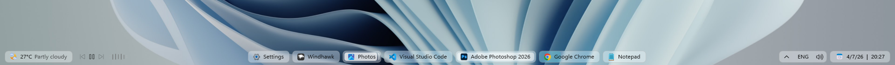
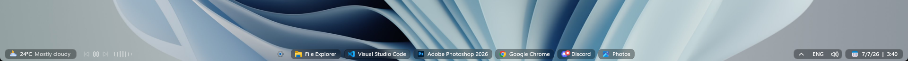
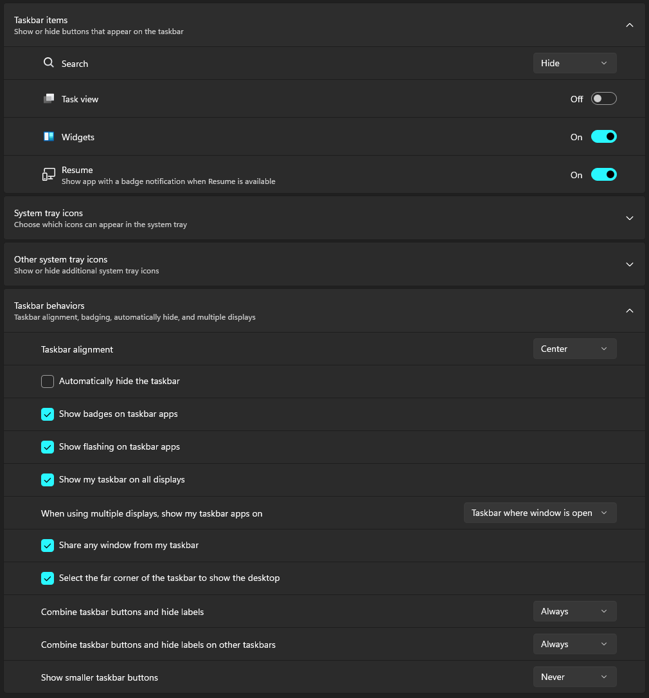
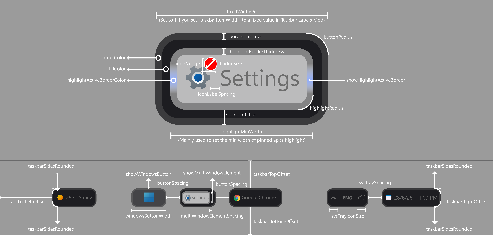

# AdaptivePills theme for Windows 11 Taskbar Styler

**Author**: [Deen-0x](https://github.com/Deen-0x)

## Description
AdaptivePills. A sleek, minimal reinterpretation of the Windows 11 taskbar with a background that turns task buttons into rounded adaptive pills that keep the native feel but breathe more.

The theme is very parameterized. You can tweak styleConstants easily to generate various designs/adjustments. Scroll to the bottom for more info. 

## Demo (27" Monitor | 1920x1080)
Light Mode



Dark Mode


## Notes
- Theme is designed on Windows 11 - 25H2 (OS Build 26200.8737)
- Tested on monitors: 1920x1080 (100% scaling) | 3840x2160 (250% scaling)
- Designed for both light and dark modes
- Designed to work with: Search - Hide | Task view - Off  | *Widgets - On | Taskbar alignment - Center | Show smaller taskbar buttons - Never

  <details>
  <summary>Click to expand to view Taskbar Windows Settings for similar results</summary>

  
  </details><br>
  
- Activated border indicator for opened app - Optional
- Windows Start button display - Optional
- *Widgets must be installed to enable the weather widget on the left. Install it back if you previously removed it:
   https://apps.microsoft.com/detail/9mssgkg348sp

## Required Windhawk Mods for similar results
To achieve similar results, install and configure the following Windhawk mods in addition to Taskbar Styler (click each to expand settings):

  <details>
  <summary>Taskbar Height and Icon Size.</summary>

  ```yaml
  TaskbarHeight: 37
  IconSize: 15
  TaskbarButtonWidth: 30
  IconSizeSmall: 15
  TaskbarButtonWidthSmall: 15
  ```
  </details><br>

  <details>
  <summary>Taskbar Labels for Windows 11 – to control panels width. You may increase taskbarItemWidth value to achieve longer buttons (just make sure to flip fixedWidthOn = 0 to 1 in the theme StyleConstants).</summary>

  ```yaml
  mode: labelsWithCombining
  taskbarItemWidth: 0
  runningIndicatorStyle: fullWidth
  progressIndicatorStyle: sameAsRunningIndicatorStyle
  excludedPrograms:
    - ''
  minimumTaskbarItemWidth: 70
  maximumTaskbarItemWidth: 200
  fontSize: 12
  fontFamily: ''
  textTrimming: characterEllipsis
  leftAndRightPaddingSize: 0
  spaceBetweenIconAndLabel: 0
  runningIndicatorHeight: -1
  runningIndicatorVerticalOffset: 0
  alwaysShowThumbnailLabels: 0
  labelForSingleItem: ''
  labelForMultipleItems: ''

  ```
  </details><br>

  <details>
  <summary>Taskbar Clock Customization – for styling the clock.</summary>

  ```yaml
  ShowSeconds: 0
  TimeFormat: ''
  DateFormat: d/M/y
  WeekdayFormat: custom
  WeekdayFormatCustom: Sun, Mon, Tue, Wed, Thu, Fri, Sat
  TopLine: ''
  BottomLine: 📅  %date%  |  %time%
  MiddleLine: '%weekday%'
  TooltipLine: '%web1_full%'
  TooltipLineMode: append
  Width: 180
  Height: 60
  MaxWidth: 0
  TextSpacing: 1
  DataCollection:
    NetworkMetricsFormat: mbs
    NetworkMetricsFixedDecimals: -1
    PercentageFormat: spacePaddingAndSymbol
    UpdateInterval: 1
    NetworkAdapterName: ''
    GpuAdapterName: ''
  MediaPlayer:
    IgnoredPlayers:
      - ''
    MaxLength: 28
    NoMediaText: No media
    RemoveBrackets: 0
  WebContentWeatherLocation: ''
  WebContentWeatherFormat: '%c 🌡️%t 🌬️%w'
  WebContentWeatherUnits: autoDetect
  WebContentsItems:
    - Url: https://rss.nytimes.com/services/xml/rss/nyt/World.xml
      BlockStart: <item>
      Start: <title>
      End: </title>
      ContentMode: xmlHtml
      SearchReplace:
        - Search: ''
          Replace: ''
      MaxLength: 28
  WebContentsUpdateInterval: 10
  TimeZones:
    - Eastern Standard Time
  TimeStyle:
    Hidden: 1
    TextColor: ''
    TextAlignment: Right
    FontSize: 0
    FontFamily: ''
    FontWeight: ''
    FontStyle: ''
    FontStretch: ''
    CharacterSpacing: 0
  DateStyle:
    Hidden: 0
    TextColor: ''
    TextAlignment: ''
    FontSize: 12
    FontFamily: ''
    FontWeight: Medium
    FontStyle: Normal
    FontStretch: ''
    CharacterSpacing: 0
  oldTaskbarOnWin11: 0
  ```
  </details><br>

  <details>
  <summary>Taskbar Background Helper - for a background fill behind buttons when a window is expanded.</summary>

  ```yaml
  backgroundStyle: acrylicBlur
  color:
    red: 250 
    green: 250
    blue: 250
    accentColor: 0
    transparency: 190
  onlyWhenMaximized: 1
  excludedPrograms:
    - ''
  styleForDarkMode:
    use: 1
    backgroundStyle: acrylicBlur
    color:
      red: 0
      green: 0
      blue: 0
      accentColor: 0
      transparency: 250
  ```
  </details><br>

  <details>
  <summary>Taskbar tray system icon tweaks - to set showDesktopButtonWidth and declutter the system tray icons.</summary>

  ```yaml
  hideVolumeIcon: 0
  hideNetworkIcon: 1
  hideBatteryIcon: 1
  grayscaleBatteryIcon: 0
  hideMicrophoneIcon: 0
  hideGeolocationIcon: 1
  hideStudioEffectsIcon: 0
  hideRecallIcon: 0
  hideLanguageBar: 0
  hideLanguageSupplementaryIcons: 1
  hideBellIcon: never
  showDesktopButtonWidth: 12
  ```
  </details><br>

## Recommended visual Windhawk Mods
To remove clipped flyout shadows, install and configure the following Windhawk mods (click each to expand settings):

  <details>
  <summary>Windows 11 Notification Center Styler.</summary>

  ```yaml
  controlStyles:
    - target: Grid#NotificationCenterGrid
      styles:
        - Shadow :=
    - target: Grid#CalendarCenterGrid
      styles:
        - Shadow :=
    - target: Grid#ControlCenterRegion
      styles:
        - Shadow :=
  ```
  </details><br>

  <details>
  <summary>Windows 11 Start Menu Styler.</summary>

  ```yaml
  controlStyles:
    - target: Windows.UI.Xaml.Controls.Border#DropShadow
      styles:
        - Visibility=Collapsed
    - target: Windows.UI.Xaml.Controls.Border#StartDropShadow
      styles:
        - Visibility=Collapsed
    - target: Windows.UI.Xaml.Controls.Border#RootGridDropShadow
      styles:
        - Visibility=Collapsed
    - target: Windows.UI.Xaml.Controls.Border#RightCompanionDropShadow
      styles:
        - Visibility=Collapsed
  ```
  </details>

## Theme selection

The theme is integrated into the mod and can be selected directly from the mod's
settings:

* Open the Windows 11 Taskbar Styler mod in Windhawk.
* Go to the "Settings" tab.
* Select the theme "AdaptivePills" and save the settings.

## Manual installation

The theme styles can also be imported manually. To do that, follow these steps:

* Open the Windows 11 Taskbar Styler mod in Windhawk.
* Go to the "Settings" tab and select "Textual mode".
* Copy the content below to the text box and click "Save settings".

<details>
<summary>Theme content to import (click to expand)</summary>

```yaml
styleConstants:
  - taskbarLeftOffset = 10
  - taskbarRightOffset = 10
  - taskbarTopOffset = 6
  - taskbarBottomOffset = 5
  - sysTraySpacing = 6
  - buttonSpacing = 6
  - highlightOffset = 4
  - borderThickness = 1
  - highlightBorderThickness = 1
  - buttonRadius = 7
  - highlightRadius = {{$buttonRadius*0.69}}
  - showHighlightActiveBorder = 0
  - showMultiWindowElement = 1
  - multiWindowElementSpacing = 2
  - highlightMinWidth = 43
  - iconLabelSpacing = 5
  - leftRightPadding = 8
  - badgeSize = 13
  - badgeNudge = 10,6,0,0
  - sysTrayIconSize = 15
  - taskbarSidesRounded = 1
  - showWindowsButton = 0
  - windowsButtonWidth = 50
  - fillColor = <WindhawkBlur BlurAmount="8" TintColor="{ThemeResource AdaptiveFill}" TintOpacity="0.45" TintLuminosityOpacity="0.8" NoiseOpacity="0.15"/>
  - borderColor = <SolidColorBrush Color="{ThemeResource AdaptiveBorder}"/>
  - highlightActiveBorderColor = <SolidColorBrush Color="{ThemeResource SystemAccentColor}" Opacity="0.6"/>
  - progressColor = <SolidColorBrush Color="{ThemeResource SystemAccentColor}" Opacity="0.2"/>
controlStyles:
  - target: ScrollViewer > ScrollContentPresenter > Border > Grid > Taskbar.TaskbarFrame#TaskbarFrame
    styles:
      - Height =>TaskbarHeight
  - target: Taskbar.TaskListButton#TaskListButton > Taskbar.TaskListLabeledButtonPanel#IconPanel
    styles:
      - Padding := 2,0,2,0
      - MinWidth := $highlightMinWidth
  - target: Taskbar.TaskListLabeledButtonPanel@CommonStates > Border#BackgroundElement
    styles:
      - Height := {{TaskbarHeight-($taskbarBottomOffset+$taskbarTopOffset)-2*$highlightOffset}}
      - Margin := {{$highlightOffset}},{{$taskbarTopOffset-$highlightOffset}},{{$highlightOffset+2}},{{$taskbarBottomOffset-$highlightOffset}}
      - Margin@MultiWindowNormal := {{$highlightOffset}},{{$taskbarTopOffset-$highlightOffset}},{{($highlightOffset+2)*(1-$showMultiWindowElement)+($multiWindowElementSpacing+9)*$showMultiWindowElement}},{{$taskbarBottomOffset-$highlightOffset}}
      - Margin@MultiWindowPointerOver := {{$highlightOffset}},{{$taskbarTopOffset-$highlightOffset}},{{($highlightOffset+2)*(1-$showMultiWindowElement)+($multiWindowElementSpacing+9)*$showMultiWindowElement}},{{$taskbarBottomOffset-$highlightOffset}}
      - Margin@MultiWindowActive := {{$highlightOffset}},{{$taskbarTopOffset-$highlightOffset}},{{($highlightOffset+2)*(1-$showMultiWindowElement)+($multiWindowElementSpacing+9)*$showMultiWindowElement}},{{$taskbarBottomOffset-$highlightOffset}}
      - Margin@MultiWindowPressed := {{$highlightOffset}},{{$taskbarTopOffset-$highlightOffset}},{{($highlightOffset+2)*(1-$showMultiWindowElement)+($multiWindowElementSpacing+9)*$showMultiWindowElement}},{{$taskbarBottomOffset-$highlightOffset}}
      - Margin@RequestingAttentionMulti := {{$highlightOffset}},{{$taskbarTopOffset-$highlightOffset}},{{($highlightOffset+2)*(1-$showMultiWindowElement)+($multiWindowElementSpacing+9)*$showMultiWindowElement}},{{$taskbarBottomOffset-$highlightOffset}}
      - Margin@RequestingAttentionMultiPointerOver := {{$highlightOffset}},{{$taskbarTopOffset-$highlightOffset}},{{($highlightOffset+2)*(1-$showMultiWindowElement)+($multiWindowElementSpacing+9)*$showMultiWindowElement}},{{$taskbarBottomOffset-$highlightOffset}}
      - Margin@RequestingAttentionMultiPressed := {{$highlightOffset}},{{$taskbarTopOffset-$highlightOffset}},{{($highlightOffset+2)*(1-$showMultiWindowElement)+($multiWindowElementSpacing+9)*$showMultiWindowElement}},{{$taskbarBottomOffset-$highlightOffset}}
      - CornerRadius := $highlightRadius
      - BorderThickness := $highlightBorderThickness
      - BorderThickness@ActiveNormal := {{$highlightBorderThickness*$showHighlightActiveBorder}}
      - BorderThickness@ActivePointerOver := {{$highlightBorderThickness*$showHighlightActiveBorder}}
      - BorderThickness@MultiWindowActive := {{$highlightBorderThickness*$showHighlightActiveBorder}}
      - BorderThickness@MultiWindowPointerOver := {{$highlightBorderThickness*$showHighlightActiveBorder}}
      - VerticalAlignment = 1
      - BorderBrush@ActiveNormal := $highlightActiveBorderColor
      - BorderBrush@ActivePointerOver := $highlightActiveBorderColor
      - BorderBrush@MultiWindowActive := $highlightActiveBorderColor
      - Canvas.ZIndex = 2
  - target: Taskbar.TaskListLabeledButtonPanel#IconPanel > Rectangle#RunningIndicator
    styles:
      - Visibility = Visible
      - Height := {{TaskbarHeight-($taskbarBottomOffset+$taskbarTopOffset)}}
      - Margin = 0,{{$taskbarTopOffset}},0,{{$taskbarBottomOffset}}
      - RadiusX := $buttonRadius
      - RadiusY := $buttonRadius
      - StrokeThickness := $borderThickness
      - VerticalAlignment = 1
      - Fill := $fillColor
      - Stroke := $borderColor
      - Canvas.ZIndex = -1
  - target: Microsoft.UI.Xaml.Controls.ProgressBar#ProgressIndicator
    styles:
      - VerticalAlignment = 3
      - HorizontalAlignment = 3
      - Margin = -1,{{$taskbarTopOffset}},1,{{$taskbarBottomOffset}}
      - Height := {{TaskbarHeight-($taskbarBottomOffset+$taskbarTopOffset)}}
  - target: Microsoft.UI.Xaml.Controls.ProgressBar#ProgressIndicator > Grid#LayoutRoot
    styles:
      - Background := $fillColor
      - BorderThickness := $borderThickness
      - BorderBrush := $borderColor
      - CornerRadius := $buttonRadius
  - target: Border#ProgressBarRoot > Border > Grid
    styles:
      - Height = Auto
  - target: Grid#LayoutRoot@CommonStates > Border#ProgressBarRoot > Border > Grid > Rectangle#ProgressBarTrack
    styles:
      - Fill := transparent
  - target: Grid#LayoutRoot@CommonStates > Border#ProgressBarRoot > Border > Grid > Rectangle#DeterminateProgressBarIndicator
    styles:
      - RadiusX := $highlightRadius
      - RadiusY := $highlightRadius
      - Fill := $progressColor
      - Fill@Paused := <SolidColorBrush Color="orange" Opacity="0.2"/>
  - target: Border#MultiWindowElement
    styles:
      - Visibility :={{1-$showMultiWindowElement}}
      - Height := {{TaskbarHeight-($taskbarBottomOffset+$taskbarTopOffset)-2*$highlightOffset}}
      - Margin := 0,0,5,0
      - HorizontalAlignment = 2
      - Canvas.ZIndex = 2
  - target: Taskbar.TaskListLabeledButtonPanel@CommonStates > TextBlock#LabelControl
    styles:
      - Margin := {{$iconLabelSpacing-6}},{{$taskbarTopOffset}},6,{{$taskbarBottomOffset+2}}
      - Padding := {{$leftRightPadding}},0
      - HorizontalAlignment = 1
      - VerticalAlignment = 1
      - Canvas.ZIndex = 3
  - target: Taskbar.TaskListButton#TaskListButton
    styles:
      - Margin := {{$buttonSpacing-6}},0,0,0
  - target: Taskbar.TaskListButton#TaskListButton > Taskbar.TaskListLabeledButtonPanel#IconPanel > Image#Icon
    styles:
      - Margin := 0,{{$taskbarTopOffset}},0,{{$taskbarBottomOffset}}
      - HorizontalAlignment = 2
      - Canvas.ZIndex = 3
  - target: Taskbar.TaskbarBackground#BackgroundControl > Grid > Rectangle#BackgroundFill
    styles:
      - Visibility = Collapsed
  - target: Rectangle#BackgroundStroke
    styles:
      - Visibility = Collapsed
  - target: Taskbar.TaskbarExtensionElement
    styles:
      - Visibility = Collapsed
  - target: Taskbar.ExperienceToggleButton#LaunchListButton > Taskbar.TaskListButtonPanel#ExperienceToggleButtonRootPanel
    styles:
      - Visibility := {{1-$showWindowsButton}}
      - Width := $windowsButtonWidth
      - Margin = 0,0,2,0
  - target: Taskbar.ExperienceToggleButton#LaunchListButton > Taskbar.TaskListButtonPanel#ExperienceToggleButtonRootPanel > Border#BackgroundElement
    styles:
      - Margin := 0,{{$taskbarTopOffset-4}},0,{{$taskbarBottomOffset-4}}
      - Padding = 5
      - CornerRadius := $buttonRadius
      - BorderThickness := $borderThickness
      - Background := $fillColor
      - BorderBrush := $borderColor
  - target: Taskbar.TaskListLabeledButtonPanel#IconPanel > Image#OverlayIcon
    styles:
      - Width := $badgeSize
      - Height := $badgeSize
      - Margin := $badgeNudge
      - Canvas.ZIndex = 3
  - target: Taskbar.TaskListLabeledButtonPanel#IconPanel > Taskbar.Badge#BadgeControl
    styles:
      - MinWidth := $badgeSize
      - Width := $badgeSize
      - Height := $badgeSize
      - Margin := $badgeNudge
      - Canvas.ZIndex = 3
  - target: Taskbar.TaskListLabeledButtonPanel#IconPanel > Taskbar.Badge#BadgeControl > Grid > TextBlock#BadgeText
    styles:
      - FontSize = 10
      - HorizontalAlignment = 1
  - target: SystemTray.SystemTrayFrame > Grid#SystemTrayFrameGrid > SystemTray.OmniButton#NotificationCenterButton
    styles:
      - Margin := 0,0,{{$taskbarRightOffset-12}},0
  - target: SystemTray.SystemTrayFrame > Grid#SystemTrayFrameGrid > SystemTray.OmniButton#NotificationCenterButton > Grid
    styles:
      - Margin := {{$sysTraySpacing}},{{$taskbarTopOffset}},0,{{$taskbarBottomOffset}}
      - Padding := {{-$borderThickness}}
      - CornerRadius := {{$buttonRadius}},{{$buttonRadius*$taskbarSidesRounded}},{{$buttonRadius*$taskbarSidesRounded}},{{$buttonRadius}}
      - BorderThickness := $borderThickness
      - Background := $fillColor
      - BorderBrush := $borderColor
  - target: SystemTray.OmniButton#NotificationCenterButton > Grid > Border#BackgroundBorder
    styles:
      - Margin := {{$highlightOffset}}
      - CornerRadius := $highlightRadius
      - BorderThickness := $highlightBorderThickness
  - target: SystemTray.IconView#SystemTrayIcon > Grid#ContainerGrid > Border#BackgroundBorder
    styles:
      - Margin := {{$highlightOffset}}
      - CornerRadius := $highlightRadius
      - BorderThickness := $highlightBorderThickness
  - target: SystemTray.ChevronIconView > Grid#ContainerGrid > Border#BackgroundBorder
    styles:
      - Margin := {{$highlightOffset}}
      - CornerRadius := $highlightRadius
      - BorderThickness := $highlightBorderThickness
  - target: SystemTray.OmniButton#ControlCenterButton > Grid > Border#BackgroundBorder
    styles:
      - Margin := {{$highlightOffset}}
      - CornerRadius := $highlightRadius
      - BorderThickness := $highlightBorderThickness
  - target: SystemTray.NotifyIconView#NotifyItemIcon > Grid#ContainerGrid > Border#BackgroundBorder
    styles:
      - Margin := {{$highlightOffset}}
      - CornerRadius := $highlightRadius
      - BorderThickness := $highlightBorderThickness
  - target: SystemTray.OmniButton#NotificationCenterButton > Grid > ContentPresenter#ContentPresenter
    styles:
      - Margin = 0,0,0,1
  - target: SystemTray.SystemTrayFrame > Grid#SystemTrayFrameGrid > SystemTray.OmniButton#ControlCenterButton > Grid
    styles:
      - Margin := 0,{{$taskbarTopOffset}},0,{{$taskbarBottomOffset}}
      - Padding := {{-$borderThickness}}
      - CornerRadius := 0,$buttonRadius,$buttonRadius,0
      - BorderThickness := 0,$borderThickness,$borderThickness,$borderThickness
      - Background := $fillColor
      - BorderBrush := $borderColor
  - target: SystemTray.SystemTrayFrame > Grid#SystemTrayFrameGrid > SystemTray.Stack#MainStack > Grid#Content
    styles:
      - Margin := 0,{{$taskbarTopOffset}},0,{{$taskbarBottomOffset}}
      - Padding := {{-$borderThickness}}
      - BorderThickness := 0,$borderThickness,0,$borderThickness
      - Background := $fillColor
      - BorderBrush := $borderColor
  - target: SystemTray.SystemTrayFrame > Grid#SystemTrayFrameGrid > SystemTray.Stack#NonActivatableStack > Grid#Content
    styles:
      - Margin := 0,{{$taskbarTopOffset}},0,{{$taskbarBottomOffset}}
      - Padding := {{-$borderThickness}}
      - BorderThickness := 0,$borderThickness,0,$borderThickness
      - Background := $fillColor
      - BorderBrush := $borderColor
  - target: SystemTray.SystemTrayFrame > Grid#SystemTrayFrameGrid > SystemTray.NotificationAreaIcons#NotificationAreaIcons > ItemsPresenter > StackPanel
    styles:
      - Margin := 0,{{$taskbarTopOffset}},0,{{$taskbarBottomOffset}}
      - Padding := {{-$borderThickness}}
      - BorderThickness := 0,$borderThickness,0,$borderThickness
      - Background := $fillColor
      - BorderBrush := $borderColor
  - target: SystemTray.Stack#NotifyIconStack > Grid#Content > SystemTray.StackListView#IconStack > ItemsPresenter > StackPanel > ContentPresenter
    styles:
      - Margin := 0,{{$taskbarTopOffset}},0,{{$taskbarBottomOffset}}
      - Padding := {{-$borderThickness}}
      - BorderThickness := $borderThickness,$borderThickness,0,$borderThickness
      - Background := $fillColor
      - CornerRadius := $buttonRadius,0,0,$buttonRadius
      - BorderBrush := $borderColor
  - target: SystemTray.TextIconContent > Grid#ContainerGrid > SystemTray.AdaptiveTextBlock#Base > TextBlock#InnerTextBlock
    styles:
      - FontSize := $sysTrayIconSize
  - target: SystemTray.ImageIconContent > Grid#ContainerGrid > Image
    styles:
      - Width := $sysTrayIconSize
      - Height := $sysTrayIconSize
  - target: SystemTray.AdaptiveTextBlock#LanguageInnerTextBlock > TextBlock#InnerTextBlock
    styles:
      - Margin = 0,0,0,2
      - MaxLines = 1
  - target: SystemTray.IconView#SystemTrayIcon > Grid#ContainerGrid > Grid#ContentGrid > SystemTray.DateTimeIconContent > Grid#ContainerGrid > StackPanel
    styles:
      - Margin = 1,-2,1,0
  - target: Grid#OverflowRootGrid > Border
    styles:
      - Background := $fillColor
      - Shadow :=
  - target: Taskbar.AugmentedEntryPointButton#AugmentedEntryPointButton > Taskbar.TaskListButtonPanel#ExperienceToggleButtonRootPanel > Border#BackgroundElement
    styles:
      - CornerRadius := $highlightRadius
  - target: Taskbar.AugmentedEntryPointButton#AugmentedEntryPointButton > Taskbar.TaskListButtonPanel#ExperienceToggleButtonRootPanel > Grid#AugmentedEntryPointContentGrid > Grid > Grid > AdaptiveCards.Rendering.Uwp.WholeItemsPanel > Border > AdaptiveCards.Rendering.Uwp.WholeItemsPanel > Grid > Border#LargeTicker2 > AdaptiveCards.Rendering.Uwp.WholeItemsPanel > TextBlock[1]
    styles:
      - ActualWidth => WeatherCondWidth
      - RenderTransform := <TranslateTransform X="0" Y="8" />
  - target: Taskbar.AugmentedEntryPointButton#AugmentedEntryPointButton > Taskbar.TaskListButtonPanel#ExperienceToggleButtonRootPanel > Grid#AugmentedEntryPointContentGrid > Grid > Grid > AdaptiveCards.Rendering.Uwp.WholeItemsPanel > Border > AdaptiveCards.Rendering.Uwp.WholeItemsPanel > Grid > Border#LargeTicker2 > AdaptiveCards.Rendering.Uwp.WholeItemsPanel > TextBlock[2]
    styles:
      - ActualWidth => WeatherTempWidth
      - RenderTransform := <TranslateTransform X="{{WeatherCondWidth+7}}" Y="-8" />
  - target: Taskbar.TaskListButtonPanel#ExperienceToggleButtonRootPanel > Grid#AugmentedEntryPointContentGrid
    styles:
      - Width := {{WeatherTempWidth+WeatherCondWidth+53}}
      - HorizontalAlignment = 0
  - target: Grid#AugmentedEntryPointContentGrid
    styles:
      - Margin = 5,0,0,0
  - target: Taskbar.AugmentedEntryPointButton#AugmentedEntryPointButton > Taskbar.TaskListButtonPanel#ExperienceToggleButtonRootPanel
    styles:
      - Width := {{WeatherTempWidth+WeatherCondWidth+53}}
      - Height = Auto
      - Margin := {{$taskbarLeftOffset}},{{$taskbarTopOffset}},58,{{$taskbarBottomOffset}}
      - Padding = 0
      - CornerRadius := {{$buttonRadius*$taskbarSidesRounded}},{{$buttonRadius}},{{$buttonRadius}},{{$buttonRadius*$taskbarSidesRounded}}
      - BorderThickness := $borderThickness
      - Background := $fillColor
      - BorderBrush := $borderColor
  - target: Taskbar.AugmentedEntryPointButton#AugmentedEntryPointButton > Taskbar.TaskListButtonPanel#ExperienceToggleButtonRootPanel > Border#BackgroundElement
    styles:
      - Margin := {{$highlightOffset}}
      - BorderThickness := $highlightBorderThickness
  - target: ScrollViewer > ScrollContentPresenter > Border > Grid > Taskbar.TaskbarFrame#TaskbarFrame > Grid#RootGrid > Microsoft.UI.Xaml.Controls.ItemsRepeater#TaskbarFrameRepeater > Taskbar.AugmentedEntryPointButton#AugmentedEntryPointButton > Taskbar.TaskListButtonPanel#ExperienceToggleButtonRootPanel > Grid#AugmentedEntryPointContentGrid > Grid > Grid[1]
    styles:
      - HorizontalAlignment = 0
      - Margin = 3,0,0,0
  - target: ScrollViewer > ScrollContentPresenter > Border > Grid > Taskbar.TaskbarFrame#TaskbarFrame > Grid#RootGrid > Microsoft.UI.Xaml.Controls.ItemsRepeater#TaskbarFrameRepeater > Taskbar.AugmentedEntryPointButton#AugmentedEntryPointButton > Taskbar.TaskListButtonPanel#ExperienceToggleButtonRootPanel > Grid#AugmentedEntryPointContentGrid > Grid > Grid[2]
    styles:
      - HorizontalAlignment = 0
      - VerticalAlignment = 0
      - RenderTransformOrigin = -0.5,0.5
      - RenderTransform := <TransformGroup><ScaleTransform ScaleX = "0.7" ScaleY = "0.7" /><TranslateTransform X="16" Y="0" /></TransformGroup>
  - target: WindowsInternal.ComposableShell.Experiences.TextInput.Common.InputSwitcher > ContentControl > ContentPresenter > Grid
    styles:
      - Shadow :=
themeResourceVariables:
  - AdaptiveFill@Light =#FFFFFF
  - AdaptiveFill@Dark =#0F1E1E1E
  - AdaptiveBorder@Light =#FFFFFF
  - AdaptiveBorder@Dark =#B0454545
```
</details><br>

If you'd like to tweak styleConstants (located at the top of the theme content), you may use the styleConstants illustration below as a guide:

