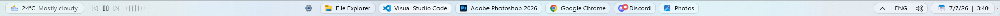
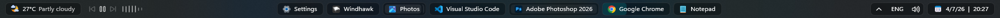
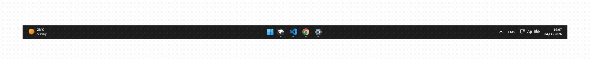

# AdaptivePills theme for Windows 11 Taskbar Styler

**Author**: [Deen-0x](https://github.com/Deen-0x)

## Description
AdaptivePills. A sleek, minimal reinterpretation of the Windows 11 taskbar with a background that turns task buttons into rounded adaptive pills that keep the native feel but breathe more.

## Light Mode
Normal

Maximized


## Dark Mode
Normal

Maximized


## Demonstration

Pill States


Comparison


## Notes
- Theme is designed on Windows 11 - 25H2
- Tested on monitors: 1920x1080 (100% scaling) | 3840x2160 (250% scaling)
- Designed for both light and dark modes
- Designed to work with:
  - *Widgets - On
  - Task view - Off
  - Search - Hidden
  - Taskbar alignment - Center
  - Show smaller taskbar buttons - Never
- *Widgets must be installed to enable the weather widget on the left. Install it back if you previously removed it.
  - https://apps.microsoft.com/detail/9mssgkg348sp
- Pinned applications are not supported (transparent background)
- Activated border indicator for opened application - Optional

## Required Windhawk Mods for similar results
To achieve similar results, install and configure the following Windhawk mods in addition to Taskbar Styler:

- Taskbar Height and Icon Size:

  <details>
  <summary>Click to expand Taskbar Height and Icon Size settings</summary>

  ```yaml
  TaskbarHeight: 41
  IconSize: 15
  TaskbarButtonWidth: 30
  IconSizeSmall: 15
  TaskbarButtonWidthSmall: 15
  ```
  </details><br>

- Taskbar Labels for Windows 11 – to control panels width:

  <details>
  <summary>Click to expand Taskbar Labels for Windows 11 settings</summary>

  ```yaml
    mode: labelsWithCombining
    taskbarItemWidth: 0
    runningIndicatorStyle: fullWidth
    progressIndicatorStyle: sameAsRunningIndicatorStyle
    excludedPrograms:
      - ''
    minimumTaskbarItemWidth: 70
    maximumTaskbarItemWidth: 200
    fontSize: 12
    fontFamily: ''
    textTrimming: characterEllipsis
    leftAndRightPaddingSize: 11
    spaceBetweenIconAndLabel: 0
    runningIndicatorHeight: 0
    runningIndicatorVerticalOffset: 0
    alwaysShowThumbnailLabels: 0
    labelForSingleItem: ''
    labelForMultipleItems: ''

  ```
  </details><br>

- Taskbar Clock Customization – for styling the clock:

  <details>
  <summary>Click to expand Taskbar Clock Customization settings</summary>

  ```yaml
  ShowSeconds: 0
  TimeFormat: ''
  DateFormat: d/M/y
  WeekdayFormat: custom
  WeekdayFormatCustom: Sun, Mon, Tue, Wed, Thu, Fri, Sat
  TopLine: ''
  BottomLine: 📅  %date%  |  %time%
  MiddleLine: '%weekday%'
  TooltipLine: '%web1_full%'
  TooltipLineMode: append
  Width: 180
  Height: 60
  MaxWidth: 0
  TextSpacing: 1
  DataCollection:
    NetworkMetricsFormat: mbs
    NetworkMetricsFixedDecimals: -1
    PercentageFormat: spacePaddingAndSymbol
    UpdateInterval: 1
    NetworkAdapterName: ''
    GpuAdapterName: ''
  MediaPlayer:
    IgnoredPlayers:
      - ''
    MaxLength: 28
    NoMediaText: No media
    RemoveBrackets: 0
  WebContentWeatherLocation: ''
  WebContentWeatherFormat: '%c 🌡️%t 🌬️%w'
  WebContentWeatherUnits: autoDetect
  WebContentsItems:
    - Url: https://rss.nytimes.com/services/xml/rss/nyt/World.xml
      BlockStart: <item>
      Start: <title>
      End: </title>
      ContentMode: xmlHtml
      SearchReplace:
        - Search: ''
          Replace: ''
      MaxLength: 28
  WebContentsUpdateInterval: 10
  TimeZones:
    - Eastern Standard Time
  TimeStyle:
    Hidden: 1
    TextColor: ''
    TextAlignment: Right
    FontSize: 0
    FontFamily: ''
    FontWeight: ''
    FontStyle: ''
    FontStretch: ''
    CharacterSpacing: 0
  DateStyle:
    Hidden: 0
    TextColor: ''
    TextAlignment: ''
    FontSize: 12
    FontFamily: ''
    FontWeight: Medium
    FontStyle: Normal
    FontStretch: ''
    CharacterSpacing: 0
  oldTaskbarOnWin11: 0
  ```
  </details><br>

- Taskbar Background Helper:

  <details>
  <summary>Click to expand Taskbar Background Helper settings</summary>

  ```yaml
  backgroundStyle: acrylicBlur
  color:
    red: 200
    green: 200
    blue: 200
    accentColor: 0
    transparency: 150
  onlyWhenMaximized: 1
  excludedPrograms:
    - ''
  styleForDarkMode:
    use: 1
    backgroundStyle: acrylicBlur
    color:
      red: 40
      green: 40
      blue: 40
      accentColor: 0
      transparency: 255
  ```
  </details>

## Recommended visual Windhawk Mods
To achieve maximum Taskbar aesthetics, install and configure the following Windhawk mods.

- Taskbar tray system icon tweaks - to declutter the system tray icons (you may also disable the language indicator if you don't need it):
  <details>
  <summary>Click to expand Taskbar tray system icon tweaks settings</summary>

  ```yaml
  hideVolumeIcon: 0
  hideNetworkIcon: 1
  hideBatteryIcon: 1
  grayscaleBatteryIcon: 0
  hideMicrophoneIcon: 0
  hideGeolocationIcon: 1
  hideStudioEffectsIcon: 0
  hideRecallIcon: 0
  hideLanguageBar: 0
  hideLanguageSupplementaryIcons: 1
  hideBellIcon: never
  showDesktopButtonWidth: 10
  ```
  </details><br>

- Windows 11 Notification Center Styler - to remove Notification Center shadows copy the content below (flyout shadows look truncated with transparent taskbar):

  <details>
  <summary>Click to expand Windows 11 Notification Center Styler settings</summary>

  ```yaml
  controlStyles:
    - target: Grid#NotificationCenterGrid
      styles:
        - Shadow :=
    - target: Grid#CalendarCenterGrid
      styles:
        - Shadow :=
    - target: Grid#ControlCenterRegion
      styles:
        - Shadow :=
  ```
  </details><br>

- Windows 11 Start Menu Styler - to remove Start Menu shadows copy the content below (shadows look truncated with transparent taskbar):
  <details>
  <summary>Click to expand Windows 11 Start Menu Styler settings</summary>

  ```yaml
  controlStyles:
    - target: Windows.UI.Xaml.Controls.Border#DropShadow
      styles:
        - Visibility=Collapsed
    - target: Windows.UI.Xaml.Controls.Border#StartDropShadow
      styles:
        - Visibility=Collapsed
    - target: Windows.UI.Xaml.Controls.Border#RootGridDropShadow
      styles:
        - Visibility=Collapsed
    - target: Windows.UI.Xaml.Controls.Border#RightCompanionDropShadow
      styles:
        - Visibility=Collapsed
  ```
  </details>

## Recommended functional Windhawk Mods

To achieve compatible Taskbar functionality, install and configure the following Windhawk mods:

- Click on empty taskbar space - to middle click show desktop on bottom right corner:
  <details>
  <summary>Click to expand Click on empty taskbar space settings</summary>

  ```yaml
  TriggerActionOptions:
    - KeyboardTriggers:
        - none
        - lctrl
        - lshift
        - lalt
        - win
        - rctrl
        - rshift
        - ralt
      MouseTrigger: middle
      TaskbarType: all
      Action: ACTION_SHOW_DESKTOP
      AdditionalArgs: arg1;arg2
  oldTaskbarOnWin11: 0
  eagerTriggerEvaluation: 1
  ```
  </details><br>

- Taskbar minimize/restore on scroll:
  <details>
  <summary>Click to expand Taskbar minimize/restore on scroll settings</summary>

  ```yaml
  scrollOverTaskbarButtons: 1
  scrollOverThumbnailPreviews: 1
  maximizeAndRestore: 0
  reverseScrollingDirection: 0
  oldTaskbarOnWin11: 0
  ```
  </details><br>

- Taskbar Volume Control - to control volume by mouse scroll wheel while hovering over the tray area:
  <details>
  <summary>Click to expand Taskbar Volume Control settings</summary>

  ```yaml
  volumeIndicator: win11
  scrollArea: notification_area
  additionalScrollRegions: ''
  middleClickToMute: 1
  ctrlScrollVolumeChange: 0
  scrollAnywhereKeys:
    shift: 0
    ctrl: 0
    alt: 0
    win: 0
  fullScreenScrolling: disabled
  noAutomaticMuteToggle: 0
  volumeChangeStep: 2
  oldTaskbarOnWin11: 0
  ```
  </details><br>

- Middle click to close on the taskbar:
  <details>
  <summary>Click to expand Middle click to close on the taskbar settings</summary>

  ```yaml
  multipleItemsBehavior: closeAll
  keysToEndTask:
    Ctrl: 1
    Alt: 0
  oldTaskbarOnWin11: 0
  ```
  </details><br>

- Disable Taskbar Thumbnails - to prevent thumbnails opening on hover:
  <details>
  <summary>Click to expand Disable Taskbar Thumbnails settings</summary>

  ```yaml
  mode: disabled
  noVirtualDesktopSwitcherHover: 0
  noTooltips: 0
  oldTaskbarOnWin11: 0
  ```
  </details><br>

- Taskbar Thumbnail Reorder:


## Theme selection

The theme is integrated into the mod and can be selected directly from the mod's
settings:

* Open the Windows 11 Taskbar Styler mod in Windhawk.
* Go to the "Settings" tab.
* Select the theme "AdaptivePills" and save the settings.

## Manual installation

The theme styles can also be imported manually. To do that, follow these steps:

* Open the Windows 11 Taskbar Styler mod in Windhawk.
* Go to the "Settings" tab and select "Textual mode".
* Copy the content below to the text box and click "Save settings".

  <details>
  <summary>Theme content to import (click to expand)</summary>
  
  ```yaml
  styleConstants:
    - fixedWidth = 0
    - pillHeight = 26
    - pillRadius = 7
    - pillBorderThickness = 1
    - pillBorderColor = <SolidColorBrush Color="{ThemeResource AdaptivePillBorder}"/>
    - pillSpacing = 6
    - highlightOffset = 4
    - highlightBorderThickness = 1
    - highlightRadius = {{$pillRadius*0.69}}
    - showHighlightActiveBorder = 0
    - iconLabelSpacing = 7
    - iconBadgeHeight = 13
    - iconBadgeSpacing = 2,5,0,0
    - highlightActiveBorderColor = <SolidColorBrush Color="{ThemeResource SystemAccentColor}" Opacity="0.9"/>
    - pillFillColor = <WindhawkBlur BlurAmount="8" TintColor="{ThemeResource AdaptivePillFill}" TintOpacity="0.45" TintLuminosityOpacity="0.8" NoiseOpacity="0.15"/>
  controlStyles:
    - target: Border#BackgroundElement
      styles:
        - CornerRadius := $highlightRadius
    - target: Taskbar.TaskListLabeledButtonPanel#IconPanel > Rectangle#RunningIndicator
      styles:
        - Visibility = Visible
        - Margin = 0,0,0,0
        - Height := $pillHeight
        - RadiusX := $pillRadius
        - RadiusY := $pillRadius
        - StrokeThickness := $pillBorderThickness
        - VerticalAlignment = 1
        - Fill := $pillFillColor
        - Stroke := $pillBorderColor
        - Canvas.ZIndex = -1
    - target: Taskbar.TaskListLabeledButtonPanel@CommonStates > Border#BackgroundElement
      styles:
        - Height := {{$pillHeight-$highlightOffset*2}}
        - Margin := {{$highlightOffset}},0,{{$highlightOffset+2}},0
        - Margin@MultiWindowNormal := {{$highlightOffset}},0,11,0
        - Margin@MultiWindowPointerOver := {{$highlightOffset}},0,11,0
        - Margin@MultiWindowActive := {{$highlightOffset}},0,11,0
        - Margin@MultiWindowPressed := {{$highlightOffset}},0,11,0
        - Margin@RequestingAttentionMulti := {{$highlightOffset}},0,11,0
        - Margin@RequestingAttentionMultiPointerOver := {{$highlightOffset}},0,11,0
        - Margin@RequestingAttentionMultiPressed := {{$highlightOffset}},0,11,0
        - BorderThickness := $highlightBorderThickness
        - BorderThickness@ActiveNormal := {{$highlightBorderThickness*$showHighlightActiveBorder}}
        - BorderThickness@ActivePointerOver := {{$highlightBorderThickness*$showHighlightActiveBorder}}
        - BorderThickness@MultiWindowActive := {{$highlightBorderThickness*$showHighlightActiveBorder}}
        - BorderThickness@MultiWindowPointerOver := {{$highlightBorderThickness*$showHighlightActiveBorder}}
        - VerticalAlignment = 1
        - BorderBrush@ActiveNormal := $highlightActiveBorderColor
        - BorderBrush@ActivePointerOver := $highlightActiveBorderColor
        - BorderBrush@MultiWindowActive := $highlightActiveBorderColor
        - BorderBrush := $highlightBorderColor
    - target: Taskbar.TaskListLabeledButtonPanel@CommonStates > TextBlock#LabelControl
      styles:
        - Margin := {{$iconLabelSpacing}},0,6,2
        - HorizontalAlignment := $fixedWidth
        - VerticalAlignment = 1
    - target: Border#MultiWindowElement
      styles:
        - Margin := 0,0,5,0
        - CornerRadius := $highlightRadius
        - Height := {{$pillHeight-$highlightOffset-$pillBorderThickness-4}}
        - HorizontalAlignment = 2
    - target: Taskbar.TaskListButton#TaskListButton
      styles:
        - Margin := {{$pillSpacing/2-3}},0,{{$pillSpacing/2-3}},0
    - target: Taskbar.TaskbarBackground#BackgroundControl > Grid > Rectangle#BackgroundFill
      styles:
        - Visibility = Collapsed
    - target: Rectangle#BackgroundStroke
      styles:
        - Visibility = Collapsed
    - target: Taskbar.SearchBoxButton
      styles:
        - Visibility = Collapsed
    - target: Taskbar.TaskListButtonPanel#ExperienceToggleButtonRootPanel
      styles:
        - Height = 0
    - target: Taskbar.TaskListLabeledButtonPanel#IconPanel > Image#OverlayIcon
      styles:
        - Width := $iconBadgeHeight
        - Height := $iconBadgeHeight
        - Margin := $iconBadgeSpacing
    - target: Taskbar.TaskListLabeledButtonPanel#IconPanel > Taskbar.Badge#BadgeControl
      styles:
        - MinWidth := $iconBadgeHeight
        - Width := $iconBadgeHeight
        - Height := $iconBadgeHeight
        - Margin := $iconBadgeSpacing
    - target: Taskbar.TaskListLabeledButtonPanel#IconPanel > Taskbar.Badge#BadgeControl > Grid > TextBlock#BadgeText
      styles:
        - FontSize = 10
        - HorizontalAlignment = 1
    - target: SystemTray.SystemTrayFrame > Grid#SystemTrayFrameGrid > SystemTray.OmniButton#NotificationCenterButton > Grid
      styles:
        - Height := $pillHeight
        - Margin := {{$pillSpacing}},0,0,0
        - Padding := {{-$pillBorderThickness}}
        - CornerRadius := $pillRadius
        - BorderThickness := $pillBorderThickness
        - Background := $pillFillColor
        - BorderBrush := $pillBorderColor
    - target: SystemTray.OmniButton#NotificationCenterButton > Grid > Border#BackgroundBorder
      styles:
        - Margin := {{$highlightOffset}}
        - CornerRadius := $highlightRadius
        - BorderThickness := $highlightBorderThickness
        - BorderBrush := $highlightBorderColor
    - target: SystemTray.IconView#SystemTrayIcon > Grid#ContainerGrid > Border#BackgroundBorder
      styles:
        - Margin := {{$highlightOffset}}
        - CornerRadius := $highlightRadius
        - BorderThickness := $highlightBorderThickness
        - BorderBrush := $highlightBorderColor
    - target: SystemTray.ChevronIconView > Grid#ContainerGrid > Border#BackgroundBorder
      styles:
        - Margin := {{$highlightOffset}}
        - CornerRadius := $highlightRadius
        - BorderThickness := $highlightBorderThickness
        - BorderBrush := $highlightBorderColor
    - target: SystemTray.OmniButton#ControlCenterButton > Grid > Border#BackgroundBorder
      styles:
        - Margin := {{$highlightOffset}}
        - CornerRadius := $highlightRadius
        - BorderThickness := $highlightBorderThickness
        - BorderBrush := $highlightBorderColor
    - target: SystemTray.NotifyIconView#NotifyItemIcon > Grid#ContainerGrid > Border#BackgroundBorder
      styles:
        - Margin := {{$highlightOffset}}
        - CornerRadius := $highlightRadius
        - BorderThickness := $highlightBorderThickness
        - BorderBrush := $highlightBorderColor
    - target: SystemTray.OmniButton#NotificationCenterButton > Grid > ContentPresenter#ContentPresenter
      styles:
        - Margin = 0,0,0,1
    - target: SystemTray.SystemTrayFrame > Grid#SystemTrayFrameGrid > SystemTray.OmniButton#ControlCenterButton > Grid
      styles:
        - Height := $pillHeight
        - Padding := {{-$pillBorderThickness}}
        - Background := $pillFillColor
        - CornerRadius := 0,$pillRadius,$pillRadius,0
        - BorderThickness := 0,$pillBorderThickness,$pillBorderThickness,$pillBorderThickness
        - BorderBrush := $pillBorderColor
    - target: SystemTray.SystemTrayFrame > Grid#SystemTrayFrameGrid > SystemTray.Stack#MainStack > Grid#Content
      styles:
        - Height := $pillHeight
        - Padding := {{-$pillBorderThickness}}
        - Background := $pillFillColor
        - BorderThickness := 0,$pillBorderThickness,0,$pillBorderThickness
        - BorderBrush := $pillBorderColor
    - target: SystemTray.SystemTrayFrame > Grid#SystemTrayFrameGrid > SystemTray.Stack#NonActivatableStack > Grid#Content
      styles:
        - Height := $pillHeight
        - Padding := {{-$pillBorderThickness}}
        - Background := $pillFillColor
        - BorderThickness := 0,$pillBorderThickness,0,$pillBorderThickness
        - BorderBrush := $pillBorderColor
    - target: SystemTray.SystemTrayFrame > Grid#SystemTrayFrameGrid > SystemTray.NotificationAreaIcons#NotificationAreaIcons > ItemsPresenter > StackPanel
      styles:
        - Height := $pillHeight
        - Margin = 0
        - Padding := {{-$pillBorderThickness}}
        - Background := $pillFillColor
        - BorderThickness := 0,$pillBorderThickness,0,$pillBorderThickness
        - BorderBrush := $pillBorderColor
    - target: SystemTray.Stack#NotifyIconStack > Grid#Content > SystemTray.StackListView#IconStack > ItemsPresenter > StackPanel > ContentPresenter
      styles:
        - Height := $pillHeight
        - Padding := {{-$pillBorderThickness}}
        - Background := $pillFillColor
        - BorderThickness := $pillBorderThickness,$pillBorderThickness,0,$pillBorderThickness
        - CornerRadius := $pillRadius,0,0,$pillRadius
        - BorderBrush := $pillBorderColor
    - target: Grid#OverflowRootGrid > Border
      styles:
        - Shadow :=
        - Background := $pillFillColor
    - target: Taskbar.AugmentedEntryPointButton#AugmentedEntryPointButton > Taskbar.TaskListButtonPanel#ExperienceToggleButtonRootPanel > Grid#AugmentedEntryPointContentGrid > Grid > Grid > AdaptiveCards.Rendering.Uwp.WholeItemsPanel > Border > AdaptiveCards.Rendering.Uwp.WholeItemsPanel > Grid > Border#LargeTicker2 > AdaptiveCards.Rendering.Uwp.WholeItemsPanel > TextBlock[1]
      styles:
        - ActualWidth => WeatherCondWidth
        - RenderTransform := <TranslateTransform X="0" Y="8" />
    - target: Taskbar.AugmentedEntryPointButton#AugmentedEntryPointButton > Taskbar.TaskListButtonPanel#ExperienceToggleButtonRootPanel > Grid#AugmentedEntryPointContentGrid > Grid > Grid > AdaptiveCards.Rendering.Uwp.WholeItemsPanel > Border > AdaptiveCards.Rendering.Uwp.WholeItemsPanel > Grid > Border#LargeTicker2 > AdaptiveCards.Rendering.Uwp.WholeItemsPanel > TextBlock[2]
      styles:
        - ActualWidth => WeatherTempWidth
        - RenderTransform := <TranslateTransform X="{{WeatherCondWidth+7}}" Y="-8" />
    - target: Taskbar.TaskListButtonPanel#ExperienceToggleButtonRootPanel > Grid#AugmentedEntryPointContentGrid
      styles:
        - Width := {{WeatherTempWidth+WeatherCondWidth+50}}
        - HorizontalAlignment = 0
    - target: Grid#AugmentedEntryPointContentGrid
      styles:
        - Margin = 5,0,0,0
    - target: Taskbar.AugmentedEntryPointButton#AugmentedEntryPointButton > Taskbar.TaskListButtonPanel#ExperienceToggleButtonRootPanel
      styles:
        - Width := {{WeatherTempWidth+WeatherCondWidth+50}}
        - Height := $pillHeight
        - Margin = 10,0,30,0
        - Padding = 0
        - CornerRadius := $pillRadius
        - BorderThickness := $pillBorderThickness
        - Background := $pillFillColor
        - BorderBrush := $pillBorderColor
    - target: Taskbar.AugmentedEntryPointButton#AugmentedEntryPointButton > Taskbar.TaskListButtonPanel#ExperienceToggleButtonRootPanel > Border#BackgroundElement
      styles:
        - BorderThickness := $highlightBorderThickness
        - Margin := {{$highlightOffset}}
        - BorderBrush := $highlightBorderColor
    - target: SystemTray.TextIconContent > Grid#ContainerGrid > SystemTray.AdaptiveTextBlock#Base > TextBlock#InnerTextBlock
      styles:
        - FontSize = 15
    - target: SystemTray.ImageIconContent > Grid#ContainerGrid > Image
      styles:
        - Width = 15
        - Height = 15
    - target: WindowsInternal.ComposableShell.Experiences.TextInput.Common.InputSwitcher > ContentControl > ContentPresenter > Grid
      styles:
        - Shadow :=
    - target: SystemTray.AdaptiveTextBlock#LanguageInnerTextBlock > TextBlock#InnerTextBlock
      styles:
        - MaxLines = 1
  themeResourceVariables:
    - AdaptivePillFill@Light =#FFFFFF
    - AdaptivePillFill@Dark =#0F1E1E1E
    - AdaptivePillBorder@Light =#FFFFFF
    - AdaptivePillBorder@Dark =#B0454545
  ```
  </details>