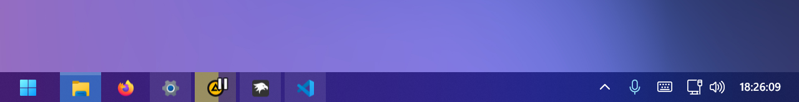
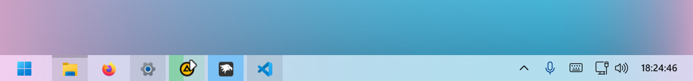

# Aeris theme for Windows 11 Taskbar Styler

**Author**: [Giyuu12](https://github.com/Giyuu12)

 \


## Notes
* This theme is designed to allow flexible resizing using the "Taskbar height and icon size" mod. With a few adjustments, it can also support a vertical taskbar.
* This theme automatically switches colors in sync with Windows' dark and light themes.
* The search button and search bar are not styled. It is recommended to disable them.

## Optional Windhawk Mods
* Taskbar Clock Customization
* Taskbar height and icon size

<details>
<summary>Taskbar height and icon size example (click to expand)</summary>

```json
{
    "IconSize":18,
    "TaskbarHeight":32,
    "TaskbarButtonWidth":44
}
```
</details>

## Vertical Taskbar
* If you use a vertical taskbar, recommend fine-tuning the icon position.

```
Target:
Taskbar.TaskListLabeledButtonPanel > Image

Styles:
Transform3D:=<CompositeTransform3D TranslateX="0" TranslateY="2" />
```

## Manual installation

The theme styles can be imported manually. To do that, follow these steps:

* Open the Windows 11 Taskbar Styler mod in Windhawk.
* Go to the "Advanced" tab.
* Copy the content below to the text box under "Mod settings" and click "Save".

<details>
<summary>Content to import (click to expand)</summary>

```json
{
    "controlStyles[0].target":"Taskbar.TaskbarFrame > Grid#RootGrid",
    "controlStyles[0].styles[0]":"Background:=$taskbarBackground",
    "controlStyles[1].target":"Taskbar.TaskbarFrame > Grid#RootGrid > Taskbar.TaskbarBackground > Grid",
    "controlStyles[1].styles[0]":"Background:=<WindhawkBlur BlurAmount=\"$taskbarBlurIncreace\" TintColor=\"#00000000\" />",
    "controlStyles[2].target":"Taskbar.TaskbarFrame > Grid#RootGrid > Taskbar.TaskbarBackground > Grid > Rectangle#BackgroundFill",
    "controlStyles[2].styles[0]":"Fill:=<SolidColorBrush Color=\"$themeColor\" Opacity=\"$themeColorOpacity\"/>",
    "controlStyles[3].target":"Taskbar.TaskbarFrame > Grid#RootGrid > Taskbar.TaskbarBackground > Grid > Rectangle#BackgroundStroke",
    "controlStyles[3].styles[0]":"Visibility=Collapsed",
    "controlStyles[3].styles[1]":"Fill:=<SolidColorBrush Color=\"$primaryColor\" Opacity=\"0.05\"/>",
    "controlStyles[4].target":"Taskbar.TaskListButtonPanel@CommonStates",
    "controlStyles[4].styles[0]":"Padding=0",
    "controlStyles[4].styles[1]":"Margin=$taskListMargin,0,$taskListMargin,0",
    "controlStyles[4].styles[2]":"Background@ActiveNormal:=<SolidColorBrush Color=\"$activeColor\" Opacity=\"0.5\"/>",
    "controlStyles[4].styles[3]":"Background@ActivePointerOver:=<SolidColorBrush Color=\"$activeColor\" Opacity=\"0.5\"/>",
    "controlStyles[4].styles[4]":"Background@ActivePressed:=<SolidColorBrush Color=\"$activeColor\" Opacity=\"0.5\"/>",
    "controlStyles[5].target":"Taskbar.TaskListButtonPanel@CommonStates > Border#BackgroundElement",
    "controlStyles[5].styles[0]":"Background:=<SolidColorBrush Color=\"$primaryColor\" Opacity=\"0\"/>",
    "controlStyles[5].styles[1]":"Background@InactivePointerOver:=$PointerOver",
    "controlStyles[5].styles[2]":"Background@InactivePressed:=$Pressed",
    "controlStyles[5].styles[3]":"Background@ActivePointerOver:=$PointerOver",
    "controlStyles[5].styles[4]":"Background@ActivePressed:=$Pressed",
    "controlStyles[5].styles[5]":"BorderThickness=0",
    "controlStyles[5].styles[6]":"CornerRadius=0",
    "controlStyles[5].styles[7]":"Margin=0",
    "controlStyles[6].target":"Taskbar.TaskListLabeledButtonPanel@RunningIndicatorStates",
    "controlStyles[6].styles[0]":"Padding=0",
    "controlStyles[6].styles[1]":"Margin=$taskListMargin,0,$taskListMargin,0",
    "controlStyles[6].styles[2]":"Background@NoRunningIndicator:=<SolidColorBrush Color=\"$primaryColor\" Opacity=\"0\"/>",
    "controlStyles[6].styles[3]":"Background@InactiveRunningIndicator:=<SolidColorBrush Color=\"$primaryColor\" Opacity=\"0.1\"/>",
    "controlStyles[6].styles[4]":"Background@ActiveRunningIndicator:=<SolidColorBrush Color=\"$activeColor\" Opacity=\"0.5\"/>",
    "controlStyles[6].styles[5]":"Background:=<SolidColorBrush Color=\"$requestAttentionColor\" Opacity=\"0.5\"/>",
    "controlStyles[7].target":"Taskbar.TaskListLabeledButtonPanel@CommonStates > Border#BackgroundElement",
    "controlStyles[7].styles[0]":"Background:=<SolidColorBrush Color=\"$primaryColor\" Opacity=\"0\"/>",
    "controlStyles[7].styles[1]":"Background@InactivePointerOver:=$PointerOver",
    "controlStyles[7].styles[2]":"Background@InactivePressed:=$Pressed",
    "controlStyles[7].styles[3]":"Background@ActivePointerOver:=$PointerOver",
    "controlStyles[7].styles[4]":"Background@ActivePressed:=$Pressed",
    "controlStyles[7].styles[5]":"Background@MultiWindowPointerOver:=$PointerOver",
    "controlStyles[7].styles[6]":"Background@MultiWindowPressed:=$Pressed",
    "controlStyles[7].styles[7]":"Background@RequestingAttentionPointerOver:=$PointerOver",
    "controlStyles[7].styles[8]":"Background@RequestingAttentionPressed:=$Pressed",
    "controlStyles[7].styles[9]":"Background@RequestingAttentionMultiPointerOver:=$PointerOver",
    "controlStyles[7].styles[10]":"Background@RequestingAttentionMultiPressed:=$Pressed",
    "controlStyles[7].styles[11]":"BorderThickness=0",
    "controlStyles[7].styles[12]":"CornerRadius=0",
    "controlStyles[7].styles[13]":"Margin=0",
    "controlStyles[8].target":"Taskbar.TaskListLabeledButtonPanel > Border#MultiWindowElement",
    "controlStyles[8].styles[0]":"Visibility=Collapsed",
    "controlStyles[9].target":"Taskbar.TaskListLabeledButtonPanel@CommonStates > Rectangle#RunningIndicator",
    "controlStyles[9].styles[0]":"Visibility=Collapsed",
    "controlStyles[9].styles[1]":"Fill:=<SolidColorBrush Color=\"$primaryColor\" Opacity=\"0.2\"/>",
    "controlStyles[9].styles[2]":"VerticalAlignment=0",
    "controlStyles[9].styles[3]":"HorizontalAlignment=Stretch",
    "controlStyles[9].styles[4]":"Margin=0,0,-4,0",
    "controlStyles[9].styles[5]":"Width=Auto",
    "controlStyles[9].styles[6]":"Height=3",
    "controlStyles[9].styles[7]":"RadiusX=0",
    "controlStyles[9].styles[8]":"RadiusY=0",
    "controlStyles[9].styles[9]":"Visibility@MultiWindowNormal=Visible",
    "controlStyles[9].styles[10]":"Visibility@MultiWindowActive=Visible",
    "controlStyles[9].styles[11]":"Visibility@MultiWindowPointerOver=Visible",
    "controlStyles[9].styles[12]":"Visibility@MultiWindowPressed=Visible",
    "controlStyles[9].styles[13]":"Visibility@RequestingAttentionMulti=Visible",
    "controlStyles[9].styles[14]":"Visibility@RequestingAttentionMultiPointerOver=Visible",
    "controlStyles[9].styles[15]":"Visibility@RequestingAttentionMultiPressed=Visible",
    "controlStyles[10].target":"Microsoft.UI.Xaml.Controls.ProgressBar#ProgressIndicator",
    "controlStyles[10].styles[0]":"VerticalAlignment=Stretch",
    "controlStyles[10].styles[1]":"HorizontalAlignment=Stretch",
    "controlStyles[10].styles[2]":"Margin=0,0,-4,0",
    "controlStyles[10].styles[3]":"Width=Auto",
    "controlStyles[10].styles[4]":"Height=Auto",
    "controlStyles[10].styles[5]":"CornerRadius=0",
    "controlStyles[11].target":"Border#ProgressBarRoot > Border > Grid",
    "controlStyles[11].styles[0]":"Height=Auto",
    "controlStyles[12].target":"Grid#LayoutRoot@CommonStates > Border#ProgressBarRoot > Border > Grid > Rectangle#ProgressBarTrack",
    "controlStyles[12].styles[0]":"Margin=0",
    "controlStyles[12].styles[1]":"RadiusX=0",
    "controlStyles[12].styles[2]":"RadiusY=0",
    "controlStyles[12].styles[3]":"Fill:=<SolidColorBrush Color=\"$progressColor\" Opacity=\"0.15\"/>",
    "controlStyles[12].styles[4]":"Fill@Paused:=<SolidColorBrush Color=\"$progressPausedColor\" Opacity=\"0.15\"/>",
    "controlStyles[13].target":"Grid#LayoutRoot@CommonStates > Border#ProgressBarRoot > Border > Grid > Rectangle#DeterminateProgressBarIndicator",
    "controlStyles[13].styles[0]":"RadiusX=0",
    "controlStyles[13].styles[1]":"RadiusY=0",
    "controlStyles[13].styles[2]":"Fill:=<SolidColorBrush Color=\"$progressColor\" Opacity=\"0.4\"/>",
    "controlStyles[13].styles[3]":"Fill@Paused:=<SolidColorBrush Color=\"$progressPausedColor\" Opacity=\"0.4\"/>",
    "controlStyles[14].target":"Taskbar.TaskListLabeledButtonPanel > Image",
    "controlStyles[14].styles[0]":"Transform3D:=<CompositeTransform3D TranslateX=\"2\" TranslateY=\"1\" />",
    "controlStyles[15].target":"Taskbar.TaskListLabeledButtonPanel > Rectangle#DefaultIcon",
    "controlStyles[15].styles[0]":"Visibility=Collapsed",
    "controlStyles[16].target":"Taskbar.TaskListButtonPanel > AnimatedVisualPlayer",
    "controlStyles[16].styles[0]":"Transform3D:=<CompositeTransform3D TranslateX=\"0\" TranslateY=\"1\" />",
    "controlStyles[17].target":"Taskbar.ExperienceToggleButton#LaunchListButton[AutomationProperties.AutomationId=StartButton] > Taskbar.TaskListButtonPanel",
    "controlStyles[17].styles[0]":"MinWidth=60",
    "controlStyles[17].styles[1]":"Margin=0,0,$taskListMargin,0",
    "controlStyles[18].target":"Border#BackgroundBorder",
    "controlStyles[18].styles[0]":"Padding=0",
    "controlStyles[18].styles[1]":"CornerRadius=0",
    "controlStyles[18].styles[2]":"Margin=0",
    "controlStyles[18].styles[3]":"BorderThickness=0",
    "styleConstants[0]":"themeColor={ThemeResource SystemAccentColorDark1}",
    "styleConstants[1]":"themeColorOpacity=0",
    "styleConstants[2]":"primaryColor={ThemeResource TextFillColorPrimary}",
    "styleConstants[3]":"activeColor=#33AAFF",
    "styleConstants[4]":"requestAttentionColor=#FF7788",
    "styleConstants[5]":"progressColor=#44CC66",
    "styleConstants[6]":"progressPausedColor=#FFFF44",
    "styleConstants[7]":"taskbarBackground=<AcrylicBrush TintColor=\"{ThemeResource CardStrokeColorDefaultSolid}\" FallbackColor=\"{ThemeResource CardStrokeColorDefaultSolid}\" TintOpacity=\"0\" TintLuminosityOpacity=\"0.8\" Opacity=\"1\"/>",
    "styleConstants[8]":"taskbarBlurIncreace=0",
    "styleConstants[9]":"taskListMargin=2",
    "styleConstants[10]":"PointerOver=<SolidColorBrush Color=\"{ThemeResource TextFillColorPrimary}\" Opacity=\"0.075\"/>",
    "styleConstants[11]":"Pressed=<SolidColorBrush Color=\"{ThemeResource TextFillColorPrimary}\" Opacity=\"0.05\"/>"
}
```
</details>
