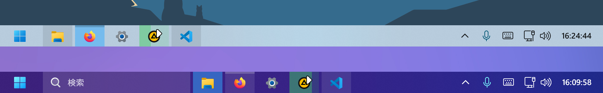

# Aeris theme for Windows 11 Taskbar Styler

**Author**: [Giyuu12](https://github.com/Giyuu12)




## Notes
* This theme is designed to allow flexible resizing using the "Taskbar height and icon size" mod. With a few adjustments, it can also support a vertical taskbar.
* This theme automatically switches colors in sync with Windows' dark and light themes.

## Optional Windhawk Mods
* Taskbar Clock Customization
* Taskbar height and icon size
* Vertical Taskbar for Windows 11

<details>
<summary>Taskbar height and icon size example (click to expand)</summary>

```yaml
TaskbarHeight: 32
IconSize: 18
TaskbarButtonWidth: 44
IconSizeSmall: 16
TaskbarButtonWidthSmall: 32
```
</details>

## Vertical Taskbar
* If you use a vertical taskbar, it's recommended to fine-tune the icon position.

```
Target:
Taskbar.TaskListLabeledButtonPanel > Image

Styles:
Transform3D:=<CompositeTransform3D TranslateX="0" TranslateY="2" />
```

## Theme selection

The theme is integrated into the mod and can be selected directly from the mod's
settings:

* Open the Windows 11 Taskbar Styler mod in Windhawk.
* Go to the "Settings" tab.
* Select the theme and save the settings.

## Manual installation

The theme styles can also be imported manually. To do that, follow these steps:

* Open the Windows 11 Taskbar Styler mod in Windhawk.
* Go to the "Settings" tab and select "Textual mode".
* Copy the content below to the text box and click "Save settings".

<details>
<summary>Content to import (click to expand)</summary>

```yaml
styleConstants:
  - themeColor={ThemeResource SystemAccentColorDark1}
  - themeColorOpacity=0
  - primaryColor={ThemeResource TextFillColorPrimary}
  - activeColor=#33AAFF
  - requestAttentionColor=#FF7788
  - progressColor=#44CC66
  - progressPausedColor=#EECC44
  - taskbarBackground=<AcrylicBrush TintColor="{ThemeResource CardStrokeColorDefaultSolid}" FallbackColor="{ThemeResource CardStrokeColorDefaultSolid}" TintOpacity="0" TintLuminosityOpacity="0.8" Opacity="1"/>
  - taskbarBlurIncreace=0
  - taskListMargin=2
  - showDesktopWidth=10
  - transparent=<SolidColorBrush Color="{ThemeResource TextFillColorPrimary}" Opacity="0"/>
  - pointerOver=<SolidColorBrush Color="{ThemeResource TextFillColorPrimary}" Opacity="0.075"/>
  - pressed=<SolidColorBrush Color="{ThemeResource TextFillColorPrimary}" Opacity="0.05"/>
controlStyles:
  - target: Taskbar.TaskbarFrame > Grid#RootGrid
    styles:
      - Background:=$taskbarBackground
  - target: Taskbar.TaskbarFrame > Grid#RootGrid > Taskbar.TaskbarBackground > Grid
    styles:
      - Background:=<WindhawkBlur BlurAmount="$taskbarBlurIncreace" TintColor="#00000000" />
  - target: Taskbar.TaskbarFrame > Grid#RootGrid > Taskbar.TaskbarBackground > Grid > Rectangle#BackgroundFill
    styles:
      - Fill:=<SolidColorBrush Color="$themeColor" Opacity="$themeColorOpacity"/>
  - target: Taskbar.TaskbarFrame > Grid#RootGrid > Taskbar.TaskbarBackground > Grid > Rectangle#BackgroundStroke
    styles:
      - Visibility=Collapsed
      - Fill:=<SolidColorBrush Color="$primaryColor" Opacity="0.05"/>
  - target: Taskbar.TaskListButtonPanel@CommonStates
    styles:
      - Padding=0
      - Margin=$taskListMargin,0,$taskListMargin,0
      - Background@ActiveNormal:=<SolidColorBrush Color="$activeColor" Opacity="0.5"/>
      - Background@ActivePointerOver:=<SolidColorBrush Color="$activeColor" Opacity="0.5"/>
      - Background@ActivePressed:=<SolidColorBrush Color="$activeColor" Opacity="0.5"/>
  - target: Taskbar.TaskListButtonPanel@CommonStates > Border#BackgroundElement
    styles:
      - Background:=$transparent
      - Background@InactivePointerOver:=$pointerOver
      - Background@InactivePressed:=$pressed
      - Background@ActivePointerOver:=$pointerOver
      - Background@ActivePressed:=$pressed
      - BorderThickness=0
      - CornerRadius=0
      - Margin=0
  - target: Taskbar.TaskListButton > Taskbar.TaskListLabeledButtonPanel@RunningIndicatorStates
    styles:
      - Padding=0
      - Margin=$taskListMargin,0,$taskListMargin,0
      - Background@NoRunningIndicator:=$transparent
      - Background@InactiveRunningIndicator:=<SolidColorBrush Color="$primaryColor" Opacity="0.1"/>
      - Background@ActiveRunningIndicator:=<SolidColorBrush Color="$activeColor" Opacity="0.5"/>
      - Background:=<SolidColorBrush Color="$requestAttentionColor" Opacity="0.5"/>
  - target: Taskbar.TaskListButton > Taskbar.TaskListLabeledButtonPanel@CommonStates > Border#BackgroundElement
    styles:
      - Background:=$transparent
      - Background@InactivePointerOver:=$pointerOver
      - Background@InactivePressed:=$pressed
      - Background@ActivePointerOver:=$pointerOver
      - Background@ActivePressed:=$pressed
      - Background@MultiWindowPointerOver:=$pointerOver
      - Background@MultiWindowPressed:=$pressed
      - Background@RequestingAttentionPointerOver:=$pointerOver
      - Background@RequestingAttentionPressed:=$pressed
      - Background@RequestingAttentionMultiPointerOver:=$pointerOver
      - Background@RequestingAttentionMultiPressed:=$pressed
      - BorderThickness=0
      - CornerRadius=0
      - Margin=0
  - target: Taskbar.TaskListLabeledButtonPanel > Border#MultiWindowElement
    styles:
      - Visibility=Collapsed
  - target: Taskbar.TaskListLabeledButtonPanel@CommonStates > Rectangle#RunningIndicator
    styles:
      - Visibility=Collapsed
      - Fill:=<SolidColorBrush Color="$primaryColor" Opacity="0.2"/>
      - VerticalAlignment=0
      - HorizontalAlignment=Stretch
      - Margin=0,0,-4,0
      - Width=Auto
      - Height=3
      - RadiusX=0
      - RadiusY=0
      - Visibility@MultiWindowNormal=Visible
      - Visibility@MultiWindowActive=Visible
      - Visibility@MultiWindowPointerOver=Visible
      - Visibility@MultiWindowPressed=Visible
      - Visibility@RequestingAttentionMulti=Visible
      - Visibility@RequestingAttentionMultiPointerOver=Visible
      - Visibility@RequestingAttentionMultiPressed=Visible
  - target: Microsoft.UI.Xaml.Controls.ProgressBar#ProgressIndicator
    styles:
      - VerticalAlignment=Stretch
      - HorizontalAlignment=Stretch
      - Margin=0,0,-4,0
      - Width=Auto
      - Height=Auto
      - CornerRadius=0
  - target: Border#ProgressBarRoot > Border > Grid
    styles:
      - Height=Auto
  - target: Grid#LayoutRoot@CommonStates > Border#ProgressBarRoot > Border > Grid > Rectangle#ProgressBarTrack
    styles:
      - Margin=0
      - RadiusX=0
      - RadiusY=0
      - Fill:=<SolidColorBrush Color="$progressColor" Opacity="0.15"/>
      - Fill@Paused:=<SolidColorBrush Color="$progressPausedColor" Opacity="0.15"/>
  - target: Grid#LayoutRoot@CommonStates > Border#ProgressBarRoot > Border > Grid > Rectangle#DeterminateProgressBarIndicator
    styles:
      - RadiusX=0
      - RadiusY=0
      - Fill:=<SolidColorBrush Color="$progressColor" Opacity="0.4"/>
      - Fill@Paused:=<SolidColorBrush Color="$progressPausedColor" Opacity="0.4"/>
  - target: Taskbar.TaskListLabeledButtonPanel > Image
    styles:
      - Transform3D:=<CompositeTransform3D TranslateX="2" TranslateY="1" />
  - target: Taskbar.TaskListLabeledButtonPanel > Rectangle#DefaultIcon
    styles:
      - Visibility=Collapsed
  - target: Taskbar.TaskListButtonPanel > AnimatedVisualPlayer
    styles:
      - Transform3D:=<CompositeTransform3D TranslateX="0" TranslateY="1" />
  - target: Taskbar.ExperienceToggleButton#LaunchListButton[AutomationProperties.AutomationId=StartButton] > Taskbar.TaskListButtonPanel
    styles:
      - MinWidth=60
      - Margin=0,0,$taskListMargin,0
  - target: Taskbar.SearchBoxButton > Taskbar.TaskListButtonPanel@CommonStates
    styles:
      - Padding=0
      - Margin=$taskListMargin,0,$taskListMargin,0
      - Background@ActiveNormal_SearchIcon:=<SolidColorBrush Color="$activeColor" Opacity="0.5"/>
      - Background@ActivePointerOver_SearchIcon:=<SolidColorBrush Color="$activeColor" Opacity="0.5"/>
      - Background@ActivePressed_SearchIcon:=<SolidColorBrush Color="$activeColor" Opacity="0.5"/>
  - target: Taskbar.SearchBoxLaunchListButton > Taskbar.TaskListButtonPanel
    styles:
      - Padding=0
      - Margin=$taskListMargin,0,$taskListMargin,0
  - target: SearchUx.SearchUI.SearchButtonRootGrid@CommonStates
    styles:
      - Padding=0
      - Margin=$taskListMargin,0,$taskListMargin,0
      - Background@ActiveNormal:=<SolidColorBrush Color="$activeColor" Opacity="0.5"/>
      - Background@ActivePointerOver:=<SolidColorBrush Color="$activeColor" Opacity="0.5"/>
      - Background@ActivePressed:=<SolidColorBrush Color="$activeColor" Opacity="0.5"/>
  - target: Taskbar.SearchBoxButton > Taskbar.TaskListButtonPanel@CommonStates > Border#BackgroundElement
    styles:
      - BorderThickness=0
      - CornerRadius=0
      - Margin=0
      - Background@InactiveNormal_SearchIcon:=$transparent
      - Background@InactivePointerOver_SearchIcon:=$pointerOver
      - Background@InactivePressed_SearchIcon:=$pressed
      - Background@ActiveNormal_SearchIcon:=$transparent
      - Background@ActivePointerOver_SearchIcon:=$pointerOver
      - Background@ActivePressed_SearchIcon:=$pressed
  - target: Taskbar.SearchBoxLaunchListButton > Taskbar.TaskListButtonPanel > Border#BackgroundElement
    styles:
      - BorderThickness=0
      - CornerRadius=0
      - Margin=0
  - target: SearchUx.SearchUI.SearchButtonRootGrid@CommonStates > Border#BackgroundElement
    styles:
      - BorderThickness=0
      - CornerRadius=0
      - Margin=0
      - Background@InactiveNormal:=$transparent
      - Background@InactivePointerOver:=$pointerOver
      - Background@InactivePressed:=$pressed
      - Background@ActiveNormal:=$transparent
      - Background@ActivePointerOver:=$pointerOver
      - Background@ActivePressed:=$pressed
  - target: Border#SearchPillBackgroundElement
    styles:
      - BorderThickness=0
      - CornerRadius=0
      - Margin=0
  - target: Grid#DynamicSearchBoxGleamContainer
    styles:
      - Visibility=Collapsed
  - target: Grid@ > Border#BackgroundBorder
    styles:
      - Padding=0
      - CornerRadius=0
      - Margin=0
      - BorderThickness=0
      - Background@PointerOver:=$pointerOver
      - Background@Pressed:=$pressed
  - target: SystemTray.OmniButton > Grid@CommonStates > Border#BackgroundBorder
    styles:
      - Background@PointerOver:=$pointerOver
      - Background@Pressed:=$pressed
  - target: SystemTray.Stack#ShowDesktopStack
    styles:
      - MinWidth=$showDesktopWidth
      - MaxWidth=$showDesktopWidth
  - target: SystemTray.Stack#ShowDesktopStack > Grid > SystemTray.StackListView > Windows.UI.Xaml.Controls.ItemsPresenter > Windows.UI.Xaml.Controls.StackPanel > Windows.UI.Xaml.Controls.ContentPresenter > SystemTray.IconView
    styles:
      - MinWidth=$showDesktopWidth
      - MaxWidth=$showDesktopWidth
  - target: SystemTray.IconView#SystemTrayIcon > Grid#ContainerGrid@ > Rectangle#ShowDesktopPipe
    styles:
      - VerticalAlignment=Stretch
      - HorizontalAlignment=Stretch
      - Height=Auto
      - Width=Auto
      - Fill@PointerOver:=$pointerOver
      - Fill@Pressed:=$pressed
```
</details>
