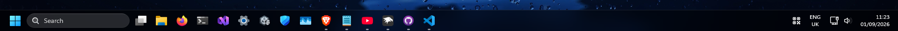
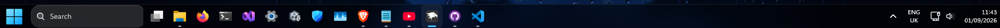

# BetterTintedGlass theme for Windows 11 Taskbar Styler

**Author**: [dr-dinnerbone](https://github.com/dr-dinnerbone)



## Notes
* This taskbar theme is designed to be used in dark mode
* This is a fork of [TintedGlass theme for Windows 11 Taskbar Styler](https://github.com/ramensoftware/windows-11-taskbar-styling-guide/tree/main/Themes/TintedGlass) by [TheRealCisWhiteMale](https://github.com/TheRealCisWhiteMale)

## Changes from original
* Restored original size of search and start
* Restored show desktop button
* Changed systray icon to be qr code glyph to match [TaskbarXII theme for Windows 11 Taskbar Styler](https://github.com/ramensoftware/windows-11-taskbar-styling-guide/blob/main/Themes/TaskbarXII/README.md)

### Original theme

### This theme


## Suggested mods for full theme

- Windows 11 Start Menu Styler

[TintedGlass theme for Windows 11 Start Menu Styler](https://github.com/ramensoftware/windows-11-start-menu-styling-guide/blob/main/Themes/TintedGlass/README.md).

- Windows 11 Notification Center Styler

[TintedGlass theme for Windows 11 Notification Center Styler](https://github.com/ramensoftware/windows-11-notification-center-styling-guide/blob/main/Themes/TintedGlass/README.md).

- Windows 11 File Explorer Styler

[TintedGlass theme for Windows 11 File Explorer Styler](https://github.com/ramensoftware/windows-11-file-explorer-styling-guide/blob/main/Themes/TintedGlass/README.md).

- Translucent Windows

<details>
<summary>Mod settings (click to expand)</summary>

```yaml
RenderingMod:
  ThemeBackground: 1
  SysColors: 0
  AccentColorControls: 1
BackgroundEffects:
  type: acrylicblur
  AccentBlurBehind: 3A232323
FlyoutsEffects: 1
RuledPrograms:
  - target: mspaint.exe
    RenderingMod:
      ThemeBackground: 0
      AccentColorControls: 0
    BackgroundEffects:
      type: none
      AccentBlurBehind: 3A232323
```
</details>

## Theme selection

The theme is integrated into the mod and can be selected directly from the mod's
settings:

* Open the Windows 11 Taskbar Styler mod in Windhawk.
* Go to the "Settings" tab.
* Select the theme and save the settings.

## Manual installation

The theme can be imported manually by:

* Open the Windows 11 Taskbar Styler mod in Windhawk.
* Go to the "Settings" tab and select "Textual mode".
* Copy the mod settings below to the text box and click "Save settings".

<details>
<summary>Mod settings (click to expand)</summary>

```yaml
styleConstants:
  - CommonBgBrush=<WindhawkBlur BlurAmount="18" TintColor="#80000000"/>
controlStyles:
  - target: Taskbar.TaskbarFrame > Grid#RootGrid > Taskbar.TaskbarBackground > Grid > Rectangle#BackgroundFill
    styles:
      - Fill:=$CommonBgBrush
  - target: Taskbar.TaskbarBackground#HoverFlyoutBackgroundControl > Grid#RootGrid > Rectangle#BackgroundFill
    styles:
      - Fill:=$CommonBgBrush
  - target: TextBlock#InnerTextBlock[Text=]
    styles:
      - Text=
  - target: WindowsInternal.ComposableShell.Experiences.Switcher.AltTab > Windows.UI.Xaml.Controls.Grid#ModalRootGrid > Windows.UI.Xaml.Controls.Border#BackgroundElement
    styles:
      - Background=Transparent
  - target: WindowsInternal.ComposableShell.Experiences.Switcher.AltTab > Windows.UI.Xaml.Controls.Grid#ModalRootGrid > Windows.UI.Xaml.Controls.Border#BackgroundElement > WindowsInternal.ComposableShell.Experiences.Switcher.SwitchItemList
    styles:
      - Background:=$CommonBgBrush
  - target: Windows.UI.Xaml.Controls.Border#BackgroundDimmingLayer
    styles:
      - Background:=$CommonBgBrush
  - target: MenuFlyoutPresenter > Border
    styles:
      - Fill:=$CommonBgBrush
      - BorderThickness=0,0,0,0
      - CornerRadius=14
      - Padding=2,2,2,2
  - target: Border#OverflowFlyoutBackgroundBorder
    styles:
      - Fill:=$CommonBgBrush
      - BorderThickness=0,0,0,0
      - CornerRadius=14
      - Margin=-2,-2,-2,-2
  - target: SystemTray.AdaptiveTextBlock#Base > TextBlock#InnerTextBlock
    styles:
      - FontSize=18
  - target: SystemTray.ImageIconContent > Grid#ContainerGrid > Image
    styles:
      - Width=18
      - Height=18
  - target: Grid#IconPanel, Taskbar.TaskListLabeledButtonPanel#IconPanel
    styles:
      - Padding=2,2,2,2
  - target: Grid#ContainerGrid
    styles:
      - Padding=2,2,2,2
  - target: Taskbar.FlyoutFrame > Canvas#HoverFlyoutCanvas > Grid#HoverFlyoutGrid
    styles:
      - Padding=2,2,2,2
  - target: Image#Icon
    styles:
      - Margin=2,2,2,2
  - target: Rectangle#BackgroundStroke
    styles:
      - Fill:=<WindhawkBlur BlurAmount="18" TintColor="#1AFFFFFF"/>
  - target: Grid#OverflowRootGrid > Border
    styles:
      - Background:=$CommonBgBrush
  - target: Grid#ConfirmatorMainGrid
    styles:
      - Background:=$CommonBgBrush
      - BorderThickness=0
  - target: WindowsInternal.ComposableShell.Experiences.TextInput.Common.InputSwitcher > ContentControl > ContentPresenter > Grid
    styles:
      - Background:=$CommonBgBrush
      - BorderThickness=0
  - target: WindowsInternal.ComposableShell.Experiences.TextInput.Common.InputSwitcher > ContentControl > ContentPresenter > Grid > Grid
    styles:
      - Fill:=<WindhawkBlur BlurAmount="18" TintColor="#1AFFFFFF"/>
```
</details>