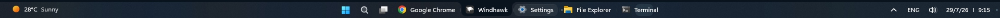
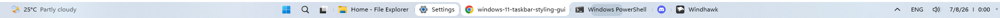

# Blob theme for Windows 11 Taskbar Styler

**Author**: [Deen-0x](https://github.com/Deen-0x)

Dark Mode


Light Mode


Blob Taskbar Replaces the rounded-rectangle indicator behind Windows 11 taskbar buttons with a parametric "blob" — a tab-like shape whose top edge is flat and wide, with concave flares at the top corners so each button reads as a tab merging into the desktop above it. The look is inspired from the tab strips in File Explorer and Google Chrome, where the active tab visually connects to the content below it rather than floating as a separate pill.

## Notes
- Designed on Windows 11 - 25H2 (OS Build 26200.8737).
- Settings: Search: hide/icon only | Task view: on/off | Widgets - On | Taskbar alignment - Center.

  <details>
  <summary>Click to expand to view Taskbar Windows Settings</summary>


  </details>

## Windhawk mods for similar results
Click each to expand settings:

  <details>
  <summary>Taskbar Blob</summary>

  ```yaml
BlobShape:
  Dimensions: auto, 18
  Margins: 0, 3, 0, 0
  BottomRadius: '8'
  TopRadius: '10'
Colors:
  BgOpacity: ''
  CustomColor: ''
  ```
  </details>

  <details>
  <summary>Taskbar Height and Icon Size</summary>

  ```yaml
TaskbarHeight: 36
IconSize: 16
TaskbarButtonWidth: 28
IconSizeSmall: 16
TaskbarButtonWidthSmall: 28
  ```
  </details>


  <details>
  <summary>Taskbar Clock Customization</summary>

  ```yaml
  ShowSeconds: 0
  TimeFormat: ''
  DateFormat: d/M/y
  DateLocale: ''
  WeekdayFormat: custom
  WeekdayFormatCustom: Sun, Mon, Tue, Wed, Thu, Fri, Sat
  TopLine: ''
  BottomLine: '📅  %date% 〡 %time%'
  MiddleLine: '%weekday%'
  TooltipLine: '%web1_full%'
  TooltipLineMode: append
  Width: 180
  Height: 60
  MaxWidth: 0
  TextSpacing: 1
  DataCollection:
    NetworkMetricsFormat: mbs
    NetworkMetricsFixedDecimals: -1
    DiskMetricsFormat: ''
    DiskMetricsFixedDecimals: 0
    PercentageFormat: spacePaddingAndSymbol
    UpdateInterval: 1
    NetworkAdapterName: ''
    GpuAdapterName: ''
  MediaPlayer:
    IgnoredPlayers:
      - ''
    MaxLength: 28
    MediaInfoFormat: ''
    NoMediaText: No media
    RemoveBrackets: 0
  WebContentWeatherLocation: ''
  WebContentWeatherFormat: '%c 🌡️%t 🌬️%w'
  WebContentWeatherUnits: autoDetect
  WebContentsItems:
    - Url: https://rss.nytimes.com/services/xml/rss/nyt/World.xml
      BlockStart: <item>
      Start: <title>
      End: </title>
      ContentMode: xmlHtml
      SearchReplace:
        - Search: ''
          Replace: ''
      MaxLength: 28
  WebContentsUpdateInterval: 10
  TimeZones:
    - Eastern Standard Time
  TimeStyle:
    Hidden: 1
    TextColor: ''
    TextAlignment: Right
    FontSize: 0
    FontFamily: ''
    FontWeight: ''
    FontStyle: ''
    FontStretch: ''
    CharacterSpacing: 0
    LineHeight: 0
  DateStyle:
    Hidden: 0
    TextColor: ''
    TextAlignment: ''
    FontSize: 12
    FontFamily: ''
    FontWeight: Medium
    FontStyle: Normal
    FontStretch: ''
    CharacterSpacing: 0
    LineHeight: 0
  oldTaskbarOnWin11: 0
  ```
  </details>


## Recommended Windhawk mods

  <details>
  <summary>Taskbar Labels for Windows 11</summary>

  ```yaml
  mode: labelsWithCombining
  taskbarItemWidth: 0
  runningIndicatorStyle: fullWidth
  progressIndicatorStyle: sameAsRunningIndicatorStyle
  excludedPrograms:
    - ''
  minimumTaskbarItemWidth: 40
  maximumTaskbarItemWidth: 200
  fontSize: 12
  fontFamily: ''
  textTrimming: characterEllipsis
  leftAndRightPaddingSize: 0
  spaceBetweenIconAndLabel: 0
  runningIndicatorHeight: -1
  runningIndicatorVerticalOffset: 0
  alwaysShowThumbnailLabels: 0
  labelForSingleItem: ''
  labelForMultipleItems: ''
  ```
  </details><br>


# Theme selection
The theme is integrated into the mod and can be selected directly from the mod's settings:

- Open the Windows 11 Taskbar Styler mod in Windhawk.
- Go to the "Settings" tab.
- Select the theme and save the settings.

# Manual installation
The theme styles can also be imported manually. To do that, follow these steps:

- Open the Windows 11 Taskbar Styler mod in Windhawk.
- Go to the "Settings" tab and select "Textual mode".
- Copy the content below to the text box and click "Save settings".

<details>
<summary>Theme content to import (click to expand)</summary>

```yaml
styleConstants:
  - taskbarLeftOffset = 12
  - taskbarRightOffset = 12
  - taskbarTopOffset = 8
  - taskbarBottomOffset = 4
  - highlightRadius = 8
  - buttonMinWidth = 36
  - buttonSpacing = 4
  - iconSpacing = 8
  - iconLabelSpacing = 4
  - leftRightPadding = 4
  - badgeSize = 12
  - badgeNudge = 4,4,0,0
  - taskbarStrokeHeight = 4
  - blobFill = <SolidColorBrush Color="{ThemeResource AdaptiveBlob}"/>
  - taskbarStrokeColor = <SolidColorBrush Color="{ThemeResource AdaptiveBlob}"/>
  - taskbarFill = <SolidColorBrush Color="{ThemeResource Default}"/>
  - progressColor = <SolidColorBrush Color="{ThemeResource SystemAccentColor}" Opacity="0.2"/>
  - showDesktopIndicatorColor = <SolidColorBrush Color="{ThemeResource SystemAccentColor}" Opacity="0.7"/>
  - multiWinIndicatorColor = <SolidColorBrush Color="{ThemeResource AdaptiveIndicator}" Opacity="0.7"/>
  - separatorColor = <SolidColorBrush Color="{ThemeResource AdaptiveIndicator}" Opacity="0.1"/>
  - labelAndIconOffsetY = -1
  - showStartButton = 1
controlStyles:
  - target: ScrollViewer > ScrollContentPresenter > Border > Grid > Taskbar.TaskbarFrame
    styles:
      - Height => TaskbarHeight
      - // Taskbar. Get height as a helper to calculate other elements' heights.
  - target: Taskbar.TaskbarBackground#BackgroundControl > Grid > Rectangle#BackgroundFill
    styles:
      - Fill := $taskbarFill
      - // Taskbar background
  - target: Taskbar.TaskbarBackground#BackgroundControl > Grid > Rectangle#BackgroundStroke
    styles:
      - Height = $taskbarStrokeHeight
      - Fill := $taskbarStrokeColor
      - // Taskbar stroke
  - target: Taskbar.TaskListButton#TaskListButton > Taskbar.TaskListLabeledButtonPanel#IconPanel
    styles:
      - Padding := {{$buttonSpacing-2}},{{$taskbarTopOffset}},{{$buttonSpacing-2}},{{$taskbarBottomOffset}}
      - MinWidth := $buttonMinWidth
      - // Taskbar buttons min width
  - target: Taskbar.TaskListLabeledButtonPanel#IconPanel@CommonStates > Border#BackgroundElement
    styles:
      - Margin = 0
      - // Opacity@ActivePointerOver = 1
      - CornerRadius := $highlightRadius
      - Canvas.ZIndex = 2
      - // The native highlighter. Border thickness set to zero for consistent behavior (in light mode the border is transparent).
  - target: Taskbar.TaskListLabeledButtonPanel#IconPanel@CommonStates > Rectangle#RunningIndicator
    styles:
      - Opacity@NoRunningIndicator = 0
      - Width = 2
      - Height := 2
      - VerticalAlignment = 1
      - Margin := 3,0,0,0
      - Visibility = 1
      - Visibility@MultiWindowNormal = 0
      - Visibility@MultiWindowActive = 0
      - Visibility@MultiWindowPressed = 0
      - Visibility@MultiWindowPointerOver = 0
      - Visibility@RequestingAttentionMulti = 0
      - Visibility@RequestingAttentionMultiPointerOver = 0
      - Visibility@RequestingAttentionMultiPressed = 0
      - Fill := $multiWinIndicatorColor
      - RadiusX = 0
      - RadiusY = 0
      - StrokeThickness = 0
      - Fill := $buttonFill
      - Stroke := $buttonBorderColor
      - Canvas.ZIndex = 4
      - // The running indicator functions as the multi window element.
  - target: Microsoft.UI.Xaml.Controls.ProgressBar#ProgressIndicator
    styles:
      - Height := {{TaskbarHeight-($taskbarBottomOffset+$taskbarTopOffset)}}
      - Margin = 1,0,0,0
      - CornerRadius := $highlightRadius
      - // Progress indicator.
  - target: Microsoft.UI.Xaml.Controls.ProgressBar#ProgressIndicator > Grid#LayoutRoot
    styles:
      - CornerRadius := $highlightRadius
      - Canvas.ZIndex = 1
      - // Progress indicator functions as the background of taskbar buttons in progress state.
  - target: Border#ProgressBarRoot > Border > Grid
    styles:
      - Height = Auto
      - // Progress bar
  - target: Grid#LayoutRoot > Border#ProgressBarRoot > Border > Grid > Rectangle#ProgressBarTrack
    styles:
      - Fill = Transparent
      - // Progress bar
  - target: Grid#LayoutRoot@CommonStates > Border#ProgressBarRoot > Border > Grid > Rectangle#DeterminateProgressBarIndicator
    styles:
      - Fill := $progressColor
      - Fill@Paused := <SolidColorBrush Color="orange" Opacity="0.2"/>
      - // Determinate progress bar indicator (task progress indicator).
  - target: Grid#LayoutRoot@CommonStates > Border#ProgressBarRoot > Border > Grid > Rectangle#IndeterminateProgressBarIndicator
    styles:
      - Fill := $progressColor
      - Fill@Paused := <SolidColorBrush Color="orange" Opacity="0.2"/>
      - // Indeterminate progress bar indicator (loading indicator).
  - target: Grid#LayoutRoot@CommonStates > Border#ProgressBarRoot > Border > Grid > Rectangle#IndeterminateProgressBarIndicator2
    styles:
      - Fill := $progressColor
      - Fill@Paused := <SolidColorBrush Color="orange" Opacity="0.2"/>
      - // Indeterminate progress bar 2 indicator.
  - target: Border#MultiWindowElement
    styles:
      - Visibility = 1
      - // Multi window element.
  - target: Taskbar.TaskListLabeledButtonPanel > TextBlock#LabelControl
    styles:
      - Margin := {{$iconLabelSpacing}},0,4,0
      - Padding := {{$leftRightPadding}},0
      - RenderTransform := <TranslateTransform X="0" Y="{{$labelAndIconOffsetY}}" />
      - Canvas.ZIndex = 3
      - // Taskbar buttons labels
  - target: Taskbar.TaskListButton#TaskListButton > Taskbar.TaskListLabeledButtonPanel#IconPanel@CommonStates > Image#Icon
    styles:
      - Margin := {{$iconSpacing}},0,0,0
      - Canvas.ZIndex = 3
      - RenderTransform := <TranslateTransform X="0" Y= "{{$labelAndIconOffsetY}}" />
      - // Taskbar buttons icons.
  - target: Taskbar.TaskListLabeledButtonPanel@CommonStates > Rectangle#DefaultIcon
    styles:
      - Stretch = 1
      - Height = 8
      - Width = 1
      - Visibility = 0
      - Fill := $separatorColor
      - RenderTransform := <TranslateTransform X="-14" Y="0" />
      - // Serves as a button separator.
  - target: Taskbar.ExperienceToggleButton#LaunchListButton > Taskbar.TaskListButtonPanel#ExperienceToggleButtonRootPanel
    styles:
      - Visibility := {{1-$showStartButton}}
      - // Windows Start and Task View buttons.
  - target: Taskbar.TaskListLabeledButtonPanel#IconPanel > Image#OverlayIcon
    styles:
      - Width := $badgeSize
      - Height := $badgeSize
      - Margin := $badgeNudge
      - Canvas.ZIndex = 3
      - // Badge indicator for specific apps.
  - target: Taskbar.TaskListLabeledButtonPanel#IconPanel > Taskbar.Badge#BadgeControl
    styles:
      - MinWidth := $badgeSize
      - Width := $badgeSize
      - Height := $badgeSize
      - Margin := $badgeNudge
      - Canvas.ZIndex = 3
      - // Badge indicator for specific apps.
  - target: Taskbar.TaskListLabeledButtonPanel#IconPanel > Taskbar.Badge#BadgeControl > Grid > TextBlock#BadgeText
    styles:
      - FontSize = 8
      - HorizontalAlignment = 1
      - // Label of badge indicator for specific apps.
  - target: SystemTray.SystemTrayFrame > Grid#SystemTrayFrameGrid > SystemTray.OmniButton#NotificationCenterButton
    styles:
      - Margin := 0,0,{{$taskbarRightOffset-12}},0
      - // System tray notification area (right margin minus 12 to compensate for the default "show desktop" indicator width).
  - target: SystemTray.SystemTrayFrame > Grid#SystemTrayFrameGrid > SystemTray.OmniButton#NotificationCenterButton > Grid
    styles:
      - Padding := 0,{{$taskbarTopOffset}},0,{{$taskbarBottomOffset}}
      - // System tray date & time background.
  - target: SystemTray.SystemTrayFrame > Grid#SystemTrayFrameGrid > SystemTray.OmniButton#ControlCenterButton > Grid
    styles:
      - Padding := 0,{{$taskbarTopOffset}},0,{{$taskbarBottomOffset}}
      - // System tray control center background.
  - target: SystemTray.SystemTrayFrame > Grid#SystemTrayFrameGrid > SystemTray.Stack#MainStack > Grid#Content
    styles:
      - Padding := 0,{{$taskbarTopOffset}},0,{{$taskbarBottomOffset}}
      - // System tray main stack background.
  - target: SystemTray.SystemTrayFrame > Grid#SystemTrayFrameGrid > SystemTray.Stack#NonActivatableStack > Grid#Content
    styles:
      - Padding := 0,{{$taskbarTopOffset}},0,{{$taskbarBottomOffset}}
      - // System tray language indicator's background
  - target: SystemTray.SystemTrayFrame > Grid#SystemTrayFrameGrid > SystemTray.NotificationAreaIcons#NotificationAreaIcons > ItemsPresenter > StackPanel
    styles:
      - Padding := 0,{{$taskbarTopOffset}},0,{{$taskbarBottomOffset}}
      - // System tray notification area icons' background.
  - target: SystemTray.Stack#NotifyIconStack > Grid#Content > SystemTray.StackListView#IconStack > ItemsPresenter > StackPanel > ContentPresenter
    styles:
      - Padding := 0,{{$taskbarTopOffset}},0,{{$taskbarBottomOffset}}
      - // System tray overflow indicator's highlight.
  - target: SystemTray.OmniButton#NotificationCenterButton > Grid > Border#BackgroundBorder
    styles:
      - Margin = 0
      - CornerRadius := $highlightRadius
      - // System tray date & time highlight.
  - target: SystemTray.IconView#SystemTrayIcon > Grid#ContainerGrid > Border#BackgroundBorder
    styles:
      - Margin = 0
      - CornerRadius := $highlightRadius
      - // System tray language indicator's highlight.
  - target: SystemTray.ChevronIconView > Grid#ContainerGrid > Border#BackgroundBorder
    styles:
      - Margin = 0
      - CornerRadius := $highlightRadius
      - // System tray overflow indicator's highlight.
  - target: SystemTray.OmniButton#ControlCenterButton > Grid > Border#BackgroundBorder
    styles:
      - Margin = 0
      - CornerRadius := $highlightRadius
      - // System tray control center highlight.
  - target: SystemTray.NotifyIconView#NotifyItemIcon > Grid#ContainerGrid > Border#BackgroundBorder
    styles:
      - Margin = 0
      - CornerRadius := $highlightRadius
      - // System tray notification area icons' highlight.
  - target: SystemTray.OmniButton#NotificationCenterButton > Grid > ContentPresenter#ContentPresenter
    styles:
      - Margin = 0,0,0,1
      - // System tray date & time label (position refinement).
  - target: SystemTray.AdaptiveTextBlock#LanguageInnerTextBlock > TextBlock#InnerTextBlock
    styles:
      - Margin = 0,0,0,2.5
      - MaxLines = 1
      - // System tray language indicator position refinement and restricting it to one line (in the case of 2 lines "ENG US").
  - target: Grid#OverflowRootGrid > Border
    styles:
      - Shadow :=
      - // System tray overflow flyout background.
  - target: Taskbar.AugmentedEntryPointButton#AugmentedEntryPointButton > Taskbar.TaskListButtonPanel#ExperienceToggleButtonRootPanel > Grid#AugmentedEntryPointContentGrid > Grid > Grid > AdaptiveCards.Rendering.Uwp.WholeItemsPanel > Border > AdaptiveCards.Rendering.Uwp.WholeItemsPanel > Grid > Border#LargeTicker2 > AdaptiveCards.Rendering.Uwp.WholeItemsPanel > TextBlock[1]
    styles:
      - ActualWidth => WeatherTempWidth
      - RenderTransform := <TranslateTransform X="0" Y="8" />
      - // Weather widget's temperature text block.
  - target: Taskbar.AugmentedEntryPointButton#AugmentedEntryPointButton > Taskbar.TaskListButtonPanel#ExperienceToggleButtonRootPanel > Grid#AugmentedEntryPointContentGrid > Grid > Grid > AdaptiveCards.Rendering.Uwp.WholeItemsPanel > Border > AdaptiveCards.Rendering.Uwp.WholeItemsPanel > Grid > Border#LargeTicker2 > AdaptiveCards.Rendering.Uwp.WholeItemsPanel > TextBlock[2]
    styles:
      - ActualWidth => WeatherCondWidth
      - RenderTransform := <TranslateTransform X="{{WeatherTempWidth+8}}" Y="-8" />
      - // Weather widget's weather condition text block.
  - target: Taskbar.TaskListButtonPanel#ExperienceToggleButtonRootPanel > Grid#AugmentedEntryPointContentGrid
    styles:
      - Width := {{WeatherCondWidth+WeatherTempWidth+60}}
      - HorizontalAlignment = 0
      - // Weather widget content grid.
  - target: Grid#AugmentedEntryPointContentGrid
    styles:
      - Margin = 0,0,0,2
      - // Weather widget content grid.
  - target: Taskbar.AugmentedEntryPointButton#AugmentedEntryPointButton > Taskbar.TaskListButtonPanel#ExperienceToggleButtonRootPanel
    styles:
      - Width := {{WeatherCondWidth+WeatherTempWidth+60}}
      - Margin := 0,0,56,0
      - Padding = {{$taskbarLeftOffset}},{{$taskbarTopOffset}},0,{{$taskbarBottomOffset}}
      - // Weather widget's background (width is adaptive to the sum of weather temperature and condition text blocks widths).
  - target: Taskbar.AugmentedEntryPointButton#AugmentedEntryPointButton > Taskbar.TaskListButtonPanel#ExperienceToggleButtonRootPanel > Border#BackgroundElement
    styles:
      - CornerRadius := $highlightRadius
      - // Weather widget's highlight.
  - target: ScrollViewer > ScrollContentPresenter > Border > Grid > Taskbar.TaskbarFrame > Grid#RootGrid > Microsoft.UI.Xaml.Controls.ItemsRepeater#TaskbarFrameRepeater > Taskbar.AugmentedEntryPointButton#AugmentedEntryPointButton > Taskbar.TaskListButtonPanel#ExperienceToggleButtonRootPanel > Grid#AugmentedEntryPointContentGrid > Grid > Grid[1]
    styles:
      - HorizontalAlignment = 0
      - Margin = 4,0,0,0
      - // Weather widget grid 1 (when overflow).
  - target: ScrollViewer > ScrollContentPresenter > Border > Grid > Taskbar.TaskbarFrame > Grid#RootGrid > Microsoft.UI.Xaml.Controls.ItemsRepeater#TaskbarFrameRepeater > Taskbar.AugmentedEntryPointButton#AugmentedEntryPointButton > Taskbar.TaskListButtonPanel#ExperienceToggleButtonRootPanel > Grid#AugmentedEntryPointContentGrid > Grid > Grid[2]
    styles:
      - HorizontalAlignment = 0
      - VerticalAlignment = 0
      - RenderTransformOrigin = -0.5,0.5
      - RenderTransform := <TransformGroup><ScaleTransform ScaleX = "0.75" ScaleY = "0.75" /><TranslateTransform X="16" Y="0" /></TransformGroup>
      - // Weather widget grid 2 (when overflow).
  - target: ScrollViewer > ScrollContentPresenter > Border > Grid > Taskbar.TaskbarFrame > Grid#RootGrid > Microsoft.UI.Xaml.Controls.ItemsRepeater#TaskbarFrameRepeater > Taskbar.AugmentedEntryPointButton#AugmentedEntryPointButton > Taskbar.TaskListButtonPanel#ExperienceToggleButtonRootPanel > Grid#AugmentedEntryPointContentGrid > Grid > Grid > AdaptiveCards.Rendering.Uwp.WholeItemsPanel > Border > AdaptiveCards.Rendering.Uwp.WholeItemsPanel > Grid
    styles:
      - Background = Transparent
      - // Weather widget temperature background (when overflow).
  - target: WindowsInternal.ComposableShell.Experiences.TextInput.Common.InputSwitcher > ContentControl > ContentPresenter > Grid
    styles:
      - Shadow :=
      - // Language flyout.
  - target: Grid#ContainerGrid@ > Rectangle#ShowDesktopPipe
    styles:
      - Width = 4
      - Height = 4
      - Height@PointerOver = 10
      - Height@Pressed = 6
      - Margin := 0,{{$taskbarStrokeHeight}},0,0
      - RadiusX = 2
      - RadiusY = 2
      - Fill := $showDesktopIndicatorColor
      - // Show desktop pipe.
  - target: Taskbar.TaskListButtonPanel#OverflowToggleButtonRootPanel
    styles:
      - Margin := 0,{{$taskbarTopOffset}},0,{{$taskbarBottomOffset}}
      - Padding = 0
      - // Overflow button
  - target: Taskbar.TaskListButtonPanel#OverflowToggleButtonRootPanel > Border#BackgroundElement
    styles:
      - CornerRadius := $highlightRadius
      - // Overflow button background
  - target: ScrollViewer > ScrollContentPresenter > Border > Taskbar.FlyoutFrame > Canvas#HoverFlyoutCanvas > Grid#HoverFlyoutGrid > Border#HoverFlyoutBackground
    styles:
      - Shadow :=
      - // Overflow flyout
  - target: Microsoft.UI.Xaml.Controls.ItemsRepeater#OverflowFlyoutListRepeater > Taskbar.TaskListButton#TaskListButton > Taskbar.TaskListLabeledButtonPanel#IconPanel
    styles:
      - MinWidth = 28
      - // Buttons in overflow flyout
  - target: ScrollContentPresenter > Border > Taskbar.FlyoutFrame > Canvas#HoverFlyoutCanvas > Grid#HoverFlyoutGrid > ContentPresenter#HoverFlyoutContent > Taskbar.OverflowFlyoutList > ScrollViewer#OverflowScrollView > Border#Root > Grid > ScrollContentPresenter#ScrollContentPresenter > Microsoft.UI.Xaml.Controls.ItemsRepeater#OverflowFlyoutListRepeater > Taskbar.TaskListButton#TaskListButton > Taskbar.TaskListLabeledButtonPanel#IconPanel > Image#Icon
    styles:
      - Margin = 0
  - target: ScrollViewer > ScrollContentPresenter > Border > Taskbar.FlyoutFrame > Canvas#HoverFlyoutCanvas > Grid#HoverFlyoutGrid > ContentPresenter#HoverFlyoutContent > Taskbar.OverflowFlyoutList > ScrollViewer#OverflowScrollView > Border#Root > Grid > ScrollContentPresenter#ScrollContentPresenter > Microsoft.UI.Xaml.Controls.ItemsRepeater#OverflowFlyoutListRepeater > Taskbar.TaskListButton#TaskListButton > Taskbar.TaskListLabeledButtonPanel#IconPanel > Border#BackgroundElement
    styles:
      - Margin = 0
      - // Buttons background in overflow flyout
  - target: Microsoft.UI.Xaml.Controls.ItemsRepeater#OverflowFlyoutListRepeater > Taskbar.TaskListButton#TaskListButton > Taskbar.TaskListLabeledButtonPanel#IconPanel > Rectangle#RunningIndicator
    styles:
      - Opacity = 0
      - // Multi window indicator in overflow flyout
  - target: Windows.UI.Xaml.Shapes.Path#ElasticBorder
    styles:
      - Fill :=$blobFill
  - target: ScrollViewer > ScrollContentPresenter > Border > Grid > Taskbar.TaskbarFrame#TaskbarFrame > Grid#RootGrid > Microsoft.UI.Xaml.Controls.ItemsRepeater#TaskbarFrameRepeater > Taskbar.ExperienceToggleButton#LaunchListButton > Taskbar.TaskListButtonPanel#ExperienceToggleButtonRootPanel
    styles:
      - Padding := {{$buttonSpacing-2}},{{$taskbarTopOffset}},{{$buttonSpacing-2}},{{$taskbarBottomOffset}}
      - MinWidth := $buttonMinWidth
      - // Start and task view buttons root panel
  - target: ScrollViewer > ScrollContentPresenter > Border > Grid > Taskbar.TaskbarFrame#TaskbarFrame > Grid#RootGrid > Microsoft.UI.Xaml.Controls.ItemsRepeater#TaskbarFrameRepeater > Taskbar.TaskbarExtensionElement > ContentPresenter > SearchUx.SearchUI.SearchButtonControl > Grid > SearchUx.SearchUI.SearchIconButton#SearchIcon > SearchUx.SearchUI.SearchButtonRootGrid#SearchBoxButtonRootPanel
    styles:
      - Padding := {{$buttonSpacing-2}},{{$taskbarTopOffset}},{{$buttonSpacing-2}},{{$taskbarBottomOffset}}
      - MinWidth := $buttonMinWidth
      - // Search box root panel
  - target: ScrollViewer > ScrollContentPresenter > Border > Grid > Taskbar.TaskbarFrame#TaskbarFrame > Grid#RootGrid > Microsoft.UI.Xaml.Controls.ItemsRepeater#TaskbarFrameRepeater > Taskbar.ExperienceToggleButton#LaunchListButton > Taskbar.TaskListButtonPanel#ExperienceToggleButtonRootPanel > Border#BackgroundElement
    styles:
      - CornerRadius := $highlightRadius
      - // Start and task view buttons background
  - target: ScrollViewer > ScrollContentPresenter > Border > Grid > Taskbar.TaskbarFrame#TaskbarFrame > Grid#RootGrid > Microsoft.UI.Xaml.Controls.ItemsRepeater#TaskbarFrameRepeater > Taskbar.TaskbarExtensionElement > ContentPresenter > SearchUx.SearchUI.SearchButtonControl > Grid > SearchUx.SearchUI.SearchIconButton#SearchIcon > SearchUx.SearchUI.SearchButtonRootGrid#SearchBoxButtonRootPanel > Border#BackgroundElement
    styles:
      - CornerRadius := $highlightRadius
      - // Search box background
themeResourceVariables:
  - AdaptiveIndicator@Light =#000000
  - AdaptiveIndicator@Dark =#FFFFFF
  - AdaptiveBlob@Light =#FFFFFF
  - AdaptiveBlob@Dark =#09131E
```
</details>
