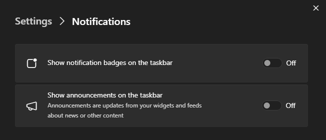
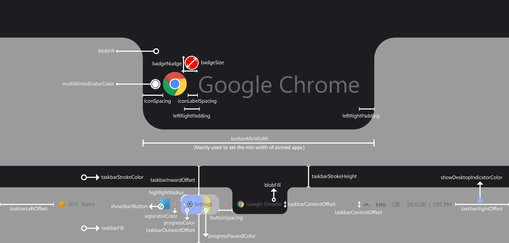

# Blob theme for Windows 11 Taskbar Styler

**Author**: [Deen-0x](https://github.com/Deen-0x)

Dark Mode


Light Mode


Blob Taskbar Replaces the rounded-rectangle indicator behind Windows 11 taskbar buttons with a parametric "blob" — a tab-like shape whose top edge is flat and wide, with concave flares at the top corners so each button reads as a tab merging into the taskbar stroke above it.

## Notes
- Designed on Windows 11 - 25H2 (OS Build 26200.8737).
- Taskbar settings: Search: hide/icon only | Task view: on/off | Widgets - On | Taskbar alignment - Center.

  <details>
  <summary>Click to expand to view Widget Board Settings</summary>
  
  
  </details>

## Windhawk mods for similar results
Click each to expand settings:

  <details>
  <summary>Taskbar Blob Shape</summary>

  ```yaml
BlobShape:
  Dimensions: auto, 18
  Margins: 0, 4, 0, 0
  TopRadius: '10'
  BottomRadius: '8'
Colors:
  BgOpacity: ''
  CustomColor: '#FFFFFF | #09131E'
SystemButtons:
  SystemButtonsBlob: 1
  WidgetsBlob: 1
  DateTimeBlob: 1
  TrayButtonsBlob: 1
  ```
  </details>

  <details>
  <summary>Taskbar Height and Icon Size</summary>

  ```yaml
TaskbarHeight: 36
IconSize: 16
TaskbarButtonWidth: 28
IconSizeSmall: 16
TaskbarButtonWidthSmall: 28
  ```
  </details>


  <details>
  <summary>Taskbar Clock Customization</summary>

  ```yaml
  ShowSeconds: 0
  TimeFormat: ''
  DateFormat: d/M/y
  DateLocale: ''
  WeekdayFormat: custom
  WeekdayFormatCustom: Sun, Mon, Tue, Wed, Thu, Fri, Sat
  TopLine: ''
  BottomLine: '%date% 〡 %time%'
  MiddleLine: '%weekday%'
  TooltipLine: '%web1_full%'
  TooltipLineMode: append
  Width: 180
  Height: 60
  MaxWidth: 0
  TextSpacing: 1
  DataCollection:
    NetworkMetricsFormat: mbs
    NetworkMetricsFixedDecimals: -1
    DiskMetricsFormat: ''
    DiskMetricsFixedDecimals: 0
    PercentageFormat: spacePaddingAndSymbol
    UpdateInterval: 1
    NetworkAdapterName: ''
    GpuAdapterName: ''
  MediaPlayer:
    IgnoredPlayers:
      - ''
    MaxLength: 28
    MediaInfoFormat: ''
    NoMediaText: No media
    RemoveBrackets: 0
  WebContentWeatherLocation: ''
  WebContentWeatherFormat: '%c 🌡️%t 🌬️%w'
  WebContentWeatherUnits: autoDetect
  WebContentsItems:
    - Url: https://rss.nytimes.com/services/xml/rss/nyt/World.xml
      BlockStart: <item>
      Start: <title>
      End: </title>
      ContentMode: xmlHtml
      SearchReplace:
        - Search: ''
          Replace: ''
      MaxLength: 28
  WebContentsUpdateInterval: 10
  TimeZones:
    - Eastern Standard Time
  TimeStyle:
    Hidden: 1
    TextColor: ''
    TextAlignment: Right
    FontSize: 0
    FontFamily: ''
    FontWeight: ''
    FontStyle: ''
    FontStretch: ''
    CharacterSpacing: 0
    LineHeight: 0
  DateStyle:
    Hidden: 0
    TextColor: ''
    TextAlignment: ''
    FontSize: 12
    FontFamily: ''
    FontWeight: Medium
    FontStyle: Normal
    FontStretch: ''
    CharacterSpacing: 0
    LineHeight: 0
  oldTaskbarOnWin11: 0
  ```
  </details>


  <details>
  <summary>Taskbar Labels for Windows 11</summary>

  ```yaml
  mode: labelsWithoutCombining
  taskbarItemWidth: 0
  runningIndicatorStyle: centerFixed
  progressIndicatorStyle: fullWidth
  excludedPrograms:
    - ''
  minimumTaskbarItemWidth: 40
  maximumTaskbarItemWidth: 200
  fontSize: 12
  fontFamily: ''
  textTrimming: clip
  leftAndRightPaddingSize: 0
  spaceBetweenIconAndLabel: 0
  runningIndicatorHeight: 0
  runningIndicatorVerticalOffset: 0
  alwaysShowThumbnailLabels: 0
  labelForSingleItem: ''
  labelForMultipleItems: ''
  ```
  </details>


## Styling

To tweak styleConstants, you may use the illustration below as a guide:

  <details>
  <summary>styleConstants illustration</summary>

  
  </details>


## Theme selection

The theme is integrated into the mod and can be selected directly from the mod's
settings:

* Open the Windows 11 Taskbar Styler mod in Windhawk.
* Go to the "Settings" tab.
* Select the theme and save the settings.

## Manual installation

The theme styles can also be imported manually. To do that, follow these steps:

* Open the Windows 11 Taskbar Styler mod in Windhawk.
* Go to the "Settings" tab and select "Textual mode".
* Copy the content below to the text box and click "Save settings".

<details>
<summary>Content to import (click to expand)</summary>

```yaml
styleConstants:
  - taskbarLeftOffset = 12
  - taskbarRightOffset = 12
  - taskbarTopOffset = 8
  - taskbarBottomOffset = 4
  - taskbarStrokeHeight = 4
  - taskbarContentOffset = 4
  - highlightRadius = 8
  - buttonMinWidth = 36
  - buttonSpacing = 4
  - iconSpacing = 8
  - iconLabelSpacing = 4
  - leftRightPadding = 4
  - badgeSize = 12
  - badgeNudge = 4,6,0,0
  - showStartButton = 1
  - blobFill = <SolidColorBrush Color="{ThemeResource AdaptiveBlob}"/>
  - taskbarStrokeColor = <SolidColorBrush Color="{ThemeResource AdaptiveBlob}"/>
  - taskbarFill = <SolidColorBrush Color="{ThemeResource Default}"/>
  - progressColor = <SolidColorBrush Color="{ThemeResource SystemAccentColor}" Opacity="0.2"/>
  - progressPausedColor = <SolidColorBrush Color="orange" Opacity="0.2"/>
  - showDesktopIndicatorColor = <SolidColorBrush Color="{ThemeResource SystemAccentColor}" Opacity="0.7"/>
  - multiWinIndicatorColor = <SolidColorBrush Color="{ThemeResource AdaptiveIndicator}" Opacity="0.7"/>
  - separatorColor = <SolidColorBrush Color="{ThemeResource AdaptiveIndicator}" Opacity="0.15"/>
controlStyles:
  - target: Taskbar.TaskbarFrame
    styles:
      - Height => TaskbarHeight
      - // Taskbar frame. Nothing is set here. The height is only captured into TaskbarHeight,
      - // which the progress indicator below sizes itself from.
  - target: Taskbar.TaskbarBackground#BackgroundControl > Grid > Rectangle#BackgroundFill
    styles:
      - Fill := $taskbarFill
      - // Taskbar background fill (the surface everything else sits on).
      - // $taskbarFill deliberately points at an undefined ThemeResource, which makes it an empty
      - // placeholder. Leave it as is to keep the stock background, or swap in your own brush.
  - target: Taskbar.TaskbarBackground#BackgroundControl > Grid > Rectangle#BackgroundStroke
    styles:
      - Height := $taskbarStrokeHeight
      - Fill := $taskbarStrokeColor
      - // Taskbar top stroke, thickened to $taskbarStrokeHeight and tinted with the blob color so the
      - // blob's flat top edge reads as continuous with the taskbar edge (the tab-strip look).
  - target: Taskbar.TaskListButton#TaskListButton > Taskbar.TaskListLabeledButtonPanel#IconPanel
    styles:
      - Padding := {{$buttonSpacing-2}},{{$taskbarTopOffset}},{{$buttonSpacing-2}},{{$taskbarBottomOffset}}
      - MinWidth := $buttonMinWidth
      - // Taskbar button box. Horizontal padding is half of $buttonSpacing per side, so the visible
      - // gap between two neighbouring buttons adds up to $buttonSpacing. Vertical padding sets how
      - // far the highlight is inset from the top/bottom taskbar edges.
  - target: Microsoft.UI.Xaml.Controls.ItemsRepeater#TaskbarFrameRepeater > Taskbar.ExperienceToggleButton#LaunchListButton > Taskbar.TaskListButtonPanel#ExperienceToggleButtonRootPanel
    styles:
      - Padding := {{$buttonSpacing-2}},{{$taskbarTopOffset}},{{$buttonSpacing-2}},{{$taskbarBottomOffset}}
      - MinWidth := $buttonMinWidth
      - // Start and Task View buttons. Same padding/min-width recipe as task buttons so all three align.
  - target: Microsoft.UI.Xaml.Controls.ItemsRepeater#TaskbarFrameRepeater > Taskbar.TaskbarExtensionElement > ContentPresenter > SearchUx.SearchUI.SearchButtonControl > Grid > SearchUx.SearchUI.SearchIconButton#SearchIcon > SearchUx.SearchUI.SearchButtonRootGrid#SearchBoxButtonRootPanel
    styles:
      - Padding := {{$buttonSpacing-2}},{{$taskbarTopOffset}},{{$buttonSpacing-2}},{{$taskbarBottomOffset}}
      - MinWidth := $buttonMinWidth
      - // Search button (icon mode). Same padding/min-width recipe as task buttons.
  - target: Microsoft.UI.Xaml.Controls.ItemsRepeater#TaskbarFrameRepeater > Taskbar.ExperienceToggleButton#LaunchListButton > Taskbar.TaskListButtonPanel#ExperienceToggleButtonRootPanel@CommonStates > Border#BackgroundElement
    styles:
      - Background@ActiveNormal := $blobFill
      - Background@ActivePressed := $blobFill
      - Background@InactivePressed := $blobFill
      - Background@ActivePointerOver := $blobFill
      - Background@InactivePointerOver := $blobFill
      - CornerRadius := $highlightRadius
      - BorderThickness = 0
      - BackgroundTransition := <BrushTransition Duration="0:0:0"/>
      - // Start / Task View highlight.
  - target: Microsoft.UI.Xaml.Controls.ItemsRepeater#TaskbarFrameRepeater > Taskbar.TaskbarExtensionElement > ContentPresenter > SearchUx.SearchUI.SearchButtonControl > Grid > SearchUx.SearchUI.SearchIconButton#SearchIcon > SearchUx.SearchUI.SearchButtonRootGrid#SearchBoxButtonRootPanel@CommonStates > Border#BackgroundElement
    styles:
      - Background@ActiveNormal := $blobFill
      - Background@ActivePressed := $blobFill
      - Background@InactivePressed := $blobFill
      - Background@ActivePointerOver := $blobFill
      - Background@InactivePointerOver := $blobFill
      - CornerRadius := $highlightRadius
      - BorderThickness = 0
      - BackgroundTransition := <BrushTransition Duration="0:0:0"/>
      - // Search button highlight.
  - target: Taskbar.ExperienceToggleButton#LaunchListButton > Taskbar.TaskListButtonPanel#ExperienceToggleButtonRootPanel > Microsoft.UI.Xaml.Controls.AnimatedVisualPlayer#Icon
    styles:
      - Margin := 0,0,0,{{$taskbarContentOffset-2}}
      - // Start / Task View glyphs. Lifted by $taskbarContentOffset-2; icons use -2 and text uses the
      - // full offset, which is what keeps glyphs and labels on the same optical baseline.
  - target: SearchUx.SearchUI.SearchButtonRootGrid#SearchBoxButtonRootPanel > Microsoft.UI.Xaml.Controls.AnimatedVisualPlayer#Icon
    styles:
      - Margin := 0,0,0,{{$taskbarContentOffset-2}}
      - // Search glyph, lifted to the same optical baseline as the other icons.
  - target: Taskbar.TaskListLabeledButtonPanel#IconPanel@CommonStates > Border#BackgroundElement
    styles:
      - Margin = 0
      - Background@ActiveNormal := $blobFill
      - Background@InactiveNormal = Transparent
      - Background@ActivePointerOver := $blobFill
      - Background@InactivePointerOver := $blobFill
      - Background@ActivePressed := $blobFill
      - Background@InactivePressed := $blobFill
      - Background@MultiWindowActive := $blobFill
      - Background@MultiWindowPointerOver := $blobFill
      - Background@MultiWindowPressed := $blobFill
      - Background@RequestingAttentionPointerOver := $blobFill
      - Background@RequestingAttentionPressed := $blobFill
      - Background@RequestingAttentionMultiPointerOver := $blobFill
      - Background@RequestingAttentionMultiPressed := $blobFill
      - CornerRadius := $highlightRadius
      - BorderThickness = 0
      - Canvas.ZIndex = 0
      - BackgroundTransition := <BrushTransition Duration="0:0:0"/>
      - // Native button highlight, and the standalone fallback for the blob. It carries the same
      - // $blobFill so a button still reads correctly when the Blob Shape mod is not installed.
      - // Border thickness is zeroed for consistent behavior (in light mode the native border is transparent).
      - // <BrushTransition Duration="0:0:0"/> disables the brush transition, which is what removes the hover flashing that
      - // appears when the Windows "Animation effects" setting is on.
  - target: Taskbar.TaskListLabeledButtonPanel#IconPanel@CommonStates > Rectangle#RunningIndicator
    styles:
      - Opacity@NoRunningIndicator = 0
      - Width = 2
      - Height = 2
      - VerticalAlignment = 1
      - Margin = 3,0,0,0
      - Opacity = 0
      - Opacity@MultiWindowNormal = 1
      - Opacity@MultiWindowActive = 1
      - Opacity@MultiWindowPressed = 1
      - Opacity@MultiWindowPointerOver = 1
      - Opacity@RequestingAttentionMulti = 1
      - Opacity@RequestingAttentionMultiPointerOver = 1
      - Opacity@RequestingAttentionMultiPressed = 1
      - Fill := $multiWinIndicatorColor
      - RadiusX = 0
      - RadiusY = 0
      - StrokeThickness = 0
      - Canvas.ZIndex = 4
      - // The native running indicator is repurposed as the multi-window marker. It is collapsed by
      - // default (Opacity = 0) and shown only in the MultiWindow*/RequestingAttentionMulti* states.
      - // Drawn as a square rather than a dot (RadiusX/RadiusY = 0), on top of everything else.
  - target: Microsoft.UI.Xaml.Controls.ProgressBar#ProgressIndicator
    styles:
      - Height := {{TaskbarHeight-($taskbarBottomOffset+$taskbarTopOffset)}}
      - Margin = 1,0,0,0
      - CornerRadius := $highlightRadius
      - // Progress indicator, sized to the button highlight (taskbar height minus the vertical offsets)
      - // so a downloading app keeps the same pill footprint as an idle one.
  - target: Microsoft.UI.Xaml.Controls.ProgressBar#ProgressIndicator > Grid#LayoutRoot
    styles:
      - CornerRadius := $highlightRadius
      - Canvas.ZIndex = 1
      - // While a task shows progress, this grid stands in for the button background.
      - // Z-index 1 puts it above Border#BackgroundElement at 0 and below icon/label at 3.
  - target: Border#ProgressBarRoot > Border > Grid
    styles:
      - Height = Auto
      - // Progress bar container, height released so it can fill the pill.
  - target: Grid#LayoutRoot > Border#ProgressBarRoot > Border > Grid > Rectangle#ProgressBarTrack
    styles:
      - Fill = Transparent
      - // Progress bar track hidden; only the indicators below are tinted.
  - target: Grid#LayoutRoot@CommonStates > Border#ProgressBarRoot > Border > Grid > Rectangle#DeterminateProgressBarIndicator
    styles:
      - Fill := $progressColor
      - Fill@Paused := $progressPausedColor
      - // Determinate progress fill (task progress).
  - target: Grid#LayoutRoot@CommonStates > Border#ProgressBarRoot > Border > Grid > Rectangle#IndeterminateProgressBarIndicator
    styles:
      - Fill := $progressColor
      - Fill@Paused := $progressPausedColor
      - // Indeterminate progress fill (loading state).
  - target: Grid#LayoutRoot@CommonStates > Border#ProgressBarRoot > Border > Grid > Rectangle#IndeterminateProgressBarIndicator2
    styles:
      - Fill := $progressColor
      - Fill@Paused := $progressPausedColor
      - // Second indeterminate progress fill (the trailing bar of the animation).
  - target: Border#MultiWindowElement
    styles:
      - Visibility = 1
      - // Native multi-window bar collapsed; Rectangle#RunningIndicator above takes over that role.
  - target: Taskbar.TaskListLabeledButtonPanel > TextBlock#LabelControl
    styles:
      - Margin := {{$iconLabelSpacing}},0,4,{{$taskbarContentOffset}}
      - Padding := {{$leftRightPadding}},0
      - Canvas.ZIndex = 3
      - // Button label. Left margin is the icon-to-label gap; right margin plus padding plus the panel
      - // padding gives the trailing inset, matching the leading inset on the icon side.
  - target: Taskbar.TaskListButton#TaskListButton > Taskbar.TaskListLabeledButtonPanel#IconPanel > Image#Icon
    styles:
      - Margin := {{$iconSpacing}},0,0,{{$taskbarContentOffset-2}}
      - Canvas.ZIndex = 3
      - HorizontalAlignment = 0
      - // Button icon. Left margin plus the panel padding gives the leading inset;
      - // the -2 keeps it on the same baseline as the other icons.
  - target: Taskbar.TaskListLabeledButtonPanel > Rectangle#DefaultIcon
    styles:
      - Stretch = 1
      - Height = 8
      - Width = 1
      - Visibility = 0
      - Fill := $separatorColor
      - RenderTransform := <TranslateTransform X="-14" Y="0" />
      - // The fallback icon slot is repurposed as a thin vertical separator between buttons.
      - // The X offset is hand-tuned against the current spacing constants; re-check it if
      - // $iconSpacing or $buttonSpacing changes.
  - target: Taskbar.ExperienceToggleButton#LaunchListButton > Taskbar.TaskListButtonPanel#ExperienceToggleButtonRootPanel
    styles:
      - Visibility := {{1-$showStartButton}}
      - // Start / Task View visibility. $showStartButton = 1 shows them, 0 collapses them
      - // (the expression inverts because Visibility 0 = Visible, 1 = Collapsed).
      - // The constant is named for Start, but this selector covers Task View as well.
  - target: Taskbar.TaskListLabeledButtonPanel#IconPanel > Image#OverlayIcon
    styles:
      - Width := $badgeSize
      - Height := $badgeSize
      - Margin := $badgeNudge
      - Canvas.ZIndex = 3
      - // Overlay badge (e.g. Teams status), resized and nudged onto the icon corner.
  - target: Taskbar.TaskListLabeledButtonPanel#IconPanel > Taskbar.Badge#BadgeControl
    styles:
      - MinWidth := $badgeSize
      - Width := $badgeSize
      - Height := $badgeSize
      - Margin := $badgeNudge
      - Canvas.ZIndex = 3
      - // Counter badge, matched to the overlay badge size and position.
  - target: Taskbar.TaskListLabeledButtonPanel#IconPanel > Taskbar.Badge#BadgeControl > Grid > TextBlock#BadgeText
    styles:
      - FontSize = 8
      - // Counter badge text, hand-tuned to fit $badgeSize; re-check it if the badge size changes.
  - target: SystemTray.SystemTrayFrame > StackPanel#SystemTrayFrameGrid > SystemTray.OmniButton#NotificationCenterButton, SystemTray.SystemTrayFrame > Grid#SystemTrayFrameGrid > SystemTray.OmniButton#NotificationCenterButton
    styles:
      - Margin := 0,0,{{$taskbarRightOffset-12}},0
      - // System tray trailing margin. 12 is subtracted to absorb the default "show desktop"
      - // indicator width, so $taskbarRightOffset = 12 means "flush with the stock edge".
  - target: SystemTray.OmniButton#NotificationCenterButton > Grid@CommonStates > Border#BackgroundBorder
    styles:
      - Margin := 2,{{$taskbarTopOffset}},0,{{$taskbarBottomOffset}}
      - Background@PointerOver := $blobFill
      - Background@Pressed := $blobFill
      - Background@Checked := $blobFill
      - Background@CheckedPointerOver := $blobFill
      - Background@CheckedPressed := $blobFill
      - CornerRadius := $highlightRadius
      - BorderThickness = 0
      - BackgroundTransition := <BrushTransition Duration="0:0:0"/>
      - CornerRadius := $highlightRadius
      - // Clock / notification center highlight.
  - target: SystemTray.OmniButton#ControlCenterButton > Grid@CommonStates > Border#BackgroundBorder
    styles:
      - Margin := 2,{{$taskbarTopOffset}},2,{{$taskbarBottomOffset}}
      - Background@PointerOver := $blobFill
      - Background@Pressed := $blobFill
      - Background@Checked := $blobFill
      - Background@CheckedPointerOver := $blobFill
      - Background@CheckedPressed := $blobFill
      - CornerRadius := $highlightRadius
      - BorderThickness = 0
      - BackgroundTransition := <BrushTransition Duration="0:0:0"/>
      - CornerRadius := $highlightRadius
      - // Control center highlight.
  - target: SystemTray.IconView#SystemTrayIcon > Grid#ContainerGrid@ > Border#BackgroundBorder
    styles:
      - Margin := 2,{{$taskbarTopOffset}},2,{{$taskbarBottomOffset}}
      - Background@CheckedNormal := $blobFill
      - Background@CheckedPressed := $blobFill
      - Background@Pressed := $blobFill
      - Background@CheckedPointerOver := $blobFill
      - Background@PointerOver := $blobFill
      - CornerRadius := $highlightRadius
      - BorderThickness = 0
      - BackgroundTransition := <BrushTransition Duration="0:0:0"/>
      - // Language indicator and system tray icon highlights.
  - target: SystemTray.NotifyIconView#NotifyItemIcon > Grid#ContainerGrid@ > Border#BackgroundBorder
    styles:
      - Margin := 2,{{$taskbarTopOffset}},2,{{$taskbarBottomOffset}}
      - Background@CheckedNormal := $blobFill
      - Background@CheckedPressed := $blobFill
      - Background@Pressed := $blobFill
      - Background@CheckedPointerOver := $blobFill
      - Background@PointerOver := $blobFill
      - CornerRadius := $highlightRadius
      - BorderThickness = 0
      - BackgroundTransition := <BrushTransition Duration="0:0:0"/>
      - // Notification area (tray) icon highlights.
  - target: SystemTray.ChevronIconView > Grid#ContainerGrid@ > Border#BackgroundBorder
    styles:
      - Margin := 2,{{$taskbarTopOffset}},2,{{$taskbarBottomOffset}}
      - Background@CheckedNormal := $blobFill
      - Background@CheckedPressed := $blobFill
      - Background@Pressed := $blobFill
      - Background@CheckedPointerOver := $blobFill
      - Background@PointerOver := $blobFill
      - CornerRadius := $highlightRadius
      - BorderThickness = 0
      - BackgroundTransition := <BrushTransition Duration="0:0:0"/>
      - // Tray overflow chevron highlight.
  - target: SystemTray.OmniButton#NotificationCenterButton > Grid > ContentPresenter#ContentPresenter > ItemsPresenter > StackPanel
    styles:
      - Margin := 0,0,0,{{$taskbarBottomOffset-$taskbarTopOffset+$taskbarContentOffset}}
      - // Clock text. The bottom-minus-top term cancels the asymmetric button padding, then
      - // $taskbarContentOffset applies the same optical lift used on the task buttons.
  - target: SystemTray.OmniButton#ControlCenterButton > Grid > ContentPresenter#ContentPresenter > ItemsPresenter
    styles:
      - Margin := 0,0,0,{{$taskbarBottomOffset-$taskbarTopOffset+$taskbarContentOffset-2}}
      - // Control center glyphs; -2 because glyphs sit two pixels lower than text.
  - target: SystemTray.AdaptiveTextBlock#LanguageInnerTextBlock > TextBlock#InnerTextBlock
    styles:
      - MaxLines = 1
      - Margin := 0,0,0,{{$taskbarBottomOffset-$taskbarTopOffset+$taskbarContentOffset}}
      - // Language indicator forced to one line (otherwise it wraps to "ENG / US"), lifted like the clock.
  - target: SystemTray.Stack#MainStack > Grid#Content > SystemTray.StackListView#IconStack > ItemsPresenter > StackPanel > ContentPresenter > SystemTray.IconView#SystemTrayIcon > Grid#ContainerGrid > ContentPresenter#ContentPresenter > Grid#ContentGrid > SystemTray.TextIconContent > Grid#ContainerGrid > SystemTray.AdaptiveTextBlock#Base
    styles:
      - Margin := 0,0,0,{{$taskbarBottomOffset-$taskbarTopOffset+$taskbarContentOffset-2}}
      - // Tray glyph icons (network, volume, battery), lifted to the shared glyph baseline.
  - target: SystemTray.NotificationAreaIcons#NotificationAreaIcons > ItemsPresenter > StackPanel > ContentPresenter > SystemTray.NotifyIconView#NotifyItemIcon > Grid#ContainerGrid > ContentPresenter#ContentPresenter > Grid#ContentGrid > SystemTray.ImageIconContent > Grid#ContainerGrid > Image
    styles:
      - Margin := 0,0,0,{{$taskbarBottomOffset-$taskbarTopOffset+$taskbarContentOffset-2}}
      - // Third-party notification area icons, lifted to the shared glyph baseline.
  - target: SystemTray.ChevronIconView > Grid#ContainerGrid > ContentPresenter#ContentPresenter
    styles:
      - Margin := 0,0,0,{{$taskbarBottomOffset-$taskbarTopOffset+$taskbarContentOffset-2}}
      - // Tray overflow chevron, lifted to the shared glyph baseline.
  - target: Grid#OverflowRootGrid > Border
    styles:
      - Shadow :=
      - // Tray overflow flyout, shadow cleared (an empty := assigns null).
  - target: Taskbar.AugmentedEntryPointButton#AugmentedEntryPointButton > Taskbar.TaskListButtonPanel#ExperienceToggleButtonRootPanel > Grid#AugmentedEntryPointContentGrid > Grid > Grid > AdaptiveCards.Rendering.Uwp.WholeItemsPanel > Border > AdaptiveCards.Rendering.Uwp.WholeItemsPanel > Grid > Border#LargeTicker2 > AdaptiveCards.Rendering.Uwp.WholeItemsPanel
    styles:
      - RenderTransform := <TranslateTransform X="0" Y="-1" />
      - // Weather widget text block container (vertical nudge).
  - target: Taskbar.AugmentedEntryPointButton#AugmentedEntryPointButton > Taskbar.TaskListButtonPanel#ExperienceToggleButtonRootPanel > Grid#AugmentedEntryPointContentGrid > Grid > Grid > AdaptiveCards.Rendering.Uwp.WholeItemsPanel > Border > AdaptiveCards.Rendering.Uwp.WholeItemsPanel > Grid > Border#LargeTicker2 > AdaptiveCards.Rendering.Uwp.WholeItemsPanel > TextBlock[1]
    styles:
      - ActualWidth => WeatherTempWidth
      - RenderTransform := <TranslateTransform X="0" Y="8" />
      - // Temperature text. Its measured width is captured into WeatherTempWidth and drives both the
      - // condition text offset and the widget width below (this is how the widget becomes adaptive).
  - target: Taskbar.AugmentedEntryPointButton#AugmentedEntryPointButton > Taskbar.TaskListButtonPanel#ExperienceToggleButtonRootPanel > Grid#AugmentedEntryPointContentGrid > Grid > Grid > AdaptiveCards.Rendering.Uwp.WholeItemsPanel > Border > AdaptiveCards.Rendering.Uwp.WholeItemsPanel > Grid > Border#LargeTicker2 > AdaptiveCards.Rendering.Uwp.WholeItemsPanel > TextBlock[2]
    styles:
      - ActualWidth => WeatherCondWidth
      - RenderTransform := <TranslateTransform X="{{WeatherTempWidth+8}}" Y="-8" />
      - // Condition text, pushed right of the temperature by its measured width plus an 8px gap,
      - // and pulled back up onto the same line.
  - target: Taskbar.TaskListButtonPanel#ExperienceToggleButtonRootPanel > Grid#AugmentedEntryPointContentGrid
    styles:
      - Margin := 0,0,0,{{$taskbarContentOffset-4}}
      - Width := {{WeatherCondWidth+WeatherTempWidth+62}}
      - // Weather widget content grid, width driven by the two captured text widths plus 62px
      - // for the icon and padding.
  - target: Taskbar.AugmentedEntryPointButton#AugmentedEntryPointButton > Taskbar.TaskListButtonPanel#ExperienceToggleButtonRootPanel
    styles:
      - Width := {{WeatherCondWidth+WeatherTempWidth+62}}
      - Margin := {{$taskbarLeftOffset-12}},0,56,0
      - Padding := 12,{{$taskbarTopOffset}},0,{{$taskbarBottomOffset}}
      - // Weather widget root, kept the same width as its content grid.
      - // Leading margin subtracts 12 so $taskbarLeftOffset = 12 means "flush with the stock edge";
      - // the trailing 56 reserves room before the first task button.
  - target: Taskbar.AugmentedEntryPointButton#AugmentedEntryPointButton > Taskbar.TaskListButtonPanel#ExperienceToggleButtonRootPanel@CommonStates > Border#BackgroundElement
    styles:
      - Background@ActiveNormal := $blobFill
      - Background@ActivePressed := $blobFill
      - Background@InactivePressed := $blobFill
      - Background@ActivePointerOver := $blobFill
      - Background@InactivePointerOver := $blobFill
      - CornerRadius := $highlightRadius
      - BorderThickness = 0
      - BackgroundTransition := <BrushTransition Duration="0:0:0"/>
      - // Weather widget highlight, rounded like the task buttons.
  - target: Taskbar.TaskbarFrame > Grid#RootGrid > Microsoft.UI.Xaml.Controls.ItemsRepeater#TaskbarFrameRepeater > Taskbar.AugmentedEntryPointButton#AugmentedEntryPointButton > Taskbar.TaskListButtonPanel#ExperienceToggleButtonRootPanel > Grid#AugmentedEntryPointContentGrid > Grid > Grid > AdaptiveCards.Rendering.Uwp.WholeItemsPanel
    styles:
      - Margin = 0,3,0,0
      - // Weather widget adaptive card root (vertical position refinement).
  - target: Taskbar.AugmentedEntryPointButton#AugmentedEntryPointButton > Taskbar.TaskListButtonPanel#ExperienceToggleButtonRootPanel > Grid#AugmentedEntryPointContentGrid > Grid[0] > Grid[2]
    styles:
      - HorizontalAlignment = 1
      - VerticalAlignment = 1
      - RenderTransformOrigin = -0.5,0.5
      - RenderTransform := <TransformGroup><ScaleTransform ScaleX = "0.9" ScaleY = "0.9" /><TranslateTransform X="10" Y="8" /></TransformGroup>
      - // Weather widget in its overflow/compact layout, scaled down and repositioned.
  - target: Taskbar.TaskListButtonPanel#ExperienceToggleButtonRootPanel > Grid#AugmentedEntryPointContentGrid > Grid > Grid > AdaptiveCards.Rendering.Uwp.WholeItemsPanel > Border > AdaptiveCards.Rendering.Uwp.WholeItemsPanel > Grid
    styles:
      - Background = Transparent
      - // Weather widget temperature panel, card background cleared (when overflow).
  - target: Taskbar.TaskbarFrame > Grid#RootGrid > Microsoft.UI.Xaml.Controls.ItemsRepeater#TaskbarFrameRepeater > Taskbar.AugmentedEntryPointButton#AugmentedEntryPointButton > Taskbar.TaskListButtonPanel#ExperienceToggleButtonRootPanel > Grid#AugmentedEntryPointContentGrid > Grid > Grid
    styles:
      - Margin = 16,0,0,0
      - HorizontalAlignment = 0
      - // Weather widget inner grid, left-aligned with a fixed 16px inset (when overflow).
  - target: Taskbar.TaskListButtonPanel#ExperienceToggleButtonRootPanel > Grid#AugmentedEntryPointContentGrid > Grid > Grid > AdaptiveCards.Rendering.Uwp.WholeItemsPanel > Border > AdaptiveCards.Rendering.Uwp.WholeItemsPanel > Grid > Border#LargeTicker1 > AdaptiveCards.Rendering.Uwp.WholeItemsPanel > Microsoft.UI.Xaml.Controls.AnimatedVisualPlayer#BadgeAnchorLargeTicker
    styles:
      - Margin := 0,0,0,1
      - // Weather widget icon (position refinement).
  - target: WindowsInternal.ComposableShell.Experiences.TextInput.Common.InputSwitcher > ContentControl > ContentPresenter > Grid
    styles:
      - Shadow :=
      - // Language switcher flyout, shadow cleared.
  - target: Grid#ContainerGrid@ > Rectangle#ShowDesktopPipe
    styles:
      - Width = 4
      - Height = 4
      - Height@PointerOver = 10
      - Height@Pressed = 6
      - RadiusX = 2
      - RadiusY = 2
      - Margin := 0,{{$taskbarTopOffset}},0,{{$taskbarBottomOffset+$taskbarContentOffset-4}}
      - Fill := $showDesktopIndicatorColor
      - // "Show desktop" corner control, reshaped from a bar into a dot that grows on hover.
      - // The bare @ attaches to the element's default visual state group (it has only one).
  - target: Taskbar.TaskListButtonPanel#OverflowToggleButtonRootPanel
    styles:
      - Margin := 8,{{$taskbarTopOffset}},0,{{$taskbarBottomOffset}}
      - Padding = 0
      - // Overflow ("show hidden icons") button, separated from the tray stack by a fixed leading margin.
  - target: Taskbar.TaskListButtonPanel#OverflowToggleButtonRootPanel > Border#BackgroundElement
    styles:
      - CornerRadius := $highlightRadius
      - // Overflow button highlight, rounded like the task buttons.
  - target: ScrollViewer > ScrollContentPresenter > Border > Taskbar.FlyoutFrame > Canvas#HoverFlyoutCanvas > Grid#HoverFlyoutGrid > Border#HoverFlyoutBackground
    styles:
      - Shadow :=
      - // Overflow flyout background, shadow cleared.
  - target: Microsoft.UI.Xaml.Controls.ItemsRepeater#OverflowFlyoutListRepeater > Taskbar.TaskListButton#TaskListButton > Taskbar.TaskListLabeledButtonPanel#IconPanel
    styles:
      - MinWidth = 28
      - Padding := {{$buttonSpacing-2}},4
      - // Buttons inside the overflow flyout. Padding is reset to a uniform value, because the
      - // asymmetric $taskbarTopOffset / $taskbarBottomOffset inherited from the main rule is meant
      - // for the taskbar edges and has nothing to align to inside a flyout.
  - target: Microsoft.UI.Xaml.Controls.ItemsRepeater#OverflowFlyoutListRepeater > Taskbar.TaskListButton#TaskListButton > Taskbar.TaskListLabeledButtonPanel#IconPanel > Image#Icon
    styles:
      - Margin = 0
      - // Flyout button icons. The $iconSpacing offset used on the taskbar is cancelled here,
      - // since there is no label to leave room for.
  - target: Microsoft.UI.Xaml.Controls.ItemsRepeater#OverflowFlyoutListRepeater > Taskbar.TaskListButton#TaskListButton > Taskbar.TaskListLabeledButtonPanel#IconPanel > Border#BackgroundElement
    styles:
      - Margin = 0
      - // Flyout button highlight, reset to fill its button.
  - target: Microsoft.UI.Xaml.Controls.ItemsRepeater#OverflowFlyoutListRepeater > Taskbar.TaskListButton#TaskListButton > Taskbar.TaskListLabeledButtonPanel#IconPanel > Rectangle#RunningIndicator
    styles:
      - Opacity = 0
      - // Multi-window marker hidden inside the flyout, where it has no room to read clearly.
  - target: Windows.UI.Xaml.Shapes.Path#BlobShape
    styles:
      - Fill := $blobFill
      - // Blob injected by the Taskbar Blob Shape mod, filled from the same $blobFill as the native
      - // highlight so the two stay in sync. Requires that mod; without it this target simply no-ops.
themeResourceVariables:
  - AdaptiveIndicator@Light =#000000
  - AdaptiveIndicator@Dark =#FFFFFF
  - AdaptiveBlob@Light =#FFFFFF
  - AdaptiveBlob@Dark =#09131E
```
</details>
