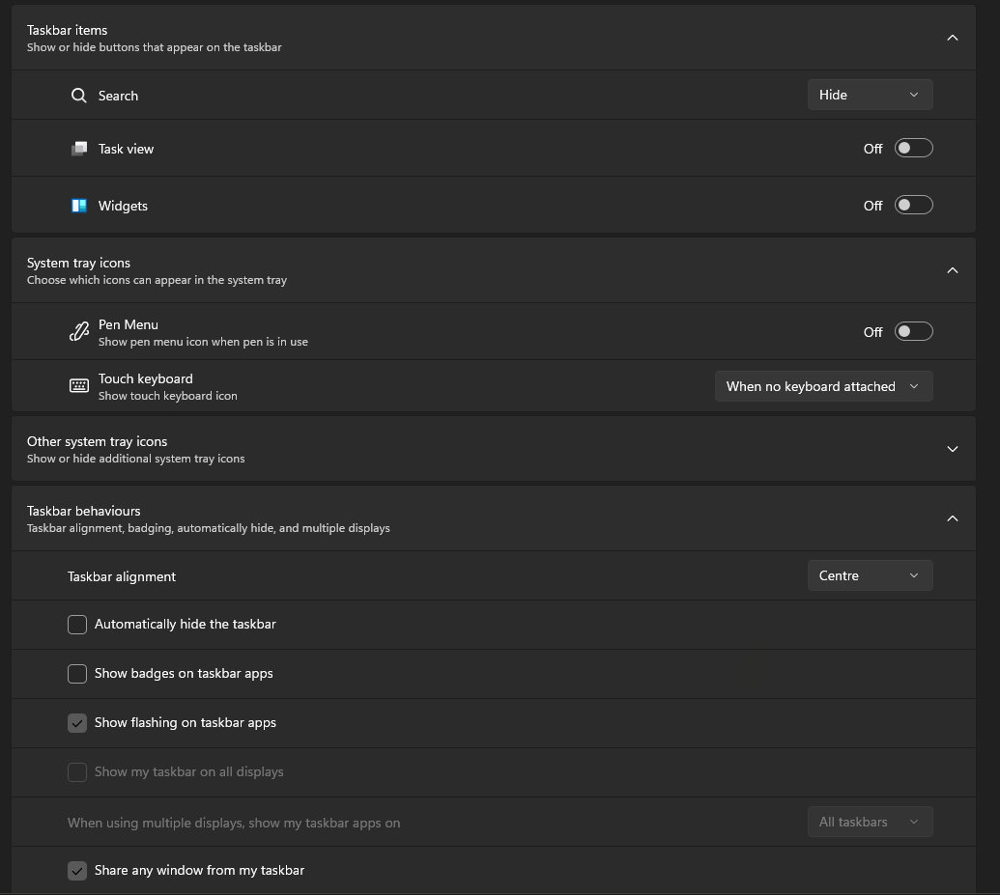

# Bubbles theme (White Accents, Minimalistic) for Windows 11 Taskbar Styler

This is a modified version of the original Bubbles theme, originally made by [m417z](https://github.com/m417z) and modified by [Moh23John](https://github.com/Moh23John).
I have made a few changes, with the main focus of changing the accents to white. The theme is meant for certain taskbar settings. The code for the parts that aren't meant to be used with this modified version of the theme has been excluded. I have given a screenshot of the taskbar settings to copy below. I have also included a JSONC file with comments that tell you what (almost) each line of code does. This helps you customize the taskbar if you'd like, and you can also use the information from the JSONC here to customize the original Bubbles theme. This is for users who want an extremely minimalistic, clean, dark look. I recommend turning on dark mode, using dark grey as your theme colours, getting a clean wallpaper and hiding icons. This version of the theme may fall behind the original. People may update the original theme, and the features in this theme may not be as updated as the original. Some features will be intentionally left out. But I will try my best to implement my changes, and also look at the current state of the original theme and try and implement those changes into the theme.

## Installation

* Open the Windows 11 Taskbar Styler mod in Windhawk.
* Go to the "Advanced" tab.
* Copy the content below to the text box under "Mod settings" and click "Save".

## Screenshots (Taskbar Settings)



## Screenshots (Preview)


<details>
<summary>Content to import (click to expand)</summary>

```json
{
  "controlStyles[0].target": "Rectangle#BackgroundFill",
  "controlStyles[0].styles[0]": "Fill=#1b1b19",
  "controlStyles[1].target": "Taskbar.TaskListLabeledButtonPanel@RunningIndicatorStates > Border#BackgroundElement",
  "controlStyles[1].styles[0]": "Background=#303030",
  "controlStyles[1].styles[1]": "CornerRadius=20",
  "controlStyles[1].styles[2]": "Background@NoRunningIndicator=#40303030",
  "controlStyles[2].target": "Taskbar.TaskListButtonPanel@CommonStates > Border#BackgroundElement",
  "controlStyles[2].styles[0]": "Background=#303030",
  "controlStyles[2].styles[1]": "CornerRadius=20",
  "controlStyles[2].styles[2]": "Background@ActivePointerOver=#242424",
  "controlStyles[2].styles[3]": "Background@InactivePointerOver=#242424",
  "controlStyles[2].styles[4]": "Background@ActivePressed=#181818",
  "controlStyles[2].styles[5]": "Background@InactivePressed=#181818",
  "controlStyles[3].target": "Grid#SystemTrayFrameGrid",
  "controlStyles[3].styles[0]": "Background=#303030",
  "controlStyles[3].styles[1]": "CornerRadius=20",
  "controlStyles[3].styles[2]": "Margin=0,5,4,5",
  "controlStyles[3].styles[3]": "Padding=10,0,0,0",
  "controlStyles[4].target": "Taskbar.TaskListLabeledButtonPanel@CommonStates > Rectangle#RunningIndicator",
  "controlStyles[4].styles[0]": "Width=40",
  "controlStyles[4].styles[1]": "Height=40",
  "controlStyles[4].styles[2]": "Stroke@InactivePointerOver=#CCCCCC",
  "controlStyles[4].styles[3]": "Stroke@InactivePressed=#F0F0F0",
  "controlStyles[4].styles[4]": "Stroke@ActiveNormal=#B0B0B0",
  "controlStyles[4].styles[5]": "Stroke@ActivePointerOver=#D0D0D0",
  "controlStyles[4].styles[6]": "Stroke@ActivePressed=#F0F0F0",
  "controlStyles[4].styles[7]": "Fill=Transparent",
  "controlStyles[4].styles[8]": "RadiusX=20",
  "controlStyles[4].styles[9]": "RadiusY=20",
  "controlStyles[4].styles[10]": "StrokeThickness=3.5",
  "controlStyles[4].styles[11]": "Margin=0",
  "controlStyles[4].styles[12]": "Stroke@MultiWindowPointerOver=#CCCCCC",
  "controlStyles[4].styles[13]": "Stroke@MultiWindowPressed=#F0F0F0",
  "controlStyles[4].styles[14]": "Stroke@MultiWindowActive=#B0B0B0",
  "controlStyles[4].styles[11]": "Fill@MultiWindowNormal=#88AAAAAA",
  "controlStyles[4].styles[16]": "Fill@MultiWindowPointerOver=#88AAAAAA",
  "controlStyles[4].styles[17]": "Fill@MultiWindowActive=#88AAAAAA",
  "controlStyles[4].styles[18]": "Fill@MultiWindowPressed=#88AAAAAA",
  "controlStyles[5].target": "TextBlock#TimeInnerTextBlock",
  "controlStyles[5].styles[0]": "Foreground=White",
  "controlStyles[6].target": "TextBlock#DateInnerTextBlock",
  "controlStyles[6].styles[0]": "Foreground=White",
  "controlStyles[7].target": "SystemTray.TextIconContent > Grid > SystemTray.AdaptiveTextBlock#Base > TextBlock",
  "controlStyles[7].styles[0]": "Foreground=White",
  "controlStyles[8].target": "Grid#OverflowRootGrid > Border",
  "controlStyles[8].styles[0]": "Background=#E6E6E6CC",
  "controlStyles[8].styles[1]": "BorderBrush=#ee0808",
  "controlStyles[8].styles[2]": "BorderThickness=2.5",
  "controlStyles[9].target": "Taskbar.ExperienceToggleButton#LaunchListButton[AutomationProperties.AutomationId=StartButton] > Taskbar.TaskListButtonPanel > Microsoft.UI.Xaml.Controls.AnimatedVisualPlayer#Icon",
  "controlStyles[9].styles[0]": "Margin=1,0,0,0",
  "controlStyles[10].target": "SystemTray.Stack#ShowDesktopStack",
  "controlStyles[10].styles[0]": "Padding=5,0,5,0",
  "controlStyles[10].styles[1]": "Margin=2,0,10,0",
  "controlStyles[11].target": "Windows.UI.Xaml.Shapes.Rectangle#ShowDesktopPipe",
  "controlStyles[11].styles[0]": "MinWidth=4",
  "controlStyles[11].styles[1]": "RadiusX=2",
  "controlStyles[11].styles[2]": "RadiusY=2",
  "controlStyles[12].target": "SystemTray.Stack#NotifyIconStack > Windows.UI.Xaml.Controls.Grid > SystemTray.StackListView > Windows.UI.Xaml.Controls.ItemsPresenter > Windows.UI.Xaml.Controls.StackPanel > Windows.UI.Xaml.Controls.ContentPresenter > SystemTray.ChevronIconView > Windows.UI.Xaml.Controls.Grid > Windows.UI.Xaml.Controls.Border#BackgroundBorder",
  "controlStyles[12].styles[0]": "CornerRadius=16,5,5,16",
  "controlStyles[12].styles[1]": "Margin=-3,4,0,4"
}
```
