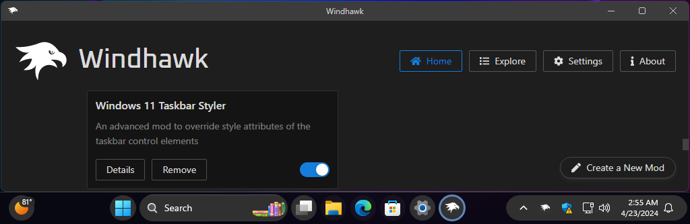

# Bubbles theme for Windows 11 Taskbar Styler

This theme was created as a showcase in response to [this question on
Reddit](https://www.reddit.com/r/windows/comments/1c7522o/anyone_know_if_this_taskbar_is_possible_to_get_on/).

**Author**: [m417z](https://github.com/m417z)



## Theme selection

The theme is integrated into the mod and can be selected directly from the mod's
settings:

* Open the Windows 11 Taskbar Styler mod in Windhawk.
* Go to the "Settings" tab.
* Select the theme and save the settings.

## Manual installation

The theme styles can also be imported manually. To do that, follow these steps:

* Open the Windows 11 Taskbar Styler mod in Windhawk.
* Go to the "Settings" tab and select "Textual mode".
* Copy the content below to the text box and click "Save settings".

<details>
<summary>Content to import (click to expand)</summary>

```yaml
controlStyles:
  - target: Rectangle#BackgroundFill
    styles:
      - Fill:=<SolidColorBrush x:Name="SystemChromeLow" Color="{ThemeResource SystemChromeLowColor}" />
  - target: Taskbar.TaskListLabeledButtonPanel@RunningIndicatorStates > Border#BackgroundElement
    styles:
      - CornerRadius=20
      - Background@NoRunningIndicator:=<SolidColorBrush x:Name="SystemChromeHigh" Opacity="0.18" Color="{ThemeResource SystemChromeHighColor}" />
      - Background:=<SolidColorBrush x:Name="SearchBoxTextBlock" Opacity="0.15" Color="{ThemeResource SearchPillButtonForeground}" />
      - BorderThickness=1.5
      - BorderBrush:=<SolidColorBrush x:Name="SearchBoxTextBlock" Opacity="0.25" Color="{ThemeResource SearchPillButtonForeground}" />
      - BorderThickness@NoRunningIndicator=1
      - BorderBrush@NoRunningIndicator:=<SolidColorBrush x:Name="SearchBoxTextBlock" Opacity="0.15" Color="{ThemeResource SearchPillButtonForeground}" />
      - Margin=1
  - target: Taskbar.TaskListButtonPanel@CommonStates > Border#BackgroundElement
    styles:
      - Background:=<SolidColorBrush x:Name="SystemChromeHigh" Opacity="0.3" Color="{ThemeResource SystemChromeHighColor}" />
      - BorderBrush:=<SolidColorBrush x:Name="SystemChromeHigh" Opacity="0.6" Color="{ThemeResource SystemChromeHighColor}" />
      - Background@ActivePointerOver:=<SolidColorBrush x:Name="SystemChromeHigh" Opacity="0.8" Color="{ThemeResource SystemChromeHighColor}" />
      - Background@InactivePointerOver:=<SolidColorBrush x:Name="SystemChromeHigh" Opacity="0.8" Color="{ThemeResource SystemChromeHighColor}" />
      - Background@ActivePressed:=<SolidColorBrush x:Name="SystemChromeHigh" Opacity="1" Color="{ThemeResource SystemChromeHighColor}" />
      - Background@InactivePressed:=<SolidColorBrush x:Name="SystemChromeHigh" Opacity="1" Color="{ThemeResource SystemChromeHighColor}" />
      - BorderBrush@InactivePressed:=<SolidColorBrush x:Name="SystemChromeHigh" Opacity="0.8" Color="{ThemeResource SystemAccentColor}" />
      - CornerRadius=20
      - BorderThickness@InactivePressed=3
      - BorderThickness=2
  - target: Grid#SystemTrayFrameGrid
    styles:
      - Background:=<SolidColorBrush x:Name="SystemChromeHigh" Opacity="0.6" Color="{ThemeResource SystemChromeHighColor}" />
      - CornerRadius=20
      - Margin=-5,5,8,5
      - Padding=10,0,-10,0
      - BorderBrush:=<SolidColorBrush x:Name="SystemChromeHigh" Opacity="0.9" Color="{ThemeResource SystemChromeHighColor}" />
      - BorderThickness=1.5
  - target: Taskbar.TaskListLabeledButtonPanel@CommonStates > Rectangle#RunningIndicator
    styles:
      - Stroke@InactivePointerOver=#75A8E6
      - Stroke@InactivePressed=#7CB1F2
      - Stroke@ActiveNormal=#5F87B9
      - Stroke@ActivePointerOver=#75A8E6
      - Stroke@ActivePressed=#7CB1F2
      - Fill=Transparent
      - RadiusX=20
      - RadiusY=20
      - StrokeThickness=3
      - Stroke@MultiWindowPointerOver=#CCCCDD
      - Stroke@MultiWindowPressed=White
      - Stroke@MultiWindowActive=#BBBBCC
      - Fill@MultiWindowNormal=#88AAAABB
      - Fill@MultiWindowPointerOver=#88AAAABB
      - Fill@MultiWindowActive=#88AAAABB
      - Fill@MultiWindowPressed=#88AAAABB
      - Stroke@RequestingAttention=Crimson
      - Stroke@RequestingAttentionPointerOver=Red
      - Fill@RequestingAttention:=<SolidColorBrush Opacity="0.4" Color="DarkOrange" />
      - Fill@RequestingAttentionPointerOver:=<SolidColorBrush Opacity="0.4" Color="Orange" />
      - StrokeThickness@RequestingAttention=2.5
      - StrokeThickness@RequestingAttentionPointerOver=2.5
      - Height=39
      - Width=39
      - MinWidth=Auto
  - target: Taskbar.TaskListLabeledButtonPanel > TextBlock#LabelControl
    styles:
      - Margin=4,0,0,0
  - target: Taskbar.SearchBoxButton
    styles:
      - Height=48
      - Margin=0,-2,0,0
  - target: Border#MultiWindowElement
    styles:
      - Height=0
  - target: Grid#OverflowRootGrid > Border
    styles:
      - Background:=<SolidColorBrush x:Name="SystemChromeHigh" Opacity="0.8" Color="{ThemeResource SystemChromeHighColor}" />
      - BorderBrush:=<SolidColorBrush x:Name="SearchBoxTextBlock" Opacity="0.1" Color="{ThemeResource SearchPillButtonForeground}" />
  - target: Taskbar.ExperienceToggleButton#LaunchListButton[AutomationProperties.AutomationId=StartButton] > Taskbar.TaskListButtonPanel > Microsoft.UI.Xaml.Controls.AnimatedVisualPlayer#Icon
    styles:
      - Margin=1,0,0,0
  - target: SystemTray.Stack#ShowDesktopStack
    styles:
      - Padding=5,0,5,0
      - Margin=2,0,10,0
  - target: Windows.UI.Xaml.Shapes.Rectangle#ShowDesktopPipe
    styles:
      - MinWidth=4
      - RadiusX=2
      - RadiusY=2
      - Margin=-5,0,5,0
  - target: SystemTray.Stack#NotifyIconStack > Windows.UI.Xaml.Controls.Grid > SystemTray.StackListView > Windows.UI.Xaml.Controls.ItemsPresenter > Windows.UI.Xaml.Controls.StackPanel > Windows.UI.Xaml.Controls.ContentPresenter > SystemTray.ChevronIconView > Windows.UI.Xaml.Controls.Grid > Windows.UI.Xaml.Controls.Border#BackgroundBorder
    styles:
      - CornerRadius=16,5,5,16
      - Margin=-3,4,0,4
  - target: TextBlock#InnerTextBlock
    styles:
      - Foreground:=<SolidColorBrush x:Name="SearchBoxTextBlock" Color="{ThemeResource SearchPillButtonForeground}" />
  - target: TextBlock#LabelControl
    styles:
      - Foreground:=<SolidColorBrush x:Name="SearchBoxTextBlock" Color="{ThemeResource SearchPillButtonForeground}" />
  - target: TextBlock#TimeInnerTextBlock
    styles:
      - Foreground:=<SolidColorBrush x:Name="SearchBoxTextBlock" Color="{ThemeResource SearchPillButtonForeground}" />
      - Margin=0,2.5,0,-2.5
  - target: TextBlock#DateInnerTextBlock
    styles:
      - Foreground:=<SolidColorBrush x:Name="SearchBoxTextBlock" Color="{ThemeResource SearchPillButtonForeground}" />
      - Margin=0,-1,0,2
  - target: Grid#ContainerGrid@ > Border#BackgroundBorder
    styles:
      - Background@PointerOver:=<SolidColorBrush x:Name="SearchBoxTextBlock" Opacity="0.2" Color="{ThemeResource SearchPillButtonForeground}" />
      - CornerRadius=20
      - Margin=-1
      - Height=28
      - Width=28
      - BorderBrush=Transparent
  - target: SystemTray.IconView > Grid#ContainerGrid@ > Border#BackgroundBorder
    styles:
      - CornerRadius=20
      - Background@PointerOver:=<SolidColorBrush x:Name="SearchBoxTextBlock" Opacity="0.15" Color="{ThemeResource SearchPillButtonForeground}" />
      - Height=34
      - Width=34
  - target: SystemTray.OmniButton#NotificationCenterButton > Grid@CommonStates > Border#BackgroundBorder
    styles:
      - CornerRadius=20
      - Width=75
      - Margin=-2,1,-2,1
      - Background@PointerOver:=<SolidColorBrush x:Name="SearchBoxTextBlock" Opacity="0.15" Color="{ThemeResource SearchPillButtonForeground}" />
  - target: SystemTray.OmniButton#ControlCenterButton > Grid@CommonStates > Border#BackgroundBorder
    styles:
      - CornerRadius=20
      - Background@PointerOver:=<SolidColorBrush x:Name="SearchBoxTextBlock" Opacity="0.15" Color="{ThemeResource SearchPillButtonForeground}" />
      - Margin=1
  - target: Taskbar.AugmentedEntryPointButton > Taskbar.TaskListButtonPanel@CommonStates
    styles:
      - Background:=<SolidColorBrush x:Name="SystemChromeHigh" Opacity="0.6" Color="{ThemeResource SystemChromeHighColor}" />
      - BorderBrush:=<SolidColorBrush x:Name="SystemChromeHigh" Opacity="0.9" Color="{ThemeResource SystemChromeHighColor}" />
      - BorderThickness=1.5
      - Margin=5
      - Background@InactivePointerOver:=<SolidColorBrush x:Name="SystemChromeHigh" Opacity="1" Color="{ThemeResource SystemChromeHighColor}" />
      - Padding=-1.5,-1,-1.5,-1
      - CornerRadius=20
  - target: Grid#OverflowRootGrid
    styles:
      - Background:=<SolidColorBrush x:Name="SystemChromeHigh" Opacity="0.5" Color="{ThemeResource SystemChromeHighColor}" />
      - Padding=0
      - Margin=0,0,0,12
      - CornerRadius=8
  - target: Rectangle#LeftDropInsertionMarker
    styles:
      - Fill:=<SolidColorBrush Color="{ThemeResource SystemAccentColorLight1}" />
  - target: Rectangle#RightDropInsertionMarker
    styles:
      - Fill:=<SolidColorBrush Color="{ThemeResource SystemAccentColorLight1}" />
  - target: Taskbar.ExperienceToggleButton#LaunchListButton > Taskbar.TaskListButtonPanel > Border
    styles:
      - CornerRadius=20
      - Background:=<SolidColorBrush x:Name="SearchBoxTextBlock" Opacity="0.15" Color="{ThemeResource SearchPillButtonForeground}" />
      - BorderBrush:=<SolidColorBrush x:Name="SearchBoxTextBlock" Opacity="0.25" Color="{ThemeResource SearchPillButtonForeground}" />
```
</details>
