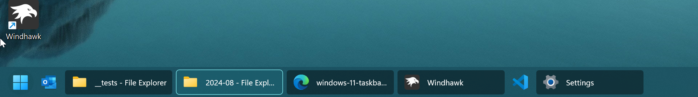

# CleanSlate theme for Windows 11 Taskbar Styler

**Author**: [Xerios](https://github.com/Xerios)

 \


## Notes

A nice clean theme that works nicely with dynamic windows themes using accent colors, mostly tuned for dark.

### Suggested Windows settings

- Set taskbar alignment to left
- Use full-width settings for Taskbar Labels for Windows 11 (see config below)
- Hide the widgets button

## Theme selection

The theme is integrated into the mod, and can be simply selected from the mod's
settings:

* Open the Windows 11 Taskbar Styler mod in Windhawk.
* Go to the "Settings" tab.
* Select the theme and save the settings.

## Manual installation

The theme styles can also be imported manually. To do that, follow these steps:

* Open the Windows 11 Taskbar Styler mod in Windhawk.
* Go to the "Advanced" tab.
* Copy the content below to the text box under "Mod settings" and click "Save".
* Do the same for "Taskbar Labels for Windows 11".

<details>
<summary>Content to import (click to expand)</summary>

## Theme

```json
{
  "controlStyles[0].target": "Taskbar.TaskbarFrame > Grid#RootGrid > Taskbar.TaskbarBackground > Grid > Rectangle#BackgroundFill",
  "controlStyles[0].styles[0]": "Fill:=<AcrylicBrush TintColor=\"{ThemeResource SystemAccentColorDark2}\" TintOpacity=\"0.4\" FallbackColor=\"{ThemeResource SystemAccentColorDark1}\" />",
  "controlStyles[1].target": "Taskbar.TaskListButtonPanel@CommonStates > Border#BackgroundElement",
  "controlStyles[1].styles[0]": "CornerRadius=100",
  "controlStyles[1].styles[1]": "Background:=<AcrylicBrush TintColor=\"{ThemeResource SystemAccentColorDark2}\" TintOpacity=\"0.4\" FallbackColor=\"{ThemeResource SystemAccentColorDark2}\" />",
  "controlStyles[1].styles[2]": "Background@InactivePointerOver:=<AcrylicBrush TintColor=\"{ThemeResource SystemAccentColorDark1}\" TintOpacity=\"0.4\" FallbackColor=\"{ThemeResource SystemAccentColorDark2}\"/>",
  "controlStyles[1].styles[3]": "Background@ActivePointerOver:=<AcrylicBrush TintColor=\"{ThemeResource SystemAccentColorDark1}\" TintOpacity=\"0.6\" FallbackColor=\"{ThemeResource SystemAccentColorDark2}\" />",
  "controlStyles[1].styles[4]": "Background@ActiveNormal:=<AcrylicBrush TintColor=\"{ThemeResource SystemAccentColorDark1}\" TintOpacity=\"0.6\" FallbackColor=\"{ThemeResource SystemAccentColorDark2}\"/>",
  "controlStyles[1].styles[5]": "Background@InactivePressed:=<AcrylicBrush TintColor=\"{ThemeResource SystemAccentColorDark1}\" TintOpacity=\"0.6\" FallbackColor=\"{ThemeResource SystemAccentColorDark2}\" />",
  "controlStyles[1].styles[6]": "Background@ActivePressed:=<AcrylicBrush TintColor=\"Black\" TintOpacity=\"0.8\" />",
  "controlStyles[2].target": "Grid#SystemTrayFrameGrid",
  "controlStyles[2].styles[0]": "Background:=<AcrylicBrush TintColor=\"{ThemeResource SystemAccentColorDark2}\" TintOpacity=\"0.5\" FallbackColor=\"{ThemeResource SystemAccentColorDark2}\" />",
  "controlStyles[2].styles[1]": "CornerRadius=5",
  "controlStyles[2].styles[2]": "Margin=0,5,5,8",
  "controlStyles[2].styles[3]": "Padding=1,0,-10,0",
  "controlStyles[3].target": "Rectangle#RunningIndicator",
  "controlStyles[3].styles[0]": "Fill=Transparent",
  "controlStyles[4].target": "Taskbar.TaskListLabeledButtonPanel > TextBlock#LabelControl",
  "controlStyles[4].styles[0]": "Margin=8,0,0,0",
  "controlStyles[4].styles[1]": "Foreground=White",
  "controlStyles[5].target": "Taskbar.SearchBoxButton",
  "controlStyles[5].styles[0]": "Foreground=White",
  "controlStyles[5].styles[1]": "Margin=-11,0,0,0",
  "controlStyles[6].target": "TextBlock#SearchBoxTextBlock",
  "controlStyles[6].styles[0]": "FontSize=12",
  "controlStyles[7].target": "Rectangle#BackgroundStroke",
  "controlStyles[7].styles[0]": "Fill=Transparent",
  "controlStyles[8].target": "SystemTray.AdaptiveTextBlock",
  "controlStyles[8].styles[0]": "Foreground=White",
  "controlStyles[9].target": "Taskbar.TaskListButton#TaskListButton[AutomationProperties.Name=Copilot] > Taskbar.TaskListLabeledButtonPanel#IconPanel > Border#BackgroundElement",
  "controlStyles[9].styles[0]": "Background:=<AcrylicBrush TintColor=\"Black\" TintOpacity=\"0.8\" />",
  "controlStyles[10].target": "SystemTray.NotifyIconView > Grid > Border#BackgroundBorder",
  "controlStyles[10].styles[0]": "Margin=0,3,0,3",
  "controlStyles[11].target": "Taskbar.AugmentedEntryPointButton#AugmentedEntryPointButton > Taskbar.TaskListButtonPanel#ExperienceToggleButtonRootPanel > Border#BackgroundElement@CommonStates",
  "controlStyles[11].styles[0]": "Background:=<AcrylicBrush TintColor=\"{ThemeResource SystemAccentColorDark2}\" TintOpacity=\"0.4\" FallbackColor=\"{ThemeResource SystemAccentColorDark2}\" />",
  "controlStyles[11].styles[1]": "CornerRadius=20",
  "controlStyles[11].styles[2]": "Margin=0,1,0,3",
  "controlStyles[12].target": "Border#MultiWindowElement",
  "controlStyles[12].styles[0]": "Background:=<AcrylicBrush TintColor=\"Black\" TintOpacity=\"0.8\" />",
  "controlStyles[13].target": "TextBlock#TimeInnerTextBlock",
  "controlStyles[13].styles[0]": "Foreground=White",
  "controlStyles[14].target": "TextBlock#DateInnerTextBlock",
  "controlStyles[14].styles[0]": "Foreground=White",
  "controlStyles[15].target": "SystemTray.TextIconContent > Grid > SystemTray.AdaptiveTextBlock#Base > TextBlock",
  "controlStyles[15].styles[0]": "Foreground=White",
  "controlStyles[16].target": "Border#BackgroundElement",
  "controlStyles[16].styles[0]": "BorderThickness=0",
  "controlStyles[17].styles[0]": "Background@InactiveRunningIndicator:=<SolidColorBrush Color=\"Black\" Opacity=\"0.4\" />",
  "controlStyles[17].target": "Taskbar.TaskListLabeledButtonPanel@RunningIndicatorStates > Border#BackgroundElement",
  "controlStyles[17].styles[1]": "Background@InactiveRunningIndicator:=<SolidColorBrush Color=\"Black\" Opacity=\"0.4\" />",
  "controlStyles[17].styles[2]": "Background@ActiveRunningIndicator:=<SolidColorBrush Color=\"{ThemeResource SystemAccentColorDark2}\" Opacity=\"0.4\" />",
  "controlStyles[17].styles[3]": "Background@RequestingAttentionRunningIndicator:=<SolidColorBrush Color=\"#ffdf5e\" Opacity=\"0.4\" />",
  "controlStyles[17].styles[4]": "Margin=1",
  "controlStyles[17].styles[5]": "BorderThickness=1",
  "controlStyles[18].target": "Rectangle#ShowDesktopPipe",
  "controlStyles[18].styles[0]": "Width=12",
  "controlStyles[18].styles[1]": "Height=38",
  "controlStyles[18].styles[2]": "Margin=-6,0,0,0",
  "controlStyles[19].target": "SystemTray.Stack#ShowDesktopStack",
  "controlStyles[19].styles[0]": "Width=12",
  "controlStyles[20].target": "Taskbar.TaskListButtonPanel",
  "controlStyles[20].styles[0]": "Margin=-3,0,0,0",
  "controlStyles[21].target": "Grid#OverflowRootGrid > Border",
  "controlStyles[21].styles[0]": "Background:=<AcrylicBrush TintColor=\"{ThemeResource SystemAccentColorDark2}\" TintOpacity=\"0.4\" FallbackColor=\"{ThemeResource SystemAccentColorDark1}\" />",
  "controlStyles[21].styles[1]": "BorderBrush:=<SolidColorBrush Color=\"{ThemeResource SystemAccentColor}\" />",
  "controlStyles[22].target": "Taskbar.TaskItemThumbnailView > Grid > Border",
  "controlStyles[22].styles[0]": "Background:=<AcrylicBrush TintColor=\"{ThemeResource SystemAccentColorDark3}\" TintOpacity=\"0.4\" FallbackColor=\"{ThemeResource SystemAccentColorDark1}\" />",
  "controlStyles[22].styles[1]": "BorderBrush:=<SolidColorBrush Color=\"{ThemeResource SystemAccentColor}\" />",
  "controlStyles[22].styles[2]": "BorderThickness=1",
  "controlStyles[22].styles[3]": "CornerRadius=5",
  "controlStyles[23].target": "Border#ProgressBarRoot > Border > Grid > Rectangle",
  "controlStyles[23].styles[0]": "Fill:=<SolidColorBrush Color=\"{ThemeResource SystemAccentColorLight1}\" />",
  "controlStyles[24].target": "Border#ProgressBarRoot > Border > Grid > Rectangle#ProgressBarTrack",
  "controlStyles[24].styles[0]": "Fill:=<SolidColorBrush Color=\"{ThemeResource SystemAccentColorDark3} />",
  "controlStyles[25].target": "Taskbar.TaskListLabeledButtonPanel@CommonStates > Border#BackgroundElement",
  "controlStyles[25].styles[0]": "BorderBrush@InactivePointerOver:=<SolidColorBrush Color=\"{ThemeResource SystemAccentColorDark1}\"  />",
  "controlStyles[25].styles[1]": "BorderBrush@ActiveNormal:=<SolidColorBrush Color=\"{ThemeResource SystemAccentColorLight1}\"  />",
  "controlStyles[25].styles[2]": "BorderBrush@ActivePointerOver:=<SolidColorBrush Color=\"{ThemeResource SystemAccentColorLight2}\"  />",
  "controlStyles[26].target": "Taskbar.TaskListLabeledButtonPanel@CommonStates[Width=44] > Border#BackgroundElement",
  "controlStyles[26].styles[0]": "Background=Transparent",
  "controlStyles[26].styles[1]": "BorderThickness=1",
  "controlStyles[26].styles[2]": "BorderBrush@InactivePointerOver:=<SolidColorBrush Color=\"{ThemeResource SystemAccentColorDark2}\"  />",
  "controlStyles[27].target": "ToolTip",
  "controlStyles[27].styles[0]": "Background:=<SolidColorBrush Color=\"{ThemeResource SystemAccentColorDark2}\"  />",
  "controlStyles[27].styles[1]": "Foreground=White"
}
```

## Taskbar Labels for Windows 11

```json
{
  "taskbarItemWidth": 170,
  "minimumTaskbarItemWidth": 0,
  "maximumTaskbarItemWidth": 200,
  "runningIndicatorStyle": "fullWidth",
  "progressIndicatorStyle": "sameAsRunningIndicatorStyle",
  "fontSize": 12,
  "leftAndRightPaddingSize": 12,
  "spaceBetweenIconAndLabel": 8,
  "labelForSingleItem": "%name%",
  "labelForMultipleItems": "[%amount%] %name%"
}
```
</details>
