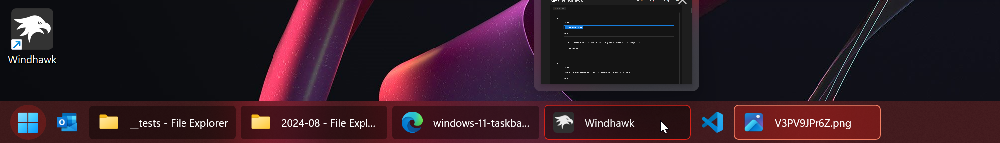
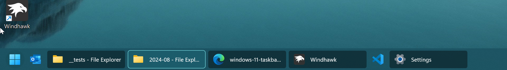

# CleanSlate theme for Windows 11 Taskbar Styler

**Author**: [Xerios](https://github.com/Xerios)

 \


## Notes

A nice clean theme that works nicely with dynamic Windows themes using accent colors, mostly tuned for dark.

### Suggested Windows settings

- Set taskbar alignment to left
- Use full-width settings for Taskbar Labels for Windows 11 (see config below)
- Hide the widgets button

## Theme selection

The theme is integrated into the mod and can be selected directly from the mod's
settings:

* Open the Windows 11 Taskbar Styler mod in Windhawk.
* Go to the "Settings" tab.
* Select the theme and save the settings.

## Manual installation

The theme styles can also be imported manually. To do that, follow these steps:

* Open the Windows 11 Taskbar Styler mod in Windhawk.
* Go to the "Settings" tab and select "Textual mode".
* Copy the content below to the text box and click "Save settings".

<details>
<summary>Content to import (click to expand)</summary>

## Theme

```yaml
controlStyles:
  - target: Taskbar.TaskbarFrame > Grid#RootGrid > Taskbar.TaskbarBackground > Grid > Rectangle#BackgroundFill
    styles:
      - Fill:=<AcrylicBrush TintColor="{ThemeResource SystemAccentColorDark2}" TintOpacity="0.4" FallbackColor="{ThemeResource SystemAccentColorDark1}" />
  - target: Taskbar.TaskListButtonPanel@CommonStates > Border#BackgroundElement
    styles:
      - CornerRadius=100
      - Background:=<AcrylicBrush TintColor="{ThemeResource SystemAccentColorDark2}" TintOpacity="0.4" FallbackColor="{ThemeResource SystemAccentColorDark2}" />
      - Background@InactivePointerOver:=<AcrylicBrush TintColor="{ThemeResource SystemAccentColorDark1}" TintOpacity="0.4" FallbackColor="{ThemeResource SystemAccentColorDark2}"/>
      - Background@ActivePointerOver:=<AcrylicBrush TintColor="{ThemeResource SystemAccentColorDark1}" TintOpacity="0.6" FallbackColor="{ThemeResource SystemAccentColorDark2}" />
      - Background@ActiveNormal:=<AcrylicBrush TintColor="{ThemeResource SystemAccentColorDark1}" TintOpacity="0.6" FallbackColor="{ThemeResource SystemAccentColorDark2}"/>
      - Background@InactivePressed:=<AcrylicBrush TintColor="{ThemeResource SystemAccentColorDark1}" TintOpacity="0.6" FallbackColor="{ThemeResource SystemAccentColorDark2}" />
      - Background@ActivePressed:=<AcrylicBrush TintColor="Black" TintOpacity="0.8" />
  - target: Grid#SystemTrayFrameGrid
    styles:
      - Background:=<AcrylicBrush TintColor="{ThemeResource SystemAccentColorDark2}" TintOpacity="0.5" FallbackColor="{ThemeResource SystemAccentColorDark2}" />
      - CornerRadius=5
      - Margin=0,5,5,5
      - Padding=1,0,-10,0
  - target: Rectangle#RunningIndicator
    styles:
      - Fill=Transparent
  - target: Taskbar.TaskListLabeledButtonPanel > TextBlock#LabelControl
    styles:
      - Margin=8,0,0,0
      - Foreground=White
  - target: 'Taskbar.SearchBoxButton '
    styles:
      - Padding=8
      - Margin=4,0,4,0
  - target: TextBlock#SearchBoxTextBlock
    styles:
      - FontSize=12
  - target: Rectangle#BackgroundStroke
    styles:
      - Fill=Transparent
  - target: SystemTray.AdaptiveTextBlock
    styles:
      - Foreground=White
  - target: Taskbar.TaskListButton#TaskListButton[AutomationProperties.Name=Copilot] > Taskbar.TaskListLabeledButtonPanel#IconPanel > Border#BackgroundElement
    styles:
      - Background:=<AcrylicBrush TintColor="Black" TintOpacity="0.8" />
  - target: SystemTray.NotifyIconView > Grid > Border#BackgroundBorder
    styles:
      - Margin=0,3,0,3
  - target: Taskbar.AugmentedEntryPointButton#AugmentedEntryPointButton > Taskbar.TaskListButtonPanel#ExperienceToggleButtonRootPanel > Border#BackgroundElement@CommonStates
    styles:
      - Background:=<AcrylicBrush TintColor="{ThemeResource SystemAccentColorDark2}" TintOpacity="0.4" FallbackColor="{ThemeResource SystemAccentColorDark2}" />
      - CornerRadius=20
      - Margin=0,1,0,1
  - target: TextBlock#TimeInnerTextBlock
    styles:
      - Foreground=White
  - target: TextBlock#DateInnerTextBlock
    styles:
      - Foreground=White
  - target: SystemTray.TextIconContent > Grid > SystemTray.AdaptiveTextBlock#Base > TextBlock
    styles:
      - Foreground=White
  - target: Border#BackgroundElement
    styles:
      - BorderThickness=0
  - target: Taskbar.TaskListLabeledButtonPanel@RunningIndicatorStates > Border#BackgroundElement
    styles:
      - Background@InactiveRunningIndicator:=<SolidColorBrush Color="Black" Opacity="0.4" />
      - Background@InactiveRunningIndicator:=<SolidColorBrush Color="Black" Opacity="0.4" />
      - Background@ActiveRunningIndicator:=<SolidColorBrush Color="{ThemeResource SystemAccentColorDark2}" Opacity="0.4" />
      - Background@RequestingAttentionRunningIndicator:=<SolidColorBrush Color="#ffdf5e" Opacity="0.4" />
  - target: Rectangle#ShowDesktopPipe
    styles:
      - Width=12
      - Height=38
      - Margin=-6,0,0,0
  - target: SystemTray.Stack#ShowDesktopStack
    styles:
      - Width=12
  - target: Taskbar.TaskListButtonPanel
    styles:
      - Margin=-3,0,0,0
  - target: Grid#OverflowRootGrid > Border
    styles:
      - Background:=<AcrylicBrush TintColor="{ThemeResource SystemAccentColorDark2}" TintOpacity="0.4" FallbackColor="{ThemeResource SystemAccentColorDark1}" />
      - BorderBrush:=<SolidColorBrush Color="{ThemeResource SystemAccentColor}" />
  - target: Taskbar.TaskItemThumbnailView > Grid > Border
    styles:
      - Background:=<AcrylicBrush TintColor="{ThemeResource SystemAccentColorDark3}" TintOpacity="0.4" FallbackColor="{ThemeResource SystemAccentColorDark1}" />
      - BorderBrush:=<SolidColorBrush Color="{ThemeResource SystemAccentColor}" />
      - BorderThickness=1
      - CornerRadius=5
  - target: Border#ProgressBarRoot > Border > Grid > Rectangle
    styles:
      - Fill:=<SolidColorBrush Color="{ThemeResource SystemAccentColorLight1}" />
  - target: Border#ProgressBarRoot > Border > Grid > Rectangle#ProgressBarTrack
    styles:
      - Fill:=<SolidColorBrush Color="{ThemeResource SystemAccentColorDark3}" />
  - target: Taskbar.TaskListLabeledButtonPanel@CommonStates > Border#BackgroundElement
    styles:
      - BorderBrush@InactivePointerOver:=<SolidColorBrush Color="{ThemeResource SystemAccentColorLight1}"  />
      - BorderBrush@ActiveNormal:=<SolidColorBrush Color="{ThemeResource SystemAccentColorLight2}" />
      - BorderBrush@ActivePointerOver:=<SolidColorBrush Color="{ThemeResource SystemAccentColorLight1}"  />
      - BorderBrush@MultiWindowPointerOver:=<SolidColorBrush Color="{ThemeResource SystemAccentColorLight1}"  />
      - BorderThickness@ActiveNormal=1
      - BorderThickness@ActivePointerOver=1
      - BorderThickness@MultiWindowActive=2
      - BorderThickness@MultiWindowNormal=2
      - BorderThickness@MultiWindowPointerOver=2.5
      - BorderBrush@MultiWindowActive:=<SolidColorBrush Color="{ThemeResource SystemAccentColorLight1}"  />
      - BorderBrush@MultiWindowNormal:=<SolidColorBrush Color="{ThemeResource SystemAccentColorLight1}"  />
      - Margin@MultiWindowNormal=0
      - Margin@MultiWindowPointerOver=0
      - Margin@MultiWindowPressed=0
  - target: ToolTip
    styles:
      - Background:=<SolidColorBrush Color="{ThemeResource SystemAccentColorDark2}"  />
      - Foreground=White
  - target: Taskbar.TaskListLabeledButtonPanel@CommonStates > Border#MultiWindowElement
    styles:
      - Background=Transparent
      - BorderThickness=0
  - target: Taskbar.SearchBoxButton > Taskbar.TaskListButtonPanel@CommonStates > Border#BackgroundElement
    styles:
      - CornerRadius=5
      - CornerRadius@InactiveNormal_SearchIcon=100
      - CornerRadius@InactivePointerOver_SearchIcon=100
      - CornerRadius@InactivePressed_SearchIcon=100
      - CornerRadius@ActiveNormal_SearchIcon=100
      - CornerRadius@ActivePointerOver_SearchIcon=100
      - CornerRadius@ActivePressed_SearchIcon=100
      - Background@InactiveNormal_SearchIcon:=<AcrylicBrush TintColor="{ThemeResource SystemAccentColorDark2}" TintOpacity="0.4" FallbackColor="{ThemeResource SystemAccentColorDark2}" />
      - Background@InactivePointerOver_SearchIcon:=<AcrylicBrush TintColor="{ThemeResource SystemAccentColorDark1}" TintOpacity="0.4" FallbackColor="{ThemeResource SystemAccentColorDark1}" />
      - Background@InactivePressed_SearchIcon:=<AcrylicBrush TintColor="{ThemeResource SystemAccentColorDark1}" TintOpacity="0.4" FallbackColor="{ThemeResource SystemAccentColorDark1}" />
      - Background@ActiveNormal_SearchIcon:=<AcrylicBrush TintColor="{ThemeResource SystemAccentColorDark2}" TintOpacity="0.4" FallbackColor="{ThemeResource SystemAccentColorDark2}" />
      - Background@ActivePointerOver_SearchIcon:=<AcrylicBrush TintColor="{ThemeResource SystemAccentColorDark1}" TintOpacity="0.4" FallbackColor="{ThemeResource SystemAccentColorDark1}" />
      - Background@ActivePressed_SearchIcon:=<AcrylicBrush TintColor="{ThemeResource SystemAccentColorDark1}" TintOpacity="0.4" FallbackColor="{ThemeResource SystemAccentColorDark1}" />
  - target: Taskbar.OverflowToggleButton
    styles:
      - Margin=8,0,8,0
      - Background:=<SolidColorBrush Color="{ThemeResource SystemAccentColorDark2}"  />
  - target: Rectangle#RightOverflowButtonDivider
    styles:
      - Fill:=<SolidColorBrush Color="{ThemeResource SystemAccentColorLight2}"  />
      - Margin=8,4,-8,4
  - target: Taskbar.OverflowToggleButton > Taskbar.TaskListButtonPanel@CommonStates > Border
    styles:
      - Background:=<AcrylicBrush TintColor="{ThemeResource SystemAccentColorDark2}" TintOpacity="0.4" FallbackColor="{ThemeResource SystemAccentColorDark2}" />
      - Background@InactivePointerOver:=<AcrylicBrush TintColor="{ThemeResource SystemAccentColorDark1}" TintOpacity="0.4" FallbackColor="{ThemeResource SystemAccentColorDark1}" />
  - target: Taskbar.TaskListLabeledButtonPanel
    styles:
      - Margin=0
  - target: SearchUx.SearchUI.SearchIconButton > SearchUx.SearchUI.SearchButtonRootGrid@CommonStates > Border#BackgroundElement
    styles:
      - CornerRadius=100
      - Background:=<AcrylicBrush TintColor="{ThemeResource SystemAccentColorDark2}" TintOpacity="0.4" FallbackColor="{ThemeResource SystemAccentColorDark2}" />
  - target: SearchUx.SearchUI.SearchButtonRootGrid
    styles:
      - Margin=0,0,3,0
  - target: SearchUx.SearchUI.SearchButtonRootGrid > Border#BackgroundElement
    styles:
      - Background:=<AcrylicBrush TintColor="{ThemeResource SystemAccentColorDark2}" TintOpacity="0.4" FallbackColor="{ThemeResource SystemAccentColorDark2}" />
  - target: Border#SearchPillBackgroundElement
    styles:
      - BorderBrush:=<AcrylicBrush TintColor="{ThemeResource SystemAccentColorDark2}" TintOpacity="0.4" FallbackColor="{ThemeResource SystemAccentColorDark2}" />
      - BorderThickness=16
      - CornerRadius=8
```

## Taskbar Labels for Windows 11

```yaml
mode: labelsWithoutCombining
taskbarItemWidth: 170
runningIndicatorStyle: fullWidth
progressIndicatorStyle: sameAsRunningIndicatorStyle
excludedPrograms:
  - ''
minimumTaskbarItemWidth: 0
maximumTaskbarItemWidth: 200
fontSize: 12
fontFamily: ''
textTrimming: characterEllipsis
leftAndRightPaddingSize: 12
spaceBetweenIconAndLabel: 8
runningIndicatorHeight: 0
runningIndicatorVerticalOffset: 0
alwaysShowThumbnailLabels: 0
labelForSingleItem: '%name%'
labelForMultipleItems: '[%amount%] %name%'
```
</details>
