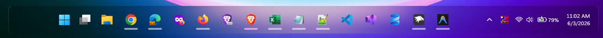

# ✦ FluentGlass theme for Windows 11 Taskbar Styler

A Fluent Design-inspired glass taskbar theme for Windows 11. FluentGlass blends transparency, blur, and subtle depth visuals to create a clean, modern, and floating dock experience that feels native to Windows 11.

**Author**: [heartovation](https://github.com/heartovation)



## ✨ Overview

FluentGlass reimagines the default taskbar with:

* Smooth glass-like blur
* Rounded floating layout
* Subtle borders and depth
* Polished hover and active states

Inspired by Microsoft’s Fluent Design System, this theme focuses on clarity, softness, and visual balance.

## Features

- **Fluent Glass Style**: Rich background blur powered natively by `WindhawkBlur`
- **Subtle Gradient Borders**: Linear gradient edge styling that highlights the float effect
- **Centered Layout**: Keeps taskbar content grouped nicely using a defined frame width
- **Interactive Feedback**: Integrated hover glows, enhanced pressed states, and clean running indicators utilizing your system's accent color

## Suggested Windows settings

- Use the default taskbar alignment (center).
- Works out-of-the-box with both Windows light and dark system modes.

## Customization

To customize the theme's appearance, you can modify or append the following properties under the `styleConstants` section in the mod's settings.

### Taskbar Frame Width
Set `TaskbarFrameWidth` to match your screen real estate or layout preferences:
* `TaskbarFrameWidth=1280` → Standard wide layout (default)
* `TaskbarFrameWidth=1000` → Tighter, compact dock layout for smaller screens

### Taskbar Sizing
Modify `TaskbarHeight` and `IconHeight` to change the vertical sizing:
* `TaskbarHeight=62` → Custom taller height for the glass bar (default)
* `IconHeight=54` → Sizing constraint variable for the taskbar icons (default)

### Icon Spacing & Margins
Adjust the gap and hover target boundaries using the extracted variables:
* `ItemMargin=4,2,4,2` → Side-by-side gap spacing between individual buttons (default)
* `ItemPadding=8,6,8,6` → Internal spacing layout inside the icon hover background (default)

### Glass Blur Strength
Set `BlurAmount` to change the intensity of the glass blur:
* `BlurAmount="22"` → Balanced, legible glass effect (default)
* `BlurAmount="40"` → Heavy frosted glass appearance
* `BlurAmount="10"` → Ultra-clear translucent look

### Transparency & Tint Opacity
Modify `TintOpacity` to adjust how much the underlying system background color blends into the glass:
* `TintOpacity="0.15"` → Highly transparent glass (default)
* `TintOpacity="0.30"` → More solid, vibrant tinting

### Corner Radius
Set `GlobalRadius` to change the roundness of the taskbar and its elements:
* `GlobalRadius=8` → Subtle, native modern rounded corners (default)
* `GlobalRadius=16` → Aggressive rounded dock aesthetic

## Theme selection

The theme is integrated into the mod and can be selected directly from the mod's
settings:

* Open the Windows 11 Taskbar Styler mod in Windhawk.
* Go to the "Settings" tab.
* Select the theme and save the settings.

## Manual installation

The theme styles can also be imported manually. To do that, follow these steps:

* Open the Windows 11 Taskbar Styler mod in Windhawk.
* Go to the "Settings" tab and select "Textual mode".
* Copy the content below to the text box and click "Save settings".

<details>
<summary>Content to import (click to expand)</summary>

```yaml
styleConstants:
  - TaskbarFrameWidth=1280
  - TaskbarHeight=62
  - IconHeight=54
  - GlobalRadius=8
  - ItemMargin=4,2,4,2
  - ItemPadding=8,6,8,6
  - LiquidBackground=<WindhawkBlur BlurAmount="22" TintColor="{ThemeResource SystemAltLowColor}" TintOpacity="0.15" />
  - LiquidBorder=<LinearGradientBrush StartPoint="0,0" EndPoint="0,1"><GradientStop Color="#50808080" Offset="0.0" /><GradientStop Color="#50404040" Offset="1" /></LinearGradientBrush>
controlStyles:
  - target: ScrollViewer > ScrollContentPresenter > Border > Grid
    styles:
      - ColumnDefinitions:=<ColumnDefinitionCollection><ColumnDefinition Width="*"/><ColumnDefinition Width="Auto"/><ColumnDefinition Width="Auto"/><ColumnDefinition Width="*"/></ColumnDefinitionCollection>
      - HorizontalAlignment=Stretch
  - target: Taskbar.TaskbarFrame
    styles:
      - Grid.Column=1
      - Width=$TaskbarFrameWidth
      - Height=$TaskbarHeight
      - MinHeight=62
      - HorizontalAlignment=Center
      - VerticalAlignment=Center
      - Margin=0,0,0,12
      - Padding=0
  - target: Taskbar.TaskbarBackground#BackgroundControl
    styles:
      - Visibility=Collapsed
  - target: Grid#RootGrid
    styles:
      - Background:=$LiquidBackground
      - BorderBrush:=$LiquidBorder
      - BorderThickness=0.5,1,0.5,1
      - CornerRadius=$GlobalRadius
      - Padding=0
  - target: SystemTray.SystemTrayFrame
    styles:
      - Grid.Column=1
      - HorizontalAlignment=Right
      - VerticalAlignment=Center
      - Height=$TaskbarHeight
      - MinWidth=250
      - Margin=0,0,0,12
  - target: Grid#SystemTrayFrameGrid
    styles:
      - Background=Transparent
      - BorderThickness=0
      - VerticalAlignment=Center
      - CornerRadius=$GlobalRadius
      - Height=50
      - Margin=0
  - target: StackPanel#SystemTrayStack
    styles:
      - VerticalAlignment=Center
  - target: Taskbar.TaskListButton
    styles:
      - Margin=$ItemMargin
      - Padding=$ItemPadding
      - VerticalAlignment=Center
      - Height=$IconHeight
  - target: Taskbar.StartButton
    styles:
      - Margin=$ItemMargin
      - Padding=$ItemPadding
      - VerticalAlignment=Center
      - Height=$IconHeight
  - target: Taskbar.SearchBoxButton
    styles:
      - Margin=$ItemMargin
      - Padding=$ItemPadding
      - VerticalAlignment=Center
      - Height=$IconHeight
  - target: Taskbar.TaskViewButton
    styles:
      - Margin=$ItemMargin
      - Padding=$ItemPadding
      - VerticalAlignment=Center
      - Height=$IconHeight
  - target: Taskbar.TaskListButtonPanel
    styles:
      - VerticalAlignment=Center
  - target: Taskbar.TaskListLabeledButtonPanel@CommonStates > Border#BackgroundElement
    styles:
      - CornerRadius=$GlobalRadius
      - BorderThickness=0
      - VerticalAlignment=Stretch
      - HorizontalAlignment=Stretch
      - Background@PointerOver:=<WindhawkBlur BlurAmount="10" TintColor="{ThemeResource SystemAccentColor}" TintOpacity="0.18" />
      - Background@Pressed:=<WindhawkBlur BlurAmount="15" TintColor="{ThemeResource SystemAccentColor}" TintOpacity="0.25" />
      - Background@ActiveNormal:=<WindhawkBlur BlurAmount="4" TintColor="{ThemeResource SystemAccentColor}" TintOpacity="0.32" />
      - Background@ActivePointerOver:=<WindhawkBlur BlurAmount="4" TintColor="{ThemeResource SystemAccentColor}" TintOpacity="0.4" />
  - target: Rectangle#RunningIndicator
    styles:
      - Visibility=Visible
      - Fill={ThemeResource SystemAccentColor}
      - Height=4
      - Width=30
      - RadiusX=2
      - RadiusY=2
      - VerticalAlignment=Bottom
  - target: Microsoft.UI.Xaml.Controls.ItemsRepeater#TaskbarFrameRepeater
    styles:
      - VerticalAlignment=Center
  - target: Grid#AugmentedEntryPointContentGrid
    styles:
      - Margin=5,0,0,0
      - VerticalAlignment=Center
```
</details>
