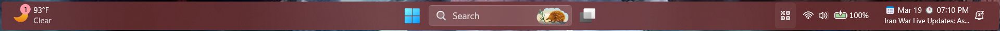

# Fluid theme for Windows 11 Taskbar Styler

A taskbar theme designed to match [the Fluid Start Menu theme](https://github.com/ramensoftware/windows-11-start-menu-styling-guide/blob/main/Themes/Fluid/README.md) by [SandTechStuff](https://github.com/SandTechStuff).

**Author**: [PhantomNimbi](https://github.com/PhantomNimbi)



## Taskbar Clock Customization (Optional)

The get the clock to show up like it does in the screenshot, follow these steps:

* Open the Taskbar Clock Customization mod in Windhawk.
* Go to the "Settings" tab and select "Textual mode".
* Copy the content below to the text box and click "Save settings".

<details>
<summary>Content to import (click to expand)</summary>

```yaml
ShowSeconds: 1
TimeFormat: hh':'mm tt;hh':'mm':'ss tt
DateFormat: dddd - MMMM dd, yyyy
WeekdayFormat: dddd
WeekdayFormatCustom: Sun, Mon, Tue, Wed, Thu, Fri, Sat
TopLine: 🕒 %time%
BottomLine: 🌐 %web1%
MiddleLine: '%weekday%'
TooltipLine: 📅 %date%%n%🕒 %time2%%n%%n%🌐 %web1_full%%n%%n%📻 %media_info%
TooltipLineMode: replace
Width: 180
Height: 60
MaxWidth: 0
TextSpacing: 0
DataCollection:
  NetworkMetricsFormat: mbsDynamic
  NetworkMetricsFixedDecimals: -1
  PercentageFormat: spacePaddingAndSymbol
  UpdateInterval: 1
  NetworkAdapterName: ''
  GpuAdapterName: ''
MediaPlayer:
  IgnoredPlayers:
    - ''
  MaxLength: 28
  NoMediaText: No media
  RemoveBrackets: 1
WebContentWeatherLocation: ''
WebContentWeatherFormat: '%c 🌡️%t 🌬️%w'
WebContentWeatherUnits: autoDetect
WebContentsItems:
  - Url: https://rss.nytimes.com/services/xml/rss/nyt/World.xml
    BlockStart: <item>
    Start: <title>
    End: </title>
    ContentMode: xmlHtml
    SearchReplace:
      - Search: ''
        Replace: ''
    MaxLength: 28
WebContentsUpdateInterval: 10
TimeZones:
  - ''
TimeStyle:
  Hidden: 0
  TextColor: ''
  TextAlignment: Center
  FontSize: 0
  FontFamily: ''
  FontWeight: ''
  FontStyle: ''
  FontStretch: ''
  CharacterSpacing: 0
DateStyle:
  Hidden: 1
  TextColor: ''
  TextAlignment: Center
  FontSize: 0
  FontFamily: ''
  FontWeight: ''
  FontStyle: ''
  FontStretch: ''
  CharacterSpacing: 0
oldTaskbarOnWin11: 0
```
</details>

## Theme selection

The theme is integrated into the mod and can be selected directly from the mod's
settings:

* Open the Windows 11 Taskbar Styler mod in Windhawk.
* Go to the "Settings" tab.
* Select the theme and save the settings.

## Manual installation

The theme styles can also be imported manually. To do that, follow these steps:

* Open the Windows 11 Taskbar Styler mod in Windhawk.
* Go to the "Settings" tab and select "Textual mode".
* Copy the content below to the text box and click "Save settings".

<details>
<summary>Content to import (click to expand)</summary>

```yaml
styleConstants:
  - BorderBrush=<LinearGradientBrush x:Key="ShellTaskbarItemGradientStrokeColorSecondaryBrush" MappingMode="Absolute" StartPoint="0,0" EndPoint="0,3"><LinearGradientBrush.GradientStops><GradientStop Offset="0.33" Color="{ThemeResource ControlFillColorSecondary}" /><GradientStop Offset="1" Color="{ThemeResource ControlFillColorTertiary}" /></LinearGradientBrush.GradientStops></LinearGradientBrush>
  - NormalBG=<SolidColorBrush Color="{ThemeResource ControlFillColorDefault}" />
  - HoverBG=<SolidColorBrush Color="{ThemeResource ControlFillColorSecondary}" />
  - PressedBG=<SolidColorBrush Color="{ThemeResource ControlFillColorTertiary}" />
  - BorderThickness=1
  - CornerRadius=4
controlStyles:
  - target: Taskbar.TaskbarFrame > Grid#RootGrid > Taskbar.TaskbarBackground > Grid
    styles:
      - Background:=$NormalBG
  - target: Rectangle#BackgroundStroke
    styles:
      - Visibility=1
  - target: Grid#OverflowRootGrid > Border
    styles:
      - CornerRadius=$CornerRadius
  - target: Rectangle#RunningIndicator
    styles:
      - Fill:=<AcrylicBrush TintColor="{ThemeResource SystemChromeAltMedColor}" TintOpacity="0.5" />
  - target: TextBlock#InnerTextBlock[Text=]
    styles:
      - Text=
  - target: Border#BackgroundElement
    styles:
      - CornerRadius=$CornerRadius
  - target: Border#BackgroundDimmingLayer
    styles:
      - CornerRadius=$CornerRadius
  - target: WindowsInternal.ComposableShell.Experiences.Switcher.VirtualDesktopBarElement#VirtualDesktopBar
    styles:
      - CornerRadius=$CornerRadius
  - target: MenuFlyoutPresenter
    styles:
      - CornerRadius=$CornerRadius
  - target: Grid#LayoutRoot
    styles:
      - BackgroundTransition:=<BrushTransition Duration="0:0:0.083" />
  - target: Border#BackgroundBorder
    styles:
      - BackgroundTransition:=<BrushTransition Duration="0:0:0.083" />
  - target: Taskbar.AugmentedEntryPointButton#AugmentedEntryPointButton > Taskbar.TaskListButtonPanel#ExperienceToggleButtonRootPanel > Border#BackgroundElement@CommonStates
    styles:
      - Background@ActiveNormal:=$NormalBG
      - Background@ActivePointerOver:=$Hover
      - Background@ActivePressed:=$PressedBG
      - Background@InactivePointerOver:=$Hover
      - Background@InactivePressed:=$PressedBG
      - BorderBrush@ActiveNormal:=$BorderBrush
      - BorderBrush@ActivePointerOver:=$BorderBrush
      - BorderBrush@ActivePressed:=$BorderBrush
      - BorderBrush@InactivePointerOver:=$BorderBrush
      - BorderBrush@InactivePressed:=$BorderBrush
      - BackgroundTransition:=<BrushTransition Duration="0:0:0.083" />
      - BackgroundSizing=InnerBorderEdge
      - Margin=1
      - CornerRadius=$CornerRadius
      - BorderThickness=$BorderThickness
  - target: Taskbar.TaskListLabeledButtonPanel@CommonStates > Border#BackgroundElement
    styles:
      - Background@ActiveNormal:=$NormalBG
      - Background@ActivePointerOver:=$Hover
      - Background@ActivePressed:=$PressedBG
      - Background@InactivePointerOver:=$Hover
      - Background@InactivePressed:=$PressedBG
      - Background@MultiWindowNormal:=$NormalBG
      - Background@MultiWindowActive:=$NormalBG
      - Background@MultiWindowPointerOver:=$Hover
      - Background@MultiWindowPressed:=$PressedBG
      - BorderBrush@ActiveNormal:=$BorderBrush
      - BorderBrush@ActivePointerOver:=$BorderBrush
      - BorderBrush@ActivePressed:=$BorderBrush
      - BorderBrush@InactivePointerOver:=$BorderBrush
      - BorderBrush@InactivePressed:=$BorderBrush
      - BorderBrush@MultiWindowNormal:=$BorderBrush
      - BorderBrush@MultiWindowActive:=$BorderBrush
      - BorderBrush@MultiWindowPointerOver:=$BorderBrush
      - BorderBrush@MultiWindowPressed:=$BorderBrush
      - BackgroundTransition:=<BrushTransition Duration="0:0:0.083" />
      - BackgroundSizing=InnerBorderEdge
      - Margin=2
      - BorderThickness=$BorderThickness
  - target: Border#MultiWindowElement
    styles:
      - BorderBrush:=$BorderBrush
      - Background:=$NormalBG
      - BackgroundTransition:=<BrushTransition Duration="0:0:0.083" />
      - BackgroundSizing=InnerBorderEdge
      - BorderThickness=$BorderThickness
      - CornerRadius=$CornerRadius
      - Margin=2
  - target: ContentPresenter#ContentPresenter@CommonStates
    styles:
      - Background@ActiveNormal:=$NormalBG
      - Background@ActivePointerOver:=$Hover
      - Background@ActivePressed:=$PressedBG
      - Background@InactivePointerOver:=$Hover
      - Background@InactivePressed:=$PressedBG
      - BorderBrush@ActiveNormal:=$BorderBrush
      - BorderBrush@ActivePointerOver:=$BorderBrush
      - BorderBrush@ActivePressed:=$BorderBrush
      - BorderBrush@InactivePointerOver:=$BorderBrush
      - BorderBrush@InactivePressed:=$BorderBrush
      - BackgroundTransition:=<BrushTransition Duration="0:0:0.083" />
      - BackgroundSizing=InnerBorderEdge
      - CornerRadius=$CornerRadius
      - BorderThickness=$BorderThickness
      - Margin=2
  - target: ContentPresenter#ContentPresenter > Grid#ContentGrid > Microsoft.UI.Xaml.Controls.AnimatedVisualPlayer#LottieIcon
    styles:
      - Visibility=1
  - target: SystemTray.CopilotIcon#CopilotIcon > Grid#ContainerGrid > Border#BackgroundBorder
    styles:
      - Visibility=1
themeResourceVariables:
  - ''
xamlDiagnosticsHandling: ''
```
</details>
