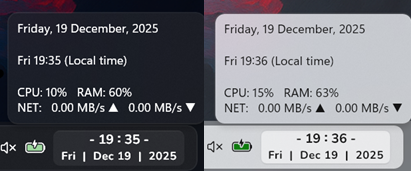
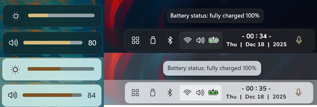
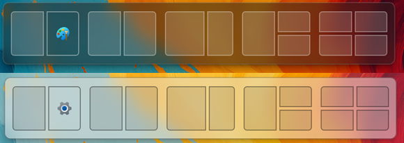
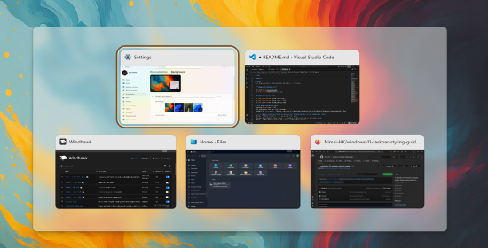
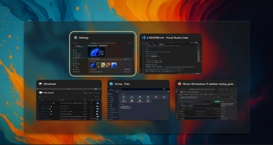
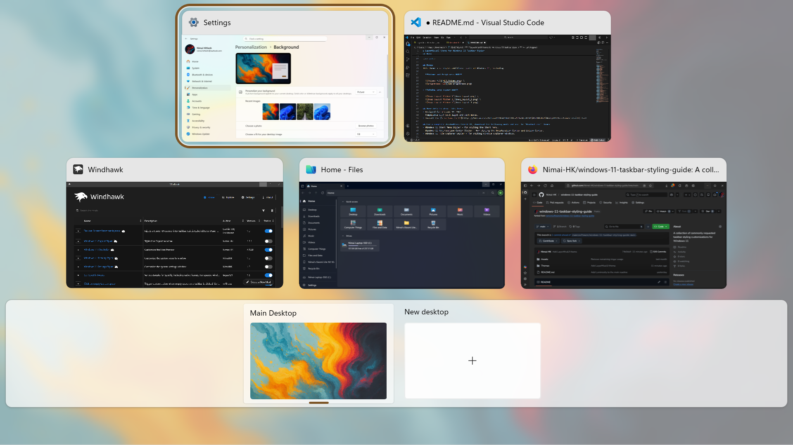
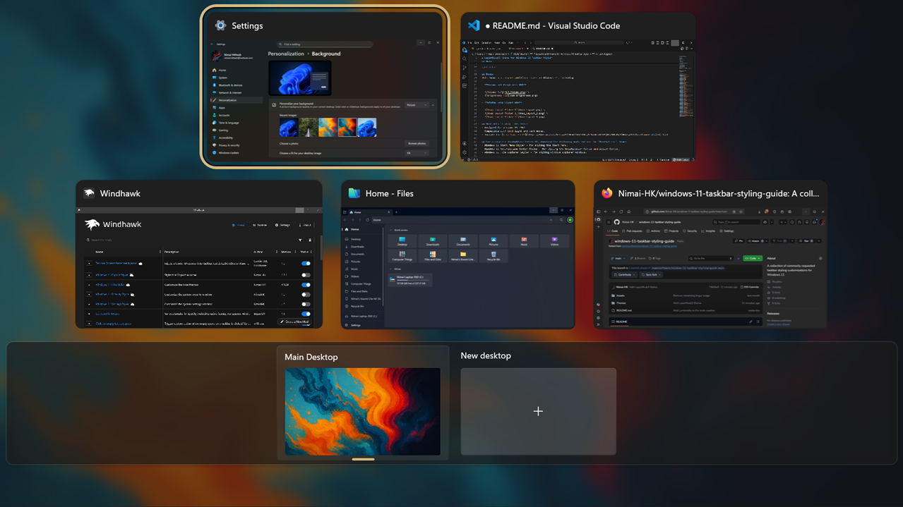

# LayerMicaUI theme for Windows 11 Taskbar Styler

LayerMicaUI is a modern Windows 11 taskbar theme with clean visuals and dual-mode support. 

**Author**: [Nimai-HK](https://github.com/Nimai-HK)


Designed to work with both Light Mode and Dark Mode.

## Note
- Theme is designed for a left-aligned taskbar only.
- Widgets on the taskbar have to be disabled.

---

## Additional Configuration
To make the taskbar look exactly as in the image, use the following mods with specified settings:

- **Taskbar height and icon size**
<details>
<summary>Click to expand JSON content</summary>

```json
{
  "TaskbarHeight":52,
  "IconSize":24,
  "TaskbarButtonWidth":41,
  "IconSizeSmall":20,
  "TaskbarButtonWidthSmall":26
}
```
</details>


- **Taskbar Clock Customisation** -With extras
<details>
<summary>Click to expand JSON content</summary>

```json
{
  "ShowSeconds":0,"TimeFormat":"- HH' : 'mm -",
  "DateFormat":"ddd ' | ' MMM dd ' | ' yyyy",
  "WeekdayFormat":"ddd",
  "TopLine":"%time%",
  "BottomLine":"%date%",
  "MiddleLine":"",
  "TooltipLine":"CPU: %cpu%   RAM: %ram%                                                        NET:   %upload_speed% ▲   %download_speed% ▼ ",
  "Width":180,"Height":60,"MaxWidth":0,"TextSpacing":0,"WebContentsUpdateInterval":10,"TimeZones[0]":"Indian Standard Time",
  "TimeStyle.Hidden":0,"TimeStyle.TextColor":"",
  "TimeStyle.TextAlignment":"Center",
  "TimeStyle.FontSize":13,"TimeStyle.FontFamily":"Nunito",
  "TimeStyle.FontWeight":"Bold",
  "TimeStyle.FontStyle":"Normal",
  "TimeStyle.FontStretch":"Normal",
  "TimeStyle.CharacterSpacing":0,"DateStyle.Hidden":0,"DateStyle.TextColor":"",
  "DateStyle.TextAlignment":"Center",
  "DateStyle.FontSize":11,"DateStyle.FontFamily":"Nunito",
  "DateStyle.FontWeight":"Bold",
  "DateStyle.FontStyle":"",
  "DateStyle.FontStretch":"Normal",
  "DateStyle.CharacterSpacing":40,"oldTaskbarOnWin11":0,"WeekdayFormatCustom":"Sun, Mon, Tue, Wed, Thu, Fri, Sat",
  "WebContentsItems[0].Url":"",
  "WebContentsItems[0].BlockStart":"<item>",
  "WebContentsItems[0].Start":"<title>",
  "WebContentsItems[0].End":"</title>",
  "WebContentsItems[0].MaxLength":28,"DataCollectionUpdateInterval":1,"WebContentWeatherLocation":"",
  "WebContentWeatherFormat":"%c 🌡️%t 🌬️%w",
  "DataCollection.NetworkMetricsFormat":"mbs",
  "DataCollection.NetworkMetricsFixedDecimals":-1,"DataCollection.PercentageFormat":"spacePaddingAndSymbol",
  "DataCollection.UpdateInterval":1,"WebContentWeatherUnits":"autoDetect"
}
```
  

</details>


- **Taskbar Labels for Windows 11**
<details>
<summary>Click to expand JSON content</summary>

```json
{
  "mode":"labelsWithCombining",
  "taskbarItemWidth":0,
  "runningIndicatorStyle":"centerDynamic",
  "progressIndicatorStyle":"fullWidth",
  "minimumTaskbarItemWidth":50,
  "maximumTaskbarItemWidth":180,
  "fontSize":12,
  "fontFamily":"Nunito Bold",
  "textTrimming":"characterEllipsis",
  "leftAndRightPaddingSize":6,
  "spaceBetweenIconAndLabel":10,
  "runningIndicatorHeight":4,
  "runningIndicatorVerticalOffset":3,
  "alwaysShowThumbnailLabels":0,
  "labelForSingleItem":"",
  "labelForMultipleItems":""
}
```
</details>

---

## Bonus
This theme also styles additional parts of Windows 11 for both Light and Dark Modes

- **Volume and Brightness HUD, Bluetooth and USB icons, Hover Flyouts**

  


- **Window Snap Layout HUD**

   


- **Alt Tab View and Task View**

  \
  \
  \
  


## More details about this theme
- Designed for Windows 11 25H2.
- Compatible with both light and dark modes.
- Install Font: [Nunito](https://fonts.google.com/specimen/Nunito)


**For the complete LayerMicaUI theming, download the following mods and use the 'LayerMicaUI' theme:**
- Windows 11 Start Menu Styler - for styling the Start menu.

---

## Theme selection

The theme is integrated into the mod and can be selected from the mod's
settings:

* Open the Windows 11 Taskbar Styler mod in Windhawk.
* Go to the "Settings" tab.
* Select the theme and save the settings.

## Manual installation

The theme styles can also be imported manually. To do that, follow these steps:

* Open the Windows 11 Taskbar Styler mod in Windhawk.
* Go to the "Advanced" tab.
* Copy the content below to the text box under "Mod settings" and click "Save".

<details>
<summary>Content to import (click to expand)</summary>

```json
{
  "controlStyles[0].styles[0]":"Background:=<WindhawkBlur BlurAmount=\"5\" TintColor=\"{ThemeResource SystemChromeMediumColor}\" TintOpacity=\"0.4\"  />",
  "controlStyles[0].target":"ScrollViewer > ScrollContentPresenter > Border > Grid",
  "controlStyles[1].styles[0]":"Width=Auto",
  "controlStyles[1].target":"Taskbar.TaskbarFrame#TaskbarFrame",
  "controlStyles[2].styles[0]":"Margin=8,3,0,3",
  "controlStyles[2].styles[1]":"CornerRadius=$OuterRad",
  "controlStyles[2].styles[2]":"Padding=-8,0,0,0",
  "controlStyles[2].styles[3]":"Background:=$ThemeBack",
  "controlStyles[2].styles[4]":"BorderThickness=1",
  "controlStyles[2].styles[5]":"BorderBrush:=$Border",
  "controlStyles[2].styles[6]":"HorizontalAlignment=Left",
  "controlStyles[2].target":"Taskbar.TaskbarFrame#TaskbarFrame > Grid",
  "controlStyles[3].styles[0]":"Opacity=0",
  "controlStyles[3].target":"Taskbar.TaskbarBackground#BackgroundControl",
  "controlStyles[4].styles[0]":"Margin=0,0,2,0",
  "controlStyles[4].target":"Microsoft.UI.Xaml.Controls.ItemsRepeater#TaskbarFrameRepeater",
  "controlStyles[5].styles[0]":"Visibility=Collapsed",
  "controlStyles[5].target":"Windows.UI.Xaml.Shapes.Rectangle#BackgroundStroke",
  "controlStyles[6].styles[0]":"HorizontalAlignment=Right",
  "controlStyles[6].target":"SystemTray.SystemTrayFrame",
  "controlStyles[7].styles[0]":"Background:=$ThemeBack",
  "controlStyles[7].styles[1]":"CornerRadius=$OuterRad",
  "controlStyles[7].styles[2]":"Margin=0,3,8,3",
  "controlStyles[7].styles[3]":"Padding=4,0,0,0",
  "controlStyles[7].styles[4]":"BorderBrush:=$Border",
  "controlStyles[7].styles[5]":"BorderThickness=1",
  "controlStyles[7].target":"Grid#SystemTrayFrameGrid",
  "controlStyles[8].styles[0]":"Grid.Column=4",
  "controlStyles[8].styles[1]":"CornerRadius=$InnerRad",
  "controlStyles[8].target":"SystemTray.OmniButton#ControlCenterButton",
  "controlStyles[9].styles[0]":"Grid.Column=5",
  "controlStyles[9].styles[1]":"CornerRadius=$InnerRad",
  "controlStyles[9].target":"SystemTray.OmniButton#NotificationCenterButton",
  "controlStyles[10].styles[0]":"Grid.Column=6",
  "controlStyles[10].styles[1]":"CornerRadius=$InnerRad",
  "controlStyles[10].target":"SystemTray.Stack#MainStack",
  "controlStyles[11].styles[0]":"CornerRadius=$InnerRad",
  "controlStyles[11].styles[1]":"Grid.Column=7",
  "controlStyles[11].target":"SystemTray.Stack#ShowDesktopStack",
  "controlStyles[12].styles[0]":"Text=",
  "controlStyles[12].target":"TextBlock#InnerTextBlock[Text=]",
  "controlStyles[13].styles[0]":"CornerRadius=$InnerRad",
  "controlStyles[13].styles[1]":"Margin=0,-1,0,-1",
  "controlStyles[13].styles[2]":"BorderBrush:=$Border",
  "controlStyles[13].target":"Taskbar.TaskListButton",
  "controlStyles[14].styles[0]":"Background:=<SolidColorBrush Color=\"{ThemeResource ControlFillColorSecondary}\" Opacity=\"0.8\"/>",
  "controlStyles[14].styles[1]":"BorderBrush:=$Border",
  "controlStyles[14].styles[2]":"BorderThickness=1",
  "controlStyles[14].styles[3]":"CornerRadius=$InnerRad",
  "controlStyles[14].styles[4]":"Margin=0,-2.3,0,-2.3",
  "controlStyles[14].target":"SearchUx.SearchUI.SearchButtonRootGrid@CommonStates > Border#BackgroundElement",
  "controlStyles[15].styles[0]":"Margin=0,-1,0,0",
  "controlStyles[15].target":"SearchUx.SearchUI.SearchBoxButton#SearchBox",
  "controlStyles[16].styles[0]":"Background:=$ThemeBlur",
  "controlStyles[16].styles[1]":"CornerRadius=$OuterRad",
  "controlStyles[16].styles[2]":"BorderBrush:=$Border",
  "controlStyles[16].target":"Windows.UI.Xaml.Controls.Grid#ModalRootGrid > Windows.UI.Xaml.Controls.Border#BackgroundElement",
  "controlStyles[17].styles[0]":"Background:=$ThemeBlur",
  "controlStyles[17].target":"Windows.UI.Xaml.Controls.Border#BackgroundDimmingLayer",
  "controlStyles[18].styles[0]":"Background:=$ThemeBlur",
  "controlStyles[18].styles[1]":"CornerRadius=$OuterRad",
  "controlStyles[18].styles[2]":"BorderBrush:=$Border",
  "controlStyles[18].target":"Windows.UI.Xaml.Hosting.DesktopWindowXamlSource",
  "controlStyles[19].styles[0]":"Background:=$ThemeBack",
  "controlStyles[19].styles[1]":"CornerRadius=$OuterRad",
  "controlStyles[19].target":"MenuFlyoutPresenter",
  "controlStyles[20].styles[0]":"Background:=$ThemeBack",
  "controlStyles[20].styles[1]":"CornerRadius=$OuterRad",
  "controlStyles[20].target":"ToolTip > ContentPresenter#LayoutRoot",
  "controlStyles[21].styles[0]":"Background:=$ThemeBack",
  "controlStyles[21].styles[1]":"CornerRadius=$OuterRad",
  "controlStyles[21].styles[2]":"BorderBrush:=$Border",
  "controlStyles[21].target":"Border#OverflowFlyoutBackgroundBorder",
  "controlStyles[22].styles[0]":"Background:=$ThemeBack",
  "controlStyles[22].styles[1]":"CornerRadius=$OuterRad",
  "controlStyles[22].styles[2]":"BorderThickness=1",
  "controlStyles[22].styles[3]":"BorderBrush:=$Border",
  "controlStyles[22].styles[4]":"Height=46",
  "controlStyles[22].target":"Grid#ConfirmatorMainGrid",
  "controlStyles[23].styles[0]":"Background:=<SolidColorBrush Color=\"{ThemeResource SystemChromeAltHighColor}\" Opacity=\"0.7\" />",
  "controlStyles[23].styles[1]":"CornerRadius=$OuterRad",
  "controlStyles[23].styles[2]":"BorderBrush:=$Border",
  "controlStyles[23].target":"Border#VirtualDesktopBarBackground",
  "controlStyles[24].styles[0]":"Height=7.5",
  "controlStyles[24].styles[1]":"RadiusX=3",
  "controlStyles[24].styles[2]":"RadiusY=3",
  "controlStyles[24].target":"Grid#HorizontalTemplate > Rectangle#HorizontalDecreaseRect",
  "controlStyles[25].styles[0]":"Height=7.5",
  "controlStyles[25].styles[1]":"RadiusX=3",
  "controlStyles[25].styles[2]":"RadiusY=3",
  "controlStyles[25].target":"Grid#HorizontalTemplate > Rectangle#HorizontalTrackRect",
  "controlStyles[26].styles[0]":"FontSize=15",
  "controlStyles[26].styles[1]":"Margin=0,-3,0,0",
  "controlStyles[26].target":"Windows.UI.Xaml.Controls.TextBlock#volumeLevelText",
  "controlStyles[27].styles[0]":"Height=22",
  "controlStyles[27].styles[1]":"Width=22",
  "controlStyles[27].target":"Microsoft.UI.Xaml.Controls.AnimatedIcon#BrightnessIcon",
  "controlStyles[28].styles[0]":"Height=18",
  "controlStyles[28].styles[1]":"Width=18",
  "controlStyles[28].target":"Microsoft.UI.Xaml.Controls.AnimatedIcon#VolumeIcon",
  "controlStyles[29].styles[0]":"Fill=$ThemeBack",
  "controlStyles[29].styles[1]":"CornerRadius=$OuterRad",
  "controlStyles[29].target":"Taskbar.TaskbarBackground#HoverFlyoutBackgroundControl > Grid > Rectangle#BackgroundFill",
  "controlStyles[30].styles[0]":"Visibility=1",
  "controlStyles[30].target":"SystemTray.NotifyIconView#NotifyItemIcon[AutomationProperties.Name=Bluetooth Devices] > Windows.UI.Xaml.Controls.Grid#ContainerGrid > Windows.UI.Xaml.Controls.ContentPresenter#ContentPresenter > Windows.UI.Xaml.Controls.Grid#ContentGrid > SystemTray.ImageIconContent > Windows.UI.Xaml.Controls.Grid#ContainerGrid > Windows.UI.Xaml.Controls.Image",
  "controlStyles[31].styles[0]":"Visibility=1",
  "controlStyles[31].target":"SystemTray.NotifyIconView#NotifyItemIcon[AutomationProperties.Name=Safely Remove Hardware and Eject Media] > Windows.UI.Xaml.Controls.Grid#ContainerGrid > Windows.UI.Xaml.Controls.ContentPresenter#ContentPresenter > Windows.UI.Xaml.Controls.Grid#ContentGrid > SystemTray.ImageIconContent > Windows.UI.Xaml.Controls.Grid#ContainerGrid > Windows.UI.Xaml.Controls.Image",
  "controlStyles[32].styles[0]":"Content:=<FontIcon FontFamily=\"Segoe Fluent Icons\" Glyph=\"&#xE702;\" FontSize=\"16\"/>",
  "controlStyles[32].styles[1]":"Foreground:=<SolidColorBrush Color=\"{ThemeResource AutoAccent}\" />",
  "controlStyles[32].styles[2]":"Canvas.ZIndex=-1",
  "controlStyles[32].target":"SystemTray.NotifyIconView#NotifyItemIcon[AutomationProperties.Name=Bluetooth Devices] > Windows.UI.Xaml.Controls.Grid#ContainerGrid > Windows.UI.Xaml.Controls.ContentPresenter#ContentPresenter",
  "controlStyles[33].styles[0]":"Content:=<FontIcon FontFamily=\"Segoe Fluent Icons\" Glyph=\"&#xE88E;\" FontSize=\"16\"/>",
  "controlStyles[33].styles[1]":"Foreground:=<SolidColorBrush Color=\"{ThemeResource AutoAccent}\" />",
  "controlStyles[33].styles[2]":"Canvas.ZIndex=-1",
  "controlStyles[33].target":"SystemTray.NotifyIconView#NotifyItemIcon[AutomationProperties.Name=Safely Remove Hardware and Eject Media] > Windows.UI.Xaml.Controls.Grid#ContainerGrid > Windows.UI.Xaml.Controls.ContentPresenter#ContentPresenter",
  "controlStyles[34].styles[0]":"Grid.Column=3",
  "controlStyles[34].styles[1]":"CornerRadius=$InnerRad",
  "controlStyles[34].target":"SystemTray.NotificationAreaIcons#NotificationAreaIcons",
  "controlStyles[35].styles[0]":"Margin=0,-3.5,0,0",
  "controlStyles[35].styles[1]":"Width=120",
  "controlStyles[35].target":"Windows.UI.Xaml.Controls.Grid#VolumeConfirmator > Windows.UI.Xaml.Controls.Slider#volumeSlider",
  "controlStyles[36].styles[0]":"Width=135",
  "controlStyles[36].styles[1]":"Margin=0,-2.5,0,0",
  "controlStyles[36].target":"Windows.UI.Xaml.Controls.Grid#BrightnessConfirmator > Windows.UI.Xaml.Controls.Slider#brightnessSlider",
  "controlStyles[37].styles[0]":"Background:=$ThemeBlur",
  "controlStyles[37].target":"Windows.UI.Xaml.Controls.Border#SnapPickerBorder",
  "controlStyles[38].styles[0]":"Background:=$ThemeBlur",
  "controlStyles[38].target":"Windows.UI.Xaml.Controls.Border#SnapBarBorder",
  "controlStyles[39].styles[0]":"Background:=$ThemeBack",
  "controlStyles[39].styles[1]":"BorderBrush:=$Border",
  "controlStyles[39].styles[2]":"BorderThickness=1",
  "controlStyles[39].target":"Windows.UI.Xaml.Controls.ToolTip > Windows.UI.Xaml.Controls.ContentPresenter#LayoutRoot",
  "controlStyles[40].styles[0]":"Background:=$ThemeBack",
  "controlStyles[40].target":"WindowsInternal.ComposableShell.Experiences.Switcher.VirtualDesktopBarElement > Windows.UI.Xaml.Controls.Grid#GridElement > Windows.UI.Xaml.Controls.Border#VirtualDesktopSwitcherBackground",
  "controlStyles[41].styles[0]":"Background:=$ThemeBack",
  "controlStyles[41].target":"WindowsInternal.ComposableShell.Experiences.Switcher.SwitchItemListViewItem > Grid > Border",
  "styleConstants[0]":"ThemeBlur=<WindhawkBlur BlurAmount=\"10\" TintColor=\"{ThemeResource SystemChromeMediumColor}\" TintOpacity=\"0.5\"  />",
  "styleConstants[1]":"ThemeBack=<AcrylicBrush BackgroundSource=\"Backdrop\" TintColor=\"{ThemeResource SystemChromeMediumColor}\" TintOpacity=\"0.3\" TintLuminosityOpacity=\"0.85\" FallbackColor=\"{ThemeResource SystemChromeMediumColor}\" />",
  "styleConstants[2]":"OuterRad=10",
  "styleConstants[3]":"InnerRad=6",
  "styleConstants[4]":"Border=<SolidColorBrush Color=\"{ThemeResource SurfaceStrokeColorDefault}\" Opacity=\"0.6\" />",
  "theme":"",
  "themeResourceVariables[0]":"AutoAccent@Dark={ThemeResource SystemAccentColorLight3}",
  "themeResourceVariables[1]":"AutoAccent@Light={ThemeResource SystemAccentColorDark2}"
}
```
</details>
