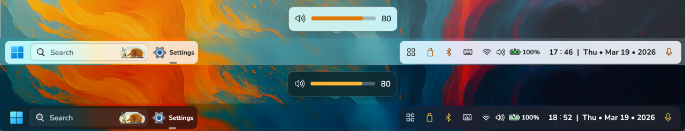
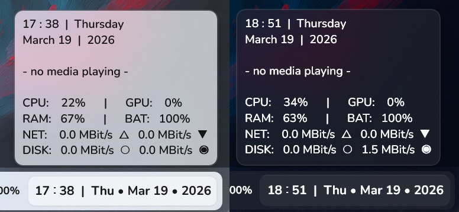

# LayerMicaUI theme for Windows 11 Taskbar Styler

LayerMicaUI is a modern Windows 11 taskbar theme with clean visuals and comprehensive styling.

**Author**: [Nimai-HK](https://github.com/Nimai-HK)



## Theme Specification
- Designed for Windows 11 25H2.
- Fully compatible with both Light and Dark modes.
- Optimized for a left-aligned taskbar only.
- Requires widgets on the taskbar to be disabled.
- Note: Clock styles and Taskbar Labels are an additional customisation, please refer to [Additional Configuration](#additional-configuration)

## Features
This theme also styles additional parts of Windows 11 for both Light and Dark modes.

- **Context Menus, Volume and Brightness HUD, Bluetooth and USB icons, Hover Flyouts, Window Snap Layouts, Taskbar Hidden Icons Tray**

  

- **Task View and Alt Tab Window Switcher**

  

---
## Additional Configuration
To make the taskbar look better, follow these settings:

<details>
  <summary>Taskbar Layer Border (Click to expand)</summary>

- This border was originally styled by the theme.
- It was removed because applying a Border Style interfered with the Windows 11 taskbar’s click‑to‑minimize window behavior.
- Does not affect the focusing or maximizing window behaviour.
- If you don’t use that action or aren’t affected, you can re‑enable it by placing these styles under "Control Styles" Section in the "Windows 11 Taskbar Styler" mod settings.

  ```yaml
  - target: Taskbar.TaskbarFrame > Grid#RootGrid
    styles:
      - BorderBrush:=$ThemeOutBorder

  - target: Grid#SystemTrayFrameGrid
    styles:
      - BorderBrush:=$ThemeOutBorder
  ```
</details>

<details>
  <summary>Taskbar Search Bar Active States (Click to expand)</summary>

- Currently, the search bar active states are controlled by SearchHost.exe, which can be customized by the "Windows 11 Start Menu Styler" mod.
- Paste these styles under "Control Styles" Section in the "Windows 11 Start Menu Styler" Mod settings.

    ```yaml
    - target: Border#TaskbarSearchBackground
      styles:
        - CornerRadius=$InnerRadius
        - Background:=$ThemeOverlay
        - BorderThickness=0
        - Height=32
        - Transform3D:=<CompositeTransform3D TranslateY="-2" TranslateX="1"/>

    - target: Cortana.UI.Views.RichSearchBoxControl#SearchBoxControl > Grid#RootGrid
      styles:
        - CornerRadius=$InnerRadius
        - Transform3D:=<CompositeTransform3D TranslateY="-2" TranslateX="1"/>
    ```

</details>

<details>
  <summary>Font Customisation (Click to expand)</summary>

- Font to be installed: [Nunito](https://fonts.google.com/specimen/Nunito)
- Add these items to the "Style Constants" section of the settings page of the "Windows 11 Taskbar Styler" mod
    ```
  ThFntWt=Semibold
    ```
</details>

<details>
  <summary>Taskbar height and icon size (Click to expand)</summary>

- Paste this JSON into the "Mod settings" text box under the Advanced Settings tab of the "Taskbar Height and Icon Size" mod.

  ```json
  {
    "TaskbarHeight":52,
    "IconSize":24,
    "TaskbarButtonWidth":42,
    "IconSizeSmall":0,
    "TaskbarButtonWidthSmall":30
  }
  ```
</details>

<details>
  <summary>Taskbar Clock Customisation (Click to expand)</summary>

- Paste this JSON into the "Mod settings" text box under the Advanced Settings tab of the "Taskbar Clock Customisation" mod.

  ```json
  {
    "ShowSeconds":0,
    "TimeFormat":"HH' : 'mm;HH' : 'mm",
    "DateFormat":"' | ' ddd • MMM dd • yyyy;MMMM dd ' | ' yyyy;dddd",
    "WeekdayFormat":"dddd",
    "WeekdayFormatCustom":"Sun, Mon, Tue, Wed, Thu, Fri, Sat",
    "TopLine":"%time% %date%",
    "BottomLine":"%date%",
    "MiddleLine":"%weekday%",
    "TooltipLine":"%time2%  |  %date3%%n%%date2%%n%%n%%media_info%%n%%n%CPU:    %cpu%      |      GPU:  %gpu%%n%RAM:   %ram%      |      BAT:   %battery%%n%NET:    %upload_speed%  △   %download_speed%  ▼%n%DISK:   %disk_read%  ○   %disk_write%  ◉",
    "TooltipLineMode":"replace",
    "Width":180,
    "Height":60,
    "MaxWidth":0,
    "TextSpacing":-1,
    "DataCollection.NetworkMetricsFormat":"mbits",
    "DataCollection.NetworkMetricsFixedDecimals":1,
    "DataCollection.PercentageFormat":"spacePaddingAndSymbol",
    "DataCollection.UpdateInterval":1,
    "DataCollection.NetworkAdapterName":"",
    "DataCollection.GpuAdapterName":"",
    "MediaPlayer.IgnoredPlayers[0]":"",
    "MediaPlayer.MaxLength":38,
    "MediaPlayer.NoMediaText":"- no media playing -",
    "MediaPlayer.RemoveBrackets":0,
    "WebContentWeatherLocation":"",
    "WebContentWeatherFormat":"%c 🌡️%t 🌬️%w",
    "WebContentWeatherUnits":"autoDetect",
    "WebContentsItems[0].Url":"",
    "WebContentsItems[0].BlockStart":"<item>",
    "WebContentsItems[0].Start":"<title>",
    "WebContentsItems[0].End":"</title>",
    "WebContentsItems[0].ContentMode":"xmlHtml",
    "WebContentsItems[0].SearchReplace[0].Search":"",
    "WebContentsItems[0].SearchReplace[0].Replace":"",
    "WebContentsItems[0].MaxLength":28,
    "WebContentsUpdateInterval":10,
    "TimeStyle.Hidden":0,
    "TimeStyle.TextColor":"",
    "TimeStyle.TextAlignment":"Center",
    "TimeStyle.FontSize":14,
    "TimeStyle.FontFamily":"Nunito",
    "TimeStyle.FontWeight":"Bold",
    "TimeStyle.FontStyle":"",
    "TimeStyle.FontStretch":"",
    "TimeStyle.CharacterSpacing":0,
    "DateStyle.Hidden":1,
    "DateStyle.TextColor":"",
    "DateStyle.TextAlignment":"Center",
    "DateStyle.FontSize":0,
    "DateStyle.FontFamily":"",
    "DateStyle.FontWeight":"",
    "DateStyle.FontStyle":"",
    "DateStyle.FontStretch":"",
    "DateStyle.CharacterSpacing":30,
    "oldTaskbarOnWin11":0
  }
  ```

  

</details>

<details>
  <summary>Taskbar Labels for Windows 11 (Click to expand)</summary>

- Paste this JSON into the "Mod settings" text box under the Advanced Settings tab of the "Taskbar Labels for Windows 11" mod.

  ```json
  {
    "mode":"labelsWithCombining",
    "taskbarItemWidth":0,
    "runningIndicatorStyle":"centerDynamic",
    "progressIndicatorStyle":"fullWidth",
    "minimumTaskbarItemWidth":100,
    "maximumTaskbarItemWidth":180,
    "fontSize":12,
    "fontFamily":"Nunito Bold",
    "textTrimming":"clip",
    "leftAndRightPaddingSize":5,
    "spaceBetweenIconAndLabel":8,
    "runningIndicatorHeight":3,
    "runningIndicatorVerticalOffset":3,
    "alwaysShowThumbnailLabels":0,
    "labelForSingleItem":"",
    "labelForMultipleItems":""
  }
  ```
</details>

## Other LayerMicaUI Themes
- [LayerMicaUI Start Menu Theme](https://github.com/ramensoftware/windows-11-start-menu-styling-guide/tree/main/Themes/LayerMicaUI)

- [LayerMicaUI Notification And Control Center Theme](https://github.com/ramensoftware/windows-11-notification-center-styling-guide/tree/main/Themes/LayerMicaUI)

---

## Theme selection

The theme is integrated into the mod and can be selected directly from the mod's
settings:

* Open the Windows 11 Taskbar Styler mod in Windhawk.
* Go to the "Settings" tab.
* Select the theme and save the settings.

## Manual installation

The theme styles can also be imported manually. To do that, follow these steps:

* Open the Windows 11 Taskbar Styler mod in Windhawk.
* Go to the "Advanced" tab.
* Copy the content below to the text box under "Mod settings" and click "Save".

<details>
<summary>Content to import (click to expand)</summary>

```json
{
  "styleConstants[0]":"ThemeBlur=<WindhawkBlur BlurAmount=\"12\" TintColor=\"{ThemeResource SystemChromeMediumColor}\" TintSaturation=\"1.25\" NoiseOpacity=\"0.1\" NoiseDensity=\"0.8\" TintOpacity=\"0.2\" TintLuminosityOpacity=\"0.3\" />",
  "styleConstants[1]":"ThemeLayer=<AcrylicBrush BackgroundSource=\"Backdrop\" TintColor=\"{ThemeResource SystemChromeMediumColor}\" TintOpacity=\"{ThemeResource bgOpacity}\" TintLuminosityOpacity=\"{ThemeResource bgLuminosity}\" FallbackColor=\"{ThemeResource SystemChromeMediumColor}\" />",
  "styleConstants[2]":"OuterRadius=10",
  "styleConstants[3]":"InnerRadius=8",
  "styleConstants[4]":"ThemeBorder=<SolidColorBrush Color=\"{ThemeResource Border}\"/>",
  "styleConstants[5]":"ThFnt=Nunito",
  "styleConstants[6]":"ThemeOutBorder=<SolidColorBrush Color=\"#56757575\"/>",
  "styleConstants[7]":"ThemeOverlay=<SolidColorBrush Color=\"{ThemeResource Overlay}\" />",
  "styleConstants[8]":"ThemeIsland=<SolidColorBrush Color=\"{ThemeResource Island}\" />",
  "styleConstants[9]":"ThemeControlBorder=<SolidColorBrush Color=\"{ThemeResource ControlBorder}\" />",
  "styleConstants[10]":"ThFntWt=Normal",
  "styleConstants[11]":"ThemeFlyout=<AcrylicBrush BackgroundSource=\"Backdrop\" TintColor=\"{ThemeResource SystemChromeMediumColor}\" TintOpacity=\"0.1\" TintLuminosityOpacity=\"0.8\" FallbackColor=\"{ThemeResource SystemChromeMediumColor}\" />",

  "theme":"",

  "themeResourceVariables[0]":"Accent1@Dark={ThemeResource SystemAccentColorLight3}",
  "themeResourceVariables[1]":"Accent1@Light={ThemeResource SystemAccentColorDark2}",
  "themeResourceVariables[2]":"bgOpacity@Dark=0.3",
  "themeResourceVariables[3]":"bgOpacity@Light=0.2",
  "themeResourceVariables[4]":"bgLuminosity@Light=1",
  "themeResourceVariables[5]":"bgLuminosity@Dark=0.9",
  "themeResourceVariables[6]":"Overlay@Light=#40FFFFFF",
  "themeResourceVariables[7]":"Overlay@Dark=#09FFFFFF",
  "themeResourceVariables[8]":"Border@Light=#0F000000",
  "themeResourceVariables[9]":"Border@Dark=#19000000",
  "themeResourceVariables[10]":"ControlBorder@Light=#0F000000",
  "themeResourceVariables[11]":"ControlBorder@Dark=#15FFFFFF",
  "themeResourceVariables[12]":"Island@Light=#5FFFFFFF",
  "themeResourceVariables[13]":"Island@Dark=#10FFFFFF",

  "controlStyles[0].target":"Border#BackgroundDimmingLayer",
    "controlStyles[0].styles[0]":"Background:=$ThemeBlur",
    "controlStyles[0].styles[1]":"// Win + tab View > Background",

  "controlStyles[1].target":"Border#OverflowFlyoutBackgroundBorder",
    "controlStyles[1].styles[0]":"Background:=$ThemeLayer",
    "controlStyles[1].styles[1]":"CornerRadius=$OuterRadius",
    "controlStyles[1].styles[2]":"BorderBrush:=$ThemeOutBorder",
    "controlStyles[1].styles[3]":"BorderThickness=1",
    "controlStyles[1].styles[4]":"// Taskbar Tray Hidden List > Background",

  "controlStyles[2].target":"Border#VirtualDesktopBarBackground",
    "controlStyles[2].styles[0]":"Background:=$ThemeLayer",
    "controlStyles[2].styles[1]":"CornerRadius=$OuterRadius",
    "controlStyles[2].styles[2]":"BorderBrush:=$ThemeOutBorder",
    "controlStyles[2].styles[3]":"// Win + tab View > Virtual Desktops List Background ",

  "controlStyles[3].target":"Border#SnapPickerBorder",
    "controlStyles[3].styles[0]":"Background:=$ThemeBlur",
    "controlStyles[3].styles[1]":"// Window Snapping Arrangement Picker ( Hover on Maximize/Minimize button )",

  "controlStyles[4].target":"Border#SnapBarBorder",
    "controlStyles[4].styles[0]":"Background:=$ThemeBlur",
    "controlStyles[4].styles[1]":"// Window Snapping Arrangement Window ( Move Window to Top of screen )",

  "controlStyles[5].target":"Grid#SystemTrayFrameGrid",
    "controlStyles[5].styles[0]":"Background:=$ThemeLayer",
    "controlStyles[5].styles[1]":"CornerRadius=$OuterRadius",
    "controlStyles[5].styles[2]":"Margin=0,3,8,3",
    "controlStyles[5].styles[3]":"Padding=4,0,0,0",
    "controlStyles[5].styles[4]":"BorderThickness=1",
    "controlStyles[5].styles[5]":"// BorderBrush:=$ThemeOutBorder",
    "controlStyles[5].styles[6]":"// Taskbar System Tray (Right Region) Grid > Background",

  "controlStyles[6].target":"Grid#ModalRootGrid > Border#BackgroundElement",
    "controlStyles[6].styles[0]":"Background:=$ThemeBlur",
    "controlStyles[6].styles[1]":"CornerRadius=$OuterRadius",
    "controlStyles[6].styles[2]":"BorderBrush:=$ThemeOutBorder",
    "controlStyles[6].styles[3]":"// Alt + Tab View Background",

  "controlStyles[7].target":"Grid#ConfirmatorMainGrid",
    "controlStyles[7].styles[0]":"Background:=$ThemeLayer",
    "controlStyles[7].styles[1]":"CornerRadius=$OuterRadius",
    "controlStyles[7].styles[2]":"BorderThickness=1",
    "controlStyles[7].styles[3]":"BorderBrush:=$ThemeOutBorder",
    "controlStyles[7].styles[4]":"Height=46",
    "controlStyles[7].styles[5]":"// Brightness/Volume Popup Background",

  "controlStyles[8].target":"Grid#HorizontalTemplate > Rectangle#HorizontalDecreaseRect",
    "controlStyles[8].styles[0]":"Height=7.5",
    "controlStyles[8].styles[1]":"RadiusX=3",
    "controlStyles[8].styles[2]":"RadiusY=3",
    "controlStyles[8].styles[3]":"// Brightness/Volume Popup > Increasing/decreasing slider",

  "controlStyles[9].target":"Grid#HorizontalTemplate > Rectangle#HorizontalTrackRect",
    "controlStyles[9].styles[0]":"Height=7.5",
    "controlStyles[9].styles[1]":"RadiusX=3",
    "controlStyles[9].styles[2]":"RadiusY=3",
    "controlStyles[9].styles[3]":"Opacity=0.5",
    "controlStyles[9].styles[4]":"// Brightness/Volume Popup > Slider Track (Background)",

  "controlStyles[10].target":"Grid#VolumeConfirmator > Slider#volumeSlider",
    "controlStyles[10].styles[0]":"Margin=0,-3.5,0,0",
    "controlStyles[10].styles[1]":"Width=120",
    "controlStyles[10].styles[2]":"// Volume Popup > Slider Region Grid",

  "controlStyles[11].target":"Grid#BrightnessConfirmator > Slider#brightnessSlider",
    "controlStyles[11].styles[0]":"Width=135",
    "controlStyles[11].styles[1]":"Margin=0,-2.5,0,0",
    "controlStyles[11].styles[2]":"// Brightness Popup > Slider Region Grid",

  "controlStyles[12].target":"Grid#OverflowRootGrid > Border",
    "controlStyles[12].styles[0]":"//Background:=$ThemeLayer",
    "controlStyles[12].styles[1]":"//CornerRadius:=$OuterRadius",
    "controlStyles[12].styles[2]":"//BorderThickness=1",
    "controlStyles[12].styles[3]":"//BorderBrush:=$ThemeOutBorder",
    "controlStyles[12].styles[4]":"// Taskbar Overflow when full > Background",

  "controlStyles[13].target":"Grid#DynamicSearchBoxGleamContainer",
    "controlStyles[13].styles[0]":"Height=30",
    "controlStyles[13].styles[1]":"// Taskbar Search Box > Art container beside search",

  "controlStyles[14].target":"Grid > HyperlinkButton#Footer",
    "controlStyles[14].styles[0]":"HorizontalContentAlignment=1",
    "controlStyles[14].styles[1]":"// IDR what this was for",

  "controlStyles[15].target":"Microsoft.UI.Xaml.Controls.AnimatedIcon#BrightnessIcon",
    "controlStyles[15].styles[0]":"Height=22",
    "controlStyles[15].styles[1]":"Width=22",
    "controlStyles[15].styles[2]":"// Brightness Popup > Icon",

  "controlStyles[16].target":"Microsoft.UI.Xaml.Controls.AnimatedIcon#VolumeIcon",
    "controlStyles[16].styles[0]":"Height=18",
    "controlStyles[16].styles[1]":"Width=18",
    "controlStyles[16].styles[2]":"// Volume Popup > Icon",

  "controlStyles[17].target":"SystemTray.NotifyIconView#NotifyItemIcon[AutomationProperties.Name=Bluetooth Devices] > Grid#ContainerGrid > ContentPresenter#ContentPresenter > Grid#ContentGrid > SystemTray.ImageIconContent > Grid#ContainerGrid > Image",
    "controlStyles[17].styles[0]":"Visibility=1",
    "controlStyles[17].styles[1]":"// Default Bluetooth Icon on taskbar",

  "controlStyles[18].target":"SystemTray.NotifyIconView#NotifyItemIcon[AutomationProperties.Name=Safely Remove Hardware and Eject Media] > Grid#ContainerGrid > ContentPresenter#ContentPresenter > Grid#ContentGrid > SystemTray.ImageIconContent > Grid#ContainerGrid > Image",
    "controlStyles[18].styles[0]":"Visibility=1",
    "controlStyles[18].styles[1]":"// Default Plugged in device/USB Indicator Icon on taskbar",

  "controlStyles[19].target":"SystemTray.NotifyIconView#NotifyItemIcon[AutomationProperties.Name=Bluetooth Devices] > Grid#ContainerGrid > ContentPresenter#ContentPresenter",
    "controlStyles[19].styles[0]":"Content:=<FontIcon FontFamily=\"Segoe Fluent Icons\" Glyph=\"&#xE702;\" FontSize=\"16\"/>",
    "controlStyles[19].styles[1]":"Foreground:=<SolidColorBrush Color=\"{ThemeResource Accent1}\" />",
    "controlStyles[19].styles[2]":"Canvas.ZIndex=-1",
    "controlStyles[19].styles[3]":"// New (Themed) Bluetooth Icon on taskbar",

  "controlStyles[20].target":"SystemTray.NotifyIconView#NotifyItemIcon[AutomationProperties.Name=Safely Remove Hardware and Eject Media] > Grid#ContainerGrid > ContentPresenter#ContentPresenter",
    "controlStyles[20].styles[0]":"Content:=<FontIcon FontFamily=\"Segoe Fluent Icons\" Glyph=\"&#xE88E;\" FontSize=\"16\"/>",
    "controlStyles[20].styles[1]":"Foreground:=<SolidColorBrush Color=\"{ThemeResource Accent1}\" />",
    "controlStyles[20].styles[2]":"Canvas.ZIndex=-1",
    "controlStyles[20].styles[3]":"// New (Themed) Plugged in device/USB Indicator Icon on taskbar",

  "controlStyles[21].target":"SystemTray.OmniButton#ControlCenterButton",
    "controlStyles[21].styles[0]":"Grid.Column=4",
    "controlStyles[21].styles[1]":"CornerRadius=$InnerRadius",
    "controlStyles[21].styles[2]":"// System Tray > Control Center Button",

  "controlStyles[22].target":"SystemTray.OmniButton#NotificationCenterButton",
    "controlStyles[22].styles[0]":"Grid.Column=5",
    "controlStyles[22].styles[1]":"CornerRadius=$InnerRadius",
    "controlStyles[22].styles[2]":"// System Tray > Notification Center Button",

  "controlStyles[23].target":"SystemTray.Stack#MainStack",
    "controlStyles[23].styles[0]":"Grid.Column=6",
    "controlStyles[23].styles[1]":"CornerRadius=$InnerRadius",
    "controlStyles[23].styles[2]":"// System tray > Microphone and Location Icons Grid",

  "controlStyles[24].target":"SystemTray.Stack#ShowDesktopStack",
    "controlStyles[24].styles[0]":"CornerRadius=$InnerRadius",
    "controlStyles[24].styles[1]":"Grid.Column=7",
    "controlStyles[24].styles[2]":"Width=5",
    "controlStyles[24].styles[3]":"// System Tray > Show Desktop Button",

  "controlStyles[25].target":"SystemTray.Stack#NonActivatableStack",
    "controlStyles[25].styles[0]":"Grid.Column=2",
    "controlStyles[25].styles[1]":"// System Tray > Taskbar Additional Buttons Grid (Touch keyboard, Emoji Buttons)",

  "controlStyles[26].target":"Taskbar.ExperienceToggleButton#LaunchListButton[AutomationProperties.AutomationId=TaskViewButton] > Taskbar.TaskListButtonPanel#ExperienceToggleButtonRootPanel",
    "controlStyles[26].styles[0]":"CornerRadius=$InnerRadius",
    "controlStyles[26].styles[1]":"Width=44",
    "controlStyles[26].styles[2]":"// Task View Button Background",

  "controlStyles[27].target":"Taskbar.TaskItemThumbnailView > Grid > Border",
    "controlStyles[27].styles[0]":"CornerRadius=$OuterRadius",
    "controlStyles[27].styles[1]":"Background:=$ThemeLayer",
    "controlStyles[27].styles[2]":"BorderThickness=1",
    "controlStyles[27].styles[3]":"BorderBrush:=$ThemeOutBorder",
    "controlStyles[27].styles[4]":"// Task View > Hover Over Popup Preview > Background",

  "controlStyles[28].target":"Taskbar.TaskItemThumbnailView > Grid > TextBlock#DisplayNameTextBlock",
    "controlStyles[28].styles[0]":"FontFamily=$ThFnt",
    "controlStyles[28].styles[1]":"FontWeight=Bold",
    "controlStyles[28].styles[2]":"// Task View > Hover Over Popup Preview > TextBlocks for Desktop Names ",

  "controlStyles[29].target":"Taskbar.TaskListButton",
    "controlStyles[29].styles[0]":"CornerRadius=$InnerRadius",
    "controlStyles[29].styles[1]":"Margin=0,-1,0,-1",
    "controlStyles[29].styles[2]":"BorderBrush:=$ThemeControlBorder",
    "controlStyles[29].styles[3]":"BorderThickness=1",
    "controlStyles[29].styles[4]":"// Taskbar Buttons > Main List buttons > Button Background",

  "controlStyles[30].target":"Taskbar.TaskbarBackground#BackgroundControl",
    "controlStyles[30].styles[0]":"Opacity=0",
    "controlStyles[30].styles[1]":"// Default Taskbar Background",

  "controlStyles[31].target":"Taskbar.TaskbarBackground#HoverFlyoutBackgroundControl > Grid > Rectangle#BackgroundFill",
    "controlStyles[31].styles[0]":"CornerRadius=$OuterRadius",
    "controlStyles[31].styles[1]":"// Taskbar Task list > Hover Over Window Thumbnails Region > Background",

  "controlStyles[32].target":"Taskbar.TaskbarBackground#HoverFlyoutBackgroundControl",
    "controlStyles[32].styles[0]":"FontFamily=$ThFnt",
    "controlStyles[32].styles[1]":"// Taskbar Task list > Hover Over Window Thumbnails Region > Thumbnail Window Names Textblock",

  "controlStyles[33].target":"Taskbar.TaskbarFrame",
    "controlStyles[33].styles[0]":"Width=Auto",
    "controlStyles[33].styles[1]":"// Taskbar Task Region Frame(Task list + search area + Start button Region grid)",

  "controlStyles[34].target":"Taskbar.TaskbarFrame > Grid#RootGrid",
    "controlStyles[34].styles[0]":"Margin=8,3,0,3",
    "controlStyles[34].styles[1]":"CornerRadius=$OuterRadius",
    "controlStyles[34].styles[2]":"Padding=-8,0,0,0",
    "controlStyles[34].styles[3]":"Background:=$ThemeLayer",
    "controlStyles[34].styles[4]":"BorderThickness=1",
    "controlStyles[34].styles[5]":"HorizontalAlignment=Left",
    "controlStyles[34].styles[6]":"// BorderBrush:=$ThemeOutBorder",
    "controlStyles[34].styles[7]":"// Taskbar Task Region Frame(Task list + search area + Start button Region grid) > Background",

  "controlStyles[35].target":"TextBlock#InnerTextBlock[Text=]",
    "controlStyles[35].styles[0]":"Text=",
    "controlStyles[35].styles[1]":"// System Tray Hidden Icons Button TextBlock",

  "controlStyles[36].target":"TextBlock#volumeLevelText",
    "controlStyles[36].styles[0]":"FontSize=15",
    "controlStyles[36].styles[1]":"Margin=0,-1,0,0",
    "controlStyles[36].styles[2]":"FontFamily=$ThFnt",
    "controlStyles[36].styles[3]":"FontWeight=$ThFntWt",
    "controlStyles[36].styles[4]":"// Volume Popup > Volume Level Text",

  "controlStyles[37].target":"TextBlock#BatteryTextBlock",
    "controlStyles[37].styles[0]":"FontFamily=$ThFnt",
    "controlStyles[37].styles[1]":"FontSize=12",
    "controlStyles[37].styles[2]":"FontWeight=Bold",
    "controlStyles[37].styles[3]":"// New 25H2 Battery Level TextBlock",

  "controlStyles[38].target":"ToolTip > ContentPresenter#LayoutRoot",
    "controlStyles[38].styles[0]":"Background:=$ThemeFlyout",
    "controlStyles[38].styles[1]":"CornerRadius=$OuterRadius",
    "controlStyles[38].styles[2]":"BorderBrush:=$ThemeOutBorder",
    "controlStyles[38].styles[3]":"BorderThickness=1",
    "controlStyles[38].styles[4]":"// Hover popups/tooltips > Background",

  "controlStyles[39].target":"ToolTip > ContentPresenter#LayoutRoot > TextBlock",
    "controlStyles[39].styles[0]":"FontFamily=$ThFnt",
    "controlStyles[39].styles[1]":"FontWeight=$ThFntWt",
    "controlStyles[39].styles[2]":"FontSize=13",
    "controlStyles[39].styles[3]":"// Hover popups/tooltips > TextBlock",

  "controlStyles[40].target":"WindowsInternal.ComposableShell.Experiences.Switcher.NewVirtualDesktopElementThemed#NewVirtualDesktopButtonThemed > Grid#MainGrid > Border#MainBorder",
    "controlStyles[40].styles[0]":"CornerRadius=$OuterRadius",
    "controlStyles[40].styles[1]":"Background:=$ThemeOverlay",
    "controlStyles[40].styles[2]":"// Virtual Desktops > Add new Desktop Button > Main Background",

  "controlStyles[41].target":"WindowsInternal.ComposableShell.Experiences.Switcher.NewVirtualDesktopElementThemed#NewVirtualDesktopButtonThemed > Grid#MainGrid > Border#BorderHighlight",
    "controlStyles[41].styles[0]":"CornerRadius=$OuterRadius",
    "controlStyles[41].styles[1]":"// Virtual Desktops > Add new Desktop Button > Highlight Background",

  "controlStyles[42].target":"WindowsInternal.ComposableShell.Experiences.Switcher.SwitchItemElement > Grid#RootGrid > Grid#TitleGrid > Border#BackgroundBorder",
    "controlStyles[42].styles[0]":"CornerRadius=$OuterRadius,$OuterRadius,0,0",
    "controlStyles[42].styles[1]":"// Window Title Background in Win + Tab View",

  "controlStyles[43].target":"WindowsInternal.ComposableShell.Experiences.Switcher.SwitchItemElement > Grid#RootGrid > Grid#TitleGrid",
    "controlStyles[43].styles[0]":"FontFamily=$ThFnt",
    "controlStyles[43].styles[1]":"FontWeight=$ThFntWt",
    "controlStyles[43].styles[2]":"// Window Title Grid in Win + Tab View",

  "controlStyles[44].target":"WindowsInternal.ComposableShell.Experiences.Switcher.SwitchItemListViewItem > Grid#Root > Border#BackgroundBorder",
    "controlStyles[44].styles[0]":"CornerRadius=$OuterRadius",
    "controlStyles[44].styles[1]":"Background:=$ThemeLayer",
    "controlStyles[44].styles[2]":"BorderBrush:=$ThemeControlBorder",
    "controlStyles[44].styles[3]":"BorderThickness=1",
    "controlStyles[44].styles[4]":"// Window Grid Background in Win + Tab View",

  "controlStyles[45].target":"WindowsInternal.ComposableShell.Experiences.Switcher.VirtualDesktopElementThemed > Grid#MainGrid > Border#MainBorder",
    "controlStyles[45].styles[0]":"CornerRadius=$OuterRadius",
    "controlStyles[45].styles[1]":"Background:=$ThemeOverlay",
    "controlStyles[45].styles[2]":"// Virtual Desktops Background",

  "controlStyles[46].target":"WindowsInternal.ComposableShell.Experiences.Switcher.VirtualDesktopElementThemed > Grid#MainGrid > Border#BorderHighlight",
    "controlStyles[46].styles[0]":"CornerRadius=$OuterRadius",
    "controlStyles[46].styles[1]":"// Virtual Desktops Background Highlight",

  "controlStyles[47].target":"WindowsInternal.ComposableShell.Experiences.Switcher.VirtualDesktopElementThemed > Grid#MainGrid > Border#ActiveDesktopPill",
    "controlStyles[47].styles[0]":"CornerRadius=$OuterRadius",
    "controlStyles[47].styles[1]":"// Virtual Desktops > Active Desktop Highlight",

  "controlStyles[48].target":"WindowsInternal.ComposableShell.Experiences.TextInput.Common.InputSwitcher > ContentControl > ContentPresenter > Grid",
    "controlStyles[48].styles[0]":"Background:=$ThemeLayer",
    "controlStyles[48].styles[1]":"BorderBrush:=$ThemeOutBorder",
    "controlStyles[48].styles[2]":"Shadow:=",
    "controlStyles[48].styles[3]":"CornerRadius=$OuterRadius",
    "controlStyles[48].styles[4]":"// Win + Space Input Language Switcher Bar Background ",

  "controlStyles[49].target":"WindowsInternal.ComposableShell.Experiences.TextInput.Common.InputSwitcher > ContentControl > ContentPresenter > Grid > Grid#OverlayPanel",
    "controlStyles[49].styles[0]":"Background=Transparent",
    "controlStyles[49].styles[1]":"BorderBrush=Transparent",
    "controlStyles[49].styles[2]":"// Win + Space Input Language Switcher Bar Background ( Overlaid Background )",

  "controlStyles[50].target":"Button#GleamEntryPointButton > Border",
    "controlStyles[50].styles[0]":"Height=30",
    "controlStyles[50].styles[1]":"// Taskbar Search Bar >  Art container beside search > Button background ",

  "controlStyles[51].target":"ContentPresenter > SearchUx.SearchUI.SearchButtonControl > Grid > SearchUx.SearchUI.SearchBoxButton#SearchBox > SearchUx.SearchUI.SearchButtonRootGrid#SearchBoxButtonRootPanel > TextBlock#SearchBoxTextBlock",
    "controlStyles[51].styles[0]":"FontFamily=$ThFnt",
    "controlStyles[51].styles[1]":"FontWeight=$ThFntWt",
    "controlStyles[51].styles[2]":"FontSize=14",
    "controlStyles[51].styles[3]":"RenderTransform:=<TranslateTransform Y=\"1\" />",
    "controlStyles[51].styles[4]":"// Taskbar Search Bar > TextBlock",

  "controlStyles[52].target":"MenuFlyoutPresenter",
    "controlStyles[52].styles[0]":"Background:=$ThemeFlyout",
    "controlStyles[52].styles[1]":"CornerRadius=$OuterRadius",
    "controlStyles[52].styles[2]":"FontFamily=$ThFnt",
    "controlStyles[52].styles[3]":"FontWeight=$ThFntWt",
    "controlStyles[52].styles[4]":"BorderThickness=1",
    "controlStyles[52].styles[5]":"BorderBrush:=$ThemeOutBorder",
    "controlStyles[52].styles[6]":"// Menu Flyouts Root (Background + TextBlock Styles)",

  "controlStyles[53].target":"Microsoft.UI.Xaml.Controls.ItemsRepeater#TaskbarFrameRepeater",
    "controlStyles[53].styles[0]":"Margin=0,0,2,0",
    "controlStyles[53].styles[1]":"// IDR what this was for",

  "controlStyles[54].target":"Rectangle#BackgroundStroke",
    "controlStyles[54].styles[0]":"Visibility=1",
    "controlStyles[54].styles[1]":"// Thin Line running along the top of the Taskbar (edge)",

  "controlStyles[55].target":"ScrollViewer > ScrollContentPresenter > Border > Grid",
    "controlStyles[55].styles[0]":"Background:=<WindhawkBlur BlurAmount=\"5\" TintColor=\"{ThemeResource SystemChromeMediumColor}\" TintSaturation=\"2\" NoiseOpacity=\"0.19\" NoiseDensity=\"0.8\" TintOpacity=\"0.2\" TintLuminosityOpacity=\"0\" />",
    "controlStyles[55].styles[1]":"// Taskbar Root > Base Presenter > Base Grid (Usually transparent, Styled by this theme)",

  "controlStyles[56].target":"SearchUx.SearchUI.SearchBoxButton#SearchBox",
    "controlStyles[56].styles[0]":"Margin=0,-1,0,0",
    "controlStyles[56].styles[1]":"// Taskbar Search Bar Button",

  "controlStyles[57].target":"SearchUx.SearchUI.SearchButtonRootGrid@CommonStates > Border#BackgroundElement",
    "controlStyles[57].styles[0]":"Background:=$ThemeIsland",
    "controlStyles[57].styles[1]":"BorderBrush:=$ThemeOutBorder",
    "controlStyles[57].styles[2]":"BorderThickness=1",
    "controlStyles[57].styles[3]":"CornerRadius=$InnerRadius",
    "controlStyles[57].styles[4]":"Margin=0,-2.5,0,-2.5",
    "controlStyles[57].styles[5]":"// Taskbar Search Bar Button > Background",

  "controlStyles[58].target":"SearchUx.SearchUI.SearchPillButton#SearchPill > SearchUx.SearchUI.SearchButtonRootGrid#SearchBoxButtonRootPanel > Border#SearchPillBackgroundElement",
    "controlStyles[58].styles[0]":"CornerRadius=$InnerRadius",
    "controlStyles[58].styles[1]":"Height=26",
    "controlStyles[58].styles[2]":"BorderBrush:=$ThemeBorder",
    "controlStyles[58].styles[3]":"Background:=$ThemeOverlay",
    "controlStyles[58].styles[4]":"// Taskbar Search Button (Pill Shaped search) > Background",

  "controlStyles[59].target":"SystemTray.NotificationAreaIcons#NotificationAreaIcons",
    "controlStyles[59].styles[0]":"Grid.Column=1",
    "controlStyles[59].styles[1]":"CornerRadius=$InnerRadius",
    "controlStyles[59].styles[2]":"// Apps Pinned to system tray + Bluetooth and Usb Grid",

  "controlStyles[60].target":"SystemTray.SystemTrayFrame",
    "controlStyles[60].styles[0]":"HorizontalAlignment=Right",
    "controlStyles[60].styles[1]":"// System Tray Root Frame (Right Region of the taskbar )",

  "controlStyles[61].target":"Windows.UI.Xaml.Hosting.DesktopWindowXamlSource",
    "controlStyles[61].styles[0]":"Background:=$ThemeBlur",
    "controlStyles[61].styles[1]":"CornerRadius=$OuterRadius",
    "controlStyles[61].styles[2]":"BorderBrush:=$ThemeOutBorder",
    "controlStyles[61].styles[3]":"// Alt Tab View Background",

  "controlStyles[62].target":"WindowsInternal.ComposableShell.Experiences.Switcher.VirtualDesktopBarElement > Grid#GridElement > Border#VirtualDesktopSwitcherBackground",
    "controlStyles[62].styles[0]":"Background:=$ThemeLayer",
    "controlStyles[62].styles[1]":"// Virtual Desktop Switcher Bar Background"
}
```
</details>
