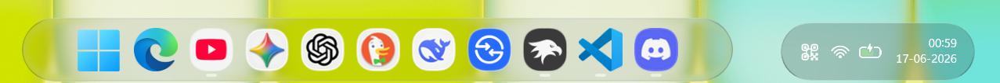

# LiquidGlass theme for Windows 11 Taskbar Styler

**Author**: [PhantomNimbi](https://github.com/PhantomNimbi)



## Theme selection

The theme is integrated into the mod and can simply be selected from the mod's
settings:

* Open the Windows 11 Taskbar Styler mod in Windhawk.
* Go to the "Settings" tab.
* Select the theme and save the settings.

## Manual installation

The theme styles can also be imported manually. To do that, follow these steps:

* Open the Windows 11 Taskbar Styler mod in Windhawk.
* Go to the "Advanced" tab.
* Copy the content below to the text box under "Mod settings" and click "Save".

<details>
<summary>Content to import (click to expand)</summary>

```json
{
  "controlStyles[0].target": "Taskbar.TaskbarFrame > Grid#RootGrid",
  "controlStyles[0].styles[0]": "BorderThickness=$BorderThickness",
  "controlStyles[0].styles[1]": "BorderBrush:=$BorderBrush",
  "controlStyles[0].styles[2]": "Background:=$Background",
  "controlStyles[1].target": "Rectangle#BackgroundFill",
  "controlStyles[1].styles[0]": "Visibility=1",
  "controlStyles[2].target": "Rectangle#BackgroundStroke",
  "controlStyles[2].styles[0]": "Visibility=1",
  "controlStyles[3].target": "Taskbar.AugmentedEntryPointButton#AugmentedEntryPointButton > Taskbar.TaskListButtonPanel#ExperienceToggleButtonRootPanel",
  "controlStyles[3].styles[0]": "Margin=-3,0",
  "controlStyles[4].target": "Grid#SystemTrayFrameGrid",
  "controlStyles[4].styles[0]": "Background:=$ElementBackground",
  "controlStyles[4].styles[1]": "BorderBrush:=$ElementBorderBrush",
  "controlStyles[4].styles[2]": "BorderThickness=$ElementBorderThickness",
  "controlStyles[4].styles[3]": "CornerRadius=$ElementCornerRadius",
  "controlStyles[4].styles[4]": "Margin=6",
  "controlStyles[5].target": "SystemTray.ChevronIconView",
  "controlStyles[5].styles[0]": "CornerRadius=$ElementCornerRadius",
  "controlStyles[6].target": "SystemTray.NotifyIconView#NotifyItemIcon",
  "controlStyles[6].styles[0]": "CornerRadius=$ElementCornerRadius",
  "controlStyles[7].target": "SystemTray.OmniButton",
  "controlStyles[7].styles[0]": "CornerRadius=$ElementCornerRadius",
  "controlStyles[8].target": "SystemTray.IconView#SystemTrayIcon > Grid#ContainerGrid > ContentPresenter#ContentPresenter > Grid#ContentGrid > SystemTray.TextIconContent > Grid#ContainerGrid",
  "controlStyles[8].styles[0]": "CornerRadius=$ElementCornerRadius",
  "controlStyles[9].target": "Taskbar.Gripper#GripperControl",
  "controlStyles[9].styles[0]": "Width=Auto",
  "controlStyles[9].styles[1]": "MinWidth=24",
  "controlStyles[9].styles[2]": "HorizontalAlignment=Left",
  "controlStyles[10].target": "TextBlock#TimeInnerTextBlock",
  "controlStyles[10].styles[0]": "FontSize=13",
  "controlStyles[10].styles[1]": "Margin=0",
  "controlStyles[10].styles[2]": "Padding=0",
  "controlStyles[10].styles[3]": "RenderTransform:=<TranslateTransform X=\"0\" Y=\"0\" />",
  "controlStyles[11].target": "TextBlock#DateInnerTextBlock",
  "controlStyles[11].styles[0]": "Visibility=1",
  "controlStyles[12].target": "TextBlock#InnerTextBlock[Text=]",
  "controlStyles[12].styles[0]": "Text=",
  "controlStyles[13].target": "TextBlock#SearchBoxTextBlock",
  "controlStyles[13].styles[0]": "Text=Search This PC",
  "controlStyles[13].styles[1]": "FontSize=10",
  "controlStyles[14].target": "SystemTray.OmniButton#NotificationCenterButton > Grid > ContentPresenter > ItemsPresenter > StackPanel > ContentPresenter > SystemTray.IconView#SystemTrayIcon > Grid > Grid > SystemTray.TextIconContent",
  "controlStyles[14].styles[0]": "Visibility=1",
  "controlStyles[15].target": "Border#OverflowFlyoutBackgroundBorder",
  "controlStyles[15].styles[0]": "BorderThickness=$BorderThickness",
  "controlStyles[15].styles[1]": "BorderBrush:=$BorderBrush",
  "controlStyles[15].styles[2]": "Background:=$Background",
  "controlStyles[15].styles[3]": "CornerRadius=$CornerRadius",
  "controlStyles[16].target": "WindowsInternal.ComposableShell.Experiences.Switcher.AltTab > Grid#ModalRootGrid > Border",
  "controlStyles[16].styles[0]": "BorderThickness=$BorderThickness",
  "controlStyles[16].styles[1]": "BorderBrush:=$BorderBrush",
  "controlStyles[16].styles[2]": "Background:=$Background",
  "controlStyles[16].styles[3]": "CornerRadius=$CornerRadius",
  "controlStyles[17].target": "WindowsInternal.ComposableShell.Experiences.Switcher.VirtualDesktopBarElement#VirtualDesktopBar",
  "controlStyles[17].styles[0]": "CornerRadius=$CornerRadius",
  "controlStyles[17].styles[1]": "Background:=$Background",
  "controlStyles[18].target": "Border#BackgroundDimmingLayer",
  "controlStyles[18].styles[0]": "Background:=$Background",
  "controlStyles[18].styles[1]": "CornerRadius=$CornerRadius",
  "controlStyles[19].target": "Taskbar.TaskListButtonPanel#ExperienceToggleButtonRootPanel > Border#BackgroundElement",
  "controlStyles[19].styles[0]": "CornerRadius=$CornerRadius",
  "controlStyles[19].styles[1]": "BorderThickness=$ElementBorderThickness",
  "controlStyles[20].target": "Taskbar.TaskListButton#TaskListButton",
  "controlStyles[20].styles[0]": "CornerRadius=$ElementCornerRadius",
  "controlStyles[20].styles[1]": "BorderThickness=$ElementBorderThickness",
  "controlStyles[21].target": "Border#SnapBarBorder",
  "controlStyles[21].styles[0]": "Background:=$Background",
  "controlStyles[21].styles[1]": "BorderBrush:=$BorderBrush",
  "controlStyles[21].styles[2]": "CornerRadius=$CornerRadius",
  "controlStyles[21].styles[3]": "BorderThickness=$BorderThickness",
  "controlStyles[21].styles[4]": "Margin=2",
  "controlStyles[22].target": "Taskbar.TaskListLabeledButtonPanel@CommonStates > Border#BackgroundElement",
  "controlStyles[22].styles[0]": "CornerRadius=$ElementCornerRadius",
  "controlStyles[22].styles[1]": "BorderThickness=$ElementBorderThickness",
  "controlStyles[22].styles[2]": "Background@ActiveNormal:=$ElementBackground",
  "controlStyles[22].styles[3]": "Background@ActivePointerOver:=$AccentBackground",
  "controlStyles[22].styles[4]": "Background@ActivePressed:=$ElementBackground2",
  "controlStyles[22].styles[5]": "Background@InactivePointerOver:=$AccentBackground",
  "controlStyles[22].styles[6]": "Background@InactivePressed:=$ElementBackground2",
  "controlStyles[22].styles[7]": "BorderBrush@ActiveNormal:=$ElementBorderBrush",
  "controlStyles[22].styles[8]": "BorderBrush@ActivePointerOver:=$ElementBorderBrush",
  "controlStyles[22].styles[9]": "BorderBrush@ActivePressed:=$ElementBorderBrush",
  "controlStyles[22].styles[10]": "BorderBrush@InactivePointerOver:=$ElementBorderBrush",
  "controlStyles[22].styles[11]": "BorderBrush@InactivePressed:=$ElementBorderBrush",
  "controlStyles[22].styles[12]": "Margin=1",
  "controlStyles[23].target": "ContentPresenter#ContentPresenter@CommonStates",
  "controlStyles[23].styles[0]": "CornerRadius=$ElementCornerRadius",
  "controlStyles[23].styles[1]": "BorderThickness=$ElementBorderThickness",
  "controlStyles[23].styles[2]": "Background@ActiveNormal:=$ElementBackground",
  "controlStyles[23].styles[3]": "Background@ActivePointerOver:=$AccentBackground",
  "controlStyles[23].styles[4]": "Background@ActivePressed:=$ElementBackground2",
  "controlStyles[23].styles[5]": "Background@InactivePointerOver:=$AccentBackground",
  "controlStyles[23].styles[6]": "Background@InactivePressed:=$ElementBackground2",
  "controlStyles[23].styles[7]": "BorderBrush@ActiveNormal:=$ElementBorderBrush",
  "controlStyles[23].styles[8]": "BorderBrush@ActivePointerOver:=$ElementBorderBrush",
  "controlStyles[23].styles[9]": "BorderBrush@ActivePressed:=$ElementBorderBrush",
  "controlStyles[23].styles[10]": "BorderBrush@InactivePointerOver:=$ElementBorderBrush",
  "controlStyles[23].styles[11]": "BorderBrush@InactivePressed:=$ElementBorderBrush",
  "controlStyles[23].styles[12]": "Margin=1",
  "controlStyles[24].target": "Border#SnapPickerBorder",
  "controlStyles[24].styles[0]": "Background:=$Background",
  "controlStyles[24].styles[1]": "BorderBrush:=$BorderBrush",
  "controlStyles[24].styles[2]": "CornerRadius=$CornerRadius",
  "controlStyles[24].styles[3]": "BorderThickness=$BorderThickness",
  "controlStyles[24].styles[4]": "Margin=2",
  "controlStyles[25].target": "Taskbar.TaskListButtonPanel#ExperienceToggleButtonRootPanel",
  "controlStyles[25].styles[0]": "Background:=Transparent",
  "controlStyles[26].target": "ToolTip > ContentPresenter#LayoutRoot",
  "controlStyles[26].styles[0]": "Background:=$Background",
  "controlStyles[26].styles[1]": "BorderBrush:=$BorderBrush",
  "controlStyles[26].styles[2]": "BorderThickness:=$BorderThickness",
  "controlStyles[26].styles[3]": "CornerRadius=$CornerRadius",
  "controlStyles[27].target": "WindowsInternal.ComposableShell.Experiences.Switcher.VirtualDesktopBarElement > Grid#GridElement > Border#VirtualDesktopSwitcherBackground",
  "controlStyles[27].styles[0]": "BorderBrush:=$BorderBrush",
  "controlStyles[27].styles[1]": "BorderThickness=$BorderThickness",
  "controlStyles[27].styles[2]": "CornerRadius=$CornerRadius",
  "controlStyles[27].styles[3]": "Background=$Background",
  "controlStyles[28].target": "WindowsInternal.ComposableShell.Experiences.Switcher.SwitchItemListViewItem > Grid > Border",
  "controlStyles[28].styles[0]": "CornerRadius=$CornerRadius",
  "controlStyles[29].target": "Border#VirtualDesktopBarBackground",
  "controlStyles[29].styles[0]": "Background:=$Background",
  "controlStyles[29].styles[1]": "BorderBrush:=$BorderBrush",
  "controlStyles[29].styles[2]": "BorderThickness=$BorderThickness",
  "controlStyles[29].styles[3]": "CornerRadius=$CornerRadius",
  "controlStyles[30].target": "Rectangle#RunningIndicator",
  "controlStyles[30].styles[0]": "Fill:=$AccentBackground",
  "controlStyles[31].target": "Rectangle#ShowDesktopPipe",
  "controlStyles[31].styles[0]": "Visibility=1",
  "controlStyles[32].target": "Rectangle#RightOverflowButtonDivider",
  "controlStyles[32].styles[0]": "Visibility=1",
  "controlStyles[33].target": "SearchUx.SearchUI.SearchIconButton > SearchUx.SearchUI.SearchButtonRootGrid@CommonStates > Border#BackgroundElement",
  "controlStyles[33].styles[0]": "Background:=Transparent",
  "controlStyles[33].styles[1]": "BorderBrush:=Transparent",
  "controlStyles[34].target": "SearchUx.SearchUI.SearchButtonRootGrid",
  "controlStyles[34].styles[0]": "Background:=Transparent",
  "controlStyles[34].styles[1]": "BorderBrush:=Transparent",
  "controlStyles[35].target": "Border#SearchPillBackgroundElement",
  "controlStyles[35].styles[0]": "BorderBrush:=$ElementBorderBrush",
  "controlStyles[35].styles[1]": "BorderThickness=$ElementBorderThickness",
  "controlStyles[35].styles[2]": "CornerRadius=$ElementCornerRadius",
  "controlStyles[35].styles[3]": "Margin=0,1",
  "controlStyles[36].target": "SearchUx.SearchUI.SearchBoxButton > SearchUx.SearchUI.SearchButtonRootGrid@CommonStates > Border#BackgroundElement",
  "controlStyles[36].styles[0]": "CornerRadius=$ElementCornerRadius",
  "controlStyles[36].styles[1]": "BorderThickness=$ElementBorderThickness",
  "controlStyles[36].styles[2]": "BorderBrush:=$ElementBorderBrush",
  "controlStyles[36].styles[3]": "Background:=$ElementBackground",
  "controlStyles[36].styles[4]": "Margin=0,-4",
  "controlStyles[37].target": "Canvas#HoverFlyoutCanvas > Grid#HoverFlyoutGrid > Border#HoverFlyoutBackground",
  "controlStyles[37].styles[0]": "Shadow:=",
  "controlStyles[37].styles[1]": "Background:=$Background",
  "controlStyles[37].styles[2]": "BorderBrush:=$BorderBrush",
  "controlStyles[37].styles[3]": "BorderThickness=$BorderThickness",
  "controlStyles[37].styles[4]": "CornerRadius=$CornerRadius",
  "controlStyles[38].target": "SystemTray.SystemTrayFrame",
  "controlStyles[38].styles[0]": "HorizontalAlignment=Right",
  "controlStyles[39].target": "Grid#AugmentedEntryPointContentGrid",
  "controlStyles[39].styles[0]": "HorizontalAlignment=Left",
  "controlStyles[30].styles[1]": "Width=14",
  "styleConstants[0]": "Background=<WindhawkBlur BlurAmount=\"15\" TintColor=\"{ThemeResource SystemChromeAltHighColor}\" TintOpacity=\"0.4\" />",
  "styleConstants[1]": "ElementBackground=<WindhawkBlur BlurAmount=\"20\" TintColor=\"{ThemeResource SystemChromeAltHighColor}\" TintOpacity=\"0.4\" />",
  "styleConstants[2]": "ElementBackground2=<WindhawkBlur BlurAmount=\"20\" TintColor=\"{ThemeResource SystemChromeAltHighColor}\" TintOpacity=\"0.2\" />",
  "styleConstants[3]": "AccentBackground=<WindhawkBlur BlurAmount=\"15\" TintColor=\"{ThemeResource SystemAccentColor}\" TintOpacity=\"0.4\" />",
  "styleConstants[4]": "BorderBrush=<LinearGradientBrush StartPoint=\"0,0\" EndPoint=\"0,1\"><GradientStop Color=\"#50808080\" Offset=\"0.0\" /><GradientStop Color=\"#50404040\" Offset=\"0.25\" /><GradientStop Color=\"#50808080\" Offset=\"1\" /></LinearGradientBrush>",
  "styleConstants[5]": "ElementBorderBrush=<LinearGradientBrush StartPoint=\"0,0\" EndPoint=\"0,1\"><GradientStop Color=\"#50808080\" Offset=\"1\" /><GradientStop Color=\"#50606060\" Offset=\"0.15\" /></LinearGradientBrush>",
  "styleConstants[6]": "BorderThickness=0.3,1,0.3,0.3",
  "styleConstants[7]": "ElementBorderThickness=0.3,0.3,0.3,1",
  "styleConstants[8]": "CornerRadius=12",
  "styleConstants[9]": "ElementCornerRadius=8"
}
```

</details>

### Alternate variant


<details>
<summary>Content to import (click to expand)</summary>

```json
{
  "controlStyles[0].target": "Taskbar.TaskbarFrame",
  "controlStyles[0].styles[0]": "Width=Auto",
  "controlStyles[0].styles[1]": "MinWidth:=100",
  "controlStyles[1].target": "Taskbar.TaskbarFrame > Grid#RootGrid",
  "controlStyles[1].styles[0]": "Margin=0,3,12,3",
  "controlStyles[1].styles[1]": "BorderThickness=$BorderThickness",
  "controlStyles[1].styles[2]": "BorderBrush:=$BorderBrush",
  "controlStyles[1].styles[3]": "CornerRadius=$CornerRadius",
  "controlStyles[1].styles[4]": "Background:=$Background",
  "controlStyles[1].styles[5]": "Padding=1",
  "controlStyles[2].target": "Taskbar.TaskbarBackground#BackgroundControl > Windows.UI.Xaml.Controls.Grid > Windows.UI.Xaml.Shapes.Rectangle#BackgroundFill",
  "controlStyles[2].styles[0]": "Visibility=1",
  "controlStyles[3].target": "Taskbar.TaskbarBackground#BackgroundControl > Windows.UI.Xaml.Controls.Grid > Windows.UI.Xaml.Shapes.Rectangle#BackgroundStroke",
  "controlStyles[3].styles[0]": "Visibility=1",
  "controlStyles[4].target": "Taskbar.AugmentedEntryPointButton#AugmentedEntryPointButton > Taskbar.TaskListButtonPanel#ExperienceToggleButtonRootPanel",
  "controlStyles[4].styles[0]": "Margin=2",
  "controlStyles[4].styles[1]": "Background:=$ElementBackground",
  "controlStyles[4].styles[2]": "CornerRadius=$ElementCornerRadius",
  "controlStyles[4].styles[3]": "BorderThickness=$ElementBorderThickness",
  "controlStyles[4].styles[4]": "BorderBrush:=$ElementBorderBrush",
  "controlStyles[4].styles[5]": "Padding=0,-6",
  "controlStyles[4].styles[6]": "MaxWidth:=200",
  "controlStyles[5].target": "Grid#SystemTrayFrameGrid",
  "controlStyles[5].styles[0]": "Margin=0,5,12,5",
  "controlStyles[5].styles[1]": "Background:=$Background",
  "controlStyles[5].styles[2]": "BorderBrush:=$BorderBrush",
  "controlStyles[5].styles[3]": "BorderThickness=$BorderThickness",
  "controlStyles[5].styles[4]": "CornerRadius=$CornerRadius",
  "controlStyles[6].target": "SystemTray.ChevronIconView",
  "controlStyles[6].styles[0]": "Padding=$TrayPadding",
  "controlStyles[6].styles[1]": "CornerRadius=$ElementCornerRadius",
  "controlStyles[6].styles[2]": "Margin=5,0,0,0",
  "controlStyles[7].target": "SystemTray.NotifyIconView#NotifyItemIcon",
  "controlStyles[7].styles[0]": "Padding=$TrayPadding",
  "controlStyles[7].styles[1]": "CornerRadius=$ElementCornerRadius",
  "controlStyles[7].styles[2]": "Margin=5,0,0,0",
  "controlStyles[8].target": "SystemTray.OmniButton",
  "controlStyles[8].styles[0]": "Padding=$TrayPadding",
  "controlStyles[8].styles[1]": "CornerRadius=$ElementCornerRadius",
  "controlStyles[9].target": "SystemTray.CopilotIcon",
  "controlStyles[9].styles[0]": "Padding=$TrayPadding",
  "controlStyles[10].target": "SystemTray.OmniButton#NotificationCenterButton > Grid > ContentPresenter > ItemsPresenter > StackPanel > ContentPresenter > systemtray:IconView#SystemTrayIcon > Grid",
  "controlStyles[10].styles[0]": "Padding=$TrayPadding",
  "controlStyles[11].target": "SystemTray.IconView#SystemTrayIcon > Grid#ContainerGrid > ContentPresenter#ContentPresenter > Grid#ContentGrid > SystemTray.TextIconContent > Grid#ContainerGrid",
  "controlStyles[11].styles[0]": "Padding=$TrayPadding",
  "controlStyles[11].styles[1]": "CornerRadius=$CornerRadius",
  "controlStyles[12].target": "SystemTray.StackListView#IconStack > ItemsPresenter > StackPanel > ContentPresenter > SystemTray.IconView#SystemTrayIcon",
  "controlStyles[12].styles[0]": "Padding=$TrayPadding",
  "controlStyles[13].target": "SystemTray.Stack#ShowDesktopStack",
  "controlStyles[13].styles[0]": "Visibility=0",
  "controlStyles[14].target": "Taskbar.Gripper#GripperControl",
  "controlStyles[14].styles[0]": "Width=Auto",
  "controlStyles[14].styles[1]": "MinWidth=24",
  "controlStyles[15].target": "Windows.UI.Xaml.Controls.Grid#AugmentedEntryPointContentGrid",
  "controlStyles[15].styles[0]": "HorizontalAlignment=Left",
  "controlStyles[16].target": "TextBlock#TimeInnerTextBlock",
  "controlStyles[16].styles[0]": "FontSize=13",
  "controlStyles[16].styles[1]": "Margin=0",
  "controlStyles[16].styles[2]": "Padding=$TrayPadding",
  "controlStyles[16].styles[3]": "RenderTransform:=<TranslateTransform X=\"0\" Y=\"0\" />",
  "controlStyles[17].target": "TextBlock#DateInnerTextBlock",
  "controlStyles[17].styles[0]": "Visibility=1",
  "controlStyles[18].target": "TextBlock#InnerTextBlock[Text=]",
  "controlStyles[18].styles[0]": "Text=",
  "controlStyles[19].target": "Windows.UI.Xaml.Controls.Grid#ConfirmatorMainGrid",
  "controlStyles[19].styles[0]": "CornerRadius=$CornerRadius",
  "controlStyles[19].styles[1]": "BorderThickness=$BorderThickness",
  "controlStyles[19].styles[2]": "BorderBrush:=$BorderBrush",
  "controlStyles[19].styles[3]": "Background:=$Background",
  "controlStyles[20].target": "TextBlock#SearchBoxTextBlock",
  "controlStyles[20].styles[0]": "Text=Search",
  "controlStyles[20].styles[1]": "FontSize=12",
  "controlStyles[21].target": "SystemTray.OmniButton#NotificationCenterButton > Grid > ContentPresenter > ItemsPresenter > StackPanel > ContentPresenter > SystemTray.IconView#SystemTrayIcon > Grid > Grid > SystemTray.TextIconContent",
  "controlStyles[21].styles[0]": "Visibility=1",
  "controlStyles[22].target": "Windows.UI.Xaml.Controls.Button",
  "controlStyles[22].styles[0]": "BorderThickness=$ElementBorderThickness",
  "controlStyles[23].target": "Windows.UI.Xaml.Controls.Grid#ModalRootGrid > Windows.UI.Xaml.Controls.Border#BackgroundElement",
  "controlStyles[23].styles[0]": "BorderThickness=$BorderThickness",
  "controlStyles[23].styles[1]": "BorderBrush:=$BorderBrush",
  "controlStyles[23].styles[2]": "Background:=$Background",
  "controlStyles[23].styles[3]": "CornerRadius=$CornerRadius",
  "controlStyles[24].target": "Windows.UI.Xaml.Controls.Grid#ModalRootGrid > Windows.UI.Xaml.Controls.Border#BackgroundElement > WindowsInternal.ComposableShell.Experiences.Switcher.SwitchItemList",
  "controlStyles[24].styles[0]": "Background:=$Background",
  "controlStyles[25].target": "WindowsInternal.ComposableShell.Experiences.Switcher.VirtualDesktopBarElement#VirtualDesktopBar > Grid > Border",
  "controlStyles[25].styles[0]": "BorderThickness=$BorderThickness",
  "controlStyles[25].styles[1]": "BorderBrush:=$BorderBrush",
  "controlStyles[25].styles[2]": "Background:=$Background",
  "controlStyles[25].styles[3]": "CornerRadius=$CornerRadius",
  "controlStyles[26].target": "WindowsInternal.ComposableShell.Experiences.Switcher.VirtualDesktopBarElement#VirtualDesktopBar",
  "controlStyles[26].styles[0]": "Width=Auto",
  "controlStyles[26].styles[1]": "Visibility=0",
  "controlStyles[26].styles[2]": "HorizontalAlignment=1",
  "controlStyles[27].target": "Windows.UI.Xaml.Controls.Border#BackgroundDimmingLayer",
  "controlStyles[27].styles[0]": "Background:=$Background",
  "controlStyles[28].target": "Taskbar.TaskListButtonPanel#ExperienceToggleButtonRootPanel > Windows.UI.Xaml.Controls.Border#BackgroundElement",
  "controlStyles[28].styles[0]": "CornerRadius=$ElementCornerRadius",
  "controlStyles[29].target": "Taskbar.TaskListButton#TaskListButton",
  "controlStyles[29].styles[0]": "CornerRadius=$ElementCornerRadius",
  "controlStyles[30].target": "Windows.UI.Xaml.Controls.Border#SnapBarBorder",
  "controlStyles[30].styles[0]": "Background:=$Background",
  "controlStyles[30].styles[1]": "BorderBrush:=$BorderBrush",
  "controlStyles[30].styles[2]": "CornerRadius=$CornerRadius",
  "controlStyles[30].styles[3]": "BorderThickness=$BorderThickness",
  "controlStyles[30].styles[4]": "RenderTransform:=<TranslateTransform X=\"0\" Y=\"10\" />",
  "controlStyles[30].styles[5]": "Margin=0,0,0,-10",
  "controlStyles[31].target": "Windows.UI.Xaml.Controls.Border#SnapPickerBorder",
  "controlStyles[31].styles[0]": "Background:=$Background",
  "controlStyles[31].styles[1]": "BorderBrush:=$BorderBrush",
  "controlStyles[31].styles[2]": "CornerRadius=$CornerRadius",
  "controlStyles[31].styles[3]": "BorderThickness=$BorderThickness",
  "controlStyles[32].target": "Windows.UI.Xaml.Controls.Border#SearchPillBackgroundElement",
  "controlStyles[32].styles[0]": "BorderBrush:=$ElementBorderBrush",
  "controlStyles[32].styles[1]": "CornerRadius=$ElementCornerRadius",
  "controlStyles[32].styles[2]": "BorderThickness=$ElementBorderThickness",
  "controlStyles[32].styles[3]": "MaxWidth:=100",
  "controlStyles[32].styles[4]": "Width=Auto",
  "controlStyles[33].target": "Taskbar.TaskbarExtensionElement",
  "controlStyles[33].styles[0]": "RenderTransform:=<TranslateTransform X=\"0\" Y=\"0\" />",
  "controlStyles[34].target": "Taskbar.TaskListButtonPanel#ExperienceToggleButtonRootPanel",
  "controlStyles[34].styles[0]": "RenderTransform:=<TranslateTransform X=\"0\" Y=\"0\" />",
  "controlStyles[35].target": "Windows.UI.Xaml.Controls.ToolTip > Windows.UI.Xaml.Controls.ContentPresenter#LayoutRoot",
  "controlStyles[35].styles[0]": "Background:=$Background",
  "controlStyles[35].styles[1]": "BorderBrush:=$BorderBrush",
  "controlStyles[35].styles[2]": "BorderThickness:=$BorderThickness",
  "controlStyles[35].styles[3]": "CornerRadius=$CornerRadius",
  "controlStyles[36].target": "SearchUx.SearchUI.SearchButtonControl",
  "controlStyles[36].styles[0]": "MaxWidth:=300",
  "controlStyles[36].styles[1]": "MinWidth:=10",
  "controlStyles[36].styles[2]": "Width=Auto",
  "controlStyles[36].styles[3]": "Margin=0,-4",
  "controlStyles[37].target": "WindowsInternal.ComposableShell.Experiences.Switcher.VirtualDesktopBarElement > Windows.UI.Xaml.Controls.Grid#GridElement > Windows.UI.Xaml.Controls.Border#VirtualDesktopSwitcherBackground",
  "controlStyles[37].styles[0]": "Background:=$Background",
  "controlStyles[37].styles[1]": "BorderBrush:=$BorderBrush",
  "controlStyles[37].styles[2]": "BorderThickness=$BorderThickness",
  "controlStyles[37].styles[3]": "CornerRadius=$CornerRadius",
  "controlStyles[38].target": "Windows.UI.Xaml.Shapes.Rectangle#BackgroundFill",
  "controlStyles[38].styles[0]": "Fill:=$AccentBackground",
  "controlStyles[39].target": "Windows.UI.Xaml.Controls.Border#OverflowFlyoutBackgroundBorder",
  "controlStyles[39].styles[0]": "Background:=$Background",
  "controlStyles[39].styles[1]": "BorderBrush:=$BorderBrush",
  "controlStyles[39].styles[2]": "BorderThickness=$BorderThickness",
  "controlStyles[39].styles[3]": "CornerRadius=$CornerRadius",
  "controlStyles[40].target": "Windows.UI.Xaml.Controls.MenuFlyoutPresenter > Windows.UI.Xaml.Controls.Border",
  "controlStyles[40].styles[0]": "Background:=$Background",
  "controlStyles[40].styles[1]": "BorderBrush:=$BorderBrush",
  "controlStyles[40].styles[2]": "BorderThickness=$BorderThickness",
  "controlStyles[40].styles[3]": "CornerRadius=$CornerRadius",
  "controlStyles[41].target": "Windows.UI.Xaml.Controls.Grid#HoverFlyoutGrid > Windows.UI.Xaml.Controls.Border#HoverFlyoutBackground",
  "controlStyles[41].styles[0]": "Background:=$Background",
  "controlStyles[41].styles[1]": "BorderBrush:=$BorderBrush",
  "controlStyles[41].styles[2]": "BorderThickness=$BorderThickness",
  "controlStyles[41].styles[3]": "CornerRadius=$CornerRadius",
  "controlStyles[0].styles[2]": "MaxWidth:=1200",
  "controlStyles[0].styles[3]": "HorizontalAlignment=Center",
  "controlStyles[5].styles[5]": "Width=Auto",
  "controlStyles[5].styles[6]": "MaxWidth=500",
  "controlStyles[5].styles[7]": "MinWidth=100",
  "controlStyles[27].styles[1]": "CornerRadius=$CornerRadius",
  "controlStyles[27].styles[2]": "BorderBrush:=$BorderBrush",
  "controlStyles[42].target": "SearchUx.SearchUI.SearchBoxButton > SearchUx.SearchUI.SearchButtonRootGrid@CommonStates > Border#BackgroundElement",
  "controlStyles[42].styles[0]": "Background:=$ElementBackground",
  "controlStyles[42].styles[1]": "BorderBrush:=$ElementBorderBrush",
  "controlStyles[42].styles[2]": "BorderThickness=$ElementBorderThickness",
  "controlStyles[42].styles[3]": "CornerRadius=$ElementCornerRadius",
  "controlStyles[5].styles[8]": "HorizontalAlignment=Right",
  "controlStyles[4].styles[7]": "MaxHeight=46",
  "styleConstants[0]": "Background=<WindhawkBlur BlurAmount=\"15\" TintColor=\"{ThemeResource SystemChromeAltHighColor}\" TintOpacity=\"0.4\" />",
  "styleConstants[1]": "ElementBackground=<WindhawkBlur BlurAmount=\"20\" TintColor=\"{ThemeResource SystemChromeAltHighColor}\" TintOpacity=\"0.4\" />",
  "styleConstants[2]": "ElementBackground2=<WindhawkBlur BlurAmount=\"20\" TintColor=\"{ThemeResource SystemChromeAltHighColor}\" TintOpacity=\"0.2\" />",
  "styleConstants[3]": "BorderBrush=<LinearGradientBrush StartPoint=\"0,0\" EndPoint=\"0,1\"><GradientStop Color=\"#50808080\" Offset=\"0.0\" /><GradientStop Color=\"#30404040\" Offset=\"0.25\" /><GradientStop Color=\"#40808080\" Offset=\"1\" /></LinearGradientBrush>",
  "styleConstants[4]": "ElementBorderBrush=<LinearGradientBrush StartPoint=\"0,0\" EndPoint=\"0,1\"><GradientStop Color=\"#50808080\" Offset=\"1\" /><GradientStop Color=\"#50606060\" Offset=\"0.15\" /></LinearGradientBrush>",
  "styleConstants[5]": "BorderThickness=0.5,1,0.5,1",
  "styleConstants[6]": "ElementBorderThickness=0.3,0.3,0.3,1",
  "styleConstants[7]": "CornerRadius=12",
  "styleConstants[8]": "ElementCornerRadius=8",
  "styleConstants[9]": "TrayPadding=2,4,2,4",
  "styleConstants[10]": "Height=70"
}
```
</details>
