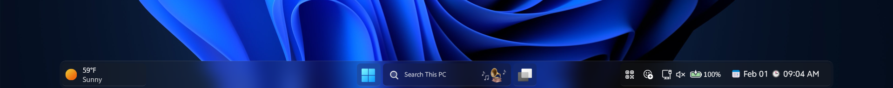
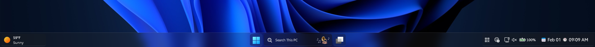
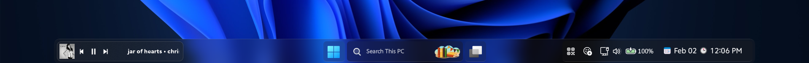

# Liquid Glass

### Requirements

* **Windhawk Mods**:
  * [Windows 11 Taskbar Styler](https://windhawk.net/mods/windows-11-taskbar-styler)
  * [Taskbar tray system icon tweaks](https://windhawk.net/mods/taskbar-tray-system-icon-tweaks) *(Optional)*
  * [Taskbar Clock Customization](https://windhawk.net/mods/taskbar-clock-customization) *(Optional)*
  * [Taskbar Music Lounge](https://github.com/Hashah2311/windhawk-mods/blob/main/mods/taskbar-music-lounge.wh.cpp) *(Optional)*

---


# LiquidGlass (Centered)


>[!NOTE]
> Version 4 or higher of the Taskbar Music Lounge mod for Windhawk to enable all features.  

## Theme selection

The theme is integrated into the mod and can simply be selected from the mod's
settings:

* Open the Windows 11 Taskbar Styler mod in Windhawk.
* Go to the "Settings" tab.
* Select the theme and save the settings.

## Manual installation

The theme styles can also be imported manually. To do that, follow these steps:

* Open the Windows 11 Taskbar Styler mod in Windhawk.
* Go to the "Advanced" tab.
* Copy the content below to the text box under "Mod settings" and click "Save".

<details>
<summary>Content to import (click to expand)</summary>

```json
{
"theme": "",
"controlStyles[0].target": "Taskbar.TaskbarFrame#TaskbarFrame",
"controlStyles[0].styles[0]": "CornerRadius=$CornerRadius",
"controlStyles[0].styles[1]": "HorizontalAlignment=Stretch",
"controlStyles[0].styles[2]": "MaxWidth=1330",
"controlStyles[0].styles[3]": "Width=Auto",
"controlStyles[1].target": "Taskbar.TaskbarFrame#TaskbarFrame > Grid#RootGrid",
"controlStyles[1].styles[0]": "BorderThickness=$BorderThickness",
"controlStyles[1].styles[1]": "BorderBrush:=$BorderBrush",
"controlStyles[1].styles[2]": "CornerRadius=$CornerRadius",
"controlStyles[1].styles[3]": "Background:=$Background",
"controlStyles[2].target": "Rectangle#BackgroundFill",
"controlStyles[2].styles[0]": "Visibility=1",
"controlStyles[3].target": "Rectangle#BackgroundStroke",
"controlStyles[3].styles[0]": "Visibility=1",
"controlStyles[4].target": "Taskbar.AugmentedEntryPointButton#AugmentedEntryPointButton > Taskbar.TaskListButtonPanel#ExperienceToggleButtonRootPanel",
"controlStyles[4].styles[0]": "Margin=-2,0",
"controlStyles[5].target": "Grid#SystemTrayFrameGrid",
"controlStyles[5].styles[0]": "Background:=$ElementBG",
"controlStyles[5].styles[1]": "BorderBrush:=$ElementBorderBrush",
"controlStyles[5].styles[2]": "BorderThickness=$ElementBorderThickness",
"controlStyles[5].styles[3]": "CornerRadius=$ElementCornerRadius",
"controlStyles[5].styles[4]": "Margin=4",
"controlStyles[5].styles[5]": "RenderTransform:=<TranslateTransform X=\"-304\" />",
"controlStyles[6].target": "SystemTray.ChevronIconView",
"controlStyles[6].styles[0]": "CornerRadius=$CornerRadius",
"controlStyles[7].target": "SystemTray.NotifyIconView#NotifyItemIcon",
"controlStyles[7].styles[0]": "CornerRadius=$ElementCornerRadius",
"controlStyles[8].target": "SystemTray.OmniButton",
"controlStyles[8].styles[0]": "CornerRadius=$ElementCornerRadius",
"controlStyles[9].target": "SystemTray.IconView#SystemTrayIcon > Grid#ContainerGrid > ContentPresenter#ContentPresenter > Grid#ContentGrid > SystemTray.TextIconContent > Grid#ContainerGrid",
"controlStyles[9].styles[0]": "CornerRadius=$ElementCornerRadius",
"controlStyles[10].target": "Taskbar.Gripper#GripperControl",
"controlStyles[10].styles[0]": "Width=Auto",
"controlStyles[10].styles[1]": "MinWidth=24",
"controlStyles[10].styles[2]": "HorizontalAlignment=Left",
"controlStyles[11].target": "TextBlock#TimeInnerTextBlock",
"controlStyles[11].styles[0]": "FontSize=13",
"controlStyles[11].styles[1]": "FontFamily=vivo Sans EN VF",
"controlStyles[11].styles[2]": "Margin=0",
"controlStyles[11].styles[3]": "Padding=0",
"controlStyles[11].styles[4]": "RenderTransform:=<TranslateTransform X=\"0\" Y=\"0\" />",
"controlStyles[12].target": "TextBlock#DateInnerTextBlock",
"controlStyles[12].styles[0]": "Visibility=1",
"controlStyles[13].target": "TextBlock#InnerTextBlock[Text=]",
"controlStyles[13].styles[0]": "Text=",
"controlStyles[14].target": "TextBlock#SearchBoxTextBlock",
"controlStyles[14].styles[0]": "Text=Search This PC",
"controlStyles[14].styles[1]": "FontSize=10",
"controlStyles[14].styles[2]": "FontFamily=vivo Sans EN VF",
"controlStyles[15].target": "SystemTray.OmniButton#NotificationCenterButton > Grid > ContentPresenter > ItemsPresenter > StackPanel > ContentPresenter > SystemTray.IconView#SystemTrayIcon > Grid > Grid > SystemTray.TextIconContent",
"controlStyles[15].styles[0]": "Visibility=1",
"controlStyles[16].target": "Border#OverflowFlyoutBackgroundBorder",
"controlStyles[16].styles[0]": "BorderThickness=$BorderThickness",
"controlStyles[16].styles[1]": "BorderBrush:=$BorderBrush",
"controlStyles[16].styles[2]": "Background:=$Background",
"controlStyles[16].styles[3]": "CornerRadius=$CornerRadius",
"controlStyles[17].target": "WindowsInternal.ComposableShell.Experiences.Switcher.AltTab > Grid#ModalRootGrid > Border",
"controlStyles[17].styles[0]": "BorderThickness=$BorderThickness",
"controlStyles[17].styles[1]": "BorderBrush:=$BorderBrush",
"controlStyles[17].styles[2]": "Background:=$Background",
"controlStyles[17].styles[3]": "CornerRadius=$CornerRadius",
"controlStyles[18].target": "WindowsInternal.ComposableShell.Experiences.Switcher.VirtualDesktopBarElement#VirtualDesktopBar",
"controlStyles[18].styles[0]": "CornerRadius=$CornerRadius",
"controlStyles[18].styles[1]": "Background:=$Background",
"controlStyles[19].target": "Border#BackgroundDimmingLayer",
"controlStyles[19].styles[0]": "Background:=$Background",
"controlStyles[19].styles[1]": "CornerRadius=$CornerRadius",
"controlStyles[20].target": "Taskbar.TaskListButtonPanel#ExperienceToggleButtonRootPanel > Border#BackgroundElement",
"controlStyles[20].styles[0]": "CornerRadius=$ElementCornerRadius",
"controlStyles[20].styles[1]": "BorderThickness=$ElementBorderThickness",
"controlStyles[21].target": "Taskbar.TaskListButton#TaskListButton",
"controlStyles[21].styles[0]": "CornerRadius=$ElementCornerRadius",
"controlStyles[21].styles[1]": "BorderThickness=$ElementBorderThickness",
"controlStyles[22].target": "Border#SnapBarBorder",
"controlStyles[22].styles[0]": "Background:=$Background",
"controlStyles[22].styles[1]": "BorderBrush:=$BorderBrush",
"controlStyles[22].styles[2]": "CornerRadius=$CornerRadius",
"controlStyles[22].styles[3]": "BorderThickness=$BorderThickness",
"controlStyles[22].styles[4]": "Margin=2",
"controlStyles[23].target": "Taskbar.TaskListLabeledButtonPanel@CommonStates > Border#BackgroundElement",
"controlStyles[23].styles[0]": "CornerRadius=$ElementCornerRadius",
"controlStyles[23].styles[1]": "BorderThickness=$ElementBorderThickness",
"controlStyles[23].styles[2]": "Background@ActiveNormal:=$ActiveBG",
"controlStyles[23].styles[3]": "Background@ActivePointerOver:=$ActiveBG",
"controlStyles[23].styles[4]": "Background@ActivePressed:=$ActiveBG",
"controlStyles[23].styles[5]": "Background@InactivePointerOver:=$ElementBG",
"controlStyles[23].styles[6]": "Background@InactivePressed:=$ElementBG",
"controlStyles[23].styles[7]": "BorderBrush@ActiveNormal:=$ElementBorderBrush",
"controlStyles[23].styles[8]": "BorderBrush@ActivePointerOver:=$ElementBorderBrush",
"controlStyles[23].styles[9]": "BorderBrush@ActivePressed:=$ElementBorderBrush",
"controlStyles[23].styles[10]": "BorderBrush@InactivePointerOver:=$ElementBorderBrush",
"controlStyles[23].styles[11]": "BorderBrush@InactivePressed:=$ElementBorderBrush",
"controlStyles[23].styles[12]": "Margin=1",
"controlStyles[24].target": "ContentPresenter#ContentPresenter@CommonStates",
"controlStyles[24].styles[0]": "CornerRadius=$ElementCornerRadius",
"controlStyles[24].styles[1]": "BorderThickness=$ElementBorderThickness",
"controlStyles[24].styles[2]": "Background@ActiveNormal:=$ActiveBG",
"controlStyles[24].styles[3]": "Background@ActivePointerOver:=$ActiveBG",
"controlStyles[24].styles[4]": "Background@ActivePressed:=$ActiveBG",
"controlStyles[24].styles[5]": "Background@InactivePointerOver:=$ElementBG",
"controlStyles[24].styles[6]": "Background@InactivePressed:=$ElementBG",
"controlStyles[24].styles[7]": "BorderBrush@ActiveNormal:=$ElementBorderBrush",
"controlStyles[24].styles[8]": "BorderBrush@ActivePointerOver:=$ElementBorderBrush",
"controlStyles[24].styles[9]": "BorderBrush@ActivePressed:=$ElementBorderBrush",
"controlStyles[24].styles[10]": "BorderBrush@InactivePointerOver:=$ElementBorderBrush",
"controlStyles[24].styles[11]": "BorderBrush@InactivePressed:=$ElementBorderBrush",
"controlStyles[24].styles[12]": "Margin=1",
"controlStyles[25].target": "Border#SnapPickerBorder",
"controlStyles[25].styles[0]": "Background:=$Background",
"controlStyles[25].styles[1]": "BorderBrush:=$BorderBrush",
"controlStyles[25].styles[2]": "CornerRadius=$CornerRadius",
"controlStyles[25].styles[3]": "BorderThickness=$BorderThickness",
"controlStyles[25].styles[4]": "Margin=2",
"controlStyles[26].target": "Taskbar.TaskListButtonPanel#ExperienceToggleButtonRootPanel",
"controlStyles[26].styles[0]": "Background:=Transparent",
"controlStyles[27].target": "ToolTip > ContentPresenter#LayoutRoot",
"controlStyles[27].styles[0]": "Background:=$Background",
"controlStyles[27].styles[1]": "BorderBrush:=$BorderBrush",
"controlStyles[27].styles[2]": "BorderThickness:=$BorderThickness",
"controlStyles[27].styles[3]": "CornerRadius=$CornerRadius",
"controlStyles[28].target": "WindowsInternal.ComposableShell.Experiences.Switcher.VirtualDesktopBarElement > Grid#GridElement > Border#VirtualDesktopSwitcherBackground",
"controlStyles[28].styles[0]": "BorderBrush:=$BorderBrush",
"controlStyles[28].styles[1]": "BorderThickness=$BorderThickness",
"controlStyles[28].styles[2]": "CornerRadius=$CornerRadius",
"controlStyles[28].styles[3]": "Background=$Background",
"controlStyles[29].target": "WindowsInternal.ComposableShell.Experiences.Switcher.SwitchItemListViewItem > Grid > Border",
"controlStyles[29].styles[0]": "CornerRadius=$ElementCornerRadius",
"controlStyles[30].target": "Border#VirtualDesktopBarBackground",
"controlStyles[30].styles[0]": "Background:=$Background",
"controlStyles[30].styles[1]": "BorderBrush:=$BorderBrush",
"controlStyles[30].styles[2]": "BorderThickness=$BorderThickness",
"controlStyles[30].styles[3]": "CornerRadius=$CornerRadius",
"controlStyles[31].target": "Taskbar.TaskListLabeledButtonPanel@CommonStates > Border#BackgroundElement",
"controlStyles[31].styles[0]": "Background:=$ElementBG",
"controlStyles[31].styles[1]": "BorderBrush:=$ElementBorderBrush",
"controlStyles[31].styles[2]": "BorderThickness=$ElementBorderThickness",
"controlStyles[31].styles[3]": "CornerRadius=$ElementCornerRadius",
"controlStyles[32].target": "Rectangle#RunningIndicator",
"controlStyles[32].styles[0]": "Visibility=1",
"controlStyles[33].target": "Rectangle#ShowDesktopPipe",
"controlStyles[33].styles[0]": "Visibility=1",
"controlStyles[34].target": "Rectangle#RightOverflowButtonDivider",
"controlStyles[34].styles[0]": "Visibility=1",
"controlStyles[35].target": "SearchUx.SearchUI.SearchIconButton > SearchUx.SearchUI.SearchButtonRootGrid@CommonStates > Border#BackgroundElement",
"controlStyles[35].styles[0]": "Background:=Transparent",
"controlStyles[35].styles[1]": "BorderBrush:=Transparent",
"controlStyles[36].target": "SearchUx.SearchUI.SearchButtonRootGrid",
"controlStyles[36].styles[0]": "Background:=Transparent",
"controlStyles[36].styles[1]": "BorderBrush:=Transparent",
"controlStyles[37].target": "Border#SearchPillBackgroundElement",
"controlStyles[37].styles[0]": "BorderBrush:=$ElementBorderBrush",
"controlStyles[37].styles[1]": "BorderThickness=$ElementBorderThickness",
"controlStyles[37].styles[2]": "CornerRadius=$ElementCornerRadius",
"controlStyles[37].styles[3]": "Margin=0,1",
"controlStyles[38].target": "SearchUx.SearchUI.SearchBoxButton > SearchUx.SearchUI.SearchButtonRootGrid@CommonStates > Border#BackgroundElement",
"controlStyles[38].styles[0]": "CornerRadius=$ElementCornerRadius",
"controlStyles[38].styles[1]": "BorderThickness=$ElementBorderThickness",
"controlStyles[38].styles[2]": "BorderBrush:=$ElementBorderBrush",
"controlStyles[38].styles[3]": "Background:=$ElementBG",
"controlStyles[38].styles[4]": "Margin=0,-4",
"controlStyles[39].target": "Canvas#HoverFlyoutCanvas > Grid#HoverFlyoutGrid > Border#HoverFlyoutBackground",
"controlStyles[39].styles[0]": "Shadow:=",
"controlStyles[39].styles[1]": "Background:=$Background",
"controlStyles[39].styles[2]": "BorderBrush:=$BorderBrush",
"controlStyles[39].styles[3]": "BorderThickness=$BorderThickness",
"controlStyles[39].styles[4]": "CornerRadius=$CornerRadius",
"controlStyles[40].target": "Border#BackgroundElement",
"controlStyles[40].styles[0]": "CornerRadius=$ElementCornerRadius",
"controlStyles[40].styles[1]": "BorderBrush:=$ElementBorderBrush",
"controlStyles[40].styles[2]": "BorderThickness=$ElementBorderThickness",
"controlStyles[40].styles[3]": "Background:=$ElementBG",
"controlStyles[41].target": "// Taskbar.ExperienceToggleButton#LaunchListButton[AutomationProperties.AutomationId=StartButton] > Taskbar.TaskListButtonPanel > Border#BackgroundElement",
"controlStyles[41].styles[0]": "BorderBrush:=$ElementBorderBrush",
"controlStyles[41].styles[1]": "BorderThickness=$ElementBorderThickness",
"controlStyles[41].styles[2]": "CornerRadius=$ElementCornerRadius",
"controlStyles[41].styles[3]": "Padding=18",
"controlStyles[41].styles[4]": "Background@Normal:=<ImageBrush Stretch=\"Uniform\" ImageSource=\"C:\\Resources\\Icons\\Start Orbs\\Windows Glass\\Normal.png\" />",
"controlStyles[41].styles[5]": "Background@PointerOver:=<ImageBrush Stretch=\"Uniform\" ImageSource=\"C:\\Resources\\Icons\\Start Orbs\\Windows Glass\\Hover.png\" />",
"controlStyles[41].styles[6]": "Background@Pressed:=<ImageBrush Stretch=\"Uniform\" ImageSource=\"C:\\Resources\\Icons\\Start Orbs\\Windows Glass\\Pressed.png\" />",
"controlStyles[41].styles[7]": "// This section is on hold until I have the correct images and have fleshed out the correct method to add them.",
"controlStyles[42].target": "// Taskbar.ExperienceToggleButton#LaunchListButton[AutomationProperties.AutomationId=StartButton] > Taskbar.TaskListButtonPanel > Microsoft.UI.Xaml.Controls.AnimatedVisualPlayer#Icon",
"controlStyles[42].styles[0]": "Visibility=1",
"controlStyles[42].styles[1]": "// This section is on hold until I have the correct images and have fleshed out the correct method to add them.",
"controlStyles[43].target": "SystemTray.SystemTrayFrame",
"controlStyles[43].styles[0]": "HorizontalAlignment=Right",
"controlStyles[44].target": "Grid#AugmentedEntryPointContentGrid",
"controlStyles[44].styles[0]": "HorizontalAlignment=Left",
"styleConstants[0]": "BorderThickness=0.3,1,0.3,0.3",
"styleConstants[1]": "ElementBorderThickness=0.3,0.3,0.3,1",
"styleConstants[2]": "Background=<WindhawkBlur BlurAmount=\"15\" TintColor=\"#25323232\" TintOpacity=\"0.2\" />",
"styleConstants[3]": "BorderBrush=<LinearGradientBrush StartPoint=\"0,0\" EndPoint=\"0,1\"><GradientStop Color=\"#50808080\" Offset=\"0.0\" /><GradientStop Color=\"#50404040\" Offset=\"0.25\" /><GradientStop Color=\"#50808080\" Offset=\"1\" /></LinearGradientBrush>",
"styleConstants[4]": "GlassBG=<AcrylicBrush TintColor=\"{ThemeResource SystemChromeAltHighColor}\" TintOpacity=\"0.3\" FallbackColor=\"{ThemeResource SystemChromeAltHighColor}\" />",
"styleConstants[5]": "GlassBorderBrush=<LinearGradientBrush StartPoint=\"0,0\" EndPoint=\"0,1\"><GradientStop Color=\"{ThemeResource SystemChromeHighColor}\" Offset=\"0.0\" /><GradientStop Color=\"{ThemeResource SystemChromeLowColor}\" Offset=\"0.25\" /><GradientStop Color=\"{ThemeResource SystemChromeHighColor}\" Offset=\"1\" /></LinearGradientBrush>",
"styleConstants[6]": "ElementBG=<WindhawkBlur BlurAmount=\"20\" TintColor=\"#202020\" TintOpacity=\"0.2\" />",
"styleConstants[7]": "ActiveBG=<WindhawkBlur BlurAmount=\"40\" TintColor=\"#FFFFFF\" TintOpacity=\"Opacity=\"0.8\" />",
"styleConstants[8]": "ElementBorderBrush=<LinearGradientBrush StartPoint=\"0,0\" EndPoint=\"0,1\"><GradientStop Color=\"#50808080\" Offset=\"1\" /><GradientStop Color=\"#50606060\" Offset=\"0.15\" /></LinearGradientBrush>",
"styleConstants[9]": "CornerRadius=10",
"styleConstants[10]": "ElementCornerRadius=6",
"resourceVariables[0].variableKey": "",
"resourceVariables[0].value": ""
}
```

</details>

---

# LiquidGlass (Centered High DPI)
This theme also includes a high dpi variant of the taskbar. *(Tested on 1920x1080 and 1920x1200 resolutions at 125% DPI)*



## Theme selection

The theme is integrated into the mod and can simply be selected from the mod's
settings:

* Open the Windows 11 Taskbar Styler mod in Windhawk.
* Go to the "Settings" tab.
* Select the theme and save the settings.

## Manual installation

The theme styles can also be imported manually. To do that, follow these steps:

* Open the Windows 11 Taskbar Styler mod in Windhawk.
* Go to the "Advanced" tab.
* Copy the content below to the text box under "Mod settings" and click "Save".

<details>
<summary>Content to import (click to expand)</summary>

```json
{
"theme": "",
"controlStyles[0].target": "Taskbar.TaskbarFrame#TaskbarFrame",
"controlStyles[0].styles[0]": "CornerRadius=$CornerRadius",
"controlStyles[0].styles[1]": "HorizontalAlignment=Stretch",
"controlStyles[0].styles[2]": "MaxWidth=1330",
"controlStyles[0].styles[3]": "Width=Auto",
"controlStyles[1].target": "Taskbar.TaskbarFrame#TaskbarFrame > Grid#RootGrid",
"controlStyles[1].styles[0]": "BorderThickness=$BorderThickness",
"controlStyles[1].styles[1]": "BorderBrush:=$BorderBrush",
"controlStyles[1].styles[2]": "CornerRadius=$CornerRadius",
"controlStyles[1].styles[3]": "Background:=$Background",
"controlStyles[2].target": "Rectangle#BackgroundFill",
"controlStyles[2].styles[0]": "Visibility=1",
"controlStyles[3].target": "Rectangle#BackgroundStroke",
"controlStyles[3].styles[0]": "Visibility=1",
"controlStyles[4].target": "Taskbar.AugmentedEntryPointButton#AugmentedEntryPointButton > Taskbar.TaskListButtonPanel#ExperienceToggleButtonRootPanel",
"controlStyles[4].styles[0]": "Margin=-2,0",
"controlStyles[5].target": "Grid#SystemTrayFrameGrid",
"controlStyles[5].styles[0]": "Background:=$ElementBG",
"controlStyles[5].styles[1]": "BorderBrush:=$ElementBorderBrush",
"controlStyles[5].styles[2]": "BorderThickness=$ElementBorderThickness",
"controlStyles[5].styles[3]": "CornerRadius=$ElementCornerRadius",
"controlStyles[5].styles[4]": "Margin=4",
"controlStyles[5].styles[5]": "RenderTransform:=<TranslateTransform X=\"-104\" />",
"controlStyles[6].target": "SystemTray.ChevronIconView",
"controlStyles[6].styles[0]": "CornerRadius=$CornerRadius",
"controlStyles[7].target": "SystemTray.NotifyIconView#NotifyItemIcon",
"controlStyles[7].styles[0]": "CornerRadius=$ElementCornerRadius",
"controlStyles[8].target": "SystemTray.OmniButton",
"controlStyles[8].styles[0]": "CornerRadius=$ElementCornerRadius",
"controlStyles[9].target": "SystemTray.IconView#SystemTrayIcon > Grid#ContainerGrid > ContentPresenter#ContentPresenter > Grid#ContentGrid > SystemTray.TextIconContent > Grid#ContainerGrid",
"controlStyles[9].styles[0]": "CornerRadius=$ElementCornerRadius",
"controlStyles[10].target": "Taskbar.Gripper#GripperControl",
"controlStyles[10].styles[0]": "Width=Auto",
"controlStyles[10].styles[1]": "MinWidth=24",
"controlStyles[10].styles[2]": "HorizontalAlignment=Left",
"controlStyles[11].target": "TextBlock#TimeInnerTextBlock",
"controlStyles[11].styles[0]": "FontSize=13",
"controlStyles[11].styles[1]": "FontFamily=vivo Sans EN VF",
"controlStyles[11].styles[2]": "Margin=0",
"controlStyles[11].styles[3]": "Padding=0",
"controlStyles[11].styles[4]": "RenderTransform:=<TranslateTransform X=\"0\" Y=\"0\" />",
"controlStyles[12].target": "TextBlock#DateInnerTextBlock",
"controlStyles[12].styles[0]": "Visibility=1",
"controlStyles[13].target": "TextBlock#InnerTextBlock[Text=]",
"controlStyles[13].styles[0]": "Text=",
"controlStyles[14].target": "TextBlock#SearchBoxTextBlock",
"controlStyles[14].styles[0]": "Text=Search This PC",
"controlStyles[14].styles[1]": "FontSize=10",
"controlStyles[14].styles[2]": "FontFamily=vivo Sans EN VF",
"controlStyles[15].target": "SystemTray.OmniButton#NotificationCenterButton > Grid > ContentPresenter > ItemsPresenter > StackPanel > ContentPresenter > SystemTray.IconView#SystemTrayIcon > Grid > Grid > SystemTray.TextIconContent",
"controlStyles[15].styles[0]": "Visibility=1",
"controlStyles[16].target": "Border#OverflowFlyoutBackgroundBorder",
"controlStyles[16].styles[0]": "BorderThickness=$BorderThickness",
"controlStyles[16].styles[1]": "BorderBrush:=$BorderBrush",
"controlStyles[16].styles[2]": "Background:=$Background",
"controlStyles[16].styles[3]": "CornerRadius=$CornerRadius",
"controlStyles[17].target": "WindowsInternal.ComposableShell.Experiences.Switcher.AltTab > Grid#ModalRootGrid > Border",
"controlStyles[17].styles[0]": "BorderThickness=$BorderThickness",
"controlStyles[17].styles[1]": "BorderBrush:=$BorderBrush",
"controlStyles[17].styles[2]": "Background:=$Background",
"controlStyles[17].styles[3]": "CornerRadius=$CornerRadius",
"controlStyles[18].target": "WindowsInternal.ComposableShell.Experiences.Switcher.VirtualDesktopBarElement#VirtualDesktopBar",
"controlStyles[18].styles[0]": "CornerRadius=$CornerRadius",
"controlStyles[18].styles[1]": "Background:=$Background",
"controlStyles[19].target": "Border#BackgroundDimmingLayer",
"controlStyles[19].styles[0]": "Background:=$Background",
"controlStyles[19].styles[1]": "CornerRadius=$CornerRadius",
"controlStyles[20].target": "Taskbar.TaskListButtonPanel#ExperienceToggleButtonRootPanel > Border#BackgroundElement",
"controlStyles[20].styles[0]": "CornerRadius=$ElementCornerRadius",
"controlStyles[20].styles[1]": "BorderThickness=$ElementBorderThickness",
"controlStyles[21].target": "Taskbar.TaskListButton#TaskListButton",
"controlStyles[21].styles[0]": "CornerRadius=$ElementCornerRadius",
"controlStyles[21].styles[1]": "BorderThickness=$ElementBorderThickness",
"controlStyles[22].target": "Border#SnapBarBorder",
"controlStyles[22].styles[0]": "Background:=$Background",
"controlStyles[22].styles[1]": "BorderBrush:=$BorderBrush",
"controlStyles[22].styles[2]": "CornerRadius=$CornerRadius",
"controlStyles[22].styles[3]": "BorderThickness=$BorderThickness",
"controlStyles[22].styles[4]": "Margin=2",
"controlStyles[23].target": "Taskbar.TaskListLabeledButtonPanel@CommonStates > Border#BackgroundElement",
"controlStyles[23].styles[0]": "CornerRadius=$ElementCornerRadius",
"controlStyles[23].styles[1]": "BorderThickness=$ElementBorderThickness",
"controlStyles[23].styles[2]": "Background@ActiveNormal:=$ActiveBG",
"controlStyles[23].styles[3]": "Background@ActivePointerOver:=$ActiveBG",
"controlStyles[23].styles[4]": "Background@ActivePressed:=$ActiveBG",
"controlStyles[23].styles[5]": "Background@InactivePointerOver:=$ElementBG",
"controlStyles[23].styles[6]": "Background@InactivePressed:=$ElementBG",
"controlStyles[23].styles[7]": "BorderBrush@ActiveNormal:=$ElementBorderBrush",
"controlStyles[23].styles[8]": "BorderBrush@ActivePointerOver:=$ElementBorderBrush",
"controlStyles[23].styles[9]": "BorderBrush@ActivePressed:=$ElementBorderBrush",
"controlStyles[23].styles[10]": "BorderBrush@InactivePointerOver:=$ElementBorderBrush",
"controlStyles[23].styles[11]": "BorderBrush@InactivePressed:=$ElementBorderBrush",
"controlStyles[23].styles[12]": "Margin=1",
"controlStyles[24].target": "ContentPresenter#ContentPresenter@CommonStates",
"controlStyles[24].styles[0]": "CornerRadius=$ElementCornerRadius",
"controlStyles[24].styles[1]": "BorderThickness=$ElementBorderThickness",
"controlStyles[24].styles[2]": "Background@ActiveNormal:=$ActiveBG",
"controlStyles[24].styles[3]": "Background@ActivePointerOver:=$ActiveBG",
"controlStyles[24].styles[4]": "Background@ActivePressed:=$ActiveBG",
"controlStyles[24].styles[5]": "Background@InactivePointerOver:=$ElementBG",
"controlStyles[24].styles[6]": "Background@InactivePressed:=$ElementBG",
"controlStyles[24].styles[7]": "BorderBrush@ActiveNormal:=$ElementBorderBrush",
"controlStyles[24].styles[8]": "BorderBrush@ActivePointerOver:=$ElementBorderBrush",
"controlStyles[24].styles[9]": "BorderBrush@ActivePressed:=$ElementBorderBrush",
"controlStyles[24].styles[10]": "BorderBrush@InactivePointerOver:=$ElementBorderBrush",
"controlStyles[24].styles[11]": "BorderBrush@InactivePressed:=$ElementBorderBrush",
"controlStyles[24].styles[12]": "Margin=1",
"controlStyles[25].target": "Border#SnapPickerBorder",
"controlStyles[25].styles[0]": "Background:=$Background",
"controlStyles[25].styles[1]": "BorderBrush:=$BorderBrush",
"controlStyles[25].styles[2]": "CornerRadius=$CornerRadius",
"controlStyles[25].styles[3]": "BorderThickness=$BorderThickness",
"controlStyles[25].styles[4]": "Margin=2",
"controlStyles[26].target": "Taskbar.TaskListButtonPanel#ExperienceToggleButtonRootPanel",
"controlStyles[26].styles[0]": "Background:=Transparent",
"controlStyles[27].target": "ToolTip > ContentPresenter#LayoutRoot",
"controlStyles[27].styles[0]": "Background:=$Background",
"controlStyles[27].styles[1]": "BorderBrush:=$BorderBrush",
"controlStyles[27].styles[2]": "BorderThickness:=$BorderThickness",
"controlStyles[27].styles[3]": "CornerRadius=$CornerRadius",
"controlStyles[28].target": "WindowsInternal.ComposableShell.Experiences.Switcher.VirtualDesktopBarElement > Grid#GridElement > Border#VirtualDesktopSwitcherBackground",
"controlStyles[28].styles[0]": "BorderBrush:=$BorderBrush",
"controlStyles[28].styles[1]": "BorderThickness=$BorderThickness",
"controlStyles[28].styles[2]": "CornerRadius=$CornerRadius",
"controlStyles[28].styles[3]": "Background=$Background",
"controlStyles[29].target": "WindowsInternal.ComposableShell.Experiences.Switcher.SwitchItemListViewItem > Grid > Border",
"controlStyles[29].styles[0]": "CornerRadius=$ElementCornerRadius",
"controlStyles[30].target": "Border#VirtualDesktopBarBackground",
"controlStyles[30].styles[0]": "Background:=$Background",
"controlStyles[30].styles[1]": "BorderBrush:=$BorderBrush",
"controlStyles[30].styles[2]": "BorderThickness=$BorderThickness",
"controlStyles[30].styles[3]": "CornerRadius=$CornerRadius",
"controlStyles[31].target": "Taskbar.TaskListLabeledButtonPanel@CommonStates > Border#BackgroundElement",
"controlStyles[31].styles[0]": "Background:=$ElementBG",
"controlStyles[31].styles[1]": "BorderBrush:=$ElementBorderBrush",
"controlStyles[31].styles[2]": "BorderThickness=$ElementBorderThickness",
"controlStyles[31].styles[3]": "CornerRadius=$ElementCornerRadius",
"controlStyles[32].target": "Rectangle#RunningIndicator",
"controlStyles[32].styles[0]": "Visibility=1",
"controlStyles[33].target": "Rectangle#ShowDesktopPipe",
"controlStyles[33].styles[0]": "Visibility=1",
"controlStyles[34].target": "Rectangle#RightOverflowButtonDivider",
"controlStyles[34].styles[0]": "Visibility=1",
"controlStyles[35].target": "SearchUx.SearchUI.SearchIconButton > SearchUx.SearchUI.SearchButtonRootGrid@CommonStates > Border#BackgroundElement",
"controlStyles[35].styles[0]": "Background:=Transparent",
"controlStyles[35].styles[1]": "BorderBrush:=Transparent",
"controlStyles[36].target": "SearchUx.SearchUI.SearchButtonRootGrid",
"controlStyles[36].styles[0]": "Background:=Transparent",
"controlStyles[36].styles[1]": "BorderBrush:=Transparent",
"controlStyles[37].target": "Border#SearchPillBackgroundElement",
"controlStyles[37].styles[0]": "BorderBrush:=$ElementBorderBrush",
"controlStyles[37].styles[1]": "BorderThickness=$ElementBorderThickness",
"controlStyles[37].styles[2]": "CornerRadius=$ElementCornerRadius",
"controlStyles[37].styles[3]": "Margin=0,1",
"controlStyles[38].target": "SearchUx.SearchUI.SearchBoxButton > SearchUx.SearchUI.SearchButtonRootGrid@CommonStates > Border#BackgroundElement",
"controlStyles[38].styles[0]": "CornerRadius=$ElementCornerRadius",
"controlStyles[38].styles[1]": "BorderThickness=$ElementBorderThickness",
"controlStyles[38].styles[2]": "BorderBrush:=$ElementBorderBrush",
"controlStyles[38].styles[3]": "Background:=$ElementBG",
"controlStyles[38].styles[4]": "Margin=0,-4",
"controlStyles[39].target": "Canvas#HoverFlyoutCanvas > Grid#HoverFlyoutGrid > Border#HoverFlyoutBackground",
"controlStyles[39].styles[0]": "Shadow:=",
"controlStyles[39].styles[1]": "Background:=$Background",
"controlStyles[39].styles[2]": "BorderBrush:=$BorderBrush",
"controlStyles[39].styles[3]": "BorderThickness=$BorderThickness",
"controlStyles[39].styles[4]": "CornerRadius=$CornerRadius",
"controlStyles[40].target": "Border#BackgroundElement",
"controlStyles[40].styles[0]": "CornerRadius=$ElementCornerRadius",
"controlStyles[40].styles[1]": "BorderBrush:=$ElementBorderBrush",
"controlStyles[40].styles[2]": "BorderThickness=$ElementBorderThickness",
"controlStyles[40].styles[3]": "Background:=$ElementBG",
"controlStyles[41].target": "// Taskbar.ExperienceToggleButton#LaunchListButton[AutomationProperties.AutomationId=StartButton] > Taskbar.TaskListButtonPanel > Border#BackgroundElement",
"controlStyles[41].styles[0]": "BorderBrush:=$ElementBorderBrush",
"controlStyles[41].styles[1]": "BorderThickness=$ElementBorderThickness",
"controlStyles[41].styles[2]": "CornerRadius=$ElementCornerRadius",
"controlStyles[41].styles[3]": "Padding=18",
"controlStyles[41].styles[4]": "Background@Normal:=<ImageBrush Stretch=\"Uniform\" ImageSource=\"C:\\Resources\\Icons\\Start Orbs\\Windows Glass\\Normal.png\" />",
"controlStyles[41].styles[5]": "Background@PointerOver:=<ImageBrush Stretch=\"Uniform\" ImageSource=\"C:\\Resources\\Icons\\Start Orbs\\Windows Glass\\Hover.png\" />",
"controlStyles[41].styles[6]": "Background@Pressed:=<ImageBrush Stretch=\"Uniform\" ImageSource=\"C:\\Resources\\Icons\\Start Orbs\\Windows Glass\\Pressed.png\" />",
"controlStyles[41].styles[7]": "// This section is on hold until I have the correct images and have fleshed out the correct method to add them.",
"controlStyles[42].target": "// Taskbar.ExperienceToggleButton#LaunchListButton[AutomationProperties.AutomationId=StartButton] > Taskbar.TaskListButtonPanel > Microsoft.UI.Xaml.Controls.AnimatedVisualPlayer#Icon",
"controlStyles[42].styles[0]": "Visibility=1",
"controlStyles[42].styles[1]": "// This section is on hold until I have the correct images and have fleshed out the correct method to add them.",
"controlStyles[43].target": "SystemTray.SystemTrayFrame",
"controlStyles[43].styles[0]": "HorizontalAlignment=Right",
"controlStyles[44].target": "Grid#AugmentedEntryPointContentGrid",
"controlStyles[44].styles[0]": "HorizontalAlignment=Left",
"styleConstants[0]": "BorderThickness=0.3,1,0.3,0.3",
"styleConstants[1]": "ElementBorderThickness=0.3,0.3,0.3,1",
"styleConstants[2]": "Background=<WindhawkBlur BlurAmount=\"15\" TintColor=\"#25323232\" TintOpacity=\"0.2\" />",
"styleConstants[3]": "BorderBrush=<LinearGradientBrush StartPoint=\"0,0\" EndPoint=\"0,1\"><GradientStop Color=\"#50808080\" Offset=\"0.0\" /><GradientStop Color=\"#50404040\" Offset=\"0.25\" /><GradientStop Color=\"#50808080\" Offset=\"1\" /></LinearGradientBrush>",
"styleConstants[4]": "GlassBG=<AcrylicBrush TintColor=\"{ThemeResource SystemChromeAltHighColor}\" TintOpacity=\"0.3\" FallbackColor=\"{ThemeResource SystemChromeAltHighColor}\" />",
"styleConstants[5]": "GlassBorderBrush=<LinearGradientBrush StartPoint=\"0,0\" EndPoint=\"0,1\"><GradientStop Color=\"{ThemeResource SystemChromeHighColor}\" Offset=\"0.0\" /><GradientStop Color=\"{ThemeResource SystemChromeLowColor}\" Offset=\"0.25\" /><GradientStop Color=\"{ThemeResource SystemChromeHighColor}\" Offset=\"1\" /></LinearGradientBrush>",
"styleConstants[6]": "ElementBG=<WindhawkBlur BlurAmount=\"20\" TintColor=\"#202020\" TintOpacity=\"0.2\" />",
"styleConstants[7]": "ActiveBG=<WindhawkBlur BlurAmount=\"40\" TintColor=\"#FFFFFF\" TintOpacity=\"Opacity=\"0.8\" />",
"styleConstants[8]": "ElementBorderBrush=<LinearGradientBrush StartPoint=\"0,0\" EndPoint=\"0,1\"><GradientStop Color=\"#50808080\" Offset=\"1\" /><GradientStop Color=\"#50606060\" Offset=\"0.15\" /></LinearGradientBrush>",
"styleConstants[9]": "CornerRadius=10",
"styleConstants[10]": "ElementCornerRadius=6",
"resourceVariables[0].variableKey": "",
"resourceVariables[0].value": ""
}
```

</details>

---

# Liquid Glass (Full Width)
This theme also includes a full width variant.



## Theme selection

The theme is integrated into the mod and can simply be selected from the mod's
settings:

* Open the Windows 11 Taskbar Styler mod in Windhawk.
* Go to the "Settings" tab.
* Select the theme and save the settings.

## Manual installation

The theme styles can also be imported manually. To do that, follow these steps:

* Open the Windows 11 Taskbar Styler mod in Windhawk.
* Go to the "Advanced" tab.
* Copy the content below to the text box under "Mod settings" and click "Save".

<details>
<summary>Content to import (click to expand)</summary>

```json
{
"theme": "",
"controlStyles[0].target": "Taskbar.TaskbarFrame#TaskbarFrame > Grid#RootGrid",
"controlStyles[0].styles[0]": "BorderThickness=$BorderThickness",
"controlStyles[0].styles[1]": "BorderBrush:=$BorderBrush",
"controlStyles[0].styles[2]": "Background:=$Background",
"controlStyles[1].target": "Rectangle#BackgroundFill",
"controlStyles[1].styles[0]": "Visibility=1",
"controlStyles[2].target": "Rectangle#BackgroundStroke",
"controlStyles[2].styles[0]": "Visibility=1",
"controlStyles[3].target": "Taskbar.AugmentedEntryPointButton#AugmentedEntryPointButton > Taskbar.TaskListButtonPanel#ExperienceToggleButtonRootPanel",
"controlStyles[3].styles[0]": "Margin=-2,0",
"controlStyles[4].target": "Grid#SystemTrayFrameGrid",
"controlStyles[4].styles[0]": "Background:=$ElementBG",
"controlStyles[4].styles[1]": "BorderBrush:=$ElementBorderBrush",
"controlStyles[4].styles[2]": "BorderThickness=$ElementBorderThickness",
"controlStyles[4].styles[3]": "CornerRadius=$ElementCornerRadius",
"controlStyles[4].styles[4]": "Margin=4",
"controlStyles[5].target": "SystemTray.ChevronIconView",
"controlStyles[5].styles[0]": "CornerRadius=$CornerRadius",
"controlStyles[6].target": "SystemTray.NotifyIconView#NotifyItemIcon",
"controlStyles[6].styles[0]": "CornerRadius=$ElementCornerRadius",
"controlStyles[7].target": "SystemTray.OmniButton",
"controlStyles[7].styles[0]": "CornerRadius=$ElementCornerRadius",
"controlStyles[8].target": "SystemTray.IconView#SystemTrayIcon > Grid#ContainerGrid > ContentPresenter#ContentPresenter > Grid#ContentGrid > SystemTray.TextIconContent > Grid#ContainerGrid",
"controlStyles[8].styles[0]": "CornerRadius=$ElementCornerRadius",
"controlStyles[9].target": "Taskbar.Gripper#GripperControl",
"controlStyles[9].styles[0]": "Width=Auto",
"controlStyles[9].styles[1]": "MinWidth=24",
"controlStyles[9].styles[2]": "HorizontalAlignment=Left",
"controlStyles[10].target": "TextBlock#TimeInnerTextBlock",
"controlStyles[10].styles[0]": "FontSize=13",
"controlStyles[10].styles[1]": "FontFamily=vivo Sans EN VF",
"controlStyles[10].styles[2]": "Margin=0",
"controlStyles[10].styles[3]": "Padding=0",
"controlStyles[10].styles[4]": "RenderTransform:=<TranslateTransform X=\"0\" Y=\"0\" />",
"controlStyles[11].target": "TextBlock#DateInnerTextBlock",
"controlStyles[11].styles[0]": "Visibility=1",
"controlStyles[12].target": "TextBlock#InnerTextBlock[Text=]",
"controlStyles[12].styles[0]": "Text=",
"controlStyles[13].target": "TextBlock#SearchBoxTextBlock",
"controlStyles[13].styles[0]": "Text=Search This PC",
"controlStyles[13].styles[1]": "FontSize=10",
"controlStyles[13].styles[2]": "FontFamily=vivo Sans EN VF",
"controlStyles[14].target": "SystemTray.OmniButton#NotificationCenterButton > Grid > ContentPresenter > ItemsPresenter > StackPanel > ContentPresenter > SystemTray.IconView#SystemTrayIcon > Grid > Grid > SystemTray.TextIconContent",
"controlStyles[14].styles[0]": "Visibility=1",
"controlStyles[15].target": "Border#OverflowFlyoutBackgroundBorder",
"controlStyles[15].styles[0]": "BorderThickness=$BorderThickness",
"controlStyles[15].styles[1]": "BorderBrush:=$BorderBrush",
"controlStyles[15].styles[2]": "Background:=$Background",
"controlStyles[15].styles[3]": "CornerRadius=$CornerRadius",
"controlStyles[16].target": "WindowsInternal.ComposableShell.Experiences.Switcher.AltTab > Grid#ModalRootGrid > Border",
"controlStyles[16].styles[0]": "BorderThickness=$BorderThickness",
"controlStyles[16].styles[1]": "BorderBrush:=$BorderBrush",
"controlStyles[16].styles[2]": "Background:=$Background",
"controlStyles[16].styles[3]": "CornerRadius=$CornerRadius",
"controlStyles[17].target": "WindowsInternal.ComposableShell.Experiences.Switcher.VirtualDesktopBarElement#VirtualDesktopBar",
"controlStyles[17].styles[0]": "CornerRadius=$CornerRadius",
"controlStyles[17].styles[1]": "Background:=$Background",
"controlStyles[18].target": "Border#BackgroundDimmingLayer",
"controlStyles[18].styles[0]": "Background:=$Background",
"controlStyles[18].styles[1]": "CornerRadius=$CornerRadius",
"controlStyles[19].target": "Taskbar.TaskListButtonPanel#ExperienceToggleButtonRootPanel > Border#BackgroundElement",
"controlStyles[19].styles[0]": "CornerRadius=$ElementCornerRadius",
"controlStyles[19].styles[1]": "BorderThickness=$ElementBorderThickness",
"controlStyles[20].target": "Taskbar.TaskListButton#TaskListButton",
"controlStyles[20].styles[0]": "CornerRadius=$ElementCornerRadius",
"controlStyles[20].styles[1]": "BorderThickness=$ElementBorderThickness",
"controlStyles[21].target": "Border#SnapBarBorder",
"controlStyles[21].styles[0]": "Background:=$Background",
"controlStyles[21].styles[1]": "BorderBrush:=$BorderBrush",
"controlStyles[21].styles[2]": "CornerRadius=$CornerRadius",
"controlStyles[21].styles[3]": "BorderThickness=$BorderThickness",
"controlStyles[21].styles[4]": "Margin=2",
"controlStyles[22].target": "Taskbar.TaskListLabeledButtonPanel@CommonStates > Border#BackgroundElement",
"controlStyles[22].styles[0]": "CornerRadius=$ElementCornerRadius",
"controlStyles[22].styles[1]": "BorderThickness=$ElementBorderThickness",
"controlStyles[22].styles[2]": "Background@ActiveNormal:=$ActiveBG",
"controlStyles[22].styles[3]": "Background@ActivePointerOver:=$ActiveBG",
"controlStyles[22].styles[4]": "Background@ActivePressed:=$ActiveBG",
"controlStyles[22].styles[5]": "Background@InactivePointerOver:=$ElementBG",
"controlStyles[22].styles[6]": "Background@InactivePressed:=$ElementBG",
"controlStyles[22].styles[7]": "BorderBrush@ActiveNormal:=$ElementBorderBrush",
"controlStyles[22].styles[8]": "BorderBrush@ActivePointerOver:=$ElementBorderBrush",
"controlStyles[22].styles[9]": "BorderBrush@ActivePressed:=$ElementBorderBrush",
"controlStyles[22].styles[10]": "BorderBrush@InactivePointerOver:=$ElementBorderBrush",
"controlStyles[22].styles[11]": "BorderBrush@InactivePressed:=$ElementBorderBrush",
"controlStyles[22].styles[12]": "Margin=1",
"controlStyles[23].target": "ContentPresenter#ContentPresenter@CommonStates",
"controlStyles[23].styles[0]": "CornerRadius=$ElementCornerRadius",
"controlStyles[23].styles[1]": "BorderThickness=$ElementBorderThickness",
"controlStyles[23].styles[2]": "Background@ActiveNormal:=$ActiveBG",
"controlStyles[23].styles[3]": "Background@ActivePointerOver:=$ActiveBG",
"controlStyles[23].styles[4]": "Background@ActivePressed:=$ActiveBG",
"controlStyles[23].styles[5]": "Background@InactivePointerOver:=$ElementBG",
"controlStyles[23].styles[6]": "Background@InactivePressed:=$ElementBG",
"controlStyles[23].styles[7]": "BorderBrush@ActiveNormal:=$ElementBorderBrush",
"controlStyles[23].styles[8]": "BorderBrush@ActivePointerOver:=$ElementBorderBrush",
"controlStyles[23].styles[9]": "BorderBrush@ActivePressed:=$ElementBorderBrush",
"controlStyles[23].styles[10]": "BorderBrush@InactivePointerOver:=$ElementBorderBrush",
"controlStyles[23].styles[11]": "BorderBrush@InactivePressed:=$ElementBorderBrush",
"controlStyles[23].styles[12]": "Margin=1",
"controlStyles[24].target": "Border#SnapPickerBorder",
"controlStyles[24].styles[0]": "Background:=$Background",
"controlStyles[24].styles[1]": "BorderBrush:=$BorderBrush",
"controlStyles[24].styles[2]": "CornerRadius=$CornerRadius",
"controlStyles[24].styles[3]": "BorderThickness=$BorderThickness",
"controlStyles[24].styles[4]": "Margin=2",
"controlStyles[25].target": "Taskbar.TaskListButtonPanel#ExperienceToggleButtonRootPanel",
"controlStyles[25].styles[0]": "Background:=Transparent",
"controlStyles[26].target": "ToolTip > ContentPresenter#LayoutRoot",
"controlStyles[26].styles[0]": "Background:=$Background",
"controlStyles[26].styles[1]": "BorderBrush:=$BorderBrush",
"controlStyles[26].styles[2]": "BorderThickness:=$BorderThickness",
"controlStyles[26].styles[3]": "CornerRadius=$CornerRadius",
"controlStyles[27].target": "WindowsInternal.ComposableShell.Experiences.Switcher.VirtualDesktopBarElement > Grid#GridElement > Border#VirtualDesktopSwitcherBackground",
"controlStyles[27].styles[0]": "BorderBrush:=$BorderBrush",
"controlStyles[27].styles[1]": "BorderThickness=$BorderThickness",
"controlStyles[27].styles[2]": "CornerRadius=$CornerRadius",
"controlStyles[27].styles[3]": "Background=$Background",
"controlStyles[28].target": "WindowsInternal.ComposableShell.Experiences.Switcher.SwitchItemListViewItem > Grid > Border",
"controlStyles[28].styles[0]": "CornerRadius=$ElementCornerRadius",
"controlStyles[29].target": "Border#VirtualDesktopBarBackground",
"controlStyles[29].styles[0]": "Background:=$Background",
"controlStyles[29].styles[1]": "BorderBrush:=$BorderBrush",
"controlStyles[29].styles[2]": "BorderThickness=$BorderThickness",
"controlStyles[29].styles[3]": "CornerRadius=$CornerRadius",
"controlStyles[30].target": "Taskbar.TaskListLabeledButtonPanel@CommonStates > Border#BackgroundElement",
"controlStyles[30].styles[0]": "Background:=$ElementBG",
"controlStyles[30].styles[1]": "BorderBrush:=$ElementBorderBrush",
"controlStyles[30].styles[2]": "BorderThickness=$ElementBorderThickness",
"controlStyles[30].styles[3]": "CornerRadius=$ElementCornerRadius",
"controlStyles[31].target": "Rectangle#RunningIndicator",
"controlStyles[31].styles[0]": "Visibility=1",
"controlStyles[32].target": "Rectangle#ShowDesktopPipe",
"controlStyles[32].styles[0]": "Visibility=1",
"controlStyles[33].target": "Rectangle#RightOverflowButtonDivider",
"controlStyles[33].styles[0]": "Visibility=1",
"controlStyles[34].target": "SearchUx.SearchUI.SearchIconButton > SearchUx.SearchUI.SearchButtonRootGrid@CommonStates > Border#BackgroundElement",
"controlStyles[34].styles[0]": "Background:=Transparent",
"controlStyles[34].styles[1]": "BorderBrush:=Transparent",
"controlStyles[35].target": "SearchUx.SearchUI.SearchButtonRootGrid",
"controlStyles[35].styles[0]": "Background:=Transparent",
"controlStyles[35].styles[1]": "BorderBrush:=Transparent",
"controlStyles[36].target": "Border#SearchPillBackgroundElement",
"controlStyles[36].styles[0]": "BorderBrush:=$ElementBorderBrush",
"controlStyles[36].styles[1]": "BorderThickness=$ElementBorderThickness",
"controlStyles[36].styles[2]": "CornerRadius=$ElementCornerRadius",
"controlStyles[36].styles[3]": "Margin=0,1",
"controlStyles[37].target": "SearchUx.SearchUI.SearchBoxButton > SearchUx.SearchUI.SearchButtonRootGrid@CommonStates > Border#BackgroundElement",
"controlStyles[37].styles[0]": "CornerRadius=$ElementCornerRadius",
"controlStyles[37].styles[1]": "BorderThickness=$ElementBorderThickness",
"controlStyles[37].styles[2]": "BorderBrush:=$ElementBorderBrush",
"controlStyles[37].styles[3]": "Background:=$ElementBG",
"controlStyles[37].styles[4]": "Margin=0,-4",
"controlStyles[38].target": "Canvas#HoverFlyoutCanvas > Grid#HoverFlyoutGrid > Border#HoverFlyoutBackground",
"controlStyles[38].styles[0]": "Shadow:=",
"controlStyles[38].styles[1]": "Background:=$Background",
"controlStyles[38].styles[2]": "BorderBrush:=$BorderBrush",
"controlStyles[38].styles[3]": "BorderThickness=$BorderThickness",
"controlStyles[38].styles[4]": "CornerRadius=$CornerRadius",
"controlStyles[39].target": "Border#BackgroundElement",
"controlStyles[39].styles[0]": "CornerRadius=$ElementCornerRadius",
"controlStyles[39].styles[1]": "BorderBrush:=$ElementBorderBrush",
"controlStyles[39].styles[2]": "BorderThickness=$ElementBorderThickness",
"controlStyles[39].styles[3]": "Background:=$ElementBG",
"controlStyles[40].target": "// Taskbar.ExperienceToggleButton#LaunchListButton[AutomationProperties.AutomationId=StartButton] > Taskbar.TaskListButtonPanel > Border#BackgroundElement",
"controlStyles[40].styles[0]": "BorderBrush:=$ElementBorderBrush",
"controlStyles[40].styles[1]": "BorderThickness=$ElementBorderThickness",
"controlStyles[40].styles[2]": "CornerRadius=$ElementCornerRadius",
"controlStyles[40].styles[3]": "Padding=18",
"controlStyles[40].styles[4]": "Background@Normal:=<ImageBrush Stretch=\"Uniform\" ImageSource=\"C:\\Resources\\Icons\\Start Orbs\\Windows Glass\\Normal.png\" />",
"controlStyles[40].styles[5]": "Background@PointerOver:=<ImageBrush Stretch=\"Uniform\" ImageSource=\"C:\\Resources\\Icons\\Start Orbs\\Windows Glass\\Hover.png\" />",
"controlStyles[40].styles[6]": "Background@Pressed:=<ImageBrush Stretch=\"Uniform\" ImageSource=\"C:\\Resources\\Icons\\Start Orbs\\Windows Glass\\Pressed.png\" />",
"controlStyles[40].styles[7]": "// This section is on hold until I have the correct images and have fleshed out the correct method to add them.",
"controlStyles[41].target": "// Taskbar.ExperienceToggleButton#LaunchListButton[AutomationProperties.AutomationId=StartButton] > Taskbar.TaskListButtonPanel > Microsoft.UI.Xaml.Controls.AnimatedVisualPlayer#Icon",
"controlStyles[41].styles[0]": "Visibility=1",
"controlStyles[41].styles[1]": "// This section is on hold until I have the correct images and have fleshed out the correct method to add them.",
"styleConstants[0]": "BorderThickness=0.3,1,0.3,0.3",
"styleConstants[1]": "ElementBorderThickness=0.3,0.3,0.3,1",
"styleConstants[2]": "Background=<WindhawkBlur BlurAmount=\"15\" TintColor=\"#25323232\" TintOpacity=\"0.2\" />",
"styleConstants[3]": "BorderBrush=<LinearGradientBrush StartPoint=\"0,0\" EndPoint=\"0,1\"><GradientStop Color=\"#50808080\" Offset=\"0.0\" /><GradientStop Color=\"#50404040\" Offset=\"0.25\" /><GradientStop Color=\"#50808080\" Offset=\"1\" /></LinearGradientBrush>",
"styleConstants[4]": "GlassBG=<AcrylicBrush TintColor=\"{ThemeResource SystemChromeAltHighColor}\" TintOpacity=\"0.3\" FallbackColor=\"{ThemeResource SystemChromeAltHighColor}\" />",
"styleConstants[5]": "GlassBorderBrush=<LinearGradientBrush StartPoint=\"0,0\" EndPoint=\"0,1\"><GradientStop Color=\"{ThemeResource SystemChromeHighColor}\" Offset=\"0.0\" /><GradientStop Color=\"{ThemeResource SystemChromeLowColor}\" Offset=\"0.25\" /><GradientStop Color=\"{ThemeResource SystemChromeHighColor}\" Offset=\"1\" /></LinearGradientBrush>",
"styleConstants[6]": "ElementBG=<WindhawkBlur BlurAmount=\"20\" TintColor=\"#202020\" TintOpacity=\"0.2\" />",
"styleConstants[7]": "ActiveBG=<WindhawkBlur BlurAmount=\"40\" TintColor=\"#FFFFFF\" TintOpacity=\"Opacity=\"0.8\" />",
"styleConstants[8]": "ElementBorderBrush=<LinearGradientBrush StartPoint=\"0,0\" EndPoint=\"0,1\"><GradientStop Color=\"#50808080\" Offset=\"1\" /><GradientStop Color=\"#50606060\" Offset=\"0.15\" /></LinearGradientBrush>",
"styleConstants[9]": "CornerRadius=10",
"styleConstants[10]": "ElementCornerRadius=6",
"resourceVariables[0].variableKey": "",
"resourceVariables[0].value": ""
}
```

</details>

---

# Taskbar Clock Customization (Optional)

* Open the Taskbar Clock Customization mod in Windhawk.
* Go to the "Settings" tab.
* Select the theme and save the settings.

<details>
<summary>Content to import (click to expand)</summary>

```json
{
"ShowSeconds": 0,
"TimeFormat": "hh':'mm tt",
"DateFormat": "MMM dd",
"WeekdayFormat": "dddd",
"WeekdayFormatCustom": "Sun, Mon, Tue, Wed, Thu, Fri, Sat",
"TopLine": "📅 %date% 🕒 %time%",
"BottomLine": "%web1%",
"MiddleLine": "%weekday%",
"TooltipLine": "%web1_full%%n%%n%%media_status% %media_artist% - %media_title%",
"TooltipLineMode": "append",
"Width": 180,
"Height": 60,
"MaxWidth": 0,
"TextSpacing": 0,
"DataCollection.NetworkMetricsFormat": "mbsDynamic",
"DataCollection.NetworkMetricsFixedDecimals": -1,
"DataCollection.PercentageFormat": "spacePaddingAndSymbol",
"DataCollection.UpdateInterval": 1,
"DataCollection.NetworkAdapterName": "",
"DataCollection.GpuAdapterName": "",
"MediaPlayer.IgnoredPlayers[0]": "",
"MediaPlayer.MaxLength": 28,
"MediaPlayer.NoMediaText": "No media",
"MediaPlayer.RemoveBrackets": 1,
"WebContentWeatherLocation": "",
"WebContentWeatherFormat": "%c 🌡️%t 🌬️%w",
"WebContentWeatherUnits": "autoDetect",
"WebContentsItems[0].Url": "https://rss.nytimes.com/services/xml/rss/nyt/World.xml",
"WebContentsItems[0].BlockStart": "<item>",
"WebContentsItems[0].Start": "<title>",
"WebContentsItems[0].End": "</title>",
"WebContentsItems[0].ContentMode": "xmlHtml",
"WebContentsItems[0].SearchReplace[0].Search": "",
"WebContentsItems[0].SearchReplace[0].Replace": "",
"WebContentsItems[0].MaxLength": 28,
"WebContentsUpdateInterval": 10,
"TimeZones[0]": "",
"TimeStyle.Hidden": 0,
"TimeStyle.TextColor": "",
"TimeStyle.TextAlignment": "Center",
"TimeStyle.FontSize": 0,
"TimeStyle.FontFamily": "",
"TimeStyle.FontWeight": "",
"TimeStyle.FontStyle": "",
"TimeStyle.FontStretch": "",
"TimeStyle.CharacterSpacing": 0,
"DateStyle.Hidden": 0,
"DateStyle.TextColor": "",
"DateStyle.TextAlignment": "Center",
"DateStyle.FontSize": 0,
"DateStyle.FontFamily": "",
"DateStyle.FontWeight": "",
"DateStyle.FontStyle": "",
"DateStyle.FontStretch": "",
"DateStyle.CharacterSpacing": 0,
"oldTaskbarOnWin11": 0
}
```

</details>

---

### Taskbar tray system icon tweaks (Optional)

* Open the Taskbar tray system icon tweaks mod in Windhawk.
* Go to the "Settings" tab.
* Select the theme and save the settings.

<details>
<summary>Content to import (click to expand)</summary>

```json
{
"hideVolumeIcon": 0,
"hideNetworkIcon": 0,
"hideBatteryIcon": 0,
"hideMicrophoneIcon": 0,
"hideGeolocationIcon": 1,
"hideStudioEffectsIcon": 1,
"hideLanguageBar": 1,
"hideLanguageSupplementaryIcons": 1,
"hideBellIcon": "whenInactiveAndNoDnd",
"showDesktopButtonWidth": 12
}
```

</details>

---

### Taskbar Music Lounge (Optional)
Optional feature to add a native music player widget to the taskbar. Replaces the taskbar widgets pane.  




## Centered Taskbar

* Disable Widgets in your system Taskbar settings and set your Taskbar alignment to Center.
* Open the Taskbar Music Lounge mod in Windhawk.
* Go to the "Settings" tab.
* Select the theme and save the settings.

<details>
<summary>Content to import (click to expand)</summary>

```json
{
  "PanelWidth": 300,
  "PanelHeight": 38,
  "FontSize": 14,
  "ButtonScale": 1,
  "HideFullscreen": 1,
  "IdleTimeout": 0,
  "OffsetX": 302,
  "OffsetY": 0,
  "AutoTheme": 1,
  "TextColor": 16777215,
  "BgOpacity": 0
}
```

</details>

## Centered High DPI Taskbar

* Disable Widgets in your system Taskbar settings and set your Taskbar alignment to Center.
* Open the Taskbar Music Lounge mod in Windhawk.
* Go to the "Settings" tab.
* Select the theme and save the settings.

<details>
<summary>Content to import (click to expand)</summary>

```json
{
  "PanelWidth": 300,
  "PanelHeight": 48,
  "FontSize": 14,
  "ButtonScale": 1,
  "HideFullscreen": 1,
  "IdleTimeout": 0,
  "OffsetX": 138,
  "OffsetY": 0,
  "AutoTheme": 1,
  "TextColor": 16777215,
  "BgOpacity": 0
}
```

</details>


## Full Width Taskbar

* Disable Widgets in your system Taskbar settings and set your Taskbar alignment to Center.
* Open the Taskbar Music Lounge mod in Windhawk.
* Go to the "Settings" tab.
* Select the theme and save the settings.

<details>
<summary>Content to import (click to expand)</summary>

```json
{
  "PanelWidth": 300,
  "PanelHeight": 38,
  "FontSize": 14,
  "ButtonScale": 1,
  "HideFullscreen": 1,
  "IdleTimeout": 0,
  "OffsetX": 5,
  "OffsetY": 0,
  "AutoTheme": 1,
  "TextColor": 16777215,
  "BgOpacity": 0
}
```

</details>


