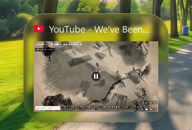
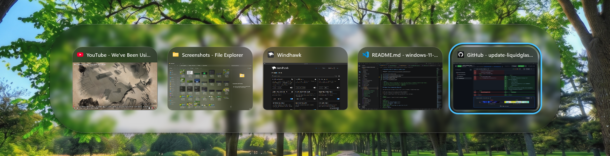
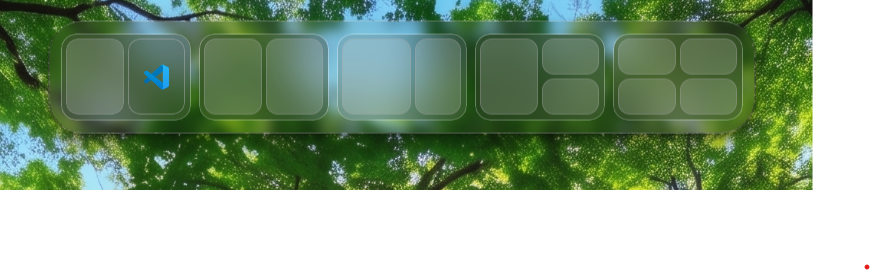
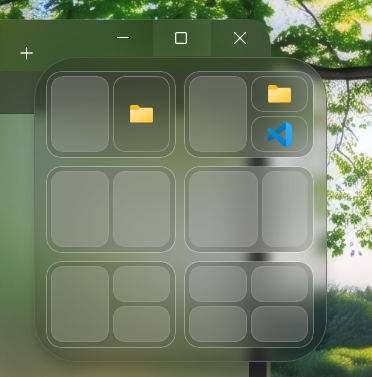
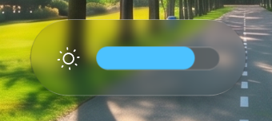
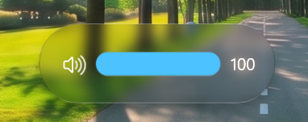
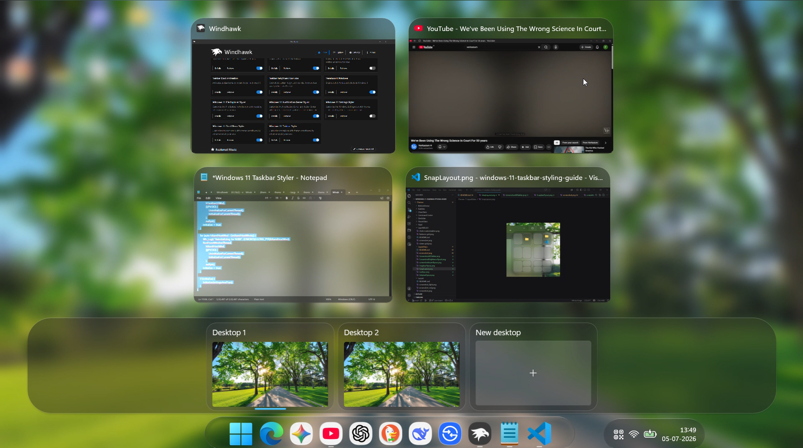

# LiquidGlass theme for Windows 11 Taskbar Styler

**Author**: [mohsinhasanpc](https://github.com/mohsinhasanpc)











> [!NOTE]
> This theme is made for dark mode. As such it may not display correctly if used on light themes.
> This was made on screen resolution of 1920x1440 pixels & 15'6 screen size.
> Windows OS version used for the mod - 26200.8655

## Taskbar Clock Customization (Optional)

The get the clock to show up like it does in the screenshot, follow these steps:

* Open the Taskbar Clock Customization mod in Windhawk.
* Go to the "Settings" tab and select "Textual mode".
* Copy the content below to the text box and click "Save settings".

<details>
<summary>Content to import (click to expand)</summary>

```yaml
ShowSeconds: 1
TimeFormat: hh':'mm tt;hh':'mm':'ss tt
DateFormat: MM/dd;dddd - MMMM dd, yyyy
WeekdayFormat: dddd
WeekdayFormatCustom: Sun, Mon, Tue, Wed, Thu, Fri, Sat
TopLine: %time%
BottomLine: %date%
MiddleLine: '%weekday%'
TooltipLine: 📅 %date2%%n%🕒 %time2%%n%%n%🌐 %web1_full%%n%%n%📻 %media_info%
TooltipLineMode: replace
Width: 180
Height: 60
MaxWidth: 0
TextSpacing: 0
DataCollection:
  NetworkMetricsFormat: mbsDynamic
  NetworkMetricsFixedDecimals: -1
  PercentageFormat: spacePaddingAndSymbol
  UpdateInterval: 1
  NetworkAdapterName: ''
  GpuAdapterName: ''
MediaPlayer:
  IgnoredPlayers:
    - ''
  MaxLength: 28
  NoMediaText: No media
  RemoveBrackets: 1
WebContentWeatherLocation: ''
WebContentWeatherFormat: '%c 🌡️%t 🌬️%w'
WebContentWeatherUnits: autoDetect
WebContentsItems:
  - Url: https://rss.nytimes.com/services/xml/rss/nyt/World.xml
    BlockStart: <item>
    Start: <title>
    End: </title>
    ContentMode: xmlHtml
    SearchReplace:
      - Search: ''
        Replace: ''
    MaxLength: 28
WebContentsUpdateInterval: 10
TimeZones:
  - ''
TimeStyle:
  Hidden: 0
  TextColor: ''
  TextAlignment: Center
  FontSize: 0
  FontFamily: ''
  FontWeight: ''
  FontStyle: ''
  FontStretch: ''
  CharacterSpacing: 0
DateStyle:
  Hidden: 1
  TextColor: ''
  TextAlignment: Center
  FontSize: 0
  FontFamily: ''
  FontWeight: ''
  FontStyle: ''
  FontStretch: ''
  CharacterSpacing: 0
oldTaskbarOnWin11: 0
```
</details>

## Taskbar Height and Icon Size

> [!NOTE]
> This is required for the taskbar and icons to have the correct size since this theme attempts to mimic the sizing of the macOS Dock. Attempting to do this directly makes it far too blurry.

To get the taskbar and icons sizes to show up like they do in the screenshot, follow these steps:

* Open the Taskbar Height and Icon Size mod in Windhawk.
* Go to the "Settings" tab and select "Textual mode".
* Copy the content below to the text box and click "Save settings".

<details>
<summary>Content to import (click to expand)</summary>

```yaml
TaskbarHeight: 69
IconSize: 45
TaskbarButtonWidth: 57
IconSizeSmall: 16
TaskbarButtonWidthSmall: 32
```
</details>

## Taskbar Dock Animation

> [!NOTE]
> This is required to have macOS-like animations on taskbar.

To get the taskbar animation similar to macOS 

* Open the Taskbar Dock Animation mod in Windhawk.
* Go to the "Settings" tab and select "Textual mode".
* Copy the content below to the text box and click "Save settings".

<details>
<summary>Content to import (click to expand)</summary>

```yaml
AnimationType: 0
MaxScale: 120
EffectRadius: 180
SpacingFactor: 190
BounceDelay: 2147483647
FocusDuration: 200
MirrorForTopTaskbar: 0
DisableVerticalBounce: 1
TaskbarLabelsMode: 0
ExcludeSystemButtonsMode: 0
LerpSpeed: 60
DisableBounce: 0
```
</details>


## Theme selection

The theme is integrated into the mod and can simply be selected from the mod's
settings:

* Open the Windows 11 Taskbar Styler mod in Windhawk.
* Go to the "Settings" tab.
* Select the theme and save the settings.

## Manual installation

The theme styles can also be imported manually. To do that, follow these steps:

* Open the Windows 11 Taskbar Styler mod in Windhawk.
* Go to the "Settings" tab and select "Textual mode".
* Copy the content below to the text box and click "Save settings".

<details>
<summary>Content to import (click to expand)</summary>

```yaml
controlStyles:
  - target: ':root > ScrollViewer > ScrollContentPresenter > Border > Grid'
    styles:
      - ColumnDefinitions:=<ColumnDefinitionCollection><ColumnDefinition Width="*"/><ColumnDefinition Width="Auto"/><ColumnDefinition Width="*"/></ColumnDefinitionCollection>
      - ActualWidth=>containerGridWidth
      - ActualHeight=>TaskHeight
      - HorizontalAlignment=Stretch
  - target: Taskbar.TaskbarFrame#TaskbarFrame
    styles:
      - Width=Auto
      - HorizontalAlignment=Center
      - MinWidth=100
      - MaxWidth={{max(containerGridWidth - 250, 100)}}
      - Grid.Column=1
  - target: Taskbar.TaskbarFrame > Grid#RootGrid
    styles:
      - Padding=-1,0,45,0
      - Margin=0,0,0,3
      - CornerRadius=Auto
      - Background:=Red
      - HorizontalAlignment=Center
      - Width=Auto
  - target: Taskbar.TaskbarFrame > Grid#RootGrid > Taskbar.TaskbarBackground > Grid > Rectangle#BackgroundFill
    styles:
      - Fill:=<WindhawkBlur BlurAmount="3" TintColor="#14090909"/>
      - RadiusX={{(TaskHeight/4.1)*2}}
      - RadiusY={{(TaskHeight/4.1)*2}}
      - StrokeThickness=1
      - Canvas.ZIndex=1
      - Margin=-40,0,-40,0
      - Stroke:=<LinearGradientBrush StartPoint="0,0" EndPoint="0,1"><GradientStop Color="#70D3D3D3" Offset="0.0" /><GradientStop Color="#70707070" Offset="0.1" /><GradientStop Color="#70505050" Offset="0.25" /><GradientStop Color="#90404040" Offset="0.5" /><GradientStop Color="#70505050" Offset="0.75" /><GradientStop Color="#70707070" Offset="0.9" /><GradientStop Color="#70C1C1C1" Offset="1" /></LinearGradientBrush>
  - target: Taskbar.TaskbarFrame > Grid#RootGrid > Taskbar.TaskbarBackground > Grid > Rectangle#BackgroundStroke
    styles:
      - Visibility=Visible
      - Stroke:=<WindhawkBlur BlurAmount="25" TintColor="#00000000"/>
      - StrokeThickness=6
      - RadiusX={{(TaskHeight/4.1)*2}}
      - RadiusY={{(TaskHeight/4.1)*2}}
      - Canvas.ZIndex=-1
      - VerticalAlignment=Stretch
      - HorizontalAlignment=Stretch
      - Height=NaN
      - Margin=-40,0,-40,0
      - Fill:=<WindhawkBlur BlurAmount="0" TintColor="#00101010"/>
  - target: Grid#SystemTrayFrameGrid
    styles:
      - Background:=<WindhawkBlur BlurAmount="5" TintColor="#39101010"/>
      - CornerRadius={{(TaskHeight/4)*1.8}}
      - BorderThickness=1.2,1,1.2,1
      - BorderBrush:=<LinearGradientBrush StartPoint="0,0" EndPoint="0,1"><GradientStop Color="#70D3D3D3" Offset="0.0" /><GradientStop Color="#50404040" Offset="0.1" /><GradientStop Color="#60404040" Offset="0.25" /><GradientStop Color="#40292929" Offset="0.5" /><GradientStop Color="#90404040" Offset="0.75" /><GradientStop Color="#90404040" Offset="0.9" /><GradientStop Color="#70C1C1C1" Offset="1" /></LinearGradientBrush>
      - Padding=11,0,10,0
      - Margin=0,1,0,1
      - VerticalAlignment=Center
      - Height={{TaskHeight - 8}}
  - target: SystemTray.SystemTrayFrame
    styles:
      - HorizontalAlignment=Left
      - Margin=50,0,0,0
      - Grid.Column=2
  - target: Taskbar.Gripper#GripperControl
    styles:
      - MinWidth=24
  - target: MenuFlyoutPresenter
    styles:
      - CornerRadius=30
      - // Bottom Shadow layer for Win+X flyout
  - target: MenuFlyoutPresenter > Border
    styles:
      - Background:=<WindhawkBlur BlurAmount="5" TintColor="#2F131313"/>
      - BorderThickness=1,1,1,1
      - CornerRadius=32,32,30,30
      - Padding=5,9,6,9
      - BorderBrush:=<LinearGradientBrush StartPoint="0,0" EndPoint="0,1"><GradientStop Color="#59D3D3D3" Offset="0.0" /><GradientStop Color="#45494949" Offset="0.1" /><GradientStop Color="#50505050" Offset="0.5" /><GradientStop Color="#45494949" Offset="0.9" /><GradientStop Color="#50D3D3D3" Offset="1" /></LinearGradientBrush>
      - // Win+X flyout
  - target: Grid#ConfirmatorMainGrid
    styles:
      - Background:=<WindhawkBlur BlurAmount="5" TintColor="#1C101010"/>
      - CornerRadius=34
      - ActualWidth=>FlyWid
      - ActualHeight=>FlyHyt
      - BorderThickness=1,1,1,0.5
      - BorderBrush:=<LinearGradientBrush StartPoint="0,0" EndPoint="0,1"><GradientStop Color="#70D3D3D3" Offset="0.0" /><GradientStop Color="#50454545" Offset="0.16" /><GradientStop Color="#50404040" Offset="0.28" /><GradientStop Color="#80303030" Offset="0.5" /><GradientStop Color="#50404040" Offset="0.72" /><GradientStop Color="#50404040" Offset="0.84" /><GradientStop Color="#70D3D3D3" Offset="1" /></LinearGradientBrush>
      - RenderTransform:=<ScaleTransform ScaleX="1.12" ScaleY="1.15" />
      - RenderTransformOrigin=0.5,0
      - Margin=7,0,13,155
      - MinHeight=53
      - MinWidth=180
      - Padding={{ max(8, min(10, FlyWid * 0.035)) }},{{ max(0, min(2, FlyHyt * 0.02)) }},{{ max(8, min(10, FlyWid * 0.035)) }},{{ max(0, min(2, FlyHyt * 0.02)) }}
  - target: Windows.UI.Xaml.Shapes.Rectangle#HorizontalTrackRect
    styles:
      - Height=21
      - RadiusX=10.5
      - RadiusY=10.5
      - Fill:=<WindhawkBlur BlurAmount="18" TintColor="#35252525"/>
      - Stroke:=<LinearGradientBrush StartPoint="0,0" EndPoint="0,1"><GradientStop Color="#809F9F9F" Offset="0.0" /><GradientStop Color="#10696969" Offset="0.5" /><GradientStop Color="#809F9F9F" Offset="1" /></LinearGradientBrush>
      - StrokeThickness=1
      - Margin=0.5
  - target: Windows.UI.Xaml.Shapes.Rectangle#HorizontalDecreaseRect
    styles:
      - Height=20
      - RadiusX=10
      - RadiusY=10
  - target: Grid#TextConfirmator
    styles:
      - MinHeight=63
      - VerticalAlignment=Center
      - HorizontalAlignment=Center
  - target: TextBlock#confirmatorText
    styles:
      - FontSize=16
      - FontWeight=Medium
      - VerticalAlignment=Center
      - HorizontalAlignment=Center
  - target: MenuFlyoutItem
    styles:
      - FontSize=14
      - FontWeight=Medium
  - target: MenuFlyoutSubItem
    styles:
      - FontSize=14
      - FontWeight=Medium
  - target: Border#OverflowFlyoutBackgroundBorder
    styles:
      - Background:=<WindhawkBlur BlurAmount="5" TintColor="#15101010"/>
      - BorderThickness=1
      - CornerRadius={{ max(27, min(48, (OverflowHeight / 2) * 1)) }}
      - ActualHeight=>OverflowHeight
      - Margin={{ max(-4, min(-15, OverflowHeight * 0.35)) }},{{ max(-4, min(-8.5, OverflowHeight * 0.2)) }},{{ max(-4, min(-15, OverflowHeight * 0.35)) }},{{ max(-4, min(-9, OverflowHeight * 0.2)) }}
      - BorderBrush:=<LinearGradientBrush StartPoint="0,0" EndPoint="0,1"><GradientStop Color="#70D3D3D3" Offset="0.0" /><GradientStop Color="#50404040" Offset="0.15" /><GradientStop Color="#45404040" Offset="0.28" /><GradientStop Color="#55252525" Offset="0.5" /><GradientStop Color="#45404040" Offset="0.72" /><GradientStop Color="#50404040" Offset="0.85" /><GradientStop Color="#70C1C1C1" Offset="1" /></LinearGradientBrush>
  - target: WindowsInternal.ComposableShell.Experiences.TextInput.Common.InputSwitcher > ContentControl > ContentPresenter > Grid
    styles:
      - Background:=<WindhawkBlur BlurAmount="5" TintColor="#1C101010"/>
  - target: WindowsInternal.ComposableShell.Experiences.TextInput.Common.InputSwitcher > ContentControl > ContentPresenter > Grid > Grid
    styles:
      - Background:=Red
  - target: Windows.UI.Xaml.Controls.ToolTip > Windows.UI.Xaml.Controls.ContentPresenter#LayoutRoot
    styles:
      - Background:=<WindhawkBlur BlurAmount="5" TintColor="#15101010"/>
      - BorderThickness=1
      - CornerRadius={{ max(19, min(40, (TooltipHeight / 2) * 1)) }}
      - ActualHeight=>TooltipHeight
      - Padding={{ max(16, min(22, TooltipHeight * 0.35)) }},{{ max(9, min(11.5, TooltipHeight * 0.2)) }},{{ max(16, min(22, TooltipHeight * 0.35)) }},{{ max(9.5, min(12, TooltipHeight * 0.22)) }}
      - BorderBrush:=<LinearGradientBrush StartPoint="0,0" EndPoint="0,1"><GradientStop Color="#70D3D3D3" Offset="0.0" /><GradientStop Color="#59505050" Offset="0.15" /><GradientStop Color="#60404040" Offset="0.28" /><GradientStop Color="#60202020" Offset="0.5" /><GradientStop Color="#60404040" Offset="0.72" /><GradientStop Color="#50595959" Offset="0.85" /><GradientStop Color="#70C1C1C1" Offset="1" /></LinearGradientBrush>
      - FontSize=14
      - FontWeight=Medium
  - target: Taskbar.TaskbarBackground#HoverFlyoutBackgroundControl > Grid > Rectangle#BackgroundFill
    styles:
      - Fill:=<WindhawkBlur BlurAmount="3.5" TintColor="#1D101010"/>
      - RadiusX=34
      - RadiusY=34
      - StrokeThickness:=1
      - Stroke:=<LinearGradientBrush StartPoint="0,0" EndPoint="0,1"><GradientStop Color="#70D3D3D3" Offset="0.0" /><GradientStop Color="#65696969" Offset="0.5" /><GradientStop Color="#50505050" Offset="1" /></LinearGradientBrush>
  - target: Taskbar.TaskbarBackground#HoverFlyoutBackgroundControl > Grid > Rectangle#BackgroundStroke
    styles:
      - Visibility=Visible
      - Stroke:=<WindhawkBlur BlurAmount="30" TintColor="#10303030"/>
      - StrokeThickness=6
      - RadiusX=30
      - RadiusY=30
      - Canvas.ZIndex=-1
      - VerticalAlignment=Stretch
      - HorizontalAlignment=Stretch
      - Height=NaN
      - Margin=0,1,0,0
      - Fill:=<WindhawkBlur BlurAmount="0" TintColor="#00101010"/>
  - target: Border#HoverFlyoutBackground
    styles:
      - Background:=Transparent
      - BorderThickness=0
      - CornerRadius=34
  - target: ContentPresenter#HoverFlyoutContent
    styles:
      - CornerRadius=40
      - BorderThickness=0
      - Padding=4,0,4,4
      - Margin:=4,4,4,4.5
      - Background:=Transparent
  - target: WindowsInternal.ComposableShell.Experiences.Switcher.AltTab > Grid#ModalRootGrid > Border#BackgroundElement
    styles:
      - CornerRadius={{ max(68, min(90, (AltTabHeight / 5) * 1.75)) }}
      - ActualHeight=>AltTabHeight
      - BorderThickness=1
      - BorderBrush:=<LinearGradientBrush StartPoint="0,0" EndPoint="0,1"><GradientStop Color="#69D3D3D3" Offset="0.0" /><GradientStop Color="#5F303030" Offset="0.1" /><GradientStop Color="#70303030" Offset="0.5" /><GradientStop Color="#5F303030" Offset="0.9" /><GradientStop Color="#69D3D3D3" Offset="1" /></LinearGradientBrush>
      - Background:=<WindhawkBlur BlurAmount="6" TintColor="#2C101010"/>
  - target: WindowsInternal.ComposableShell.Experiences.Switcher.SwitchItemListViewItem > Grid > Border
    styles:
      - CornerRadius=25,25,12,12
      - Background:=<WindhawkBlur BlurAmount="18" TintColor="#701F1F1F"/>
      - BorderThickness=1
      - BorderBrush:=<LinearGradientBrush StartPoint="0,0" EndPoint="0,1"><GradientStop Color="#50C0C0C0" Offset="0.0" /><GradientStop Color="#509F9F9F" Offset="0.1" /><GradientStop Color="#50707070" Offset="0.5" /><GradientStop Color="#55505050" Offset="0.9" /><GradientStop Color="#69404040" Offset="1" /></LinearGradientBrush>
  - target: Microsoft.UI.Xaml.Controls.AnimatedIcon#VolumeIcon
    styles:
      - Width=20
      - Height=20
      - VerticalAlignment=Center
      - Margin=3,0,-1.2,0
  - target: Microsoft.UI.Xaml.Controls.AnimatedIcon#BrightnessIcon
    styles:
      - Width=21
      - Height=21
  - target: Windows.UI.Xaml.Controls.Border#SnapBarBorder
    styles:
      - Background:=<WindhawkBlur BlurAmount="7" TintColor="#1B242424"/>
      - BorderThickness=1.2,1,1.2,1
      - BorderBrush:=<LinearGradientBrush StartPoint="0,0" EndPoint="0,1"><GradientStop Color="#60D3D3D3" Offset="0.0" /><GradientStop Color="#4F494949" Offset="0.1" /><GradientStop Color="#60505050" Offset="0.5" /><GradientStop Color="#4F494949" Offset="0.9" /><GradientStop Color="#60D3D3D3" Offset="1" /></LinearGradientBrush>
      - CornerRadius=27
      - Margin=0
      - Padding=-30,0,-30,0
  - target: SnapLayout.SnapLayoutPickerControl
    styles:
      - Background:=<WindhawkBlur BlurAmount="12" TintColor="#1B242424"/>
      - BorderBrush:=<LinearGradientBrush StartPoint="0,0" EndPoint="0,1"><GradientStop Color="#50DDDDDD" Offset="0.0" /><GradientStop Color="#1C696969" Offset="0.28" /><GradientStop Color="#20696969" Offset="0.43" /><GradientStop Color="#20696969" Offset="0.58" /><GradientStop Color="#1C606060" Offset="0.75" /><GradientStop Color="#50C1C1C1" Offset="1" /></LinearGradientBrush>
      - BorderThickness=1
      - CornerRadius=10
  - target: SnapLayout.SnapLayoutControl
    styles:
      - Background:=<WindhawkBlur BlurAmount="12" TintColor="#15151515"/>
      - CornerRadius=10
      - BorderThickness=1
      - BorderBrush:=<SolidColorBrush Color="#50808080" />
  - target: SnapLayout.SnapLayoutControl@CommonStates > Windows.UI.Xaml.Controls.Border#LayoutBorder
    styles:
      - Background@PointerOver:=$ElementSysColor2
      - Background@Pressed:=$ElementSysColor3
  - target: Border#BackgroundDimmingLayer
    styles:
      - Background:=<WindhawkBlur BlurAmount="12" TintColor="#101F1F1F"/>
      - //Desktop Switcher's main bg layer
  - target: Border#VirtualDesktopBarBackground
    styles:
      - Background:=<WindhawkBlur BlurAmount="10" TintColor="#6B242424"/>
      - BorderThickness=1
      - BorderBrush:=<LinearGradientBrush StartPoint="0,0" EndPoint="0,1"><GradientStop Color="#50DDDDDD" Offset="0.0" /><GradientStop Color="#0C696969" Offset="0.28" /><GradientStop Color="#50C1C1C1" Offset="1" /></LinearGradientBrush>
      - Margin=45,-5,45,-2
      - CornerRadius=45
  - target: TextBlock#VirtualDesktopNameBlock
    styles:
      - Margin=12,8,0,5
      - FontSize=14
      - //Desktop 1,2 header text in desktop bar's opened desktop boxes
  - target: WindowsInternal.ComposableShell.Experiences.Switcher.NewVirtualDesktopElementThemed > Grid#MainGrid > TextBlock
    styles:
      - Margin=12,8,0,0
      - FontSize=14
      - //New Desktop header text in desktop bar's new desktop opener box
  - target: WindowsInternal.ComposableShell.Experiences.Switcher.VirtualDesktopElementThemed > Grid#MainGrid > Border#MainBorder
    styles:
      - CornerRadius=19
  - target: WindowsInternal.ComposableShell.Experiences.Switcher.NewVirtualDesktopElementThemed > Grid#MainGrid > Border#MainBorder
    styles:
      - CornerRadius=19
  - target: WindowsInternal.ComposableShell.Experiences.Switcher.VirtualDesktopElementThemed > Grid#MainGrid > Border#BorderHighlight
    styles:
      - CornerRadius=19
      - Background:=<WindhawkBlur BlurAmount="15" TintColor="#35252525"/>
      - BorderThickness=1
      - BorderBrush:=<LinearGradientBrush StartPoint="0,0" EndPoint="0,1"><GradientStop Color="#50C1C1C1" Offset="0.0" /><GradientStop Color="#20696969" Offset="0.5" /><GradientStop Color="#50AFAFAF" Offset="1" /></LinearGradientBrush>
  - target: WindowsInternal.ComposableShell.Experiences.Switcher.NewVirtualDesktopElementThemed > Grid#MainGrid > Border#BorderHighlight
    styles:
      - CornerRadius=19
      - Background:=<WindhawkBlur BlurAmount="15" TintColor="#35252525"/>
      - BorderThickness=1
      - BorderBrush:=<LinearGradientBrush StartPoint="0,0" EndPoint="0,1"><GradientStop Color="#50C1C1C1" Offset="0.0" /><GradientStop Color="#20696969" Offset="0.5" /><GradientStop Color="#50AFAFAF" Offset="1" /></LinearGradientBrush>
  - target: WindowsInternal.ComposableShell.Experiences.Switcher.VirtualDesktopElementThemed > Grid#MainGrid > Border#ActiveDesktopPill
    styles:
      - Margin=0,0,0,2.5
      - Width=60
  - target: Taskbar.OverflowToggleButton
    styles:
      - MinWidth=60
      - Margin=5,0,5,0
  - target: Taskbar.TaskListLabeledButtonPanel@CommonStates > Border#BackgroundElement
    styles:
      - Background=Transparent
      - BorderBrush=Transparent
  - target: Taskbar.TaskListButtonPanel@CommonStates > Border#BackgroundElement
    styles:
      - BorderBrush=Transparent
      - Background=Transparent
  - target: SystemTray.ChevronIconView
    styles:
      - RenderTransform:=<TranslateTransform X="0" Y="0" />
  - target: SystemTray.Stack#ShowDesktopStack
    styles:
      - Visibility=1
  - target: ContentPresenter#ContentPresenter > Grid#ContentGrid > Microsoft.UI.Xaml.Controls.AnimatedVisualPlayer#LottieIcon
    styles:
      - Visibility=1
  - target: SystemTray.OmniButton#ControlCenterButton > Grid > ContentPresenter > ItemsPresenter > StackPanel > ContentPresenter[2] > SystemTray.IconView > Grid > Grid
    styles:
      - Visibility=1
  - target: SystemTray.OmniButton#NotificationCenterButton > Grid > ContentPresenter > ItemsPresenter > StackPanel > ContentPresenter > SystemTray.IconView#SystemTrayIcon > Grid > Grid > SystemTray.TextIconContent
    styles:
      - Visibility=1
  - target: SystemTray.NotificationAreaIcons#NotificationAreaIcons > ItemsPresenter
    styles:
      - RenderTransform:=<TranslateTransform X="0" Y="0" />
  - target: SystemTray.OmniButton#ControlCenterButton
    styles:
      - RenderTransform:=<TranslateTransform X="0" Y="0" />
  - target: SystemTray.OmniButton#NotificationCenterButton
    styles:
      - RenderTransform:=<TranslateTransform X="0" Y="0" />
  - target: SystemTray.DateTimeIconContent > Grid#ContainerGrid > StackPanel > TextBlock#TimeInnerTextBlock
    styles:
      - ''
  - target: SystemTray.DateTimeIconContent > Grid#ContainerGrid > StackPanel > TextBlock#DateInnerTextBlock
    styles:
      - ''
  - target: SystemTray.OmniButton#ControlCenterButton@CommonStates > Grid > Border#BackgroundBorder
    styles:
      - Background:=Transparent
      - BorderBrush:=Transparent
  - target: SystemTray.NotifyIconView > Grid@CommonStates
    styles:
      - RenderTransformOrigin=0.5,0.5
      - RenderTransform:=<ScaleTransform ScaleX="1.2" ScaleY="1.2" />
      - RenderTransform@PointerOver:=<ScaleTransform ScaleX="1.3" ScaleY="1.3" />
      - RenderTransform@Pressed:=<ScaleTransform ScaleX="1.0" ScaleY="1.0" />
  - target: SystemTray.OmniButton#ControlCenterButton > Grid@CommonStates
    styles:
      - RenderTransformOrigin=0.5,0.5
      - RenderTransform:=<ScaleTransform ScaleX="1.2" ScaleY="1.2" />
      - RenderTransform@PointerOver:=<ScaleTransform ScaleX="1.3" ScaleY="1.3" />
      - RenderTransform@Pressed:=<ScaleTransform ScaleX="1.0" ScaleY="1.0" />
  - target: SystemTray.OmniButton#NotificationCenterButton > Grid@CommonStates
    styles:
      - RenderTransformOrigin=0.5,0.5
      - RenderTransform:=<ScaleTransform ScaleX="1.05" ScaleY="1.05" />
      - RenderTransform@PointerOver:=<ScaleTransform ScaleX="1.15" ScaleY="1.15" />
      - RenderTransform@Pressed:=<ScaleTransform ScaleX="0.9" ScaleY="0.9" />
  - target: SystemTray.ChevronIconView > Grid#ContainerGrid@
    styles:
      - RenderTransformOrigin=0.5,0.5
      - RenderTransform:=<ScaleTransform ScaleX="1.28" ScaleY="1.28" />
      - RenderTransform@Normal:=<ScaleTransform ScaleX="1.28" ScaleY="1.28" />
      - RenderTransform@PointerOver:=<ScaleTransform ScaleX="1.37" ScaleY="1.37" />
      - RenderTransform@Pressed:=<ScaleTransform ScaleX="1.1" ScaleY="1.1" />
      - RenderTransform@CheckedNormal:=<ScaleTransform ScaleX="1.37" ScaleY="1.37" />
      - RenderTransform@CheckedPointerOver:=<ScaleTransform ScaleX="1.37" ScaleY="1.37" />
      - RenderTransform@CheckedPressed:=<ScaleTransform ScaleX="1.1" ScaleY="1.1" />
  - target: ScrollViewer > ScrollContentPresenter > Border > Grid > SystemTray.SystemTrayFrame > Grid#SystemTrayFrameGrid > SystemTray.Stack#NotifyIconStack > Grid#Content > SystemTray.StackListView#IconStack > ItemsPresenter > StackPanel > ContentPresenter > SystemTray.ChevronIconView > Grid#ContainerGrid > ContentPresenter#ContentPresenter > Grid#ContentGrid > SystemTray.TextIconContent > Grid#ContainerGrid > SystemTray.AdaptiveTextBlock#Base > TextBlock#InnerTextBlock
    styles:
      - Margin=2,0,3,0
  - target: SystemTray.OmniButton#NotificationCenterButton@CommonStates > Grid > Border#BackgroundBorder
    styles:
      - Background:=Transparent
      - BorderBrush:=Transparent
  - target: SystemTray.ChevronIconView > Grid#ContainerGrid > Border#BackgroundBorder
    styles:
      - Background:=Transparent
      - BorderBrush:=Transparent
  - target: SystemTray.ChevronIconView > * > TextBlock#InnerTextBlock[Text=]
    styles:
      - Text:=&#xED14;
  - target: SystemTray.NotifyIconView@CommonStates > Grid#ContainerGrid > Border#BackgroundBorder
    styles:
      - Background:=<SolidColorBrush Color="Transparent"/>
      - BorderBrush:=<SolidColorBrush Color="Transparent"/>
  - target: SystemTray.NotifyIconView@CommonStates > Grid > Border#BackgroundBorder
    styles:
      - Background:=<SolidColorBrush Color="Transparent"/>
      - BorderBrush:=<SolidColorBrush Color="Transparent"/>
  - target: Windows.UI.Xaml.Controls.Button#CloseButton
    styles:
      - CornerRadius=15
      - Background:=<WindhawkBlur BlurAmount="15" TintColor="#2D101010"/>
      - BorderThickness=1
      - BorderBrush:=<LinearGradientBrush StartPoint="0,0" EndPoint="0,1"><GradientStop Color="#70D3D3D3" Offset="0.0" /><GradientStop Color="#60404040" Offset="0.15" /><GradientStop Color="#55404040" Offset="0.28" /><GradientStop Color="#65252525" Offset="0.5" /><GradientStop Color="#55404040" Offset="0.72" /><GradientStop Color="#60404040" Offset="0.85" /><GradientStop Color="#70C1C1C1" Offset="1" /></LinearGradientBrush>
  - target: Taskbar.TaskItemThumbnailView@CommonStates > Grid > Border#BackgroundBorder
    styles:
      - Background:=Transparent
      - BorderBrush:=Transparent
  - target: Taskbar.TaskItemThumbnailView@CommonStates > Border#BackgroundBorder
    styles:
      - Background:=Transparent
      - BorderBrush:=Transparent
  - target: Border#ThumbnailVisualHostWrapper
    styles:
      - HorizontalAlignment=Center
      - VerticalAlignment=Center
  - target: Border#ThumbnailVisualHost
    styles:
      - CornerRadius=14
      - Background:=<SolidColorBrush Color="Transparent"/>
      - BorderThickness=1
      - BorderBrush:=<SolidColorBrush Color="Transparent"/>
  - target: Windows.UI.Xaml.Controls.Button#SwitchItemElementCloseButton
    styles:
      - CornerRadius=16
      - Padding=2.5
      - Margin=0,1,10,0
      - Background:=<WindhawkBlur BlurAmount="0" TintColor="#5D101010"/>
  - target: Windows.UI.Xaml.Controls.FlyoutPresenter
    styles:
      - CornerRadius=33
  - target: Windows.UI.Xaml.Controls.Border#SnapPickerBorder
    styles:
      - Background:=<WindhawkBlur BlurAmount="7" TintColor="#2D101010"/>
      - BorderBrush:=<WindhawkBlur BlurAmount="40" TintColor="#3D404040"/>
      - BorderThickness=1
      - Padding=2,3,2,3
      - CornerRadius=33
      - Canvas.ZIndex=-5
  - target: Windows.UI.Xaml.Controls.Border#LayoutBorder
    styles:
      - Background:=<WindhawkBlur BlurAmount="15" TintColor="#30505050"/>
      - BorderThickness=1
      - BorderBrush:=<SolidColorBrush Color="#50FFFFFF"/>
      - CornerRadius=12
  - target: SnapLayout.SnapLayoutControl#SuggestionSnapLayout Windows.UI.Xaml.Controls.Border#LayoutBorder
    styles:
      - Background:=Transparent
  - target: Windows.UI.Xaml.Controls.Grid#LayoutGrid > Windows.UI.Xaml.Controls.Button
    styles:
      - BorderBrush:=<SolidColorBrush Color="#70BBBBBB"/>
      - BorderThickness=1
      - CornerRadius=9.2
      - Margin=1.5
  - target: Windows.UI.Xaml.Controls.Grid#LayoutGrid > Windows.UI.Xaml.Controls.Button@CommonStates > Windows.UI.Xaml.Controls.Grid#RootGrid
    styles:
      - Background@PointerOver:=<SolidColorBrush Color="#40FFFFFF"/>
      - Background@Pressed:=<SolidColorBrush Color="#20FFFFFF"/>
  - target: Windows.UI.Xaml.Controls.Button#WindowGroupSuggestionButton > Windows.UI.Xaml.Controls.ContentPresenter#ContentPresenter
    styles:
      - Background:=Transparent
  - target: Windows.UI.Xaml.Controls.Button#WindowGroupSuggestionButton@CommonStates > Windows.UI.Xaml.Controls.Grid#RootGrid
    styles:
      - Background@PointerOver:=<SolidColorBrush Color="{ThemeResource SystemAccentColorDark2}" Opacity="1" />
      - Background@Pressed:=<SolidColorBrush Color="{ThemeResource SystemAccentColorDark2}" Opacity="1" />
  - target: Taskbar.AugmentedEntryPointButton#AugmentedEntryPointButton > Taskbar.TaskListButtonPanel#ExperienceToggleButtonRootPanel > Border#BackgroundElement
    styles:
      - Background:=<AcrylicBrush TintColor="{ThemeResource SystemChromeAltHighColor}" TintOpacity="0.8" FallbackColor="{ThemeResource SystemChromeLowColor}" />
      - Margin=-4
      - BorderBrush:=<SolidColorBrush Color="{ThemeResource SurfaceStrokeColorDefault}" />
      - BorderThickness=1
      - CornerRadius=5
  - target: Taskbar.AugmentedEntryPointButton#AugmentedEntryPointButton > Taskbar.TaskListButtonPanel#ExperienceToggleButtonRootPanel
    styles:
      - Margin=273,0,0,2
      - Width=26
  - target: Windows.UI.Xaml.Controls.Grid#AugmentedEntryPointContentGrid
    styles:
      - Margin=10,0,0,0
      - HorizontalAlignment=Left
  - target: SearchUx.SearchUI.SearchIconButton#SearchIcon > SearchUx.SearchUI.SearchButtonRootGrid#SearchBoxButtonRootPanel
    styles:
      - Visibility=1
  - target: SearchUx.SearchUI.SearchIconButton#SearchIcon > SearchUx.SearchUI.SearchButtonRootGrid#SearchBoxButtonRootPanel > Border#BackgroundElement
    styles:
      - Visibility=1
  - target: SearchUx.SearchUI.SearchButtonRootGrid#SearchBoxButtonRootPanel
    styles:
      - Visibility=1
  - target: SearchUx.SearchUI.SearchButtonRootGrid#SearchBoxButtonRootPanel > Border#BackgroundElement
    styles:
      - Visibility=1
  - target: SearchUx.SearchUI.SearchPillButton#SearchPill > SearchUx.SearchUI.SearchButtonRootGrid#SearchBoxButtonRootPanel
    styles:
      - Visibility=0
      - Background:=<WindhawkBlur BlurAmount="15" TintColor="#30505050"/>
      - CornerRadius=20
      - Margin=0,10,0,10
      - BorderBrush:=<SolidColorBrush Color="#40BBBBBB"/>
      - BorderThickness=1
  - target: SearchUx.SearchUI.SearchButtonRootGrid#SearchBoxButtonRootPanel > Border#SearchPillBackgroundElement
    styles:
      - Visibility=1
```
</details>