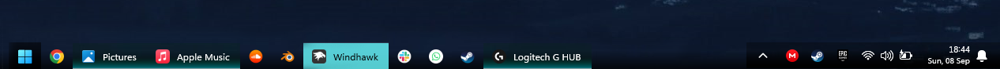
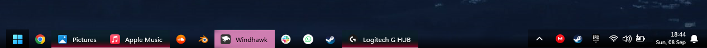
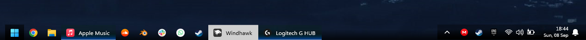

# Lucent theme for Windows 11 Taskbar Styler

A dark theme with gradients and colorful glows that use your theme color.

**Author**: [twistthoseknobs](https://github.com/twistthoseknobs)

 \


Alternate Light Bar Style: \


## Suggested Windows settings

* Left-aligned taskbar.
* Combine taskbar buttons set to "When taskbar is full".
* Dark wallpaper with matching accent color.

## Theme selection

The theme is integrated into the mod and can be selected directly from the mod's
settings:

* Open the Windows 11 Taskbar Styler mod in Windhawk.
* Go to the "Settings" tab.
* Select the theme and save the settings.

## Manual installation

The theme styles can also be imported manually. To do that, follow these steps:

* Open the Windows 11 Taskbar Styler mod in Windhawk.
* Go to the "Advanced" tab.
* Copy the content below to the text box under "Mod settings" and click "Save".

### Accented Bar
<details>
<summary>Content to import (click to expand)</summary>

```yaml
controlStyles:
  - target: Taskbar.TaskbarFrame > Grid#RootGrid > Taskbar.TaskbarBackground > Grid > Rectangle#BackgroundFill
    styles:
      - Fill:=<LinearGradientBrush StartPoint="0,0" EndPoint="0,1"><GradientStop Color="#00000000" Offset="0.3" /><GradientStop Color="#AA000000" Offset="0.9" /></LinearGradientBrush>
  - target: Taskbar.TaskbarBackground#HoverFlyoutBackgroundControl > Grid > Rectangle#BackgroundFill
    styles:
      - Fill:=<LinearGradientBrush StartPoint="0,0.5" EndPoint="0,1"><GradientStop Color="#ee000000" Offset="0.1" /><GradientStop Color="{ThemeResource SystemAccentColorDark2}" Offset="0.9" /><GradientStop Color="#AAFFFFFF" Offset="1.0" /></LinearGradientBrush>
  - target: Taskbar.TaskListLabeledButtonPanel > Rectangle#RunningIndicator
    styles:
      - Fill=Transparent
  - target: Rectangle#BackgroundStroke
    styles:
      - Visibility=Collapsed
  - target: Taskbar.TaskListLabeledButtonPanel@RunningIndicatorStates > Border#BackgroundElement
    styles:
      - Background@InactiveRunningIndicator:=<LinearGradientBrush StartPoint="0,0.5" EndPoint="0,1"><GradientStop Color="#3300290c" Offset="0.1" /><GradientStop Color="{ThemeResource SystemAccentColorDark2}" Offset="0.9" /><GradientStop Color="#AAFFFFFF" Offset="1.0" /></LinearGradientBrush>
      - Margin=0,-1,0,-1
  - target: Taskbar.TaskListLabeledButtonPanel@CommonStates > TextBlock#LabelControl
    styles:
      - Foreground@ActiveNormal=Black
      - Foreground@ActivePointerOver=Black
      - Margin=0,0,3,0
      - Foreground@ActivePressed=#BFBFBF
  - target: SystemTray.SystemTrayFrame > Grid
    styles:
      - Background:=<LinearGradientBrush StartPoint="0,0" EndPoint="0,1"><GradientStop Color="#50000000" Offset="0.3" /><GradientStop Color="#EE000000" Offset="0.9" /></LinearGradientBrush>
      - Margin=0
      - CornerRadius=0
  - target: SystemTray.NotifyIconView#NotifyItemIcon
    styles:
      - Padding=2
  - target: Taskbar.ExperienceToggleButton#LaunchListButton[AutomationProperties.AutomationId=StartButton] > Taskbar.TaskListButtonPanel
    styles:
      - CornerRadius=0
      - BorderThickness=0
      - MaxWidth=48
      - Margin=0
      - Padding=0
      - Background:=<LinearGradientBrush StartPoint="0,0" EndPoint="0,1"><GradientStop Color="#80000000" Offset="0.0" /><GradientStop Color="#FF000000" Offset="1.0" /></LinearGradientBrush>
  - target: Grid
    styles:
      - RequestedTheme=2
  - target: Grid#OverflowRootGrid > Border
    styles:
      - Background:=<LinearGradientBrush StartPoint="0,0" EndPoint="0,1"><GradientStop Color="#50000000" Offset="0.3" /><GradientStop Color="#EE000000" Offset="0.9" /></LinearGradientBrush>
      - CornerRadius=0
  - target: Taskbar.AugmentedEntryPointButton
    styles:
      - Margin=10,0,-10,0
  - target: Taskbar.TaskListLabeledButtonPanel@CommonStates
    styles:
      - Background@ActiveNormal:=<SolidColorBrush Color="{ThemeResource SystemAccentColorLight3}"/>
      - Background@ActivePointerOver:=<SolidColorBrush Color="{ThemeResource SystemAccentColorLight2}"/>
      - Background@InactivePointerOver=#EBEBEB
      - Background@InactivePressed=#BBBBBB
      - Background@ActivePressed:=<SolidColorBrush Color="{ThemeResource SystemAccentColorLight1}"/>
      - Background@RequestingAttention=#FFE9AFAA
      - Background@RequestingAttentionPointerOver=#FFF8E7E5
      - Background@RequestingAttentionPressed=#FFFEEEF0
      - Background@MultiWindowPointerOver:=<SolidColorBrush Color="{ThemeResource SystemAccentColorLight2}"/>
      - Background@MultiWindowActive:=<SolidColorBrush Color="{ThemeResource SystemAccentColorLight3}"/>
      - Background@MultiWindowPressed:=<SolidColorBrush Color="{ThemeResource SystemAccentColorLight1}"/>
  - target: Taskbar.TaskListLabeledButtonPanel@CommonStates > Border
    styles:
      - BorderThickness=0
      - Margin=-2,-4,-2,-4
      - CornerRadius=0
  - target: Taskbar.TaskListButtonPanel@CommonStates > Border
    styles:
      - CornerRadius=0
      - Background@InactivePointerOver:=<SolidColorBrush Color="{ThemeResource SystemAccentColorLight3}"/>
      - Background@InactivePressed:=<SolidColorBrush Color="{ThemeResource SystemAccentColorLight2}"/>
      - Background@ActiveNormal:=<SolidColorBrush Color="{ThemeResource SystemAccentColorLight3}"/>
      - Background@ActivePointerOver:=<SolidColorBrush Color="{ThemeResource SystemAccentColorLight3}"/>
      - Background@ActivePressed:=<SolidColorBrush Color="{ThemeResource SystemAccentColorLight1}"/>
      - Margin=-3,-10,-3,-10
      - BorderThickness=0
  - target: Grid#ContainerGrid@
    styles:
      - Background@PointerOver:=<SolidColorBrush Color="{ThemeResource SystemAccentColorLight3}"/>
      - CornerRadius=0
  - target: SystemTray.OmniButton#ControlCenterButton > Grid@CommonStates > Border#BackgroundBorder
    styles:
      - Margin=0
      - Padding=0
      - CornerRadius=0
      - Background=Transparent
      - BorderThickness=0
  - target: SystemTray.OmniButton > Grid@CommonStates
    styles:
      - Background@PointerOver:=<SolidColorBrush Color="{ThemeResource SystemAccentColorLight3}"/>
      - Background@Pressed:=<SolidColorBrush Color="{ThemeResource SystemAccentColorLight1}"/>
      - Background@Checked:=<SolidColorBrush Color="{ThemeResource SystemAccentColorLight2}"/>
      - Background@CheckedPointerOver:=<SolidColorBrush Color="{ThemeResource SystemAccentColorLight3}"/>
      - Background@CheckedPressed:=<SolidColorBrush Color="{ThemeResource SystemAccentColorLight1}"/>
  - target: Rectangle#ShowDesktopPipe
    styles:
      - Opacity=0
  - target: SystemTray.ChevronIconView > Grid@
    styles:
      - Background@Pressed:=<SolidColorBrush Color="{ThemeResource SystemAccentColorLight1}"/>
      - Background@CheckedPressed:=<SolidColorBrush Color="{ThemeResource SystemAccentColorLight1}"/>
      - Background@PointerOver:=<SolidColorBrush Color="{ThemeResource SystemAccentColorLight3}"/>
      - Background@CheckedNormal:=<SolidColorBrush Color="{ThemeResource SystemAccentColorLight2}"/>
      - Background@CheckedPointerOver:=<SolidColorBrush Color="{ThemeResource SystemAccentColorLight3}"/>
  - target: 'SystemTray.Stack#NonActivatableStack > Grid > SystemTray.StackListView > Windows.UI.Xaml.Controls.ItemsPresenter > Windows.UI.Xaml.Controls.StackPanel > Windows.UI.Xaml.Controls.ContentPresenter > SystemTray.IconView > Grid@ '
    styles:
      - Background@Pressed:=<SolidColorBrush Color="{ThemeResource SystemAccentColorLight1}"/>
      - Background@CheckedPressed:=<SolidColorBrush Color="{ThemeResource SystemAccentColorLight1}"/>
      - Background@PointerOver:=<SolidColorBrush Color="{ThemeResource SystemAccentColorLight2}"/>
      - Background@CheckedNormal:=<SolidColorBrush Color="{ThemeResource SystemAccentColorLight2}"/>
      - Background@CheckedPointerOver:=<SolidColorBrush Color="{ThemeResource SystemAccentColorLight3}"/>
  - target: Grid#OverflowRootGrid > Windows.UI.Xaml.Controls.ItemsControl > Windows.UI.Xaml.Controls.ItemsPresenter > Windows.UI.Xaml.Controls.WrapGrid > Windows.UI.Xaml.Controls.ContentPresenter > SystemTray.NotifyIconView > Grid@
    styles:
      - CornerRadius=0
      - Margin=2,-5,2,-5
  - target: Taskbar.ExperienceToggleButton#LaunchListButton[AutomationProperties.AutomationId=StartButton] > Taskbar.TaskListButtonPanel > Border
    styles:
      - Width=48
  - target: Taskbar.TaskListLabeledButtonPanel > Border#MultiWindowElement
    styles:
      - Height=0
  - target: Taskbar.TaskListLabeledButtonPanel@CommonStates > Rectangle
    styles:
      - StrokeThickness=3
      - Stroke@MultiWindowNormal:=<SolidColorBrush Color="{ThemeResource SystemAccentColorLight3}"/>
      - Stroke@MultiWindowPointerOver:=<SolidColorBrush Color="{ThemeResource SystemAccentColorLight2}"/>
      - Stroke@MultiWindowActive:=<SolidColorBrush Color="{ThemeResource SystemAccentColorLight1}"/>
      - Stroke@MultiWindowPressed:=<SolidColorBrush Color="{ThemeResource SystemAccentColorLight1}"/>
      - Width=Auto
      - RadiusX=0
      - Margin=-2,0,-2,-3
  - target: SystemTray.ChevronIconView > Grid > Border
    styles:
      - BorderThickness=0
      - Background=Transparent
  - target: SystemTray.OmniButton > Grid > Border
    styles:
      - BorderThickness=0
      - Background=Transparent
  - target: Taskbar.SearchBoxButton > Taskbar.TaskListButtonPanel@CommonStates
    styles:
      - Background@InactivePointerOver_SearchIcon=#BEBEBE
      - Background@InactivePressed_SearchIcon=#DDDDDD
      - Background@ActiveNormal_SearchIcon=#BEBEBE
      - Background@ActivePointerOver_SearchIcon=#DDDDDD
      - Background@ActivePressed_SearchIcon=#EEEEEE
```
</details>

### Light Bar
<details>
<summary>Content to import (click to expand)</summary>

```yaml
controlStyles:
  - target: Taskbar.TaskbarFrame > Grid#RootGrid > Taskbar.TaskbarBackground > Grid > Rectangle#BackgroundFill
    styles:
      - Fill:=<LinearGradientBrush StartPoint="0,0" EndPoint="0,1"><GradientStop Color="#00000000" Offset="0.3" /><GradientStop Color="#AA000000" Offset="0.9" /></LinearGradientBrush>
  - target: Taskbar.TaskbarBackground#HoverFlyoutBackgroundControl > Grid > Rectangle#BackgroundFill
    styles:
      - Fill:=<LinearGradientBrush StartPoint="0,0.5" EndPoint="0,1"><GradientStop Color="#ee000000" Offset="0.1" /><GradientStop Color="#EBEBEB" Offset="0.9" /><GradientStop Color="#AAFFFFFF" Offset="1.0" /></LinearGradientBrush>
  - target: Taskbar.TaskListLabeledButtonPanel > Rectangle#RunningIndicator
    styles:
      - Fill=Transparent
  - target: Rectangle#BackgroundStroke
    styles:
      - Visibility=Collapsed
  - target: Taskbar.TaskListLabeledButtonPanel@RunningIndicatorStates > Border#BackgroundElement
    styles:
      - Background@InactiveRunningIndicator:=<LinearGradientBrush StartPoint="0,0.5" EndPoint="0,1"><GradientStop Color="#33000000" Offset="0.1" /><GradientStop Color="#33EBEBEB" Offset="0.9" /><GradientStop Color="#AAFFFFFF" Offset="1.0" /></LinearGradientBrush>
      - Margin=0,-1,0,-1
  - target: Taskbar.TaskListLabeledButtonPanel@CommonStates > TextBlock#LabelControl
    styles:
      - Foreground@ActiveNormal=Black
      - Foreground@ActivePointerOver=Black
      - Margin=0,0,3,0
      - Foreground@ActivePressed=#424242
  - target: SystemTray.SystemTrayFrame > Grid
    styles:
      - Background:=<LinearGradientBrush StartPoint="0,0" EndPoint="0,1"><GradientStop Color="#50000000" Offset="0.3" /><GradientStop Color="#EE000000" Offset="0.9" /></LinearGradientBrush>
      - Margin=0
      - CornerRadius=0
  - target: SystemTray.NotifyIconView#NotifyItemIcon
    styles:
      - Padding=2
  - target: Taskbar.ExperienceToggleButton#LaunchListButton[AutomationProperties.AutomationId=StartButton] > Taskbar.TaskListButtonPanel
    styles:
      - CornerRadius=0
      - BorderThickness=0
      - MaxWidth=48
      - Margin=0
      - Padding=0
      - Background:=<LinearGradientBrush StartPoint="0,0" EndPoint="0,1"><GradientStop Color="#80000000" Offset="0.0" /><GradientStop Color="#FF000000" Offset="1.0" /></LinearGradientBrush>
  - target: Grid
    styles:
      - RequestedTheme=2
  - target: Grid#OverflowRootGrid > Border
    styles:
      - Background:=<LinearGradientBrush StartPoint="0,0" EndPoint="0,1"><GradientStop Color="#50000000" Offset="0.3" /><GradientStop Color="#EE000000" Offset="0.9" /></LinearGradientBrush>
      - CornerRadius=0
  - target: Taskbar.AugmentedEntryPointButton
    styles:
      - Margin=10,0,-10,0
  - target: Taskbar.TaskListLabeledButtonPanel@CommonStates
    styles:
      - Background@ActiveNormal=#FCFCFC
      - Background@ActivePointerOver=#BBBBBB
      - Background@InactivePointerOver=#BBBBBB
      - Background@InactivePressed=#EBEBEB
      - Background@ActivePressed=#EBEBEB
      - Background@RequestingAttention=#FFE9AFAA
      - Background@RequestingAttentionPointerOver=#FFF8E7E5
      - Background@RequestingAttentionPressed=#FFFEEEF0
      - Background@MultiWindowPointerOver=#BBBBBB
      - Background@MultiWindowActive=#BBBBBB
      - Background@MultiWindowPressed=#EBEBEB
  - target: Taskbar.TaskListLabeledButtonPanel@CommonStates > Border
    styles:
      - BorderThickness=0
      - Margin=-2,-4,-2,-4
      - CornerRadius=0
  - target: Taskbar.TaskListButtonPanel@CommonStates > Border
    styles:
      - CornerRadius=0
      - Background@InactivePointerOver=#BBBBBB
      - Background@InactivePressed=#EBEBEB
      - Background@ActiveNormal=#BBBBBB
      - Background@ActivePointerOver=#BBBBBB
      - Background@ActivePressed=#EBEBEB
      - Margin=-3,-10,-3,-10
      - BorderThickness=0
  - target: Grid#ContainerGrid@
    styles:
      - Background@PointerOver=#BBBBBB
      - CornerRadius=0
  - target: SystemTray.OmniButton#ControlCenterButton > Grid@CommonStates > Border#BackgroundBorder
    styles:
      - Background@PointerOver=#BBBBBB
      - Margin=0
      - Padding=0
      - CornerRadius=0
  - target: SystemTray.OmniButton > Grid@CommonStates
    styles:
      - Background@PointerOver=#BBBBBB
      - Background@Pressed=#EBEBEB
      - Background@Checked=#BBBBBB
      - Background@CheckedPointerOver=#BBBBBB
      - Background@CheckedPressed=#EBEBEB
  - target: Rectangle#ShowDesktopPipe
    styles:
      - Opacity=0
  - target: SystemTray.ChevronIconView > Grid@
    styles:
      - Background@Pressed=#EBEBEB
      - Background@CheckedPressed=#EBEBEB
      - Background@PointerOver=#BBBBBB
      - Background@CheckedNormal=#BBBBBB
      - Background@CheckedPointerOver=#EBEBEB
  - target: 'SystemTray.Stack#NonActivatableStack > Grid > SystemTray.StackListView > Windows.UI.Xaml.Controls.ItemsPresenter > Windows.UI.Xaml.Controls.StackPanel > Windows.UI.Xaml.Controls.ContentPresenter > SystemTray.IconView > Grid@ '
    styles:
      - Background@Pressed=#EBEBEB
      - Background@CheckedPressed=#EBEBEB
      - Background@PointerOver=#BBBBBB
      - Background@CheckedNormal=#BBBBBB
      - ' Background@CheckedPointerOver=#EBEBEB'
  - target: Grid#OverflowRootGrid > Windows.UI.Xaml.Controls.ItemsControl > Windows.UI.Xaml.Controls.ItemsPresenter > Windows.UI.Xaml.Controls.WrapGrid > Windows.UI.Xaml.Controls.ContentPresenter > SystemTray.NotifyIconView > Grid@
    styles:
      - CornerRadius=0
      - Margin=2,-5,2,-5
  - target: Taskbar.ExperienceToggleButton#LaunchListButton[AutomationProperties.AutomationId=StartButton] > Taskbar.TaskListButtonPanel > Border
    styles:
      - Width=48
  - target: Taskbar.TaskListLabeledButtonPanel > Border#MultiWindowElement
    styles:
      - Height=0
  - target: Taskbar.TaskListLabeledButtonPanel@CommonStates > Rectangle
    styles:
      - StrokeThickness=3
      - Stroke@MultiWindowNormal=#BBBBBB
      - Stroke@MultiWindowPointerOver=#EBEBEB
      - Stroke@MultiWindowPressed=#EBEBEB
      - Stroke@MultiWindowActive=#EBEBEB
      - Width=Auto
      - RadiusX=0
      - Margin=-2,0,-2,-3
  - target: SystemTray.ChevronIconView > Grid > Border
    styles:
      - BorderThickness=0
      - Background=Transparent
  - target: SystemTray.OmniButton > Grid > Border
    styles:
      - BorderThickness=0
      - Background=Transparent
  - target: Taskbar.SearchBoxButton > Taskbar.TaskListButtonPanel@CommonStates
    styles:
      - Background@InactivePointerOver_SearchIcon=#BEBEBE
      - Background@ActiveNormal_SearchIcon=#BEBEBE
      - Background@ActivePointerOver_SearchIcon=#EBEBEB
```
</details>
