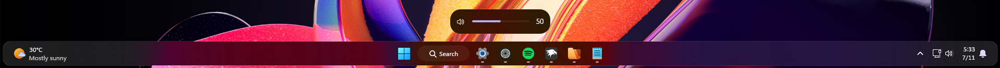
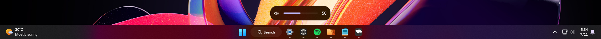
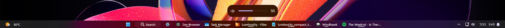
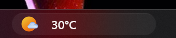
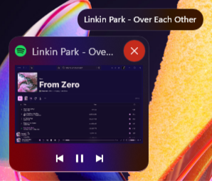
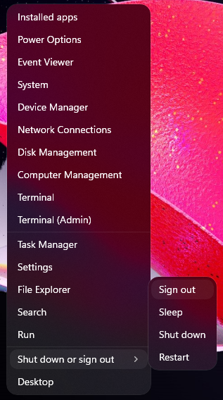

# Luminosity theme for Windows 11 Taskbar Styler

**Author**: [mendes.image](https://github.com/mendesimage)



## Intro
**Luminosity** is based on native Acrylic, using the maximum **TintLuminosityOpacity** value as its backdrop.

It's meant to be used with **Mica** or **MicaAlt** backdrops, with or without the **Translucent Windows** mod.

---

## Options

### Dock


- Docks are cool.

### Classic



- Meant to cause minimal disruption for users who prefer the classic Taskbar placement.

### Compact



- Meant to be used with **Taskbar Labels for Windows 11**, using the **Centered Running Indicator** style, and **Taskbar Clock Customization**. Otherwise, you will experience visual issues.

### Mods Guide

To apply the same settings as mine, follow these steps:

* Open the **Taskbar Labels for Windows 11** and **Taskbar Clock Customization** mods in Windhawk.
* Go to the "Settings" tab and select "Textual mode".
* Copy the content below to the text box and click "Save settings".

**Taskbar Labels for Windows 11**
<details>
<summary>Click to expand mod settings</summary>

```yaml
mode: labelsWithoutCombining
taskbarItemWidth: 0
runningIndicatorStyle: centerDynamic
progressIndicatorStyle: centerDynamic
excludedPrograms:
  - excluded1.exe
minimumTaskbarItemWidth: 50
maximumTaskbarItemWidth: 176
fontSize: 12
fontFamily: ''
textTrimming: characterEllipsis
leftAndRightPaddingSize: 8
spaceBetweenIconAndLabel: 8
runningIndicatorHeight: 0
runningIndicatorVerticalOffset: 0
alwaysShowThumbnailLabels: 0
labelForSingleItem: '%name%'
labelForMultipleItems: '[%amount%] %name%'
```
</details>

**Taskbar Clock Customization**
<details>
<summary>Click to expand mod settings</summary>

```yaml
ShowSeconds: 1
TimeFormat: ''
DateFormat: ''
WeekdayFormat: dddd
WeekdayFormatCustom: Sun, Mon, Tue, Wed, Thu, Fri, Sat
TopLine: '%date%   %time%'
BottomLine: ''
MiddleLine: '%weekday%'
TooltipLine: ''
TooltipLineMode: append
Width: 180
Height: 60
MaxWidth: 0
TextSpacing: 0
DataCollection:
  NetworkMetricsFormat: mbs
  NetworkMetricsFixedDecimals: -1
  PercentageFormat: spacePaddingAndSymbol
  UpdateInterval: 1
  NetworkAdapterName: ''
  GpuAdapterName: ''
MediaPlayer:
  IgnoredPlayers:
    - ''
  MaxLength: 28
  NoMediaText: No media
  RemoveBrackets: 0
WebContentWeatherLocation: ''
WebContentWeatherFormat: '%c 🌡️%t 🌬️%w'
WebContentWeatherUnits: autoDetect
WebContentsItems:
  - Url: https://rss.nytimes.com/services/xml/rss/nyt/World.xml
    BlockStart: <item>
    Start: <title>
    End: </title>
    ContentMode: xmlHtml
    SearchReplace:
      - Search: ''
        Replace: ''
    MaxLength: 28
WebContentsUpdateInterval: 10
TimeZones:
  - Eastern Standard Time
TimeStyle:
  Hidden: 0
  TextColor: ''
  TextAlignment: ''
  FontSize: 0
  FontFamily: ''
  FontWeight: ''
  FontStyle: ''
  FontStretch: ''
  CharacterSpacing: 0
DateStyle:
  Hidden: 1
  TextColor: ''
  TextAlignment: ''
  FontSize: 0
  FontFamily: ''
  FontWeight: ''
  FontStyle: ''
  FontStretch: ''
  CharacterSpacing: 0
oldTaskbarOnWin11: 0
DataCollectionUpdateInterval: 1
```
</details>

---

## General Information

The theme changes the following elements:

- Taskbar Frame
- Taskbar Widget (compact version) \
  
- Icon borders
- Taskbar icon sizes (compact version)
- Search icon with label
- Search box
- System Tray
    - Icon sizes (compact version)
    - Chevron icon border
    - Software icon border
    - Microphone icon border
    - Spacing between element groups
    - Tray Overflow Flyout
- Alt+Tab \
  
- Win+Tab background and Virtual Desktops bar
- Snap Bar and Picker
- Volume bar
- Window Preview Flyout \
  
- Context menus (with animations) \
  
- Tooltips
- Removed drop shadows

## Animations Guide

To customize the animations, look for the last line `"styleConstants[7]": "AnimationSettings=<TransitionCollection><EntranceThemeTransition IsStaggeringEnabled=\"True\" FromHorizontalOffset=\"-50\" FromVerticalOffset=\"50\" /></TransitionCollection>"`

- For all items to display immediately, set `IsStaggeringEnabled=\"True\"` to `False`.

- `FromHorizontalOffset` and `FromVerticalOffset` are the directions where the items come from.
  - Horizontal **Positive** values is **Right**, **Negative** is **Left**.
  - Vertical **Positive** values is **Down**, **Negative** is **Up**.

---

## Known Issues

I didn't know how to fix these. I couldn't find the correct target names, or I'm not sure if they can even be changed/fixed.

- **Widget/Weather:** The bottom text line has incorrect placement in **Compact version** (renders off-screen).
- **Icon Hitboxes (Dock):** The Taskbar's rounded corners slightly limit the icon hitbox on the **top and bottom**, which makes it **impossible to minimize windows by clicking in those areas**.
- **Left Taskbar Alignment (Dock):** When using **Left Taskbar Alignment**, the Widget clip into the **SystemTray**. As a workaround, you can change:
```"controlStyles[45].styles[0]": "Margin=-307,-2,250,4",```
to:
```"controlStyles[45].styles[0]": "Margin=-261,-2,250,4",```

- **SearchBox (Dock/Classic):** Has **mismatched look and position** when typing.
- **SearchBox (Compact):** Has incorrect styling and positioning in the Compact version.
- **Missing Acrylic Backdrop:** The **Virtual Desktop Bar** and **Taskbar Overflow Flyout** (when taskbar is full) may not have Acrylic.
  - I've added a backup blur for the **Virtual Desktop Bar**, but it doesn't have **TintLuminosityOpacity** settings.

---

## Full Luminosity Theme
To achieve a complete Luminosity experience, download the listed mods and select "**Luminosity**" on each.
- Windows 11 Taskbar Styler
- Windows 11 Start Menu Styler
- Windows 11 Notification Center Styler
- Windows 11 File Explorer Styler

I also highly recommend **Translucent Windows** with **Mica** or **MicaAlt** selected as backdrop.

---

## Theme selection

The theme is integrated into the mod and can be selected directly from the mod's
settings:

* Open the Windows 11 Taskbar Styler mod in Windhawk.
* Go to the "Settings" tab.
* Select the theme and save the settings.

## Manual installation

The theme styles can also be imported manually. To do that, follow these steps:

* Open the Windows 11 Taskbar Styler mod in Windhawk.
* Go to the "Settings" tab and select "Textual mode".
* Copy the content below to the text box and click "Save settings".

---

### Dock

<details>
<summary>Content to import (click to expand)</summary>

```yaml
styleConstants:
  - mbg=<WindhawkBlur BlurAmount="30" TintColor="{ThemeResource CardStrokeColorDefaultSolid}" TintOpacity="0.0" TintLuminosityOpacity="1.0" TintSaturation="1.0" NoiseDensity="1.0" NoiseOpacity="0.1" />
  - bcr=10
  - wcr=20
  - mcr=15
  - t=Transparent
  - bb=#20FFFFFF
  - bt=1
  - AnimationSettings=<TransitionCollection><EntranceThemeTransition IsStaggeringEnabled="True" FromHorizontalOffset="-50" FromVerticalOffset="50" /></TransitionCollection>
controlStyles:
  - target: Taskbar.TaskbarFrame > Grid#RootGrid > Taskbar.TaskbarBackground > Grid > Rectangle#BackgroundFill
    styles:
      - Fill:=$mbg
  - target: Taskbar.TaskListButtonPanel#ExperienceToggleButtonRootPanel > Windows.UI.Xaml.Controls.Border#BackgroundElement
    styles:
      - CornerRadius=$bcr
  - target: Taskbar.ExperienceToggleButton
    styles:
      - CornerRadius=$bcr
  - target: Taskbar.TaskListButton
    styles:
      - CornerRadius=$bcr
  - target: SearchUx.SearchUI.SearchButtonRootGrid#SearchBoxButtonRootPanel > Windows.UI.Xaml.Controls.Border#BackgroundElement
    styles:
      - CornerRadius=$bcr
  - target: Windows.UI.Xaml.Controls.Border#SearchPillBackgroundElement
    styles:
      - CornerRadius=$bcr
  - target: Windows.UI.Xaml.Controls.Border#MultiWindowElement
    styles:
      - CornerRadius=$bcr
  - target: SystemTray.ChevronIconView
    styles:
      - CornerRadius=$bcr
      - Margin=0,0,2,0
  - target: SystemTray.NotifyIconView > Windows.UI.Xaml.Controls.Grid#ContainerGrid > Windows.UI.Xaml.Controls.Border#BackgroundBorder
    styles:
      - CornerRadius=$bcr
      - Margin=2,4,2,4
  - target: SystemTray.IconView#SystemTrayIcon > Windows.UI.Xaml.Controls.Grid#ContainerGrid > Windows.UI.Xaml.Controls.Border#BackgroundBorder
    styles:
      - CornerRadius=$bcr
      - Margin=2,4,2,4
  - target: SystemTray.OmniButton#ControlCenterButton > Windows.UI.Xaml.Controls.Grid > Windows.UI.Xaml.Controls.Border#BackgroundBorder
    styles:
      - CornerRadius=$bcr
      - Margin=2,4,2,4
  - target: SystemTray.OmniButton#NotificationCenterButton > Windows.UI.Xaml.Controls.Grid > Windows.UI.Xaml.Controls.Border#BackgroundBorder
    styles:
      - CornerRadius=$bcr
      - Margin=2,4,2,4
  - target: Border#OverflowFlyoutBackgroundBorder
    styles:
      - Background:=$mbg
      - CornerRadius:=$wcr
      - BorderThickness=$bt
      - BorderBrush=$bb
      - Shadow:=
  - target: Windows.UI.Xaml.Controls.Grid#ConfirmatorMainGrid
    styles:
      - Background:=$mbg
      - CornerRadius=$wcr
      - BorderThickness=$bt
      - BorderBrush=$bb
      - Shadow:=
  - target: Windows.UI.Xaml.Shapes.Rectangle#HorizontalTrackRect
    styles:
      - Fill:=#10FFFFFF
  - target: Taskbar.TaskbarBackground#HoverFlyoutBackgroundControl > Grid > Rectangle#BackgroundFill
    styles:
      - Fill:=$t
  - target: Windows.UI.Xaml.Controls.Grid#HoverFlyoutGrid > Windows.UI.Xaml.Controls.Border#HoverFlyoutBackground
    styles:
      - Background:=$mbg
      - CornerRadius=$mcr
      - BorderThickness=$bt
      - BorderBrush=$bb
      - Shadow:=
  - target: Taskbar.TaskItemThumbnailView > Grid@CommonStates > Border#BackgroundBorder
    styles:
      - Background=$t
      - CornerRadius=$mcr
      - BorderThickness@Normal=0
      - BorderBrush@Normal=$t
      - BorderThickness@PointerOver=0.05,0,0.05,2
      - BorderBrush@PointerOver:=<SolidColorBrush Color="{ThemeResource SystemAccentColorLight2}" Opacity="1.0" />
  - target: Windows.UI.Xaml.Controls.Button#CloseButton
    styles:
      - CornerRadius=$mcr
  - target: Windows.UI.Xaml.Controls.ContentPresenter#BorderElement
    styles:
      - CornerRadius=16
      - Margin=-1,-1,-1,-1
  - target: Windows.UI.Xaml.Controls.Grid#ModalRootGrid > Windows.UI.Xaml.Controls.Border#BackgroundElement
    styles:
      - Background:=$mbg
      - CornerRadius=$wcr
      - BorderThickness=$bt
      - BorderBrush=$bb
      - Shadow:=
  - target: Windows.UI.Xaml.Controls.Border#BackgroundDimmingLayer
    styles:
      - Background:=<WindhawkBlur BlurAmount="0" TintColor="#00000000" />
  - target: WindowsInternal.ComposableShell.Experiences.Switcher.VirtualDesktopBarElement#VirtualDesktopBar > Grid > Border
    styles:
      - Background:=$mbg
      - CornerRadius=$wcr
      - BorderThickness=$bt
      - BorderBrush=$bb
  - target: WindowsInternal.ComposableShell.Experiences.Switcher.VirtualDesktopBarElement#VirtualDesktopBar
    styles:
      - MaxWidth:=900
      - Shadow:=
  - target: WindowsInternal.ComposableShell.Experiences.Switcher.VirtualDesktopBarElement > Windows.UI.Xaml.Controls.Grid#GridElement > Windows.UI.Xaml.Controls.Border#VirtualDesktopSwitcherBackground
    styles:
      - BorderThickness=$bt
      - BorderBrush=$bb
      - CornerRadius=$mcr
      - Margin=0,0,1,0
  - target: WindowsInternal.ComposableShell.Experiences.Switcher.VirtualDesktopBarElement > Grid > Border
    styles:
      - Background:=$mbg
      - Shadow:=
  - target: Windows.UI.Xaml.Controls.Grid#MainGrid
    styles:
      - CornerRadius=13
  - target: Windows.UI.Xaml.Controls.Button#VirtualDesktopElementCloseButton
    styles:
      - CornerRadius=$bcr
  - target: Windows.UI.Xaml.Controls.Border#SnapBarBorder
    styles:
      - Background:=$mbg
      - CornerRadius=$mcr
      - BorderThickness=$bt
      - BorderBrush=$bb
      - RenderTransform:=<TranslateTransform X="0" Y="-20" />
      - Margin=0,0,0,-10
      - Shadow:=
  - target: Windows.UI.Xaml.Controls.Border#SnapPickerBorder
    styles:
      - Background:=$mbg
      - CornerRadius=$mcr
      - BorderThickness=$bt
      - BorderBrush=$bb
  - target: Windows.UI.Xaml.Controls.FlyoutPresenter > Border
    styles:
      - Shadow:=
  - target: MenuFlyoutPresenter
    styles:
      - CornerRadius=$mcr
      - Shadow:=
  - target: MenuFlyoutPresenter > Border
    styles:
      - Background:=$mbg
      - CornerRadius=$mcr
      - BorderThickness=$bt
      - BorderBrush=$bb
  - target: Windows.UI.Xaml.Controls.MenuFlyoutItem
    styles:
      - CornerRadius=$bcr
  - target: Windows.UI.Xaml.Controls.MenuFlyoutSubItem
    styles:
      - CornerRadius=$bcr
  - target: Windows.UI.Xaml.Controls.ToolTip > Windows.UI.Xaml.Controls.ContentPresenter#LayoutRoot
    styles:
      - Background:=$mbg
      - CornerRadius=$mcr
      - BorderThickness=$bt
      - BorderBrush=$bb
      - Shadow:=
  - target: ScrollViewer#MenuFlyoutPresenterScrollViewer > Border > Grid > ScrollContentPresenter > ItemsPresenter > StackPanel
    styles:
      - ChildrenTransitions:=$AnimationSettings
  - target: Grid#LayoutRoot
    styles:
      - BackgroundTransition:=<BrushTransition Duration="0:0:0.100" />
  - target: Border#BackgroundBorder
    styles:
      - BackgroundTransition:=<BrushTransition Duration="0:0:0.100" />
  - target: Taskbar.TaskbarFrame > Grid#RootGrid > Taskbar.TaskbarBackground > Grid > Rectangle#BackgroundFill
    styles:
      - Visibility=Collapsed
  - target: Taskbar.TaskbarFrame
    styles:
      - Height=53
      - Margin=250,0,250,0
  - target: Taskbar.TaskbarFrame > Grid#RootGrid
    styles:
      - Background:=$mbg
      - BorderThickness=$bt
      - BorderBrush:=$bb
      - CornerRadius=$mcr
      - Margin=0,0,500,5
  - target: Taskbar.TaskbarBackground#BackgroundControl > Windows.UI.Xaml.Controls.Grid > Windows.UI.Xaml.Shapes.Rectangle#BackgroundStroke
    styles:
      - Visibility=Collapsed
  - target: Taskbar.TaskListButtonPanel#ExperienceToggleButtonRootPanel > Windows.UI.Xaml.Controls.Grid#AugmentedEntryPointContentGrid
    styles:
      - RenderTransform:=<TranslateTransform X="0" Y="-1" />
  - target: Windows.UI.Xaml.Controls.Border#LargeTicker1
    styles:
      - Margin=0,0,0,-4
  - target: Grid#SystemTrayFrameGrid
    styles:
      - Margin=-307,-2,250,4
      - HorizontalAlignment=Right
```
</details>

---

### Classic

<details>
<summary>Content to import (click to expand)</summary>

```yaml
styleConstants:
  - mbg=<WindhawkBlur BlurAmount="30" TintColor="{ThemeResource CardStrokeColorDefaultSolid}" TintOpacity="0.0" TintLuminosityOpacity="1.0" TintSaturation="1.0" NoiseDensity="1.0" NoiseOpacity="0.1" />
  - bcr=10
  - wcr=20
  - mcr=15
  - t=Transparent
  - bb=#20FFFFFF
  - bt=1
  - AnimationSettings=<TransitionCollection><EntranceThemeTransition IsStaggeringEnabled="True" FromHorizontalOffset="-50" FromVerticalOffset="50" /></TransitionCollection>
controlStyles:
  - target: Taskbar.TaskbarFrame > Grid#RootGrid > Taskbar.TaskbarBackground > Grid > Rectangle#BackgroundFill
    styles:
      - Fill:=$mbg
  - target: Taskbar.TaskListButtonPanel#ExperienceToggleButtonRootPanel > Windows.UI.Xaml.Controls.Border#BackgroundElement
    styles:
      - CornerRadius=$bcr
  - target: Taskbar.ExperienceToggleButton
    styles:
      - CornerRadius=$bcr
  - target: Taskbar.TaskListButton
    styles:
      - CornerRadius=$bcr
  - target: SearchUx.SearchUI.SearchButtonRootGrid#SearchBoxButtonRootPanel > Windows.UI.Xaml.Controls.Border#BackgroundElement
    styles:
      - CornerRadius=$bcr
  - target: Windows.UI.Xaml.Controls.Border#SearchPillBackgroundElement
    styles:
      - CornerRadius=$bcr
  - target: Windows.UI.Xaml.Controls.Border#MultiWindowElement
    styles:
      - CornerRadius=$bcr
  - target: SystemTray.ChevronIconView
    styles:
      - CornerRadius=$bcr
      - Margin=0,0,2,0
  - target: SystemTray.NotifyIconView > Windows.UI.Xaml.Controls.Grid#ContainerGrid > Windows.UI.Xaml.Controls.Border#BackgroundBorder
    styles:
      - CornerRadius=$bcr
      - Margin=2,4,2,4
  - target: SystemTray.IconView#SystemTrayIcon > Windows.UI.Xaml.Controls.Grid#ContainerGrid > Windows.UI.Xaml.Controls.Border#BackgroundBorder
    styles:
      - CornerRadius=$bcr
      - Margin=2,4,2,4
  - target: SystemTray.OmniButton#ControlCenterButton > Windows.UI.Xaml.Controls.Grid > Windows.UI.Xaml.Controls.Border#BackgroundBorder
    styles:
      - CornerRadius=$bcr
      - Margin=2,4,2,4
  - target: SystemTray.OmniButton#NotificationCenterButton > Windows.UI.Xaml.Controls.Grid > Windows.UI.Xaml.Controls.Border#BackgroundBorder
    styles:
      - CornerRadius=$bcr
      - Margin=2,4,2,4
  - target: Border#OverflowFlyoutBackgroundBorder
    styles:
      - Background:=$mbg
      - CornerRadius:=$wcr
      - BorderThickness=$bt
      - BorderBrush=$bb
      - Shadow:=
  - target: Windows.UI.Xaml.Controls.Grid#ConfirmatorMainGrid
    styles:
      - Background:=$mbg
      - CornerRadius=$wcr
      - BorderThickness=$bt
      - BorderBrush=$bb
      - Shadow:=
  - target: Windows.UI.Xaml.Shapes.Rectangle#HorizontalTrackRect
    styles:
      - Fill:=#10FFFFFF
  - target: Taskbar.TaskbarBackground#HoverFlyoutBackgroundControl > Grid > Rectangle#BackgroundFill
    styles:
      - Fill:=$t
  - target: Windows.UI.Xaml.Controls.Grid#HoverFlyoutGrid > Windows.UI.Xaml.Controls.Border#HoverFlyoutBackground
    styles:
      - Background:=$mbg
      - CornerRadius=$mcr
      - BorderThickness=$bt
      - BorderBrush=$bb
      - Shadow:=
  - target: Taskbar.TaskItemThumbnailView > Grid@CommonStates > Border#BackgroundBorder
    styles:
      - Background=$t
      - CornerRadius=$mcr
      - BorderThickness@Normal=0
      - BorderBrush@Normal=$t
      - BorderThickness@PointerOver=0.05,0,0.05,2
      - BorderBrush@PointerOver:=<SolidColorBrush Color="{ThemeResource SystemAccentColorLight2}" Opacity="1.0" />
  - target: Windows.UI.Xaml.Controls.Button#CloseButton
    styles:
      - CornerRadius=$mcr
  - target: Windows.UI.Xaml.Controls.ContentPresenter#BorderElement
    styles:
      - CornerRadius=16
      - Margin=-1,-1,-1,-1
  - target: Windows.UI.Xaml.Controls.Grid#ModalRootGrid > Windows.UI.Xaml.Controls.Border#BackgroundElement
    styles:
      - Background:=$mbg
      - CornerRadius=$wcr
      - BorderThickness=$bt
      - BorderBrush=$bb
      - Shadow:=
  - target: Windows.UI.Xaml.Controls.Border#BackgroundDimmingLayer
    styles:
      - Background:=<WindhawkBlur BlurAmount="0" TintColor="#00000000" />
  - target: WindowsInternal.ComposableShell.Experiences.Switcher.VirtualDesktopBarElement#VirtualDesktopBar > Grid > Border
    styles:
      - Background:=$mbg
      - CornerRadius=$wcr
      - BorderThickness=$bt
      - BorderBrush=$bb
  - target: WindowsInternal.ComposableShell.Experiences.Switcher.VirtualDesktopBarElement#VirtualDesktopBar
    styles:
      - MaxWidth:=900
      - Shadow:=
  - target: WindowsInternal.ComposableShell.Experiences.Switcher.VirtualDesktopBarElement > Windows.UI.Xaml.Controls.Grid#GridElement > Windows.UI.Xaml.Controls.Border#VirtualDesktopSwitcherBackground
    styles:
      - BorderThickness=$bt
      - BorderBrush=$bb
      - CornerRadius=$mcr
      - Margin=0,0,1,0
  - target: WindowsInternal.ComposableShell.Experiences.Switcher.VirtualDesktopBarElement > Grid > Border
    styles:
      - Background:=$mbg
      - Shadow:=
  - target: Windows.UI.Xaml.Controls.Grid#MainGrid
    styles:
      - CornerRadius=13
  - target: Windows.UI.Xaml.Controls.Button#VirtualDesktopElementCloseButton
    styles:
      - CornerRadius=$bcr
  - target: Windows.UI.Xaml.Controls.Border#SnapBarBorder
    styles:
      - Background:=$mbg
      - CornerRadius=$mcr
      - BorderThickness=$bt
      - BorderBrush=$bb
      - RenderTransform:=<TranslateTransform X="0" Y="-20" />
      - Margin=0,0,0,-10
      - Shadow:=
  - target: Windows.UI.Xaml.Controls.Border#SnapPickerBorder
    styles:
      - Background:=$mbg
      - CornerRadius=$mcr
      - BorderThickness=$bt
      - BorderBrush=$bb
  - target: Windows.UI.Xaml.Controls.FlyoutPresenter > Border
    styles:
      - Shadow:=
  - target: MenuFlyoutPresenter
    styles:
      - CornerRadius=$mcr
      - Shadow:=
  - target: MenuFlyoutPresenter > Border
    styles:
      - Background:=$mbg
      - CornerRadius=$mcr
      - BorderThickness=$bt
      - BorderBrush=$bb
  - target: Windows.UI.Xaml.Controls.MenuFlyoutItem
    styles:
      - CornerRadius=$bcr
  - target: Windows.UI.Xaml.Controls.MenuFlyoutSubItem
    styles:
      - CornerRadius=$bcr
  - target: Windows.UI.Xaml.Controls.ToolTip > Windows.UI.Xaml.Controls.ContentPresenter#LayoutRoot
    styles:
      - Background:=$mbg
      - CornerRadius=$mcr
      - BorderThickness=$bt
      - BorderBrush=$bb
      - Shadow:=
  - target: ScrollViewer#MenuFlyoutPresenterScrollViewer > Border > Grid > ScrollContentPresenter > ItemsPresenter > StackPanel
    styles:
      - ChildrenTransitions:=$AnimationSettings
  - target: Grid#LayoutRoot
    styles:
      - BackgroundTransition:=<BrushTransition Duration="0:0:0.100" />
  - target: Border#BackgroundBorder
    styles:
      - BackgroundTransition:=<BrushTransition Duration="0:0:0.100" />
  - target: Microsoft.UI.Xaml.Controls.ItemsRepeater#TaskbarFrameRepeater
    styles:
      - Margin=0,1,0,0
  - target: SystemTray.ChevronIconView
    styles:
      - Margin=0,1,2,0
  - target: SystemTray.NotifyIconView > Windows.UI.Xaml.Controls.Grid#ContainerGrid > Windows.UI.Xaml.Controls.Border#BackgroundBorder
    styles:
      - Margin=2,5,2,4
  - target: SystemTray.IconView#SystemTrayIcon > Windows.UI.Xaml.Controls.Grid#ContainerGrid > Windows.UI.Xaml.Controls.Border#BackgroundBorder
    styles:
      - Margin=2,5,2,4
  - target: SystemTray.OmniButton#ControlCenterButton > Windows.UI.Xaml.Controls.Grid > Windows.UI.Xaml.Controls.Border#BackgroundBorder
    styles:
      - Margin=2,5,2,4
  - target: SystemTray.OmniButton#NotificationCenterButton > Windows.UI.Xaml.Controls.Grid > Windows.UI.Xaml.Controls.Border#BackgroundBorder
    styles:
      - Margin=2,5,2,4
```
</details>

---

### Compact

<details>
<summary>Content to import (click to expand)</summary>

```yaml
styleConstants:
  - mbg=<WindhawkBlur BlurAmount="30" TintColor="{ThemeResource CardStrokeColorDefaultSolid}" TintOpacity="0.0" TintLuminosityOpacity="1.0" TintSaturation="1.0" NoiseDensity="1.0" NoiseOpacity="0.1" />
  - bcr=10
  - wcr=20
  - mcr=15
  - t=Transparent
  - bb=#20FFFFFF
  - bt=1
  - AnimationSettings=<TransitionCollection><EntranceThemeTransition IsStaggeringEnabled="True" FromHorizontalOffset="-50" FromVerticalOffset="50" /></TransitionCollection>
controlStyles:
  - target: Taskbar.TaskbarFrame > Grid#RootGrid > Taskbar.TaskbarBackground > Grid > Rectangle#BackgroundFill
    styles:
      - Fill:=$mbg
  - target: Taskbar.TaskListButtonPanel#ExperienceToggleButtonRootPanel > Windows.UI.Xaml.Controls.Border#BackgroundElement
    styles:
      - CornerRadius=$bcr
  - target: Taskbar.ExperienceToggleButton
    styles:
      - CornerRadius=$bcr
  - target: Taskbar.TaskListButton
    styles:
      - CornerRadius=$bcr
  - target: SearchUx.SearchUI.SearchButtonRootGrid#SearchBoxButtonRootPanel > Windows.UI.Xaml.Controls.Border#BackgroundElement
    styles:
      - CornerRadius=$bcr
  - target: Windows.UI.Xaml.Controls.Border#SearchPillBackgroundElement
    styles:
      - CornerRadius=$bcr
  - target: Windows.UI.Xaml.Controls.Border#MultiWindowElement
    styles:
      - CornerRadius=$bcr
  - target: SystemTray.ChevronIconView
    styles:
      - CornerRadius=$bcr
      - Margin=0,0,2,0
  - target: SystemTray.NotifyIconView > Windows.UI.Xaml.Controls.Grid#ContainerGrid > Windows.UI.Xaml.Controls.Border#BackgroundBorder
    styles:
      - CornerRadius=$bcr
      - Margin=2,4,2,4
  - target: SystemTray.IconView#SystemTrayIcon > Windows.UI.Xaml.Controls.Grid#ContainerGrid > Windows.UI.Xaml.Controls.Border#BackgroundBorder
    styles:
      - CornerRadius=$bcr
      - Margin=2,4,2,4
  - target: SystemTray.OmniButton#ControlCenterButton > Windows.UI.Xaml.Controls.Grid > Windows.UI.Xaml.Controls.Border#BackgroundBorder
    styles:
      - CornerRadius=$bcr
      - Margin=2,4,2,4
  - target: SystemTray.OmniButton#NotificationCenterButton > Windows.UI.Xaml.Controls.Grid > Windows.UI.Xaml.Controls.Border#BackgroundBorder
    styles:
      - CornerRadius=$bcr
      - Margin=2,4,2,4
  - target: Border#OverflowFlyoutBackgroundBorder
    styles:
      - Background:=$mbg
      - CornerRadius:=$wcr
      - BorderThickness=$bt
      - BorderBrush=$bb
      - Shadow:=
  - target: Windows.UI.Xaml.Controls.Grid#ConfirmatorMainGrid
    styles:
      - Background:=$mbg
      - CornerRadius=$wcr
      - BorderThickness=$bt
      - BorderBrush=$bb
      - Shadow:=
  - target: Windows.UI.Xaml.Shapes.Rectangle#HorizontalTrackRect
    styles:
      - Fill:=#10FFFFFF
  - target: Taskbar.TaskbarBackground#HoverFlyoutBackgroundControl > Grid > Rectangle#BackgroundFill
    styles:
      - Fill:=$t
  - target: Windows.UI.Xaml.Controls.Grid#HoverFlyoutGrid > Windows.UI.Xaml.Controls.Border#HoverFlyoutBackground
    styles:
      - Background:=$mbg
      - CornerRadius=$mcr
      - BorderThickness=$bt
      - BorderBrush=$bb
      - Shadow:=
  - target: Taskbar.TaskItemThumbnailView > Grid@CommonStates > Border#BackgroundBorder
    styles:
      - Background=$t
      - CornerRadius=$mcr
      - BorderThickness@Normal=0
      - BorderBrush@Normal=$t
      - BorderThickness@PointerOver=0.05,0,0.05,2
      - BorderBrush@PointerOver:=<SolidColorBrush Color="{ThemeResource SystemAccentColorLight2}" Opacity="1.0" />
  - target: Windows.UI.Xaml.Controls.Button#CloseButton
    styles:
      - CornerRadius=$mcr
  - target: Windows.UI.Xaml.Controls.ContentPresenter#BorderElement
    styles:
      - CornerRadius=16
      - Margin=-1,-1,-1,-1
  - target: Windows.UI.Xaml.Controls.Grid#ModalRootGrid > Windows.UI.Xaml.Controls.Border#BackgroundElement
    styles:
      - Background:=$mbg
      - CornerRadius=$wcr
      - BorderThickness=$bt
      - BorderBrush=$bb
      - Shadow:=
  - target: Windows.UI.Xaml.Controls.Border#BackgroundDimmingLayer
    styles:
      - Background:=<WindhawkBlur BlurAmount="0" TintColor="#00000000" />
  - target: WindowsInternal.ComposableShell.Experiences.Switcher.VirtualDesktopBarElement#VirtualDesktopBar > Grid > Border
    styles:
      - Background:=$mbg
      - CornerRadius=$wcr
      - BorderThickness=$bt
      - BorderBrush=$bb
  - target: WindowsInternal.ComposableShell.Experiences.Switcher.VirtualDesktopBarElement#VirtualDesktopBar
    styles:
      - MaxWidth:=900
      - Shadow:=
  - target: WindowsInternal.ComposableShell.Experiences.Switcher.VirtualDesktopBarElement > Windows.UI.Xaml.Controls.Grid#GridElement > Windows.UI.Xaml.Controls.Border#VirtualDesktopSwitcherBackground
    styles:
      - BorderThickness=$bt
      - BorderBrush=$bb
      - CornerRadius=$mcr
      - Margin=0,0,1,0
  - target: WindowsInternal.ComposableShell.Experiences.Switcher.VirtualDesktopBarElement > Grid > Border
    styles:
      - Background:=$mbg
      - Shadow:=
  - target: Windows.UI.Xaml.Controls.Grid#MainGrid
    styles:
      - CornerRadius=13
  - target: Windows.UI.Xaml.Controls.Button#VirtualDesktopElementCloseButton
    styles:
      - CornerRadius=$bcr
  - target: Windows.UI.Xaml.Controls.Border#SnapBarBorder
    styles:
      - Background:=$mbg
      - CornerRadius=$mcr
      - BorderThickness=$bt
      - BorderBrush=$bb
      - RenderTransform:=<TranslateTransform X="0" Y="-20" />
      - Margin=0,0,0,-10
      - Shadow:=
  - target: Windows.UI.Xaml.Controls.Border#SnapPickerBorder
    styles:
      - Background:=$mbg
      - CornerRadius=$mcr
      - BorderThickness=$bt
      - BorderBrush=$bb
  - target: Windows.UI.Xaml.Controls.FlyoutPresenter > Border
    styles:
      - Shadow:=
  - target: MenuFlyoutPresenter
    styles:
      - CornerRadius=$mcr
      - Shadow:=
  - target: MenuFlyoutPresenter > Border
    styles:
      - Background:=$mbg
      - CornerRadius=$mcr
      - BorderThickness=$bt
      - BorderBrush=$bb
  - target: Windows.UI.Xaml.Controls.MenuFlyoutItem
    styles:
      - CornerRadius=$bcr
  - target: Windows.UI.Xaml.Controls.MenuFlyoutSubItem
    styles:
      - CornerRadius=$bcr
  - target: Windows.UI.Xaml.Controls.ToolTip > Windows.UI.Xaml.Controls.ContentPresenter#LayoutRoot
    styles:
      - Background:=$mbg
      - CornerRadius=$mcr
      - BorderThickness=$bt
      - BorderBrush=$bb
      - Shadow:=
  - target: ScrollViewer#MenuFlyoutPresenterScrollViewer > Border > Grid > ScrollContentPresenter > ItemsPresenter > StackPanel
    styles:
      - ChildrenTransitions:=$AnimationSettings
  - target: Grid#LayoutRoot
    styles:
      - BackgroundTransition:=<BrushTransition Duration="0:0:0.100" />
  - target: Border#BackgroundBorder
    styles:
      - BackgroundTransition:=<BrushTransition Duration="0:0:0.100" />
  - target: Taskbar.TaskbarFrame
    styles:
      - Height=30
  - target: Taskbar.TaskListButtonPanel#ExperienceToggleButtonRootPanel > Windows.UI.Xaml.Controls.Grid#AugmentedEntryPointContentGrid
    styles:
      - RenderTransform:=<TranslateTransform X="0" Y="-1" />
  - target: Windows.UI.Xaml.Controls.Border#LargeTicker1
    styles:
      - Margin=1,-5,0,0
      - RenderTransform:=<ScaleTransform ScaleX="0.75" ScaleY="0.75" />
  - target: SearchUx.SearchUI.SearchButtonRootGrid#SearchBoxButtonRootPanel > Windows.UI.Xaml.Controls.Border#BackgroundElement
    styles:
      - Margin=0,4,0,4
  - target: SearchUx.SearchUI.SearchButtonControl
    styles:
      - Margin=0,-4,0,-4
  - target: Microsoft.UI.Xaml.Controls.AnimatedVisualPlayer#Icon
    styles:
      - Width=16
      - Height=16
  - target: Windows.UI.Xaml.Controls.Image#Icon
    styles:
      - Width=16
      - Height=16
  - target: Taskbar.TaskListButton#TaskListButton > Taskbar.TaskListLabeledButtonPanel#IconPanel > Windows.UI.Xaml.Controls.TextBlock#LabelControl
    styles:
      - RenderTransform:=<TranslateTransform X="0" Y="-1" />
  - target: Grid#SystemTrayFrameGrid
    styles:
      - Margin=0,0,0,18
  - target: SystemTray.TextIconContent > Grid#ContainerGrid > SystemTray.AdaptiveTextBlock#Base > TextBlock#InnerTextBlock
    styles:
      - FontSize=14
  - target: SystemTray.ImageIconContent > Grid#ContainerGrid > Image
    styles:
      - Width=14
      - Height=14
```
</details>
