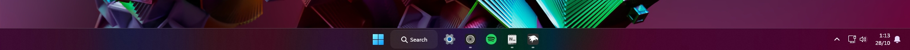
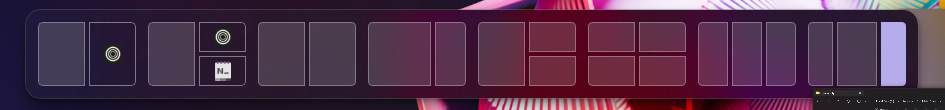

# Luminosity theme for Windows 11 Taskbar Styler

**Author**: [mendes.image](https://github.com/mendesimage)


## Intro
**Luminosity** is based on native Acrylic, using the maximum **TintLuminosityOpacity** value as its backdrop.

It's meant to be used with **Mica** or **MicaAlt** backdrops, with or without the **Translucent Windows** mod.

---

## Compact


- It's meant to be used with **Taskbar Labels for Windows 11**, using the **Centered Running Indicator** style. Otherwise, the indicator will clip into the icons.

<details>
<summary>Click to expand JSON content</summary>

```json
{
  "mode":"labelsWithoutCombining",
  "taskbarItemWidth":0,
  "runningIndicatorStyle":"centerDynamic",
  "progressIndicatorStyle":"centerDynamic",
  "excludedPrograms[0]":"excluded1.exe",
  "minimumTaskbarItemWidth":50,
  "maximumTaskbarItemWidth":176,
  "fontSize":12,
  "fontFamily":"",
  "textTrimming":"characterEllipsis",
  "leftAndRightPaddingSize":8,
  "spaceBetweenIconAndLabel":8,
  "runningIndicatorHeight":0,
  "runningIndicatorVerticalOffset":0,
  "alwaysShowThumbnailLabels":0,
  "labelForSingleItem":"%name%",
  "labelForMultipleItems":"[%amount%] %name%"
}
```

</details>


Also since the Taskbar is smaller, I recommend using **Taskbar Clock Customization**. 

<details>
<summary>Click to expand JSON content</summary>

```json
{
  "ShowSeconds":1,
  "TimeFormat":"",
  "DateFormat":"",
  "WeekdayFormat":"dddd",
  "WeekdayFormatCustom":"Sun, Mon, Tue, Wed, Thu, Fri, Sat",
  "TopLine":"%date%   %time%","BottomLine":"",
  "MiddleLine":"%weekday%",
  "TooltipLine":"",
  "Width":180,"Height":60,"MaxWidth":0,"TextSpacing":0,"WebContentsItems[0].Url":"https://rss.nytimes.com/services/xml/rss/nyt/World.xml",
  "WebContentsItems[0].BlockStart":"<item>",
  "WebContentsItems[0].Start":"<title>",
  "WebContentsItems[0].End":"</title>",
  "WebContentsItems[0].MaxLength":28,"WebContentsUpdateInterval":10,"TimeZones[0]":"Eastern Standard Time",
  "TimeStyle.Hidden":0,"TimeStyle.TextColor":"",
  "TimeStyle.TextAlignment":"",
  "TimeStyle.FontSize":0,"TimeStyle.FontFamily":"",
  "TimeStyle.FontWeight":"",
  "TimeStyle.FontStyle":"",
  "TimeStyle.FontStretch":"",
  "TimeStyle.CharacterSpacing":0,"DateStyle.Hidden":1,"DateStyle.TextColor":"",
  "DateStyle.TextAlignment":"",
  "DateStyle.FontSize":0,"DateStyle.FontFamily":"",
  "DateStyle.FontWeight":"",
  "DateStyle.FontStyle":"",
  "DateStyle.FontStretch":"",
  "DateStyle.CharacterSpacing":0,"oldTaskbarOnWin11":0,"DataCollectionUpdateInterval":1,"WebContentWeatherLocation":"",
  "WebContentWeatherFormat":"%c 🌡️%t 🌬️%w",
  "DataCollection.NetworkMetricsFormat":"mbs",
  "DataCollection.NetworkMetricsFixedDecimals":-1,"DataCollection.PercentageFormat":"spacePaddingAndSymbol",
  "DataCollection.UpdateInterval":1,"WebContentWeatherUnits":"autoDetect"
}
```

</details>


## Dock


- Unfortunately, the corner radius slightly limits the icon hitbox on the top and bottom, which makes it impossible to minimize windows by clicking in those areas.


### Classic


- Meant to cause minimal disruption for users who prefer the classic Taskbar placement.

---

## General Information

The theme changes the following elements:

- Taskbar
- Taskbar icons (compact version)
- Search icon with label
- System Tray
    - Icon sizes (compact version)
    - Chevron box
    - Software icon boxes
    - Microphone box
    - Spacing between element groups
    - Tray Overflow Flyout
- Alt+Tab window
- Win+Tab background and Virtual Desktops bar
- Snap Bar and Picker



- Volume bar


- Window preview flyout
- Context menus

---

## Known Issues

I didn't know how to fix these. I couldn't find the correct target names, or I'm not sure if they can even be changed.

- The Taskbar icon overflow flyout (when the taskbar is full) doesn't have a matching border brush and may not have Acrylic.
- The window preview doesn’t have a matching border brush, drop shadow corner radius, or "overlay layer." In the Start Menu, this layer is called **AcrylicOverlay**, which would be removed if I could.
- Some context menus doesn't have matching drop shadow corner radius.
- The search box has incorrect sizing in the Dock and Classic versions.
- The search box has incorrect everything in Compact mode.
- The Widget/Weather button icon and text have incorrect size and placement in Compact mode.

---

## Full Luminosity Theme
For that, download the listed mods and select "**Luminosity**" on each.
- Windows 11 Taskbar Styler
- Windows 11 Start Menu Styler
- Windows 11 Notification Center Styler
- Windows 11 File Explorer Styler

I also highly recommend **Translucent Windows** with **Mica** or **MicaAlt** selected as backdrop.

---

## Theme selection

The theme is integrated into the mod and can simply be selected from the mod's
settings:

* Open the Windows 11 Taskbar Styler mod in Windhawk.
* Go to the "Settings" tab.
* Select the theme and save the settings.

## Manual installation

The theme styles can also be imported manually. To do that, follow these steps:

* Open the Windows 11 Taskbar Styler mod in Windhawk.
* Go to the "Advanced" tab.
* Copy the content below to the text box under "Mod settings" and click "Save".

---

### Compact

<details>
<summary>Content to import (click to expand)</summary>

```json
{
  "controlStyles[0].target": "Taskbar.TaskbarFrame#TaskbarFrame",
  "controlStyles[0].styles[0]": "Height=30",
  "controlStyles[1].target": "Windows.UI.Xaml.Controls.Border#SearchPillBackgroundElement",
  "controlStyles[1].styles[0]": "CornerRadius=$bcr",
  "controlStyles[2].target": "SearchUx.SearchUI.SearchButtonControl",
  "controlStyles[2].styles[0]": "Margin=0,-4,0,-4",
  "controlStyles[3].target": "Windows.UI.Xaml.Controls.Image#Icon",
  "controlStyles[4].target": "Microsoft.UI.Xaml.Controls.AnimatedVisualPlayer#Icon",
  "controlStyles[3].styles[0]": "Width=16",
  "controlStyles[4].styles[0]": "Width=16",
  "controlStyles[3].styles[1]": "Height=16",
  "controlStyles[4].styles[1]": "Height=16",
  "controlStyles[5].target": "Grid#SystemTrayFrameGrid",
  "controlStyles[5].styles[0]": "Margin=0,0,0,18",
  "controlStyles[6].target": "Taskbar.TaskbarFrame > Grid#RootGrid > Taskbar.TaskbarBackground > Grid > Rectangle#BackgroundFill",
  "controlStyles[6].styles[0]": "Fill:=$mbg",
  "controlStyles[7].target": "Taskbar.TaskbarBackground#HoverFlyoutBackgroundControl > Grid > Rectangle#BackgroundFill",
  "controlStyles[7].styles[0]": "Fill:=$mbg",
  "controlStyles[8].target": "Taskbar.ExperienceToggleButton",
  "controlStyles[8].styles[0]": "CornerRadius=$bcr",
  "controlStyles[9].target": "Taskbar.TaskListButton",
  "controlStyles[9].styles[0]": "CornerRadius=$bcr",
  "controlStyles[10].target": "Border#OverflowFlyoutBackgroundBorder",
  "controlStyles[10].styles[0]": "Background:=$mbg",
  "controlStyles[10].styles[1]": "CornerRadius:=$wcr",
  "controlStyles[10].styles[2]": "BorderThickness=$bt",
  "controlStyles[10].styles[3]": "BorderBrush=$bb",
  "controlStyles[11].target": "MenuFlyoutPresenter > Border",
  "controlStyles[11].styles[0]": "Background:=$mbg",
  "controlStyles[11].styles[1]": "CornerRadius=$mcr",
  "controlStyles[11].styles[2]": "BorderThickness=$bt",
  "controlStyles[11].styles[3]": "BorderBrush=$bb",
  "controlStyles[12].target": "SystemTray.TextIconContent > Grid#ContainerGrid > SystemTray.AdaptiveTextBlock#Base > TextBlock#InnerTextBlock",
  "controlStyles[12].styles[0]": "FontSize=14",
  "controlStyles[13].target": "SystemTray.ImageIconContent > Grid#ContainerGrid > Image",
  "controlStyles[13].styles[0]": "Width=14",
  "controlStyles[13].styles[1]": "Height=14",
  "controlStyles[14].target": "SystemTray.NotifyIconView#NotifyItemIcon",
  "controlStyles[14].styles[0]": "CornerRadius=$bcr",
  "controlStyles[14].styles[1]": "Padding=2",
  "controlStyles[14].styles[2]": "Margin=0,2,0,2",
  "controlStyles[15].target": "SystemTray.ChevronIconView",
  "controlStyles[15].styles[0]": "CornerRadius=$bcr",
  "controlStyles[15].styles[1]": "Padding=2",
  "controlStyles[15].styles[2]": "Margin=0,2,0,2",
  "controlStyles[16].target": "SystemTray.OmniButton",
  "controlStyles[16].styles[0]": "Padding=2",
  "controlStyles[16].styles[1]": "CornerRadius=$bcr",
  "controlStyles[16].styles[2]": "Margin=0,2,0,2",
  "controlStyles[17].target": "Windows.UI.Xaml.Controls.Grid#ModalRootGrid > Windows.UI.Xaml.Controls.Border#BackgroundElement",
  "controlStyles[17].styles[0]": "Background:=$mbg",
  "controlStyles[17].styles[1]": "CornerRadius=$wcr",
  "controlStyles[17].styles[2]": "BorderThickness=$bt",
  "controlStyles[17].styles[3]": "BorderBrush=$bb",
  "controlStyles[18].target": "Windows.UI.Xaml.Controls.Grid#ConfirmatorMainGrid",
  "controlStyles[18].styles[0]": "Background:=$mbg",
  "controlStyles[18].styles[1]": "CornerRadius=$wcr",
  "controlStyles[18].styles[2]": "BorderThickness=$bt",
  "controlStyles[18].styles[3]": "BorderBrush=$bb",
  "controlStyles[19].target": "Windows.UI.Xaml.Controls.Border#SnapBarBorder",
  "controlStyles[19].styles[0]": "Background:=$mbg",
  "controlStyles[19].styles[1]": "CornerRadius=$mcr",
  "controlStyles[19].styles[2]": "RenderTransform:=<TranslateTransform X=\"0\" Y=\"-20\" />",
  "controlStyles[19].styles[3]": "Margin=0,0,0,-10",
  "controlStyles[20].target": "Windows.UI.Xaml.Controls.Border#SnapPickerBorder",
  "controlStyles[20].styles[0]": "Background:=$mbg",
  "controlStyles[20].styles[1]": "CornerRadius=$mcr",
  "controlStyles[20].styles[2]": "BorderThickness=$bt",
  "controlStyles[20].styles[3]": "BorderBrush=$bb",
  "controlStyles[21].target": "Windows.UI.Xaml.Controls.Border#BackgroundBorder",
  "controlStyles[21].styles[0]": "CornerRadius=$bcr",
  "controlStyles[22].target": "Windows.UI.Xaml.Controls.ToolTip > Windows.UI.Xaml.Controls.ContentPresenter#LayoutRoot",
  "controlStyles[22].styles[0]": "Background:=$mbg",
  "controlStyles[22].styles[1]": "CornerRadius=$mcr",
  "controlStyles[22].styles[2]": "BorderThickness=$bt",
  "controlStyles[22].styles[3]": "BorderBrush=$bb",
  "controlStyles[23].target": "Windows.UI.Xaml.Controls.Grid#HoverFlyoutGrid > Windows.UI.Xaml.Controls.Border#HoverFlyoutBackground",
  "controlStyles[23].styles[0]": "Background:=$mbg",
  "controlStyles[23].styles[1]": "CornerRadius=17",
  "controlStyles[24].target": "Windows.UI.Xaml.Hosting.DesktopWindowXamlSource",
  "controlStyles[24].styles[0]": "CornerRadius=$wcr",
  "controlStyles[25].target": "WindowsInternal.ComposableShell.Experiences.Switcher.VirtualDesktopBarElement#VirtualDesktopBar > Grid > Border",
  "controlStyles[25].styles[0]": "CornerRadius=$wcr",
  "controlStyles[26].target": "WindowsInternal.ComposableShell.Experiences.Switcher.VirtualDesktopBarElement#VirtualDesktopBar",
  "controlStyles[26].styles[0]": "Width=Auto",
  "controlStyles[26].styles[1]": "Visibility=Visible",
  "controlStyles[26].styles[2]": "MaxWidth:=900",
  "controlStyles[26].styles[3]": "BorderThickness=$bt",
  "controlStyles[26].styles[4]": "BorderBrush=$bb",
  "controlStyles[27].target": "Windows.UI.Xaml.Controls.Border#BackgroundDimmingLayer",
  "controlStyles[27].styles[0]": "Background:=<WindhawkBlur BlurAmount=\"30\" TintColor=\"#00000000\" />",
  "controlStyles[28].target": "Taskbar.TaskListButtonPanel#ExperienceToggleButtonRootPanel > Windows.UI.Xaml.Controls.Border#BackgroundElement",
  "controlStyles[28].styles[0]": "CornerRadius=$bcr",
  "controlStyles[29].target": "Taskbar.TaskItemThumbnailView > Grid@CommonStates > Border#BackgroundBorder",
  "controlStyles[29].styles[0]": "CornerRadius=$mcr",
  "controlStyles[29].styles[1]": "BorderThickness=$bt",
  "controlStyles[29].styles[2]": "BorderBrush=$bb",
  "controlStyles[30].target": "Windows.UI.Xaml.Controls.Border#LargeTicker1",
  "controlStyles[30].styles[0]": "Margin=1,-7,0,0",
  "controlStyles[30].styles[1]": "RenderTransform:=<ScaleTransform ScaleX=\"0.75\" ScaleY=\"0.75\" />",
  "controlStyles[31].target": "Windows.UI.Xaml.Controls.Grid#MainGrid",
  "controlStyles[31].styles[0]": "CornerRadius=$mcr",
  "controlStyles[31].styles[1]": "BorderThickness=$bt",
  "controlStyles[31].styles[2]": "BorderBrush=$bb",
  "controlStyles[32].target": "Windows.UI.Xaml.Controls.Button#VirtualDesktopElementCloseButton",
  "controlStyles[32].styles[0]": "CornerRadius=$bcr",
  "controlStyles[33].target": "Windows.UI.Xaml.Controls.Button#CloseButton",
  "controlStyles[33].styles[0]": "CornerRadius=$mcr",
  "styleConstants[0]": "mbg=<AcrylicBrush TintColor=\"{ThemeResource CardStrokeColorDefaultSolid}\" FallbackColor=\"{ThemeResource CardStrokeColorDefaultSolid}\" TintOpacity=\"0.0\" TintLuminosityOpacity=\"1.0\" Opacity=\"1\"/>",
  "styleConstants[1]": "bcr=10",
  "styleConstants[2]": "wcr=20",
  "styleConstants[3]": "mcr=15",
  "styleConstants[4]": "t=Transparent",
  "styleConstants[5]": "bb=#20FFFFFF",
  "styleConstants[6]": "bt=1"
}
```
</details>

---

### Dock

<details>
<summary>Content to import (click to expand)</summary>

```json
{
  "controlStyles[0].target": "Windows.UI.Xaml.Controls.Border#SearchPillBackgroundElement",
  "controlStyles[0].styles[0]": "CornerRadius=$bcr",
  "controlStyles[1].target": "SearchUx.SearchUI.SearchButtonControl",
  "controlStyles[1].styles[0]": "Margin=0,-4,0,-4",
  "controlStyles[2].target": "Grid#SystemTrayFrameGrid",
  "controlStyles[2].styles[0]": "Margin=0,0,0,0",
  "controlStyles[3].target": "Taskbar.TaskbarFrame > Grid#RootGrid > Taskbar.TaskbarBackground > Grid > Rectangle#BackgroundFill",
  "controlStyles[3].styles[0]": "Fill:=$mbg",
  "controlStyles[4].target": "Taskbar.TaskbarBackground#HoverFlyoutBackgroundControl > Grid > Rectangle#BackgroundFill",
  "controlStyles[4].styles[0]": "Fill:=$mbg",
  "controlStyles[5].target": "Taskbar.ExperienceToggleButton",
  "controlStyles[5].styles[0]": "CornerRadius=$bcr",
  "controlStyles[6].target": "Taskbar.TaskListButton",
  "controlStyles[6].styles[0]": "CornerRadius=$bcr",
  "controlStyles[7].target": "Border#OverflowFlyoutBackgroundBorder",
  "controlStyles[7].styles[0]": "Background:=$mbg",
  "controlStyles[7].styles[1]": "CornerRadius:=$wcr",
  "controlStyles[7].styles[2]": "BorderThickness=$bt",
  "controlStyles[7].styles[3]": "BorderBrush=$bb",
  "controlStyles[8].target": "MenuFlyoutPresenter > Border",
  "controlStyles[8].styles[0]": "Background:=$mbg",
  "controlStyles[8].styles[1]": "CornerRadius=$mcr",
  "controlStyles[8].styles[2]": "BorderThickness=$bt",
  "controlStyles[8].styles[3]": "BorderBrush=$bb",
  "controlStyles[9].target": "SystemTray.NotifyIconView#NotifyItemIcon",
  "controlStyles[9].styles[0]": "CornerRadius=$bcr",
  "controlStyles[9].styles[1]": "Padding=2",
  "controlStyles[9].styles[2]": "Margin=0,2,0,2",
  "controlStyles[10].target": "SystemTray.ChevronIconView",
  "controlStyles[10].styles[0]": "CornerRadius=$bcr",
  "controlStyles[10].styles[1]": "Padding=2",
  "controlStyles[10].styles[2]": "Margin=0,2,0,2",
  "controlStyles[11].target": "SystemTray.OmniButton",
  "controlStyles[11].styles[0]": "Padding=2",
  "controlStyles[11].styles[1]": "CornerRadius=$bcr",
  "controlStyles[11].styles[2]": "Margin=0,2,0,2",
  "controlStyles[12].target": "Windows.UI.Xaml.Controls.Grid#ModalRootGrid > Windows.UI.Xaml.Controls.Border#BackgroundElement",
  "controlStyles[12].styles[0]": "Background:=$mbg",
  "controlStyles[12]styles[1]": "CornerRadius=$wcr",
  "controlStyles[12].styles[2]": "BorderThickness=$bt",
  "controlStyles[12].styles[3]": "BorderBrush=$bb",
  "controlStyles[13].target": "Windows.UI.Xaml.Controls.Grid#ConfirmatorMainGrid",
  "controlStyles[13].styles[0]": "Background:=$mbg",
  "controlStyles[13].styles[1]": "CornerRadius=$wcr",
  "controlStyles[13].styles[2]": "BorderThickness=$bt",
  "controlStyles[13].styles[3]": "BorderBrush=$bb",
  "controlStyles[14].target": "Windows.UI.Xaml.Controls.Border#SnapBarBorder",
  "controlStyles[14].styles[0]": "Background:=$mbg",
  "controlStyles[14].styles[1]": "CornerRadius=$mcr",
  "controlStyles[14].styles[2]": "RenderTransform:=<TranslateTransform X=\"0\" Y=\"-20\" />",
  "controlStyles[14].styles[3]": "Margin=0,0,0,-10",
  "controlStyles[15].target": "Windows.UI.Xaml.Controls.Border#SnapPickerBorder",
  "controlStyles[15].styles[0]": "Background:=$mbg",
  "controlStyles[15].styles[1]": "CornerRadius=$mcr",
  "controlStyles[15].styles[2]": "BorderThickness=$bt",
  "controlStyles[15].styles[3]": "BorderBrush=$bb",
  "controlStyles[16].target": "Windows.UI.Xaml.Controls.Border#BackgroundBorder",
  "controlStyles[16].styles[0]": "CornerRadius=$bcr",
  "controlStyles[17].target": "Windows.UI.Xaml.Controls.ToolTip > Windows.UI.Xaml.Controls.ContentPresenter#LayoutRoot",
  "controlStyles[17].styles[0]": "Background:=$mbg",
  "controlStyles[17].styles[1]": "CornerRadius=$mcr",
  "controlStyles[17].styles[2]": "BorderThickness=$bt",
  "controlStyles[17].styles[3]": "BorderBrush=$bb",
  "controlStyles[18].target": "Windows.UI.Xaml.Controls.Grid#HoverFlyoutGrid > Windows.UI.Xaml.Controls.Border#HoverFlyoutBackground",
  "controlStyles[18].styles[0]": "Background:=$mbg",
  "controlStyles[18].styles[1]": "CornerRadius=17",
  "controlStyles[19].target": "Windows.UI.Xaml.Hosting.DesktopWindowXamlSource",
  "controlStyles[19].styles[0]": "CornerRadius=$wcr",
  "controlStyles[20].target": "WindowsInternal.ComposableShell.Experiences.Switcher.VirtualDesktopBarElement#VirtualDesktopBar > Grid > Border",
  "controlStyles[20].styles[0]": "CornerRadius=$wcr",
  "controlStyles[21].target": "WindowsInternal.ComposableShell.Experiences.Switcher.VirtualDesktopBarElement#VirtualDesktopBar",
  "controlStyles[21].styles[0]": "Width=Auto",
  "controlStyles[21].styles[1]": "MaxWidth:=900",
  "controlStyles[21].styles[2]": "BorderThickness=$bt",
  "controlStyles[21].styles[3]": "BorderBrush=$bb",
  "controlStyles[22].target": "Windows.UI.Xaml.Controls.Border#BackgroundDimmingLayer",
  "controlStyles[22].styles[0]": "Background=<WindhawkBlur BlurAmount=\"30\" TintColor=\"#00000000\" />",
  "controlStyles[23].target": "Taskbar.TaskListButtonPanel#ExperienceToggleButtonRootPanel > Windows.UI.Xaml.Controls.Border#BackgroundElement",
  "controlStyles[23].styles[0]": "CornerRadius=$bcr",
  "controlStyles[24].target": "Taskbar.TaskItemThumbnailView > Grid@CommonStates > Border#BackgroundBorder",
  "controlStyles[24].styles[0]": "CornerRadius=$mcr",
  "controlStyles[24].styles[1]": "BorderThickness=$bt",
  "controlStyles[24].styles[2]": "BorderBrush=$bb",
  "controlStyles[25].target": "Windows.UI.Xaml.Controls.Border#MultiWindowElement",
  "controlStyles[25].styles[0]": "CornerRadius=$bcr",
  "controlStyles[25].styles[1]": "Margin=0,1,0,1",
  "controlStyles[26].target": "Windows.UI.Xaml.Controls.Grid#MainGrid",
  "controlStyles[26].styles[0]": "CornerRadius=$mcr",
  "controlStyles[26].styles[1]": "BorderThickness=$bt",
  "controlStyles[26].styles[2]": "BorderBrush=$bb",
  "controlStyles[27].target": "Windows.UI.Xaml.Controls.Button#VirtualDesktopElementCloseButton",
  "controlStyles[27].styles[0]": "CornerRadius=$bcr",
  "controlStyles[28].target": "Windows.UI.Xaml.Controls.Button#CloseButton",
  "controlStyles[28].styles[0]": "CornerRadius=$mcr",
  "styleConstants[0]": "mbg=<AcrylicBrush TintColor=\"{ThemeResource CardStrokeColorDefaultSolid}\" FallbackColor=\"{ThemeResource CardStrokeColorDefaultSolid}\" TintOpacity=\"0.0\" TintLuminosityOpacity=\"1.0\" Opacity=\"1\"/>",
  "styleConstants[1]": "bcr=10",
  "styleConstants[2]": "wcr=20",
  "styleConstants[3]": "mcr=15",
  "styleConstants[4]": "t=Transparent",
  "styleConstants[5]": "bb=#20FFFFFF",
  "styleConstants[6]": "bt=1",
  "controlStyles[29].target": "Taskbar.TaskbarFrame#TaskbarFrame",
  "controlStyles[29].styles[0]": "Height=53",
  "controlStyles[30].target": "Taskbar.TaskbarFrame#TaskbarFrame > Grid#RootGrid",
  "controlStyles[30].styles[0]": "Margin=5,0,5,5",
  "controlStyles[30].styles[1]": "BorderThickness=1",
  "controlStyles[30].styles[2]": "BorderBrush:=#20FFFFFF",
  "controlStyles[30].styles[3]": "CornerRadius=15",
  "controlStyles[31].target": "Taskbar.TaskbarBackground#BackgroundControl > Windows.UI.Xaml.Controls.Grid > Windows.UI.Xaml.Shapes.Rectangle#BackgroundStroke",
  "controlStyles[31].styles[0]": "Visibility=Collapsed",
  "controlStyles[32].target": "Grid#SystemTrayFrameGrid",
  "controlStyles[32].styles[0]": "Margin=0,-2,6,5"
}
```
</details>

---

### Classic

<details>
<summary>Content to import (click to expand)</summary>

```json
{
  "controlStyles[0].target": "Windows.UI.Xaml.Controls.Border#SearchPillBackgroundElement",
  "controlStyles[0].styles[0]": "CornerRadius=$bcr",
  "controlStyles[1].target": "SearchUx.SearchUI.SearchButtonControl",
  "controlStyles[1].styles[0]": "Margin=0,-4,0,-4",
  "controlStyles[2].target": "Grid#SystemTrayFrameGrid",
  "controlStyles[2].styles[0]": "Margin=0,0,0,0",
  "controlStyles[3].target": "Taskbar.TaskbarFrame > Grid#RootGrid > Taskbar.TaskbarBackground > Grid > Rectangle#BackgroundFill",
  "controlStyles[3].styles[0]": "Fill:=$mbg",
  "controlStyles[4].target": "Taskbar.TaskbarBackground#HoverFlyoutBackgroundControl > Grid > Rectangle#BackgroundFill",
  "controlStyles[4].styles[0]": "Fill:=$mbg",
  "controlStyles[5].target": "Taskbar.ExperienceToggleButton",
  "controlStyles[5].styles[0]": "CornerRadius=$bcr",
  "controlStyles[6].target": "Taskbar.TaskListButton",
  "controlStyles[6].styles[0]": "CornerRadius=$bcr",
  "controlStyles[7].target": "Border#OverflowFlyoutBackgroundBorder",
  "controlStyles[7].styles[0]": "Background:=$mbg",
  "controlStyles[7].styles[1]": "CornerRadius:=$wcr",
  "controlStyles[7].styles[2]": "BorderThickness=$bt",
  "controlStyles[7].styles[3]": "BorderBrush=$bb",
  "controlStyles[8].target": "MenuFlyoutPresenter > Border",
  "controlStyles[8].styles[0]": "Background:=$mbg",
  "controlStyles[8].styles[1]": "CornerRadius=$mcr",
  "controlStyles[8].styles[2]": "BorderThickness=$bt",
  "controlStyles[8].styles[3]": "BorderBrush=$bb",
  "controlStyles[9].target": "SystemTray.NotifyIconView#NotifyItemIcon",
  "controlStyles[9].styles[0]": "CornerRadius=$bcr",
  "controlStyles[9].styles[1]": "Padding=2",
  "controlStyles[9].styles[2]": "Margin=0,2,0,2",
  "controlStyles[10].target": "SystemTray.ChevronIconView",
  "controlStyles[10].styles[0]": "CornerRadius=$bcr",
  "controlStyles[10].styles[1]": "Padding=2",
  "controlStyles[10].styles[2]": "Margin=0,2,0,2",
  "controlStyles[11].target": "SystemTray.OmniButton",
  "controlStyles[11].styles[0]": "Padding=2",
  "controlStyles[11].styles[1]": "CornerRadius=$bcr",
  "controlStyles[11].styles[2]": "Margin=0,2,0,2",
  "controlStyles[12].target": "Windows.UI.Xaml.Controls.Grid#ModalRootGrid > Windows.UI.Xaml.Controls.Border#BackgroundElement",
  "controlStyles[12].styles[0]": "Background:=$mbg",
  "controlStyles[12]styles[1]": "CornerRadius=$wcr",
  "controlStyles[12].styles[2]": "BorderThickness=$bt",
  "controlStyles[12].styles[3]": "BorderBrush=$bb",
  "controlStyles[13].target": "Windows.UI.Xaml.Controls.Grid#ConfirmatorMainGrid",
  "controlStyles[13].styles[0]": "Background:=$mbg",
  "controlStyles[13].styles[1]": "CornerRadius=$wcr",
  "controlStyles[13].styles[2]": "BorderThickness=$bt",
  "controlStyles[13].styles[3]": "BorderBrush=$bb",
  "controlStyles[14].target": "Windows.UI.Xaml.Controls.Border#SnapBarBorder",
  "controlStyles[14].styles[0]": "Background:=$mbg",
  "controlStyles[14].styles[1]": "CornerRadius=$mcr",
  "controlStyles[14].styles[2]": "RenderTransform:=<TranslateTransform X=\"0\" Y=\"-20\" />",
  "controlStyles[14].styles[3]": "Margin=0,0,0,-10",
  "controlStyles[15].target": "Windows.UI.Xaml.Controls.Border#SnapPickerBorder",
  "controlStyles[15].styles[0]": "Background:=$mbg",
  "controlStyles[15].styles[1]": "CornerRadius=$mcr",
  "controlStyles[15].styles[2]": "BorderThickness=$bt",
  "controlStyles[15].styles[3]": "BorderBrush=$bb",
  "controlStyles[16].target": "Windows.UI.Xaml.Controls.Border#BackgroundBorder",
  "controlStyles[16].styles[0]": "CornerRadius=$bcr",
  "controlStyles[17].target": "Windows.UI.Xaml.Controls.ToolTip > Windows.UI.Xaml.Controls.ContentPresenter#LayoutRoot",
  "controlStyles[17].styles[0]": "Background:=$mbg",
  "controlStyles[17].styles[1]": "CornerRadius=$mcr",
  "controlStyles[17].styles[2]": "BorderThickness=$bt",
  "controlStyles[17].styles[3]": "BorderBrush=$bb",
  "controlStyles[18].target": "Windows.UI.Xaml.Controls.Grid#HoverFlyoutGrid > Windows.UI.Xaml.Controls.Border#HoverFlyoutBackground",
  "controlStyles[18].styles[0]": "Background:=$mbg",
  "controlStyles[18].styles[1]": "CornerRadius=17",
  "controlStyles[19].target": "Windows.UI.Xaml.Hosting.DesktopWindowXamlSource",
  "controlStyles[19].styles[0]": "CornerRadius=$wcr",
  "controlStyles[20].target": "WindowsInternal.ComposableShell.Experiences.Switcher.VirtualDesktopBarElement#VirtualDesktopBar > Grid > Border",
  "controlStyles[20].styles[0]": "CornerRadius=$wcr",
  "controlStyles[21].target": "WindowsInternal.ComposableShell.Experiences.Switcher.VirtualDesktopBarElement#VirtualDesktopBar",
  "controlStyles[21].styles[0]": "Width=Auto",
  "controlStyles[21].styles[1]": "MaxWidth:=900",
  "controlStyles[21].styles[2]": "BorderThickness=$bt",
  "controlStyles[21].styles[3]": "BorderBrush=$bb",
  "controlStyles[22].target": "Windows.UI.Xaml.Controls.Border#BackgroundDimmingLayer",
  "controlStyles[22].styles[0]": "Background=<WindhawkBlur BlurAmount=\"30\" TintColor=\"#00000000\" />",
  "controlStyles[23].target": "Taskbar.TaskListButtonPanel#ExperienceToggleButtonRootPanel > Windows.UI.Xaml.Controls.Border#BackgroundElement",
  "controlStyles[23].styles[0]": "CornerRadius=$bcr",
  "controlStyles[24].target": "Taskbar.TaskItemThumbnailView > Grid@CommonStates > Border#BackgroundBorder",
  "controlStyles[24].styles[0]": "CornerRadius=$mcr",
  "controlStyles[24].styles[1]": "BorderThickness=$bt",
  "controlStyles[24].styles[2]": "BorderBrush=$bb",
  "controlStyles[25].target": "Windows.UI.Xaml.Controls.Border#MultiWindowElement",
  "controlStyles[25].styles[0]": "CornerRadius=$bcr",
  "controlStyles[25].styles[1]": "Margin=0,1,0,1",
  "controlStyles[26].target": "Windows.UI.Xaml.Controls.Grid#MainGrid",
  "controlStyles[26].styles[0]": "CornerRadius=$mcr",
  "controlStyles[26].styles[1]": "BorderThickness=$bt",
  "controlStyles[26].styles[2]": "BorderBrush=$bb",
  "controlStyles[27].target": "Windows.UI.Xaml.Controls.Button#VirtualDesktopElementCloseButton",
  "controlStyles[27].styles[0]": "CornerRadius=$bcr",
  "controlStyles[28].target": "Windows.UI.Xaml.Controls.Button#CloseButton",
  "controlStyles[28].styles[0]": "CornerRadius=$mcr",
  "styleConstants[0]": "mbg=<AcrylicBrush TintColor=\"{ThemeResource CardStrokeColorDefaultSolid}\" FallbackColor=\"{ThemeResource CardStrokeColorDefaultSolid}\" TintOpacity=\"0.0\" TintLuminosityOpacity=\"1.0\" Opacity=\"1\"/>",
  "styleConstants[1]": "bcr=10",
  "styleConstants[2]": "wcr=20",
  "styleConstants[3]": "mcr=15",
  "styleConstants[4]": "t=Transparent",
  "styleConstants[5]": "bb=#20FFFFFF",
  "styleConstants[6]": "bt=1"
}
```
</details>
