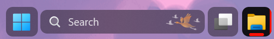
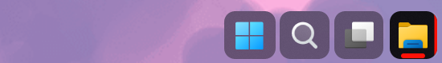

# Matter theme for Windows 11 Taskbar Styler

**Author**: [ZoraizLajwer](https://github.com/ZoraizLajwer)

 \


 \


## Note
Small Icon next to weather icon in centered taskbar is not part of theme, its a separate **Rainmeter skin**, you can download it from
[Spotibar](https://github.com/ZoraizLajwer/spotibar).

## Windows Settings
- Dark Mode
- Install Tektur font from Google font (required for clock customization)

## Required Windhawk Mods for similar results
To achieve similar results, install and configure the following Windhawk mods in addition to Taskbar Styler:

- Taskbar Clock Customization – for styling the clock.

<details>
<summary>Click to expand JSON content</summary>

```json
{
  "ShowSeconds": 1,
  "TimeFormat": "hh':'mm':'ss tt",
  "DateFormat": "ddd' -' MMM dd",
  "WeekdayFormat": "dddd",
  "TopLine": "%date%",
  "BottomLine": "%time%",
  "MiddleLine": "%weekday%",
  "Width": 180,
  "Height": 60,
  "MaxWidth": 0,
  "TextSpacing": -1,
  "WebContentsUpdateInterval": 10,
  "TimeStyle.Visible": 1,
  "TimeStyle.TextAlignment": "Center",
  "TimeStyle.FontSize": 0,
  "TimeStyle.FontFamily": "Tektur",
  "TimeStyle.FontWeight": "Medium",
  "TimeStyle.CharacterSpacing": 0,
  "DateStyle.TextAlignment": "Center",
  "DateStyle.FontSize": 0,
  "DateStyle.FontFamily": "Tektur",
  "DateStyle.FontWeight": "Medium",
  "DateStyle.CharacterSpacing": 0,
  "oldTaskbarOnWin11": 0
}
```
</details>

---

- Taskbar Height and Icon Size
  - To make button square set `Taskbar Button Width` = 45
<!-- Uncomment once the theme is integrated into the mod.
## Theme selection

The theme is integrated into the mod, and can be simply selected from the mod's
settings:

* Open the Windows 11 Taskbar Styler mod in Windhawk.
* Go to the "Settings" tab.
* Select the theme and save the settings.

## Manual installation

The theme styles can also be imported manually. To do that, follow these steps:
-->
## Manual installation

The theme styles can be imported manually. To do that, follow these steps:

* Open the Windows 11 Taskbar Styler mod in Windhawk.
* Go to the "Advanced" tab.
* Copy the content below to the text box under "Mod settings" and click "Save".

<details>
<summary>Content to import (click to expand)</summary>

```json
{
  "controlStyles[0].target": "Taskbar.TaskbarFrame > Grid#RootGrid > Taskbar.TaskbarBackground > Grid > Rectangle#BackgroundFill",
  "controlStyles[0].styles[0]": "Fill = Transparent",
  "controlStyles[1].target": "Rectangle#BackgroundStroke",
  "controlStyles[1].styles[0]": "Fill = Transparent",
  "controlStyles[2].target": "Taskbar.TaskbarBackground#HoverFlyoutBackgroundControl > Grid > Rectangle#BackgroundFill",
  "controlStyles[2].styles[0]": "Fill:=<AcrylicBrush TintOpacity=\"0\" TintColor=\"Black\" TintLuminosityOpacity=\"0.4\" Opacity=\"1\" FallbackColor=\"#262626\"/>",
  "controlStyles[3].target": "Taskbar.AugmentedEntryPointButton#AugmentedEntryPointButton",
  "controlStyles[3].styles[0]": "Margin=-1,1,1,1",
  "controlStyles[4].target": "Taskbar.TaskListButtonPanel@CommonStates > Border#BackgroundElement",
  "controlStyles[4].styles[0]": "CornerRadius=9",
  "controlStyles[4].styles[1]": "Background:=<AcrylicBrush TintOpacity=\"0\" TintColor=\"Black\" TintLuminosityOpacity=\"0.4\" Opacity=\"1\" FallbackColor=\"#262626\"/>",
  "controlStyles[4].styles[2]": "Background@InactivePointerOver:=<AcrylicBrush TintOpacity=\"0\" TintColor=\"Black\" TintLuminosityOpacity=\"0.6\" Opacity=\"1\" FallbackColor=\"#0d0d0d\"/>",
  "controlStyles[4].styles[3]": "Background@ActivePointerOver:=<AcrylicBrush TintOpacity=\"0\" TintColor=\"Black\" TintLuminosityOpacity=\"0.4\" Opacity=\"1\" FallbackColor=\"#262626\"/>",
  "controlStyles[4].styles[4]": "Background@ActiveNormal:=<AcrylicBrush TintOpacity=\"0\" TintColor=\"Black\" TintLuminosityOpacity=\"0.6\" Opacity=\"1\" FallbackColor=\"#0d0d0d\"/>",
  "controlStyles[5].target": "Taskbar.ExperienceToggleButton#LaunchListButton[AutomationProperties.Name=Task View]",
  "controlStyles[5].styles[0]": "Margin=0,0,0,0",
  "controlStyles[6].target": "Taskbar.TaskListButton#TaskListButton[AutomationProperties.Name=Copilot] > Taskbar.TaskListLabeledButtonPanel#IconPanel > Border#BackgroundElement",
  "controlStyles[6].styles[0]": "Background:=<AcrylicBrush TintColor=\"Red\" TintOpacity=\"0.8\" />",
  "controlStyles[7].target": "Taskbar.SearchBoxButton",
  "controlStyles[7].styles[0]": "Margin=0,0,0,0",
  "controlStyles[8].target": "Border#BackgroundElement",
  "controlStyles[8].styles[0]": "BorderThickness=0",
  "controlStyles[9].target": "Taskbar.TaskListLabeledButtonPanel@CommonStates > Border#BackgroundElement",
  "controlStyles[9].styles[0]": "Background@InactiveNormal:=<AcrylicBrush TintOpacity=\"0\" TintColor=\"Black\" TintLuminosityOpacity=\"0.4\" Opacity=\"1\" FallbackColor=\"#262626\"/>",
  "controlStyles[9].styles[1]": "Background@ActiveNormal:=<AcrylicBrush TintOpacity=\"0\" TintColor=\"Black\" TintLuminosityOpacity=\"0.9\" Opacity=\"1\" FallbackColor=\"#0d0d0d\"/>",
  "controlStyles[9].styles[2]": "Background@InactivePointerOver:=<AcrylicBrush TintOpacity=\"0\" TintColor=\"Black\" TintLuminosityOpacity=\"0.6\" Opacity=\"1\" FallbackColor=\"#0d0d0d\"/>",
  "controlStyles[9].styles[3]": "Background@ActivePointerOver:=<AcrylicBrush TintOpacity=\"0\" TintColor=\"Black\" TintLuminosityOpacity=\"0.5\" Opacity=\"1\" FallbackColor=\"#262626\"/>",
  "controlStyles[9].styles[4]": "CornerRadius=9",
  "controlStyles[9].styles[5]": "Margin =1,0,1,0",
  "controlStyles[9].styles[6]": "Background@MultiWindowNormal:=<AcrylicBrush TintOpacity=\"0\" TintColor=\"Black\" TintLuminosityOpacity=\"0.4\" Opacity=\"1\" FallbackColor=\"#262626\"/>",
  "controlStyles[9].styles[7]": "Background@MultiWindowPointerOver:=<AcrylicBrush TintOpacity=\"0\" TintColor=\"Black\" TintLuminosityOpacity=\"0.6\" Opacity=\"1\" FallbackColor=\"#0d0d0d\"/>",
  "controlStyles[9].styles[8]": "Background@MultiWindowActive:=<AcrylicBrush TintOpacity=\"0\" TintColor=\"Black\" TintLuminosityOpacity=\"0.9\" Opacity=\"1\" FallbackColor=\"#0d0d0d\"/>",
  "controlStyles[9].styles[9]": "Background@MultiWindowPressed:=<AcrylicBrush TintOpacity=\"0\" TintColor=\"Black\" TintLuminosityOpacity=\"0.5\" Opacity=\"1\" FallbackColor=\"#262626\"/>",
  "controlStyles[10].target": "Border#MultiWindowElement",
  "controlStyles[10].styles[0]": "CornerRadius = 8",
  "controlStyles[10].styles[1]": "Padding = 7,0,8,0",
  "controlStyles[10].styles[2]": "Background:=<SolidColorBrush Color=\"{ThemeResource SystemAccentColorLight1}\" />",
  "controlStyles[11].target": "Taskbar.TaskListLabeledButtonPanel > TextBlock#LabelControl",
  "controlStyles[11].styles[0]": "Margin=0,0,2,0",
  "controlStyles[12].target": "Taskbar.TaskListLabeledButtonPanel@RunningIndicatorStates > Rectangle#RunningIndicator",
  "controlStyles[12].styles[0]": "Fill=White",
  "controlStyles[12].styles[1]": "RadiusX=2",
  "controlStyles[12].styles[2]": "RadiusY=2",
  "controlStyles[12].styles[3]": "Height=4",
  "controlStyles[12].styles[4]": "Width=10",
  "controlStyles[12].styles[5]": "Fill@ActiveRunningIndicator:=<SolidColorBrush Color=\"{ThemeResource SystemAccentColorLight1}\" />",
  "controlStyles[12].styles[6]": "Width@ActiveRunningIndicator=20",
  "controlStyles[13].target": "Grid#SystemTrayFrameGrid",
  "controlStyles[13].styles[0]": "Background:=<AcrylicBrush TintOpacity=\"0\" TintColor=\"Black\" TintLuminosityOpacity=\"0.4\" Opacity=\"1\" FallbackColor=\"#262626\"/>",
  "controlStyles[13].styles[1]": "CornerRadius=10",
  "controlStyles[13].styles[2]": "Margin=0,5,12,5",
  "controlStyles[13].styles[3]": "Padding=10,0,0,0",
  "controlStyles[14].target": "Border#BackgroundBorder",
  "controlStyles[14].styles[0]": "Margin=2,5,2,5",
  "controlStyles[14].styles[1]": "CornerRadius=8",
  "controlStyles[15].target": "Grid#OverflowRootGrid > Border",
  "controlStyles[15].styles[0]": "Background:=<AcrylicBrush TintOpacity=\"0\" TintColor=\"Black\" TintLuminosityOpacity=\"0.4\" Opacity=\"1\" FallbackColor=\"#262626\"/>",
  "controlStyles[14].styles[2]": "BorderThickness = 0"
}
```
</details>
