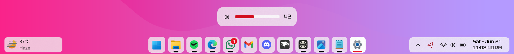
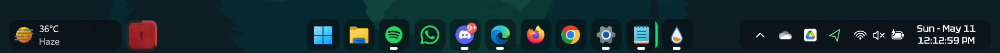
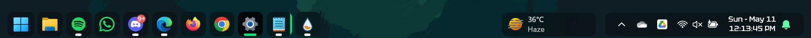
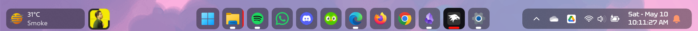
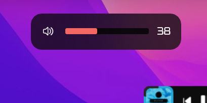
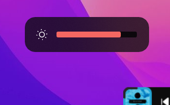

# Matter theme for Windows 11 Taskbar Styler

**Author**: [ZoraizLajwer](https://github.com/ZoraizLajwer)

## Light Mode


## Dark Mode




 


## Note
Small icon next to the weather icon is not part of the theme; it's a separate **Rainmeter skin**, another project of mine. You can download it from
[Spotibar](https://github.com/ZoraizLajwer/spotibar).

## Better to Know
- Theme is designed on Windows 11 - 23H2
- Compatible with both light and dark mode
- Install the [Tektur](https://fonts.google.com/specimen/Tektur) font from Google Fonts (required for clock customization)

## Required Windhawk Mods for similar results
To achieve similar results, install and configure the following Windhawk mods in addition to Taskbar Styler:

- Taskbar Clock Customization – for styling the clock.

<details>
<summary>Click to expand JSON content</summary>

```json
{
  "ShowSeconds": 1,
  "TimeFormat": "hh':'mm':'ss tt",
  "DateFormat": "ddd' -' MMM dd",
  "WeekdayFormat": "dddd",
  "TopLine": "%date%",
  "BottomLine": "%time%",
  "MiddleLine": "%weekday%",
  "TooltipLine": "",
  "Width": 180,
  "Height": 60,
  "MaxWidth": 0,
  "TextSpacing": -1,
  "WebContentsUpdateInterval": 10,
  "TimeStyle.Visible": 1,
  "TimeStyle.TextColor": "",
  "TimeStyle.TextAlignment": "Center",
  "TimeStyle.FontSize": 0,
  "TimeStyle.FontFamily": "Tektur",
  "TimeStyle.FontWeight": "Medium",
  "TimeStyle.FontStyle": "",
  "TimeStyle.FontStretch": "",
  "TimeStyle.CharacterSpacing": 0,
  "DateStyle.TextColor": "",
  "DateStyle.TextAlignment": "Center",
  "DateStyle.FontSize": 0,
  "DateStyle.FontFamily": "Tektur",
  "DateStyle.FontWeight": "Medium",
  "DateStyle.FontStyle": "",
  "DateStyle.FontStretch": "",
  "DateStyle.CharacterSpacing": 0,
  "oldTaskbarOnWin11": 0
}
```
</details>

---

- Taskbar Height and Icon Size
  - To make button square set `Taskbar Button Width` = 45
  - `Icon Size` = 23
  - `Taskbar Height` = 48 

## Theme selection

The theme is integrated into the mod and can simply be selected from the mod's
settings:

* Open the Windows 11 Taskbar Styler mod in Windhawk.
* Go to the "Settings" tab.
* Select the theme and save the settings.

## Manual installation

The theme styles can also be imported manually. To do that, follow these steps:

* Open the Windows 11 Taskbar Styler mod in Windhawk.
* Go to the "Advanced" tab.
* Copy the content below to the text box under "Mod settings" and click "Save".

<details>
<summary>Content to import (click to expand)</summary>

```json
{
  "controlStyles[0].target": "Taskbar.TaskbarFrame > Grid#RootGrid > Taskbar.TaskbarBackground > Grid > Rectangle#BackgroundFill",
  "controlStyles[0].styles[0]": "Fill := $transparent",
  "controlStyles[1].target": "Rectangle#BackgroundStroke",
  "controlStyles[1].styles[0]": "Fill := $transparent",
  "controlStyles[2].target": "Taskbar.TaskbarBackground#HoverFlyoutBackgroundControl",
  "controlStyles[2].styles[0]": "Fill:=$base",
  "controlStyles[2].styles[1]": "CornerRadius = $mainRadius",
  "controlStyles[3].target": " Taskbar.AugmentedEntryPointButton#AugmentedEntryPointButton",
  "controlStyles[3].styles[0]": "Margin=-1,1,1,1",
  "controlStyles[4].target": "Taskbar.TaskListButtonPanel@CommonStates > Border#BackgroundElement",
  "controlStyles[4].styles[0]": "CornerRadius = $mainRadius",
  "controlStyles[4].styles[1]": "Background :=$base",
  "controlStyles[4].styles[2]": "Background@InactivePointerOver :=$overlay2",
  "controlStyles[4].styles[3]": "Background@ActivePointerOver:=$overlay",
  "controlStyles[4].styles[4]": "Background@ActiveNormal :=$active",
  "controlStyles[5].target": "Taskbar.ExperienceToggleButton#LaunchListButton[AutomationProperties.Name=Task View]",
  "controlStyles[5].styles[0]": "Margin=0,0,2,0",
  "controlStyles[6].target": "Taskbar.TaskListButton#TaskListButton[AutomationProperties.Name=Copilot] > Taskbar.TaskListLabeledButtonPanel#IconPanel > Border#BackgroundElement",
  "controlStyles[6].styles[0]": "Visibility = 1",
  "controlStyles[7].target": "Taskbar.SearchBoxButton",
  "controlStyles[7].styles[0]": "Margin=0,0,2,0",
  "controlStyles[8].target": "Border#BackgroundElement",
  "controlStyles[8].styles[0]": "BorderThickness=0",
  "controlStyles[9].target": "Taskbar.TaskListLabeledButtonPanel@CommonStates > Border#BackgroundElement",
  "controlStyles[9].styles[0]": "Background@InactiveNormal :=$base",
  "controlStyles[9].styles[1]": "Background@ActiveNormal :=$active",
  "controlStyles[9].styles[2]": "Background@InactivePointerOver :=$overlay2",
  "controlStyles[9].styles[3]": "Background@ActivePointerOver:=$overlay",
  "controlStyles[9].styles[4]": "CornerRadius = $mainRadius",
  "controlStyles[9].styles[5]": "Margin = 1,0,1,0",
  "controlStyles[9].styles[6]": "Background@MultiWindowNormal:=$base",
  "controlStyles[9].styles[7]": "Background@MultiWindowPointerOver:=$overlay2",
  "controlStyles[9].styles[8]": "Background@MultiWindowActive:=$active",
  "controlStyles[9].styles[9]": "Background@MultiWindowPressed:=$overlay",
  "controlStyles[10].target": "Border#MultiWindowElement",
  "controlStyles[10].styles[0]": "CornerRadius = $mainRadius",
  "controlStyles[10].styles[1]": "Padding = 7,0,8,0",
  "controlStyles[10].styles[2]": "Background :=$accentColor",
  "controlStyles[11].target": "Taskbar.TaskListLabeledButtonPanel > TextBlock#LabelControl",
  "controlStyles[11].styles[0]": "Margin=0,0,2,0",
  "controlStyles[12].target": "Taskbar.TaskListLabeledButtonPanel@RunningIndicatorStates > Rectangle#RunningIndicator",
  "controlStyles[12].styles[0]": "Fill := $inverseBW",
  "controlStyles[12].styles[1]": "RadiusX=1.5",
  "controlStyles[12].styles[2]": "RadiusY=1.5",
  "controlStyles[12].styles[3]": "Height=4",
  "controlStyles[12].styles[4]": "Width=12",
  "controlStyles[12].styles[5]": "Fill@ActiveRunningIndicator :=$accentColor",
  "controlStyles[12].styles[6]": "Width@ActiveRunningIndicator=21",
  "controlStyles[13].target": "Grid#SystemTrayFrameGrid",
  "controlStyles[13].styles[0]": "Background:=$base",
  "controlStyles[13].styles[1]": "CornerRadius = $mainRadius",
  "controlStyles[13].styles[2]": "Margin=0,5,12,5",
  "controlStyles[13].styles[3]": "Padding=5,0,0,0",
  "controlStyles[14].target": "Border#BackgroundBorder",
  "controlStyles[14].styles[0]": "Margin=2,5,2,5",
  "controlStyles[14].styles[1]": "CornerRadius=8",
  "controlStyles[14].styles[2]": "BorderThickness = 0",
  "controlStyles[15].target": "Grid#OverflowRootGrid > Border",
  "controlStyles[15].styles[0]": "Background:=$base",
  "controlStyles[15].styles[1]": "Shadow :=",
  "controlStyles[15].styles[2]": "CornerRadius = 14",
  "controlStyles[16].target": "Windows.UI.Xaml.Shapes.Rectangle#HorizontalTrackRect",
  "controlStyles[16].styles[0]": "Height = 8",
  "controlStyles[16].styles[1]": "Margin = 0",
  "controlStyles[16].styles[2]": "Fill := $overlay",
  "controlStyles[17].target": "Windows.UI.Xaml.Shapes.Rectangle#HorizontalDecreaseRect",
  "controlStyles[17].styles[0]": "Height = 8",
  "controlStyles[18].target": "Windows.UI.Xaml.Controls.TextBlock#volumeLevelText",
  "controlStyles[18].styles[0]": "FontFamily = Tektur",
  "controlStyles[18].styles[1]": "Margin = 0,-2,0,0",
  "controlStyles[19].target": "Windows.UI.Xaml.Controls.Grid#VolumeConfirmator",
  "controlStyles[19].styles[0]": "Padding = 8,0,3,0",
  "controlStyles[19].styles[1]": "CornerRadius = 20",
  "controlStyles[20].target": "Windows.UI.Xaml.Controls.Grid#ConfirmatorMainGrid",
  "controlStyles[20].styles[0]": "Background :=$base",
  "controlStyles[20].styles[1]": "CornerRadius = 14",
  "controlStyles[20].styles[2]": "BorderThickness = 0",
  "controlStyles[20].styles[3]": "Margin = 0,0,0,10",
  "controlStyles[20].styles[4]": "Shadow :=",
  "controlStyles[21].target": "Windows.UI.Xaml.Controls.Grid#BrightnessConfirmator",
  "controlStyles[21].styles[0]": "Padding = 15,0,17,0",
  "controlStyles[21].styles[1]": "CornerRadius = 20",
  "controlStyles[22].target": "Microsoft.UI.Xaml.Controls.AnimatedIcon#BrightnessIcon",
  "controlStyles[22].styles[0]": "Margin = 0,-1,12,0",
  "controlStyles[23].target": "Microsoft.UI.Xaml.Controls.ProgressBar#ProgressIndicator",
  "controlStyles[23].styles[0]": "Margin = 0,0,0,1",
  "controlStyles[24].target": " Windows.UI.Xaml.Shapes.Rectangle#ProgressBarTrack",
  "controlStyles[24].styles[0]": "Fill := $inverseBW",
  "controlStyles[24].styles[1]": "RadiusX = 1.5",
  "controlStyles[24].styles[2]": "RadiusY = 1.5",
  "controlStyles[25].target": " Windows.UI.Xaml.Shapes.Rectangle#DeterminateProgressBarIndicator",
  "controlStyles[25].styles[0]": "Fill :=$accentColor",
  "controlStyles[26].target": "Taskbar.TaskListButton#TaskListButton > Taskbar.TaskListLabeledButtonPanel#IconPanel > Microsoft.UI.Xaml.Controls.ProgressBar#ProgressIndicator",
  "controlStyles[26].styles[0]": "MinHeight = 4",
  "controlStyles[26].styles[1]": "Width = 26",
  "controlStyles[27].target": "Windows.UI.Xaml.Controls.ContentPresenter#ContentPresenter",
  "controlStyles[27].styles[0]": "BorderThickness = 0",
  "controlStyles[28].target": "Taskbar.ExperienceToggleButton#LaunchListButton[AutomationProperties.Name=Start]",
  "controlStyles[28].styles[0]": "Margin = 0,0,2,0",
  "controlStyles[29].target": "Taskbar.Badge#BadgeControl",
  "controlStyles[29].styles[0]": "Height = 14",
  "controlStyles[29].styles[1]": "MinWidth = 14",
  "controlStyles[29].styles[2]": "Margin = 0,0,0,0",
  "controlStyles[29].styles[3]": "CornerRadius = 20",
  "controlStyles[30].target": "Windows.UI.Xaml.Shapes.Rectangle#BackgroundRect",
  "controlStyles[30].styles[0]": "RadiusX = 4",
  "controlStyles[30].styles[1]": "RadiusY = 4",
  "controlStyles[31].target": "MenuFlyoutPresenter",
  "controlStyles[31].styles[0]": "Background := $base",
  "controlStyles[31].styles[1]": "Shadow :=",
  "controlStyles[31].styles[2]": "CornerRadius = 8",
  "controlStyles[32].target": "SearchUx.SearchUI.SearchButtonRootGrid@CommonStates > Border#BackgroundElement",
  "controlStyles[32].styles[0]": "Background@InactiveNormal :=$base", 
  "controlStyles[32].styles[1]": "CornerRadius = 8",
  "styleConstants[0]": "mainRadius = 8",
  "styleConstants[1]": "transparent = <SolidColorBrush Color=\"Transparent\"/>",
  "styleConstants[2]": "base = <AcrylicBrush TintColor=\"{ThemeResource SystemAltLowColor}\" TintOpacity=\"1\" TintLuminosityOpacity=\"0.7\" FallbackColor=\"{ThemeResource SystemChromeLowColor}\" />",
  "styleConstants[3]": "overlay = <AcrylicBrush TintColor=\"{ThemeResource SystemAltLowColor}\" TintOpacity=\"1\" TintLuminosityOpacity=\"0.8\" FallbackColor=\"{ThemeResource CardStrokeColorDefaultSolid}\" />",
  "styleConstants[4]": "overlay2 = <AcrylicBrush TintColor=\"{ThemeResource SystemAltLowColor}\" TintOpacity=\"1\" TintLuminosityOpacity=\"0.5\" FallbackColor=\"{ThemeResource CardStrokeColorDefaultSolid}\" />",
  "styleConstants[5]": "accentColor = <SolidColorBrush Color=\"{ThemeResource SystemAccentColor}\" Opacity = \"1\" />",
  "styleConstants[6]": "inverseBW = <SolidColorBrush Color=\"{ThemeResource SystemBaseHighColor}\" Opacity = \"1\" />",
  "styleConstants[7]": "active = <AcrylicBrush TintColor=\"{ThemeResource SystemAltLowColor}\" TintOpacity=\"1\" TintLuminosityOpacity=\"1\" FallbackColor=\"{ThemeResource CardStrokeColorDefaultSolid}\" />"
}
```
</details>
