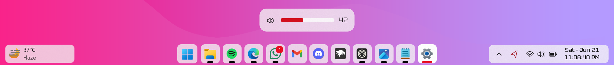
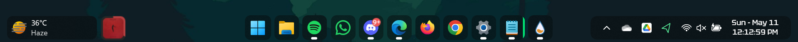
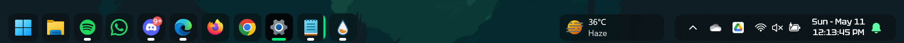
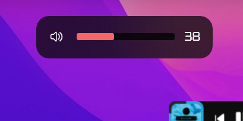
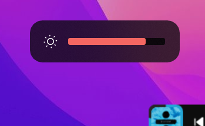

# Matter theme for Windows 11 Taskbar Styler

**Author**: [ZoraizLajwer](https://github.com/ZoraizLajwer)

## Light Mode


## Dark Mode




 


## Note
Small icon next to the weather icon is not part of the theme; it's a separate **Rainmeter skin**, another project of mine. You can download it from
[Spotibar](https://github.com/ZoraizLajwer/spotibar).

## Better to Know
- Theme is designed on Windows 11 - 23H2
- Compatible with both light and dark mode
- Install the [Tektur](https://fonts.google.com/specimen/Tektur) font from Google Fonts (required for clock customization)

## Required Windhawk Mods for similar results
To achieve similar results, install and configure the following Windhawk mods in addition to Taskbar Styler:

- Taskbar Clock Customization – for styling the clock.

<details>
<summary>Click to expand mod settings</summary>

```yaml
ShowSeconds: 1
TimeFormat: hh':'mm':'ss tt
DateFormat: ddd' -' MMM dd
WeekdayFormat: dddd
WeekdayFormatCustom: Sun, Mon, Tue, Wed, Thu, Fri, Sat
TopLine: '%date%'
BottomLine: '%time%'
MiddleLine: '%weekday%'
TooltipLine: ''
TooltipLineMode: append
Width: 180
Height: 60
MaxWidth: 0
TextSpacing: -1
DataCollection:
  NetworkMetricsFormat: mbs
  NetworkMetricsFixedDecimals: -1
  PercentageFormat: spacePaddingAndSymbol
  UpdateInterval: 1
  NetworkAdapterName: ''
  GpuAdapterName: ''
MediaPlayer:
  IgnoredPlayers:
    - ''
  MaxLength: 28
  NoMediaText: No media
  RemoveBrackets: 0
WebContentWeatherLocation: ''
WebContentWeatherFormat: '%c 🌡️%t 🌬️%w'
WebContentWeatherUnits: autoDetect
WebContentsItems:
  - Url: https://rss.nytimes.com/services/xml/rss/nyt/World.xml
    BlockStart: <item>
    Start: <title>
    End: </title>
    ContentMode: xmlHtml
    SearchReplace:
      - Search: ''
        Replace: ''
    MaxLength: 28
WebContentsUpdateInterval: 10
TimeZones:
  - ''
TimeStyle:
  Hidden: 0
  TextColor: ''
  TextAlignment: Center
  FontSize: 0
  FontFamily: Tektur
  FontWeight: Medium
  FontStyle: ''
  FontStretch: ''
  CharacterSpacing: 0
  Visible: 1
DateStyle:
  Hidden: 0
  TextColor: ''
  TextAlignment: Center
  FontSize: 0
  FontFamily: Tektur
  FontWeight: Medium
  FontStyle: ''
  FontStretch: ''
  CharacterSpacing: 0
oldTaskbarOnWin11: 0
```
</details>

---

- Taskbar Height and Icon Size
  - To make button square set `Taskbar Button Width` = 45
  - `Icon Size` = 23
  - `Taskbar Height` = 48 

## Theme selection

The theme is integrated into the mod and can be selected directly from the mod's
settings:

* Open the Windows 11 Taskbar Styler mod in Windhawk.
* Go to the "Settings" tab.
* Select the theme and save the settings.

## Manual installation

The theme styles can also be imported manually. To do that, follow these steps:

* Open the Windows 11 Taskbar Styler mod in Windhawk.
* Go to the "Settings" tab and select "Textual mode".
* Copy the content below to the text box and click "Save settings".

<details>
<summary>Content to import (click to expand)</summary>

```yaml
styleConstants:
  - mainRadius = 8
  - transparent = <SolidColorBrush Color="Transparent"/>
  - base = <AcrylicBrush TintColor="{ThemeResource SystemAltLowColor}" TintOpacity="1" TintLuminosityOpacity="0.7" FallbackColor="{ThemeResource SystemChromeLowColor}" />
  - overlay = <AcrylicBrush TintColor="{ThemeResource SystemAltLowColor}" TintOpacity="1" TintLuminosityOpacity="0.8" FallbackColor="{ThemeResource CardStrokeColorDefaultSolid}" />
  - overlay2 = <AcrylicBrush TintColor="{ThemeResource SystemAltLowColor}" TintOpacity="1" TintLuminosityOpacity="0.5" FallbackColor="{ThemeResource CardStrokeColorDefaultSolid}" />
  - accentColor = <SolidColorBrush Color="{ThemeResource SystemAccentColor}" Opacity = "1" />
  - inverseBW = <SolidColorBrush Color="{ThemeResource SystemBaseHighColor}" Opacity = "1" />
  - active = <AcrylicBrush TintColor="{ThemeResource SystemAltLowColor}" TintOpacity="1" TintLuminosityOpacity="1" FallbackColor="{ThemeResource CardStrokeColorDefaultSolid}" />
controlStyles:
  - target: Taskbar.TaskbarFrame > Grid#RootGrid > Taskbar.TaskbarBackground > Grid > Rectangle#BackgroundFill
    styles:
      - Fill := $transparent
  - target: Rectangle#BackgroundStroke
    styles:
      - Fill := $transparent
  - target: Taskbar.TaskbarBackground#HoverFlyoutBackgroundControl
    styles:
      - Fill:=$base
      - CornerRadius = $mainRadius
  - target: Taskbar.AugmentedEntryPointButton#AugmentedEntryPointButton
    styles:
      - Margin=-1,1,1,1
  - target: Taskbar.TaskListButtonPanel@CommonStates > Border#BackgroundElement
    styles:
      - CornerRadius = $mainRadius
      - Background :=$base
      - Background@InactivePointerOver :=$overlay2
      - Background@ActivePointerOver:=$overlay
      - Background@ActiveNormal :=$active
  - target: Taskbar.ExperienceToggleButton#LaunchListButton[AutomationProperties.Name=Task View]
    styles:
      - Margin=0,0,2,0
  - target: Taskbar.TaskListButton#TaskListButton[AutomationProperties.Name=Copilot] > Taskbar.TaskListLabeledButtonPanel#IconPanel > Border#BackgroundElement
    styles:
      - Visibility = 1
  - target: Taskbar.SearchBoxButton
    styles:
      - Margin=0,0,2,0
  - target: Border#BackgroundElement
    styles:
      - BorderThickness=0
  - target: Taskbar.TaskListLabeledButtonPanel@CommonStates > Border#BackgroundElement
    styles:
      - Background@InactiveNormal :=$base
      - Background@ActiveNormal :=$active
      - Background@InactivePointerOver :=$overlay2
      - Background@ActivePointerOver:=$overlay
      - CornerRadius = $mainRadius
      - Margin = 1,0,1,0
      - Background@MultiWindowNormal:=$base
      - Background@MultiWindowPointerOver:=$overlay2
      - Background@MultiWindowActive:=$active
      - Background@MultiWindowPressed:=$overlay
  - target: Border#MultiWindowElement
    styles:
      - CornerRadius = $mainRadius
      - Padding = 7,0,8,0
      - Background :=$accentColor
  - target: Taskbar.TaskListLabeledButtonPanel > TextBlock#LabelControl
    styles:
      - Margin=0,0,2,0
  - target: Taskbar.TaskListLabeledButtonPanel@RunningIndicatorStates > Rectangle#RunningIndicator
    styles:
      - Fill := $inverseBW
      - RadiusX=1.5
      - RadiusY=1.5
      - Height=4
      - Width=12
      - Fill@ActiveRunningIndicator :=$accentColor
      - Width@ActiveRunningIndicator=21
  - target: Grid#SystemTrayFrameGrid
    styles:
      - Background:=$base
      - CornerRadius = $mainRadius
      - Margin=0,5,12,5
      - Padding=5,0,0,0
  - target: Border#BackgroundBorder
    styles:
      - Margin=2,5,2,5
      - CornerRadius=8
      - BorderThickness = 0
  - target: Grid#OverflowRootGrid > Border
    styles:
      - Background:=$base
      - Shadow :=
      - CornerRadius = 14
  - target: Windows.UI.Xaml.Shapes.Rectangle#HorizontalTrackRect
    styles:
      - Height = 8
      - Margin = 0
      - Fill := $overlay
  - target: Windows.UI.Xaml.Shapes.Rectangle#HorizontalDecreaseRect
    styles:
      - Height = 8
  - target: Windows.UI.Xaml.Controls.TextBlock#volumeLevelText
    styles:
      - FontFamily = Tektur
      - Margin = 0,-2,0,0
  - target: Windows.UI.Xaml.Controls.Grid#VolumeConfirmator
    styles:
      - Padding = 8,0,3,0
      - CornerRadius = 20
  - target: Windows.UI.Xaml.Controls.Grid#ConfirmatorMainGrid
    styles:
      - Background :=$base
      - CornerRadius = 14
      - BorderThickness = 0
      - Margin = 0,0,0,10
      - Shadow :=
  - target: Windows.UI.Xaml.Controls.Grid#BrightnessConfirmator
    styles:
      - Padding = 15,0,17,0
      - CornerRadius = 20
  - target: Microsoft.UI.Xaml.Controls.AnimatedIcon#BrightnessIcon
    styles:
      - Margin = 0,-1,12,0
  - target: Microsoft.UI.Xaml.Controls.ProgressBar#ProgressIndicator
    styles:
      - Margin = 0,0,0,1
  - target: Windows.UI.Xaml.Shapes.Rectangle#ProgressBarTrack
    styles:
      - Fill := $inverseBW
      - RadiusX = 1.5
      - RadiusY = 1.5
  - target: Windows.UI.Xaml.Shapes.Rectangle#DeterminateProgressBarIndicator
    styles:
      - Fill :=$accentColor
  - target: Taskbar.TaskListButton#TaskListButton > Taskbar.TaskListLabeledButtonPanel#IconPanel > Microsoft.UI.Xaml.Controls.ProgressBar#ProgressIndicator
    styles:
      - MinHeight = 4
      - Width = 26
  - target: Windows.UI.Xaml.Controls.ContentPresenter#ContentPresenter
    styles:
      - BorderThickness = 0
  - target: Taskbar.ExperienceToggleButton#LaunchListButton[AutomationProperties.Name=Start]
    styles:
      - Margin = 0,0,2,0
  - target: Taskbar.Badge#BadgeControl
    styles:
      - Height = 14
      - MinWidth = 14
      - Margin = 0,0,0,0
      - CornerRadius = 20
  - target: Windows.UI.Xaml.Shapes.Rectangle#BackgroundRect
    styles:
      - RadiusX = 4
      - RadiusY = 4
  - target: MenuFlyoutPresenter
    styles:
      - Background := $base
      - Shadow :=
      - CornerRadius = 8
  - target: SearchUx.SearchUI.SearchButtonRootGrid@CommonStates > Border#BackgroundElement
    styles:
      - Background@InactiveNormal :=$base
      - CornerRadius = 8
```
</details>
