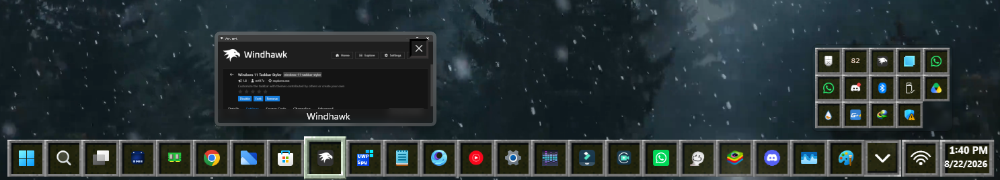

# Minecraft Hotbar Style for Windows 11 Taskbar Styler

Author: [WasiXGamer](https://github.com/wasixgamer)

This theme attempts to make Windows 11 Taskbar look like Minecraft Hotbar.




# Additional Mod Requirements & Configuration:

> [!NOTE]
> ## Do Not use [Taskbar Height & Icon Size](https://windhawk.net/mods/taskbar-icon-size) Mod with this!
> ## It will Not work and force the taskbar to go against the border of the screen.

# Taskbar Thumbnail Size Configurations

The Thumbnails look more appropriate with the [Taskbar Thumbnail Size](https://windhawk.net/mods/taskbar-thumbnail-size) Mod. The following Configuration is Preferable to use:
```yaml
size: 160
useAbsoluteSize: 0
minWidth: 0
minHeight: 0
maxWidth: 0
maxHeight: 0
preserveAspectRatio: 0
```
## Credits:
Give Credits If distributing, or Forking the Style. 


## Theme selection

The theme is integrated into the mod and can be selected directly from the mod's
settings:

* Open the Windows 11 Taskbar Styler mod in Windhawk.
* Go to the "Settings" tab.
* Select the theme and save the settings.

## Manual installation

The theme styles can also be imported manually. To do that, follow these steps:

* Open the Windows 11 Taskbar Styler mod in Windhawk.
* Go to the "Settings" tab and select "Textual mode".
* Copy the content below to the text box and click "Save settings".

<details>
<summary>Content to import (click to expand)</summary>

```yaml
theme: 'Minecraft Hotbar(By WasiXGamer)'
styleConstants:
  - IconBackground= <ImageBrush Stretch="UniformtoFill" ImageSource="https://raw.githubusercontent.com/ramensoftware/windows-11-taskbar-styling-guide/refs/heads/main/Themes/Minecraft%20Hotbar/Assets/hotbar.png" />
  - ActiveBackground= <ImageBrush Stretch="UniformtoFill" ImageSource="https://raw.githubusercontent.com/ramensoftware/windows-11-taskbar-styling-guide/refs/heads/main/Themes/Minecraft%20Hotbar/Assets/hotbaractive.png" />
controlStyles:
  - target: Taskbar.TaskListLabeledButtonPanel#IconPanel@CommonStates > Image#Icon
    styles:
      - Margin=5.5,0,-5.5,0 
      - Margin@ActiveNormal=9,0,-10,0
      - Margin@ActivePointerOver=9,0,-10,0
      - Margin@InactivePointerOver=7,0,-7,0
      - Margin@ActivePressed=9,0,-10,0
  - target: Grid#RootGrid > Taskbar.TaskbarBackground > Grid
    styles:
      - Background:=transparent
  - target: Taskbar.TaskbarFrame#TaskbarFrame > Grid#RootGrid
    styles:
      - Background:=transparent 
  - target: Taskbar.TaskbarFrame#TaskbarFrame > Grid#RootGrid > Taskbar.TaskbarBackground#BackgroundControl > Grid > Rectangle#BackgroundFill
    styles:
      - Margin=0,9,0,9
      - Fill:=<WindhawkBlur BlurAmount="4" />

  - target: Rectangle#BackgroundStroke
    styles:
      - Fill=Transparent
  - target: Taskbar.TaskListButtonPanel
    styles:
      - MinWidth=55
  - target: Taskbar.TaskListLabeledButtonPanel
    styles:
      - MinWidth=55
  - target: SearchUx.SearchUI.SearchButtonControl > Grid > SearchUx.SearchUI.SearchIconButton#SearchIcon > SearchUx.SearchUI.SearchButtonRootGrid#SearchBoxButtonRootPanel
    styles:
      - MinWidth=55
  - target: Taskbar.TaskListButtonPanel@CommonStates > Border#BackgroundElement
    styles:
      - CornerRadius=0
      - Margin=0,5.5,0,5.5
  - target: Taskbar.TaskbarFrame
    styles:
      - Width=Auto
      - Height=70

      - MinWidth:=100
      - Grid.Column=1
      - HorizontalAlignment=Center
  - target: Taskbar.TaskbarFrame > Grid#RootGrid
    styles:
      - Transitions:=<TransitionCollection><EntranceThemeTransition HorizontalOffset="0" VerticalOffset="0" /></TransitionCollection>
      - Margin=0,4,0,-4
      - Padding=20,0,20,0
  - target: SystemTray.SystemTrayFrame
    styles:
      - Height=70
      - CornerRadius=0
      - Grid.Column=2
      - Width=Auto
      - HorizontalAlignment=Left
  - target: Grid#SystemTrayFrameGrid
    styles:
      - Background:=<WindhawkBlur BlurAmount="4" />
      - Height=55
      - Margin=0,-7,0,7
      - VerticalAlignment=Bottom
      - BorderBrush=transparent
      - BorderThickness=0
      - CornerRadius=0
      - Visibility=Visible
  - target: :root > ScrollViewer > ScrollContentPresenter > Border > Grid
    styles:
      - ColumnDefinitions:=<ColumnDefinitionCollection><ColumnDefinition Width="*"/><ColumnDefinition Width="Auto"/><ColumnDefinition Width="Auto"/><ColumnDefinition Width="*"/></ColumnDefinitionCollection>
      - ActualWidth=>containerGridWidth
  - target: Taskbar.TaskListLabeledButtonPanel@RunningIndicatorStates > Rectangle#RunningIndicator
    styles:
      - Fill:=#90ffffff
      - RadiusX=0
      - RadiusY=0
      - Margin=-1
      - Height=2
      - Width=4
      - Width@ActiveRunningIndicator=8
      - Fill@ActiveRunningIndicator=#60CDFF
      - Margin=6,0,-6,0
      - Margin@ActiveRunning=20,0,-20,0
  - target: Taskbar.ExperienceToggleButton#LaunchListButton[AutomationProperties.AutomationId=StartButton] > Taskbar.TaskListButtonPanel > Microsoft.UI.Xaml.Controls.AnimatedVisualPlayer#Icon
    styles:
      - Visibility=0
  - target: Border#MultiWindowElement
    styles:
      - Visibility=Collapsed
  - target: Taskbar.ExperienceToggleButton#LaunchListButton[AutomationProperties.Name=Task View] > Taskbar.TaskListButtonPanel > Microsoft.UI.Xaml.Controls.AnimatedVisualPlayer
    styles:
      - Visibility=0
  - target: Taskbar.ExperienceToggleButton#LaunchListButton[AutomationProperties.Name=Task View] > Taskbar.TaskListButtonPanel > Viewbox
    styles:
      - Visibility=0
  - target: SearchUx.SearchUI.SearchButtonControl > Grid > SearchUx.SearchUI.SearchIconButton#SearchIcon > SearchUx.SearchUI.SearchButtonRootGrid#SearchBoxButtonRootPanel > Microsoft.UI.Xaml.Controls.AnimatedVisualPlayer
    styles:
      - Visibility=0
  - target: Taskbar.TaskListLabeledButtonPanel@CommonStates > Border#BackgroundElement
    styles:
      - // [Normal ICON BG]
      - CornerRadius=0
      - Margin=-3,3.5,-3,3.5
      - Background:=$IconBackground
      - Background@InactivePointerOver:=$ActiveBackground
      - Background@ActiveNormal:=$ActiveBackground
      - Background@ActivePointerOver:=$ActiveBackground
      - Background@MultiWindowPointerOver:=$ActiveBackground
      - BorderThickness=0
  - target: Taskbar.TaskListLabeledButtonPanel@CommonStates
    styles:
      - Width@InactivePointerOver=59
      - Width@MultiWindowPointerOver=59
      - Margin@InactivePointerOver=0,-5,0,-5
      - Margin@MultiWindowPointerOver=0,-5,0,-5
      - Width@ActiveNormal=63
      - Width@ActivePointerOver=63
      - Width@MultiWindowPointerOver=63
      - Width@ActivePressed=63
      - Margin@ActivePointerOver=0,-5,0,-5
      - Margin@ActivePressed=0,-5,0,-5
      - Margin@ActiveNormal=0,-5,0,-5
  - target: Taskbar.TaskListButtonPanel@CommonStates > Border#BackgroundElement
    styles:
      - // [TaskView and Start ICON BG]
      - Canvas.ZIndex=0
      - CornerRadius=0
      - Margin=-3,3.5,-3,3.5
      - Background:=$IconBackground
      - Background@InactivePointerOver:=$ActiveBackground
      - BorderThickness=0
  - target: Taskbar.TaskListButtonPanel@CommonStates
    styles:
      - Canvas.ZIndex=0
      - Width@InactivePointerOver=59
      - Margin@InactivePointerOver=0,-5,0,-5
  - target: SearchUx.SearchUI.SearchButtonControl > Grid > SearchUx.SearchUI.SearchIconButton#SearchIcon > SearchUx.SearchUI.SearchButtonRootGrid#SearchBoxButtonRootPanel@CommonStates  > Border#BackgroundElement
    styles:
      - // [TaskView and Start ICON BG]
      - CornerRadius=0
      - Margin=-3,3.5,-3,3.5
      - Background:=$IconBackground
      - Background@InactivePointerOver:=$ActiveBackground
      - BorderThickness=0
  - target: SearchUx.SearchUI.SearchButtonControl > Grid > SearchUx.SearchUI.SearchIconButton#SearchIcon > SearchUx.SearchUI.SearchButtonRootGrid#SearchBoxButtonRootPanel@CommonStates
    styles:
      - Canvas.ZIndex=0
      - Width@InactivePointerOver=59
      - Margin@InactivePointerOver=0,-5,0,-5
  - target: SystemTray.SystemTrayFrame > Grid#SystemTrayFrameGrid > SystemTray.Stack#NotifyIconStack > Grid#Content > SystemTray.StackListView#IconStack > ItemsPresenter > StackPanel > ContentPresenter > SystemTray.ChevronIconView > Grid#ContainerGrid > ContentPresenter#ContentPresenter > Grid#ContentGrid
    styles:
      - CornerRadius=0
      - Height=55
      - Width=55
      - Width@PointerOver=59
      - CornerRadius=0
      - Background:=$IconBackground
      - BorderThickness=0
  - target: SystemTray.LanguageTextIconContent > Windows.UI.Xaml.Controls.Grid#ContainerGrid
    styles:
      - CornerRadius=0
      - Height=55
      - Width=55
      - Margin=-1,0,-13,0
      - Background:=$IconBackground
      - BorderThickness=0
  - target: SystemTray.StackListView#IconStack > ItemsPresenter > StackPanel > ContentPresenter > SystemTray.IconView#SystemTrayIcon > Grid#ContainerGrid > ContentPresenter#ContentPresenter > Grid#ContentGrid > SystemTray.TextIconContent > Grid#ContainerGrid
    styles:
      - CornerRadius=0
      - Height=55
      - Width=55
      - Background:=$IconBackground
      - BorderThickness=0
  - target: SystemTray.Stack#ShowDesktopStack
    styles:
      - Visibility=1
      - CornerRadius=0
      - Height=55
      - Width=55
      - Background:=$IconBackground
      - BorderThickness=0
      - // System Tray > Show Desktop Button
  - target: SystemTray.OmniButton#ControlCenterButton > Grid > ContentPresenter > ItemsPresenter > StackPanel > ContentPresenter[1] > SystemTray.IconView > Grid > Grid
    styles:
      - Margin=-3,0,-8,0
      - Visibility=visible
      - CornerRadius=0
      - Height=55
      - Width=55
      - Background:=$IconBackground
      - BorderThickness=0
      - // [Tray Wifi Icon. Set Visibility=Collapsed to Remove it, and Visibility=Visible to bring it back]
  - target: SystemTray.OmniButton#ControlCenterButton > Grid > ContentPresenter > ItemsPresenter > StackPanel > ContentPresenter[2] > SystemTray.IconView > Grid > Grid
    styles:
      - Margin=8,0,-8,0
      - Visibility=1
      - CornerRadius=0
      - Height=55
      - Width=55
      - Background:=$IconBackground
      - BorderThickness=0
      - // [Tray Audio Icon. Set Visibility=Collapsed to Remove it, and Visibility=Visible to bring it back]
  - target: SystemTray.OmniButton#ControlCenterButton > Grid > ContentPresenter > ItemsPresenter > StackPanel > ContentPresenter[3] > SystemTray.IconView > Grid > Grid
    styles:
      - Margin=8,0,-8,0
      - Visibility=Visible
      - CornerRadius=0
      - Height=55
      - Width=55
      - Background:=$IconBackground
      - BorderThickness=0
      - // [Tray Battery Icon. Set Visibility=Collapsed to Remove it, and Visibility=Visible to bring it back]
  - target: SystemTray.SystemTrayFrame > Grid#SystemTrayFrameGrid > SystemTray.OmniButton#ControlCenterButton > Grid > ContentPresenter#ContentPresenter > ItemsPresenter > StackPanel > ContentPresenter > SystemTray.IconView#SystemTrayIcon > Grid#ContainerGrid > Grid#ContentGrid > SystemTray.BatteryIconContent > Grid#ContainerGrid > StackPanel
    styles:
      - HorizontalAlignment=Center
  - target: SystemTray.SystemTrayFrame > Grid#SystemTrayFrameGrid > SystemTray.OmniButton#NotificationCenterButton > Grid > ContentPresenter#ContentPresenter > ItemsPresenter > StackPanel > ContentPresenter > SystemTray.IconView#SystemTrayIcon > Grid#ContainerGrid > ContentPresenter#ContentPresenter > Grid#ContentGrid > SystemTray.TextIconContent > Grid#ContainerGrid
    styles:
      - Visibility=Visible
      - Margin=5,0,-5,0
      - CornerRadius=0
      - Height=55
      - Width=55
      - Background:=$IconBackground
      - BorderThickness=0
      - // [Notify Icon. Set Visibility=Collapsed to Remove it, and Visibility=Visible to bring it back]
  - target: SystemTray.AdaptiveTextBlock > TextBlock
    styles:
      - FontSize=30
  - target: SystemTray.SystemTrayFrame > Grid#SystemTrayFrameGrid > SystemTray.Stack#NotifyIconStack > Grid#Content > SystemTray.StackListView#IconStack > ItemsPresenter > StackPanel > ContentPresenter > SystemTray.ChevronIconView > Grid#ContainerGrid > ContentPresenter#ContentPresenter > Grid#ContentGrid > SystemTray.TextIconContent > Grid#ContainerGrid > SystemTray.AdaptiveTextBlock#Base > TextBlock#InnerTextBlock
    styles:
      - FontSize=32
      - Foreground=white
  - target: TextBlock#DateInnerTextBlock
    styles:
      - FontWeight=Bold
      - Margin=3,9,7,-9
      - Foreground=White
      - Visibility=visible
      - RenderTransform:=<TranslateTransform X="0" Y="-9"/>
      - FontSize=13
      - FontFamily=vivo Sans EN VF
  - target: SystemTray.ChevronIconView > Grid#ContainerGrid > ContentPresenter#ContentPresenter > Grid#ContentGrid > SystemTray.TextIconContent
    styles:
      - Foreground=white
      - FontWeight=bold
      - FontSize=32
  - target: TextBlock#TimeInnerTextBlock
    styles:
      - Foreground=white
      - Width=Auto
      - FontWeight=Bold
      - FontSize=15
      - Margin=6,-4,6,4
  - target: SystemTray.SystemTrayFrame > Grid#SystemTrayFrameGrid > SystemTray.OmniButton#ControlCenterButton > Grid > ContentPresenter#ContentPresenter > ItemsPresenter > StackPanel > ContentPresenter > SystemTray.IconView#SystemTrayIcon > Grid#ContainerGrid > Grid#ContentGrid > SystemTray.TextIconContent > Grid#ContainerGrid > SystemTray.AdaptiveTextBlock#Base > TextBlock#InnerTextBlock
    styles:
      - Foreground=white
      - FontSize=30
  - target: TextBlock#SearchBoxTextBlock
    styles:
      - FontSize=12
      - Foreground=White
  - target: SystemTray.AdaptiveTextBlock#LanguageInnerTextBlock > TextBlock#InnerTextBlock
    styles:

      - FontSize=16
      - FontWeight=Bold
  - target: SystemTray.IconView#SystemTrayIcon > Grid#ContainerGrid > Grid#ContentGrid > SystemTray.DateTimeIconContent > Grid#ContainerGrid
    styles:
      - CornerRadius=0
      - BorderThickness=0
      - Background:=<ImageBrush ImageSource="https://raw.githubusercontent.com/ramensoftware/windows-11-taskbar-styling-guide/refs/heads/main/Themes/Minecraft%20Hotbar/Assets/hotbar.png" />
      - Height=55
      - Margin=1,0,-5,0
      - Width=auto
  - target: SystemTray.SystemTrayFrame > Grid#SystemTrayFrameGrid > SystemTray.Stack#NonActivatableStack > Grid#Content > SystemTray.StackListView#IconStack > ItemsPresenter > StackPanel > ContentPresenter > SystemTray.IconView#SystemTrayIcon > Grid#ContainerGrid > Border#BackgroundBorder
    styles:
      - Background:=Transparent
      - BorderThickness=0
  - target: SystemTray.OmniButton#ControlCenterButton > Grid > Border#BackgroundBorder
    styles:
      - Background:=Transparent
      - BorderThickness=0
  - target: SystemTray.SystemTrayFrame > Grid#SystemTrayFrameGrid > SystemTray.OmniButton#NotificationCenterButton > Grid > ContentPresenter#ContentPresenter > ItemsPresenter > StackPanel > ContentPresenter > SystemTray.IconView#SystemTrayIcon > Grid#ContainerGrid > ContentPresenter#ContentPresenter
    styles:
      - Margin=0,0,15,0
      - Background:=transparent
      - BorderThickness=0
  - target: Taskbar.TaskbarBackground#HoverFlyoutBackgroundControl > Grid > Rectangle#BackgroundFill
    styles:
      - Canvas.ZIndex=0
      - Fill:=
      - Stroke:=<WindhawkBlur BlurAmount="8" TintColor="#30ffffff"/>
      - StrokeThickness=5
      - RadiusX=5
      - RadiusY=5
  - target: Taskbar.FlyoutFrame > Windows.UI.Xaml.Controls.Canvas#HoverFlyoutCanvas > Windows.UI.Xaml.Controls.Grid#HoverFlyoutGrid > Windows.UI.Xaml.Controls.ContentPresenter#HoverFlyoutContent > Taskbar.TaskItemThumbnailList > Microsoft.UI.Xaml.Controls.ItemsRepeater#TaskItemThumbnailListRepeater > Taskbar.TaskItemThumbnailView > Windows.UI.Xaml.Controls.Grid > Windows.UI.Xaml.Controls.Border#BackgroundBorder
    styles:
      - VerticalAlignment=Bottom
      - Canvas.ZIndex=1
      - Background:=<WindhawkBlur BlurAmount="5" TintColor="#761E1E1E"/>
      - Height=25
      - CornerRadius=0,0,15,15
      - Margin=5,0,5,0
  - target: Border#HoverFlyoutBackground
    styles:
      - Margin=4,36,4,0
      - Canvas.ZIndex=1
      - Width=Auto
      - Background:=Transparent
      - BorderThickness=0
      - CornerRadius=5
  - target: Microsoft.UI.Xaml.Controls.ItemsRepeater#ThumbBarRepeater > Taskbar.ThumbBarButton#ThumbBarButton > Windows.UI.Xaml.Controls.ContentPresenter#BorderElement
    styles:
      - Background:=<WindhawkBlur BlurAmount="8" TintColor="#761E1E1E"/>
      - Margin=0,-20,0,20
  - target: Microsoft.UI.Xaml.Controls.ItemsRepeater#IconsRepeater > Windows.UI.Xaml.Controls.Image
    styles:
      - Visibility=Collapsed
  - target: Windows.UI.Xaml.Controls.Button#CloseButton
    styles:
      - Grid.ColumnSpan=1
      - Grid.RowSpan=1
      - Canvas.ZIndex=1
      - CornerRadius=0
      - Width=28
      - Height=28
      - Margin=-18,40,15,-40
      - Background:=#1D1D1D 
      - Foreground=white
      - BorderThickness=3
      - BorderBrush:=<LinearGradientBrush StartPoint="-0.07,-0.06" EndPoint="1.02,1.04"><GradientStop Offset="0.49" Color="#000000"/><GradientStop Offset="0.53" Color="#3A3636"/></LinearGradientBrush>
  - target: Taskbar.FlyoutFrame > Windows.UI.Xaml.Controls.Canvas#HoverFlyoutCanvas > Windows.UI.Xaml.Controls.Grid#HoverFlyoutGrid > Windows.UI.Xaml.Controls.ContentPresenter#HoverFlyoutContent > Taskbar.TaskItemThumbnailList > Microsoft.UI.Xaml.Controls.ItemsRepeater#TaskItemThumbnailListRepeater > Taskbar.TaskItemThumbnailView > Windows.UI.Xaml.Controls.Grid > Windows.UI.Xaml.Controls.TextBlock#DisplayNameTextBlock
    styles:
      - Foreground=white
      - Grid.ColumnSpan=2
      - Grid.RowSpan=2
      - VerticalAlignment=bottom
      - HorizontalAlignment=Center
      - Margin=0,-5,0,5
      - Canvas.ZIndex=1
  - target: ScrollViewer > ScrollContentPresenter > Border > SystemTray.NotificationAreaOverflow > Grid#OverflowRootGrid > Border#OverflowFlyoutBackgroundBorder
    styles:
      - Background:=<WindhawkBlur BlurAmount="4" />  
  - target: SystemTray.OmniButton#NotificationCenterButton > Grid > ContentPresenter#ContentPresenter > ItemsPresenter > StackPanel > ContentPresenter > SystemTray.IconView#SystemTrayIcon > Grid#ContainerGrid > Grid#ContentGrid > SystemTray.TextIconContent > Grid#ContainerGrid
    styles:
      - Visibility=1    
  - target: ScrollViewer > ScrollContentPresenter > Border > SystemTray.NotificationAreaOverflow > Grid#OverflowRootGrid > ItemsControl > ItemsPresenter > WrapGrid > ContentPresenter > SystemTray.NotifyIconView > Grid#ContainerGrid > ContentPresenter#ContentPresenter > Grid#ContentGrid > SystemTray.ImageIconContent > Grid#ContainerGrid
    styles:
      - Background:=$IconBackground    

  - target: ScrollViewer > ScrollContentPresenter > Border > Grid > SystemTray.SystemTrayFrame > Grid#SystemTrayFrameGrid > SystemTray.NotificationAreaIcons#NotificationAreaIcons > ItemsPresenter > StackPanel > ContentPresenter > SystemTray.NotifyIconView#NotifyItemIcon > Grid#ContainerGrid > ContentPresenter#ContentPresenter > Grid#ContentGrid > SystemTray.ImageIconContent > Grid#ContainerGrid
    styles:
      - Width=55
      - Height=55
      - Background:=$IconBackground     
  - target: ScrollViewer > ScrollContentPresenter > Border > Grid > Taskbar.TaskbarFrame#TaskbarFrame > Grid#RootGrid > Microsoft.UI.Xaml.Controls.ItemsRepeater#TaskbarFrameRepeater > Taskbar.TaskListButton#TaskListButton > Taskbar.TaskListLabeledButtonPanel#IconPanel > TextBlock#LabelControl
    styles:
      - Visibility=1
themeResourceVariables:
  - ''
clickThroughTaskbar: false
xamlDiagnosticsHandling: ''

```
</details>


