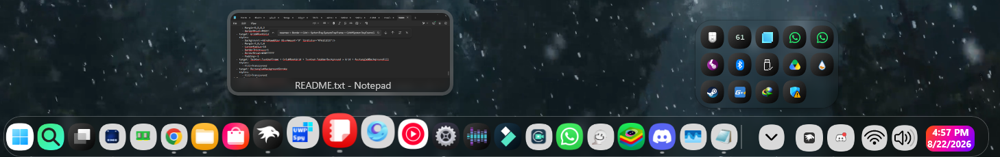
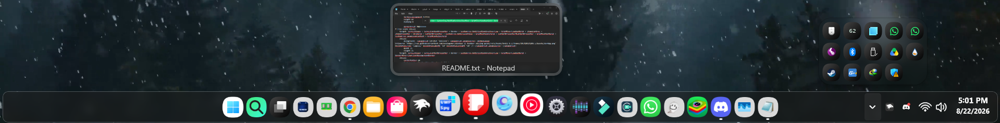
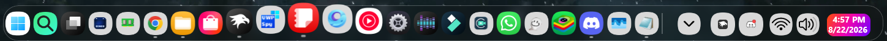
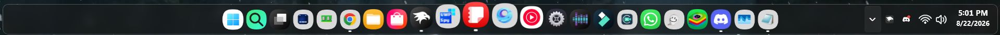

# ONE UI 8.5 Taskbar/Dock + Icon Pack

Author: [WasiXGamer](https://github.com/wasixgamer)

This theme makes Windows 11 Taskbar looks like ONE UI Style Dock/Taskbar.

# Previews

## ONE UI 8.5 Dock


## ONE UI 8.5 Taskbar



# Additional Requirements:

> [!NOTE]
> ## Do Not use [Taskbar Height & Icon Size](https://windhawk.net/mods/taskbar-icon-size) Mod with this!
> ## It will Not work and force the taskbar to go against the border of the screen.


# Taskbar Dock Animation Configuration(Optional & Recommended)
The Mod can be made look better and more like MacOS by using [Taskbar Dock Animation](https://windhawk.net/mods/taskbar-dock-animation) Mod! The Following config is Recommended to be used:
```yaml
AnimationType: 0
MaxScale: 130
EffectRadius: 180
SpacingFactor: 80
BounceDelay: 500
FocusDuration: 150
MirrorForTopTaskbar: 0
DisableVerticalBounce: 0
TaskbarLabelsMode: 0
ExcludeSystemButtonsMode: 0
LerpSpeed: 60
DisableBounce: 1
```
## Credits and Distribution
Includes One UI icons. Original icon assets and intellectual property belong to Samsung.
You can distribute the theme, or its fork by giving credits to the Author.

## Theme selection

The theme is integrated into the mod and can be selected directly from the mod's
settings:

* Open the Windows 11 Taskbar Styler mod in Windhawk.
* Go to the "Settings" tab.
* Select the theme and save the settings.

## Manual installation

The theme styles can also be imported manually. To do that, follow these steps:

* Open the Windows 11 Taskbar Styler mod in Windhawk.
* Go to the "Settings" tab and select "Textual mode".
* Copy the content below to the text box and click "Save settings".


## ONE UI 8.5 (DOCK) Configuration


<details>
<summary>Content to import (click to expand)</summary>

```yaml

theme: 'ONE UI DOCK(By WasiXGamer)'
styleConstants: 
  - IconBackground=<ImageBrush Stretch="Uniform"> <ImageBrush.ImageSource> <BitmapImage UriSource="https://raw.githubusercontent.com/ramensoftware/windows-11-taskbar-styling-guide/refs/heads/main/Themes/ONE%20UI%208.5/Assets/template.png" DecodePixelType="Logical" DecodePixelWidth="64" DecodePixelHeight="64" /> </ImageBrush.ImageSource> </ImageBrush> 
  - IconBorder=transparent
controlStyles:
# OneUI icon pack
  # --- XBOX APP ---
  - target: 'taskbar:TaskListButton[AutomationProperties.AutomationId=Appid: Microsoft.GamingApp_8wekyb3d8bbwe!Microsoft.Xbox.AppL] > taskbar:TaskListLabeledButtonPanel#IconPanel > Image#Icon, taskbar:TaskListButton[AutomationProperties.AutomationId=Appid: Microsoft.GamingApp_8wekyb3d8bbwe!Microsoft.Xbox.App] > taskbar:TaskListLabeledButtonPanel#IconPanel > Image#Icon, taskbar:TaskListButton[AutomationProperties.AutomationId=Appid: Microsoft.GamingApp_8wekyb3d8bbwe!App] > taskbar:TaskListLabeledButtonPanel#IconPanel > Image#Icon'
    styles:
      - Source=https://raw.githubusercontent.com/ramensoftware/windows-11-taskbar-styling-guide/refs/heads/main/Themes/ONE%20UI%208.5/Assets/xbox.png
      - Height=40
      - Width=40
      - Margin=0,0,0,0
  - target: 'taskbar:TaskListButton[AutomationProperties.AutomationId=Appid: Microsoft.GamingApp_8wekyb3d8bbwe!Microsoft.Xbox.AppL] > taskbar:TaskListLabeledButtonPanel#IconPanel > Border, taskbar:TaskListButton[AutomationProperties.AutomationId=Appid: Microsoft.GamingApp_8wekyb3d8bbwe!Microsoft.Xbox.App] > taskbar:TaskListLabeledButtonPanel#IconPanel > Border, taskbar:TaskListButton[AutomationProperties.AutomationId=Appid: Microsoft.GamingApp_8wekyb3d8bbwe!App] > taskbar:TaskListLabeledButtonPanel#IconPanel > Border'
    styles:
      - Visibility=Collapsed
  # --- WINDOWS CAMERA ---
  - target: 'taskbar:TaskListButton[AutomationProperties.AutomationId=Appid: Microsoft.WindowsCamera_8wekyb3d8bbwe!App] > taskbar:TaskListLabeledButtonPanel#IconPanel > Image#Icon'
    styles:
      - Source=https://raw.githubusercontent.com/ramensoftware/windows-11-taskbar-styling-guide/refs/heads/main/Themes/ONE%20UI%208.5/Assets/windowscamera.png
      - Height=40
      - Width=40
      - Margin=0,0,0,0
  - target: 'taskbar:TaskListButton[AutomationProperties.AutomationId=Appid: Microsoft.WindowsCamera_8wekyb3d8bbwe!App] > taskbar:TaskListLabeledButtonPanel#IconPanel > Border'
    styles:
      - Visibility=Collapsed
  # --- COMMAND PROMPT ---
  - target: 'taskbar:TaskListButton[AutomationProperties.AutomationId=Appid: {1AC14E77-02E7-4E5D-B744-2EB1AE5198B7}\cmd.exe] > taskbar:TaskListLabeledButtonPanel#IconPanel > Image#Icon, taskbar:TaskListButton[AutomationProperties.AutomationId=Appid: C:\Windows\System32\cmd.exe] > taskbar:TaskListLabeledButtonPanel#IconPanel > Image#Icon'
    styles:
      - Source=https://raw.githubusercontent.com/ramensoftware/windows-11-taskbar-styling-guide/refs/heads/main/Themes/ONE%20UI%208.5/Assets/cmd.png
      - Height=40
      - Width=40
      - Margin=0,0,0,0
  - target: 'taskbar:TaskListButton[AutomationProperties.AutomationId=Appid: {1AC14E77-02E7-4E5D-B744-2EB1AE5198B7}\cmd.exe] > taskbar:TaskListLabeledButtonPanel#IconPanel > Border, taskbar:TaskListButton[AutomationProperties.AutomationId=Appid: C:\Windows\System32\cmd.exe] > taskbar:TaskListLabeledButtonPanel#IconPanel > Border'
    styles:
      - Visibility=Collapsed

  # --- WINDOWS POWERSHELL ---
  - target: 'taskbar:TaskListButton[AutomationProperties.AutomationId=Appid: {1AC14E77-02E7-4E5D-B744-2EB1AE5198B7}\WindowsPowerShell\v1.0\powershell.exe] > taskbar:TaskListLabeledButtonPanel#IconPanel > Image#Icon, taskbar:TaskListButton[AutomationProperties.AutomationId=Appid: {A7CC3F66-580E-49E6-913B-556111443D24}\Windows PowerShell\Windows PowerShell.lnk] > taskbar:TaskListLabeledButtonPanel#IconPanel > Image#Icon'
    styles:
      - Source=https://raw.githubusercontent.com/ramensoftware/windows-11-taskbar-styling-guide/refs/heads/main/Themes/ONE%20UI%208.5/Assets/powershell.png
      - Height=40
      - Width=40
      - Margin=0,0,0,0
  - target: 'taskbar:TaskListButton[AutomationProperties.AutomationId=Appid: {1AC14E77-02E7-4E5D-B744-2EB1AE5198B7}\WindowsPowerShell\v1.0\powershell.exe] > taskbar:TaskListLabeledButtonPanel#IconPanel > Border, taskbar:TaskListButton[AutomationProperties.AutomationId=Appid: {A7CC3F66-580E-49E6-913B-556111443D24}\Windows PowerShell\Windows PowerShell.lnk] > taskbar:TaskListLabeledButtonPanel#IconPanel > Border'
    styles:
      - Visibility=Collapsed
  # --- On Screen keyboard ---
  - target: 'taskbar:TaskListButton[AutomationProperties.AutomationId=Appid: {1AC14E77-02E7-4E5D-B744-2EB1AE5198B7}\osk.exe] > taskbar:TaskListLabeledButtonPanel#IconPanel > Image#Icon'
    styles:
      - Source=https://raw.githubusercontent.com/ramensoftware/windows-11-taskbar-styling-guide/refs/heads/main/Themes/ONE%20UI%208.5/Assets/osk.png
      - Height=40
      - Width=40
      - Margin=0,0,0,0
  - target: 'taskbar:TaskListButton[AutomationProperties.AutomationId=Appid: {1AC14E77-02E7-4E5D-B744-2EB1AE5198B7}\osk.exe] > taskbar:TaskListLabeledButtonPanel#IconPanel > Border'
    styles:
      - Visibility=Collapsed
  # --- PAINT ---
  - target: 'taskbar:TaskListButton[AutomationProperties.AutomationId=Appid: Microsoft.Paint_8wekyb3d8bbwe!App] > taskbar:TaskListLabeledButtonPanel#IconPanel > Image#Icon'
    styles:
      - Source=https://raw.githubusercontent.com/ramensoftware/windows-11-taskbar-styling-guide/refs/heads/main/Themes/ONE%20UI%208.5/Assets/paint.png
      - Height=40
      - Width=40 
      - Margin=0,0,0,0
  - target: 'taskbar:TaskListButton[AutomationProperties.AutomationId=Appid: Microsoft.Paint_8wekyb3d8bbwe!App] > taskbar:TaskListLabeledButtonPanel#IconPanel > Border'
    styles:
      - Visibility=Collapsed

  # --- SNIPPING TOOL ---
  - target: 'taskbar:TaskListButton[AutomationProperties.AutomationId=Appid: Microsoft.ScreenSketch_8wekyb3d8bbwe!App] > taskbar:TaskListLabeledButtonPanel#IconPanel > Image#Icon'
    styles:
      - Source=https://raw.githubusercontent.com/ramensoftware/windows-11-taskbar-styling-guide/refs/heads/main/Themes/ONE%20UI%208.5/Assets/snippingtool.png
      - Height=40
      - Width=40
      - Margin=0,0,0,0
  - target: 'taskbar:TaskListButton[AutomationProperties.AutomationId=Appid: Microsoft.ScreenSketch_8wekyb3d8bbwe!App] > taskbar:TaskListLabeledButtonPanel#IconPanel > Border'
    styles:
      - Visibility=Collapsed

  # --- SPOTIFY ---
  - target: 'taskbar:TaskListButton[AutomationProperties.AutomationId=Appid: SpotifyAB.SpotifyMusic_zpdnekdrzrea0!Spotify] > taskbar:TaskListLabeledButtonPanel#IconPanel > Image#Icon'
    styles:
      - Source=https://raw.githubusercontent.com/ramensoftware/windows-11-taskbar-styling-guide/refs/heads/main/Themes/ONE%20UI%208.5/Assets/Spotify.png
      - Height=40
      - Width=40
      - Margin=0,0,0,0
  - target: 'taskbar:TaskListButton[AutomationProperties.AutomationId=Appid: SpotifyAB.SpotifyMusic_zpdnekdrzrea0!Spotify] > taskbar:TaskListLabeledButtonPanel#IconPanel > Border'
    styles:
      - Visibility=Collapsed

  # --- PHOTOS ---
  - target: 'taskbar:TaskListButton[AutomationProperties.AutomationId=Appid: Microsoft.Windows.Photos_8wekyb3d8bbwe!App] > taskbar:TaskListLabeledButtonPanel#IconPanel > Image#Icon'
    styles:
      - Source=https://raw.githubusercontent.com/ramensoftware/windows-11-taskbar-styling-guide/refs/heads/main/Themes/ONE%20UI%208.5/Assets/photos.png
      - Height=40
      - Width=40
      - Margin=0,0,0,0
  - target: 'taskbar:TaskListButton[AutomationProperties.AutomationId=Appid: Microsoft.Windows.Photos_8wekyb3d8bbwe!App] > taskbar:TaskListLabeledButtonPanel#IconPanel > Border'
    styles:
      - Visibility=Collapsed

  # --- MEDIA PLAYER ---
  - target: 'taskbar:TaskListButton[AutomationProperties.AutomationId=Appid: Microsoft.ZuneMusic_8wekyb3d8bbwe!Microsoft.ZuneMusic] > taskbar:TaskListLabeledButtonPanel#IconPanel > Image#Icon'
    styles:
      - Source=https://raw.githubusercontent.com/ramensoftware/windows-11-taskbar-styling-guide/refs/heads/main/Themes/ONE%20UI%208.5/Assets/mediaplayer.png
      - Height=40
      - Width=40
      - Margin=0,0,0,0
  - target: 'taskbar:TaskListButton[AutomationProperties.AutomationId=Appid: Microsoft.ZuneMusic_8wekyb3d8bbwe!Microsoft.ZuneMusic] > taskbar:TaskListLabeledButtonPanel#IconPanel > Border'
    styles:
      - Visibility=Collapsed

  # --- STEAM ---
  - target: 'taskbar:TaskListButton[AutomationProperties.AutomationId=Appid: Valve.Steam.Client] > taskbar:TaskListLabeledButtonPanel#IconPanel > Image#Icon'
    styles:
      - Source=https://raw.githubusercontent.com/ramensoftware/windows-11-taskbar-styling-guide/refs/heads/main/Themes/ONE%20UI%208.5/Assets/steam.png
      - Height=40
      - Width=40
      - Margin=0,0,0,0
  - target: 'taskbar:TaskListButton[AutomationProperties.AutomationId=Appid: Valve.Steam.Client] > taskbar:TaskListLabeledButtonPanel#IconPanel > Border'
    styles:
      - Visibility=Collapsed

  # --- WINDOWS CALCULATOR ---
  - target: 'taskbar:TaskListButton[AutomationProperties.AutomationId=Appid: Microsoft.WindowsCalculator_8wekyb3d8bbwe!App] > taskbar:TaskListLabeledButtonPanel#IconPanel > Image#Icon'
    styles:
      - Source=https://raw.githubusercontent.com/ramensoftware/windows-11-taskbar-styling-guide/refs/heads/main/Themes/ONE%20UI%208.5/Assets/calculator.png
      - Height=40
      - Width=40
      - Margin=0,0,0,0
  - target: 'taskbar:TaskListButton[AutomationProperties.AutomationId=Appid: Microsoft.WindowsCalculator_8wekyb3d8bbwe!App] > taskbar:TaskListLabeledButtonPanel#IconPanel > Border'
    styles:
      - Visibility=Collapsed

  # --- WINDOWS CLOCK / ALARMS ---
  - target: 'taskbar:TaskListButton[AutomationProperties.AutomationId=Appid: Microsoft.WindowsAlarms_8wekyb3d8bbwe!App] > taskbar:TaskListLabeledButtonPanel#IconPanel > Image#Icon'
    styles:
      - Source=https://raw.githubusercontent.com/ramensoftware/windows-11-taskbar-styling-guide/refs/heads/main/Themes/ONE%20UI%208.5/Assets/time.png
      - Height=40
      - Width=40
      - Margin=0,0,0,0
  - target: 'taskbar:TaskListButton[AutomationProperties.AutomationId=Appid: Microsoft.WindowsAlarms_8wekyb3d8bbwe!App] > taskbar:TaskListLabeledButtonPanel#IconPanel > Border'
    styles:
      - Visibility=Collapsed

  # --- WINDOWS SECURITY ---
  - target: 'taskbar:TaskListButton[AutomationProperties.AutomationId=Appid: Microsoft.SecHealthUI_8wekyb3d8bbwe!SecHealthUI] > taskbar:TaskListLabeledButtonPanel#IconPanel > Image#Icon'
    styles:
      - Source=https://raw.githubusercontent.com/ramensoftware/windows-11-taskbar-styling-guide/refs/heads/main/Themes/ONE%20UI%208.5/Assets/security.png
      - Height=40
      - Width=40
      - Margin=0,0,0,0
  - target: 'taskbar:TaskListButton[AutomationProperties.AutomationId=Appid: Microsoft.SecHealthUI_8wekyb3d8bbwe!SecHealthUI] > taskbar:TaskListLabeledButtonPanel#IconPanel > Border'
    styles:
      - Visibility=Collapsed

  # --- MICROSOFT STORE ---
  - target: 'taskbar:TaskListButton[AutomationProperties.AutomationId=Appid: Microsoft.WindowsStore_8wekyb3d8bbwe!App] > taskbar:TaskListLabeledButtonPanel#IconPanel > Image#Icon'
    styles:
      - Source=https://raw.githubusercontent.com/ramensoftware/windows-11-taskbar-styling-guide/refs/heads/main/Themes/ONE%20UI%208.5/Assets/store.png
      - Height=40
      - Width=40
      - Margin=0,0,0,0
  - target: 'taskbar:TaskListButton[AutomationProperties.AutomationId=Appid: Microsoft.WindowsStore_8wekyb3d8bbwe!App] > taskbar:TaskListLabeledButtonPanel#IconPanel > Border'
    styles:
      - Visibility=Collapsed

  # --- WHATSAPP (STABLE) ---
  - target: 'taskbar:TaskListButton[AutomationProperties.AutomationId=Appid: 5319275A.WhatsAppDesktop_cv1g1gvanyjgm!App] > taskbar:TaskListLabeledButtonPanel#IconPanel > Image#Icon'
    styles:
      - Source=https://raw.githubusercontent.com/ramensoftware/windows-11-taskbar-styling-guide/refs/heads/main/Themes/ONE%20UI%208.5/Assets/whatsapp.png
      - Height=40
      - Width=40
      - Margin=0,0,0,0
  - target: 'taskbar:TaskListButton[AutomationProperties.AutomationId=Appid: 5319275A.WhatsAppDesktop_cv1g1gvanyjgm!App] > taskbar:TaskListLabeledButtonPanel#IconPanel > Border'
    styles:
      - Visibility=Collapsed

  # --- MICROSOFT WORD ---
  - target: 'taskbar:TaskListButton[AutomationProperties.AutomationId=Appid: Microsoft.Office.WINWORD.EXE.15] > taskbar:TaskListLabeledButtonPanel#IconPanel > Image#Icon'
    styles:
      - Source=https://raw.githubusercontent.com/ramensoftware/windows-11-taskbar-styling-guide/refs/heads/main/Themes/ONE%20UI%208.5/Assets/word.png
      - Height=40
      - Width=40
      - Margin=0,0,0,0
  - target: 'taskbar:TaskListButton[AutomationProperties.AutomationId=Appid: Microsoft.Office.WINWORD.EXE.15] > taskbar:TaskListLabeledButtonPanel#IconPanel > Border'
    styles:
      - Visibility=Collapsed

  # --- MICROSOFT POWERPOINT ---
  - target: 'taskbar:TaskListButton[AutomationProperties.AutomationId=Appid: Microsoft.Office.POWERPNT.EXE.15] > taskbar:TaskListLabeledButtonPanel#IconPanel > Image#Icon'
    styles:
      - Source=https://raw.githubusercontent.com/ramensoftware/windows-11-taskbar-styling-guide/refs/heads/main/Themes/ONE%20UI%208.5/Assets/powerpoint.png
      - Height=40
      - Width=40
      - Margin=0,0,0,0
  - target: 'taskbar:TaskListButton[AutomationProperties.AutomationId=Appid: Microsoft.Office.POWERPNT.EXE.15] > taskbar:TaskListLabeledButtonPanel#IconPanel > Border'
    styles:
      - Visibility=Collapsed

  # --- MICROSOFT ONENOTE ---
  - target: 'taskbar:TaskListButton[AutomationProperties.AutomationId=Appid: Microsoft.Office.ONENOTE.EXE.15] > taskbar:TaskListLabeledButtonPanel#IconPanel > Image#Icon'
    styles:
      - Source=https://raw.githubusercontent.com/ramensoftware/windows-11-taskbar-styling-guide/refs/heads/main/Themes/ONE%20UI%208.5/Assets/onenote.png
      - Height=40
      - Width=40
      - Margin=0,0,0,0
  - target: 'taskbar:TaskListButton[AutomationProperties.AutomationId=Appid: Microsoft.Office.ONENOTE.EXE.15] > taskbar:TaskListLabeledButtonPanel#IconPanel > Border'
    styles:
      - Visibility=Collapsed

  # --- MICROSOFT ONEDRIVE ---
  - target: 'taskbar:TaskListButton[AutomationProperties.AutomationId=Appid: Microsoft.OneDrive] > taskbar:TaskListLabeledButtonPanel#IconPanel > Image#Icon'
    styles:
      - Source=https://raw.githubusercontent.com/ramensoftware/windows-11-taskbar-styling-guide/refs/heads/main/Themes/ONE%20UI%208.5/Assets/OneDrive.png
      - Height=40
      - Width=40
      - Margin=0,0,0,0
  - target: 'taskbar:TaskListButton[AutomationProperties.AutomationId=Appid: Microsoft.OneDrive] > taskbar:TaskListLabeledButtonPanel#IconPanel > Border'
    styles:
      - Visibility=Collapsed

  # --- MICROSOFT TEAMS ---
  - target: 'taskbar:TaskListButton[AutomationProperties.AutomationId=Appid: MSTeams_8wekyb3d8bbwe!MSTeams] > taskbar:TaskListLabeledButtonPanel#IconPanel > Image#Icon'
    styles:
      - Source=https://raw.githubusercontent.com/ramensoftware/windows-11-taskbar-styling-guide/refs/heads/main/Themes/ONE%20UI%208.5/Assets/ms-teams.png
      - Height=40
      - Width=40
      - Margin=0,0,0,0
  - target: 'taskbar:TaskListButton[AutomationProperties.AutomationId=Appid: MSTeams_8wekyb3d8bbwe!MSTeams] > taskbar:TaskListLabeledButtonPanel#IconPanel > Border'
    styles:
      - Visibility=Collapsed

  # --- MICROSOFT OUTLOOK ---
  - target: 'taskbar:TaskListButton[AutomationProperties.AutomationId=Appid: Microsoft.OutlookForWindows_8wekyb3d8bbwe!Microsoft.OutlookForWindows] > taskbar:TaskListLabeledButtonPanel#IconPanel > Image#Icon'
    styles:
      - Source=https://raw.githubusercontent.com/ramensoftware/windows-11-taskbar-styling-guide/refs/heads/main/Themes/ONE%20UI%208.5/Assets/outlook.png
      - Height=40
      - Width=40
      - Margin=0,0,0,0
  - target: 'taskbar:TaskListButton[AutomationProperties.AutomationId=Appid: Microsoft.OutlookForWindows_8wekyb3d8bbwe!Microsoft.OutlookForWindows] > taskbar:TaskListLabeledButtonPanel#IconPanel > Border'
    styles:
      - Visibility=Collapsed

  # --- CONTROL PANEL ---
  - target: 'taskbar:TaskListButton[AutomationProperties.AutomationId=Appid: Microsoft.Windows.ControlPanel] > taskbar:TaskListLabeledButtonPanel#IconPanel > Image#Icon'
    styles:
      - Source=https://raw.githubusercontent.com/ramensoftware/windows-11-taskbar-styling-guide/refs/heads/main/Themes/ONE%20UI%208.5/Assets/ControlPanel.png
      - Height=40
      - Width=40
      - Margin=0,0,0,0
  - target: 'taskbar:TaskListButton[AutomationProperties.AutomationId=Appid: Microsoft.Windows.ControlPanel] > taskbar:TaskListLabeledButtonPanel#IconPanel > Border'
    styles:
      - Visibility=Collapsed

  # --- FILE EXPLORER ---
  - target: 'taskbar:TaskListButton[AutomationProperties.AutomationId=Appid: Microsoft.Windows.Explorer] > taskbar:TaskListLabeledButtonPanel#IconPanel > Image#Icon'
    styles:
      - Source=https://raw.githubusercontent.com/ramensoftware/windows-11-taskbar-styling-guide/refs/heads/main/Themes/ONE%20UI%208.5/Assets/explorer.png
      - Height=40
      - Width=40
      - Margin=0,0,0,0
  - target: 'taskbar:TaskListButton[AutomationProperties.AutomationId=Appid: Microsoft.Windows.Explorer] > taskbar:TaskListLabeledButtonPanel#IconPanel > Border'
    styles:
      - Visibility=Collapsed

  # --- DISCORD ---
  - target: 'taskbar:TaskListButton[AutomationProperties.AutomationId=Appid: com.squirrel.Discord.Discord] > taskbar:TaskListLabeledButtonPanel#IconPanel > Image#Icon'
    styles:
      - Source=https://raw.githubusercontent.com/ramensoftware/windows-11-taskbar-styling-guide/refs/heads/main/Themes/ONE%20UI%208.5/Assets/discord.png
      - Height=40
      - Width=40
      - Margin=0,0,0,0
  - target: 'taskbar:TaskListButton[AutomationProperties.AutomationId=Appid: com.squirrel.Discord.Discord] > taskbar:TaskListLabeledButtonPanel#IconPanel > Border'
    styles:
      - Visibility=Collapsed

  # --- SYSTEM SETTINGS ---
  - target: 'taskbar:TaskListButton[AutomationProperties.AutomationId=Appid: windows.immersivecontrolpanel_cw5n1h2txyewy!microsoft.windows.immersivecontrolpanel] > taskbar:TaskListLabeledButtonPanel#IconPanel > Image#Icon'
    styles:
      - Source=https://raw.githubusercontent.com/ramensoftware/windows-11-taskbar-styling-guide/refs/heads/main/Themes/ONE%20UI%208.5/Assets/systemsettings.png
      - Height=40
      - Width=40
      - Margin=0,0,0,0
  - target: 'taskbar:TaskListButton[AutomationProperties.AutomationId=Appid: windows.immersivecontrolpanel_cw5n1h2txyewy!microsoft.windows.immersivecontrolpanel] > taskbar:TaskListLabeledButtonPanel#IconPanel > Border'
    styles:
      - Visibility=Collapsed

  # --- NOTEPAD ---
  - target: 'taskbar:TaskListButton[AutomationProperties.AutomationId=Appid: Microsoft.WindowsNotepad_8wekyb3d8bbwe!App] > taskbar:TaskListLabeledButtonPanel#IconPanel > Image#Icon'
    styles:
      - Source=https://raw.githubusercontent.com/ramensoftware/windows-11-taskbar-styling-guide/refs/heads/main/Themes/ONE%20UI%208.5/Assets/notepad.png
      - Height=40
      - Width=40
      - Margin=0,0,0,0
  - target: 'taskbar:TaskListButton[AutomationProperties.AutomationId=Appid: Microsoft.WindowsNotepad_8wekyb3d8bbwe!App] > taskbar:TaskListLabeledButtonPanel#IconPanel > Border'
    styles:
      - Visibility=Collapsed
  # --- YOUTUBE MUSIC ---
  - target: 'taskbar:TaskListButton[AutomationProperties.AutomationId=Appid: com.github.th-ch.youtube-music] > taskbar:TaskListLabeledButtonPanel#IconPanel > Image#Icon'
    styles:
      - Source=https://raw.githubusercontent.com/ramensoftware/windows-11-taskbar-styling-guide/refs/heads/main/Themes/ONE%20UI%208.5/Assets/YouTubeMusic.png
      - Height=40
      - Width=40
      - Margin=0,0,0,0
  - target: 'taskbar:TaskListButton[AutomationProperties.AutomationId=Appid: com.github.th-ch.youtube-music] > taskbar:TaskListLabeledButtonPanel#IconPanel > Border'
    styles:
      - Visibility=Collapsed

  # --- BLUESTACKS ---
  - target: 'taskbar:TaskListButton[AutomationProperties.AutomationId=Appid: BlueStacks_nxt] > taskbar:TaskListLabeledButtonPanel#IconPanel > Image#Icon'
    styles:
      - Source=https://raw.githubusercontent.com/ramensoftware/windows-11-taskbar-styling-guide/refs/heads/main/Themes/ONE%20UI%208.5/Assets/Bluestacks.png
      - Height=40
      - Width=40
      - Margin=0,0,0,0
  - target: 'taskbar:TaskListButton[AutomationProperties.AutomationId=Appid: BlueStacks_nxt] > taskbar:TaskListLabeledButtonPanel#IconPanel > Border'
    styles:
      - Visibility=Collapsed

  # --- DESKFX ---
  - target: 'taskbar:TaskListButton[AutomationProperties.AutomationId=Appid: {7C5A40EF-A0FB-4BFC-874A-C0F2E0B9FA8E}\NCH Software\DeskFX\deskfx.exe] > taskbar:TaskListLabeledButtonPanel#IconPanel > Image#Icon'
    styles:
      - Source=https://raw.githubusercontent.com/ramensoftware/windows-11-taskbar-styling-guide/refs/heads/main/Themes/ONE%20UI%208.5/Assets/DeskFX.png
      - Height=40
      - Width=40
      - Margin=0,0,0,0
  - target: 'taskbar:TaskListButton[AutomationProperties.AutomationId=Appid: {7C5A40EF-A0FB-4BFC-874A-C0F2E0B9FA8E}\NCH Software\DeskFX\deskfx.exe] > taskbar:TaskListLabeledButtonPanel#IconPanel > Border'
    styles:
      - Visibility=Collapsed

  # --- WINDHAWK ---
  - target: 'taskbar:TaskListButton[AutomationProperties.AutomationId=Appid: RamenSoftware.Windhawk] > taskbar:TaskListLabeledButtonPanel#IconPanel > Image#Icon'
    styles:
      - Source=https://raw.githubusercontent.com/ramensoftware/windows-11-taskbar-styling-guide/refs/heads/main/Themes/ONE%20UI%208.5/Assets/windhawk.png
      - Height=40
      - Width=40
      - Margin=0,0,0,0
  - target: 'taskbar:TaskListButton[AutomationProperties.AutomationId=Appid: RamenSoftware.Windhawk] > taskbar:TaskListLabeledButtonPanel#IconPanel > Border'
    styles:
      - Visibility=Collapsed

  # --- WHATSAPP (BETA) ---
  - target: 'taskbar:TaskListButton[AutomationProperties.AutomationId=Appid: 5319275A.51895FA4EA97F_cv1g1gvanyjgm!App] > taskbar:TaskListLabeledButtonPanel#IconPanel > Image#Icon'
    styles:
      - Source=https://raw.githubusercontent.com/ramensoftware/windows-11-taskbar-styling-guide/refs/heads/main/Themes/ONE%20UI%208.5/Assets/whatsapp.png
      - Height=40
      - Width=40
      - Margin=0,0,0,0
  - target: 'taskbar:TaskListButton[AutomationProperties.AutomationId=Appid: 5319275A.51895FA4EA97F_cv1g1gvanyjgm!App] > taskbar:TaskListLabeledButtonPanel#IconPanel > Border'
    styles:
      - Visibility=Collapsed
# Taskbar icon styles
  - target: Taskbar.TaskListButtonPanel
    styles:
      - Width=45
      - Height=60
  - target: Taskbar.TaskListLabeledButtonPanel
    styles:
      - Width=45
      - Height=60
  - target: SearchUx.SearchUI.SearchButtonControl > Grid > SearchUx.SearchUI.SearchIconButton#SearchIcon > SearchUx.SearchUI.SearchButtonRootGrid#SearchBoxButtonRootPanel
    styles:
      - Width=45
      - Height=60
  - target: Taskbar.TaskListLabeledButtonPanel@CommonStates > Border#BackgroundElement
    styles:
      - CornerRadius=0
      - Margin=0,5.5,0,5.5
      - Background:=$IconBackground
      - BorderBrush:=$IconBorder
      - BorderThickness=1.3
  - target: SearchUx.SearchUI.SearchButtonControl > Grid > SearchUx.SearchUI.SearchIconButton#SearchIcon > SearchUx.SearchUI.SearchButtonRootGrid#SearchBoxButtonRootPanel > Border#BackgroundElement
    styles: 
      - Margin=0,5.5,0,5.5
      - CornerRadius=0
      - Background:=<ImageBrush Stretch="Uniform"> <ImageBrush.ImageSource> <BitmapImage UriSource="https://raw.githubusercontent.com/ramensoftware/windows-11-taskbar-styling-guide/refs/heads/main/Themes/ONE%20UI%208.5/Assets/Search.png" DecodePixelType="Logical" DecodePixelWidth="64" DecodePixelHeight="64" /> </ImageBrush.ImageSource> </ImageBrush>
      - BorderBrush:=$IconBorder

  - target: SearchUx.SearchUI.SearchButtonControl > Grid > SearchUx.SearchUI.SearchIconButton#SearchIcon > SearchUx.SearchUI.SearchButtonRootGrid#SearchBoxButtonRootPanel > Microsoft.UI.Xaml.Controls.AnimatedVisualPlayer#Icon
    styles:
      - Visibility=1
  - target: Taskbar.ExperienceToggleButton#LaunchListButton[3] > Taskbar.TaskListButtonPanel#ExperienceToggleButtonRootPanel > Border#BackgroundElement
    styles:
      - Margin=0,5.5,0,5.5
      - Background:=<ImageBrush Stretch="Uniform"><ImageBrush.ImageSource><BitmapImage UriSource="https://raw.githubusercontent.com/ramensoftware/windows-11-taskbar-styling-guide/refs/heads/main/Themes/ONE%20UI%208.5/Assets/darkbg.png" DecodePixelType="Logical" DecodePixelWidth="64" DecodePixelHeight="64"/></ImageBrush.ImageSource></ImageBrush>
      - BorderThickness=0
      - CornerRadius=0
  - target: TaskListButtonPanel[1] > Microsoft.UI.Xaml.Controls.AnimatedVisualPlayer#Icon'
    styles:
      - Visibility=Collapsed
  - target: Taskbar.ExperienceToggleButton#LaunchListButton[1] > Taskbar.TaskListButtonPanel#ExperienceToggleButtonRootPanel > Border#BackgroundElement
    styles:
      - Margin=0,5.5,0,5.5
      - Background:=<ImageBrush Stretch="Uniform"><ImageBrush.ImageSource><BitmapImage UriSource="https://raw.githubusercontent.com/ramensoftware/windows-11-taskbar-styling-guide/refs/heads/main/Themes/ONE%20UI%208.5/Assets/Start.png" DecodePixelType="Logical" DecodePixelWidth="64" DecodePixelHeight="64"/></ImageBrush.ImageSource></ImageBrush>
      - BorderThickness=0
  - target: Border#MultiWindowElement
    styles:
      - Visibility=Collapsed
  - target: Taskbar.TaskListLabeledButtonPanel@RunningIndicatorStates > Rectangle#RunningIndicator
    styles:
      - Fill=white
# Taskbar frame styles
  - target: Taskbar.TaskbarFrame
    styles:
      - Width=auto
      - 'MaxWidth={{containerGridWidth > 0 ? containerGridWidth : `Infinity`}}'
      - Grid.Column=1
      - Transitions:=<TransitionCollection><RepositionThemeTransition IsStaggeringEnabled="False"/></TransitionCollection>
      - Height=70
      - MaxHeight=70
      - HorizontalAlignment=Center
  - target: Taskbar.TaskbarFrame > Grid#RootGrid
    styles:
      - Margin=0,8,0,2
      - Padding=20,0,20,0
      - BorderBrush=#40FFFFFF
  - target: Grid#RootGrid > Taskbar.TaskbarBackground > Grid
    styles:
      - Background:=<WindhawkBlur BlurAmount="8" TintColor="#2D101010"/>
      - CornerRadius=25,0,0,25
      - BorderThickness=1,1,0,1
      - Width=Auto
      - Margin=-20,0,-20,0
      - BorderBrush=#40FFFFFF
      - Padding=-1
  - target: Taskbar.TaskbarFrame > Grid#RootGrid > Taskbar.TaskbarBackground > Grid > Rectangle#BackgroundFill
    styles:
      - Fill=Transparent
  - target: Rectangle#BackgroundStroke
    styles:
      - Fill=Transparent
# Tray frame styles
  - target: SystemTray.SystemTrayFrame
    styles:
      - Height=70
      - Grid.Column=2
      - Width=Auto
      - HorizontalAlignment=Left
      - Margin=0,-2,0.5,2
  - target: Grid#SystemTrayFrameGrid
    styles:
      - Margin=0,0,0.5,0
      - Height=60
      - VerticalAlignment=Bottom
      - Padding=0
      - Background:=<WindhawkBlur BlurAmount="8" TintColor="#2D101010"/>
      - BorderBrush=#40FFFFFF
      - BorderThickness=0,1,1,1
      - CornerRadius=0,25,25,0
      - Visibility=Visible
      - BorderBrush=#40FFFFFF
  - target: :root > ScrollViewer > ScrollContentPresenter > Border > Grid
    styles:
      - ColumnDefinitions:=<ColumnDefinitionCollection><ColumnDefinition Width="*"/><ColumnDefinition Width="Auto"/><ColumnDefinition Width="Auto"/><ColumnDefinition Width="*"/></ColumnDefinitionCollection>
      - ActualWidth=>containerGridWidth

# Tray Icons Styles
  - target: SystemTray.SystemTrayFrame > Grid#SystemTrayFrameGrid > SystemTray.Stack#NonActivatableStack > Grid#Content > SystemTray.StackListView#IconStack > ItemsPresenter > StackPanel > ContentPresenter > SystemTray.IconView#SystemTrayIcon > Grid#ContainerGrid > Border#BackgroundBorder
    styles:
      - Background:=Transparent
      - BorderThickness=0
  - target: SystemTray.OmniButton#ControlCenterButton > Grid > Border#BackgroundBorder
    styles:
      - Background:=Transparent
      - BorderThickness=0
  - target: SystemTray.SystemTrayFrame > Grid#SystemTrayFrameGrid > SystemTray.OmniButton#NotificationCenterButton > Grid > ContentPresenter#ContentPresenter > ItemsPresenter > StackPanel > ContentPresenter > SystemTray.IconView#SystemTrayIcon > Grid#ContainerGrid > ContentPresenter#ContentPresenter
    styles:
      - Margin=0,0,15,0
      - Background:=transparent
      - BorderThickness=0
  - target: SystemTray.Stack#MainStack
    styles:
      - Visibility=1
      - // System tray > Microphone and Location Icons Grid

  - target: SystemTray.Stack#NotifyIconStack > Grid#Content > SystemTray.StackListView#IconStack > ItemsPresenter > StackPanel > ContentPresenter > SystemTray.ChevronIconView > Grid#ContainerGrid > Border#BackgroundBorder
    styles:
      - Background=transparent
      - BorderBrush=#40FFFFFF
      - BorderThickness=2,0,0,0
      - Padding=0
      - CornerRadius=0
      - Height=35
  - target: TextBlock#DateInnerTextBlock
    styles:
      - FontWeight=Bold
      - Margin=-2,9,2,-9
      - Foreground=White
      - Visibility=visible
      - RenderTransform:=<TranslateTransform X="0" Y="-9"/>
      - FontSize=13
      - FontFamily=vivo Sans EN VF
  - target: TextBlock#TimeInnerTextBlock
    styles:
      - Foreground=white
      - Width=Auto
      - FontWeight=Bold
      - FontSize=14
      - Margin=0,-1,5,1
  - target: SystemTray.DateTimeIconContent > Grid#ContainerGrid
    styles:
      - CornerRadius=12
      - BorderThickness=1.3
      - Background:=<LinearGradientBrush StartPoint="0.03,0.03" EndPoint="0.97,0.97"><GradientStop Offset="0.03" Color="#FC4418"/><GradientStop Offset="0.49" Color="#F002B0"/><GradientStop Offset="0.99" Color="#7300FF"/></LinearGradientBrush>
      - BorderBrush:=$IconBorder
      - Height=40
      - Margin=0,0,15,-6
      - Width=auto
  - target: SystemTray.SystemTrayFrame > Grid#SystemTrayFrameGrid > SystemTray.OmniButton#ControlCenterButton > Grid > ContentPresenter#ContentPresenter > ItemsPresenter > StackPanel > ContentPresenter > SystemTray.IconView#SystemTrayIcon > Grid#ContainerGrid > Grid#ContentGrid > SystemTray.TextIconContent > Grid#ContainerGrid > SystemTray.AdaptiveTextBlock#Base > TextBlock#InnerTextBlock
    styles:
      - FontSize=25

  - target: SystemTray.SystemTrayFrame > Grid#SystemTrayFrameGrid > SystemTray.Stack#NotifyIconStack > Grid#Content > SystemTray.StackListView#IconStack > ItemsPresenter > StackPanel > ContentPresenter > SystemTray.ChevronIconView > Grid#ContainerGrid > ContentPresenter#ContentPresenter > Grid#ContentGrid
    styles:
      - Height=40
      - Width=40
      - Margin=25,2,12,0
      - CornerRadius=15
      - Background:=$IconBackground
      - BorderBrush:=transparent
      - BorderThickness=1.3
  - target: SystemTray.LanguageTextIconContent > Windows.UI.Xaml.Controls.Grid#ContainerGrid
    styles:
      - Height=40
      - Width=40
      - Margin=-6,4,-3,0
      - Background:=$IconBackground
      - BorderBrush:=$IconBorder
      - BorderThickness=1.3
      - CornerRadius=15
  - target: SystemTray.StackListView#IconStack > ItemsPresenter > StackPanel > ContentPresenter > SystemTray.IconView#SystemTrayIcon > Grid#ContainerGrid > ContentPresenter#ContentPresenter > Grid#ContentGrid > SystemTray.TextIconContent > Grid#ContainerGrid
    styles:
      - Height=40
      - Width=40
      - Margin=-3,4,3,0
      - Background:=$IconBackground
      - BorderBrush:=$IconBorder
      - BorderThickness=1.3
      - CornerRadius=15
  - target: ScrollViewer > ScrollContentPresenter > Border > SystemTray.NotificationAreaOverflow > Grid#OverflowRootGrid > ItemsControl > ItemsPresenter > WrapGrid > ContentPresenter > SystemTray.NotifyIconView > Grid#ContainerGrid > ContentPresenter#ContentPresenter > Grid#ContentGrid > SystemTray.ImageIconContent > Grid#ContainerGrid
    styles:
      - Background:=<ImageBrush Stretch="Uniform"> <ImageBrush.ImageSource> <BitmapImage UriSource="https://raw.githubusercontent.com/wasixgamer/windows-11-taskbar-styling-guide/refs/heads/OneUI-8.5/Themes/ONE%20UI%208.5/Assets/darkbg.png" DecodePixelType="Logical" DecodePixelWidth="64" DecodePixelHeight="64" /> </ImageBrush.ImageSource> </ImageBrush> 
      - Width=35
      - Height=35
  - target: ScrollViewer > ScrollContentPresenter > Border > Grid > SystemTray.SystemTrayFrame > Grid#SystemTrayFrameGrid > SystemTray.NotificationAreaIcons#NotificationAreaIcons > ItemsPresenter > StackPanel > ContentPresenter > SystemTray.NotifyIconView#NotifyItemIcon > Grid#ContainerGrid > ContentPresenter#ContentPresenter > Grid#ContentGrid > SystemTray.ImageIconContent > Grid#ContainerGrid
    styles:
      - Background:=$IconBackground
      - Height=40
      - Width=40
      - Margin=3,2,3,-2
  - target: ScrollViewer > ScrollContentPresenter > Border > SystemTray.NotificationAreaOverflow > Grid#OverflowRootGrid > Border#OverflowFlyoutBackgroundBorder
    styles:
      - CornerRadius=24
      - Background:=<WindhawkBlur BlurAmount="8" />  
  - target: SystemTray.Stack#ShowDesktopStack
    styles:
      - Visibility=1
      - Height=40
      - Width=40
      - Margin=0,4,0,0
      - Background:=$IconBackground
      - BorderBrush:=$IconBorder
      - BorderThickness=1.3
      - CornerRadius=15
      - // System Tray > Show Desktop Button
  - target: SystemTray.OmniButton#ControlCenterButton > Grid > ContentPresenter > ItemsPresenter > StackPanel > ContentPresenter[1] > SystemTray.IconView > Grid > Grid
    styles:
      - Visibility=visible
      - Height=40
      - Width=40
      - Margin=2,4,2,0
      - Background:=$IconBackground
      - BorderBrush:=$IconBorder
      - BorderThickness=1.3
      - CornerRadius=15
      - // [Tray Wifi Icon. Set Visibility=Collapsed to Remove it, and Visibility=Visible to bring it back]
  - target: SystemTray.OmniButton#ControlCenterButton > Grid > ContentPresenter > ItemsPresenter > StackPanel > ContentPresenter[2] > SystemTray.IconView > Grid > Grid
    styles:
      - Visibility=visible
      - Height=40
      - Width=40
      - Margin=2,4,2,0
      - Background:=$IconBackground
      - BorderBrush:=$IconBorder
      - BorderThickness=1.3
      - CornerRadius=15
      - // [Tray Audio Icon. Set Visibility=Collapsed to Remove it, and Visibility=Visible to bring it back]
  - target: SystemTray.OmniButton#ControlCenterButton > Grid > ContentPresenter > ItemsPresenter > StackPanel > ContentPresenter[3] > SystemTray.IconView > Grid > Grid
    styles:
      - Visibility=Visible
      - Height=40
      - Width=40
      - Margin=2,4,2,0
      - Background:=$IconBackground
      - BorderBrush:=$IconBorder
      - BorderThickness=1.3
      - CornerRadius=15
      - // [Tray Battery Icon. Set Visibility=Collapsed to Remove it, and Visibility=Visible to bring it back]
  - target: SystemTray.SystemTrayFrame > Grid#SystemTrayFrameGrid > SystemTray.OmniButton#ControlCenterButton > Grid > ContentPresenter#ContentPresenter > ItemsPresenter > StackPanel > ContentPresenter > SystemTray.IconView#SystemTrayIcon > Grid#ContainerGrid > Grid#ContentGrid > SystemTray.BatteryIconContent > Grid#ContainerGrid > StackPanel
    styles:
      - HorizontalAlignment=Center
  - target: SystemTray.SystemTrayFrame > Grid#SystemTrayFrameGrid > SystemTray.OmniButton#NotificationCenterButton > Grid > ContentPresenter#ContentPresenter > ItemsPresenter > StackPanel > ContentPresenter > SystemTray.IconView#SystemTrayIcon > Grid#ContainerGrid > ContentPresenter#ContentPresenter > Grid#ContentGrid > SystemTray.TextIconContent > Grid#ContainerGrid
    styles:
      - Visibility=Visible
      - Height=40
      - Width=40
      - Margin=-2,4,0,0
      - Background:=$IconBackground
      - BorderBrush:=$IconBorder
      - BorderThickness=1.3
      - CornerRadius=15
      - // [Notify Icon. Set Visibility=Collapsed to Remove it, and Visibility=Visible to bring it back]
  - target: SystemTray.AdaptiveTextBlock > TextBlock
    styles:
      - Foreground:=black
      - FontSize=30
  - target: SystemTray.SystemTrayFrame > Grid#SystemTrayFrameGrid > SystemTray.Stack#NotifyIconStack > Grid#Content > SystemTray.StackListView#IconStack > ItemsPresenter > StackPanel > ContentPresenter > SystemTray.ChevronIconView > Grid#ContainerGrid > ContentPresenter#ContentPresenter > Grid#ContentGrid > SystemTray.TextIconContent > Grid#ContainerGrid > SystemTray.AdaptiveTextBlock#Base > TextBlock#InnerTextBlock
    styles:
      - Foreground:=black
      - FontSize=25
  - target: SystemTray.SystemTrayFrame > Grid#SystemTrayFrameGrid > SystemTray.OmniButton#ControlCenterButton > Grid > ContentPresenter#ContentPresenter > ItemsPresenter > StackPanel > ContentPresenter > SystemTray.IconView#SystemTrayIcon > Grid#ContainerGrid > Grid#ContentGrid > SystemTray.TextIconContent > Grid#ContainerGrid > SystemTray.AdaptiveTextBlock#Base > TextBlock#InnerTextBlock
    styles:
      - VerticalAlignment=Center
      - HorizontalAlignment=Center
  - target: SystemTray.SystemTrayFrame > Grid#SystemTrayFrameGrid > SystemTray.OmniButton#NotificationCenterButton > Grid > ContentPresenter#ContentPresenter > ItemsPresenter > StackPanel > ContentPresenter > SystemTray.IconView#SystemTrayIcon > Grid#ContainerGrid > Grid#ContentGrid > SystemTray.TextIconContent > Grid#ContainerGrid
    styles:
      - // [Do not disturb indicator]
      - Visibility=Collapsed
  - target: SystemTray.AdaptiveTextBlock#LanguageInnerTextBlock > TextBlock#InnerTextBlock
    styles:
      - Foreground:=black
      - FontSize=12
      - FontWeight=Bold
  - target: SystemTray.ChevronIconView > Grid#ContainerGrid > ContentPresenter#ContentPresenter > Grid#ContentGrid > SystemTray.TextIconContent
    styles:
      - Foreground:=black
      - FontWeight=bold
      - FontSize=25
# Thumbnail styles:
  - target: Taskbar.TaskbarBackground#HoverFlyoutBackgroundControl > Grid > Rectangle#BackgroundStroke
    styles:
      - Fill:=<WindhawkBlur BlurAmount="3.5" TintColor="#2D101010"/>
      - Stroke:=<WindhawkBlur BlurAmount="8" TintColor="#30ffffff"/>
      - StrokeThickness=5
      - RadiusX=14
      - RadiusY=14
      - Fill:=<<WindhawkBlur BlurAmount="8" TintColor="#30ffffff"/>
  - target: Taskbar.TaskbarBackground#HoverFlyoutBackgroundControl > Grid > Rectangle#BackgroundFill
    styles:
      - Canvas.ZIndex=0
      - Fill:=
      - Stroke:=<WindhawkBlur BlurAmount="8" TintColor="#30ffffff"/>
      - StrokeThickness=5
      - RadiusX=14
      - RadiusY=14
  - target: Taskbar.FlyoutFrame > Windows.UI.Xaml.Controls.Canvas#HoverFlyoutCanvas > Windows.UI.Xaml.Controls.Grid#HoverFlyoutGrid > Windows.UI.Xaml.Controls.ContentPresenter#HoverFlyoutContent > Taskbar.TaskItemThumbnailList > Microsoft.UI.Xaml.Controls.ItemsRepeater#TaskItemThumbnailListRepeater > Taskbar.TaskItemThumbnailView > Windows.UI.Xaml.Controls.Grid > Windows.UI.Xaml.Controls.Border#BackgroundBorder
    styles:
      - VerticalAlignment=Bottom
      - Canvas.ZIndex=1
      - Background:=<WindhawkBlur BlurAmount="5" TintColor="#761E1E1E"/>
      - Height=25
      - CornerRadius=0,0,15,15
      - Margin=5,0,5,0
  - target: Border#HoverFlyoutBackground
    styles:
      - Margin=4,36,4,0
      - Canvas.ZIndex=1
      - Width=Auto
      - Background:=Transparent
      - BorderThickness=0
      - CornerRadius=15
  - target: Microsoft.UI.Xaml.Controls.ItemsRepeater#ThumbBarRepeater > Taskbar.ThumbBarButton#ThumbBarButton > Windows.UI.Xaml.Controls.ContentPresenter#BorderElement
    styles:
      - Background:=<WindhawkBlur BlurAmount="8" TintColor="#761E1E1E"/>
      - Margin=0,-20,0,20
  - target: Microsoft.UI.Xaml.Controls.ItemsRepeater#IconsRepeater > Windows.UI.Xaml.Controls.Image
    styles:
      - Visibility=Collapsed
  - target: Windows.UI.Xaml.Controls.Button#CloseButton
    styles:
      - HorizontalAlignment=left
      - Grid.ColumnSpan=1
      - Grid.RowSpan=1
      - Canvas.ZIndex=1
      - CornerRadius=20
      - Width=28
      - Height=28
      - Margin=-18,40,15,-40
      - Background:=<WindhawkBlur BlurAmount="8" TintColor="#80ffffff"/>
      - Foreground=black
      - BorderBrush:=<WindhawkBlur BlurAmount="8" TintColor="#761E1E1E"/>
  - target: Taskbar.FlyoutFrame > Windows.UI.Xaml.Controls.Canvas#HoverFlyoutCanvas > Windows.UI.Xaml.Controls.Grid#HoverFlyoutGrid > Windows.UI.Xaml.Controls.ContentPresenter#HoverFlyoutContent > Taskbar.TaskItemThumbnailList > Microsoft.UI.Xaml.Controls.ItemsRepeater#TaskItemThumbnailListRepeater > Taskbar.TaskItemThumbnailView > Windows.UI.Xaml.Controls.Grid > Windows.UI.Xaml.Controls.TextBlock#DisplayNameTextBlock
    styles:
      - Grid.ColumnSpan=2
      - Grid.RowSpan=2
      - VerticalAlignment=bottom
      - HorizontalAlignment=Center
      - Margin=0,-5,0,5
      - Canvas.ZIndex=1
# Volume/brightness grid
  - target: Windows.UI.Xaml.Controls.Grid#ConfirmatorMainGrid
    styles:
      - Background:=<WindhawkBlur BlurAmount="8" TintColor="#2D101010"/>
      - CornerRadius=24
      - BorderBrush:=<WindhawkBlur BlurAmount="8" TintColor="#30ffffff"/>
      - BorderThickness=2
      - Margin=0,0,0,10
  - target: Windows.UI.Xaml.Controls.Grid.Border#ConfirmatorMainGrid
    styles:
      - Background:=<WindhawkBlur BlurAmount="8" TintColor="#2D101010"/>
  - target: Windows.UI.Xaml.Shapes.Rectangle#HorizontalTrackRect
    styles:
      - Fill=#20ffffff
      - RadiusX=12
      - RadiusY=12
      - Height=18
      - Margin=0
  - target: Windows.UI.Xaml.Shapes.Rectangle#HorizontalDecreaseRect
    styles:
      - Fill:=<SolidColorBrush Color="{ThemeResource SystemAccentColor}" />
      - RadiusX=12
      - RadiusY=12
      - Height=18
  - target: Windows.UI.Xaml.Controls.Grid#VolumeConfirmator
    styles:
      - Padding=8,0,8,0
  - target: Windows.UI.Xaml.Controls.Grid#BrightnessConfirmator
    styles:
      - Padding=8,0,8,0
  - target: Windows.UI.Xaml.Controls.TextBlock#volumeLevelText
    styles:
      - Foreground=White

```
</details>

## ONE UI 8.5 (TASKBAR) Configuration


<details>
<summary>Content to import (click to expand)</summary>

```yaml
theme: 'ONE UI TASKBAR(By WasiXGamer)'
styleConstants: 
  - IconBackground=<ImageBrush Stretch="Uniform"> <ImageBrush.ImageSource> <BitmapImage UriSource="https://raw.githubusercontent.com/ramensoftware/windows-11-taskbar-styling-guide/refs/heads/main/Themes/ONE%20UI%208.5/Assets/template.png" DecodePixelType="Logical" DecodePixelWidth="64" DecodePixelHeight="64" /> </ImageBrush.ImageSource> </ImageBrush> 
  - IconBorder=transparent
controlStyles:
# OneUI icon pack
  # --- XBOX APP ---
  - target: 'taskbar:TaskListButton[AutomationProperties.AutomationId=Appid: Microsoft.GamingApp_8wekyb3d8bbwe!App] > taskbar:TaskListLabeledButtonPanel#IconPanel > Image#Icon'
    styles:
      - Source=https://raw.githubusercontent.com/ramensoftware/windows-11-taskbar-styling-guide/refs/heads/main/Themes/ONE%20UI%208.5/Assets/xbox.png
      - Height=40
      - Width=40
      - Margin=0,0,0,0
  - target: 'taskbar:TaskListButton[AutomationProperties.AutomationId=Appid: Microsoft.GamingApp_8wekyb3d8bbwe!App] > taskbar:TaskListLabeledButtonPanel#IconPanel > Border'
    styles:
      - Visibility=Collapsed
  # --- WINDOWS CAMERA ---
  - target: 'taskbar:TaskListButton[AutomationProperties.AutomationId=Appid: Microsoft.WindowsCamera_8wekyb3d8bbwe!App] > taskbar:TaskListLabeledButtonPanel#IconPanel > Image#Icon'
    styles:
      - Source=https://raw.githubusercontent.com/ramensoftware/windows-11-taskbar-styling-guide/refs/heads/main/Themes/ONE%20UI%208.5/Assets/windowscamera.png
      - Height=40
      - Width=40
      - Margin=0,0,0,0
  # --- COMMAND PROMPT ---
  - target: 'taskbar:TaskListButton[AutomationProperties.AutomationId=Appid: {1AC14E77-02E7-4E5D-B744-2EB1AE5198B7}\cmd.exe] > taskbar:TaskListLabeledButtonPanel#IconPanel > Image#Icon, taskbar:TaskListButton[AutomationProperties.AutomationId=Appid: C:\Windows\System32\cmd.exe] > taskbar:TaskListLabeledButtonPanel#IconPanel > Image#Icon'
    styles:
      - Source=https://raw.githubusercontent.com/ramensoftware/windows-11-taskbar-styling-guide/refs/heads/main/Themes/ONE%20UI%208.5/Assets/cmd.png
      - Height=40
      - Width=40
      - Margin=0,0,0,0
  - target: 'taskbar:TaskListButton[AutomationProperties.AutomationId=Appid: {1AC14E77-02E7-4E5D-B744-2EB1AE5198B7}\cmd.exe] > taskbar:TaskListLabeledButtonPanel#IconPanel > Border, taskbar:TaskListButton[AutomationProperties.AutomationId=Appid: C:\Windows\System32\cmd.exe] > taskbar:TaskListLabeledButtonPanel#IconPanel > Border'
    styles:
      - Visibility=Collapsed

  # --- WINDOWS POWERSHELL ---
  - target: 'taskbar:TaskListButton[AutomationProperties.AutomationId=Appid: {1AC14E77-02E7-4E5D-B744-2EB1AE5198B7}\WindowsPowerShell\v1.0\powershell.exe] > taskbar:TaskListLabeledButtonPanel#IconPanel > Image#Icon, taskbar:TaskListButton[AutomationProperties.AutomationId=Appid: {A7CC3F66-580E-49E6-913B-556111443D24}\Windows PowerShell\Windows PowerShell.lnk] > taskbar:TaskListLabeledButtonPanel#IconPanel > Image#Icon'
    styles:
      - Source=https://raw.githubusercontent.com/ramensoftware/windows-11-taskbar-styling-guide/refs/heads/main/Themes/ONE%20UI%208.5/Assets/powershell.png
      - Height=40
      - Width=40
      - Margin=0,0,0,0
  - target: 'taskbar:TaskListButton[AutomationProperties.AutomationId=Appid: {1AC14E77-02E7-4E5D-B744-2EB1AE5198B7}\WindowsPowerShell\v1.0\powershell.exe] > taskbar:TaskListLabeledButtonPanel#IconPanel > Border, taskbar:TaskListButton[AutomationProperties.AutomationId=Appid: {A7CC3F66-580E-49E6-913B-556111443D24}\Windows PowerShell\Windows PowerShell.lnk] > taskbar:TaskListLabeledButtonPanel#IconPanel > Border'
    styles:
      - Visibility=Collapsed
  # --- On Screen keyboard ---
  - target: 'taskbar:TaskListButton[AutomationProperties.AutomationId=Appid: {1AC14E77-02E7-4E5D-B744-2EB1AE5198B7}\osk.exe] > taskbar:TaskListLabeledButtonPanel#IconPanel > Image#Icon'
    styles:
      - Source=https://raw.githubusercontent.com/ramensoftware/windows-11-taskbar-styling-guide/refs/heads/main/Themes/ONE%20UI%208.5/Assets/osk.png
      - Height=40
      - Width=40
      - Margin=0,0,0,0
  # --- PAINT ---
  - target: 'taskbar:TaskListButton[AutomationProperties.AutomationId=Appid: Microsoft.Paint_8wekyb3d8bbwe!App] > taskbar:TaskListLabeledButtonPanel#IconPanel > Image#Icon'
    styles:
      - Source=https://raw.githubusercontent.com/ramensoftware/windows-11-taskbar-styling-guide/refs/heads/main/Themes/ONE%20UI%208.5/Assets/paint.png
      - Height=40
      - Width=40 
      - Margin=0,0,0,0
  - target: 'taskbar:TaskListButton[AutomationProperties.AutomationId=Appid: Microsoft.Paint_8wekyb3d8bbwe!App] > taskbar:TaskListLabeledButtonPanel#IconPanel > Border'
    styles:
      - Visibility=Collapsed

  # --- SNIPPING TOOL ---
  - target: 'taskbar:TaskListButton[AutomationProperties.AutomationId=Appid: Microsoft.ScreenSketch_8wekyb3d8bbwe!App] > taskbar:TaskListLabeledButtonPanel#IconPanel > Image#Icon'
    styles:
      - Source=https://raw.githubusercontent.com/ramensoftware/windows-11-taskbar-styling-guide/refs/heads/main/Themes/ONE%20UI%208.5/Assets/snippingtool.png
      - Height=40
      - Width=40
      - Margin=0,0,0,0
  - target: 'taskbar:TaskListButton[AutomationProperties.AutomationId=Appid: Microsoft.ScreenSketch_8wekyb3d8bbwe!App] > taskbar:TaskListLabeledButtonPanel#IconPanel > Border'
    styles:
      - Visibility=Collapsed

  # --- SPOTIFY ---
  - target: 'taskbar:TaskListButton[AutomationProperties.AutomationId=Appid: SpotifyAB.SpotifyMusic_zpdnekdrzrea0!Spotify] > taskbar:TaskListLabeledButtonPanel#IconPanel > Image#Icon'
    styles:
      - Source=https://raw.githubusercontent.com/ramensoftware/windows-11-taskbar-styling-guide/refs/heads/main/Themes/ONE%20UI%208.5/Assets/Spotify.png
      - Height=40
      - Width=40
      - Margin=0,0,0,0
  - target: 'taskbar:TaskListButton[AutomationProperties.AutomationId=Appid: SpotifyAB.SpotifyMusic_zpdnekdrzrea0!Spotify] > taskbar:TaskListLabeledButtonPanel#IconPanel > Border'
    styles:
      - Visibility=Collapsed

  # --- PHOTOS ---
  - target: 'taskbar:TaskListButton[AutomationProperties.AutomationId=Appid: Microsoft.Windows.Photos_8wekyb3d8bbwe!App] > taskbar:TaskListLabeledButtonPanel#IconPanel > Image#Icon'
    styles:
      - Source=https://raw.githubusercontent.com/ramensoftware/windows-11-taskbar-styling-guide/refs/heads/main/Themes/ONE%20UI%208.5/Assets/photos.png
      - Height=40
      - Width=40
      - Margin=0,0,0,0
  - target: 'taskbar:TaskListButton[AutomationProperties.AutomationId=Appid: Microsoft.Windows.Photos_8wekyb3d8bbwe!App] > taskbar:TaskListLabeledButtonPanel#IconPanel > Border'
    styles:
      - Visibility=Collapsed

  # --- MEDIA PLAYER ---
  - target: 'taskbar:TaskListButton[AutomationProperties.AutomationId=Appid: Microsoft.ZuneMusic_8wekyb3d8bbwe!Microsoft.ZuneMusic] > taskbar:TaskListLabeledButtonPanel#IconPanel > Image#Icon'
    styles:
      - Source=https://raw.githubusercontent.com/ramensoftware/windows-11-taskbar-styling-guide/refs/heads/main/Themes/ONE%20UI%208.5/Assets/mediaplayer.png
      - Height=40
      - Width=40
      - Margin=0,0,0,0
  - target: 'taskbar:TaskListButton[AutomationProperties.AutomationId=Appid: Microsoft.ZuneMusic_8wekyb3d8bbwe!Microsoft.ZuneMusic] > taskbar:TaskListLabeledButtonPanel#IconPanel > Border'
    styles:
      - Visibility=Collapsed

  # --- STEAM ---
  - target: 'taskbar:TaskListButton[AutomationProperties.AutomationId=Appid: Valve.Steam.Client] > taskbar:TaskListLabeledButtonPanel#IconPanel > Image#Icon'
    styles:
      - Source=https://raw.githubusercontent.com/ramensoftware/windows-11-taskbar-styling-guide/refs/heads/main/Themes/ONE%20UI%208.5/Assets/steam.png
      - Height=40
      - Width=40
      - Margin=0,0,0,0
  - target: 'taskbar:TaskListButton[AutomationProperties.AutomationId=Appid: Valve.Steam.Client] > taskbar:TaskListLabeledButtonPanel#IconPanel > Border'
    styles:
      - Visibility=Collapsed

  # --- WINDOWS CALCULATOR ---
  - target: 'taskbar:TaskListButton[AutomationProperties.AutomationId=Appid: Microsoft.WindowsCalculator_8wekyb3d8bbwe!App] > taskbar:TaskListLabeledButtonPanel#IconPanel > Image#Icon'
    styles:
      - Source=https://raw.githubusercontent.com/ramensoftware/windows-11-taskbar-styling-guide/refs/heads/main/Themes/ONE%20UI%208.5/Assets/calculator.png
      - Height=40
      - Width=40
      - Margin=0,0,0,0
  - target: 'taskbar:TaskListButton[AutomationProperties.AutomationId=Appid: Microsoft.WindowsCalculator_8wekyb3d8bbwe!App] > taskbar:TaskListLabeledButtonPanel#IconPanel > Border'
    styles:
      - Visibility=Collapsed

  # --- WINDOWS CLOCK / ALARMS ---
  - target: 'taskbar:TaskListButton[AutomationProperties.AutomationId=Appid: Microsoft.WindowsAlarms_8wekyb3d8bbwe!App] > taskbar:TaskListLabeledButtonPanel#IconPanel > Image#Icon'
    styles:
      - Source=https://raw.githubusercontent.com/ramensoftware/windows-11-taskbar-styling-guide/refs/heads/main/Themes/ONE%20UI%208.5/Assets/time.png
      - Height=40
      - Width=40
      - Margin=0,0,0,0
  - target: 'taskbar:TaskListButton[AutomationProperties.AutomationId=Appid: Microsoft.WindowsAlarms_8wekyb3d8bbwe!App] > taskbar:TaskListLabeledButtonPanel#IconPanel > Border'
    styles:
      - Visibility=Collapsed

  # --- WINDOWS SECURITY ---
  - target: 'taskbar:TaskListButton[AutomationProperties.AutomationId=Appid: Microsoft.SecHealthUI_8wekyb3d8bbwe!SecHealthUI] > taskbar:TaskListLabeledButtonPanel#IconPanel > Image#Icon'
    styles:
      - Source=https://raw.githubusercontent.com/ramensoftware/windows-11-taskbar-styling-guide/refs/heads/main/Themes/ONE%20UI%208.5/Assets/security.png
      - Height=40
      - Width=40
      - Margin=0,0,0,0
  - target: 'taskbar:TaskListButton[AutomationProperties.AutomationId=Appid: Microsoft.SecHealthUI_8wekyb3d8bbwe!SecHealthUI] > taskbar:TaskListLabeledButtonPanel#IconPanel > Border'
    styles:
      - Visibility=Collapsed

  # --- MICROSOFT STORE ---
  - target: 'taskbar:TaskListButton[AutomationProperties.AutomationId=Appid: Microsoft.WindowsStore_8wekyb3d8bbwe!App] > taskbar:TaskListLabeledButtonPanel#IconPanel > Image#Icon'
    styles:
      - Source=https://raw.githubusercontent.com/ramensoftware/windows-11-taskbar-styling-guide/refs/heads/main/Themes/ONE%20UI%208.5/Assets/store.png
      - Height=40
      - Width=40
      - Margin=0,0,0,0
  - target: 'taskbar:TaskListButton[AutomationProperties.AutomationId=Appid: Microsoft.WindowsStore_8wekyb3d8bbwe!App] > taskbar:TaskListLabeledButtonPanel#IconPanel > Border'
    styles:
      - Visibility=Collapsed

  # --- WHATSAPP (STABLE) ---
  - target: 'taskbar:TaskListButton[AutomationProperties.AutomationId=Appid: 5319275A.WhatsAppDesktop_cv1g1gvanyjgm!App] > taskbar:TaskListLabeledButtonPanel#IconPanel > Image#Icon'
    styles:
      - Source=https://raw.githubusercontent.com/ramensoftware/windows-11-taskbar-styling-guide/refs/heads/main/Themes/ONE%20UI%208.5/Assets/whatsapp.png
      - Height=40
      - Width=40
      - Margin=0,0,0,0
  - target: 'taskbar:TaskListButton[AutomationProperties.AutomationId=Appid: 5319275A.WhatsAppDesktop_cv1g1gvanyjgm!App] > taskbar:TaskListLabeledButtonPanel#IconPanel > Border'
    styles:
      - Visibility=Collapsed

  # --- MICROSOFT WORD ---
  - target: 'taskbar:TaskListButton[AutomationProperties.AutomationId=Appid: Microsoft.Office.WINWORD.EXE.15] > taskbar:TaskListLabeledButtonPanel#IconPanel > Image#Icon'
    styles:
      - Source=https://raw.githubusercontent.com/ramensoftware/windows-11-taskbar-styling-guide/refs/heads/main/Themes/ONE%20UI%208.5/Assets/word.png
      - Height=40
      - Width=40
      - Margin=0,0,0,0
  - target: 'taskbar:TaskListButton[AutomationProperties.AutomationId=Appid: Microsoft.Office.WINWORD.EXE.15] > taskbar:TaskListLabeledButtonPanel#IconPanel > Border'
    styles:
      - Visibility=Collapsed

  # --- MICROSOFT POWERPOINT ---
  - target: 'taskbar:TaskListButton[AutomationProperties.AutomationId=Appid: Microsoft.Office.POWERPNT.EXE.15] > taskbar:TaskListLabeledButtonPanel#IconPanel > Image#Icon'
    styles:
      - Source=https://raw.githubusercontent.com/ramensoftware/windows-11-taskbar-styling-guide/refs/heads/main/Themes/ONE%20UI%208.5/Assets/powerpoint.png
      - Height=40
      - Width=40
      - Margin=0,0,0,0
  - target: 'taskbar:TaskListButton[AutomationProperties.AutomationId=Appid: Microsoft.Office.POWERPNT.EXE.15] > taskbar:TaskListLabeledButtonPanel#IconPanel > Border'
    styles:
      - Visibility=Collapsed

  # --- MICROSOFT ONENOTE ---
  - target: 'taskbar:TaskListButton[AutomationProperties.AutomationId=Appid: Microsoft.Office.ONENOTE.EXE.15] > taskbar:TaskListLabeledButtonPanel#IconPanel > Image#Icon'
    styles:
      - Source=https://raw.githubusercontent.com/ramensoftware/windows-11-taskbar-styling-guide/refs/heads/main/Themes/ONE%20UI%208.5/Assets/onenote.png
      - Height=40
      - Width=40
      - Margin=0,0,0,0
  - target: 'taskbar:TaskListButton[AutomationProperties.AutomationId=Appid: Microsoft.Office.ONENOTE.EXE.15] > taskbar:TaskListLabeledButtonPanel#IconPanel > Border'
    styles:
      - Visibility=Collapsed

  # --- MICROSOFT ONEDRIVE ---
  - target: 'taskbar:TaskListButton[AutomationProperties.AutomationId=Appid: Microsoft.OneDrive] > taskbar:TaskListLabeledButtonPanel#IconPanel > Image#Icon'
    styles:
      - Source=https://raw.githubusercontent.com/ramensoftware/windows-11-taskbar-styling-guide/refs/heads/main/Themes/ONE%20UI%208.5/Assets/OneDrive.png
      - Height=40
      - Width=40
      - Margin=0,0,0,0
  - target: 'taskbar:TaskListButton[AutomationProperties.AutomationId=Appid: Microsoft.OneDrive] > taskbar:TaskListLabeledButtonPanel#IconPanel > Border'
    styles:
      - Visibility=Collapsed

  # --- MICROSOFT TEAMS ---
  - target: 'taskbar:TaskListButton[AutomationProperties.AutomationId=Appid: MSTeams_8wekyb3d8bbwe!MSTeams] > taskbar:TaskListLabeledButtonPanel#IconPanel > Image#Icon'
    styles:
      - Source=https://raw.githubusercontent.com/ramensoftware/windows-11-taskbar-styling-guide/refs/heads/main/Themes/ONE%20UI%208.5/Assets/ms-teams.png
      - Height=40
      - Width=40
      - Margin=0,0,0,0
  - target: 'taskbar:TaskListButton[AutomationProperties.AutomationId=Appid: MSTeams_8wekyb3d8bbwe!MSTeams] > taskbar:TaskListLabeledButtonPanel#IconPanel > Border'
    styles:
      - Visibility=Collapsed

  # --- MICROSOFT OUTLOOK ---
  - target: 'taskbar:TaskListButton[AutomationProperties.AutomationId=Appid: Microsoft.OutlookForWindows_8wekyb3d8bbwe!Microsoft.OutlookForWindows] > taskbar:TaskListLabeledButtonPanel#IconPanel > Image#Icon'
    styles:
      - Source=https://raw.githubusercontent.com/ramensoftware/windows-11-taskbar-styling-guide/refs/heads/main/Themes/ONE%20UI%208.5/Assets/outlook.png
      - Height=40
      - Width=40
      - Margin=0,0,0,0
  - target: 'taskbar:TaskListButton[AutomationProperties.AutomationId=Appid: Microsoft.OutlookForWindows_8wekyb3d8bbwe!Microsoft.OutlookForWindows] > taskbar:TaskListLabeledButtonPanel#IconPanel > Border'
    styles:
      - Visibility=Collapsed

  # --- CONTROL PANEL ---
  - target: 'taskbar:TaskListButton[AutomationProperties.AutomationId=Appid: Microsoft.Windows.ControlPanel] > taskbar:TaskListLabeledButtonPanel#IconPanel > Image#Icon'
    styles:
      - Source=https://raw.githubusercontent.com/ramensoftware/windows-11-taskbar-styling-guide/refs/heads/main/Themes/ONE%20UI%208.5/Assets/ControlPanel.png
      - Height=40
      - Width=40
      - Margin=0,0,0,0
  - target: 'taskbar:TaskListButton[AutomationProperties.AutomationId=Appid: Microsoft.Windows.ControlPanel] > taskbar:TaskListLabeledButtonPanel#IconPanel > Border'
    styles:
      - Visibility=Collapsed

  # --- FILE EXPLORER ---
  - target: 'taskbar:TaskListButton[AutomationProperties.AutomationId=Appid: Microsoft.Windows.Explorer] > taskbar:TaskListLabeledButtonPanel#IconPanel > Image#Icon'
    styles:
      - Source=https://raw.githubusercontent.com/ramensoftware/windows-11-taskbar-styling-guide/refs/heads/main/Themes/ONE%20UI%208.5/Assets/explorer.png
      - Height=40
      - Width=40
      - Margin=0,0,0,0
  - target: 'taskbar:TaskListButton[AutomationProperties.AutomationId=Appid: Microsoft.Windows.Explorer] > taskbar:TaskListLabeledButtonPanel#IconPanel > Border'
    styles:
      - Visibility=Collapsed

  # --- DISCORD ---
  - target: 'taskbar:TaskListButton[AutomationProperties.AutomationId=Appid: com.squirrel.Discord.Discord] > taskbar:TaskListLabeledButtonPanel#IconPanel > Image#Icon'
    styles:
      - Source=https://raw.githubusercontent.com/ramensoftware/windows-11-taskbar-styling-guide/refs/heads/main/Themes/ONE%20UI%208.5/Assets/discord.png
      - Height=40
      - Width=40
      - Margin=0,0,0,0
  - target: 'taskbar:TaskListButton[AutomationProperties.AutomationId=Appid: com.squirrel.Discord.Discord] > taskbar:TaskListLabeledButtonPanel#IconPanel > Border'
    styles:
      - Visibility=Collapsed

  # --- SYSTEM SETTINGS ---
  - target: 'taskbar:TaskListButton[AutomationProperties.AutomationId=Appid: windows.immersivecontrolpanel_cw5n1h2txyewy!microsoft.windows.immersivecontrolpanel] > taskbar:TaskListLabeledButtonPanel#IconPanel > Image#Icon'
    styles:
      - Source=https://raw.githubusercontent.com/ramensoftware/windows-11-taskbar-styling-guide/refs/heads/main/Themes/ONE%20UI%208.5/Assets/systemsettings.png
      - Height=40
      - Width=40
      - Margin=0,0,0,0
  - target: 'taskbar:TaskListButton[AutomationProperties.AutomationId=Appid: windows.immersivecontrolpanel_cw5n1h2txyewy!microsoft.windows.immersivecontrolpanel] > taskbar:TaskListLabeledButtonPanel#IconPanel > Border'
    styles:
      - Visibility=Collapsed

  # --- NOTEPAD ---
  - target: 'taskbar:TaskListButton[AutomationProperties.AutomationId=Appid: Microsoft.WindowsNotepad_8wekyb3d8bbwe!App] > taskbar:TaskListLabeledButtonPanel#IconPanel > Image#Icon'
    styles:
      - Source=https://raw.githubusercontent.com/ramensoftware/windows-11-taskbar-styling-guide/refs/heads/main/Themes/ONE%20UI%208.5/Assets/notepad.png
      - Height=40
      - Width=40
      - Margin=0,0,0,0
  - target: 'taskbar:TaskListButton[AutomationProperties.AutomationId=Appid: Microsoft.WindowsNotepad_8wekyb3d8bbwe!App] > taskbar:TaskListLabeledButtonPanel#IconPanel > Border'
    styles:
      - Visibility=Collapsed
  # --- YOUTUBE MUSIC ---
  - target: 'taskbar:TaskListButton[AutomationProperties.AutomationId=Appid: com.github.th-ch.youtube-music] > taskbar:TaskListLabeledButtonPanel#IconPanel > Image#Icon'
    styles:
      - Source=https://raw.githubusercontent.com/ramensoftware/windows-11-taskbar-styling-guide/refs/heads/main/Themes/ONE%20UI%208.5/Assets/YouTubeMusic.png
      - Height=40
      - Width=40
      - Margin=0,0,0,0
  - target: 'taskbar:TaskListButton[AutomationProperties.AutomationId=Appid: com.github.th-ch.youtube-music] > taskbar:TaskListLabeledButtonPanel#IconPanel > Border'
    styles:
      - Visibility=Collapsed

  # --- BLUESTACKS ---
  - target: 'taskbar:TaskListButton[AutomationProperties.AutomationId=Appid: BlueStacks_nxt] > taskbar:TaskListLabeledButtonPanel#IconPanel > Image#Icon'
    styles:
      - Source=https://raw.githubusercontent.com/ramensoftware/windows-11-taskbar-styling-guide/refs/heads/main/Themes/ONE%20UI%208.5/Assets/Bluestacks.png
      - Height=40
      - Width=40
      - Margin=0,0,0,0
  - target: 'taskbar:TaskListButton[AutomationProperties.AutomationId=Appid: BlueStacks_nxt] > taskbar:TaskListLabeledButtonPanel#IconPanel > Border'
    styles:
      - Visibility=Collapsed

  # --- DESKFX ---
  - target: 'taskbar:TaskListButton[AutomationProperties.AutomationId=Appid: {7C5A40EF-A0FB-4BFC-874A-C0F2E0B9FA8E}\NCH Software\DeskFX\deskfx.exe] > taskbar:TaskListLabeledButtonPanel#IconPanel > Image#Icon'
    styles:
      - Source=https://raw.githubusercontent.com/ramensoftware/windows-11-taskbar-styling-guide/refs/heads/main/Themes/ONE%20UI%208.5/Assets/DeskFX.png
      - Height=40
      - Width=40
      - Margin=0,0,0,0
  - target: 'taskbar:TaskListButton[AutomationProperties.AutomationId=Appid: {7C5A40EF-A0FB-4BFC-874A-C0F2E0B9FA8E}\NCH Software\DeskFX\deskfx.exe] > taskbar:TaskListLabeledButtonPanel#IconPanel > Border'
    styles:
      - Visibility=Collapsed

  # --- WINDHAWK ---
  - target: 'taskbar:TaskListButton[AutomationProperties.AutomationId=Appid: RamenSoftware.Windhawk] > taskbar:TaskListLabeledButtonPanel#IconPanel > Image#Icon'
    styles:
      - Source=https://raw.githubusercontent.com/ramensoftware/windows-11-taskbar-styling-guide/refs/heads/main/Themes/ONE%20UI%208.5/Assets/windhawk.png
      - Height=40
      - Width=40
      - Margin=0,0,0,0
  - target: 'taskbar:TaskListButton[AutomationProperties.AutomationId=Appid: RamenSoftware.Windhawk] > taskbar:TaskListLabeledButtonPanel#IconPanel > Border'
    styles:
      - Visibility=Collapsed

  # --- WHATSAPP (BETA) ---
  - target: 'taskbar:TaskListButton[AutomationProperties.AutomationId=Appid: 5319275A.51895FA4EA97F_cv1g1gvanyjgm!App] > taskbar:TaskListLabeledButtonPanel#IconPanel > Image#Icon'
    styles:
      - Source=https://raw.githubusercontent.com/ramensoftware/windows-11-taskbar-styling-guide/refs/heads/main/Themes/ONE%20UI%208.5/Assets/whatsapp.png
      - Height=40
      - Width=40
      - Margin=0,0,0,0
  - target: 'taskbar:TaskListButton[AutomationProperties.AutomationId=Appid: 5319275A.51895FA4EA97F_cv1g1gvanyjgm!App] > taskbar:TaskListLabeledButtonPanel#IconPanel > Border'
    styles:
      - Visibility=Collapsed
# Taskbar icon styles
  - target: Taskbar.TaskListButtonPanel
    styles:
      - Width=45
      - Height=60
  - target: Taskbar.TaskListLabeledButtonPanel
    styles:
      - Width=45
      - Height=60
  - target: SearchUx.SearchUI.SearchButtonControl > Grid > SearchUx.SearchUI.SearchIconButton#SearchIcon > SearchUx.SearchUI.SearchButtonRootGrid#SearchBoxButtonRootPanel
    styles:
      - Width=45
      - Height=60
  - target: Taskbar.TaskListLabeledButtonPanel@CommonStates > Border#BackgroundElement
    styles:
      - CornerRadius=0
      - Margin=0,5.5,0,5.5
      - Background:=$IconBackground
      - BorderBrush:=$IconBorder
      - BorderThickness=1.3
  - target: SearchUx.SearchUI.SearchButtonControl > Grid > SearchUx.SearchUI.SearchIconButton#SearchIcon > SearchUx.SearchUI.SearchButtonRootGrid#SearchBoxButtonRootPanel > Border#BackgroundElement
    styles: 
      - Margin=0,5.5,0,5.5
      - CornerRadius=0
      - Background:=<ImageBrush Stretch="Uniform"> <ImageBrush.ImageSource> <BitmapImage UriSource="https://raw.githubusercontent.com/ramensoftware/windows-11-taskbar-styling-guide/refs/heads/main/Themes/ONE%20UI%208.5/Assets/Search.png" DecodePixelType="Logical" DecodePixelWidth="64" DecodePixelHeight="64" /> </ImageBrush.ImageSource> </ImageBrush>
      - BorderBrush:=$IconBorder

  - target: SearchUx.SearchUI.SearchButtonControl > Grid > SearchUx.SearchUI.SearchIconButton#SearchIcon > SearchUx.SearchUI.SearchButtonRootGrid#SearchBoxButtonRootPanel > Microsoft.UI.Xaml.Controls.AnimatedVisualPlayer#Icon
    styles:
      - Visibility=1
  - target: Taskbar.ExperienceToggleButton#LaunchListButton[3] > Taskbar.TaskListButtonPanel#ExperienceToggleButtonRootPanel > Border#BackgroundElement
    styles:
      - Margin=0,5.5,0,5.5
      - Background:=<ImageBrush Stretch="Uniform"><ImageBrush.ImageSource><BitmapImage UriSource="https://raw.githubusercontent.com/ramensoftware/windows-11-taskbar-styling-guide/refs/heads/main/Themes/ONE%20UI%208.5/Assets/darkbg.png" DecodePixelType="Logical" DecodePixelWidth="64" DecodePixelHeight="64"/></ImageBrush.ImageSource></ImageBrush>
      - BorderThickness=0
      - CornerRadius=0
  - target: TaskListButtonPanel[1] > Microsoft.UI.Xaml.Controls.AnimatedVisualPlayer#Icon'
    styles:
      - Visibility=Collapsed
  - target: Taskbar.ExperienceToggleButton#LaunchListButton[1] > Taskbar.TaskListButtonPanel#ExperienceToggleButtonRootPanel > Border#BackgroundElement
    styles:
      - Margin=0,5.5,0,5.5
      - Background:=<ImageBrush Stretch="Uniform"><ImageBrush.ImageSource><BitmapImage UriSource="https://raw.githubusercontent.com/ramensoftware/windows-11-taskbar-styling-guide/refs/heads/main/Themes/ONE%20UI%208.5/Assets/Start.png" DecodePixelType="Logical" DecodePixelWidth="64" DecodePixelHeight="64"/></ImageBrush.ImageSource></ImageBrush>
      - BorderThickness=0
  - target: Border#MultiWindowElement
    styles:
      - Visibility=Collapsed
# Taskbar frame styles
  - target: Taskbar.TaskbarFrame
    styles:
      - Transitions:=<TransitionCollection><RepositionThemeTransition IsStaggeringEnabled="False"/></TransitionCollection>
      - Height=70
      - MaxHeight=70
      - HorizontalAlignment=Center
  - target: Taskbar.TaskbarFrame > Grid#RootGrid
    styles:
      - Margin=0,8,0,2
      - BorderBrush=#40FFFFFF
  - target: Grid#RootGrid > Taskbar.TaskbarBackground > Grid
    styles:
      - Background:=<WindhawkBlur BlurAmount="8" TintColor="#761E1E1E"/>
      - Margin=5,0,5,0
      - CornerRadius=10
      - BorderThickness=1
      - BorderBrush=#40FFFFFF
      - Padding=-1
  - target: Taskbar.TaskbarFrame > Grid#RootGrid > Taskbar.TaskbarBackground > Grid > Rectangle#BackgroundFill
    styles:
      - Fill=Transparent
  - target: Rectangle#BackgroundStroke
    styles:
      - Fill=Transparent
# Tray frame styles
  - target: SystemTray.SystemTrayFrame
    styles:
      - Height=70
      - Margin=0,-2,0.5,2
  - target: Grid#SystemTrayFrameGrid
    styles:
      - VerticalAlignment=bottom
      - Height=60
      - Padding=0

      - BorderBrush=#40FFFFFF
# Tray Icons Styles
  - target: ScrollViewer > ScrollContentPresenter > Border > SystemTray.NotificationAreaOverflow > Grid#OverflowRootGrid > ItemsControl > ItemsPresenter > WrapGrid > ContentPresenter > SystemTray.NotifyIconView > Grid#ContainerGrid > ContentPresenter#ContentPresenter > Grid#ContentGrid > SystemTray.ImageIconContent > Grid#ContainerGrid
    styles:
      - Background:=<ImageBrush Stretch="Uniform"> <ImageBrush.ImageSource> <BitmapImage UriSource="https://raw.githubusercontent.com/wasixgamer/windows-11-taskbar-styling-guide/refs/heads/OneUI-8.5/Themes/ONE%20UI%208.5/Assets/darkbg.png" DecodePixelType="Logical" DecodePixelWidth="64" DecodePixelHeight="64" /> </ImageBrush.ImageSource> </ImageBrush> 
      - Width=35
      - Height=35
  - target: ScrollViewer > ScrollContentPresenter > Border > SystemTray.NotificationAreaOverflow > Grid#OverflowRootGrid > Border#OverflowFlyoutBackgroundBorder
    styles:
      - CornerRadius=24
      - Background:=<WindhawkBlur BlurAmount="8" /> 
  - target: TextBlock#TimeInnerTextBlock
    styles:
      - Foreground=white
      - Width=Auto
      - FontWeight=Bold
      - FontSize=15
      - Margin=0,-4,5,4
  - target: TextBlock#DateInnerTextBlock
    styles:
      - FontWeight=Bold
      - Margin=-2,9,2,-9
      - Foreground=White
      - Visibility=visible
      - RenderTransform:=<TranslateTransform X="0" Y="-9"/>
      - FontSize=13
      - FontFamily=vivo Sans EN VF
  - target: SystemTray.ChevronIconView > Grid#ContainerGrid > ContentPresenter#ContentPresenter > Grid#ContentGrid > SystemTray.TextIconContent
    styles:
      - Foreground=white
      - FontWeight=bold
      - FontSize=25
  - target: SystemTray.AdaptiveTextBlock#LanguageInnerTextBlock > TextBlock#InnerTextBlock
    styles:
      - Foreground=white
      - FontSize=13
      - FontWeight=Bold
  - target: SystemTray.SystemTrayFrame > Grid#SystemTrayFrameGrid > SystemTray.OmniButton#ControlCenterButton > Grid > ContentPresenter#ContentPresenter > ItemsPresenter > StackPanel > ContentPresenter > SystemTray.IconView#SystemTrayIcon > Grid#ContainerGrid > Grid#ContentGrid > SystemTray.TextIconContent > Grid#ContainerGrid > SystemTray.AdaptiveTextBlock#Base > TextBlock#InnerTextBlock
    styles:
      - Foreground=white
      - FontSize=25 
  - target: Taskbar.TaskListLabeledButtonPanel@RunningIndicatorStates > Rectangle#RunningIndicator
    styles:
      - Fill=white
# Thumbnail styles:
  - target: Taskbar.TaskbarBackground#HoverFlyoutBackgroundControl > Grid > Rectangle#BackgroundStroke
    styles:
      - Fill:=<WindhawkBlur BlurAmount="3.5" TintColor="#2D101010"/>
      - Stroke:=<WindhawkBlur BlurAmount="8" TintColor="#30ffffff"/>
      - StrokeThickness=5
      - RadiusX=14
      - RadiusY=14
      - Fill:=<<WindhawkBlur BlurAmount="8" TintColor="#30ffffff"/>
  - target: Taskbar.TaskbarBackground#HoverFlyoutBackgroundControl > Grid > Rectangle#BackgroundFill
    styles:
      - Canvas.ZIndex=0
      - Fill:=
      - Stroke:=<WindhawkBlur BlurAmount="8" TintColor="#30ffffff"/>
      - StrokeThickness=5
      - RadiusX=14
      - RadiusY=14
  - target: Taskbar.FlyoutFrame > Windows.UI.Xaml.Controls.Canvas#HoverFlyoutCanvas > Windows.UI.Xaml.Controls.Grid#HoverFlyoutGrid > Windows.UI.Xaml.Controls.ContentPresenter#HoverFlyoutContent > Taskbar.TaskItemThumbnailList > Microsoft.UI.Xaml.Controls.ItemsRepeater#TaskItemThumbnailListRepeater > Taskbar.TaskItemThumbnailView > Windows.UI.Xaml.Controls.Grid > Windows.UI.Xaml.Controls.Border#BackgroundBorder
    styles:
      - VerticalAlignment=Bottom
      - Canvas.ZIndex=1
      - Background:=<WindhawkBlur BlurAmount="5" TintColor="#761E1E1E"/>
      - Height=25
      - CornerRadius=0,0,15,15
      - Margin=5,0,5,0
  - target: Border#HoverFlyoutBackground
    styles:
      - Margin=4,36,4,0
      - Canvas.ZIndex=1
      - Width=Auto
      - Background:=Transparent
      - BorderThickness=0
      - CornerRadius=15
  - target: Microsoft.UI.Xaml.Controls.ItemsRepeater#ThumbBarRepeater > Taskbar.ThumbBarButton#ThumbBarButton > Windows.UI.Xaml.Controls.ContentPresenter#BorderElement
    styles:
      - Background:=<WindhawkBlur BlurAmount="8" TintColor="#761E1E1E"/>
      - Margin=0,-20,0,20
  - target: Microsoft.UI.Xaml.Controls.ItemsRepeater#IconsRepeater > Windows.UI.Xaml.Controls.Image
    styles:
      - Visibility=Collapsed
  - target: Windows.UI.Xaml.Controls.Button#CloseButton
    styles:
      - HorizontalAlignment=left
      - Grid.ColumnSpan=1
      - Grid.RowSpan=1
      - Canvas.ZIndex=1
      - CornerRadius=20
      - Width=28
      - Height=28
      - Margin=-18,40,15,-40
      - Background:=<WindhawkBlur BlurAmount="8" TintColor="#80ffffff"/>
      - Foreground=black
      - BorderBrush:=<WindhawkBlur BlurAmount="8" TintColor="#761E1E1E"/>
  - target: Taskbar.FlyoutFrame > Windows.UI.Xaml.Controls.Canvas#HoverFlyoutCanvas > Windows.UI.Xaml.Controls.Grid#HoverFlyoutGrid > Windows.UI.Xaml.Controls.ContentPresenter#HoverFlyoutContent > Taskbar.TaskItemThumbnailList > Microsoft.UI.Xaml.Controls.ItemsRepeater#TaskItemThumbnailListRepeater > Taskbar.TaskItemThumbnailView > Windows.UI.Xaml.Controls.Grid > Windows.UI.Xaml.Controls.TextBlock#DisplayNameTextBlock
    styles:
      - Grid.ColumnSpan=2
      - Grid.RowSpan=2
      - VerticalAlignment=bottom
      - HorizontalAlignment=Center
      - Margin=0,-5,0,5
      - Canvas.ZIndex=1
# Volume/brightness grid
  - target: Windows.UI.Xaml.Controls.Grid#ConfirmatorMainGrid
    styles:
      - Background:=<WindhawkBlur BlurAmount="8" TintColor="#2D101010"/>
      - CornerRadius=24
      - BorderBrush:=<WindhawkBlur BlurAmount="8" TintColor="#30ffffff"/>
      - BorderThickness=2
      - Margin=0,0,0,10
  - target: Windows.UI.Xaml.Controls.Grid.Border#ConfirmatorMainGrid
    styles:
      - Background:=<WindhawkBlur BlurAmount="8" TintColor="#2D101010"/>
  - target: Windows.UI.Xaml.Shapes.Rectangle#HorizontalTrackRect
    styles:
      - Fill=#20ffffff
      - RadiusX=12
      - RadiusY=12
      - Height=18
      - Margin=0
  - target: Windows.UI.Xaml.Shapes.Rectangle#HorizontalDecreaseRect
    styles:
      - Fill:=<SolidColorBrush Color="{ThemeResource SystemAccentColor}" />
      - RadiusX=12
      - RadiusY=12
      - Height=18
  - target: Windows.UI.Xaml.Controls.Grid#VolumeConfirmator
    styles:
      - Padding=8,0,8,0
  - target: Windows.UI.Xaml.Controls.Grid#BrightnessConfirmator
    styles:
      - Padding=8,0,8,0
  - target: Windows.UI.Xaml.Controls.TextBlock#volumeLevelText
    styles:
      - Foreground=White
```
</details>
