# OS26 Liquid Glass Theme for Windows 11 Taskbar Styler

Author: [WasiXGamer](https://github.com/wasixgamer)

This theme makes the Windows 11 taskbar look like an OS26-inspired "Liquid Glass" dock or taskbar. It features a glassy dock with liquid glass backgrounds for apps. It also tweaks the volume and brightness indicators, tray icons, application switcher, context menu, thumbnails, and snap layout for a cleaner look.

# Previews

## Dock(Clear):


## Taskbar(Clear):
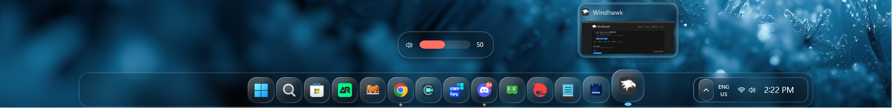

## Dock(Dark)


## Taskbar(Dark)
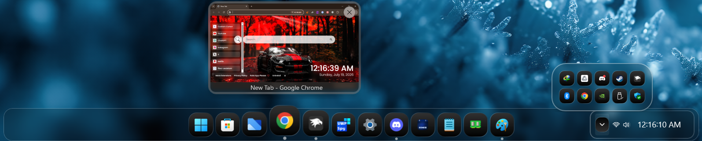


# Other Previews

## Volume/Brightness indicator:
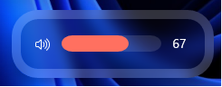

## Tray:
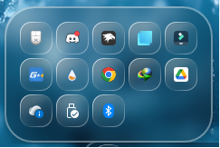

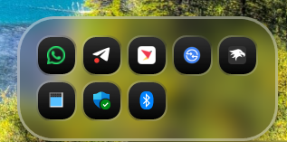

## Context Menu:
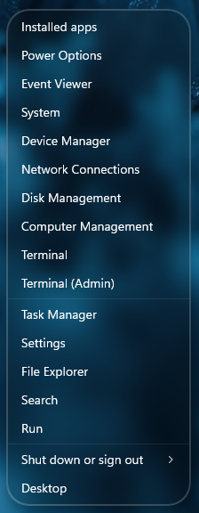

## Thumbnail:
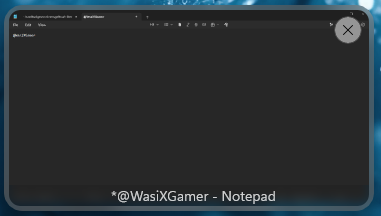

## Windows Selector:
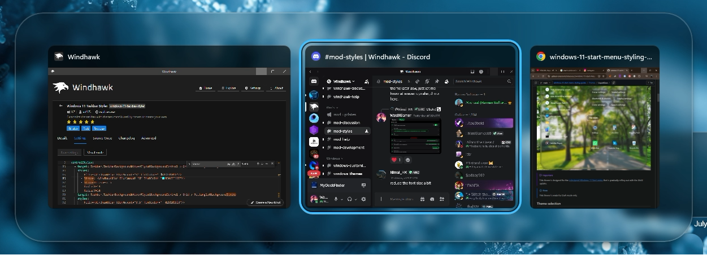 

---

> [!NOTE]
> Do Not use Taskbar Height And Icon Size Mod with this! It will Not work and force the taskbar to go against the border of the screen.

# Taskbar Thumbnail Size Configurations

The Thumbnails look more appropriate with the [Taskbar Thumbnail Size](https://windhawk.net/mods/taskbar-thumbnail-size) Mod. The following Configuration is Preferable to use:
```yaml
size: 180
useAbsoluteSize: 0
minWidth: 0
minHeight: 0
maxWidth: 0
maxHeight: 0
preserveAspectRatio: 0
```

# Taskbar Dock Animation Confiuration

The Mod can be made look better and more like MacOS by using [Taskbar Dock Animation](https://windhawk.net/mods/taskbar-dock-animation) Mod! The Following config is Recommended to be used:
```yaml
AnimationType: 0
MaxScale: 130
EffectRadius: 180
SpacingFactor: 80
BounceDelay: 500
FocusDuration: 150
MirrorForTopTaskbar: 0
DisableVerticalBounce: 0
TaskbarLabelsMode: 0
ExcludeSystemButtonsMode: 0
LerpSpeed: 60
DisableBounce: 1
```
## Preview:
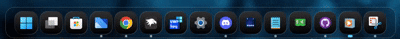


# Theme selection

The theme is integrated into the mod and can be selected directly from the mod's settings:

* Open the Windows 11 Taskbar Styler mod in Windhawk.
* Go to the "Settings" tab.
* Select the theme and save the settings.

# Manual installation

The theme styles can also be imported manually. To do that, follow these steps:

* Open the Windows 11 Taskbar Styler mod in Windhawk.
* Go to the "Settings" tab and select "Textual mode".
* Copy the content below to the text box and click "Save settings".

# Clear Variants:

## OS26 Liquid Glass (Clear, MacDock) Configuration

<details>
<summary>Content to import (click to expand)</summary>

```yaml


styleConstants:
  - IconBackground=<ImageBrush ImageSource="https://raw.githubusercontent.com/ramensoftware/windows-11-taskbar-styling-guide/refs/heads/main/Themes/OS26 Liquid Glass/Assets/tahoeappbg.png" Stretch="UniformtoFill"/>
  - IconBorder= <LinearGradientBrush EndPoint="1,1" StartPoint="0,0"><GradientStop Color="#F5ffffff" Offset="0.0"/><GradientStop Color="#40ffffff" Offset="0.4"/><GradientStop Color="#20ffffff" Offset="0.6"/><GradientStop Color="#90ffffff" Offset="1.0"/></LinearGradientBrush>
controlStyles:
  - target: Taskbar.TaskbarFrame
    styles:
      - Width=auto
      - MinWidth:=100
      - Grid.Column=1
      - Transitions:=<TransitionCollection><RepositionThemeTransition IsStaggeringEnabled="False"/></TransitionCollection>
      - Height=80
      - MaxHeight=80
      - HorizontalAlignment=Center
  - target: Taskbar.TaskListLabeledButtonPanel#IconPanel > Image#Icon
    styles:
      - Height=24
      - Width=24
      - Margin=10,0,0,0
  - target: Taskbar.TaskListButtonPanel
    styles:
      - Width=55
      - Height=70
  - target: Taskbar.TaskListLabeledButtonPanel
    styles:
      - Width=55
      - Height=70
  - target: SearchUx.SearchUI.SearchButtonControl > Grid > SearchUx.SearchUI.SearchIconButton#SearchIcon > SearchUx.SearchUI.SearchButtonRootGrid#SearchBoxButtonRootPanel
    styles:
      - Width=55
      - Height=70
  - target: Taskbar.TaskbarFrame > Grid#RootGrid
    styles:
      - Margin=0,8,0,2
      - Padding=20,0,20,0
      - BorderBrush=#40FFFFFF
  - target: Grid#RootGrid > Taskbar.TaskbarBackground > Grid
    styles:
      - Background:=<WindhawkBlur BlurAmount="8" TintColor="#2D101010"/>
      - CornerRadius=20,0,0,20
      - BorderThickness=1,1,0,1
      - Width=Auto
      - Margin=-20,0,-20,0
      - BorderBrush=#40FFFFFF
      - Padding=-1
  - target: Rectangle#BackgroundStroke
    styles:
      - Fill=Transparent
  - target: Windows.UI.Xaml.Controls.FlyoutPresenter
    styles:
      - RequestedTheme=Dark
      - Background:=<WindhawkBlur BlurAmount="8" TintColor="#2D101010"/>
      - BorderThickness=2
      - BorderBrush:=<WindhawkBlur BlurAmount="8" TintColor="#30ffffff"/>
      - CornerRadius=33
      - Padding=2,3,2,3
  - target: Windows.UI.Xaml.Controls.Border#SnapPickerBorder
    styles:
      - RequestedTheme=Dark
      - Background:=Transparent
      - BorderBrush:=Transparent
      - BorderThickness=2
      - Margin=0
  - target: WindowsInternal.ComposableShell.Experiences.Switcher.AltTab > Grid#ModalRootGrid > Border#BackgroundElement
    styles:
      - Background:=<WindhawkBlur BlurAmount="8" TintColor="#2D101010"/>
      - BorderThickness=2
      - BorderBrush:=<WindhawkBlur BlurAmount="8" TintColor="#30ffffff"/>
      - CornerRadius=50
  - target: MenuFlyoutPresenter
    styles:
      - CornerRadius=20
  - target: MenuFlyoutPresenter > Border
    styles:
      - Background:=<WindhawkBlur BlurAmount="8" TintColor="#2D101010"/>
      - BorderThickness=2
      - CornerRadius=25
      - BorderBrush:=<WindhawkBlur BlurAmount="8" TintColor="#30ffffff"/>
  - target: SystemTray.SystemTrayFrame > Grid#SystemTrayFrameGrid > SystemTray.Stack#NotifyIconStack > Grid#Content > SystemTray.StackListView#IconStack > ItemsPresenter > StackPanel > ContentPresenter > SystemTray.ChevronIconView > Grid#ContainerGrid > ContentPresenter#ContentPresenter > Grid#ContentGrid
    styles:
      - Height=48
      - Width=48
      - Margin=25,2,8,0
      - CornerRadius=15
      - Background=transparent
      - BorderBrush:=lightgray
      - BorderThickness=3
  - target: SystemTray.SystemTrayFrame > Grid#SystemTrayFrameGrid > SystemTray.Stack#NonActivatableStack > Grid#Content > SystemTray.StackListView#IconStack > ItemsPresenter > StackPanel > ContentPresenter > SystemTray.IconView#SystemTrayIcon > Grid#ContainerGrid > ContentPresenter#ContentPresenter > Grid#ContentGrid > SystemTray.TextIconContent > Grid#ContainerGrid
    styles:
      - Width=48
      - Height=48
      - Margin=0,4,2,0
      - Background:=$IconBackground
      - BorderBrush:=$IconBorder
      - BorderThickness=1.2
      - CornerRadius=15
  - target: SystemTray.ChevronIconView > Grid#ContainerGrid > ContentPresenter#ContentPresenter > Grid#ContentGrid > SystemTray.TextIconContent
    styles:
      - FontWeight=bold
      - FontSize=32
  - target: Grid#SystemTrayFrameGrid
    styles:
      - Margin=0,0,0.5,0
      - Height=70
      - VerticalAlignment=Bottom
      - Padding=0
      - Background:=<WindhawkBlur BlurAmount="8" TintColor="#2D101010"/>
      - BorderBrush=#40FFFFFF
      - BorderThickness=0,1,1,1
      - CornerRadius=0,20,20,0
      - Visibility=Visible
  - target: SystemTray.Stack#NotifyIconStack > Grid#Content > SystemTray.StackListView#IconStack > ItemsPresenter > StackPanel > ContentPresenter > SystemTray.ChevronIconView > Grid#ContainerGrid > Border#BackgroundBorder
    styles:
      - Background=transparent
      - BorderBrush=#40FFFFFF
      - BorderThickness=2,0,0,0
      - Padding=0
      - CornerRadius=0
      - Height=40
  - target: TextBlock#DateInnerTextBlock
    styles:
      - FontWeight=Bold
      - Margin=-2,9,2,-9
      - Foreground=white
      - Visibility=visible
      - RenderTransform:=<TranslateTransform X="0" Y="-9"/>
      - FontSize=13
      - FontFamily=vivo Sans EN VF
  - target: TextBlock#TimeInnerTextBlock
    styles:
      - Foreground=white
      - Width=Auto
      - FontWeight=Bold
      - FontSize=15
      - Margin=0,-4,5,4
  - target: SystemTray.DateTimeIconContent > Grid#ContainerGrid
    styles:
      - CornerRadius=12
      - BorderThickness=1.2
      - Background:=<LinearGradientBrush StartPoint="0.50,-1.50" EndPoint="0.50,2.50"><GradientStop Offset="0.48" Color="#54CCCCCC"/><GradientStop Offset="0.49" Color="#423E3C3C"/></LinearGradientBrush>
      - BorderBrush:=$IconBorder
      - Height=45
      - Margin=0,3,0,-1
      - Width=Auto
  - target: SystemTray.AdaptiveTextBlock > TextBlock
    styles:
      - FontSize=30
  - target: SystemTray.SystemTrayFrame
    styles:
      - Height=75
      - Grid.Column=2
      - Width=Auto
      - HorizontalAlignment=Left
      - Margin=0,1,0,-0.5
  - target: :root > ScrollViewer > ScrollContentPresenter > Border > Grid
    styles:
      - ColumnDefinitions:=<ColumnDefinitionCollection><ColumnDefinition Width="*"/><ColumnDefinition Width="Auto"/><ColumnDefinition Width="Auto"/><ColumnDefinition Width="*"/></ColumnDefinitionCollection>
      - ActualWidth=>containerGridWidth
  - target: SystemTray.SystemTrayFrame > Grid#SystemTrayFrameGrid > SystemTray.Stack#NonActivatableStack > Grid#Content > SystemTray.StackListView#IconStack > ItemsPresenter > StackPanel > ContentPresenter > SystemTray.IconView#SystemTrayIcon > Grid#ContainerGrid > Border#BackgroundBorder
    styles:
      - Background:=Transparent
      - BorderThickness=0
  - target: SystemTray.OmniButton#ControlCenterButton > Grid > Border#BackgroundBorder
    styles:
      - Background:=Transparent
      - BorderThickness=0
  - target: SystemTray.SystemTrayFrame > Grid#SystemTrayFrameGrid > SystemTray.OmniButton#NotificationCenterButton > Grid > ContentPresenter#ContentPresenter > ItemsPresenter > StackPanel > ContentPresenter > SystemTray.IconView#SystemTrayIcon > Grid#ContainerGrid > ContentPresenter#ContentPresenter
    styles:
      - Background:=transparent
      - BorderThickness=0
  - target: SystemTray.Stack#MainStack
    styles:
      - Visibility=1
      - // System tray > Microphone and Location Icons Grid
  - target: SystemTray.Stack#ShowDesktopStack
    styles:
      - Visibility=1
      - Width=48
      - Height=48
      - Margin=0,4,2,0
      - Background:=$IconBackground
      - BorderBrush:=$IconBorder
      - BorderThickness=1.2
      - CornerRadius=15
      - // System Tray > Show Desktop Button
  - target: SystemTray.OmniButton#ControlCenterButton > Grid > ContentPresenter > ItemsPresenter > StackPanel > ContentPresenter[1] > SystemTray.IconView > Grid > Grid
    styles:
      - Visibility=Visible
      - Width=48
      - Height=48
      - Margin=0,4,2,0
      - Background:=$IconBackground
      - BorderBrush:=$IconBorder
      - BorderThickness=1.2
      - CornerRadius=15
      - // [Tray Wifi Icon. Set Visibility=Collapsed to Remove it, and Visibility=Visible to bring it back]
  - target: SystemTray.OmniButton#ControlCenterButton > Grid > ContentPresenter > ItemsPresenter > StackPanel > ContentPresenter[2] > SystemTray.IconView > Grid > Grid
    styles:
      - Visibility=Collapsed
      - Width=48
      - Height=48
      - Margin=0,4,2,0
      - Background:=$IconBackground
      - BorderBrush:=$IconBorder
      - BorderThickness=1.2
      - CornerRadius=15
      - // [Tray Audio Icon. Set Visibility=Collapsed to Remove it, and Visibility=Visible to bring it back]
  - target: SystemTray.OmniButton#ControlCenterButton > Grid > ContentPresenter > ItemsPresenter > StackPanel > ContentPresenter[3] > SystemTray.IconView > Grid > Grid
    styles:
      - Visibility=Visible
      - Width=48
      - Height=48
      - Margin=0,4,2,0
      - Background:=$IconBackground
      - BorderBrush:=$IconBorder
      - BorderThickness=1.2
      - CornerRadius=15
      - // [Tray Battery Icon. Set Visibility=Collapsed to Remove it, and Visibility=Visible to bring it back]
  - target: SystemTray.SystemTrayFrame > Grid#SystemTrayFrameGrid > SystemTray.OmniButton#NotificationCenterButton > Grid > ContentPresenter#ContentPresenter > ItemsPresenter > StackPanel > ContentPresenter > SystemTray.IconView#SystemTrayIcon > Grid#ContainerGrid > ContentPresenter#ContentPresenter > Grid#ContentGrid > SystemTray.TextIconContent > Grid#ContainerGrid
    styles:
      - Visibility=Visible
      - Width=48
      - Height=48
      - Margin=0,4,2,0
      - Background:=$IconBackground
      - BorderBrush:=$IconBorder
      - BorderThickness=1.2
      - CornerRadius=15
      - // [Notify Icon. Set Visibility=Collapsed to Remove it, and Visibility=Visible to bring it back]
  - target: SystemTray.SystemTrayFrame > Grid#SystemTrayFrameGrid > SystemTray.OmniButton#ControlCenterButton > Grid > ContentPresenter#ContentPresenter > ItemsPresenter > StackPanel > ContentPresenter > SystemTray.IconView#SystemTrayIcon > Grid#ContainerGrid > Grid#ContentGrid > SystemTray.TextIconContent > Grid#ContainerGrid > SystemTray.AdaptiveTextBlock#Underlay > TextBlock#InnerTextBlock
    styles:
      - Foreground=white
  - target: Taskbar.TaskListButtonPanel@CommonStates > Border#BackgroundElement
    styles:
      - CornerRadius=15
      - Margin=0,5.5,0,5.5
      - Background:=$IconBackground
      - BorderBrush:=$IconBorder
      - BorderThickness=1.2
  - target: Taskbar.TaskbarBackground#HoverFlyoutBackgroundControl > Grid > Rectangle#BackgroundStroke
    styles:
      - Fill:=<WindhawkBlur BlurAmount="3.5" TintColor="#2D101010"/>
      - Stroke:=<WindhawkBlur BlurAmount="8" TintColor="#30ffffff"/>
      - StrokeThickness=5
      - RadiusX=14
      - RadiusY=14
      - Fill:=<<WindhawkBlur BlurAmount="8" TintColor="#30ffffff"/>
  - target: Taskbar.TaskbarBackground#HoverFlyoutBackgroundControl > Grid > Rectangle#BackgroundFill
    styles:
      - Canvas.ZIndex=0
      - Fill:=
      - Stroke:=<WindhawkBlur BlurAmount="8" TintColor="#30ffffff"/>
      - StrokeThickness=5
      - RadiusX=14
      - RadiusY=14
  - target: Taskbar.FlyoutFrame > Windows.UI.Xaml.Controls.Canvas#HoverFlyoutCanvas > Windows.UI.Xaml.Controls.Grid#HoverFlyoutGrid > Windows.UI.Xaml.Controls.ContentPresenter#HoverFlyoutContent > Taskbar.TaskItemThumbnailList > Microsoft.UI.Xaml.Controls.ItemsRepeater#TaskItemThumbnailListRepeater > Taskbar.TaskItemThumbnailView > Windows.UI.Xaml.Controls.Grid > Windows.UI.Xaml.Controls.Border#BackgroundBorder
    styles:
      - VerticalAlignment=Bottom
      - Canvas.ZIndex=1
      - Background:=<WindhawkBlur BlurAmount="5" TintColor="#761E1E1E"/>
      - Height=25
      - CornerRadius=0,0,15,15
      - Margin=5,0,5,0
  - target: Border#HoverFlyoutBackground
    styles:
      - Margin=4,36,4,0
      - Canvas.ZIndex=1
      - Width=Auto
      - Background:=Transparent
      - BorderThickness=0
      - CornerRadius=15
  - target: Microsoft.UI.Xaml.Controls.ItemsRepeater#ThumbBarRepeater > Taskbar.ThumbBarButton#ThumbBarButton > Windows.UI.Xaml.Controls.ContentPresenter#BorderElement
    styles:
      - Background:=<WindhawkBlur BlurAmount="8" TintColor="#761E1E1E"/>
      - Margin=0,-20,0,20
  - target: Microsoft.UI.Xaml.Controls.ItemsRepeater#IconsRepeater > Windows.UI.Xaml.Controls.Image
    styles:
      - Visibility=Collapsed
  - target: Windows.UI.Xaml.Controls.Button#CloseButton
    styles:
      - HorizontalAlignment=left
      - Grid.ColumnSpan=1
      - Grid.RowSpan=1
      - Canvas.ZIndex=1
      - CornerRadius=20
      - Width=28
      - Height=28
      - Margin=-18,40,15,-40
      - Background:=<WindhawkBlur BlurAmount="8" TintColor="#80ffffff"/>
      - Foreground=black
      - BorderBrush:=<WindhawkBlur BlurAmount="8" TintColor="#761E1E1E"/>
  - target: Taskbar.FlyoutFrame > Windows.UI.Xaml.Controls.Canvas#HoverFlyoutCanvas > Windows.UI.Xaml.Controls.Grid#HoverFlyoutGrid > Windows.UI.Xaml.Controls.ContentPresenter#HoverFlyoutContent > Taskbar.TaskItemThumbnailList > Microsoft.UI.Xaml.Controls.ItemsRepeater#TaskItemThumbnailListRepeater > Taskbar.TaskItemThumbnailView > Windows.UI.Xaml.Controls.Grid > Windows.UI.Xaml.Controls.TextBlock#DisplayNameTextBlock
    styles:
      - Grid.ColumnSpan=2
      - Grid.RowSpan=2
      - VerticalAlignment=bottom
      - HorizontalAlignment=Center
      - Margin=0,-5,0,5
      - Canvas.ZIndex=1
  - target: SystemTray.NotifyIconView@CommonStates > Grid#ContainerGrid > Border#BackgroundBorder
    styles:
      - CornerRadius=12
      - Background:=$IconBackground
      - BorderBrush:=$IconBorder
      - Margin=2
      - BorderThickness=1.2
  - target: Border#OverflowFlyoutBackgroundBorder
    styles:
      - Background:=<WindhawkBlur BlurAmount="8" TintColor="#2D101010"/>
      - BorderBrush:=<WindhawkBlur BlurAmount="8" TintColor="#60ffffff"/>
      - BorderThickness=2
      - CornerRadius=32,32,30,30
      - Margin=-10
  - target: Taskbar.TaskListLabeledButtonPanel@RunningIndicatorStates > Rectangle#RunningIndicator
    styles:
      - Fill:=#90ffffff
      - RadiusX=3
      - RadiusY=3
      - Margin=-2
      - Height=6
      - Width=6
      - Margin=10,0,0,-2
      - Width@ActiveRunningIndicator=12
      - Fill@ActiveRunningIndicator=#60CDFF
  - target: Taskbar.TaskListLabeledButtonPanel > TextBlock#LabelControl
    styles:
      - Margin=4,0,0,0
      - Foreground=White
  - target: Taskbar.SearchBoxButton
    styles:
      - Background:=<WindhawkBlur BlurAmount="60" TintColor="#35ffffff"/>
      - CornerRadius=20
      - Margin=2,6,2,6
      - BorderBrush:=<LinearGradientBrush EndPoint="1,1" StartPoint="0,0"><GradientStop Color="#E0ffffff" Offset="0.0"/><GradientStop Color="#20ffffff" Offset="0.5"/><GradientStop Color="#A0ffffff" Offset="1.0"/></LinearGradientBrush>
      - BorderThickness=1.2
  - target: TextBlock#SearchBoxTextBlock
    styles:
      - FontSize=12
      - Foreground=White
  - target: Grid
    styles:
      - RequestedTheme=2
  - target: Taskbar.StartButton#StartButton
    styles:
      - Background:=<WindhawkBlur BlurAmount="60" TintColor="#35ffffff"/>
      - CornerRadius=20
      - Margin=2,6,2,6
      - BorderBrush:=<LinearGradientBrush EndPoint="1,1" StartPoint="0,0"><GradientStop Color="#E0ffffff" Offset="0.0"/><GradientStop Color="#20ffffff" Offset="0.5"/><GradientStop Color="#A0ffffff" Offset="1.0"/></LinearGradientBrush>
      - BorderThickness=1.2
  - target: Border#MultiWindowElement
    styles:
      - Visibility=Collapsed
  - target: SystemTray.TextIconContent > Grid > SystemTray.AdaptiveTextBlock#Base > TextBlock
    styles:
      - Foreground=White
  - target: Taskbar.AugmentedEntryPointButton#AugmentedEntryPointButton
    styles:
      - Margin=-12,0,0,0
  - target: SearchUx.SearchUI.SearchButtonControl > Grid > SearchUx.SearchUI.SearchIconButton#SearchIcon > SearchUx.SearchUI.SearchButtonRootGrid#SearchBoxButtonRootPanel > Border#BackgroundElement
    styles:
      - Margin=0,5.5,0,5.5
      - CornerRadius=15
      - Background:=$IconBackground
      - BorderBrush:=$IconBorder
  - target: Taskbar.ExperienceToggleButton#LaunchListButton[AutomationProperties.Name=Task View]
    styles:
      - Background:=<WindhawkBlur BlurAmount="60" TintColor="#35ffffff"/>
      - CornerRadius=20
      - BorderBrush:=<LinearGradientBrush EndPoint="1,1" StartPoint="0,0"><GradientStop Color="#E0ffffff" Offset="0.0"/><GradientStop Color="#20ffffff" Offset="0.5"/><GradientStop Color="#A0ffffff" Offset="1.0"/></LinearGradientBrush>
      - BorderThickness=1.2
  - target: taskbar:TaskListLabeledButtonPanel@RunningIndicatorStates > Border
    styles:
      - Background@InactiveRunningIndicatorPointerOver:=<WindhawkBlur BlurAmount="40" TintColor="#10ffffff"/>
      - CornerRadius=12
      - BorderBrush@InactiveRunningIndicatorPointerOver:=<LinearGradientBrush EndPoint="1,0" StartPoint="0,0"><GradientStop Color="#80ffffff" Offset="0.0"/><GradientStop Color="{ThemeResource SurfaceStrokeColorDefault}" Offset="0.55"/><GradientStop Color="#80ffffff" Offset="1"/></LinearGradientBrush>
      - BorderThickness@InactiveRunningIndicatorPointerOver=1
  - target: Taskbar.TaskListLabeledButtonPanel@CommonStates > Border#BackgroundElement
    styles:
      - CornerRadius=15
      - Margin=0,5.5,0,5.5
      - Background:=$IconBackground
      - BorderBrush:=$IconBorder
      - BorderThickness=1.2
  - target: Taskbar.TaskbarFrame > Grid#RootGrid > Taskbar.TaskbarBackground > Grid > Rectangle#BackgroundFill
    styles:
      - Fill=Transparent
  - target: SystemTray.NotifyIconView#NotifyItemIcon
    styles:
      - Background:=<WindhawkBlur BlurAmount="10" TintColor="#40ffffff"/>
      - CornerRadius=12
      - Margin=2
      - Padding=2
      - BorderBrush:=<LinearGradientBrush EndPoint="1,0" StartPoint="0,0"><GradientStop Color="#80ffffff" Offset="0.0"/><GradientStop Color="{ThemeResource SurfaceStrokeColorDefault}" Offset="0.55"/><GradientStop Color="#80ffffff" Offset="1"/></LinearGradientBrush>
      - BorderThickness=2
  - target: Windows.UI.Xaml.Controls.Grid#ConfirmatorMainGrid
    styles:
      - Background:=<WindhawkBlur BlurAmount="8" TintColor="#2D101010"/>
      - CornerRadius=24
      - BorderBrush:=<WindhawkBlur BlurAmount="8" TintColor="#30ffffff"/>
      - BorderThickness=2
      - Margin=0,0,0,10
  - target: Windows.UI.Xaml.Controls.Grid.Border#ConfirmatorMainGrid
    styles:
      - Background:=<WindhawkBlur BlurAmount="8" TintColor="#2D101010"/>
  - target: Windows.UI.Xaml.Shapes.Rectangle#HorizontalTrackRect
    styles:
      - Fill=#20ffffff
      - RadiusX=12
      - RadiusY=12
      - Height=18
      - Margin=0
  - target: Windows.UI.Xaml.Shapes.Rectangle#HorizontalDecreaseRect
    styles:
      - Fill:=<SolidColorBrush Color="{ThemeResource SystemAccentColor}" />
      - RadiusX=12
      - RadiusY=12
      - Height=18
  - target: Windows.UI.Xaml.Controls.Grid#VolumeConfirmator
    styles:
      - Padding=8,0,8,0
  - target: Windows.UI.Xaml.Controls.Grid#BrightnessConfirmator
    styles:
      - Padding=8,0,8,0
  - target: Windows.UI.Xaml.Controls.TextBlock#volumeLevelText
    styles:
      - Foreground=White
themeResourceVariables:
  - ''
clickThroughTaskbar: 1
xamlDiagnosticsHandling: ''

```
</details>

## OS26 Liquid Glass (Clear Taskbar, Island) Configuration

<details>
<summary>Content to import (click to expand)</summary>

```yaml
styleConstants:
  - IconBackground= <ImageBrush ImageSource="https://raw.githubusercontent.com/ramensoftware/windows-11-taskbar-styling-guide/refs/heads/main/Themes/OS26 Liquid Glass/Assets/tahoeappbg.png" Stretch="UniformtoFill"/>
  - IconBorder= <LinearGradientBrush EndPoint="1,1" StartPoint="0,0"><GradientStop Color="#F5ffffff" Offset="0.0"/><GradientStop Color="#40ffffff" Offset="0.4"/><GradientStop Color="#20ffffff" Offset="0.6"/><GradientStop Color="#90ffffff" Offset="1.0"/></LinearGradientBrush>
controlStyles:
  - target: Taskbar.TaskbarFrame
    styles:
      - Height=80
      - MaxHeight=80
      - HorizontalAlignment=Center
  - target: Taskbar.TaskListLabeledButtonPanel#IconPanel > Image#Icon
    styles:
      - Height=24
      - Width=24
      - Margin=10,0,0,0
  - target: Taskbar.TaskListButtonPanel
    styles:
      - Width=55
      - Height=70
  - target: Taskbar.TaskListLabeledButtonPanel
    styles:
      - Width=55
      - Height=70
  - target: SearchUx.SearchUI.SearchButtonControl > Grid > SearchUx.SearchUI.SearchIconButton#SearchIcon > SearchUx.SearchUI.SearchButtonRootGrid#SearchBoxButtonRootPanel
    styles:
      - Width=55
      - Height=70      
  - target: Grid#RootGrid > Taskbar.TaskbarBackground > Grid
    styles:
      - CornerRadius=20
      - Background:=<WindhawkBlur BlurAmount="8" TintColor="#2D101010"/>
      - BorderThickness=1
      - Margin=150,0,150,0
      - BorderBrush=#40FFFFFF
      - Padding=-1
  - target: Rectangle#BackgroundStroke
    styles:
      - Fill=Transparent

  - target: Taskbar.TaskbarFrame > Grid#RootGrid
    styles:
      - Visibility=Visible
      - Margin=0,8,0,2
      - Padding=20,0,20,0
  - target: Taskbar.TaskbarFrame > Grid#RootGrid > Taskbar.TaskbarBackground > Grid >
    styles:
      - ''
  - target: Windows.UI.Xaml.Controls.FlyoutPresenter
    styles:
      - RequestedTheme=Dark
      - Background:=<WindhawkBlur BlurAmount="8" TintColor="#2D101010"/>
      - BorderThickness=2
      - BorderBrush:=<WindhawkBlur BlurAmount="8" TintColor="#30ffffff"/>
      - CornerRadius=33
      - Padding=2,3,2,3
  - target: Windows.UI.Xaml.Controls.Border#SnapPickerBorder
    styles:
      - RequestedTheme=Dark
      - Background:=Transparent
      - BorderBrush:=Transparent
      - BorderThickness=2
      - Margin=0
  - target: WindowsInternal.ComposableShell.Experiences.Switcher.AltTab > Grid#ModalRootGrid > Border#BackgroundElement
    styles:
      - Background:=<WindhawkBlur BlurAmount="8" TintColor="#2D101010"/>
      - BorderThickness=2
      - BorderBrush:=<WindhawkBlur BlurAmount="8" TintColor="#30ffffff"/>
      - CornerRadius=50
  - target: MenuFlyoutPresenter
    styles:
      - CornerRadius=20
  - target: MenuFlyoutPresenter > Border
    styles:
      - Background:=<WindhawkBlur BlurAmount="8" TintColor="#2D101010"/>
      - BorderThickness=2
      - CornerRadius=25
      - BorderBrush:=<WindhawkBlur BlurAmount="8" TintColor="#30ffffff"/>
  - target: ScrollViewer > ScrollContentPresenter > Border > Grid > SystemTray.SystemTrayFrame > Grid#SystemTrayFrameGrid > SystemTray.Stack#NotifyIconStack > Grid#Content > SystemTray.StackListView#IconStack > ItemsPresenter > StackPanel > ContentPresenter > SystemTray.ChevronIconView > Grid#ContainerGrid > ContentPresenter#ContentPresenter > Grid#ContentGrid
    styles:
      - Height=35
      - CornerRadius=12
      - Background:=$IconBackground
      - BorderBrush:=$IconBorder
      - BorderThickness=1.2
  - target: Grid#SystemTrayFrameGrid
    styles:
      - Width=Auto
      - Background:=<WindhawkBlur BlurAmount="8" TintColor="#2D101010"/>
      - CornerRadius=15
      - Margin=80,5,-255,-5
      - RenderTransform:=<TranslateTransform X="-435" Y="-2"/>
      - Padding=10,2
      - BorderBrush:=<LinearGradientBrush EndPoint="1,1" StartPoint="0,0"><GradientStop Color="#50ffffff" Offset="0.0"/><GradientStop Color="#10ffffff" Offset="0.5"/><GradientStop Color="#30ffffff" Offset="1.0"/></LinearGradientBrush>
      - BorderThickness=2
      - Visibility=Visible
  - target: Taskbar.TaskListButtonPanel@CommonStates > Border#BackgroundElement
    styles:
      - CornerRadius=15
      - Margin=0,5.5,0,5.5
      - Background:=$IconBackground
      - BorderBrush:=$IconBorder
      - BorderThickness=1.2
  - target: Taskbar.TaskbarBackground#HoverFlyoutBackgroundControl > Grid > Rectangle#BackgroundStroke
    styles:
      - Fill:=<WindhawkBlur BlurAmount="3.5" TintColor="#2D101010"/>
      - Stroke:=<WindhawkBlur BlurAmount="8" TintColor="#30ffffff"/>
      - StrokeThickness=5
      - RadiusX=14
      - RadiusY=14
      - Fill:=<<WindhawkBlur BlurAmount="8" TintColor="#30ffffff"/>
  - target: Taskbar.TaskbarBackground#HoverFlyoutBackgroundControl > Grid > Rectangle#BackgroundFill
    styles:
      - Canvas.ZIndex=0
      - Fill:=
      - Stroke:=<WindhawkBlur BlurAmount="8" TintColor="#30ffffff"/>
      - StrokeThickness=5
      - RadiusX=14
      - RadiusY=14
  - target: Taskbar.FlyoutFrame > Windows.UI.Xaml.Controls.Canvas#HoverFlyoutCanvas > Windows.UI.Xaml.Controls.Grid#HoverFlyoutGrid > Windows.UI.Xaml.Controls.ContentPresenter#HoverFlyoutContent > Taskbar.TaskItemThumbnailList > Microsoft.UI.Xaml.Controls.ItemsRepeater#TaskItemThumbnailListRepeater > Taskbar.TaskItemThumbnailView > Windows.UI.Xaml.Controls.Grid > Windows.UI.Xaml.Controls.Border#BackgroundBorder
    styles:
      - VerticalAlignment=Bottom
      - Canvas.ZIndex=1
      - Background:=<WindhawkBlur BlurAmount="5" TintColor="#761E1E1E"/>
      - Height=25
      - CornerRadius=0,0,15,15
      - Margin=5,0,5,0
  - target: Border#HoverFlyoutBackground
    styles:
      - Margin=4,36,4,0
      - Canvas.ZIndex=1
      - Width=Auto
      - Background:=Transparent
      - BorderThickness=0
      - CornerRadius=15
  - target: Microsoft.UI.Xaml.Controls.ItemsRepeater#IconsRepeater > Windows.UI.Xaml.Controls.Image
    styles:
      - Visibility=Collapsed
  - target: Microsoft.UI.Xaml.Controls.ItemsRepeater#ThumbBarRepeater > Taskbar.ThumbBarButton#ThumbBarButton > Windows.UI.Xaml.Controls.ContentPresenter#BorderElement      
    styles:
      - Background:=<WindhawkBlur BlurAmount="8" TintColor="#761E1E1E"/>
      - Margin=0,-20,0,20
  - target: Windows.UI.Xaml.Controls.Button#CloseButton
    styles:
      - HorizontalAlignment=left
      - Grid.ColumnSpan=1
      - Grid.RowSpan=1
      - Canvas.ZIndex=1
      - CornerRadius=20
      - Width=28
      - Height=28
      - Margin=-18,40,15,-40
      - Background:=<WindhawkBlur BlurAmount="8" TintColor="#80ffffff"/>
      - Foreground=black
      - BorderBrush:=<WindhawkBlur BlurAmount="8" TintColor="#761E1E1E"/>
  - target: Taskbar.FlyoutFrame > Windows.UI.Xaml.Controls.Canvas#HoverFlyoutCanvas > Windows.UI.Xaml.Controls.Grid#HoverFlyoutGrid > Windows.UI.Xaml.Controls.ContentPresenter#HoverFlyoutContent > Taskbar.TaskItemThumbnailList > Microsoft.UI.Xaml.Controls.ItemsRepeater#TaskItemThumbnailListRepeater > Taskbar.TaskItemThumbnailView > Windows.UI.Xaml.Controls.Grid > Windows.UI.Xaml.Controls.TextBlock#DisplayNameTextBlock
    styles:
      - Grid.ColumnSpan=2
      - Grid.RowSpan=2
      - VerticalAlignment=bottom
      - HorizontalAlignment=Center
      - Margin=0,-5,0,5
      - Canvas.ZIndex=1

  - target: SystemTray.NotifyIconView@CommonStates > Grid#ContainerGrid > Border#BackgroundBorder
    styles:
      - CornerRadius=12
      - Background:=$IconBackground
      - BorderBrush:=$IconBorder
      - Margin=2
      - BorderThickness=1.2
  - target: SystemTray.NotifyIconView@CommonStates > Grid#ContainerGrid > Border#BackgroundBorder
    styles:
      - CornerRadius=12
      - Background:=$IconBackground
      - BorderBrush:=$IconBorder
      - Margin=2
      - BorderThickness=1.2
  - target: Border#OverflowFlyoutBackgroundBorder
    styles:
      - Background:=<WindhawkBlur BlurAmount="8" TintColor="#2D101010"/>
      - BorderBrush:=<WindhawkBlur BlurAmount="8" TintColor="#60ffffff"/>
      - BorderThickness=2
      - CornerRadius=32,32,30,30
      - Margin=-10
  - target: SystemTray.OmniButton#ControlCenterButton > Grid > ContentPresenter > ItemsPresenter > StackPanel > ContentPresenter > SystemTray.IconView#SystemTrayIcon > Grid > Grid > SystemTray.TextIconContent
    styles:
      - CornerRadius=15
  - target: Taskbar.TaskListLabeledButtonPanel@RunningIndicatorStates > Rectangle#RunningIndicator
    styles:
      - Fill:=#90ffffff
      - RadiusX=3 
      - RadiusY=3 
      - Margin=-2
      - Height=6
      - Width=6
      - Margin=10,0,0,-2 
      - Width@ActiveRunningIndicator=12
      - Fill@ActiveRunningIndicator=#60CDFF
  - target: Taskbar.TaskListLabeledButtonPanel > TextBlock#LabelControl
    styles:
      - Margin=4,0,0,0
      - Foreground=White
  - target: Taskbar.SearchBoxButton
    styles:
      - Background:=<WindhawkBlur BlurAmount="60" TintColor="#35ffffff"/>
      - CornerRadius=20
      - Margin=2,6,2,6
      - BorderBrush:=<LinearGradientBrush EndPoint="1,1" StartPoint="0,0"><GradientStop Color="#E0ffffff" Offset="0.0"/><GradientStop Color="#20ffffff" Offset="0.5"/><GradientStop Color="#A0ffffff" Offset="1.0"/></LinearGradientBrush>
      - BorderThickness=1.2
  - target: TextBlock#SearchBoxTextBlock
    styles:
      - FontSize=12
      - Foreground=White
  - target: Grid
    styles:
      - RequestedTheme=2
  - target: Taskbar.TaskListButton#TaskListButton[AutomationProperties.Name=Copilot] > Taskbar.TaskListLabeledButtonPanel#IconPanel > Border#BackgroundElement
    styles:
      - Background:=$IconBackground
  - target: Taskbar.StartButton#StartButton
    styles:
      - Background:=<WindhawkBlur BlurAmount="60" TintColor="#35ffffff"/>
      - CornerRadius=20
      - Margin=2,6,2,6
      - BorderBrush:=<LinearGradientBrush EndPoint="1,1" StartPoint="0,0"><GradientStop Color="#E0ffffff" Offset="0.0"/><GradientStop Color="#20ffffff" Offset="0.5"/><GradientStop Color="#A0ffffff" Offset="1.0"/></LinearGradientBrush>
      - BorderThickness=1.2
  - target: Border#MultiWindowElement
    styles:
      - Visibility=Collapsed
  - target: TextBlock#TimeInnerTextBlock
    styles:
      - Foreground=White
      - FontSize=18
      - FontFamily=Quantico
      - Margin=0
      - Padding=0
      - RenderTransform:=<TranslateTransform X="0" Y="1"/>
  - target: TextBlock#DateInnerTextBlock
    styles:
      - Foreground=White
      - Visibility=Collapsed
      - RenderTransform:=<TranslateTransform X="0" Y="-9"/>
      - FontSize=11
      - FontFamily=vivo Sans EN VF
  - target: SystemTray.TextIconContent > Grid > SystemTray.AdaptiveTextBlock#Base > TextBlock
    styles:
      - Foreground=White
  - target: Taskbar.AugmentedEntryPointButton#AugmentedEntryPointButton
    styles:
      - Margin=-12,0,0,0
  - target: SearchUx.SearchUI.SearchButtonControl > Grid > SearchUx.SearchUI.SearchIconButton#SearchIcon > SearchUx.SearchUI.SearchButtonRootGrid#SearchBoxButtonRootPanel > Border#BackgroundElement
    styles:
      - Margin=0,5.5,0,5.5
      - CornerRadius=15
      - Background:=$IconBackground
      - BorderBrush:=$IconBorder
  - target: Taskbar.ExperienceToggleButton#LaunchListButton[AutomationProperties.Name=Task View]
    styles:
      - Background:=<WindhawkBlur BlurAmount="60" TintColor="#35ffffff"/>
      - CornerRadius=20
      - BorderBrush:=<LinearGradientBrush EndPoint="1,1" StartPoint="0,0"><GradientStop Color="#E0ffffff" Offset="0.0"/><GradientStop Color="#20ffffff" Offset="0.5"/><GradientStop Color="#A0ffffff" Offset="1.0"/></LinearGradientBrush>
      - BorderThickness=1.2
  - target: taskbar:TaskListLabeledButtonPanel@RunningIndicatorStates > Border
    styles:
      - Background@InactiveRunningIndicatorPointerOver:=<WindhawkBlur BlurAmount="40" TintColor="#10ffffff"/>
      - CornerRadius=12
      - BorderBrush@InactiveRunningIndicatorPointerOver:=<LinearGradientBrush EndPoint="1,0" StartPoint="0,0"><GradientStop Color="#80ffffff" Offset="0.0"/><GradientStop Color="{ThemeResource SurfaceStrokeColorDefault}" Offset="0.55"/><GradientStop Color="#80ffffff" Offset="1"/></LinearGradientBrush>
      - BorderThickness@InactiveRunningIndicatorPointerOver=1
  - target: Taskbar.TaskListLabeledButtonPanel@CommonStates > Border#BackgroundElement
    styles:
      - CornerRadius=15
      - Margin=0,5.5,0,5.5
      - Background:=$IconBackground
      - BorderBrush:=$IconBorder
      - BorderThickness=1.2
  - target: Taskbar.TaskbarFrame > Grid#RootGrid > Taskbar.TaskbarBackground > Grid > Rectangle#BackgroundStroke
    styles:
      - Visibility=Collapsed
  - target: Taskbar.TaskbarFrame > Grid#RootGrid > Taskbar.TaskbarBackground > Grid > Rectangle#BackgroundFill
    styles:
      - Fill=Transparent
  - target: SystemTray.NotifyIconView#NotifyItemIcon
    styles:
      - Background:=<WindhawkBlur BlurAmount="10" TintColor="#40ffffff"/>
      - CornerRadius=12
      - Margin=2
      - Padding=2
      - BorderBrush:=<LinearGradientBrush EndPoint="1,0" StartPoint="0,0"><GradientStop Color="#80ffffff" Offset="0.0"/><GradientStop Color="{ThemeResource SurfaceStrokeColorDefault}" Offset="0.55"/><GradientStop Color="#80ffffff" Offset="1"/></LinearGradientBrush>
      - BorderThickness=2
  - target: Windows.UI.Xaml.Controls.Grid#ConfirmatorMainGrid
    styles:
      - Background:=<WindhawkBlur BlurAmount="8" TintColor="#2D101010"/>
      - CornerRadius=24
      - BorderBrush:=<WindhawkBlur BlurAmount="8" TintColor="#30ffffff"/>
      - BorderThickness=2
      - Margin=0,0,0,10
  - target: Windows.UI.Xaml.Controls.Grid.Border#ConfirmatorMainGrid
    styles:
      - Background:=<WindhawkBlur BlurAmount="8" TintColor="#2D101010"/>
  - target: Windows.UI.Xaml.Shapes.Rectangle#HorizontalTrackRect
    styles:
      - Fill=#20ffffff
      - RadiusX=12
      - RadiusY=12
      - Height=18
      - Margin=0
  - target: Windows.UI.Xaml.Shapes.Rectangle#HorizontalDecreaseRect
    styles:
      - Fill=#ff7060
      - RadiusX=12
      - RadiusY=12
      - Height=18
  - target: Windows.UI.Xaml.Controls.Grid#VolumeConfirmator
    styles:
      - Padding=8,0,8,0
  - target: Windows.UI.Xaml.Controls.Grid#BrightnessConfirmator
    styles:
      - Padding=8,0,8,0
  - target: Windows.UI.Xaml.Controls.TextBlock#volumeLevelText
    styles:
      - Foreground=White
themeResourceVariables:
  - ''
xamlDiagnosticsHandling: ''


```
</details>


## OS26 Liquid Glass (Clear Taskbar, Full Width) Configuration
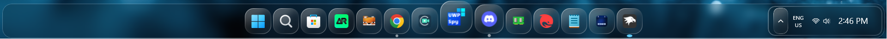
<details>
<summary>Content to import (click to expand)</summary>

```yaml
theme: ''
styleConstants:
  - IconBackground= <ImageBrush ImageSource="https://raw.githubusercontent.com/ramensoftware/windows-11-taskbar-styling-guide/refs/heads/main/Themes/OS26 Liquid Glass/Assets/tahoeappbg.png" Stretch="UniformtoFill"/>
  - IconBorder= <LinearGradientBrush EndPoint="1,1" StartPoint="0,0"><GradientStop Color="#F5ffffff" Offset="0.0"/><GradientStop Color="#40ffffff" Offset="0.4"/><GradientStop Color="#20ffffff" Offset="0.6"/><GradientStop Color="#90ffffff" Offset="1.0"/></LinearGradientBrush>
controlStyles:
  - target: Taskbar.TaskbarFrame
    styles:
      - Height=80
      - MaxHeight=80
      - HorizontalAlignment=Center
  - target: Taskbar.TaskListLabeledButtonPanel#IconPanel > Image#Icon
    styles:
      - Height=24
      - Width=24
      - Margin=10,0,0,0
  - target: Taskbar.TaskListButtonPanel
    styles:
      - Width=55
      - Height=70
  - target: Taskbar.TaskListLabeledButtonPanel
    styles:
      - Width=55
      - Height=70
  - target: SearchUx.SearchUI.SearchButtonControl > Grid > SearchUx.SearchUI.SearchIconButton#SearchIcon > SearchUx.SearchUI.SearchButtonRootGrid#SearchBoxButtonRootPanel
    styles:
      - Width=55
      - Height=70  
  - target: Grid#RootGrid > Taskbar.TaskbarBackground > Grid
    styles:
      - CornerRadius=20
      - Background:=<WindhawkBlur BlurAmount="8" TintColor="#2D101010"/>
      - BorderThickness=1
      - Margin=-15,0,-15,0
      - BorderBrush=#40FFFFFF
      - Padding=-1
  - target: Rectangle#BackgroundStroke
    styles:
      - Fill=Transparent
  - target: Taskbar.TaskbarFrame > Grid#RootGrid
    styles:
      - Visibility=Visible
      - Margin=0,8,0,2
      - Padding=20,0,20,0
  - target: Taskbar.TaskbarFrame > Grid#RootGrid > Taskbar.TaskbarBackground > Grid >
    styles:
      - ''
  - target: Windows.UI.Xaml.Controls.FlyoutPresenter
    styles:
      - RequestedTheme=Dark
      - Background:=<WindhawkBlur BlurAmount="8" TintColor="#2D101010"/>
      - BorderThickness=2
      - BorderBrush:=<WindhawkBlur BlurAmount="8" TintColor="#30ffffff"/>
      - CornerRadius=33
      - Padding=2,3,2,3
  - target: Windows.UI.Xaml.Controls.Border#SnapPickerBorder
    styles:
      - RequestedTheme=Dark
      - Background:=Transparent
      - BorderBrush:=Transparent
      - BorderThickness=2
      - Margin=0
  - target: WindowsInternal.ComposableShell.Experiences.Switcher.AltTab > Grid#ModalRootGrid > Border#BackgroundElement
    styles:
      - Background:=<WindhawkBlur BlurAmount="8" TintColor="#2D101010"/>
      - BorderThickness=2
      - BorderBrush:=<WindhawkBlur BlurAmount="8" TintColor="#30ffffff"/>
      - CornerRadius=50
  - target: MenuFlyoutPresenter
    styles:
      - CornerRadius=20
  - target: MenuFlyoutPresenter > Border
    styles:
      - Background:=<WindhawkBlur BlurAmount="8" TintColor="#2D101010"/>
      - BorderThickness=2
      - CornerRadius=25
      - BorderBrush:=<WindhawkBlur BlurAmount="8" TintColor="#30ffffff"/>
  - target: ScrollViewer > ScrollContentPresenter > Border > Grid > SystemTray.SystemTrayFrame > Grid#SystemTrayFrameGrid > SystemTray.Stack#NotifyIconStack > Grid#Content > SystemTray.StackListView#IconStack > ItemsPresenter > StackPanel > ContentPresenter > SystemTray.ChevronIconView > Grid#ContainerGrid > ContentPresenter#ContentPresenter > Grid#ContentGrid
    styles:
      - Height=35
      - CornerRadius=12
      - Background:=$IconBackground
      - BorderBrush:=$IconBorder
      - BorderThickness=1.2
  - target: Grid#SystemTrayFrameGrid
    styles:
      - Width=Auto
      - Background:=<WindhawkBlur BlurAmount="8" TintColor="#2D101010"/>
      - CornerRadius=15
      - Margin=200,5,-420,-5
      - RenderTransform:=<TranslateTransform X="-435" Y="-2"/>
      - Padding=10,2
      - BorderBrush:=<LinearGradientBrush EndPoint="1,1" StartPoint="0,0"><GradientStop Color="#50ffffff" Offset="0.0"/><GradientStop Color="#10ffffff" Offset="0.5"/><GradientStop Color="#30ffffff" Offset="1.0"/></LinearGradientBrush>
      - BorderThickness=2
      - Visibility=Visible
  - target: Taskbar.TaskListButtonPanel@CommonStates > Border#BackgroundElement
    styles:
      - CornerRadius=15
      - Margin=0,5.5,0,5.5
      - Background:=$IconBackground
      - BorderBrush:=$IconBorder
      - BorderThickness=1.2
  - target: Taskbar.TaskbarBackground#HoverFlyoutBackgroundControl > Grid > Rectangle#BackgroundStroke
    styles:
      - Fill:=<WindhawkBlur BlurAmount="3.5" TintColor="#2D101010"/>
      - Stroke:=<WindhawkBlur BlurAmount="8" TintColor="#30ffffff"/>
      - StrokeThickness=5
      - RadiusX=14
      - RadiusY=14
      - Fill:=<<WindhawkBlur BlurAmount="8" TintColor="#30ffffff"/>
  - target: Taskbar.TaskbarBackground#HoverFlyoutBackgroundControl > Grid > Rectangle#BackgroundFill
    styles:
      - Canvas.ZIndex=0
      - Fill:=
      - Stroke:=<WindhawkBlur BlurAmount="8" TintColor="#30ffffff"/>
      - StrokeThickness=5
      - RadiusX=14
      - RadiusY=14
  - target: Taskbar.FlyoutFrame > Windows.UI.Xaml.Controls.Canvas#HoverFlyoutCanvas > Windows.UI.Xaml.Controls.Grid#HoverFlyoutGrid > Windows.UI.Xaml.Controls.ContentPresenter#HoverFlyoutContent > Taskbar.TaskItemThumbnailList > Microsoft.UI.Xaml.Controls.ItemsRepeater#TaskItemThumbnailListRepeater > Taskbar.TaskItemThumbnailView > Windows.UI.Xaml.Controls.Grid > Windows.UI.Xaml.Controls.Border#BackgroundBorder
    styles:
      - VerticalAlignment=Bottom
      - Canvas.ZIndex=1
      - Background:=<WindhawkBlur BlurAmount="5" TintColor="#761E1E1E"/>
      - Height=25
      - CornerRadius=0,0,15,15
      - Margin=5,0,5,0
  - target: Border#HoverFlyoutBackground
    styles:
      - Margin=4,36,4,0
      - Canvas.ZIndex=1
      - Width=Auto
      - Background:=Transparent
      - BorderThickness=0
      - CornerRadius=15
  - target: Microsoft.UI.Xaml.Controls.ItemsRepeater#IconsRepeater > Windows.UI.Xaml.Controls.Image
    styles:
      - Visibility=Collapsed
  - target: Microsoft.UI.Xaml.Controls.ItemsRepeater#ThumbBarRepeater > Taskbar.ThumbBarButton#ThumbBarButton > Windows.UI.Xaml.Controls.ContentPresenter#BorderElement      
    styles:
      - Background:=<WindhawkBlur BlurAmount="8" TintColor="#761E1E1E"/>
      - Margin=0,-20,0,20
  - target: Windows.UI.Xaml.Controls.Button#CloseButton
    styles:
      - HorizontalAlignment=left
      - Grid.ColumnSpan=1
      - Grid.RowSpan=1
      - Canvas.ZIndex=1
      - CornerRadius=20
      - Width=28
      - Height=28
      - Margin=-18,40,15,-40
      - Background:=<WindhawkBlur BlurAmount="8" TintColor="#80ffffff"/>
      - Foreground=black
      - BorderBrush:=<WindhawkBlur BlurAmount="8" TintColor="#761E1E1E"/>
  - target: Taskbar.FlyoutFrame > Windows.UI.Xaml.Controls.Canvas#HoverFlyoutCanvas > Windows.UI.Xaml.Controls.Grid#HoverFlyoutGrid > Windows.UI.Xaml.Controls.ContentPresenter#HoverFlyoutContent > Taskbar.TaskItemThumbnailList > Microsoft.UI.Xaml.Controls.ItemsRepeater#TaskItemThumbnailListRepeater > Taskbar.TaskItemThumbnailView > Windows.UI.Xaml.Controls.Grid > Windows.UI.Xaml.Controls.TextBlock#DisplayNameTextBlock
    styles:
      - Grid.ColumnSpan=2
      - Grid.RowSpan=2
      - VerticalAlignment=bottom
      - HorizontalAlignment=Center
      - Margin=0,-5,0,5
      - Canvas.ZIndex=1

  - target: SystemTray.NotifyIconView@CommonStates > Grid#ContainerGrid > Border#BackgroundBorder
    styles:
      - CornerRadius=12
      - Background:=$IconBackground
      - BorderBrush:=$IconBorder
      - Margin=2
      - BorderThickness=1.2
  - target: SystemTray.NotifyIconView@CommonStates > Grid#ContainerGrid > Border#BackgroundBorder
    styles:
      - CornerRadius=12
      - Background:=$IconBackground
      - BorderBrush:=$IconBorder
      - Margin=2
      - BorderThickness=1.2
  - target: Border#OverflowFlyoutBackgroundBorder
    styles:
      - Background:=<WindhawkBlur BlurAmount="8" TintColor="#2D101010"/>
      - BorderBrush:=<WindhawkBlur BlurAmount="8" TintColor="#60ffffff"/>
      - BorderThickness=2
      - CornerRadius=32,32,30,30
      - Margin=-10
  - target: SystemTray.OmniButton#ControlCenterButton > Grid > ContentPresenter > ItemsPresenter > StackPanel > ContentPresenter > SystemTray.IconView#SystemTrayIcon > Grid > Grid > SystemTray.TextIconContent
    styles:
      - CornerRadius=15
  - target: Taskbar.TaskListLabeledButtonPanel@RunningIndicatorStates > Rectangle#RunningIndicator
    styles:
      - Fill:=#90ffffff
      - RadiusX=3 
      - RadiusY=3 
      - Margin=-2
      - Height=6
      - Width=6
      - Margin=10,0,0,-2 
      - Width@ActiveRunningIndicator=12
      - Fill@ActiveRunningIndicator=#60CDFF
  - target: Taskbar.TaskListLabeledButtonPanel > TextBlock#LabelControl
    styles:
      - Margin=4,0,0,0
      - Foreground=White
  - target: Taskbar.SearchBoxButton
    styles:
      - Background:=<WindhawkBlur BlurAmount="60" TintColor="#35ffffff"/>
      - CornerRadius=20
      - Margin=2,6,2,6
      - BorderBrush:=<LinearGradientBrush EndPoint="1,1" StartPoint="0,0"><GradientStop Color="#E0ffffff" Offset="0.0"/><GradientStop Color="#20ffffff" Offset="0.5"/><GradientStop Color="#A0ffffff" Offset="1.0"/></LinearGradientBrush>
      - BorderThickness=1.2
  - target: TextBlock#SearchBoxTextBlock
    styles:
      - FontSize=12
      - Foreground=White
  - target: Grid
    styles:
      - RequestedTheme=2
  - target: Taskbar.TaskListButton#TaskListButton[AutomationProperties.Name=Copilot] > Taskbar.TaskListLabeledButtonPanel#IconPanel > Border#BackgroundElement
    styles:
      - Background:=$IconBackground
  - target: Taskbar.StartButton#StartButton
    styles:
      - Background:=<WindhawkBlur BlurAmount="60" TintColor="#35ffffff"/>
      - CornerRadius=20
      - Margin=2,6,2,6
      - BorderBrush:=<LinearGradientBrush EndPoint="1,1" StartPoint="0,0"><GradientStop Color="#E0ffffff" Offset="0.0"/><GradientStop Color="#20ffffff" Offset="0.5"/><GradientStop Color="#A0ffffff" Offset="1.0"/></LinearGradientBrush>
      - BorderThickness=1.2
  - target: Border#MultiWindowElement
    styles:
      - Visibility=Collapsed
  - target: TextBlock#TimeInnerTextBlock
    styles:
      - Foreground=White
      - FontSize=18
      - FontFamily=Quantico
      - Margin=0
      - Padding=0
      - RenderTransform:=<TranslateTransform X="0" Y="1"/>
  - target: TextBlock#DateInnerTextBlock
    styles:
      - Foreground=White
      - Visibility=Collapsed
      - RenderTransform:=<TranslateTransform X="0" Y="-9"/>
      - FontSize=11
      - FontFamily=vivo Sans EN VF
  - target: SystemTray.TextIconContent > Grid > SystemTray.AdaptiveTextBlock#Base > TextBlock
    styles:
      - Foreground=White
  - target: Taskbar.AugmentedEntryPointButton#AugmentedEntryPointButton
    styles:
      - Margin=-12,0,0,0
  - target: SearchUx.SearchUI.SearchButtonControl > Grid > SearchUx.SearchUI.SearchIconButton#SearchIcon > SearchUx.SearchUI.SearchButtonRootGrid#SearchBoxButtonRootPanel > Border#BackgroundElement
    styles:
      - Margin=0,5.5,0,5.5
      - CornerRadius=15
      - Background:=$IconBackground
      - BorderBrush:=$IconBorder
  - target: Taskbar.ExperienceToggleButton#LaunchListButton[AutomationProperties.Name=Task View]
    styles:
      - Background:=<WindhawkBlur BlurAmount="60" TintColor="#35ffffff"/>
      - CornerRadius=20
      - BorderBrush:=<LinearGradientBrush EndPoint="1,1" StartPoint="0,0"><GradientStop Color="#E0ffffff" Offset="0.0"/><GradientStop Color="#20ffffff" Offset="0.5"/><GradientStop Color="#A0ffffff" Offset="1.0"/></LinearGradientBrush>
      - BorderThickness=1.2
  - target: taskbar:TaskListLabeledButtonPanel@RunningIndicatorStates > Border
    styles:
      - Background@InactiveRunningIndicatorPointerOver:=<WindhawkBlur BlurAmount="40" TintColor="#10ffffff"/>
      - CornerRadius=12
      - BorderBrush@InactiveRunningIndicatorPointerOver:=<LinearGradientBrush EndPoint="1,0" StartPoint="0,0"><GradientStop Color="#80ffffff" Offset="0.0"/><GradientStop Color="{ThemeResource SurfaceStrokeColorDefault}" Offset="0.55"/><GradientStop Color="#80ffffff" Offset="1"/></LinearGradientBrush>
      - BorderThickness@InactiveRunningIndicatorPointerOver=1
  - target: Taskbar.TaskListLabeledButtonPanel@CommonStates > Border#BackgroundElement
    styles:
      - CornerRadius=15
      - Margin=0,5.5,0,5.5
      - Background:=$IconBackground
      - BorderBrush:=$IconBorder
      - BorderThickness=1.2
  - target: Taskbar.TaskbarFrame > Grid#RootGrid > Taskbar.TaskbarBackground > Grid > Rectangle#BackgroundStroke
    styles:
      - Visibility=Collapsed
  - target: Taskbar.TaskbarFrame > Grid#RootGrid > Taskbar.TaskbarBackground > Grid > Rectangle#BackgroundFill
    styles:
      - Fill=Transparent
  - target: SystemTray.NotifyIconView#NotifyItemIcon
    styles:
      - Background:=<WindhawkBlur BlurAmount="10" TintColor="#40ffffff"/>
      - CornerRadius=12
      - Margin=2
      - Padding=2
      - BorderBrush:=<LinearGradientBrush EndPoint="1,0" StartPoint="0,0"><GradientStop Color="#80ffffff" Offset="0.0"/><GradientStop Color="{ThemeResource SurfaceStrokeColorDefault}" Offset="0.55"/><GradientStop Color="#80ffffff" Offset="1"/></LinearGradientBrush>
      - BorderThickness=2
  - target: Windows.UI.Xaml.Controls.Grid#ConfirmatorMainGrid
    styles:
      - Background:=<WindhawkBlur BlurAmount="8" TintColor="#2D101010"/>
      - CornerRadius=24
      - BorderBrush:=<WindhawkBlur BlurAmount="8" TintColor="#30ffffff"/>
      - BorderThickness=2
      - Margin=0,0,0,10
  - target: Windows.UI.Xaml.Controls.Grid.Border#ConfirmatorMainGrid
    styles:
      - Background:=<WindhawkBlur BlurAmount="8" TintColor="#2D101010"/>
  - target: Windows.UI.Xaml.Shapes.Rectangle#HorizontalTrackRect
    styles:
      - Fill=#20ffffff
      - RadiusX=12
      - RadiusY=12
      - Height=18
      - Margin=0
  - target: Windows.UI.Xaml.Shapes.Rectangle#HorizontalDecreaseRect
    styles:
      - Fill=#ff7060
      - RadiusX=12
      - RadiusY=12
      - Height=18
  - target: Windows.UI.Xaml.Controls.Grid#VolumeConfirmator
    styles:
      - Padding=8,0,8,0
  - target: Windows.UI.Xaml.Controls.Grid#BrightnessConfirmator
    styles:
      - Padding=8,0,8,0
  - target: Windows.UI.Xaml.Controls.TextBlock#volumeLevelText
    styles:
      - Foreground=White
themeResourceVariables:
  - ''
xamlDiagnosticsHandling: ''

```
</details>

# Dark Variants:

## OS26 Liquid Glass (Dark MacDock) Configuration

<details>
<summary>Content to import (click to expand)</summary>

```yaml

styleConstants:
  - IconBackground=<LinearGradientBrush StartPoint="0.47,-0.29" EndPoint="0.50,1.29"><GradientStop Offset="0.18" Color="#2F2F2F"/><GradientStop Offset="0.3" Color="#292929"/><GradientStop Offset="0.5" Color="#141414"/><GradientStop Offset="0.68" Color="#080808"/><GradientStop Offset="0.81" Color="#000000"/></LinearGradientBrush>
  - IconBorder=<LinearGradientBrush StartPoint="0.04,-0.14" EndPoint="1.22,1.10"><GradientStop Offset="0.18" Color="#4FFFFFFF"/><GradientStop Offset="0.34" Color="#661D1D1D"/><GradientStop Offset="0.63" Color="#00000000"/><GradientStop Offset="0.72" Color="#662D2D2D"/><GradientStop Offset="0.84" Color="#4FFFFFFF"/></LinearGradientBrush>
controlStyles:
  - target: Taskbar.TaskbarFrame
    styles:
      - Width=auto
      - MinWidth:=100
      - Grid.Column=1
      - Transitions:=<TransitionCollection><RepositionThemeTransition IsStaggeringEnabled="False"/></TransitionCollection>
      - Height=80
      - MaxHeight=80
      - HorizontalAlignment=Center
  - target: Taskbar.TaskListLabeledButtonPanel#IconPanel > Image#Icon
    styles:
      - Height=24
      - Width=24
      - Margin=10,0,0,0
  - target: Taskbar.TaskListButtonPanel
    styles:
      - Width=55
      - Height=70
  - target: Taskbar.TaskListLabeledButtonPanel
    styles:
      - Width=55
      - Height=70
  - target: SearchUx.SearchUI.SearchButtonControl > Grid > SearchUx.SearchUI.SearchIconButton#SearchIcon > SearchUx.SearchUI.SearchButtonRootGrid#SearchBoxButtonRootPanel
    styles:
      - Width=55
      - Height=70
  - target: Taskbar.TaskbarFrame > Grid#RootGrid
    styles:
      - Margin=0,8,0,2
      - Padding=20,0,20,0
      - BorderBrush=#40FFFFFF
  - target: Grid#RootGrid > Taskbar.TaskbarBackground > Grid
    styles:
      - Background:=<WindhawkBlur BlurAmount="8" TintColor="#2D101010"/>
      - CornerRadius=20,0,0,20
      - BorderThickness=1,1,0,1
      - Width=Auto
      - Margin=-20,0,-20,0
      - BorderBrush=#40FFFFFF
      - Padding=-1
  - target: Rectangle#BackgroundStroke
    styles:
      - Fill=Transparent
  - target: Windows.UI.Xaml.Controls.FlyoutPresenter
    styles:
      - RequestedTheme=Dark
      - Background:=<WindhawkBlur BlurAmount="8" TintColor="#2D101010"/>
      - BorderThickness=2
      - BorderBrush:=<WindhawkBlur BlurAmount="8" TintColor="#30ffffff"/>
      - CornerRadius=33
      - Padding=2,3,2,3
  - target: Windows.UI.Xaml.Controls.Border#SnapPickerBorder
    styles:
      - RequestedTheme=Dark
      - Background:=Transparent
      - BorderBrush:=Transparent
      - BorderThickness=2
      - Margin=0
  - target: WindowsInternal.ComposableShell.Experiences.Switcher.AltTab > Grid#ModalRootGrid > Border#BackgroundElement
    styles:
      - Background:=<WindhawkBlur BlurAmount="8" TintColor="#2D101010"/>
      - BorderThickness=2
      - BorderBrush:=<WindhawkBlur BlurAmount="8" TintColor="#30ffffff"/>
      - CornerRadius=50
  - target: MenuFlyoutPresenter
    styles:
      - CornerRadius=20
  - target: MenuFlyoutPresenter > Border
    styles:
      - Background:=<WindhawkBlur BlurAmount="8" TintColor="#2D101010"/>
      - BorderThickness=2
      - CornerRadius=25
      - BorderBrush:=<WindhawkBlur BlurAmount="8" TintColor="#30ffffff"/>
  - target: SystemTray.SystemTrayFrame > Grid#SystemTrayFrameGrid > SystemTray.Stack#NotifyIconStack > Grid#Content > SystemTray.StackListView#IconStack > ItemsPresenter > StackPanel > ContentPresenter > SystemTray.ChevronIconView > Grid#ContainerGrid > ContentPresenter#ContentPresenter > Grid#ContentGrid
    styles:
      - Height=48
      - Width=48
      - Margin=25,2,8,0
      - CornerRadius=15
      - Background=transparent
      - BorderBrush:=lightgray
      - BorderThickness=3
  - target: SystemTray.SystemTrayFrame > Grid#SystemTrayFrameGrid > SystemTray.Stack#NonActivatableStack > Grid#Content > SystemTray.StackListView#IconStack > ItemsPresenter > StackPanel > ContentPresenter > SystemTray.IconView#SystemTrayIcon > Grid#ContainerGrid > ContentPresenter#ContentPresenter > Grid#ContentGrid > SystemTray.TextIconContent > Grid#ContainerGrid
    styles:
      - Width=48
      - Height=48
      - Margin=0,4,2,0
      - Background:=$IconBackground
      - BorderBrush:=$IconBorder
      - BorderThickness=1.2
      - CornerRadius=15
  - target: SystemTray.ChevronIconView > Grid#ContainerGrid > ContentPresenter#ContentPresenter > Grid#ContentGrid > SystemTray.TextIconContent
    styles:
      - FontWeight=bold
      - FontSize=32
  - target: Grid#SystemTrayFrameGrid
    styles:
      - Margin=0,0,0.5,0
      - Height=70
      - VerticalAlignment=Bottom
      - Padding=0
      - Background:=<WindhawkBlur BlurAmount="8" TintColor="#2D101010"/>
      - BorderBrush=#40FFFFFF
      - BorderThickness=0,1,1,1
      - CornerRadius=0,20,20,0
      - Visibility=Visible
  - target: SystemTray.Stack#NotifyIconStack > Grid#Content > SystemTray.StackListView#IconStack > ItemsPresenter > StackPanel > ContentPresenter > SystemTray.ChevronIconView > Grid#ContainerGrid > Border#BackgroundBorder
    styles:
      - Background=transparent
      - BorderBrush=#40FFFFFF
      - BorderThickness=2,0,0,0
      - Padding=0
      - CornerRadius=0
      - Height=40
  - target: TextBlock#DateInnerTextBlock
    styles:
      - FontWeight=Bold
      - Margin=-2,9,2,-9
      - Foreground=White
      - Visibility=visible
      - RenderTransform:=<TranslateTransform X="0" Y="-9"/>
      - FontSize=13
      - FontFamily=vivo Sans EN VF
  - target: TextBlock#TimeInnerTextBlock
    styles:
      - Foreground=white
      - Width=Auto
      - FontWeight=Bold
      - FontSize=15
      - Margin=0,-4,5,4
  - target: SystemTray.DateTimeIconContent > Grid#ContainerGrid
    styles:
      - CornerRadius=12
      - BorderThickness=1.2
      - Background:=<LinearGradientBrush StartPoint="0.50,-1.50" EndPoint="0.50,2.50"><GradientStop Offset="0.48" Color="#FF3A40"/><GradientStop Offset="0.49" Color="#141414"/></LinearGradientBrush>
      - BorderBrush:=$IconBorder
      - Height=45
      - Margin=0,5,0,-1
      - Width=Auto
  - target: SystemTray.AdaptiveTextBlock > TextBlock
    styles:
      - FontSize=30
  - target: SystemTray.SystemTrayFrame
    styles:
      - Height=75
      - Grid.Column=2
      - Width=Auto
      - HorizontalAlignment=Left
      - Margin=0,1,0,-0.5
  - target: :root > ScrollViewer > ScrollContentPresenter > Border > Grid
    styles:
      - ColumnDefinitions:=<ColumnDefinitionCollection><ColumnDefinition Width="*"/><ColumnDefinition Width="Auto"/><ColumnDefinition Width="Auto"/><ColumnDefinition Width="*"/></ColumnDefinitionCollection>
      - ActualWidth=>containerGridWidth
  - target: SystemTray.SystemTrayFrame > Grid#SystemTrayFrameGrid > SystemTray.Stack#NonActivatableStack > Grid#Content > SystemTray.StackListView#IconStack > ItemsPresenter > StackPanel > ContentPresenter > SystemTray.IconView#SystemTrayIcon > Grid#ContainerGrid > Border#BackgroundBorder
    styles:
      - Background:=Transparent
      - BorderThickness=0
  - target: SystemTray.OmniButton#ControlCenterButton > Grid > Border#BackgroundBorder
    styles:
      - Background:=Transparent
      - BorderThickness=0
  - target: SystemTray.SystemTrayFrame > Grid#SystemTrayFrameGrid > SystemTray.OmniButton#NotificationCenterButton > Grid > ContentPresenter#ContentPresenter > ItemsPresenter > StackPanel > ContentPresenter > SystemTray.IconView#SystemTrayIcon > Grid#ContainerGrid > ContentPresenter#ContentPresenter
    styles:
      - Background:=transparent
      - BorderThickness=0
  - target: SystemTray.Stack#MainStack
    styles:
      - Visibility=1
      - // System tray > Microphone and Location Icons Grid
  - target: SystemTray.Stack#ShowDesktopStack
    styles:
      - Visibility=1
      - Width=48
      - Height=48
      - Margin=0,4,2,0
      - Background:=$IconBackground
      - BorderBrush:=$IconBorder
      - BorderThickness=1.2
      - CornerRadius=15
      - // System Tray > Show Desktop Button
  - target: SystemTray.OmniButton#ControlCenterButton > Grid > ContentPresenter > ItemsPresenter > StackPanel > ContentPresenter[1] > SystemTray.IconView > Grid > Grid
    styles:
      - Visibility=Visible
      - Width=48
      - Height=48
      - Margin=0,4,2,0
      - Background:=$IconBackground
      - BorderBrush:=$IconBorder
      - BorderThickness=1.2
      - CornerRadius=15
      - // [Tray Wifi Icon. Set Visibility=Collapsed to Remove it, and Visibility=Visible to bring it back]
  - target: SystemTray.OmniButton#ControlCenterButton > Grid > ContentPresenter > ItemsPresenter > StackPanel > ContentPresenter[2] > SystemTray.IconView > Grid > Grid
    styles:
      - Visibility=Collapsed
      - Width=48
      - Height=48
      - Margin=0,4,2,0
      - Background:=$IconBackground
      - BorderBrush:=$IconBorder
      - BorderThickness=1.2
      - CornerRadius=15
      - // [Tray Audio Icon. Set Visibility=Collapsed to Remove it, and Visibility=Visible to bring it back]
  - target: SystemTray.OmniButton#ControlCenterButton > Grid > ContentPresenter > ItemsPresenter > StackPanel > ContentPresenter[3] > SystemTray.IconView > Grid > Grid
    styles:
      - Visibility=Visible
      - Width=48
      - Height=48
      - Margin=0,4,2,0
      - Background:=$IconBackground
      - BorderBrush:=$IconBorder
      - BorderThickness=1.2
      - CornerRadius=15
      - // [Tray Battery Icon. Set Visibility=Collapsed to Remove it, and Visibility=Visible to bring it back]
  - target: SystemTray.SystemTrayFrame > Grid#SystemTrayFrameGrid > SystemTray.OmniButton#NotificationCenterButton > Grid > ContentPresenter#ContentPresenter > ItemsPresenter > StackPanel > ContentPresenter > SystemTray.IconView#SystemTrayIcon > Grid#ContainerGrid > ContentPresenter#ContentPresenter > Grid#ContentGrid > SystemTray.TextIconContent > Grid#ContainerGrid
    styles:
      - Visibility=Visible
      - Width=48
      - Height=48
      - Margin=0,4,2,0
      - Background:=$IconBackground
      - BorderBrush:=$IconBorder
      - BorderThickness=1.2
      - CornerRadius=15
      - // [Notify Icon. Set Visibility=Collapsed to Remove it, and Visibility=Visible to bring it back]
  - target: SystemTray.SystemTrayFrame > Grid#SystemTrayFrameGrid > SystemTray.OmniButton#ControlCenterButton > Grid > ContentPresenter#ContentPresenter > ItemsPresenter > StackPanel > ContentPresenter > SystemTray.IconView#SystemTrayIcon > Grid#ContainerGrid > Grid#ContentGrid > SystemTray.TextIconContent > Grid#ContainerGrid > SystemTray.AdaptiveTextBlock#Underlay > TextBlock#InnerTextBlock
    styles:
      - Foreground=white
  - target: Taskbar.TaskListButtonPanel@CommonStates > Border#BackgroundElement
    styles:
      - CornerRadius=15
      - Margin=0,5.5,0,5.5
      - Background:=$IconBackground
      - BorderBrush:=$IconBorder
      - BorderThickness=1.2
  - target: Taskbar.TaskbarBackground#HoverFlyoutBackgroundControl > Grid > Rectangle#BackgroundStroke
    styles:
      - Fill:=<WindhawkBlur BlurAmount="3.5" TintColor="#2D101010"/>
      - Stroke:=<WindhawkBlur BlurAmount="8" TintColor="#30ffffff"/>
      - StrokeThickness=5
      - RadiusX=14
      - RadiusY=14
      - Fill:=<<WindhawkBlur BlurAmount="8" TintColor="#30ffffff"/>
  - target: Taskbar.TaskbarBackground#HoverFlyoutBackgroundControl > Grid > Rectangle#BackgroundFill
    styles:
      - Canvas.ZIndex=0
      - Fill:=
      - Stroke:=<WindhawkBlur BlurAmount="8" TintColor="#30ffffff"/>
      - StrokeThickness=5
      - RadiusX=14
      - RadiusY=14
  - target: Taskbar.FlyoutFrame > Windows.UI.Xaml.Controls.Canvas#HoverFlyoutCanvas > Windows.UI.Xaml.Controls.Grid#HoverFlyoutGrid > Windows.UI.Xaml.Controls.ContentPresenter#HoverFlyoutContent > Taskbar.TaskItemThumbnailList > Microsoft.UI.Xaml.Controls.ItemsRepeater#TaskItemThumbnailListRepeater > Taskbar.TaskItemThumbnailView > Windows.UI.Xaml.Controls.Grid > Windows.UI.Xaml.Controls.Border#BackgroundBorder
    styles:
      - VerticalAlignment=Bottom
      - Canvas.ZIndex=1
      - Background:=<WindhawkBlur BlurAmount="5" TintColor="#761E1E1E"/>
      - Height=25
      - CornerRadius=0,0,15,15
      - Margin=5,0,5,0
  - target: Border#HoverFlyoutBackground
    styles:
      - Margin=4,36,4,0
      - Canvas.ZIndex=1
      - Width=Auto
      - Background:=Transparent
      - BorderThickness=0
      - CornerRadius=15
  - target: Microsoft.UI.Xaml.Controls.ItemsRepeater#ThumbBarRepeater > Taskbar.ThumbBarButton#ThumbBarButton > Windows.UI.Xaml.Controls.ContentPresenter#BorderElement
    styles:
      - Background:=<WindhawkBlur BlurAmount="8" TintColor="#761E1E1E"/>
      - Margin=0,-20,0,20
  - target: Microsoft.UI.Xaml.Controls.ItemsRepeater#IconsRepeater > Windows.UI.Xaml.Controls.Image
    styles:
      - Visibility=Collapsed
  - target: Windows.UI.Xaml.Controls.Button#CloseButton
    styles:
      - HorizontalAlignment=left
      - Grid.ColumnSpan=1
      - Grid.RowSpan=1
      - Canvas.ZIndex=1
      - CornerRadius=20
      - Width=28
      - Height=28
      - Margin=-18,40,15,-40
      - Background:=<WindhawkBlur BlurAmount="8" TintColor="#80ffffff"/>
      - Foreground=black
      - BorderBrush:=<WindhawkBlur BlurAmount="8" TintColor="#761E1E1E"/>
  - target: Taskbar.FlyoutFrame > Windows.UI.Xaml.Controls.Canvas#HoverFlyoutCanvas > Windows.UI.Xaml.Controls.Grid#HoverFlyoutGrid > Windows.UI.Xaml.Controls.ContentPresenter#HoverFlyoutContent > Taskbar.TaskItemThumbnailList > Microsoft.UI.Xaml.Controls.ItemsRepeater#TaskItemThumbnailListRepeater > Taskbar.TaskItemThumbnailView > Windows.UI.Xaml.Controls.Grid > Windows.UI.Xaml.Controls.TextBlock#DisplayNameTextBlock
    styles:
      - Grid.ColumnSpan=2
      - Grid.RowSpan=2
      - VerticalAlignment=bottom
      - HorizontalAlignment=Center
      - Margin=0,-5,0,5
      - Canvas.ZIndex=1
  - target: SystemTray.NotifyIconView@CommonStates > Grid#ContainerGrid > Border#BackgroundBorder
    styles:
      - CornerRadius=12
      - Background:=$IconBackground
      - BorderBrush:=$IconBorder
      - Margin=2
      - BorderThickness=1.2
  - target: Border#OverflowFlyoutBackgroundBorder
    styles:
      - Background:=<WindhawkBlur BlurAmount="8" TintColor="#2D101010"/>
      - BorderBrush:=<WindhawkBlur BlurAmount="8" TintColor="#60ffffff"/>
      - BorderThickness=2
      - CornerRadius=32,32,30,30
      - Margin=-10
  - target: Taskbar.TaskListLabeledButtonPanel@RunningIndicatorStates > Rectangle#RunningIndicator
    styles:
      - Fill:=#90ffffff
      - RadiusX=3
      - RadiusY=3
      - Margin=-2
      - Height=6
      - Width=6
      - Margin=10,0,0,-2
      - Width@ActiveRunningIndicator=12
      - Fill@ActiveRunningIndicator=#60CDFF
  - target: Taskbar.TaskListLabeledButtonPanel > TextBlock#LabelControl
    styles:
      - Margin=4,0,0,0
      - Foreground=White
  - target: Taskbar.SearchBoxButton
    styles:
      - Background:=<WindhawkBlur BlurAmount="60" TintColor="#35ffffff"/>
      - CornerRadius=20
      - Margin=2,6,2,6
      - BorderBrush:=<LinearGradientBrush EndPoint="1,1" StartPoint="0,0"><GradientStop Color="#E0ffffff" Offset="0.0"/><GradientStop Color="#20ffffff" Offset="0.5"/><GradientStop Color="#A0ffffff" Offset="1.0"/></LinearGradientBrush>
      - BorderThickness=1.2
  - target: TextBlock#SearchBoxTextBlock
    styles:
      - FontSize=12
      - Foreground=White
  - target: Grid
    styles:
      - RequestedTheme=2
  - target: Taskbar.StartButton#StartButton
    styles:
      - Background:=<WindhawkBlur BlurAmount="60" TintColor="#35ffffff"/>
      - CornerRadius=20
      - Margin=2,6,2,6
      - BorderBrush:=<LinearGradientBrush EndPoint="1,1" StartPoint="0,0"><GradientStop Color="#E0ffffff" Offset="0.0"/><GradientStop Color="#20ffffff" Offset="0.5"/><GradientStop Color="#A0ffffff" Offset="1.0"/></LinearGradientBrush>
      - BorderThickness=1.2
  - target: Border#MultiWindowElement
    styles:
      - Visibility=Collapsed
  - target: SystemTray.TextIconContent > Grid > SystemTray.AdaptiveTextBlock#Base > TextBlock
    styles:
      - Foreground=White
  - target: Taskbar.AugmentedEntryPointButton#AugmentedEntryPointButton
    styles:
      - Margin=-12,0,0,0
  - target: SearchUx.SearchUI.SearchButtonControl > Grid > SearchUx.SearchUI.SearchIconButton#SearchIcon > SearchUx.SearchUI.SearchButtonRootGrid#SearchBoxButtonRootPanel > Border#BackgroundElement
    styles:
      - Margin=0,5.5,0,5.5
      - CornerRadius=15
      - Background:=$IconBackground
      - BorderBrush:=$IconBorder
  - target: Taskbar.ExperienceToggleButton#LaunchListButton[AutomationProperties.Name=Task View]
    styles:
      - Background:=<WindhawkBlur BlurAmount="60" TintColor="#35ffffff"/>
      - CornerRadius=20
      - BorderBrush:=<LinearGradientBrush EndPoint="1,1" StartPoint="0,0"><GradientStop Color="#E0ffffff" Offset="0.0"/><GradientStop Color="#20ffffff" Offset="0.5"/><GradientStop Color="#A0ffffff" Offset="1.0"/></LinearGradientBrush>
      - BorderThickness=1.2
  - target: taskbar:TaskListLabeledButtonPanel@RunningIndicatorStates > Border
    styles:
      - Background@InactiveRunningIndicatorPointerOver:=<WindhawkBlur BlurAmount="40" TintColor="#10ffffff"/>
      - CornerRadius=12
      - BorderBrush@InactiveRunningIndicatorPointerOver:=<LinearGradientBrush EndPoint="1,0" StartPoint="0,0"><GradientStop Color="#80ffffff" Offset="0.0"/><GradientStop Color="{ThemeResource SurfaceStrokeColorDefault}" Offset="0.55"/><GradientStop Color="#80ffffff" Offset="1"/></LinearGradientBrush>
      - BorderThickness@InactiveRunningIndicatorPointerOver=1
  - target: Taskbar.TaskListLabeledButtonPanel@CommonStates > Border#BackgroundElement
    styles:
      - CornerRadius=15
      - Margin=0,5.5,0,5.5
      - Background:=$IconBackground
      - BorderBrush:=$IconBorder
      - BorderThickness=1.2
  - target: Taskbar.TaskbarFrame > Grid#RootGrid > Taskbar.TaskbarBackground > Grid > Rectangle#BackgroundFill
    styles:
      - Fill=Transparent
  - target: SystemTray.NotifyIconView#NotifyItemIcon
    styles:
      - Background:=<WindhawkBlur BlurAmount="10" TintColor="#40ffffff"/>
      - CornerRadius=12
      - Margin=2
      - Padding=2
      - BorderBrush:=<LinearGradientBrush EndPoint="1,0" StartPoint="0,0"><GradientStop Color="#80ffffff" Offset="0.0"/><GradientStop Color="{ThemeResource SurfaceStrokeColorDefault}" Offset="0.55"/><GradientStop Color="#80ffffff" Offset="1"/></LinearGradientBrush>
      - BorderThickness=2
  - target: Windows.UI.Xaml.Controls.Grid#ConfirmatorMainGrid
    styles:
      - Background:=<WindhawkBlur BlurAmount="8" TintColor="#2D101010"/>
      - CornerRadius=24
      - BorderBrush:=<WindhawkBlur BlurAmount="8" TintColor="#30ffffff"/>
      - BorderThickness=2
      - Margin=0,0,0,10
  - target: Windows.UI.Xaml.Controls.Grid.Border#ConfirmatorMainGrid
    styles:
      - Background:=<WindhawkBlur BlurAmount="8" TintColor="#2D101010"/>
  - target: Windows.UI.Xaml.Shapes.Rectangle#HorizontalTrackRect
    styles:
      - Fill=#20ffffff
      - RadiusX=12
      - RadiusY=12
      - Height=18
      - Margin=0
  - target: Windows.UI.Xaml.Shapes.Rectangle#HorizontalDecreaseRect
    styles:
      - Fill:=<SolidColorBrush Color="{ThemeResource SystemAccentColor}" />
      - RadiusX=12
      - RadiusY=12
      - Height=18
  - target: Windows.UI.Xaml.Controls.Grid#VolumeConfirmator
    styles:
      - Padding=8,0,8,0
  - target: Windows.UI.Xaml.Controls.Grid#BrightnessConfirmator
    styles:
      - Padding=8,0,8,0
  - target: Windows.UI.Xaml.Controls.TextBlock#volumeLevelText
    styles:
      - Foreground=White
themeResourceVariables:
  - ''
clickThroughTaskbar: 1
xamlDiagnosticsHandling: ''

```
</details>

## OS26 Liquid Glass (Dark Taskbar, Island) Configuration

<details>
<summary>Content to import (click to expand)</summary>

```yaml

styleConstants:
  - IconBackground=<LinearGradientBrush StartPoint="0.47,-0.29" EndPoint="0.50,1.29"><GradientStop Offset="0.18" Color="#2F2F2F"/><GradientStop Offset="0.3" Color="#292929"/><GradientStop Offset="0.5" Color="#141414"/><GradientStop Offset="0.68" Color="#080808"/><GradientStop Offset="0.81" Color="#000000"/></LinearGradientBrush>
  - IconBorder=<LinearGradientBrush StartPoint="0.25,-0.20" EndPoint="0.99,1.39"><GradientStop Offset="0.11" Color="#50FFFFFF"/><GradientStop Offset="0.3" Color="#631C1C1C"/><GradientStop Offset="0.62" Color="#591C1C1C"/><GradientStop Offset="0.77" Color="#50FFFFFF"/></LinearGradientBrush>
controlStyles:
  - target: Taskbar.TaskbarFrame
    styles:
      - Height=80
      - MaxHeight=80
      - HorizontalAlignment=Center
  - target: Taskbar.TaskListLabeledButtonPanel#IconPanel > Image#Icon
    styles:
      - Height=24
      - Width=24
      - Margin=10,0,0,0
  - target: Taskbar.TaskListButtonPanel
    styles:
      - Width=55
      - Height=70
  - target: Taskbar.TaskListLabeledButtonPanel
    styles:
      - Width=55
      - Height=70
  - target: SearchUx.SearchUI.SearchButtonControl > Grid > SearchUx.SearchUI.SearchIconButton#SearchIcon > SearchUx.SearchUI.SearchButtonRootGrid#SearchBoxButtonRootPanel
    styles:
      - Width=55
      - Height=70  
  - target: Grid#RootGrid > Taskbar.TaskbarBackground > Grid
    styles:
      - CornerRadius=20
      - Background:=<WindhawkBlur BlurAmount="8" TintColor="#2D101010"/>
      - BorderThickness=1
      - Margin=150,0,150,0
      - BorderBrush=#40FFFFFF
      - Padding=-1
  - target: Rectangle#BackgroundStroke
    styles:
      - Fill=Transparent

  - target: Taskbar.TaskbarFrame > Grid#RootGrid
    styles:
      - Visibility=Visible
      - Margin=0,8,0,2
      - Padding=20,0,20,0
  - target: Taskbar.TaskbarFrame > Grid#RootGrid > Taskbar.TaskbarBackground > Grid >
    styles:
      - ''
  - target: Windows.UI.Xaml.Controls.FlyoutPresenter
    styles:
      - RequestedTheme=Dark
      - Background:=<WindhawkBlur BlurAmount="8" TintColor="#2D101010"/>
      - BorderThickness=2
      - BorderBrush:=<WindhawkBlur BlurAmount="8" TintColor="#30ffffff"/>
      - CornerRadius=33
      - Padding=2,3,2,3
  - target: Windows.UI.Xaml.Controls.Border#SnapPickerBorder
    styles:
      - RequestedTheme=Dark
      - Background:=Transparent
      - BorderBrush:=Transparent
      - BorderThickness=2
      - Margin=0
  - target: WindowsInternal.ComposableShell.Experiences.Switcher.AltTab > Grid#ModalRootGrid > Border#BackgroundElement
    styles:
      - Background:=<WindhawkBlur BlurAmount="8" TintColor="#2D101010"/>
      - BorderThickness=2
      - BorderBrush:=<WindhawkBlur BlurAmount="8" TintColor="#30ffffff"/>
      - CornerRadius=50
  - target: MenuFlyoutPresenter
    styles:
      - CornerRadius=20
  - target: MenuFlyoutPresenter > Border
    styles:
      - Background:=<WindhawkBlur BlurAmount="8" TintColor="#2D101010"/>
      - BorderThickness=2
      - CornerRadius=25
      - BorderBrush:=<WindhawkBlur BlurAmount="8" TintColor="#30ffffff"/>
  - target: ScrollViewer > ScrollContentPresenter > Border > Grid > SystemTray.SystemTrayFrame > Grid#SystemTrayFrameGrid > SystemTray.Stack#NotifyIconStack > Grid#Content > SystemTray.StackListView#IconStack > ItemsPresenter > StackPanel > ContentPresenter > SystemTray.ChevronIconView > Grid#ContainerGrid > ContentPresenter#ContentPresenter > Grid#ContentGrid
    styles:
      - Height=35
      - CornerRadius=12
      - Background:=$IconBackground
      - BorderBrush:=$IconBorder
      - BorderThickness=1.2
  - target: Grid#SystemTrayFrameGrid
    styles:
      - Width=Auto
      - Background:=<WindhawkBlur BlurAmount="8" TintColor="#2D101010"/>
      - CornerRadius=15
      - Margin=80,5,-255,-5
      - RenderTransform:=<TranslateTransform X="-435" Y="-2"/>
      - Padding=10,2
      - BorderBrush:=<LinearGradientBrush EndPoint="1,1" StartPoint="0,0"><GradientStop Color="#50ffffff" Offset="0.0"/><GradientStop Color="#10ffffff" Offset="0.5"/><GradientStop Color="#30ffffff" Offset="1.0"/></LinearGradientBrush>
      - BorderThickness=2
      - Visibility=Visible
  - target: Taskbar.TaskListButtonPanel@CommonStates > Border#BackgroundElement
    styles:
      - CornerRadius=15
      - Margin=0,5.5,0,5.5
      - Background:=$IconBackground
      - BorderBrush:=$IconBorder
      - BorderThickness=1.2
  - target: Taskbar.TaskbarBackground#HoverFlyoutBackgroundControl > Grid > Rectangle#BackgroundStroke
    styles:
      - Fill:=<WindhawkBlur BlurAmount="3.5" TintColor="#2D101010"/>
      - Stroke:=<WindhawkBlur BlurAmount="8" TintColor="#30ffffff"/>
      - StrokeThickness=5
      - RadiusX=14
      - RadiusY=14
      - Fill:=<<WindhawkBlur BlurAmount="8" TintColor="#30ffffff"/>
  - target: Taskbar.TaskbarBackground#HoverFlyoutBackgroundControl > Grid > Rectangle#BackgroundFill
    styles:
      - Canvas.ZIndex=0
      - Fill:=
      - Stroke:=<WindhawkBlur BlurAmount="8" TintColor="#30ffffff"/>
      - StrokeThickness=5
      - RadiusX=14
      - RadiusY=14
  - target: Taskbar.FlyoutFrame > Windows.UI.Xaml.Controls.Canvas#HoverFlyoutCanvas > Windows.UI.Xaml.Controls.Grid#HoverFlyoutGrid > Windows.UI.Xaml.Controls.ContentPresenter#HoverFlyoutContent > Taskbar.TaskItemThumbnailList > Microsoft.UI.Xaml.Controls.ItemsRepeater#TaskItemThumbnailListRepeater > Taskbar.TaskItemThumbnailView > Windows.UI.Xaml.Controls.Grid > Windows.UI.Xaml.Controls.Border#BackgroundBorder
    styles:
      - VerticalAlignment=Bottom
      - Canvas.ZIndex=1
      - Background:=<WindhawkBlur BlurAmount="5" TintColor="#761E1E1E"/>
      - Height=25
      - CornerRadius=0,0,15,15
      - Margin=5,0,5,0
  - target: Border#HoverFlyoutBackground
    styles:
      - Margin=4,36,4,0
      - Canvas.ZIndex=1
      - Width=Auto
      - Background:=Transparent
      - BorderThickness=0
      - CornerRadius=15
  - target: Microsoft.UI.Xaml.Controls.ItemsRepeater#IconsRepeater > Windows.UI.Xaml.Controls.Image
    styles:
      - Visibility=Collapsed
  - target: Microsoft.UI.Xaml.Controls.ItemsRepeater#ThumbBarRepeater > Taskbar.ThumbBarButton#ThumbBarButton > Windows.UI.Xaml.Controls.ContentPresenter#BorderElement      
    styles:
      - Background:=<WindhawkBlur BlurAmount="8" TintColor="#761E1E1E"/>
      - Margin=0,-20,0,20
  - target: Windows.UI.Xaml.Controls.Button#CloseButton
    styles:
      - HorizontalAlignment=left
      - Grid.ColumnSpan=1
      - Grid.RowSpan=1
      - Canvas.ZIndex=1
      - CornerRadius=20
      - Width=28
      - Height=28
      - Margin=-18,40,15,-40
      - Background:=<WindhawkBlur BlurAmount="8" TintColor="#80ffffff"/>
      - Foreground=black
      - BorderBrush:=<WindhawkBlur BlurAmount="8" TintColor="#761E1E1E"/>
  - target: Taskbar.FlyoutFrame > Windows.UI.Xaml.Controls.Canvas#HoverFlyoutCanvas > Windows.UI.Xaml.Controls.Grid#HoverFlyoutGrid > Windows.UI.Xaml.Controls.ContentPresenter#HoverFlyoutContent > Taskbar.TaskItemThumbnailList > Microsoft.UI.Xaml.Controls.ItemsRepeater#TaskItemThumbnailListRepeater > Taskbar.TaskItemThumbnailView > Windows.UI.Xaml.Controls.Grid > Windows.UI.Xaml.Controls.TextBlock#DisplayNameTextBlock
    styles:
      - Grid.ColumnSpan=2
      - Grid.RowSpan=2
      - VerticalAlignment=bottom
      - HorizontalAlignment=Center
      - Margin=0,-5,0,5
      - Canvas.ZIndex=1

  - target: SystemTray.NotifyIconView@CommonStates > Grid#ContainerGrid > Border#BackgroundBorder
    styles:
      - CornerRadius=12
      - Background:=$IconBackground
      - BorderBrush:=$IconBorder
      - Margin=2
      - BorderThickness=1.2
  - target: SystemTray.NotifyIconView@CommonStates > Grid#ContainerGrid > Border#BackgroundBorder
    styles:
      - CornerRadius=12
      - Background:=$IconBackground
      - BorderBrush:=$IconBorder
      - Margin=2
      - BorderThickness=1.2
  - target: Border#OverflowFlyoutBackgroundBorder
    styles:
      - Background:=<WindhawkBlur BlurAmount="8" TintColor="#2D101010"/>
      - BorderBrush:=<WindhawkBlur BlurAmount="8" TintColor="#60ffffff"/>
      - BorderThickness=2
      - CornerRadius=32,32,30,30
      - Margin=-10
  - target: SystemTray.OmniButton#ControlCenterButton > Grid > ContentPresenter > ItemsPresenter > StackPanel > ContentPresenter > SystemTray.IconView#SystemTrayIcon > Grid > Grid > SystemTray.TextIconContent
    styles:
      - CornerRadius=15
  - target: Taskbar.TaskListLabeledButtonPanel@RunningIndicatorStates > Rectangle#RunningIndicator
    styles:
      - Fill:=#90ffffff
      - RadiusX=3 
      - RadiusY=3 
      - Margin=-2
      - Height=6
      - Width=6
      - Margin=10,0,0,-2     
      - Width@ActiveRunningIndicator=12
      - Fill@ActiveRunningIndicator=#60CDFF
  - target: Taskbar.TaskListLabeledButtonPanel > TextBlock#LabelControl
    styles:
      - Margin=4,0,0,0
      - Foreground=White
  - target: Taskbar.SearchBoxButton
    styles:
      - Background:=<WindhawkBlur BlurAmount="60" TintColor="#35ffffff"/>
      - CornerRadius=20
      - Margin=2,6,2,6
      - BorderBrush:=<LinearGradientBrush EndPoint="1,1" StartPoint="0,0"><GradientStop Color="#E0ffffff" Offset="0.0"/><GradientStop Color="#20ffffff" Offset="0.5"/><GradientStop Color="#A0ffffff" Offset="1.0"/></LinearGradientBrush>
      - BorderThickness=1.2
  - target: TextBlock#SearchBoxTextBlock
    styles:
      - FontSize=12
      - Foreground=White
  - target: Grid
    styles:
      - RequestedTheme=2
  - target: Taskbar.TaskListButton#TaskListButton[AutomationProperties.Name=Copilot] > Taskbar.TaskListLabeledButtonPanel#IconPanel > Border#BackgroundElement
    styles:
      - Background:=$IconBackground
  - target: Taskbar.StartButton#StartButton
    styles:
      - Background:=<WindhawkBlur BlurAmount="60" TintColor="#35ffffff"/>
      - CornerRadius=20
      - Margin=2,6,2,6
      - BorderBrush:=<LinearGradientBrush EndPoint="1,1" StartPoint="0,0"><GradientStop Color="#E0ffffff" Offset="0.0"/><GradientStop Color="#20ffffff" Offset="0.5"/><GradientStop Color="#A0ffffff" Offset="1.0"/></LinearGradientBrush>
      - BorderThickness=1.2
  - target: Border#MultiWindowElement
    styles:
      - Visibility=Collapsed
  - target: TextBlock#TimeInnerTextBlock
    styles:
      - Foreground=White
      - FontSize=18
      - FontFamily=Quantico
      - Margin=0
      - Padding=0
      - RenderTransform:=<TranslateTransform X="0" Y="1"/>
  - target: TextBlock#DateInnerTextBlock
    styles:
      - Foreground=White
      - Visibility=Collapsed
      - RenderTransform:=<TranslateTransform X="0" Y="-9"/>
      - FontSize=11
      - FontFamily=vivo Sans EN VF
  - target: SystemTray.TextIconContent > Grid > SystemTray.AdaptiveTextBlock#Base > TextBlock
    styles:
      - Foreground=White
  - target: Taskbar.AugmentedEntryPointButton#AugmentedEntryPointButton
    styles:
      - Margin=-12,0,0,0
  - target: SearchUx.SearchUI.SearchButtonControl > Grid > SearchUx.SearchUI.SearchIconButton#SearchIcon > SearchUx.SearchUI.SearchButtonRootGrid#SearchBoxButtonRootPanel > Border#BackgroundElement
    styles:
      - Margin=0,5.5,0,5.5
      - CornerRadius=15
      - Background:=$IconBackground
      - BorderBrush:=$IconBorder
  - target: Taskbar.ExperienceToggleButton#LaunchListButton[AutomationProperties.Name=Task View]
    styles:
      - Background:=<WindhawkBlur BlurAmount="60" TintColor="#35ffffff"/>
      - CornerRadius=20
      - BorderBrush:=<LinearGradientBrush EndPoint="1,1" StartPoint="0,0"><GradientStop Color="#E0ffffff" Offset="0.0"/><GradientStop Color="#20ffffff" Offset="0.5"/><GradientStop Color="#A0ffffff" Offset="1.0"/></LinearGradientBrush>
      - BorderThickness=1.2
  - target: taskbar:TaskListLabeledButtonPanel@RunningIndicatorStates > Border
    styles:
      - Background@InactiveRunningIndicatorPointerOver:=<WindhawkBlur BlurAmount="40" TintColor="#10ffffff"/>
      - CornerRadius=12
      - BorderBrush@InactiveRunningIndicatorPointerOver:=<LinearGradientBrush EndPoint="1,0" StartPoint="0,0"><GradientStop Color="#80ffffff" Offset="0.0"/><GradientStop Color="{ThemeResource SurfaceStrokeColorDefault}" Offset="0.55"/><GradientStop Color="#80ffffff" Offset="1"/></LinearGradientBrush>
      - BorderThickness@InactiveRunningIndicatorPointerOver=1
  - target: Taskbar.TaskListLabeledButtonPanel@CommonStates > Border#BackgroundElement
    styles:
      - CornerRadius=15
      - Margin=0,5.5,0,5.5
      - Background:=$IconBackground
      - BorderBrush:=$IconBorder
      - BorderThickness=1.2
  - target: Taskbar.TaskbarFrame > Grid#RootGrid > Taskbar.TaskbarBackground > Grid > Rectangle#BackgroundStroke
    styles:
      - Visibility=Collapsed
  - target: Taskbar.TaskbarFrame > Grid#RootGrid > Taskbar.TaskbarBackground > Grid > Rectangle#BackgroundFill
    styles:
      - Fill=Transparent
  - target: SystemTray.NotifyIconView#NotifyItemIcon
    styles:
      - Background:=<WindhawkBlur BlurAmount="10" TintColor="#40ffffff"/>
      - CornerRadius=12
      - Margin=2
      - Padding=2
      - BorderBrush:=<LinearGradientBrush EndPoint="1,0" StartPoint="0,0"><GradientStop Color="#80ffffff" Offset="0.0"/><GradientStop Color="{ThemeResource SurfaceStrokeColorDefault}" Offset="0.55"/><GradientStop Color="#80ffffff" Offset="1"/></LinearGradientBrush>
      - BorderThickness=2
  - target: Windows.UI.Xaml.Controls.Grid#ConfirmatorMainGrid
    styles:
      - Background:=<WindhawkBlur BlurAmount="8" TintColor="#2D101010"/>
      - CornerRadius=24
      - BorderBrush:=<WindhawkBlur BlurAmount="8" TintColor="#30ffffff"/>
      - BorderThickness=2
      - Margin=0,0,0,10
  - target: Windows.UI.Xaml.Controls.Grid.Border#ConfirmatorMainGrid
    styles:
      - Background:=<WindhawkBlur BlurAmount="8" TintColor="#2D101010"/>
  - target: Windows.UI.Xaml.Shapes.Rectangle#HorizontalTrackRect
    styles:
      - Fill=#20ffffff
      - RadiusX=12
      - RadiusY=12
      - Height=18
      - Margin=0
  - target: Windows.UI.Xaml.Shapes.Rectangle#HorizontalDecreaseRect
    styles:
      - Fill=#ff7060
      - RadiusX=12
      - RadiusY=12
      - Height=18
  - target: Windows.UI.Xaml.Controls.Grid#VolumeConfirmator
    styles:
      - Padding=8,0,8,0
  - target: Windows.UI.Xaml.Controls.Grid#BrightnessConfirmator
    styles:
      - Padding=8,0,8,0
  - target: Windows.UI.Xaml.Controls.TextBlock#volumeLevelText
    styles:
      - Foreground=White
themeResourceVariables:
  - ''
xamlDiagnosticsHandling: ''


```
</details>


## OS26 Liquid Glass (Dark Taskbar, Full Width) Configuration
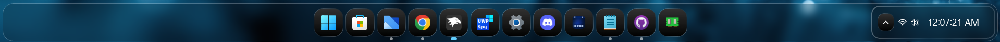
<details>
<summary>Content to import (click to expand)</summary>

```yaml
styleConstants:
  - IconBackground=<LinearGradientBrush StartPoint="0.47,-0.29" EndPoint="0.50,1.29"><GradientStop Offset="0.18" Color="#2F2F2F"/><GradientStop Offset="0.3" Color="#292929"/><GradientStop Offset="0.5" Color="#141414"/><GradientStop Offset="0.68" Color="#080808"/><GradientStop Offset="0.81" Color="#000000"/></LinearGradientBrush>
  - IconBorder=<LinearGradientBrush StartPoint="0.25,-0.20" EndPoint="0.99,1.39"><GradientStop Offset="0.11" Color="#50FFFFFF"/><GradientStop Offset="0.3" Color="#631C1C1C"/><GradientStop Offset="0.62" Color="#591C1C1C"/><GradientStop Offset="0.77" Color="#50FFFFFF"/></LinearGradientBrush>
controlStyles:
  - target: Taskbar.TaskbarFrame
    styles:
      - Height=80
      - MaxHeight=80
      - HorizontalAlignment=Center
  - target: Taskbar.TaskListLabeledButtonPanel#IconPanel > Image#Icon
    styles:
      - Height=24
      - Width=24
      - Margin=10,0,0,0
  - target: Taskbar.TaskListButtonPanel
    styles:
      - Width=55
      - Height=70
  - target: Taskbar.TaskListLabeledButtonPanel
    styles:
      - Width=55
      - Height=70
  - target: SearchUx.SearchUI.SearchButtonControl > Grid > SearchUx.SearchUI.SearchIconButton#SearchIcon > SearchUx.SearchUI.SearchButtonRootGrid#SearchBoxButtonRootPanel
    styles:
      - Width=55
      - Height=70  
  - target: Grid#RootGrid > Taskbar.TaskbarBackground > Grid
    styles:
      - CornerRadius=20
      - Background:=<WindhawkBlur BlurAmount="8" TintColor="#2D101010"/>
      - BorderThickness=1
      - Margin=-15,0,-15,0
      - BorderBrush=#40FFFFFF
      - Padding=-1
  - target: Rectangle#BackgroundStroke
    styles:
      - Fill=Transparent
  - target: Taskbar.TaskbarFrame > Grid#RootGrid
    styles:
      - Visibility=Visible
      - Margin=0,8,0,2
      - Padding=20,0,20,0
  - target: Taskbar.TaskbarFrame > Grid#RootGrid > Taskbar.TaskbarBackground > Grid >
    styles:
      - ''
  - target: Windows.UI.Xaml.Controls.FlyoutPresenter
    styles:
      - RequestedTheme=Dark
      - Background:=<WindhawkBlur BlurAmount="8" TintColor="#2D101010"/>
      - BorderThickness=2
      - BorderBrush:=<WindhawkBlur BlurAmount="8" TintColor="#30ffffff"/>
      - CornerRadius=33
      - Padding=2,3,2,3
  - target: Windows.UI.Xaml.Controls.Border#SnapPickerBorder
    styles:
      - RequestedTheme=Dark
      - Background:=Transparent
      - BorderBrush:=Transparent
      - BorderThickness=2
      - Margin=0
  - target: WindowsInternal.ComposableShell.Experiences.Switcher.AltTab > Grid#ModalRootGrid > Border#BackgroundElement
    styles:
      - Background:=<WindhawkBlur BlurAmount="8" TintColor="#2D101010"/>
      - BorderThickness=2
      - BorderBrush:=<WindhawkBlur BlurAmount="8" TintColor="#30ffffff"/>
      - CornerRadius=50
  - target: MenuFlyoutPresenter
    styles:
      - CornerRadius=20
  - target: MenuFlyoutPresenter > Border
    styles:
      - Background:=<WindhawkBlur BlurAmount="8" TintColor="#2D101010"/>
      - BorderThickness=2
      - CornerRadius=25
      - BorderBrush:=<WindhawkBlur BlurAmount="8" TintColor="#30ffffff"/>
  - target: ScrollViewer > ScrollContentPresenter > Border > Grid > SystemTray.SystemTrayFrame > Grid#SystemTrayFrameGrid > SystemTray.Stack#NotifyIconStack > Grid#Content > SystemTray.StackListView#IconStack > ItemsPresenter > StackPanel > ContentPresenter > SystemTray.ChevronIconView > Grid#ContainerGrid > ContentPresenter#ContentPresenter > Grid#ContentGrid
    styles:
      - Height=35
      - CornerRadius=12
      - Background:=$IconBackground
      - BorderBrush:=$IconBorder
      - BorderThickness=1.2
  - target: Grid#SystemTrayFrameGrid
    styles:
      - Width=Auto
      - Background:=<WindhawkBlur BlurAmount="8" TintColor="#2D101010"/>
      - CornerRadius=15
      - Margin=200,5,-420,-5
      - RenderTransform:=<TranslateTransform X="-435" Y="-2"/>
      - Padding=10,2
      - BorderBrush:=<LinearGradientBrush EndPoint="1,1" StartPoint="0,0"><GradientStop Color="#50ffffff" Offset="0.0"/><GradientStop Color="#10ffffff" Offset="0.5"/><GradientStop Color="#30ffffff" Offset="1.0"/></LinearGradientBrush>
      - BorderThickness=2
      - Visibility=Visible
  - target: Taskbar.TaskListButtonPanel@CommonStates > Border#BackgroundElement
    styles:
      - CornerRadius=15
      - Margin=0,5.5,0,5.5
      - Background:=$IconBackground
      - BorderBrush:=$IconBorder
      - BorderThickness=1.2
  - target: Taskbar.TaskbarBackground#HoverFlyoutBackgroundControl > Grid > Rectangle#BackgroundStroke
    styles:
      - Fill:=<WindhawkBlur BlurAmount="3.5" TintColor="#2D101010"/>
      - Stroke:=<WindhawkBlur BlurAmount="8" TintColor="#30ffffff"/>
      - StrokeThickness=5
      - RadiusX=14
      - RadiusY=14
      - Fill:=<<WindhawkBlur BlurAmount="8" TintColor="#30ffffff"/>
  - target: Taskbar.TaskbarBackground#HoverFlyoutBackgroundControl > Grid > Rectangle#BackgroundFill
    styles:
      - Canvas.ZIndex=0
      - Fill:=
      - Stroke:=<WindhawkBlur BlurAmount="8" TintColor="#30ffffff"/>
      - StrokeThickness=5
      - RadiusX=14
      - RadiusY=14
  - target: Taskbar.FlyoutFrame > Windows.UI.Xaml.Controls.Canvas#HoverFlyoutCanvas > Windows.UI.Xaml.Controls.Grid#HoverFlyoutGrid > Windows.UI.Xaml.Controls.ContentPresenter#HoverFlyoutContent > Taskbar.TaskItemThumbnailList > Microsoft.UI.Xaml.Controls.ItemsRepeater#TaskItemThumbnailListRepeater > Taskbar.TaskItemThumbnailView > Windows.UI.Xaml.Controls.Grid > Windows.UI.Xaml.Controls.Border#BackgroundBorder
    styles:
      - VerticalAlignment=Bottom
      - Canvas.ZIndex=1
      - Background:=<WindhawkBlur BlurAmount="5" TintColor="#761E1E1E"/>
      - Height=25
      - CornerRadius=0,0,15,15
      - Margin=5,0,5,0
  - target: Border#HoverFlyoutBackground
    styles:
      - Margin=4,36,4,0
      - Canvas.ZIndex=1
      - Width=Auto
      - Background:=Transparent
      - BorderThickness=0
      - CornerRadius=15
  - target: Microsoft.UI.Xaml.Controls.ItemsRepeater#IconsRepeater > Windows.UI.Xaml.Controls.Image
    styles:
      - Visibility=Collapsed
  - target: Microsoft.UI.Xaml.Controls.ItemsRepeater#ThumbBarRepeater > Taskbar.ThumbBarButton#ThumbBarButton > Windows.UI.Xaml.Controls.ContentPresenter#BorderElement      
    styles:
      - Background:=<WindhawkBlur BlurAmount="8" TintColor="#761E1E1E"/>
      - Margin=0,-20,0,20
  - target: Windows.UI.Xaml.Controls.Button#CloseButton
    styles:
      - HorizontalAlignment=left
      - Grid.ColumnSpan=1
      - Grid.RowSpan=1
      - Canvas.ZIndex=1
      - CornerRadius=20
      - Width=28
      - Height=28
      - Margin=-18,40,15,-40
      - Background:=<WindhawkBlur BlurAmount="8" TintColor="#80ffffff"/>
      - Foreground=black
      - BorderBrush:=<WindhawkBlur BlurAmount="8" TintColor="#761E1E1E"/>
  - target: Taskbar.FlyoutFrame > Windows.UI.Xaml.Controls.Canvas#HoverFlyoutCanvas > Windows.UI.Xaml.Controls.Grid#HoverFlyoutGrid > Windows.UI.Xaml.Controls.ContentPresenter#HoverFlyoutContent > Taskbar.TaskItemThumbnailList > Microsoft.UI.Xaml.Controls.ItemsRepeater#TaskItemThumbnailListRepeater > Taskbar.TaskItemThumbnailView > Windows.UI.Xaml.Controls.Grid > Windows.UI.Xaml.Controls.TextBlock#DisplayNameTextBlock
    styles:
      - Grid.ColumnSpan=2
      - Grid.RowSpan=2
      - VerticalAlignment=bottom
      - HorizontalAlignment=Center
      - Margin=0,-5,0,5
      - Canvas.ZIndex=1

  - target: SystemTray.NotifyIconView@CommonStates > Grid#ContainerGrid > Border#BackgroundBorder
    styles:
      - CornerRadius=12
      - Background:=$IconBackground
      - BorderBrush:=$IconBorder
      - Margin=2
      - BorderThickness=1.2
  - target: SystemTray.NotifyIconView@CommonStates > Grid#ContainerGrid > Border#BackgroundBorder
    styles:
      - CornerRadius=12
      - Background:=$IconBackground
      - BorderBrush:=$IconBorder
      - Margin=2
      - BorderThickness=1.2
  - target: Border#OverflowFlyoutBackgroundBorder
    styles:
      - Background:=<WindhawkBlur BlurAmount="8" TintColor="#2D101010"/>
      - BorderBrush:=<WindhawkBlur BlurAmount="8" TintColor="#60ffffff"/>
      - BorderThickness=2
      - CornerRadius=32,32,30,30
      - Margin=-10
  - target: SystemTray.OmniButton#ControlCenterButton > Grid > ContentPresenter > ItemsPresenter > StackPanel > ContentPresenter > SystemTray.IconView#SystemTrayIcon > Grid > Grid > SystemTray.TextIconContent
    styles:
      - CornerRadius=15
  - target: Taskbar.TaskListLabeledButtonPanel@RunningIndicatorStates > Rectangle#RunningIndicator
    styles:

      - Fill:=#90ffffff
      - RadiusX=3 
      - RadiusY=3 
      - Margin=-2
      - Height=6
      - Width=6
      - Margin=10,0,0,-2      
      - Width@ActiveRunningIndicator=12
      - Fill@ActiveRunningIndicator=#60CDFF
  - target: Taskbar.TaskListLabeledButtonPanel > TextBlock#LabelControl
    styles:
      - Margin=4,0,0,0
      - Foreground=White
  - target: Taskbar.SearchBoxButton
    styles:
      - Background:=<WindhawkBlur BlurAmount="60" TintColor="#35ffffff"/>
      - CornerRadius=20
      - Margin=2,6,2,6
      - BorderBrush:=<LinearGradientBrush EndPoint="1,1" StartPoint="0,0"><GradientStop Color="#E0ffffff" Offset="0.0"/><GradientStop Color="#20ffffff" Offset="0.5"/><GradientStop Color="#A0ffffff" Offset="1.0"/></LinearGradientBrush>
      - BorderThickness=1.2
  - target: TextBlock#SearchBoxTextBlock
    styles:
      - FontSize=12
      - Foreground=White
  - target: Grid
    styles:
      - RequestedTheme=2
  - target: Taskbar.TaskListButton#TaskListButton[AutomationProperties.Name=Copilot] > Taskbar.TaskListLabeledButtonPanel#IconPanel > Border#BackgroundElement
    styles:
      - Background:=$IconBackground
  - target: Taskbar.StartButton#StartButton
    styles:
      - Background:=<WindhawkBlur BlurAmount="60" TintColor="#35ffffff"/>
      - CornerRadius=20
      - Margin=2,6,2,6
      - BorderBrush:=<LinearGradientBrush EndPoint="1,1" StartPoint="0,0"><GradientStop Color="#E0ffffff" Offset="0.0"/><GradientStop Color="#20ffffff" Offset="0.5"/><GradientStop Color="#A0ffffff" Offset="1.0"/></LinearGradientBrush>
      - BorderThickness=1.2
  - target: Border#MultiWindowElement
    styles:
      - Visibility=Collapsed
  - target: TextBlock#TimeInnerTextBlock
    styles:
      - Foreground=White
      - FontSize=18
      - FontFamily=Quantico
      - Margin=0
      - Padding=0
      - RenderTransform:=<TranslateTransform X="0" Y="1"/>
  - target: TextBlock#DateInnerTextBlock
    styles:
      - Foreground=White
      - Visibility=Collapsed
      - RenderTransform:=<TranslateTransform X="0" Y="-9"/>
      - FontSize=11
      - FontFamily=vivo Sans EN VF
  - target: SystemTray.TextIconContent > Grid > SystemTray.AdaptiveTextBlock#Base > TextBlock
    styles:
      - Foreground=White
  - target: Taskbar.AugmentedEntryPointButton#AugmentedEntryPointButton
    styles:
      - Margin=-12,0,0,0
  - target: SearchUx.SearchUI.SearchButtonControl > Grid > SearchUx.SearchUI.SearchIconButton#SearchIcon > SearchUx.SearchUI.SearchButtonRootGrid#SearchBoxButtonRootPanel > Border#BackgroundElement
    styles:
      - Margin=0,5.5,0,5.5
      - CornerRadius=15
      - Background:=$IconBackground
      - BorderBrush:=$IconBorder
  - target: Taskbar.ExperienceToggleButton#LaunchListButton[AutomationProperties.Name=Task View]
    styles:
      - Background:=<WindhawkBlur BlurAmount="60" TintColor="#35ffffff"/>
      - CornerRadius=20
      - BorderBrush:=<LinearGradientBrush EndPoint="1,1" StartPoint="0,0"><GradientStop Color="#E0ffffff" Offset="0.0"/><GradientStop Color="#20ffffff" Offset="0.5"/><GradientStop Color="#A0ffffff" Offset="1.0"/></LinearGradientBrush>
      - BorderThickness=1.2
  - target: taskbar:TaskListLabeledButtonPanel@RunningIndicatorStates > Border
    styles:
      - Background@InactiveRunningIndicatorPointerOver:=<WindhawkBlur BlurAmount="40" TintColor="#10ffffff"/>
      - CornerRadius=12
      - BorderBrush@InactiveRunningIndicatorPointerOver:=<LinearGradientBrush EndPoint="1,0" StartPoint="0,0"><GradientStop Color="#80ffffff" Offset="0.0"/><GradientStop Color="{ThemeResource SurfaceStrokeColorDefault}" Offset="0.55"/><GradientStop Color="#80ffffff" Offset="1"/></LinearGradientBrush>
      - BorderThickness@InactiveRunningIndicatorPointerOver=1
  - target: Taskbar.TaskListLabeledButtonPanel@CommonStates > Border#BackgroundElement
    styles:
      - CornerRadius=15
      - Margin=0,5.5,0,5.5
      - Background:=$IconBackground
      - BorderBrush:=$IconBorder
      - BorderThickness=1.2
  - target: Taskbar.TaskbarFrame > Grid#RootGrid > Taskbar.TaskbarBackground > Grid > Rectangle#BackgroundStroke
    styles:
      - Visibility=Collapsed
  - target: Taskbar.TaskbarFrame > Grid#RootGrid > Taskbar.TaskbarBackground > Grid > Rectangle#BackgroundFill
    styles:
      - Fill=Transparent
  - target: SystemTray.NotifyIconView#NotifyItemIcon
    styles:
      - Background:=<WindhawkBlur BlurAmount="10" TintColor="#40ffffff"/>
      - CornerRadius=12
      - Margin=2
      - Padding=2
      - BorderBrush:=<LinearGradientBrush EndPoint="1,0" StartPoint="0,0"><GradientStop Color="#80ffffff" Offset="0.0"/><GradientStop Color="{ThemeResource SurfaceStrokeColorDefault}" Offset="0.55"/><GradientStop Color="#80ffffff" Offset="1"/></LinearGradientBrush>
      - BorderThickness=2
  - target: Windows.UI.Xaml.Controls.Grid#ConfirmatorMainGrid
    styles:
      - Background:=<WindhawkBlur BlurAmount="8" TintColor="#2D101010"/>
      - CornerRadius=24
      - BorderBrush:=<WindhawkBlur BlurAmount="8" TintColor="#30ffffff"/>
      - BorderThickness=2
      - Margin=0,0,0,10
  - target: Windows.UI.Xaml.Controls.Grid.Border#ConfirmatorMainGrid
    styles:
      - Background:=<WindhawkBlur BlurAmount="8" TintColor="#2D101010"/>
  - target: Windows.UI.Xaml.Shapes.Rectangle#HorizontalTrackRect
    styles:
      - Fill=#20ffffff
      - RadiusX=12
      - RadiusY=12
      - Height=18
      - Margin=0
  - target: Windows.UI.Xaml.Shapes.Rectangle#HorizontalDecreaseRect
    styles:
      - Fill=#ff7060
      - RadiusX=12
      - RadiusY=12
      - Height=18
  - target: Windows.UI.Xaml.Controls.Grid#VolumeConfirmator
    styles:
      - Padding=8,0,8,0
  - target: Windows.UI.Xaml.Controls.Grid#BrightnessConfirmator
    styles:
      - Padding=8,0,8,0
  - target: Windows.UI.Xaml.Controls.TextBlock#volumeLevelText
    styles:
      - Foreground=White
themeResourceVariables:
  - ''
xamlDiagnosticsHandling: ''

```
</details>

