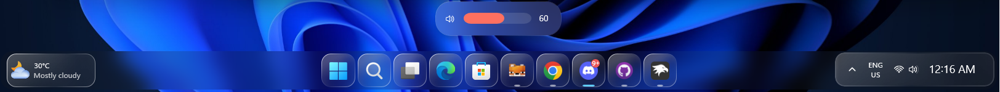

# OS26 Liquid Glass theme for Windows 11 Taskbar Styler

Author: [WasiXGamer](https://github.com/wasiabbas4pk)

This theme makes the Windows 11 taskbar look like an OS26-inspired "Liquid Glass" dock. It features a glassy dock with liquid glass backgrounds for apps. It also tweaks the volume and brightness indicator for a cleaner look.

## Taskbar Previews


## Volume/Brightness indicator


---
## Requirements

This theme requires the Windhawk mod [Taskbar Height and Icon size](https://windhawk.net/mods/taskbar-icon-size) to function properly.

## Taskbar Height and Icon size Configurations

**Large(Recommended):** `{"TaskbarHeight":70,"IconSize":30,"TaskbarButtonWidth":58,"IconSizeSmall":16,"TaskbarButtonWidthSmall":32}`

Preview:


**Medium:** `{"TaskbarHeight":65,"IconSize":30,"TaskbarButtonWidth":54,"IconSizeSmall":16,"TaskbarButtonWidthSmall":32}`

Preview:


**Small:** `{"TaskbarHeight":60,"IconSize":25,"TaskbarButtonWidth":48,"IconSizeSmall":16,"TaskbarButtonWidthSmall":32}`

Preview: 


## Theme selection

The theme is integrated into the mod and can be selected directly from the mod's
settings:

* Open the Windows 11 Taskbar Styler mod in Windhawk.
* Go to the "Settings" tab.
* Select the theme and save the settings.

## Manual installation

The theme styles can also be imported manually. To do that, follow these steps:

* Open the Windows 11 Taskbar Styler mod in Windhawk.
* Go to the "Settings" tab and select "Textual mode".
* Copy the content below to the text box and click "Save settings".

<details>
<summary>Content to import (click to expand)</summary>

```yaml
styleConstants:
  - ''
controlStyles:
  - target: Taskbar.TaskbarFrame > Grid#RootGrid
    styles:
      - Background:=<WindhawkBlur BlurAmount="15" TintColor="{ThemeResource SystemChromeAltHighColor}" TintOpacity="0.2" />
      - Margin=150,1,150,4
      - CornerRadius=20
      - BorderThickness=1.2
      - Padding=10,0
  - target: Grid#SystemTrayFrameGrid
    styles:
      - Background:=<ImageBrush Stretch="UniformtoFill" ImageSource="https://raw.githubusercontent.com/ramensoftware/windows-11-taskbar-styling-guide/refs/heads/main/Themes/WinXP/Assets/os26liquidglassbg.png" />
      - CornerRadius=15
      - Margin=60,6,-280,8
      - RenderTransform:=<TranslateTransform X="-435" Y="-2"/>
      - Padding=10,2
      - BorderBrush:=<LinearGradientBrush StartPoint="0,0" EndPoint="1,1"><GradientStop Color="#50ffffff" Offset="0.0" /><GradientStop Color="#10ffffff" Offset="0.5" /><GradientStop Color="#30ffffff" Offset="1.0" /></LinearGradientBrush>
      - BorderThickness=2
  - target: Taskbar.TaskListButtonPanel@CommonStates > Border#BackgroundElement
    styles:
      - CornerRadius=15
      - Background:=<ImageBrush Stretch="UniformtoFill" ImageSource="https://raw.githubusercontent.com/ramensoftware/windows-11-taskbar-styling-guide/refs/heads/main/Themes/WinXP/Assets/os26liquidglassbg.png" />
      - BorderBrush:=<LinearGradientBrush StartPoint="0,0" EndPoint="1,1"><GradientStop Color="#F5ffffff" Offset="0.0" /><GradientStop Color="#40ffffff" Offset="0.4" /><GradientStop Color="#20ffffff" Offset="0.6" /><GradientStop Color="#90ffffff" Offset="1.0" /></LinearGradientBrush>
      - BorderThickness=1.2
  - target: Taskbar.TaskListLabeledButtonPanel@RunningIndicatorStates > Rectangle#RunningIndicator
    styles:
      - Fill:=#90ffffff
      - RadiusX=4
      - RadiusY=4
      - Height=3
      - Width=10
      - Width@ActiveRunningIndicator=20
      - Fill@ActiveRunningIndicator=#60CDFF
  - target: Taskbar.TaskListLabeledButtonPanel > TextBlock#LabelControl
    styles:
      - Margin=4,0,0,0
      - Foreground=White
  - target: Taskbar.SearchBoxButton
    styles:
      - Background:=<WindhawkBlur BlurAmount="60" TintColor="#35ffffff" />
      - CornerRadius=20
      - Margin=2,6,2,6
      - BorderBrush:=<LinearGradientBrush StartPoint="0,0" EndPoint="1,1"><GradientStop Color="#E0ffffff" Offset="0.0" /><GradientStop Color="#20ffffff" Offset="0.5" /><GradientStop Color="#A0ffffff" Offset="1.0" /></LinearGradientBrush>
      - BorderThickness=1.2
  - target: TextBlock#SearchBoxTextBlock
    styles:
      - FontSize=12
      - Foreground=White
  - target: Grid
    styles:
      - RequestedTheme=2
  - target: Taskbar.TaskListButton#TaskListButton[AutomationProperties.Name=Copilot] > Taskbar.TaskListLabeledButtonPanel#IconPanel > Border#BackgroundElement
    styles:
      - Background:=<WindhawkBlur BlurAmount="10" TintColor="#10ffffff" />
  - target: Taskbar.StartButton#StartButton
    styles:
      - Background:=<WindhawkBlur BlurAmount="60" TintColor="#35ffffff" />
      - CornerRadius=20
      - Margin=2,6,2,6
      - BorderBrush:=<LinearGradientBrush StartPoint="0,0" EndPoint="1,1"><GradientStop Color="#E0ffffff" Offset="0.0" /><GradientStop Color="#20ffffff" Offset="0.5" /><GradientStop Color="#A0ffffff" Offset="1.0" /></LinearGradientBrush>
      - BorderThickness=1.2
  - target: Border#MultiWindowElement
    styles:
      - Visibility=Collapsed
  - target: TextBlock#TimeInnerTextBlock
    styles:
      - Foreground=White
      - FontSize=18
      - FontFamily=Quantico
      - Margin=0
      - Padding=0
      - RenderTransform:=<TranslateTransform X="0" Y="1" />
  - target: TextBlock#DateInnerTextBlock
    styles:
      - Foreground=White
      - Visibility=Collapsed
      - RenderTransform:=<TranslateTransform X="0" Y="-9" />
      - FontSize=11
      - FontFamily=vivo Sans EN VF
  - target: SystemTray.TextIconContent > Grid > SystemTray.AdaptiveTextBlock#Base > TextBlock
    styles:
      - Foreground=White
  - target: Taskbar.AugmentedEntryPointButton#AugmentedEntryPointButton
    styles:
      - Margin=-12,0,0,0
  - target: SearchUx.SearchUI.SearchButtonControl > Grid > SearchUx.SearchUI.SearchIconButton#SearchIcon > SearchUx.SearchUI.SearchButtonRootGrid#SearchBoxButtonRootPanel > Border#BackgroundElement
    styles:
      - CornerRadius=15
      - Background:=<ImageBrush Stretch="UniformtoFill" ImageSource="https://raw.githubusercontent.com/ramensoftware/windows-11-taskbar-styling-guide/refs/heads/main/Themes/WinXP/Assets/os26liquidglassbg.png" />
      - BorderBrush:=<LinearGradientBrush StartPoint="0,0" EndPoint="1,1"><GradientStop Color="#F5ffffff" Offset="0.0" /><GradientStop Color="#40ffffff" Offset="0.4" /><GradientStop Color="#20ffffff" Offset="0.6" /><GradientStop Color="#90ffffff" Offset="1.0" /></LinearGradientBrush>
  - target: Taskbar.ExperienceToggleButton#LaunchListButton[AutomationProperties.Name=Task View]
    styles:
      - Background:=<WindhawkBlur BlurAmount="60" TintColor="#35ffffff" />
      - CornerRadius=20
      - BorderBrush:=<LinearGradientBrush StartPoint="0,0" EndPoint="1,1"><GradientStop Color="#E0ffffff" Offset="0.0" /><GradientStop Color="#20ffffff" Offset="0.5" /><GradientStop Color="#A0ffffff" Offset="1.0" /></LinearGradientBrush>
      - BorderThickness=1.2
  - target: taskbar:TaskListLabeledButtonPanel@RunningIndicatorStates > Border
    styles:
      - Background@InactiveRunningIndicatorPointerOver:=<WindhawkBlur BlurAmount="40" TintColor="#10ffffff" />
      - CornerRadius=12
      - BorderBrush@InactiveRunningIndicatorPointerOver:=<LinearGradientBrush StartPoint="0,0" EndPoint="1,0"><GradientStop Color="#80ffffff" Offset="0.0" /><GradientStop Color="{ThemeResource SurfaceStrokeColorDefault}" Offset="0.55" /><GradientStop Color="#80ffffff" Offset="1" /></LinearGradientBrush>
      - BorderThickness@InactiveRunningIndicatorPointerOver=1
  - target: Taskbar.TaskListLabeledButtonPanel@CommonStates > Border#BackgroundElement
    styles:
      - CornerRadius=15
      - Margin=0
      - Background:=<ImageBrush Stretch="UniformtoFill" ImageSource="https://raw.githubusercontent.com/ramensoftware/windows-11-taskbar-styling-guide/refs/heads/main/Themes/WinXP/Assets/os26liquidglassbg.png" />
      - BorderBrush:=<LinearGradientBrush StartPoint="0,0" EndPoint="1,1"><GradientStop Color="#F5ffffff" Offset="0.0" /><GradientStop Color="#40ffffff" Offset="0.4" /><GradientStop Color="#20ffffff" Offset="0.6" /><GradientStop Color="#90ffffff" Offset="1.0" /></LinearGradientBrush>
      - BorderThickness=1.2
  - target: Taskbar.TaskbarFrame > Grid#RootGrid > Taskbar.TaskbarBackground > Grid > Rectangle#BackgroundStroke
    styles:
      - Visibility=Collapsed
  - target: Taskbar.TaskbarFrame > Grid#RootGrid > Taskbar.TaskbarBackground > Grid > Rectangle#BackgroundFill
    styles:
      - Fill=Transparent
  - target: SystemTray.NotifyIconView#NotifyItemIcon
    styles:
      - Background:=<WindhawkBlur BlurAmount="10" TintColor="#40ffffff" />
      - CornerRadius=12
      - Margin=2
      - Padding=2
      - BorderBrush:=<LinearGradientBrush StartPoint="0,0" EndPoint="1,0"><GradientStop Color="#80ffffff" Offset="0.0" /><GradientStop Color="{ThemeResource SurfaceStrokeColorDefault}" Offset="0.55" /><GradientStop Color="#80ffffff" Offset="1" /></LinearGradientBrush>
      - BorderThickness=2
  - target: Windows.UI.Xaml.Controls.Grid#ConfirmatorMainGrid
    styles:
      - Background:=<WindhawkBlur BlurAmount="30" TintColor="#25ffffff" />
      - CornerRadius=24
      - BorderThickness=1.2
      - BorderBrush:=<LinearGradientBrush StartPoint="0,0" EndPoint="1,1"><GradientStop Color="#50ffffff" Offset="0.0" /><GradientStop Color="#10ffffff" Offset="0.5" /><GradientStop Color="#30ffffff" Offset="1.0" /></LinearGradientBrush>
      - Margin=0,0,0,10
  - target: Windows.UI.Xaml.Shapes.Rectangle#HorizontalTrackRect
    styles:
      - Fill=#20ffffff
      - RadiusX=12
      - RadiusY=12
      - Height=18
      - Margin=0
  - target: Windows.UI.Xaml.Shapes.Rectangle#HorizontalDecreaseRect
    styles:
      - Fill=#ff7060
      - RadiusX=12
      - RadiusY=12
      - Height=18
  - target: Windows.UI.Xaml.Controls.Grid#VolumeConfirmator
    styles:
      - Padding=8,0,8,0
  - target: Windows.UI.Xaml.Controls.Grid#BrightnessConfirmator
    styles:
      - Padding=15,0,17,0
  - target: Windows.UI.Xaml.Controls.TextBlock#volumeLevelText
    styles:
      - Foreground=White
themeResourceVariables:
  - ''
xamlDiagnosticsHandling: ''
```
</details>
