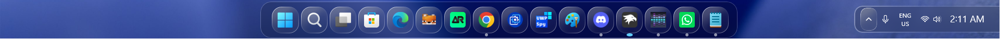
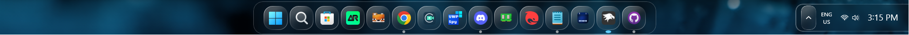
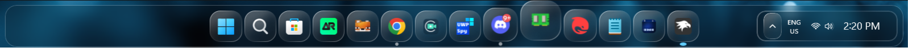
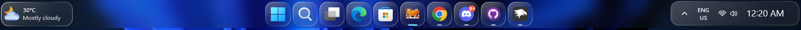
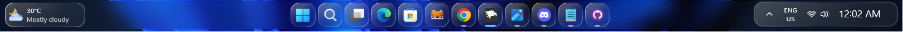

# OS26 Liquid Glass Theme for Windows 11 Taskbar Styler

Author: [wasiabbas4pk](https://github.com/wasiabbas4pk)

This theme makes the Windows 11 taskbar look like an OS26-inspired "Liquid Glass" Dock or Taskbar. It features a glassy dock with liquid glass backgrounds for apps. It also tweaks the volume and brightness indicator for a cleaner look.

# Previews

## Dock


## Taskbar


# Other Previews

## Volume/Brightness indicator


## Tray


## Context Menu


## Thumbnail


## Windows Selector
 

---

# Taskbar Height and Icon size Configurations

This theme requires the Windhawk mod [Taskbar Height and Icon size](https://windhawk.net/mods/taskbar-icon-size) to function properly.

## Dock

**Large (Recommended):** `{"TaskbarHeight":85,"IconSize":30,"TaskbarButtonWidth":60,"IconSizeSmall":16,"TaskbarButtonWidthSmall":32}`

Preview:


**Medium:** `{"TaskbarHeight":80,"IconSize":30,"TaskbarButtonWidth":55,"IconSizeSmall":16,"TaskbarButtonWidthSmall":32}`

Preview:


**Small:** `{"TaskbarHeight":75,"IconSize":25,"TaskbarButtonWidth":48,"IconSizeSmall":16,"TaskbarButtonWidthSmall":32}`

Preview: 



## Taskbar

**Large (Recommended):** `{"TaskbarHeight":70,"IconSize":30,"TaskbarButtonWidth":58,"IconSizeSmall":16,"TaskbarButtonWidthSmall":32}`

Preview:


**Medium:** `{"TaskbarHeight":65,"IconSize":30,"TaskbarButtonWidth":54,"IconSizeSmall":16,"TaskbarButtonWidthSmall":32}`

Preview:


**Small:** `{"TaskbarHeight":60,"IconSize":25,"TaskbarButtonWidth":48,"IconSizeSmall":16,"TaskbarButtonWidthSmall":32}`

Preview: 


---

# Full Sized Taskbar

This Taskbar can be set to full Horizontal Length by Altering these Targets:

<details>
<summary>Target 1: (click to expand)</summary>
  
```yaml
  - target: Taskbar.TaskbarFrame > Grid#RootGrid
    styles:
      - RequestedTheme=Dark
      - Background:=<WindhawkBlur BlurAmount="8" TintColor="#2D101010"/>
      - Margin=5,1,5,4
      - CornerRadius=20
      - BorderThickness=1.2
      - Padding=10,0
```

</details>

<details>
<summary>Target 2: (click to expand)</summary>

```yaml
  - target: Grid#SystemTrayFrameGrid
    styles:
      - Background:=<ImageBrush ImageSource="[https://raw.githubusercontent.com/ramensoftware/windows-11-taskbar-styling-guide/refs/heads/main/Themes/OS26 Liquid Glass/Assets/tahoeappbg.png](https://raw.githubusercontent.com/ramensoftware/windows-11-taskbar-styling-guide/refs/heads/main/Themes/OS26 Liquid Glass/Assets/tahoeappbg.png)" Stretch="UniformtoFill"/>
      - CornerRadius=15
      - Margin=150,6,-425,8
      - RenderTransform:=<TranslateTransform X="-435" Y="-2"/>
      - Padding=10,2
      - BorderBrush:=<LinearGradientBrush EndPoint="1,1" StartPoint="0,0"><GradientStop Color="#50ffffff" Offset="0.0"/><GradientStop Color="#10ffffff" Offset="0.5"/><GradientStop Color="#30ffffff" Offset="1.0"/></LinearGradientBrush>
      - BorderThickness=2
```

</details>

---

# Theme selection

The theme is integrated into the mod and can be selected directly from the mod's settings:

* Open the Windows 11 Taskbar Styler mod in Windhawk.
* Go to the "Settings" tab.
* Select the theme and save the settings.

# Manual installation

The theme styles can also be imported manually. To do that, follow these steps:

* Open the Windows 11 Taskbar Styler mod in Windhawk.
* Go to the "Settings" tab and select "Textual mode".
* Copy the content below to the text box and click "Save settings".

## Dock Configuration

<details>
<summary>Content to import (click to expand)</summary>

```yaml
styleConstants:
  - IconBackground= <ImageBrush ImageSource="C:\Backgrounds\custom.png" Stretch="UniformtoFill"/>
  - IconBorder= <LinearGradientBrush EndPoint="1,1" StartPoint="0,0"><GradientStop Color="#F5ffffff" Offset="0.0"/><GradientStop Color="#40ffffff" Offset="0.4"/><GradientStop Color="#20ffffff" Offset="0.6"/><GradientStop Color="#90ffffff" Offset="1.0"/></LinearGradientBrush>
controlStyles:
  - target: Grid#RootGrid > Taskbar.TaskbarBackground > Grid
    styles:
      - CornerRadius=20
      - Background:=<WindhawkBlur BlurAmount="8" TintColor="#2D101010"/>
      - BorderThickness=1
      - Margin=-20,0,-20,0
      - BorderBrush=#40FFFFFF
      - Padding=-1
  - target: Rectangle#BackgroundStroke
    styles:
      - Fill=Transparent
  - target: Taskbar.TaskbarFrame
    styles:
      - Width=Auto
      - HorizontalAlignment=Center
  - target: Taskbar.TaskbarFrame > Grid#RootGrid
    styles:
      - Visibility=Visible
      - Margin=0,8,0,2
      - Padding=20,0,20,0
  - target: Taskbar.TaskbarFrame > Grid#RootGrid > Taskbar.TaskbarBackground > Grid >
    styles:
      - ''
  - target: Windows.UI.Xaml.Controls.FlyoutPresenter
    styles:
      - RequestedTheme=Dark
      - Background:=<WindhawkBlur BlurAmount="8" TintColor="#2D101010"/>
      - BorderThickness=10,10,10,10
      - BorderBrush:=<WindhawkBlur BlurAmount="8" TintColor="#30ffffff"/>
      - CornerRadius=33
      - Padding=2,3,2,3
  - target: Windows.UI.Xaml.Controls.Border#SnapPickerBorder
    styles:
      - RequestedTheme=Dark
      - Background:=Transparent
      - BorderBrush:=Transparent
      - BorderThickness=5
      - Margin=0
  - target: WindowsInternal.ComposableShell.Experiences.Switcher.AltTab > Grid#ModalRootGrid > Border#BackgroundElement
    styles:
      - Background:=<WindhawkBlur BlurAmount="8" TintColor="#2D101010"/>
      - BorderThickness=15,15,15,15
      - BorderBrush:=<WindhawkBlur BlurAmount="8" TintColor="#30ffffff"/>
      - CornerRadius=50
  - target: MenuFlyoutPresenter
    styles:
      - CornerRadius=20
  - target: MenuFlyoutPresenter > Border
    styles:
      - Background:=<WindhawkBlur BlurAmount="8" TintColor="#2D101010"/>
      - BorderThickness=10,10,10,10
      - CornerRadius=25
      - BorderBrush:=<WindhawkBlur BlurAmount="8" TintColor="#30ffffff"/>
  - target: ScrollViewer > ScrollContentPresenter > Border > Grid > SystemTray.SystemTrayFrame > Grid#SystemTrayFrameGrid > SystemTray.Stack#NotifyIconStack > Grid#Content > SystemTray.StackListView#IconStack > ItemsPresenter > StackPanel > ContentPresenter > SystemTray.ChevronIconView > Grid#ContainerGrid > ContentPresenter#ContentPresenter > Grid#ContentGrid
    styles:
      - CornerRadius=12
      - Background:=$IconBackground
      - BorderBrush:=<LinearGradientBrush EndPoint="1,1" StartPoint="0,0"><GradientStop Color="#F5ffffff" Offset="0.0"/><GradientStop Color="#40ffffff" Offset="0.4"/><GradientStop Color="#20ffffff" Offset="0.6"/><GradientStop Color="#90ffffff" Offset="1.0"/></LinearGradientBrush>
      - BorderThickness=1.2
  - target: Grid#SystemTrayFrameGrid
    styles:
      - Background:=<WindhawkBlur BlurAmount="8" TintColor="#2D101010"/>
      - CornerRadius=15
      - Margin=195,18,-480,10
      - RenderTransform:=<TranslateTransform X="-435" Y="-2"/>
      - Padding=10,2
      - BorderBrush:=<LinearGradientBrush EndPoint="1,1" StartPoint="0,0"><GradientStop Color="#50ffffff" Offset="0.0"/><GradientStop Color="#10ffffff" Offset="0.5"/><GradientStop Color="#30ffffff" Offset="1.0"/></LinearGradientBrush>
      - BorderThickness=2
      - Visibility=Visible
  - target: Taskbar.TaskListButtonPanel@CommonStates > Border#BackgroundElement
    styles:
      - CornerRadius=18
      - Margin=0,5.5,0,5.5
      - Background:=$IconBackground
      - BorderBrush:=$IconBorder
      - BorderThickness=1.2
  - target: Taskbar.TaskbarBackground#HoverFlyoutBackgroundControl > Grid > Rectangle#BackgroundFill
    styles:
      - Fill:=<WindhawkBlur BlurAmount="8" TintColor="#2D101010"/>
      - Stroke:=<WindhawkBlur BlurAmount="8" TintColor="#30ffffff"/>
      - StrokeThickness=5
      - RadiusX=14
      - RadiusY=14
  - target: Taskbar.TaskbarBackground#HoverFlyoutBackgroundControl > Grid > Rectangle#BackgroundStroke
    styles:
      - Fill:=<WindhawkBlur BlurAmount="3.5" TintColor="#2D101010"/>
      - Stroke:=<WindhawkBlur BlurAmount="8" TintColor="#30ffffff"/>
      - StrokeThickness=5
      - RadiusX=14
      - RadiusY=14
      - Fill:=<<WindhawkBlur BlurAmount="8" TintColor="#30ffffff"/>
  - target: Border#HoverFlyoutBackground
    styles:
      - Background:=Transparent
      - BorderThickness=0
      - CornerRadius=18
  - target: Windows.UI.Xaml.Controls.Button#CloseButton
    styles:
      - CornerRadius=20
      - Width=24
      - Height=24
      - Margin=8
      - Background:=<WindhawkBlur BlurAmount="15" TintColor="#50FFFFFF"/>
  - target: SystemTray.NotifyIconView@CommonStates > Grid#ContainerGrid > Border#BackgroundBorder
    styles:
      - CornerRadius=15
      - Background:=$IconBackground
      - BorderBrush:=$IconBorder
      - Margin=2
      - BorderThickness=1.2
  - target: Border#OverflowFlyoutBackgroundBorder
    styles:
      - Background:=<WindhawkBlur BlurAmount="8" TintColor="#2D101010"/>
      - BorderBrush:=<WindhawkBlur BlurAmount="8" TintColor="#60ffffff"/>
      - BorderThickness=10
      - CornerRadius=32,32,30,30
      - Margin=-10
  - target: SystemTray.OmniButton#ControlCenterButton > Grid > ContentPresenter > ItemsPresenter > StackPanel > ContentPresenter > SystemTray.IconView#SystemTrayIcon > Grid > Grid > SystemTray.TextIconContent
    styles:
      - CornerRadius=15
  - target: Taskbar.TaskListLabeledButtonPanel@RunningIndicatorStates > Rectangle#RunningIndicator
    styles:
      - Fill:=#90ffffff
      - RadiusX=6
      - RadiusY=6
      - Margin=-2
      - Height=6
      - Width=6
      - Width@ActiveRunningIndicator=12
      - Fill@ActiveRunningIndicator=#60CDFF
  - target: Taskbar.TaskListLabeledButtonPanel > TextBlock#LabelControl
    styles:
      - Margin=4,0,0,0
      - Foreground=White
  - target: Taskbar.SearchBoxButton
    styles:
      - Background:=<WindhawkBlur BlurAmount="60" TintColor="#35ffffff"/>
      - CornerRadius=20
      - Margin=2,6,2,6
      - BorderBrush:=<LinearGradientBrush EndPoint="1,1" StartPoint="0,0"><GradientStop Color="#E0ffffff" Offset="0.0"/><GradientStop Color="#20ffffff" Offset="0.5"/><GradientStop Color="#A0ffffff" Offset="1.0"/></LinearGradientBrush>
      - BorderThickness=1.2
  - target: TextBlock#SearchBoxTextBlock
    styles:
      - FontSize=12
      - Foreground=White
  - target: Grid
    styles:
      - RequestedTheme=2
  - target: Taskbar.TaskListButton#TaskListButton[AutomationProperties.Name=Copilot] > Taskbar.TaskListLabeledButtonPanel#IconPanel > Border#BackgroundElement
    styles:
      - Background:=$IconBackground
  - target: Taskbar.StartButton#StartButton
    styles:
      - Background:=<WindhawkBlur BlurAmount="60" TintColor="#35ffffff"/>
      - CornerRadius=20
      - Margin=2,6,2,6
      - BorderBrush:=<LinearGradientBrush EndPoint="1,1" StartPoint="0,0"><GradientStop Color="#E0ffffff" Offset="0.0"/><GradientStop Color="#20ffffff" Offset="0.5"/><GradientStop Color="#A0ffffff" Offset="1.0"/></LinearGradientBrush>
      - BorderThickness=1.2
  - target: Border#MultiWindowElement
    styles:
      - Visibility=Collapsed
  - target: TextBlock#TimeInnerTextBlock
    styles:
      - Foreground=White
      - FontSize=18
      - FontFamily=Quantico
      - Margin=0
      - Padding=0
      - RenderTransform:=<TranslateTransform X="0" Y="1"/>
  - target: TextBlock#DateInnerTextBlock
    styles:
      - Foreground=White
      - Visibility=Collapsed
      - RenderTransform:=<TranslateTransform X="0" Y="-9"/>
      - FontSize=11
      - FontFamily=vivo Sans EN VF
  - target: SystemTray.TextIconContent > Grid > SystemTray.AdaptiveTextBlock#Base > TextBlock
    styles:
      - Foreground=White
  - target: Taskbar.AugmentedEntryPointButton#AugmentedEntryPointButton
    styles:
      - Margin=-12,0,0,0
  - target: SearchUx.SearchUI.SearchButtonControl > Grid > SearchUx.SearchUI.SearchIconButton#SearchIcon > SearchUx.SearchUI.SearchButtonRootGrid#SearchBoxButtonRootPanel > Border#BackgroundElement
    styles:
      - Margin=0,5.5,0,5.5
      - CornerRadius=18
      - Background:=$IconBackground
      - BorderBrush:=$IconBorder
  - target: Taskbar.ExperienceToggleButton#LaunchListButton[AutomationProperties.Name=Task View]
    styles:
      - Background:=<WindhawkBlur BlurAmount="60" TintColor="#35ffffff"/>
      - CornerRadius=20
      - BorderBrush:=<LinearGradientBrush EndPoint="1,1" StartPoint="0,0"><GradientStop Color="#E0ffffff" Offset="0.0"/><GradientStop Color="#20ffffff" Offset="0.5"/><GradientStop Color="#A0ffffff" Offset="1.0"/></LinearGradientBrush>
      - BorderThickness=1.2
  - target: taskbar:TaskListLabeledButtonPanel@RunningIndicatorStates > Border
    styles:
      - Background@InactiveRunningIndicatorPointerOver:=<WindhawkBlur BlurAmount="40" TintColor="#10ffffff"/>
      - CornerRadius=12
      - BorderBrush@InactiveRunningIndicatorPointerOver:=<LinearGradientBrush EndPoint="1,0" StartPoint="0,0"><GradientStop Color="#80ffffff" Offset="0.0"/><GradientStop Color="{ThemeResource SurfaceStrokeColorDefault}" Offset="0.55"/><GradientStop Color="#80ffffff" Offset="1"/></LinearGradientBrush>
      - BorderThickness@InactiveRunningIndicatorPointerOver=1
  - target: Taskbar.TaskListLabeledButtonPanel@CommonStates > Border#BackgroundElement
    styles:
      - CornerRadius=18
      - Margin=0,5.5,0,5.5
      - Background:=$IconBackground
      - BorderBrush:=$IconBorder
      - BorderThickness=1.2
  - target: Taskbar.TaskbarFrame > Grid#RootGrid > Taskbar.TaskbarBackground > Grid > Rectangle#BackgroundStroke
    styles:
      - Visibility=Collapsed
  - target: Taskbar.TaskbarFrame > Grid#RootGrid > Taskbar.TaskbarBackground > Grid > Rectangle#BackgroundFill
    styles:
      - Fill=Transparent
  - target: SystemTray.NotifyIconView#NotifyItemIcon
    styles:
      - Background:=<WindhawkBlur BlurAmount="10" TintColor="#40ffffff"/>
      - CornerRadius=12
      - Margin=2
      - Padding=2
      - BorderBrush:=<LinearGradientBrush EndPoint="1,0" StartPoint="0,0"><GradientStop Color="#80ffffff" Offset="0.0"/><GradientStop Color="{ThemeResource SurfaceStrokeColorDefault}" Offset="0.55"/><GradientStop Color="#80ffffff" Offset="1"/></LinearGradientBrush>
      - BorderThickness=2
  - target: Windows.UI.Xaml.Controls.Grid#ConfirmatorMainGrid
    styles:
      - Background:=<WindhawkBlur BlurAmount="8" TintColor="#2D101010"/>
      - CornerRadius=24
      - BorderBrush:=<WindhawkBlur BlurAmount="8" TintColor="#30ffffff"/>
      - BorderThickness=10
      - Margin=0,0,0,10
  - target: Windows.UI.Xaml.Controls.Grid.Border#ConfirmatorMainGrid
    styles:
      - Background:=<WindhawkBlur BlurAmount="8" TintColor="#2D101010"/>
  - target: Windows.UI.Xaml.Shapes.Rectangle#HorizontalTrackRect
    styles:
      - Fill=#20ffffff
      - RadiusX=12
      - RadiusY=12
      - Height=18
      - Margin=0
  - target: Windows.UI.Xaml.Shapes.Rectangle#HorizontalDecreaseRect
    styles:
      - Fill=#ff7060
      - RadiusX=12
      - RadiusY=12
      - Height=18
  - target: Windows.UI.Xaml.Controls.Grid#VolumeConfirmator
    styles:
      - Padding=8,0,8,0
  - target: Windows.UI.Xaml.Controls.Grid#BrightnessConfirmator
    styles:
      - Padding=8,0,8,0
  - target: Windows.UI.Xaml.Controls.TextBlock#volumeLevelText
    styles:
      - Foreground=White
themeResourceVariables:
  - ''
xamlDiagnosticsHandling: ''

```
</details>

## Taskbar Configuration

<details>
<summary>Content to import (click to expand)</summary>

```yaml
styleConstants:
  - ''
controlStyles:
  - target: Taskbar.TaskbarFrame > Grid#RootGrid
    styles:
      - RequestedTheme=Dark
      - Background:=<WindhawkBlur BlurAmount="8" TintColor="#2D101010"/>
      - Margin=150,1,150,4
      - CornerRadius=20
      - BorderThickness=1.2
      - Padding=10,0
  - target: Windows.UI.Xaml.Controls.FlyoutPresenter
    styles:
      - RequestedTheme=Dark
      - Background:=<WindhawkBlur BlurAmount="8" TintColor="#2D101010"/>
      - BorderThickness=10,10,10,10
      - BorderBrush:=<WindhawkBlur BlurAmount="8" TintColor="#30ffffff"/>
      - CornerRadius=33
      - Padding=2,3,2,3
  - target: Windows.UI.Xaml.Controls.Border#SnapPickerBorder
    styles:
      - RequestedTheme=Dark
      - Background:=Transparent
      - BorderBrush:=Transparent
      - BorderThickness=5
      - Margin=0
  - target: WindowsInternal.ComposableShell.Experiences.Switcher.AltTab > Grid#ModalRootGrid > Border#BackgroundElement
    styles:
      - Background:=<WindhawkBlur BlurAmount="8" TintColor="#2D101010"/>
      - BorderThickness=15,15,15,15
      - BorderBrush:=<WindhawkBlur BlurAmount="8" TintColor="#30ffffff"/>
      - CornerRadius=50
  - target: MenuFlyoutPresenter
    styles:
      - CornerRadius=20
  - target: MenuFlyoutPresenter > Border
    styles:
      - Background:=<WindhawkBlur BlurAmount="8" TintColor="#2D101010"/>
      - BorderThickness=10,10,10,10
      - CornerRadius=25
      - BorderBrush:=<WindhawkBlur BlurAmount="8" TintColor="#30ffffff"/>
  - target: ScrollViewer > ScrollContentPresenter > Border > Grid > SystemTray.SystemTrayFrame > Grid#SystemTrayFrameGrid > SystemTray.Stack#NotifyIconStack > Grid#Content > SystemTray.StackListView#IconStack > ItemsPresenter > StackPanel > ContentPresenter > SystemTray.ChevronIconView > Grid#ContainerGrid > ContentPresenter#ContentPresenter > Grid#ContentGrid
    styles:
      - CornerRadius=12
      - Background:=<ImageBrush ImageSource="[https://raw.githubusercontent.com/ramensoftware/windows-11-taskbar-styling-guide/refs/heads/main/Themes/OS26 Liquid Glass/Assets/tahoeappbg.png](https://raw.githubusercontent.com/ramensoftware/windows-11-taskbar-styling-guide/refs/heads/main/Themes/OS26 Liquid Glass/Assets/tahoeappbg.png)" Stretch="UniformtoFill"/>
      - BorderBrush:=<LinearGradientBrush EndPoint="1,1" StartPoint="0,0"><GradientStop Color="#F5ffffff" Offset="0.0"/><GradientStop Color="#40ffffff" Offset="0.4"/><GradientStop Color="#20ffffff" Offset="0.6"/><GradientStop Color="#90ffffff" Offset="1.0"/></LinearGradientBrush>
      - BorderThickness=1.2
  - target: Grid#SystemTrayFrameGrid
    styles:
      - Background:=<ImageBrush ImageSource="[https://raw.githubusercontent.com/ramensoftware/windows-11-taskbar-styling-guide/refs/heads/main/Themes/OS26 Liquid Glass/Assets/tahoeappbg.png](https://raw.githubusercontent.com/ramensoftware/windows-11-taskbar-styling-guide/refs/heads/main/Themes/OS26 Liquid Glass/Assets/tahoeappbg.png)" Stretch="UniformtoFill"/>
      - CornerRadius=15
      - Margin=60,6,-280,8
      - RenderTransform:=<TranslateTransform X="-435" Y="-2"/>
      - Padding=10,2
      - BorderBrush:=<LinearGradientBrush EndPoint="1,1" StartPoint="0,0"><GradientStop Color="#50ffffff" Offset="0.0"/><GradientStop Color="#10ffffff" Offset="0.5"/><GradientStop Color="#30ffffff" Offset="1.0"/></LinearGradientBrush>
      - BorderThickness=2
  - target: Taskbar.TaskListButtonPanel@CommonStates > Border#BackgroundElement
    styles:
      - CornerRadius=15
      - Background:=<ImageBrush ImageSource="[https://raw.githubusercontent.com/ramensoftware/windows-11-taskbar-styling-guide/refs/heads/main/Themes/OS26 Liquid Glass/Assets/tahoeappbg.png](https://raw.githubusercontent.com/ramensoftware/windows-11-taskbar-styling-guide/refs/heads/main/Themes/OS26 Liquid Glass/Assets/tahoeappbg.png)" Stretch="UniformtoFill"/>
      - BorderBrush:=<LinearGradientBrush EndPoint="1,1" StartPoint="0,0"><GradientStop Color="#F5ffffff" Offset="0.0"/><GradientStop Color="#40ffffff" Offset="0.4"/><GradientStop Color="#20ffffff" Offset="0.6"/><GradientStop Color="#90ffffff" Offset="1.0"/></LinearGradientBrush>
      - BorderThickness=1.2
  - target: Taskbar.TaskbarBackground#HoverFlyoutBackgroundControl > Grid > Rectangle#BackgroundFill
    styles:
      - Fill:=<WindhawkBlur BlurAmount="8" TintColor="#2D101010"/>
      - Stroke:=<WindhawkBlur BlurAmount="8" TintColor="#30ffffff"/>
      - StrokeThickness=5
      - RadiusX=14
      - RadiusY=14
  - target: Taskbar.TaskbarBackground#HoverFlyoutBackgroundControl > Grid > Rectangle#BackgroundStroke
    styles:
      - Fill:=<WindhawkBlur BlurAmount="3.5" TintColor="#2D101010"/>
      - Stroke:=<WindhawkBlur BlurAmount="8" TintColor="#30ffffff"/>
      - StrokeThickness=5
      - RadiusX=14
      - RadiusY=14
      - Fill:=<<WindhawkBlur BlurAmount="8" TintColor="#30ffffff"/>
  - target: Border#HoverFlyoutBackground
    styles:
      - Background:=Transparent
      - BorderThickness=0
      - CornerRadius=18
  - target: Windows.UI.Xaml.Controls.Button#CloseButton
    styles:
      - CornerRadius=20
      - Width=24
      - Height=24
      - Margin=8
      - Background:=<WindhawkBlur BlurAmount="15" TintColor="#50FFFFFF"/>
  - target: SystemTray.NotifyIconView@CommonStates > Grid#ContainerGrid > Border#BackgroundBorder
    styles:
      - CornerRadius=15
      - Background:=<ImageBrush ImageSource="[https://raw.githubusercontent.com/ramensoftware/windows-11-taskbar-styling-guide/refs/heads/main/Themes/OS26 Liquid Glass/Assets/tahoeappbg.png](https://raw.githubusercontent.com/ramensoftware/windows-11-taskbar-styling-guide/refs/heads/main/Themes/OS26 Liquid Glass/Assets/tahoeappbg.png)" Stretch="UniformtoFill"/>
      - BorderBrush:=<LinearGradientBrush EndPoint="1,1" StartPoint="0,0"><GradientStop Color="#F5ffffff" Offset="0.0"/><GradientStop Color="#40ffffff" Offset="0.4"/><GradientStop Color="#20ffffff" Offset="0.6"/><GradientStop Color="#90ffffff" Offset="1.0"/></LinearGradientBrush>
      - Margin=2
      - BorderThickness=1.2
  - target: Border#OverflowFlyoutBackgroundBorder
    styles:
      - Background:=<WindhawkBlur BlurAmount="8" TintColor="#2D101010"/>
      - BorderBrush:=<WindhawkBlur BlurAmount="8" TintColor="#60ffffff"/>
      - BorderThickness=10
      - CornerRadius=32,32,30,30
      - Margin=-10
  - target: SystemTray.OmniButton#ControlCenterButton > Grid > ContentPresenter > ItemsPresenter > StackPanel > ContentPresenter > SystemTray.IconView#SystemTrayIcon > Grid > Grid > SystemTray.TextIconContent
    styles:
      - CornerRadius=15
  - target: Taskbar.TaskListLabeledButtonPanel@RunningIndicatorStates > Rectangle#RunningIndicator
    styles:
      - Fill:=#90ffffff
      - RadiusX=4
      - RadiusY=4
      - Height=3
      - Width=10
      - Width@ActiveRunningIndicator=20
      - Fill@ActiveRunningIndicator=#60CDFF
  - target: Taskbar.TaskListLabeledButtonPanel > TextBlock#LabelControl
    styles:
      - Margin=4,0,0,0
      - Foreground=White
  - target: Taskbar.SearchBoxButton
    styles:
      - Background:=<WindhawkBlur BlurAmount="60" TintColor="#35ffffff"/>
      - CornerRadius=20
      - Margin=2,6,2,6
      - BorderBrush:=<LinearGradientBrush EndPoint="1,1" StartPoint="0,0"><GradientStop Color="#E0ffffff" Offset="0.0"/><GradientStop Color="#20ffffff" Offset="0.5"/><GradientStop Color="#A0ffffff" Offset="1.0"/></LinearGradientBrush>
      - BorderThickness=1.2
  - target: TextBlock#SearchBoxTextBlock
    styles:
      - FontSize=12
      - Foreground=White
  - target: Grid
    styles:
      - RequestedTheme=2
  - target: Taskbar.TaskListButton#TaskListButton[AutomationProperties.Name=Copilot] > Taskbar.TaskListLabeledButtonPanel#IconPanel > Border#BackgroundElement
    styles:
      - Background:=<WindhawkBlur BlurAmount="10" TintColor="#10ffffff"/>
  - target: Taskbar.StartButton#StartButton
    styles:
      - Background:=<WindhawkBlur BlurAmount="60" TintColor="#35ffffff"/>
      - CornerRadius=20
      - Margin=2,6,2,6
      - BorderBrush:=<LinearGradientBrush EndPoint="1,1" StartPoint="0,0"><GradientStop Color="#E0ffffff" Offset="0.0"/><GradientStop Color="#20ffffff" Offset="0.5"/><GradientStop Color="#A0ffffff" Offset="1.0"/></LinearGradientBrush>
      - BorderThickness=1.2
  - target: Border#MultiWindowElement
    styles:
      - Visibility=Collapsed
  - target: TextBlock#TimeInnerTextBlock
    styles:
      - Foreground=White
      - FontSize=18
      - FontFamily=Quantico
      - Margin=0
      - Padding=0
      - RenderTransform:=<TranslateTransform X="0" Y="1"/>
  - target: TextBlock#DateInnerTextBlock
    styles:
      - Foreground=White
      - Visibility=Collapsed
      - RenderTransform:=<TranslateTransform X="0" Y="-9"/>
      - FontSize=11
      - FontFamily=vivo Sans EN VF
  - target: SystemTray.TextIconContent > Grid > SystemTray.AdaptiveTextBlock#Base > TextBlock
    styles:
      - Foreground=White
  - target: Taskbar.AugmentedEntryPointButton#AugmentedEntryPointButton
    styles:
      - Margin=-12,0,0,0
  - target: SearchUx.SearchUI.SearchButtonControl > Grid > SearchUx.SearchUI.SearchIconButton#SearchIcon > SearchUx.SearchUI.SearchButtonRootGrid#SearchBoxButtonRootPanel > Border#BackgroundElement
    styles:
      - CornerRadius=15
      - Background:=<ImageBrush ImageSource="[https://raw.githubusercontent.com/ramensoftware/windows-11-taskbar-styling-guide/refs/heads/main/Themes/OS26 Liquid Glass/Assets/tahoeappbg.png](https://raw.githubusercontent.com/ramensoftware/windows-11-taskbar-styling-guide/refs/heads/main/Themes/OS26 Liquid Glass/Assets/tahoeappbg.png)" Stretch="UniformtoFill"/>
      - BorderBrush:=<LinearGradientBrush EndPoint="1,1" StartPoint="0,0"><GradientStop Color="#F5ffffff" Offset="0.0"/><GradientStop Color="#40ffffff" Offset="0.4"/><GradientStop Color="#20ffffff" Offset="0.6"/><GradientStop Color="#90ffffff" Offset="1.0"/></LinearGradientBrush>
  - target: Taskbar.ExperienceToggleButton#LaunchListButton[AutomationProperties.Name=Task View]
    styles:
      - Background:=<WindhawkBlur BlurAmount="60" TintColor="#35ffffff"/>
      - CornerRadius=20
      - BorderBrush:=<LinearGradientBrush EndPoint="1,1" StartPoint="0,0"><GradientStop Color="#E0ffffff" Offset="0.0"/><GradientStop Color="#20ffffff" Offset="0.5"/><GradientStop Color="#A0ffffff" Offset="1.0"/></LinearGradientBrush>
      - BorderThickness=1.2
  - target: taskbar:TaskListLabeledButtonPanel@RunningIndicatorStates > Border
    styles:
      - Background@InactiveRunningIndicatorPointerOver:=<WindhawkBlur BlurAmount="40" TintColor="#10ffffff"/>
      - CornerRadius=12
      - BorderBrush@InactiveRunningIndicatorPointerOver:=<LinearGradientBrush EndPoint="1,0" StartPoint="0,0"><GradientStop Color="#80ffffff" Offset="0.0"/><GradientStop Color="{ThemeResource SurfaceStrokeColorDefault}" Offset="0.55"/><GradientStop Color="#80ffffff" Offset="1"/></LinearGradientBrush>
      - BorderThickness@InactiveRunningIndicatorPointerOver=1
  - target: Taskbar.TaskListLabeledButtonPanel@CommonStates > Border#BackgroundElement
    styles:
      - CornerRadius=15
      - Margin=0
      - Background:=<ImageBrush ImageSource="[https://raw.githubusercontent.com/ramensoftware/windows-11-taskbar-styling-guide/refs/heads/main/Themes/OS26 Liquid Glass/Assets/tahoeappbg.png](https://raw.githubusercontent.com/ramensoftware/windows-11-taskbar-styling-guide/refs/heads/main/Themes/OS26 Liquid Glass/Assets/tahoeappbg.png)" Stretch="UniformtoFill"/>
      - BorderBrush:=<LinearGradientBrush EndPoint="1,1" StartPoint="0,0"><GradientStop Color="#F5ffffff" Offset="0.0"/><GradientStop Color="#40ffffff" Offset="0.4"/><GradientStop Color="#20ffffff" Offset="0.6"/><GradientStop Color="#90ffffff" Offset="1.0"/></LinearGradientBrush>
      - BorderThickness=1.2
  - target: Taskbar.TaskbarFrame > Grid#RootGrid > Taskbar.TaskbarBackground > Grid > Rectangle#BackgroundStroke
    styles:
      - Visibility=Collapsed
  - target: Taskbar.TaskbarFrame > Grid#RootGrid > Taskbar.TaskbarBackground > Grid > Rectangle#BackgroundFill
    styles:
      - Fill=Transparent
  - target: SystemTray.NotifyIconView#NotifyItemIcon
    styles:
      - Background:=<WindhawkBlur BlurAmount="10" TintColor="#40ffffff"/>
      - CornerRadius=12
      - Margin=2
      - Padding=2
      - BorderBrush:=<LinearGradientBrush EndPoint="1,0" StartPoint="0,0"><GradientStop Color="#80ffffff" Offset="0.0"/><GradientStop Color="{ThemeResource SurfaceStrokeColorDefault}" Offset="0.55"/><GradientStop Color="#80ffffff" Offset="1"/></LinearGradientBrush>
      - BorderThickness=2
  - target: Windows.UI.Xaml.Controls.Grid#ConfirmatorMainGrid
    styles:
      - Background:=<WindhawkBlur BlurAmount="8" TintColor="#2D101010"/>
      - CornerRadius=24
      - BorderBrush:=<WindhawkBlur BlurAmount="8" TintColor="#30ffffff"/>
      - BorderThickness=10
      - Margin=0,0,0,10
  - target: Windows.UI.Xaml.Controls.Grid.Border#ConfirmatorMainGrid
    styles:
      - Background:=<WindhawkBlur BlurAmount="8" TintColor="#2D101010"/>
  - target: Windows.UI.Xaml.Shapes.Rectangle#HorizontalTrackRect
    styles:
      - Fill=#20ffffff
      - RadiusX=12
      - RadiusY=12
      - Height=18
      - Margin=0
  - target: Windows.UI.Xaml.Shapes.Rectangle#HorizontalDecreaseRect
    styles:
      - Fill=#ff7060
      - RadiusX=12
      - RadiusY=12
      - Height=18
  - target: Windows.UI.Xaml.Controls.Grid#VolumeConfirmator
    styles:
      - Padding=8,0,8,0
  - target: Windows.UI.Xaml.Controls.Grid#BrightnessConfirmator
    styles:
      - Padding=8,0,8,0
  - target: Windows.UI.Xaml.Controls.TextBlock#volumeLevelText
    styles:
      - Foreground=White
themeResourceVariables:
  - ''
xamlDiagnosticsHandling: ''

```
</details>