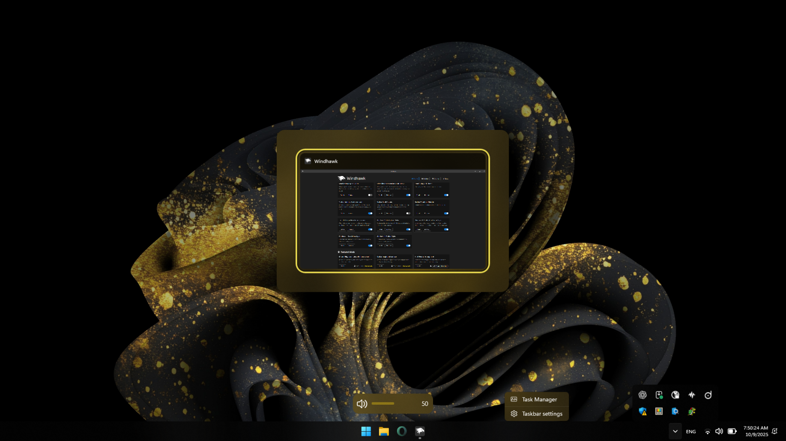

# Oversimplified&Accentuated Theme for Windows 11 Taskbar Styler

A cleaner, more refined Windows taskbar theme that removes unnecessary elements and offers better **Accent Color** integration.

> [!NOTE]
> This theme is optimized for Windows in **Dark Mode** and may not display correctly in **Light Mode**.

### ✨ Features
- Removed unnecessary text and lines
- Enlarged icons  
- Enhanced Accent Color presence (automatically updates with Windows Accent Color)  
- Improved transparency effects
- Takes fallback colors (colors in battery mode) into consideration

**Author**: [OsamaJT](https://github.com/OsamaHJT)



---

## 🎨 Elements Modified
- Taskbar
- Control Center icons in taskbar
- Hover Flyout for running applications
- Tray menu
- Tray menu icons
- Language popup
- Context menu
- Tooltip popup
- Active app indicators & progress bar in taskbar
- Volume & brightness popups
- Task switcher (Alt + Tab)  
- Task view (Windows + Tab)
  
---

## Theme selection

The theme is integrated into the mod and can be selected directly from the mod's
settings:

* Open the Windows 11 Taskbar Styler mod in Windhawk.
* Go to the "Settings" tab.
* Select the theme and save the settings.

## Manual installation

The theme styles can also be imported manually. To do that, follow these steps:

* Open the Windows 11 Taskbar Styler mod in Windhawk.
* Go to the "Settings" tab and select "Textual mode".
* Copy the content below to the text box and click "Save settings".

<details>
<summary>Content to import (click to expand)</summary>

```yaml
styleConstants:
  - Alt= <AcrylicBrush TintColor="{ThemeResource SystemAltHighColor}" TintOpacity="0.6" TintLuminosityOpacity="0.6" FallbackColor="{ThemeResource SystemAltHighColor}" />
  - Accent = <AcrylicBrush TintColor="{ThemeResource SystemAccentColor}" TintOpacity="0.6" TintLuminosityOpacity="0.6" FallbackColor="{ThemeResource SystemAccentColor}" />
  - DarkAccent = <AcrylicBrush TintColor="{ThemeResource SystemAccentColorDark1}" TintOpacity="0.6" TintLuminosityOpacity="0.3" FallbackColor="{ThemeResource SystemAccentColorDark1}" />
  - SolidAccent = <SolidColorBrush Color="{ThemeResource SystemAccentColor}" Opacity="1" />
  - Reveal= <RevealBorderBrush Color="Transparent" TargetTheme="1" Opacity="1" />
controlStyles:
  - target: MenuFlyoutPresenter
    styles:
      - Background:=$DarkAccent
      - BorderBrush=Transparent
      - Shadow:=
      - //Target= Context Menu
  - target: ToolTip > ContentPresenter#LayoutRoot
    styles:
      - Background:=$DarkAccent
      - BorderBrush=Transparent
      - Shadow:=
      - //Target= Tooltip Popup
  - target: Taskbar.TaskbarFrame > Grid#RootGrid > Taskbar.TaskbarBackground > Grid > Rectangle#BackgroundFill
    styles:
      - Fill:=$Alt
      - //Target= Taskbar
  - target: Rectangle#BackgroundStroke
    styles:
      - Visibility=Collapsed
      - //Target= Taskbar Upper Border
  - target: SystemTray.OmniButton#ControlCenterButton > Grid > ContentPresenter#ContentPresenter > ItemsPresenter > StackPanel > ContentPresenter > SystemTray.IconView#SystemTrayIcon > Grid#ContainerGrid > Grid#ContentGrid > SystemTray.TextIconContent > Grid#ContainerGrid > SystemTray.AdaptiveTextBlock#Base > TextBlock#InnerTextBlock
    styles:
      - FontSize=22
      - //Target= Taskbar > Control Center Taskbar icons
  - target: Taskbar.TaskListLabeledButtonPanel@RunningIndicatorStates > Rectangle#RunningIndicator
    styles:
      - Fill@ActiveRunningIndicator:=$SolidAccent
      - Height=4
      - Width@ActiveRunningIndicator=25
      - //Target= Taskbar > App Running Indicator
  - target: Taskbar.TaskListButton > Taskbar.TaskListLabeledButtonPanel > Microsoft.UI.Xaml.Controls.ProgressBar#ProgressIndicator
    styles:
      - MinHeight=4
      - Width=25
      - //Target= Taskbar > App Progress Bar > Track Container
  - target: Grid#LayoutRoot@CommonStates > Border#ProgressBarRoot > Border > Grid > Rectangle#DeterminateProgressBarIndicator
    styles:
      - Fill@Updating:= <SolidColorBrush Color="Green" Opacity="1" />
      - Fill@Determinate:= <SolidColorBrush Color="Green" Opacity="1" />
      - Fill@Paused:= <SolidColorBrush Color="Orange" Opacity="1" />
      - Fill@Error:= <SolidColorBrush Color="Red" Opacity="1" />
      - Fill@UpdatingError:= <SolidColorBrush Color="Red" Opacity="1" />
      - //Target= Taskbar > App Progress Bar > Fill Track
  - target: Rectangle#ProgressBarTrack
    styles:
      - Fill=Transparent
      - //Target= Taskbar > App Progress Bar > Empty Track
  - target: Canvas#HoverFlyoutCanvas > Grid#HoverFlyoutGrid > Border#HoverFlyoutBackground
    styles:
      - BorderBrush=Transparent
      - Shadow:=
      - //Target= Taskbar > Taskbar App  > HoverFlyout Background Container
  - target: Taskbar.TaskbarBackground#HoverFlyoutBackgroundControl > Grid > Windows.UI.Xaml.Shapes.Rectangle#BackgroundFill
    styles:
      - Fill:=$DarkAccent
      - //Target= Taskbar > Taskbar App  > HoverFlyout Background
  - target: Grid#OverflowRootGrid
    styles:
      - Padding:=
      - //Target= System Tray Menu Container
  - target: Border#OverflowFlyoutBackgroundBorder
    styles:
      - Background:=$Alt
      - Shadow:=
      - BorderThickness:=
      - //Target= System Tray Menu
  - target: SystemTray.ImageIconContent > Windows.UI.Xaml.Controls.Grid#ContainerGrid > Windows.UI.Xaml.Controls.Image
    styles:
      - Height=20
      - Width=20
      - //Target= System Tray icons
  - target: WindowsInternal.ComposableShell.Experiences.TextInput.Common.InputSwitcher > ContentControl > ContentPresenter > Grid
    styles:
      - Background:=$DarkAccent
      - BorderBrush=Transparent
      - Shadow:=
      - //Target= Language Popup
  - target: WindowsInternal.ComposableShell.Experiences.TextInput.Common.InputSwitcher > ContentControl > ContentPresenter > Grid > Grid#OverlayPanel
    styles:
      - Background=Transparent
      - BorderBrush=Transparent
      - //Target= Language Popup Overlay Layer
  - target: Grid > HyperlinkButton#Footer
    styles:
      - HorizontalContentAlignment = 1
      - //Target= Language Popup > Footer
  - target: Grid#ConfirmatorMainGrid
    styles:
      - Background:=$DarkAccent
      - BorderBrush=Transparent
      - CornerRadius=15
      - Margin=0,0,0,5
      - Padding=4,0,0,0
      - Shadow:=
      - //Target= Volume & Brightness Popups > Plate
  - target: Grid#BrightnessConfirmator
    styles:
      - Padding=6,0,16,0
      - //Target= Brigtness Popup Container
  - target: Microsoft.UI.Xaml.Controls.AnimatedIcon#BrightnessIcon
    styles:
      - Height=30
      - Width=30
      - Margin=0,-1,12,0
      - //Target= Brigtness Popup > Brightness icon
  - target: Microsoft.UI.Xaml.Controls.AnimatedIcon#VolumeIcon
    styles:
      - Height=30
      - Width=30
      - //Target= Volume Popup > Volume icon
  - target: TextBlock#volumeLevelText
    styles:
      - FontSize=15
      - //Target= Volume Popup > Volume Degree Text
  - target: Rectangle#HorizontalDecreaseRect
    styles:
      - Height=6
      - Margin= 0,2,0,0
      - //Target= Volume & Brightness Popups > Track Container
  - target: Rectangle#HorizontalTrackRect
    styles:
      - Fill=Transparent
      - Height=6
      - //Target= Volume & Brightness Popups > Empty Track
  - target: Grid#HorizontalTemplate > Rectangle#HorizontalDecreaseRect
    styles:
      - Fill:= <AcrylicBrush TintColor="{ThemeResource SystemAccentColor}" TintOpacity="1" TintLuminosityOpacity="1" FallbackColor="{ThemeResource SystemAccentColorDark2}" />
      - //Target= Volume & Brightness Popups > Fill Track
  - target: Grid#ModalRootGrid > Border#BackgroundElement
    styles:
      - Background:=$DarkAccent
      - BorderBrush=Transparent
      - CornerRadius=20
      - Shadow:=
      - //Target= Alt+Tab Window Background
  - target: Border#BackgroundDimmingLayer
    styles:
      - Background:= <WindhawkBlur BlurAmount="30" TintColor="#00000080" />
      - //Target= Task View Background (Windows+Tab)
  - target: Border#VirtualDesktopBarBackground
    styles:
      - Background:= <SolidColorBrush Color="{ThemeResource SystemAccentColorDark1}" Opacity="0.4" />
      - BorderBrush=Transparent
      - //Target= Task View (Windows+Tab) > Virtual Desktops Plate
```
</details>

### Modification notes

I added an extra comment line at the end of each style group to indicate the target object with common language.  
The aim is to make it easier to modify or debug the theme in the future.
