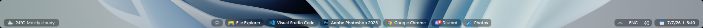
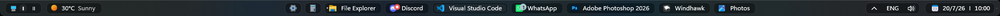
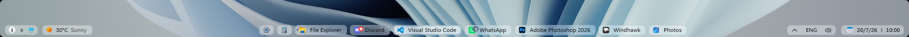
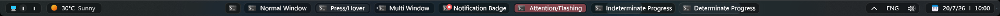
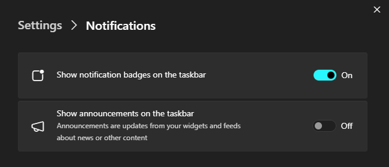
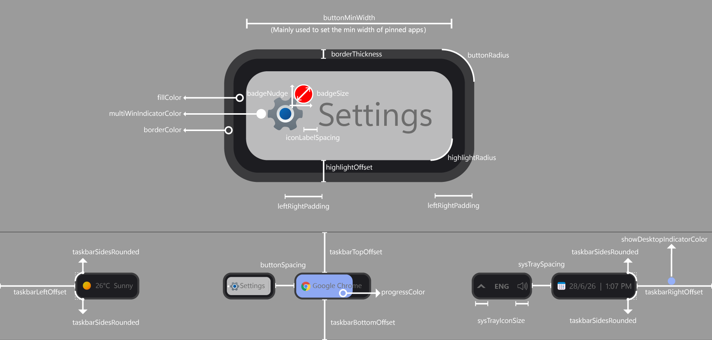

# Pills theme for Windows 11 Taskbar Styler

**Author**: [Deen-0x](https://github.com/Deen-0x)

Dark Mode



Light Mode



Pills. A sleek theme that turns taskbar buttons into labeled breathable pills. The design is aesthetically pleasing also when windows get maximized. Pill states have been meticulously targeted:



## Notes
- Designed on Windows 11 - 25H2 (OS Build 26200.8737).
- Settings: Search - Hide | Task view - Off  | Widgets - On | Taskbar alignment - Center.

  <details>
  <summary>Click to expand to view Taskbar Windows Settings</summary>

  
  </details>

  <details>
  <summary>Click to expand to view Widget Board Settings</summary>

  
  </details>

## Windhawk mods for similar results
Click each to expand settings:

  <details>
  <summary>Taskbar Height and Icon Size</summary>

  ```yaml
  TaskbarHeight: 32
  IconSize: 14
  TaskbarButtonWidth: 28
  IconSizeSmall: 14
  TaskbarButtonWidthSmall: 28
  ```
  </details>

  <details>
  <summary>Taskbar Labels for Windows 11</summary>

  ```yaml
  mode: labelsWithCombining
  taskbarItemWidth: 0
  runningIndicatorStyle: fullWidth
  progressIndicatorStyle: sameAsRunningIndicatorStyle
  excludedPrograms:
    - ''
  minimumTaskbarItemWidth: 40
  maximumTaskbarItemWidth: 200
  fontSize: 12
  fontFamily: ''
  textTrimming: characterEllipsis
  leftAndRightPaddingSize: 0
  spaceBetweenIconAndLabel: 0
  runningIndicatorHeight: -1
  runningIndicatorVerticalOffset: 0
  alwaysShowThumbnailLabels: 0
  labelForSingleItem: ''
  labelForMultipleItems: ''
  ```
  </details>

  <details>
  <summary>Taskbar Clock Customization</summary>

  ```yaml
  ShowSeconds: 0
  TimeFormat: ''
  DateFormat: d/M/y
  DateLocale: ''
  WeekdayFormat: custom
  WeekdayFormatCustom: Sun, Mon, Tue, Wed, Thu, Fri, Sat
  TopLine: ''
  BottomLine: '📅  %date% 〡 %time%'
  MiddleLine: '%weekday%'
  TooltipLine: '%web1_full%'
  TooltipLineMode: append
  Width: 180
  Height: 60
  MaxWidth: 0
  TextSpacing: 1
  DataCollection:
    NetworkMetricsFormat: mbs
    NetworkMetricsFixedDecimals: -1
    DiskMetricsFormat: ''
    DiskMetricsFixedDecimals: 0
    PercentageFormat: spacePaddingAndSymbol
    UpdateInterval: 1
    NetworkAdapterName: ''
    GpuAdapterName: ''
  MediaPlayer:
    IgnoredPlayers:
      - ''
    MaxLength: 28
    MediaInfoFormat: ''
    NoMediaText: No media
    RemoveBrackets: 0
  WebContentWeatherLocation: ''
  WebContentWeatherFormat: '%c 🌡️%t 🌬️%w'
  WebContentWeatherUnits: autoDetect
  WebContentsItems:
    - Url: https://rss.nytimes.com/services/xml/rss/nyt/World.xml
      BlockStart: <item>
      Start: <title>
      End: </title>
      ContentMode: xmlHtml
      SearchReplace:
        - Search: ''
          Replace: ''
      MaxLength: 28
  WebContentsUpdateInterval: 10
  TimeZones:
    - Eastern Standard Time
  TimeStyle:
    Hidden: 1
    TextColor: ''
    TextAlignment: Right
    FontSize: 0
    FontFamily: ''
    FontWeight: ''
    FontStyle: ''
    FontStretch: ''
    CharacterSpacing: 0
    LineHeight: 0
  DateStyle:
    Hidden: 0
    TextColor: ''
    TextAlignment: ''
    FontSize: 12
    FontFamily: ''
    FontWeight: Medium
    FontStyle: Normal
    FontStretch: ''
    CharacterSpacing: 0
    LineHeight: 0
  oldTaskbarOnWin11: 0
  ```
  </details>

  <details>
  <summary>Dynamic Taskbar Transparency</summary>

  ```yaml
  desktop:
    style: clear
  fallback:
    style: captured
  maximized:
    enabled: 1
    style: fallback
  startOpened:
    enabled: 0
    style: fallback
  searchOpened:
    enabled: 0
    style: fallback
  taskViewOpened:
    enabled: 0
    style: fallback
  trayFlyoutOpened:
    enabled: 0
    style: fallback
  otherInteraction:
    enabled: 0
    style: fallback
  animation:
    durationMs: 220
  detection:
    fullscreenAsMaximized: 1
  ```
  </details>

  <details>
  <summary>Taskbar tray system icon tweaks</summary>

  ```yaml
  hideVolumeIcon: 0
  hideNetworkIcon: 1
  hideBatteryIcon: 1
  grayscaleBatteryIcon: 0
  hideMicrophoneIcon: 0
  hideGeolocationIcon: 1
  hideStudioEffectsIcon: 0
  hideRecallIcon: 0
  hideLanguageBar: 0
  hideLanguageSupplementaryIcons: 1
  hideBellIcon: never
  showDesktopButtonWidth: 12
  ```
  </details>

## Recommended Windhawk mods

  <details>
  <summary>Taskbar Virtual Desktop Switcher</summary>

  ```yaml
  position: nextToStart
  gridMode: singleRow
  smartLayout: packHorizontal
  fillOrder: rowFirst
  buttonRows: 0
  buttonColumns: 0
  shortGroupAlign: center
  buttonWidth: 16
  buttonHeight: 16
  buttonSpacing: 5
  labelFormat: roman
  customLabels: ''
  fontSize: 12
  activeTextColor: ''
  inactiveTextColor: ''
  activeColor: ''
  inactiveColor: transparent
  hoverBackgroundColor: ''
  pressedBackgroundColor: ''
  borderColor: '#454545'
  borderThickness: 0
  cornerRadius: 10
  buttonOpacity: 100
  shineEffect: 0
  activeBold: 1
  paddingLeft: 12
  paddingRight: 8
  gridVerticalOffset: -4
  hideWhenSingle: 0
  multiMonitor: 1
  showMasterButton: 1
  masterButtonLabel: 🪟
  masterButtonPosition: before
  masterButtonHeight: 16
  masterButtonWidth: 18
  masterButtonSpacing: 0
  ```
  </details>

## Styling

To tweak styleConstants, you may use the illustration below as a guide:

  <details>
  <summary>styleConstants illustration</summary>

  
  </details>

## Theme selection

The theme is integrated into the mod and can be selected directly from the mod's
settings:

* Open the Windows 11 Taskbar Styler mod in Windhawk.
* Go to the "Settings" tab.
* Select the theme and save the settings.

## Manual installation

The theme styles can also be imported manually. To do that, follow these steps:

* Open the Windows 11 Taskbar Styler mod in Windhawk.
* Go to the "Settings" tab and select "Textual mode".
* Copy the content below to the text box and click "Save settings".

<details>
<summary>Content to import (click to expand)</summary>

```yaml
styleConstants:
  - taskbarLeftOffset = 12
  - taskbarRightOffset = 12
  - taskbarTopOffset = 4
  - taskbarBottomOffset = 4
  - borderThickness = 2
  - buttonRadius = 7
  - highlightRadius = 5
  - highlightOffset = 4
  - buttonMinWidth = 38
  - buttonSpacing = 6
  - sysTraySpacing = 6
  - iconLabelSpacing = 4
  - leftRightPadding = 8
  - badgeSize = 12
  - badgeNudge = 4,4,0,0
  - sysTrayIconSize = 16
  - taskbarSidesRounded = 1
  - fillColor = <WindhawkBlur BlurAmount="7" TintColor="{ThemeResource AdaptiveFill}" TintOpacity="{{0.2*(LabelsMod-1)}}" TintLuminosityOpacity="{{0.2*(LabelsMod-1)}}"/>
  - borderColor = <SolidColorBrush Color="{ThemeResource AdaptiveBorder}" Opacity="{{1*(LabelsMod-1)}}"/>
  - progressColor = <SolidColorBrush Color="{ThemeResource SystemAccentColor}" Opacity="0.2"/>
  - showDesktopIndicatorColor = <SolidColorBrush Color="{ThemeResource SystemAccentColor}" Opacity="0.7"/>
  - multiWinIndicatorColor = <SolidColorBrush Color="{ThemeResource AdaptiveIndicator}" Opacity="0.7"/>
controlStyles:
  - target: Taskbar.TaskListLabeledButtonPanel#IconPanel > Rectangle#RunningIndicator
    styles:
      - Grid.ColumnSpan => LabelsMod
      - // Running Indicator. Get Grid.ColumnSpan value (2 when Labels mod on | 1 when Labels mod off)
  - target: ScrollViewer > ScrollContentPresenter > Border > Grid > Taskbar.TaskbarFrame
    styles:
      - Height => TaskbarHeight
      - // Taskbar. Get height as a helper to calculate other elements' heights.
  - target: Taskbar.TaskListButton#TaskListButton > Taskbar.TaskListLabeledButtonPanel#IconPanel
    styles:
      - MinWidth := $buttonMinWidth
      - // Taskbar buttons min width
  - target: Taskbar.TaskListLabeledButtonPanel#IconPanel@RunningIndicatorStates > Border#BackgroundElement
    styles:
      - Background@ActiveRunningIndicator :=
      - Background@NoRunningIndicator := $fillColor
      - Height := {{TaskbarHeight-($taskbarBottomOffset+$taskbarTopOffset)-2*$highlightOffset}}
      - Height@NoRunningIndicator := {{TaskbarHeight-($taskbarBottomOffset+$taskbarTopOffset)}}
      - BorderThickness = 0
      - BorderThickness@NoRunningIndicator := $borderThickness
      - BorderBrush@NoRunningIndicator := $borderColor
      - CornerRadius@NoRunningIndicator := $buttonRadius
      - Margin := {{$highlightOffset}},{{$taskbarTopOffset-$highlightOffset}},{{$highlightOffset+2}},{{$taskbarBottomOffset-$highlightOffset}}
      - Margin@NoRunningIndicator := 0,{{$taskbarTopOffset-4}},2,{{$taskbarBottomOffset-4}}
      - CornerRadius := $highlightRadius
      - Canvas.ZIndex = 2
      - Canvas.ZIndex@NoRunningIndicator = -10
      - // The native highlighter. Border thickness set to zero for consistent behavior (in light mode the border is transparent).
  - target: Taskbar.TaskListLabeledButtonPanel#IconPanel@RunningIndicatorStates > Rectangle#RunningIndicator
    styles:
      - Opacity := {{LabelsMod-1}}
      - Opacity@NoRunningIndicator = 0
      - Height := {{TaskbarHeight-($taskbarBottomOffset+$taskbarTopOffset)}}
      - Margin := 0,{{$taskbarTopOffset-4}},0,{{$taskbarBottomOffset-4}}
      - RadiusX := $buttonRadius
      - RadiusY := $buttonRadius
      - StrokeThickness := $borderThickness
      - Fill := $fillColor
      - Stroke := $borderColor
      - Canvas.ZIndex = -10
      - // The running indicator functions as the background of taskbar buttons. Left and right margins must be zero to work along with the Labels mod.
  - target: Microsoft.UI.Xaml.Controls.ProgressBar#ProgressIndicator
    styles:
      - Opacity := {{LabelsMod-1}}
      - Height := {{TaskbarHeight-($taskbarBottomOffset+$taskbarTopOffset)}}
      - Margin = 0,{{$taskbarTopOffset-4}},0,{{$taskbarBottomOffset-4}}
      - // Same rule for progress indicator applies. Left and Right Margins must be zero to work along with the Labels mod.
  - target: Microsoft.UI.Xaml.Controls.ProgressBar#ProgressIndicator > Grid#LayoutRoot
    styles:
      - BorderThickness = 0
      - CornerRadius := $buttonRadius
      - Canvas.ZIndex = 1
      - // Progress indicator functions as the background of taskbar buttons in progress state.
  - target: Border#ProgressBarRoot > Border > Grid
    styles:
      - Height = Auto
      - // Progress bar Height set to Auto to cover the entire height.
  - target: Grid#LayoutRoot > Border#ProgressBarRoot > Border > Grid > Rectangle#ProgressBarTrack
    styles:
      - Fill = Transparent
  - target: Grid#LayoutRoot@CommonStates > Border#ProgressBarRoot > Border > Grid > Rectangle#DeterminateProgressBarIndicator
    styles:
      - StrokeThickness = 1
      - RadiusX := $buttonRadius
      - RadiusY := $buttonRadius
      - Fill := $progressColor
      - Fill@Paused := <SolidColorBrush Color="orange" Opacity="0.2"/>
      - // Determinate progress bar indicator (task progress indicator).
  - target: Grid#LayoutRoot@CommonStates > Border#ProgressBarRoot > Border > Grid > Rectangle#IndeterminateProgressBarIndicator
    styles:
      - StrokeThickness = 1
      - RadiusX := $buttonRadius
      - RadiusY := $buttonRadius
      - Fill := $progressColor
      - Fill@Paused := <SolidColorBrush Color="orange" Opacity="0.2"/>
      - // Indeterminate progress bar indicator (loading indicator).
  - target: Grid#LayoutRoot@CommonStates > Border#ProgressBarRoot > Border > Grid > Rectangle#IndeterminateProgressBarIndicator2
    styles:
      - StrokeThickness = 1
      - RadiusX := $buttonRadius
      - RadiusY := $buttonRadius
      - Fill := $progressColor
      - Fill@Paused := <SolidColorBrush Color="orange" Opacity="0.2"/>
      - // Indeterminate progress bar 2 indicator.
  - target: Border#MultiWindowElement
    styles:
      - Visibility := {{LabelsMod-1}}
      - Height := {{TaskbarHeight-($taskbarBottomOffset+$taskbarTopOffset)-2*$highlightOffset}}
      - // Multi window element shows when Labels mod is disabled (stock taskbar mode).
  - target: Taskbar.TaskListLabeledButtonPanel > TextBlock#LabelControl
    styles:
      - Margin := {{$iconLabelSpacing-6}},{{$taskbarTopOffset}},6,{{$taskbarBottomOffset}}
      - Padding := {{$leftRightPadding}},0
      - HorizontalAlignment = 1
      - VerticalAlignment = 1
      - RenderTransform := <TranslateTransform X="0" Y="-1" />
      - Canvas.ZIndex = 3
      - // Taskbar buttons labels
  - target: Taskbar.TaskListButton#TaskListButton
    styles:
      - Margin := {{($buttonSpacing-6)/2}},0,{{($buttonSpacing-6)/2}},0
      - // Taskbar buttons.
  - target: Taskbar.TaskListButton#TaskListButton > Taskbar.TaskListLabeledButtonPanel#IconPanel@CommonStates > Image#Icon
    styles:
      - Margin := {{8*(LabelsMod-1)}},{{$taskbarTopOffset}},{{2*(1-(LabelsMod-1))}},{{$taskbarBottomOffset}}
      - HorizontalAlignment = 1
      - Canvas.ZIndex = 3
      - RenderTransformOrigin = 0.5,0.5
      - RenderTransform@InactivePointerOver := <TransformGroup><ScaleTransform ScaleX = "0.9" ScaleY = "0.9" /></TransformGroup>
      - // Taskbar buttons icons.
  - target: Taskbar.TaskListLabeledButtonPanel@CommonStates > Rectangle#DefaultIcon
    styles:
      - Opacity := {{LabelsMod-1}}
      - Stretch = 2
      - Height = 3
      - Width = 3
      - Visibility = 1
      - Visibility@MultiWindowNormal = 0
      - Visibility@MultiWindowActive = 0
      - Visibility@MultiWindowPressed = 0
      - Visibility@MultiWindowPointerOver = 0
      - Visibility@RequestingAttentionMulti = 0
      - Visibility@RequestingAttentionMultiPointerOver = 0
      - Visibility@RequestingAttentionMultiPressed = 0
      - Fill := $multiWinIndicatorColor
      - RadiusX = 2
      - RadiusY = 2
      - StrokeThickness = 0
      - Margin = 0,0,14,0
      - Canvas.ZIndex = 4
      - // Multi window element (taskbar button rectangle of default icon styled as a dot).
  - target: Taskbar.TaskbarExtensionElement
    styles:
      - Visibility = Collapsed
      - // Search box hidden.
  - target: Taskbar.ExperienceToggleButton#LaunchListButton > Taskbar.TaskListButtonPanel#ExperienceToggleButtonRootPanel
    styles:
      - Width = 1
      - Height = 0
      - // Windows Start button hidden using small width and zero height (a method to prevent language flyout displacement bug).
  - target: Taskbar.TaskListLabeledButtonPanel#IconPanel > Image#OverlayIcon
    styles:
      - Opacity := {{LabelsMod-1}}
      - Width := $badgeSize
      - Height := $badgeSize
      - Margin := $badgeNudge
      - Canvas.ZIndex = 3
      - // Badge indicator for specific apps.
  - target: Taskbar.TaskListLabeledButtonPanel#IconPanel > Taskbar.Badge#BadgeControl
    styles:
      - Opacity := {{LabelsMod-1}}
      - MinWidth := $badgeSize
      - Width := $badgeSize
      - Height := $badgeSize
      - Margin := $badgeNudge
      - Canvas.ZIndex = 3
      - // Badge indicator for specific apps.
  - target: Taskbar.TaskListLabeledButtonPanel#IconPanel > Taskbar.Badge#BadgeControl > Grid > TextBlock#BadgeText
    styles:
      - FontSize = 8
      - HorizontalAlignment = 1
      - // Label of badge indicator for specific apps.
  - target: SystemTray.SystemTrayFrame > Grid#SystemTrayFrameGrid > SystemTray.OmniButton#NotificationCenterButton
    styles:
      - Margin := 0,0,{{$taskbarRightOffset-12}},0
      - // System tray notification area (right margin minus 12 to compensate for the default "show desktop" indicator width).
  - target: SystemTray.SystemTrayFrame > Grid#SystemTrayFrameGrid > SystemTray.OmniButton#NotificationCenterButton > Grid > ContentPresenter#ContentPresenter > ItemsPresenter > StackPanel
    styles:
      - Padding = 2,0
      - // System tray notification area
  - target: SystemTray.SystemTrayFrame > Grid#SystemTrayFrameGrid > SystemTray.OmniButton#NotificationCenterButton > Grid
    styles:
      - Margin := {{$sysTraySpacing}},{{$taskbarTopOffset}},0,{{$taskbarBottomOffset}}
      - Padding := {{-$borderThickness}}
      - CornerRadius := {{$buttonRadius}},{{$buttonRadius*$taskbarSidesRounded}},{{$buttonRadius*$taskbarSidesRounded}},{{$buttonRadius}}
      - BorderThickness := $borderThickness
      - Background := $fillColor
      - BorderBrush := $borderColor
      - // System tray date & time background.
  - target: SystemTray.OmniButton#NotificationCenterButton > Grid > Border#BackgroundBorder
    styles:
      - Margin := {{$highlightOffset}}
      - CornerRadius := $highlightRadius
      - BorderThickness = 0
      - // System tray date & time highlight.
  - target: SystemTray.IconView#SystemTrayIcon > Grid#ContainerGrid > Border#BackgroundBorder
    styles:
      - Margin := {{$highlightOffset}}
      - CornerRadius := $highlightRadius
      - BorderThickness = 0
      - // System tray language indicator's highlight.
  - target: SystemTray.ChevronIconView > Grid#ContainerGrid > Border#BackgroundBorder
    styles:
      - Margin := {{$highlightOffset}}
      - CornerRadius := $highlightRadius
      - BorderThickness = 0
      - // System tray overflow indicator's highlight.
  - target: SystemTray.OmniButton#ControlCenterButton > Grid > Border#BackgroundBorder
    styles:
      - Margin := {{$highlightOffset}}
      - CornerRadius := $highlightRadius
      - BorderThickness = 0
      - // System tray control center highlight.
  - target: SystemTray.NotifyIconView#NotifyItemIcon > Grid#ContainerGrid > Border#BackgroundBorder
    styles:
      - Margin := {{$highlightOffset}}
      - CornerRadius := $highlightRadius
      - BorderThickness = 0
      - // System tray notification area icons' highlight.
  - target: SystemTray.OmniButton#NotificationCenterButton > Grid > ContentPresenter#ContentPresenter
    styles:
      - Margin = 0,0,0,1
      - // System tray date & time label (position refinement).
  - target: SystemTray.SystemTrayFrame > Grid#SystemTrayFrameGrid > SystemTray.OmniButton#ControlCenterButton > Grid
    styles:
      - Margin := 0,{{$taskbarTopOffset}},0,{{$taskbarBottomOffset}}
      - Padding := {{-$borderThickness}}
      - CornerRadius := 0,$buttonRadius,$buttonRadius,0
      - BorderThickness := 0,$borderThickness,$borderThickness,$borderThickness
      - Background := $fillColor
      - BorderBrush := $borderColor
      - // System tray control center background.
  - target: SystemTray.SystemTrayFrame > Grid#SystemTrayFrameGrid > SystemTray.Stack#MainStack > Grid#Content
    styles:
      - Margin := 0,{{$taskbarTopOffset}},0,{{$taskbarBottomOffset}}
      - Padding := {{-$borderThickness}}
      - BorderThickness := 0,$borderThickness,0,$borderThickness
      - Background := $fillColor
      - BorderBrush := $borderColor
      - // System tray main stack background.
  - target: SystemTray.SystemTrayFrame > Grid#SystemTrayFrameGrid > SystemTray.Stack#NonActivatableStack > Grid#Content
    styles:
      - Margin := 0,{{$taskbarTopOffset}},0,{{$taskbarBottomOffset}}
      - Padding := {{-$borderThickness}}
      - BorderThickness := 0,$borderThickness,0,$borderThickness
      - Background := $fillColor
      - BorderBrush := $borderColor
      - // System tray language indicator's background
  - target: SystemTray.SystemTrayFrame > Grid#SystemTrayFrameGrid > SystemTray.NotificationAreaIcons#NotificationAreaIcons > ItemsPresenter > StackPanel
    styles:
      - Margin := 0,{{$taskbarTopOffset}},0,{{$taskbarBottomOffset}}
      - Padding := {{-$borderThickness}}
      - BorderThickness := 0,$borderThickness,0,$borderThickness
      - Background := $fillColor
      - BorderBrush := $borderColor
      - // System tray notification area icons' background.
  - target: SystemTray.Stack#NotifyIconStack > Grid#Content > SystemTray.StackListView#IconStack > ItemsPresenter > StackPanel > ContentPresenter
    styles:
      - Margin := 0,{{$taskbarTopOffset}},0,{{$taskbarBottomOffset}}
      - Padding := {{-$borderThickness}}
      - BorderThickness := $borderThickness,$borderThickness,0,$borderThickness
      - Background := $fillColor
      - CornerRadius := $buttonRadius,0,0,$buttonRadius
      - BorderBrush := $borderColor
      - // System tray overflow indicator's highlight.
  - target: SystemTray.TextIconContent > Grid#ContainerGrid > SystemTray.AdaptiveTextBlock#Base > TextBlock#InnerTextBlock
    styles:
      - FontSize := $sysTrayIconSize
      - // System tray icons size.
  - target: SystemTray.ImageIconContent > Grid#ContainerGrid > Image
    styles:
      - Width := $sysTrayIconSize
      - Height := $sysTrayIconSize
      - // System tray apps icons size.
  - target: SystemTray.AdaptiveTextBlock#LanguageInnerTextBlock > TextBlock#InnerTextBlock
    styles:
      - Margin = 0,0,0,2.5
      - MaxLines = 1
      - // System tray language indicator position refinement and restricting it to one line (in the case of 2 lines "ENG US").
  - target: Grid#OverflowRootGrid > Border
    styles:
      - Shadow :=
      - // System tray overflow flyout background.
  - target: Taskbar.AugmentedEntryPointButton#AugmentedEntryPointButton > Taskbar.TaskListButtonPanel#ExperienceToggleButtonRootPanel > Grid#AugmentedEntryPointContentGrid > Grid > Grid > AdaptiveCards.Rendering.Uwp.WholeItemsPanel > Border > AdaptiveCards.Rendering.Uwp.WholeItemsPanel > Grid > Border#LargeTicker2 > AdaptiveCards.Rendering.Uwp.WholeItemsPanel > TextBlock[1]
    styles:
      - ActualWidth => WeatherTempWidth
      - RenderTransform := <TranslateTransform X="0" Y="{{8*(LabelsMod-1)}}" />
      - // Weather widget's temperature text block.
  - target: Taskbar.AugmentedEntryPointButton#AugmentedEntryPointButton > Taskbar.TaskListButtonPanel#ExperienceToggleButtonRootPanel > Grid#AugmentedEntryPointContentGrid > Grid > Grid > AdaptiveCards.Rendering.Uwp.WholeItemsPanel > Border > AdaptiveCards.Rendering.Uwp.WholeItemsPanel > Grid > Border#LargeTicker2 > AdaptiveCards.Rendering.Uwp.WholeItemsPanel > TextBlock[2]
    styles:
      - ActualWidth => WeatherCondWidth
      - RenderTransform := <TranslateTransform X="{{(WeatherTempWidth+8)*(LabelsMod-1)}}" Y="{{-8*(LabelsMod-1)}}" />
      - // Weather widget's weather condition text block.
  - target: Taskbar.TaskListButtonPanel#ExperienceToggleButtonRootPanel > Grid#AugmentedEntryPointContentGrid
    styles:
      - Width := {{WeatherCondWidth+WeatherTempWidth+52}}
      - HorizontalAlignment = 0
      - // Weather widget content grid.
  - target: Grid#AugmentedEntryPointContentGrid
    styles:
      - Margin = {{6*(LabelsMod-1)}},0,0,2
      - // Weather widget content grid.
  - target: Taskbar.AugmentedEntryPointButton#AugmentedEntryPointButton > Taskbar.TaskListButtonPanel#ExperienceToggleButtonRootPanel > Grid#AugmentedEntryPointContentGrid > Grid > Grid > AdaptiveCards.Rendering.Uwp.WholeItemsPanel
    styles:
      - Margin := 0,{{$highlightOffset}},0,{{$highlightOffset}}
      - // Weather widget content grid panel.
  - target: Taskbar.AugmentedEntryPointButton#AugmentedEntryPointButton > Taskbar.TaskListButtonPanel#ExperienceToggleButtonRootPanel
    styles:
      - Width := {{WeatherCondWidth+WeatherTempWidth+52}}
      - Height = Auto
      - Margin := {{$taskbarLeftOffset}},{{$taskbarTopOffset}},56,{{$taskbarBottomOffset}}
      - Padding = 0
      - CornerRadius := {{$buttonRadius*$taskbarSidesRounded}},{{$buttonRadius}},{{$buttonRadius}},{{$buttonRadius*$taskbarSidesRounded}}
      - BorderThickness := $borderThickness
      - Background := $fillColor
      - BorderBrush := $borderColor
      - // Weather widget's background (width is adaptive to the sum of weather temperature and condition text blocks widths).
  - target: Taskbar.AugmentedEntryPointButton#AugmentedEntryPointButton > Taskbar.TaskListButtonPanel#ExperienceToggleButtonRootPanel > Border#BackgroundElement
    styles:
      - CornerRadius := $highlightRadius
      - Margin := {{$highlightOffset}}
      - BorderThickness = 0
      - // Weather widget's highlight.
  - target: ScrollViewer > ScrollContentPresenter > Border > Grid > Taskbar.TaskbarFrame > Grid#RootGrid > Microsoft.UI.Xaml.Controls.ItemsRepeater#TaskbarFrameRepeater > Taskbar.AugmentedEntryPointButton#AugmentedEntryPointButton > Taskbar.TaskListButtonPanel#ExperienceToggleButtonRootPanel > Grid#AugmentedEntryPointContentGrid > Grid > Grid[1]
    styles:
      - HorizontalAlignment = 0
      - Margin = 4,0,0,0
      - // Weather widget grid 1 (when overflow).
  - target: ScrollViewer > ScrollContentPresenter > Border > Grid > Taskbar.TaskbarFrame > Grid#RootGrid > Microsoft.UI.Xaml.Controls.ItemsRepeater#TaskbarFrameRepeater > Taskbar.AugmentedEntryPointButton#AugmentedEntryPointButton > Taskbar.TaskListButtonPanel#ExperienceToggleButtonRootPanel > Grid#AugmentedEntryPointContentGrid > Grid > Grid[2]
    styles:
      - HorizontalAlignment = 0
      - VerticalAlignment = 0
      - RenderTransformOrigin = -0.5,0.5
      - RenderTransform := <TransformGroup><ScaleTransform ScaleX = "0.75" ScaleY = "0.75" /><TranslateTransform X="16" Y="0" /></TransformGroup>
      - // Weather widget grid 2 (when overflow).
  - target: ScrollViewer > ScrollContentPresenter > Border > Grid > Taskbar.TaskbarFrame > Grid#RootGrid > Microsoft.UI.Xaml.Controls.ItemsRepeater#TaskbarFrameRepeater > Taskbar.AugmentedEntryPointButton#AugmentedEntryPointButton > Taskbar.TaskListButtonPanel#ExperienceToggleButtonRootPanel > Grid#AugmentedEntryPointContentGrid > Grid > Grid > AdaptiveCards.Rendering.Uwp.WholeItemsPanel > Border > AdaptiveCards.Rendering.Uwp.WholeItemsPanel > Grid
    styles:
      - Background = Transparent
      - // Weather widget temperature background (when overflow).
  - target: WindowsInternal.ComposableShell.Experiences.TextInput.Common.InputSwitcher > ContentControl > ContentPresenter > Grid
    styles:
      - Shadow :=
      - // Language flyout.
  - target: Grid#ContainerGrid@ > Rectangle#ShowDesktopPipe
    styles:
      - Opacity := {{LabelsMod-1}}
      - Width = 4
      - Height = 4
      - Height@PointerOver = 10
      - Height@Pressed = 6
      - RadiusX = 2
      - RadiusY = 2
      - Fill := $showDesktopIndicatorColor
      - // Show desktop pipe.
  - target: Taskbar.TaskListButtonPanel#OverflowToggleButtonRootPanel
    styles:
      - Margin := 0,{{$taskbarTopOffset}},0,{{$taskbarBottomOffset}}
      - Padding = 0
      - Background := $fillColor
      - CornerRadius := 0,{{$buttonRadius}},{{$buttonRadius}},0
      - BorderThickness := 0,{{$borderThickness}},{{$borderThickness}},{{$borderThickness}}
      - BorderBrush := $borderColor
      - // Overflow button
  - target: Taskbar.TaskListButtonPanel#OverflowToggleButtonRootPanel > Border#BackgroundElement
    styles:
      - Margin := {{$highlightOffset}}
      - BorderThickness = 0
      - CornerRadius := $highlightRadius
      - // Overflow button background
  - target: Grid#VdSwitcherBar
    styles:
      - Padding = 8,1,6,0
      - Height = 24
      - BorderThickness := $borderThickness
      - CornerRadius := $buttonRadius
      - Background := $fillColor
      - BorderBrush := $borderColor
      - // Taskbar Virtual Desktop Switcher.
  - target: Grid#VdSwitcherBar > Button > ContentPresenter@CommonStates
    styles:
      - BorderThickness = 0
      - // Taskbar Virtual Desktop Switcher button.
  - target: ScrollViewer > ScrollContentPresenter > Border > Taskbar.FlyoutFrame > Canvas#HoverFlyoutCanvas > Grid#HoverFlyoutGrid > Border#HoverFlyoutBackground
    styles:
      - Shadow :=
      - // Overflow flyout
  - target: Microsoft.UI.Xaml.Controls.ItemsRepeater#OverflowFlyoutListRepeater > Taskbar.TaskListButton#TaskListButton > Taskbar.TaskListLabeledButtonPanel#IconPanel
    styles:
      - MinWidth = 28
      - // Buttons in overflow flyout
  - target: ScrollContentPresenter > Border > Taskbar.FlyoutFrame > Canvas#HoverFlyoutCanvas > Grid#HoverFlyoutGrid > ContentPresenter#HoverFlyoutContent > Taskbar.OverflowFlyoutList > ScrollViewer#OverflowScrollView > Border#Root > Grid > ScrollContentPresenter#ScrollContentPresenter > Microsoft.UI.Xaml.Controls.ItemsRepeater#OverflowFlyoutListRepeater > Taskbar.TaskListButton#TaskListButton > Taskbar.TaskListLabeledButtonPanel#IconPanel > Image#Icon
    styles:
      - Margin = 0
  - target: ScrollViewer > ScrollContentPresenter > Border > Taskbar.FlyoutFrame > Canvas#HoverFlyoutCanvas > Grid#HoverFlyoutGrid > ContentPresenter#HoverFlyoutContent > Taskbar.OverflowFlyoutList > ScrollViewer#OverflowScrollView > Border#Root > Grid > ScrollContentPresenter#ScrollContentPresenter > Microsoft.UI.Xaml.Controls.ItemsRepeater#OverflowFlyoutListRepeater > Taskbar.TaskListButton#TaskListButton > Taskbar.TaskListLabeledButtonPanel#IconPanel > Border#BackgroundElement
    styles:
      - Margin = 0
      - // Buttons background in overflow flyout
  - target: Microsoft.UI.Xaml.Controls.ItemsRepeater#OverflowFlyoutListRepeater > Taskbar.TaskListButton#TaskListButton > Taskbar.TaskListLabeledButtonPanel#IconPanel > Rectangle#RunningIndicator
    styles:
      - Opacity = 0
      - // Multi window indicator in overflow flyout
themeResourceVariables:
  - AdaptiveFill@Light =#FFFFFF
  - AdaptiveFill@Dark =#000000
  - AdaptiveBorder@Light =#90B4B4B4
  - AdaptiveBorder@Dark =#90454545
  - AdaptiveIndicator@Light =#000000
  - AdaptiveIndicator@Dark =#FFFFFF
```
</details>
