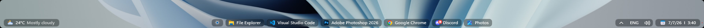
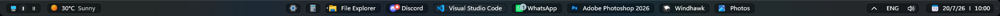
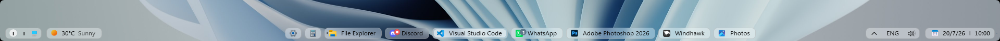
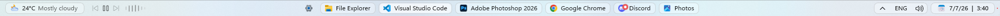
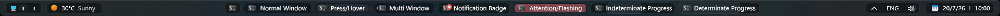
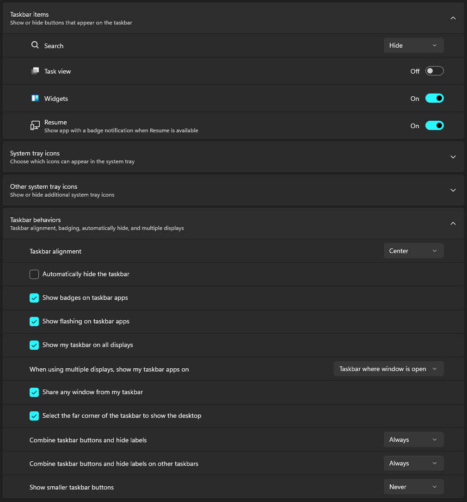
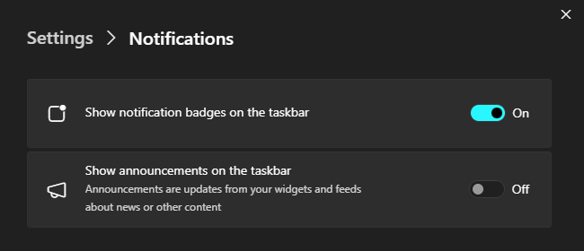
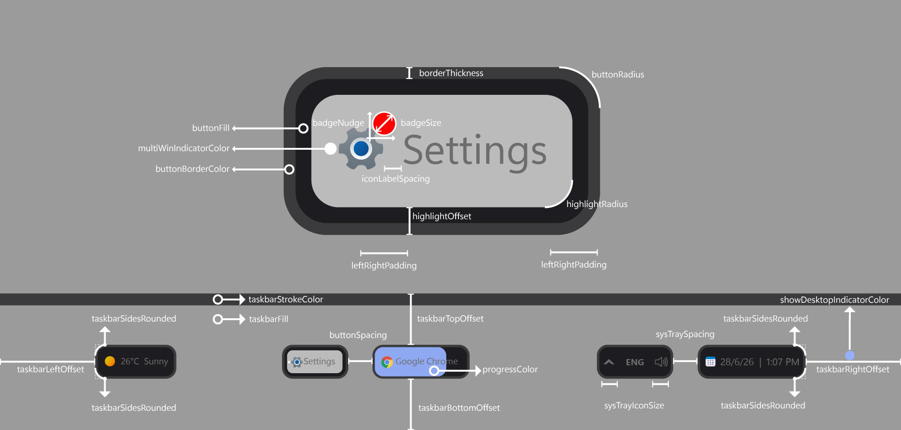

# Pills theme for Windows 11 Taskbar Styler

**Author**: [Deen-0x](https://github.com/Deen-0x)

Dark Mode



Light Mode



Pills. A sleek theme that turns taskbar buttons into labeled breathable pills. The design is aesthetically pleasing also when windows get maximized. Pill states have been meticulously targeted:



## Notes
- Designed on Windows 11 - 25H2 (OS Build 26200.8737).
- Settings: Search - Hide | Task view - Off  | Widgets - On | Taskbar alignment - Center.

  <details>
  <summary>Click to expand to view Taskbar Windows Settings</summary>

  
  </details>

  <details>
  <summary>Click to expand to view Widget Board Settings</summary>

  
  </details>

## Windhawk mods for similar results
Click each to expand settings:

  <details>
  <summary>Taskbar Clock Customization</summary>

  ```yaml
  ShowSeconds: 0
  TimeFormat: ''
  DateFormat: d/M/y
  DateLocale: ''
  WeekdayFormat: custom
  WeekdayFormatCustom: Sun, Mon, Tue, Wed, Thu, Fri, Sat
  TopLine: ''
  BottomLine: '📅  %date% 〡 %time%'
  MiddleLine: '%weekday%'
  TooltipLine: '%web1_full%'
  TooltipLineMode: append
  Width: 180
  Height: 60
  MaxWidth: 0
  TextSpacing: 1
  DataCollection:
    NetworkMetricsFormat: mbs
    NetworkMetricsFixedDecimals: -1
    DiskMetricsFormat: ''
    DiskMetricsFixedDecimals: 0
    PercentageFormat: spacePaddingAndSymbol
    UpdateInterval: 1
    NetworkAdapterName: ''
    GpuAdapterName: ''
  MediaPlayer:
    IgnoredPlayers:
      - ''
    MaxLength: 28
    MediaInfoFormat: ''
    NoMediaText: No media
    RemoveBrackets: 0
  WebContentWeatherLocation: ''
  WebContentWeatherFormat: '%c 🌡️%t 🌬️%w'
  WebContentWeatherUnits: autoDetect
  WebContentsItems:
    - Url: https://rss.nytimes.com/services/xml/rss/nyt/World.xml
      BlockStart: <item>
      Start: <title>
      End: </title>
      ContentMode: xmlHtml
      SearchReplace:
        - Search: ''
          Replace: ''
      MaxLength: 28
  WebContentsUpdateInterval: 10
  TimeZones:
    - Eastern Standard Time
  TimeStyle:
    Hidden: 1
    TextColor: ''
    TextAlignment: Right
    FontSize: 0
    FontFamily: ''
    FontWeight: ''
    FontStyle: ''
    FontStretch: ''
    CharacterSpacing: 0
    LineHeight: 0
  DateStyle:
    Hidden: 0
    TextColor: ''
    TextAlignment: ''
    FontSize: 12
    FontFamily: ''
    FontWeight: Medium
    FontStyle: Normal
    FontStretch: ''
    CharacterSpacing: 0
    LineHeight: 0
  oldTaskbarOnWin11: 0
  ```
  </details>
  
  <details>
  <summary>Taskbar Height and Icon Size</summary>

  ```yaml
  TaskbarHeight: 32
  IconSize: 14
  TaskbarButtonWidth: 28
  IconSizeSmall: 14
  TaskbarButtonWidthSmall: 28
  ```
  </details>
  
  <details>
  <summary>Dynamic Taskbar Transparency</summary>

  ```yaml
  desktop:
    style: clear
  fallback:
    style: captured
  maximized:
    enabled: 1
    style: fallback
  startOpened:
    enabled: 0
    style: fallback
  searchOpened:
    enabled: 0
    style: fallback
  taskViewOpened:
    enabled: 0
    style: fallback
  trayFlyoutOpened:
    enabled: 0
    style: fallback
  otherInteraction:
    enabled: 0
    style: fallback
  animation:
    durationMs: 220
  detection:
    fullscreenAsMaximized: 1
  ```
  </details>
  
## Recommended Windhawk mods

  <details>
  <summary>Taskbar Labels for Windows 11</summary>

  ```yaml
  mode: labelsWithCombining
  taskbarItemWidth: 0
  runningIndicatorStyle: fullWidth
  progressIndicatorStyle: sameAsRunningIndicatorStyle
  excludedPrograms:
    - ''
  minimumTaskbarItemWidth: 40
  maximumTaskbarItemWidth: 200
  fontSize: 12
  fontFamily: ''
  textTrimming: characterEllipsis
  leftAndRightPaddingSize: 0
  spaceBetweenIconAndLabel: 24
  runningIndicatorHeight: -1
  runningIndicatorVerticalOffset: 0
  alwaysShowThumbnailLabels: 0
  labelForSingleItem: ''
  labelForMultipleItems: ''
  ```
  </details>

  <details>
  <summary>Taskbar tray system icon tweaks</summary>

  ```yaml
  hideVolumeIcon: 0
  hideNetworkIcon: 1
  hideBatteryIcon: 1
  grayscaleBatteryIcon: 0
  hideMicrophoneIcon: 0
  hideGeolocationIcon: 1
  hideStudioEffectsIcon: 0
  hideRecallIcon: 0
  hideLanguageBar: 0
  hideLanguageSupplementaryIcons: 1
  hideBellIcon: never
  showDesktopButtonWidth: 12
  ```
  </details>
  <details>
  <summary>Taskbar Virtual Desktop Switcher</summary>

  ```yaml
  position: nextToStart
  gridMode: singleRow
  smartLayout: packHorizontal
  fillOrder: rowFirst
  buttonRows: 0
  buttonColumns: 0
  shortGroupAlign: center
  buttonWidth: 16
  buttonHeight: 16
  buttonSpacing: 5
  labelFormat: roman
  customLabels: ''
  fontSize: 12
  activeTextColor: ''
  inactiveTextColor: ''
  activeColor: ''
  inactiveColor: transparent
  hoverBackgroundColor: ''
  pressedBackgroundColor: ''
  borderColor: '#454545'
  borderThickness: 0
  cornerRadius: 10
  buttonOpacity: 100
  shineEffect: 0
  activeBold: 1
  paddingLeft: 12
  paddingRight: 8
  gridVerticalOffset: -4
  hideWhenSingle: 0
  multiMonitor: 1
  showMasterButton: 1
  masterButtonLabel: 🪟
  masterButtonPosition: before
  masterButtonHeight: 16
  masterButtonWidth: 18
  masterButtonSpacing: 0
  ```
  </details>

## Styling

To tweak styleConstants, you may use the illustration below as a guide:

  <details>
  <summary>styleConstants illustration</summary>

  
  </details>

## Theme selection

The theme is integrated into the mod and can be selected directly from the mod's
settings:

* Open the Windows 11 Taskbar Styler mod in Windhawk.
* Go to the "Settings" tab.
* Select the theme and save the settings.

## Manual installation

The theme styles can also be imported manually. To do that, follow these steps:

* Open the Windows 11 Taskbar Styler mod in Windhawk.
* Go to the "Settings" tab and select "Textual mode".
* Copy the content below to the text box and click "Save settings".

<details>
<summary>Content to import (click to expand)</summary>

```yaml
styleConstants:
  - taskbarLeftOffset = 12
  - taskbarRightOffset = 12
  - taskbarTopOffset = 4
  - taskbarBottomOffset = 4
  - borderThickness = 2
  - buttonRadius = 7
  - highlightRadius = 5
  - highlightOffset = 4
  - buttonSpacing = 6
  - sysTraySpacing = 6
  - iconLabelSpacing = 10
  - leftRightPadding = 8
  - badgeSize = 12
  - badgeNudge = 12,4,0,0
  - sysTrayIconSize = 16
  - taskbarSidesRounded = 1
  - buttonFill = <WindhawkBlur BlurAmount="7" TintColor="{ThemeResource AdaptiveFill}" TintOpacity="0.2" TintLuminosityOpacity="0.2"/>
  - buttonBorderColor = <SolidColorBrush Color="{ThemeResource AdaptiveBorder}" Opacity="1"/>
  - taskbarFill = {{__unset}}
  - taskbarStrokeColor = {{__unset}}
  - progressColor = <SolidColorBrush Color="{ThemeResource SystemAccentColor}" Opacity="0.2"/>
  - showDesktopIndicatorColor = <SolidColorBrush Color="{ThemeResource SystemAccentColor}" Opacity="0.7"/>
  - multiWinIndicatorColor = <SolidColorBrush Color="{ThemeResource AdaptiveIndicator}" Opacity="0.7"/>
controlStyles:
  - target: Taskbar.TaskListButton#TaskListButton
    styles:
      - ActualWidth => BtnW
      - // Capture only, no styling.
  - target: Taskbar.TaskbarBackground#BackgroundControl > Grid > Rectangle#BackgroundFill
    styles:
      - Fill := $taskbarFill
      - // Taskbar background. $taskbarFill is {{__unset}} on purpose, which will bind it to a variable that is unset,
      - // and so only this style will be skipped leaving the background color as native Windows.
      - // Set the constant to a brush to give the taskbar background its own fill.
  - target: Taskbar.TaskbarBackground#BackgroundControl > Grid > Rectangle#BackgroundStroke
    styles:
      - Fill := $taskbarStrokeColor
      - // Taskbar Stroke. $taskbarStrokeColor is {{__unset}} on purpose, which will bind it to a variable that is unset,
      - // and so only this style will be skipped leaving the stroke color as native Windows.
      - // Set the constant to a brush to give the stroke background its own fill.
  - target: ScrollViewer > ScrollContentPresenter > Border > Grid > Taskbar.TaskbarFrame
    styles:
      - Height => TaskbarHeight
      - // Taskbar frame. Capture only. TaskbarHeight feeds the height math for the pill, the running
      - // indicator and the progress bar below.
  - target: Taskbar.TaskListLabeledButtonPanel#IconPanel@RunningIndicatorStates > Border#BackgroundElement
    styles:
      - Height := {{TaskbarHeight-($taskbarBottomOffset+$taskbarTopOffset)-2*($highlightOffset)}}
      - Height@NoRunningIndicator := {{TaskbarHeight-($taskbarBottomOffset+$taskbarTopOffset)}}
      - Margin := {{$highlightOffset}},{{($taskbarTopOffset-$taskbarBottomOffset)/2-2}},{{$highlightOffset+2}},{{($taskbarBottomOffset-$taskbarTopOffset)/2-2}}
      - Margin@NoRunningIndicator := 0,{{$taskbarTopOffset-4}},2,{{$taskbarBottomOffset-4}}
      - Background@ActiveRunningIndicator :=
      - Background@NoRunningIndicator := $buttonFill
      - BorderThickness = 0
      - BorderThickness@NoRunningIndicator := $borderThickness
      - BorderBrush@NoRunningIndicator := $buttonBorderColor
      - CornerRadius@NoRunningIndicator := $buttonRadius
      - CornerRadius := $highlightRadius
      - Canvas.ZIndex = 2
      - Canvas.ZIndex@NoRunningIndicator = -10
      - // The native highlighter, doing double duty. For a running app it stays an inset
      - // highlight on top of the pill (z-index 2). For a pinned idle app there is no
      - // Rectangle#RunningIndicator to act as the pill, so NoRunningIndicator turns this element
      - // into the pill itself, dropping it to z-index -10 and taking the fill, border and radius.
      - // The vertical margin terms recentre the highlight when $taskbarTopOffset and
      - // $taskbarBottomOffset differ; with equal offsets they both resolve to -2.
      - // ActiveRunningIndicator is nulled so the active pill shows through unobstructed.
      - // Border thickness is zeroed for consistent behavior (in light mode the native border is transparent).
  - target: Taskbar.TaskListLabeledButtonPanel#IconPanel@CommonStates > Border#BackgroundElement
    styles:
      - Opacity = 1
      - Opacity@InactiveNormal = 1
      - // The two rules touch disjoint properties on purpose. Keep it that way, since precedence
      - // between two state groups on one element is not something to rely on.
  - target: Taskbar.TaskListLabeledButtonPanel#IconPanel@RunningIndicatorStates > Rectangle#RunningIndicator
    styles:
      - Opacity = 1
      - Opacity@NoRunningIndicator = 0
      - MinWidth = {{BtnW-6}}
      - MaxWidth = {{BtnW-6}}
      - HorizontalAlignment = 0
      - Grid.ColumnSpan = 2
      - Height := {{TaskbarHeight-($taskbarBottomOffset+$taskbarTopOffset)}}
      - Margin := 0,{{$taskbarTopOffset-4}},0,{{$taskbarBottomOffset-4}}
      - RadiusX := $buttonRadius
      - RadiusY := $buttonRadius
      - StrokeThickness := $borderThickness
      - Fill := $buttonFill
      - Stroke := $buttonBorderColor
      - Canvas.ZIndex = -10
      - // The running indicator is repurposed as the pill background for running apps, which
      - // sidesteps the layout constraints on the native highlight element.
      - // Left and right margins must stay zero for this to work.
      - // The -4 terms are the stock offsets, so $taskbarTopOffset = 4 means "no change".
      - // The pill spans the button because MinWidth/MaxWidth track the captured BtnW.
  - target: Microsoft.UI.Xaml.Controls.ProgressBar#ProgressIndicator
    styles:
      - Opacity = 1
      - MinWidth = {{BtnW-6}}
      - MaxWidth = {{BtnW-6}}
      - HorizontalAlignment = 0
      - Grid.ColumnSpan = 2
      - Height := {{TaskbarHeight-($taskbarBottomOffset+$taskbarTopOffset)}}
      - Margin := 0,{{$taskbarTopOffset-4}},0,{{$taskbarBottomOffset-4}}
      - // The progress bar replaces the running indicator in the tree while a task shows progress,
      - // so it has to repeat the same height and margin recipe to keep the pill footprint identical.
      - // Left and right margins must stay zero to work.
      - // The pill spans the button because MinWidth/MaxWidth track the captured BtnW.
  - target: Microsoft.UI.Xaml.Controls.ProgressBar#ProgressIndicator > Grid#LayoutRoot
    styles:
      - BorderThickness = 0
      - CornerRadius := $buttonRadius
      - Canvas.ZIndex = 1
      - // While a task shows progress this grid stands in for the pill, so it takes the button radius.
  - target: Border#ProgressBarRoot > Border > Grid
    styles:
      - Height = Auto
      - // Progress bar height released so it can cover the full pill.
  - target: Grid#LayoutRoot > Border#ProgressBarRoot > Border > Grid > Rectangle#ProgressBarTrack
    styles:
      - Fill = Transparent
      - // Progress bar track hidden. Only the indicators below are tinted.
  - target: Grid#LayoutRoot@CommonStates > Border#ProgressBarRoot > Border > Grid > Rectangle#DeterminateProgressBarIndicator, Grid#LayoutRoot@CommonStates > Border#ProgressBarRoot > Border > Grid > Rectangle#IndeterminateProgressBarIndicator, Grid#LayoutRoot@CommonStates > Border#ProgressBarRoot > Border > Grid > Rectangle#IndeterminateProgressBarIndicator2
    styles:
      - StrokeThickness = 1
      - RadiusX := $buttonRadius
      - RadiusY := $buttonRadius
      - Fill := $progressColor
      - Fill@Paused := <SolidColorBrush Color="orange" Opacity="0.2"/>
      - // Determinate progress fill (task progress) | Indeterminate progress fill (loading state) |
      - // Second indeterminate progress fill (the trailing bar of the animation).
  - target: Border#MultiWindowElement
    styles:
      - Visibility = 1
      - // Native multi-window indicator, collapsed ; the dot on DefaultIcon replaces it.
  - target: Taskbar.TaskListLabeledButtonPanel > TextBlock#LabelControl
    styles:
      - Margin := {{$iconLabelSpacing-12}},{{$taskbarTopOffset}},6,{{$taskbarBottomOffset}}
      - Padding := {{$leftRightPadding}},0
      - HorizontalAlignment = 1
      - VerticalAlignment = 1
      - RenderTransform := <TranslateTransform X="0" Y="-1" />
      - Canvas.ZIndex = 3
      - // Button label. The -12 makes $iconLabelSpacing = 10 mean "zero visual spacing". The right margin is
      - // a literal 6 and does not follow $iconLabelSpacing.
  - target: Taskbar.TaskListButton#TaskListButton
    styles:
      - Margin := {{($buttonSpacing-6)/2}},0,{{($buttonSpacing-6)/2}},0
      - // Button spacing, split half per side. The -6 makes $buttonSpacing = 6 mean "stock spacing".
  - target: Taskbar.TaskListButton#TaskListButton > Taskbar.TaskListLabeledButtonPanel#IconPanel@CommonStates > Image#Icon
    styles:
      - ActualWidth => ImageIconWidth
      - Margin := 0,{{$taskbarTopOffset}},0,{{$taskbarBottomOffset}}
      - HorizontalAlignment = 0
      - Canvas.ZIndex = 3
      - RenderTransformOrigin = 1,0.5
      - RenderTransform := <TranslateTransform X="{{max((ImageIconWidth/2-3),10)}}" Y="0" />
      - RenderTransform@InactivePointerOver := <TransformGroup><TranslateTransform X="{{max((ImageIconWidth/2-3),10)}}" Y="0" /><ScaleTransform ScaleX = "0.9" ScaleY = "0.9" /></TransformGroup>
      - // Icon is Left-aligned and shifted right by RenderTransform to sit inside the pill.
      - // RenderTransformOrigin is pushed right so the native press-scale pivots near the
      - // icon's visual centre (transform is used over margin to avoid clipping, at the cost of a small press-time nudge).
  - target: Taskbar.TaskListButton#TaskListButton > Taskbar.TaskListLabeledButtonPanel#IconPanel
    styles:
      - MinWidth := {{max(40,(2*ImageIconWidth+2))}}
      - // Taskbar button minimum width (used to set the minimum width of pinned buttons).
  - target: Taskbar.TaskListLabeledButtonPanel@CommonStates > Rectangle#DefaultIcon
    styles:
      - Opacity = 1
      - Stretch = 2
      - Height = 3
      - Width = 3
      - Visibility = 1
      - Visibility@MultiWindowNormal = 0
      - Visibility@MultiWindowActive = 0
      - Visibility@MultiWindowPressed = 0
      - Visibility@MultiWindowPointerOver = 0
      - Visibility@RequestingAttentionMulti = 0
      - Visibility@RequestingAttentionMultiPointerOver = 0
      - Visibility@RequestingAttentionMultiPressed = 0
      - Fill := $multiWinIndicatorColor
      - RadiusX = 2
      - RadiusY = 2
      - StrokeThickness = 0
      - Margin = 0,0,{{ImageIconWidth+8}},0
      - Canvas.ZIndex = 4
      - // The fallback icon slot is repurposed as a multi-window dot. Hidden by default,
      - // shown only in the MultiWindow and RequestingAttentionMulti states.
      - // Left spacing driven by $ImageIconWidth to support both stock and styled modes.
  - target: Taskbar.TaskbarExtensionElement
    styles:
      - Visibility = 1
      - // Search box hidden. This selector matches the extension element class rather than the search control specifically.
  - target: Taskbar.ExperienceToggleButton#LaunchListButton > Taskbar.TaskListButtonPanel#ExperienceToggleButtonRootPanel
    styles:
      - Width = 1
      - Height = 0
      - // Windows Start button hidden using small width and zero height, rather than a collapse,
      - // because collapsing it displaces the language flyout.
  - target: Taskbar.TaskListLabeledButtonPanel#IconPanel > Image#OverlayIcon, Taskbar.TaskListLabeledButtonPanel#IconPanel > Taskbar.Badge#BadgeControl
    styles:
      - Width := $badgeSize
      - Height := $badgeSize
      - Margin := $badgeNudge
      - Canvas.ZIndex = 3
      - // Overlay badge | Counter badge, matched to the overlay badge size and position.
  - target: Taskbar.TaskListLabeledButtonPanel#IconPanel > Taskbar.Badge#BadgeControl > Grid > TextBlock#BadgeText
    styles:
      - FontSize = 8
      - HorizontalAlignment = 1
      - // Counter badge text, hand-tuned to fit $badgeSize.
  - target: SystemTray.SystemTrayFrame > StackPanel#SystemTrayFrameGrid > SystemTray.OmniButton#NotificationCenterButton, SystemTray.SystemTrayFrame > Grid#SystemTrayFrameGrid > SystemTray.OmniButton#NotificationCenterButton
    styles:
      - Margin := 0,0,{{$taskbarRightOffset-12}},0
      - // System tray trailing margin. 12 is subtracted to absorb the default "show desktop"
      - // indicator width, so $taskbarRightOffset = 12 means "flush with the stock edge".
  - target: SystemTray.SystemTrayFrame > StackPanel#SystemTrayFrameGrid > SystemTray.OmniButton#NotificationCenterButton > Grid > ContentPresenter#ContentPresenter > ItemsPresenter > StackPanel, SystemTray.SystemTrayFrame > Grid#SystemTrayFrameGrid > SystemTray.OmniButton#NotificationCenterButton > Grid > ContentPresenter#ContentPresenter > ItemsPresenter > StackPanel
    styles:
      - Padding = 2,0
      - // Clock content inset.
  - target: SystemTray.SystemTrayFrame > StackPanel#SystemTrayFrameGrid > SystemTray.OmniButton#NotificationCenterButton > Grid, SystemTray.SystemTrayFrame > Grid#SystemTrayFrameGrid > SystemTray.OmniButton#NotificationCenterButton > Grid
    styles:
      - Margin := {{$sysTraySpacing}},{{$taskbarTopOffset}},0,{{$taskbarBottomOffset}}
      - Padding := {{-$borderThickness}}
      - CornerRadius := {{$buttonRadius}},{{$buttonRadius*$taskbarSidesRounded}},{{$buttonRadius*$taskbarSidesRounded}},{{$buttonRadius}}
      - BorderThickness := $borderThickness
      - Background := $buttonFill
      - BorderBrush := $buttonBorderColor
      - // Clock segment of the tray pill. Negative padding cancels the border thickness so adding a
      - // border does not grow the element, which is what lets the tray segments butt together
      - // seamlessly. $taskbarSidesRounded zeroes the outer corners when set to 0.
  - target: SystemTray.OmniButton#NotificationCenterButton > Grid > Border#BackgroundBorder, SystemTray.IconView#SystemTrayIcon > Grid#ContainerGrid > Border#BackgroundBorder, SystemTray.ChevronIconView > Grid#ContainerGrid > Border#BackgroundBorder, SystemTray.OmniButton#ControlCenterButton > Grid > Border#BackgroundBorder, SystemTray.NotifyIconView#NotifyItemIcon > Grid#ContainerGrid > Border#BackgroundBorder, Taskbar.AugmentedEntryPointButton#AugmentedEntryPointButton > Taskbar.TaskListButtonPanel#ExperienceToggleButtonRootPanel > Border#BackgroundElement
    styles:
      - Margin := {{$highlightOffset}}
      - CornerRadius := $highlightRadius
      - BorderThickness = 0
      - // Clock highlight | Language indicator highlight | Tray overflow chevron highlight
      - // Control center highlight | Notification area icon highlights | Weather widget,
      - // all inset uniformly by $highlightOffset
  - target: SystemTray.OmniButton#NotificationCenterButton > Grid > ContentPresenter#ContentPresenter
    styles:
      - Margin = 0,0,0,1
      - // Clock label (position refinement).
  - target: SystemTray.SystemTrayFrame > StackPanel#SystemTrayFrameGrid > SystemTray.OmniButton#ControlCenterButton > Grid, SystemTray.SystemTrayFrame > Grid#SystemTrayFrameGrid > SystemTray.OmniButton#ControlCenterButton > Grid
    styles:
      - Margin := 0,{{$taskbarTopOffset}},0,{{$taskbarBottomOffset}}
      - Padding := {{-$borderThickness}}
      - CornerRadius := 0,$buttonRadius,$buttonRadius,0
      - BorderThickness := 0,{{$borderThickness}},{{$borderThickness}},{{$borderThickness}}
      - Background := $buttonFill
      - BorderBrush := $buttonBorderColor
      - // Control center segment, closing the right end of the tray pill. Left border omitted so it
      - // shares an edge with the segment before it.
  - target: SystemTray.SystemTrayFrame > StackPanel#SystemTrayFrameGrid > SystemTray.Stack#MainStack > Grid#Content, SystemTray.SystemTrayFrame > Grid#SystemTrayFrameGrid > SystemTray.Stack#MainStack > Grid#Content
    styles:
      - Margin := 0,{{$taskbarTopOffset}},0,{{$taskbarBottomOffset}}
      - Padding := {{-$borderThickness}}
      - BorderThickness := 0,$borderThickness,0,$borderThickness
      - Background := $buttonFill
      - BorderBrush := $buttonBorderColor
      - // Main tray stack, a middle segment. Top and bottom borders only, no corner radius.
  - target: SystemTray.SystemTrayFrame > StackPanel#SystemTrayFrameGrid > SystemTray.Stack#NonActivatableStack > Grid#Content, SystemTray.SystemTrayFrame > Grid#SystemTrayFrameGrid > SystemTray.Stack#NonActivatableStack > Grid#Content
    styles:
      - Margin := 0,{{$taskbarTopOffset}},0,{{$taskbarBottomOffset}}
      - Padding := {{-$borderThickness}}
      - BorderThickness := 0,$borderThickness,0,$borderThickness
      - Background := $buttonFill
      - BorderBrush := $buttonBorderColor
      - // Language indicator stack, a middle segment.
  - target: SystemTray.SystemTrayFrame > StackPanel#SystemTrayFrameGrid > SystemTray.NotificationAreaIcons#NotificationAreaIcons > ItemsPresenter > StackPanel, SystemTray.SystemTrayFrame > Grid#SystemTrayFrameGrid > SystemTray.NotificationAreaIcons#NotificationAreaIcons > ItemsPresenter > StackPanel
    styles:
      - Margin := 0,{{$taskbarTopOffset}},0,{{$taskbarBottomOffset}}
      - Padding := {{-$borderThickness}}
      - BorderThickness := 0,$borderThickness,0,$borderThickness
      - Background := $buttonFill
      - BorderBrush := $buttonBorderColor
      - // Notification area icons, a middle segment.
  - target: SystemTray.Stack#NotifyIconStack > Grid#Content > SystemTray.StackListView#IconStack > ItemsPresenter > StackPanel > ContentPresenter
    styles:
      - Margin := 0,{{$taskbarTopOffset}},0,{{$taskbarBottomOffset}}
      - Padding := {{-$borderThickness}}
      - BorderThickness := $borderThickness,$borderThickness,0,$borderThickness
      - Background := $buttonFill
      - CornerRadius := $buttonRadius,0,0,$buttonRadius
      - BorderBrush := $buttonBorderColor
      - // Overflow chevron segment, opening the left end of the tray pill. Right border omitted so it
      - // shares an edge with the next segment.
  - target: SystemTray.TextIconContent > Grid#ContainerGrid > SystemTray.AdaptiveTextBlock#Base > TextBlock#InnerTextBlock, SystemTray.TextIconContent > Grid#ContainerGrid > SystemTray.AdaptiveTextBlock#Underlay > TextBlock#InnerTextBlock, SystemTray.BatteryIconContent > Grid#ContainerGrid > StackPanel > Grid > TextBlock
    styles:
      - FontSize := $sysTrayIconSize
      - // Tray glyph icons base (network, volume) | Tray glyph icons underlay (network, volume)
      - // And Tray glyph icon (battery), all sized by font size.
  - target: SystemTray.LanguageTextIconContent > Grid#ContainerGrid > SystemTray.AdaptiveTextBlock#LanguageInnerTextBlock > TextBlock#InnerTextBlock
    styles:
      - FontSize := {{$sysTrayIconSize-4}}
      - // Tray glyph icon (language), sized by font size.
  - target: SystemTray.ImageIconContent > Grid#ContainerGrid > Image
    styles:
      - Width := $sysTrayIconSize
      - Height := $sysTrayIconSize
      - // Third-party notification area icons, matched to the glyph size.
  - target: SystemTray.AdaptiveTextBlock#LanguageInnerTextBlock > TextBlock#InnerTextBlock
    styles:
      - Margin = 0,0,0,2.5
      - MaxLines = 1
      - // Language indicator forced to one line (otherwise it wraps to "ENG / US") and nudged up.
  - target: ScrollViewer > ScrollContentPresenter > Border > Grid > Taskbar.TaskbarFrame > Grid#RootGrid > Microsoft.UI.Xaml.Controls.ItemsRepeater#TaskbarFrameRepeater > Taskbar.AugmentedEntryPointButton#AugmentedEntryPointButton > Taskbar.TaskListButtonPanel#ExperienceToggleButtonRootPanel > Grid#AugmentedEntryPointContentGrid > Grid > Grid > AdaptiveCards.Rendering.Uwp.WholeItemsPanel > Border > AdaptiveCards.Rendering.Uwp.WholeItemsPanel > Grid > Border#LargeTicker1
    styles:
      - ActualWidth => WeatherIconWidth
      - RenderTransform := <TranslateTransform X="0" Y="1" />
      - // Weather Widget icon. Capture and position refinement.
  - target: ScrollViewer > ScrollContentPresenter > Border > Grid > Taskbar.TaskbarFrame > Grid#RootGrid > Microsoft.UI.Xaml.Controls.ItemsRepeater#TaskbarFrameRepeater > Taskbar.AugmentedEntryPointButton#AugmentedEntryPointButton > Taskbar.TaskListButtonPanel#ExperienceToggleButtonRootPanel > Grid#AugmentedEntryPointContentGrid > Grid > Grid > AdaptiveCards.Rendering.Uwp.WholeItemsPanel > Border > AdaptiveCards.Rendering.Uwp.WholeItemsPanel > Grid > Border#LargeTicker2 > AdaptiveCards.Rendering.Uwp.WholeItemsPanel > TextBlock[1]
    styles:
      - ActualWidth => WeatherTempWidth
      - RenderTransform := <TranslateTransform X="0" Y="8" />
      - // Temperature text. Its measured width is captured into WeatherTempWidth and drives both the
      - // condition text offset and the widget width below.
  - target: ScrollViewer > ScrollContentPresenter > Border > Grid > Taskbar.TaskbarFrame > Grid#RootGrid > Microsoft.UI.Xaml.Controls.ItemsRepeater#TaskbarFrameRepeater > Taskbar.AugmentedEntryPointButton#AugmentedEntryPointButton > Taskbar.TaskListButtonPanel#ExperienceToggleButtonRootPanel > Grid#AugmentedEntryPointContentGrid > Grid > Grid > AdaptiveCards.Rendering.Uwp.WholeItemsPanel > Border > AdaptiveCards.Rendering.Uwp.WholeItemsPanel > Grid > Border#LargeTicker2 > AdaptiveCards.Rendering.Uwp.WholeItemsPanel > TextBlock[2]
    styles:
      - ActualWidth => WeatherCondWidth
      - RenderTransform := <TranslateTransform X="{{(WeatherTempWidth + 8)}}" Y="-8" />
      - // Condition text, pushed right of the temperature by its measured width plus an 8px gap and
      - // pulled back onto the same line.
  - target: Taskbar.TaskListButtonPanel#ExperienceToggleButtonRootPanel > Grid#AugmentedEntryPointContentGrid
    styles:
      - Margin = 0
      - Width := {{WeatherCondWidth+WeatherTempWidth + WeatherIconWidth + 44}}
      - VerticalAlignment = 1
      - HorizontalAlignment = 0
      - RenderTransform := <TranslateTransform X="0" Y="1" />
      - // Weather widget content grid, width driven by the two captured text widths plus 44px for the
      - // icon and padding. The same figure is repeated on the root panel below.
  - target: Taskbar.AugmentedEntryPointButton#AugmentedEntryPointButton > Taskbar.TaskListButtonPanel#ExperienceToggleButtonRootPanel > Grid#AugmentedEntryPointContentGrid > Grid > Grid > AdaptiveCards.Rendering.Uwp.WholeItemsPanel
    styles:
      - Margin = 0
      - // Weather widget card panel.
  - target: Taskbar.AugmentedEntryPointButton#AugmentedEntryPointButton > Taskbar.TaskListButtonPanel#ExperienceToggleButtonRootPanel
    styles:
      - Width := {{WeatherCondWidth + WeatherTempWidth + WeatherIconWidth + 36}}
      - MinWidth = 52
      - Margin := {{$taskbarLeftOffset}},{{$taskbarTopOffset}},56,{{$taskbarBottomOffset}}
      - Padding = 0
      - CornerRadius := {{$buttonRadius*$taskbarSidesRounded}},{{$buttonRadius}},{{$buttonRadius}},{{$buttonRadius*$taskbarSidesRounded}}
      - BorderThickness := $borderThickness
      - Background := $buttonFill
      - BorderBrush := $buttonBorderColor
      - // Weather widget, styled as a pill of its own at the left end of the taskbar.
  - target: ScrollViewer > ScrollContentPresenter > Border > Grid > Taskbar.TaskbarFrame > Grid#RootGrid > Microsoft.UI.Xaml.Controls.ItemsRepeater#TaskbarFrameRepeater > Taskbar.AugmentedEntryPointButton#AugmentedEntryPointButton > Taskbar.TaskListButtonPanel#ExperienceToggleButtonRootPanel > Grid#AugmentedEntryPointContentGrid > Grid > Grid > AdaptiveCards.Rendering.Uwp.WholeItemsPanel
    styles:
      - VerticalAlignment = 1
      - // Weather widget items panel, centered vertically.
  - target: ScrollViewer > ScrollContentPresenter > Border > Grid > Taskbar.TaskbarFrame > Grid#RootGrid > Microsoft.UI.Xaml.Controls.ItemsRepeater#TaskbarFrameRepeater > Taskbar.AugmentedEntryPointButton#AugmentedEntryPointButton > Taskbar.TaskListButtonPanel#ExperienceToggleButtonRootPanel > Grid#AugmentedEntryPointContentGrid > Grid > Grid
    styles:
      - VerticalAlignment = 1
      - // Weather widget grid, centered vertically.
  - target: ScrollViewer > ScrollContentPresenter > Border > Grid > Taskbar.TaskbarFrame > Grid#RootGrid > Microsoft.UI.Xaml.Controls.ItemsRepeater#TaskbarFrameRepeater > Taskbar.AugmentedEntryPointButton#AugmentedEntryPointButton > Taskbar.TaskListButtonPanel#ExperienceToggleButtonRootPanel > Grid#AugmentedEntryPointContentGrid > Grid > Grid[1]
    styles:
      - HorizontalAlignment = 0
      - RenderTransform := <TranslateTransform X="8" Y="-2" />
      - // Weather widget text grid (taskbar overflow state).
  - target: Microsoft.UI.Xaml.Controls.AnimatedVisualPlayer#BadgeAnchorLargeTicker, Microsoft.UI.Xaml.Controls.AnimatedVisualPlayer#BadgeAnchorSmallTicker
    styles:
      - MaxWidth = 20
      - // Weather widget icons; large (regular mode), and small (taskbar overflow mode)
  - target: ScrollViewer > ScrollContentPresenter > Border > Grid > Taskbar.TaskbarFrame > Grid#RootGrid > Microsoft.UI.Xaml.Controls.ItemsRepeater#TaskbarFrameRepeater > Taskbar.AugmentedEntryPointButton#AugmentedEntryPointButton > Taskbar.TaskListButtonPanel#ExperienceToggleButtonRootPanel > Grid#AugmentedEntryPointContentGrid > Grid > Grid[2]
    styles:
      - HorizontalAlignment = 0
      - RenderTransformOrigin = 0.5,0.5
      - RenderTransform := <TransformGroup><TranslateTransform X="20" Y="-4" /><ScaleTransform ScaleX = "0.75" ScaleY = "0.75" /></TransformGroup>
      - // Weather widget icon grid (when overflow), scaled down and repositioned.
  - target: ScrollViewer > ScrollContentPresenter > Border > Grid > Taskbar.TaskbarFrame > Grid#RootGrid > Microsoft.UI.Xaml.Controls.ItemsRepeater#TaskbarFrameRepeater > Taskbar.AugmentedEntryPointButton#AugmentedEntryPointButton > Taskbar.TaskListButtonPanel#ExperienceToggleButtonRootPanel > Grid#AugmentedEntryPointContentGrid > Grid > Grid > AdaptiveCards.Rendering.Uwp.WholeItemsPanel > Border > AdaptiveCards.Rendering.Uwp.WholeItemsPanel > Grid
    styles:
      - Background = Transparent
      - // Weather widget temperature panel, card background cleared (when overflow).
  - target: Grid#ContainerGrid@ > Rectangle#ShowDesktopPipe
    styles:
      - Opacity = 1
      - Width = 4
      - Height = 4
      - Height@PointerOver = 10
      - Height@Pressed = 6
      - RadiusX = 2
      - RadiusY = 2
      - Margin := 0,{{$taskbarTopOffset}},0,{{$taskbarBottomOffset}}
      - Fill := $showDesktopIndicatorColor
      - // "Show desktop" corner control, reshaped from a bar into a dot that grows on hover.
  - target: Taskbar.TaskListButtonPanel#OverflowToggleButtonRootPanel
    styles:
      - Margin := 0,{{$taskbarTopOffset}},0,{{$taskbarBottomOffset}}
      - Padding = 0
      - Background := $buttonFill
      - CornerRadius := 0,{{$buttonRadius}},{{$buttonRadius}},0
      - BorderThickness := 0,{{$borderThickness}},{{$borderThickness}},{{$borderThickness}}
      - BorderBrush := $buttonBorderColor
      - // Overflow ("show hidden icons") button, styled as another tray segment with its left edge
      - // shared with the neighbour.
  - target: Taskbar.TaskListButtonPanel#OverflowToggleButtonRootPanel > Border#BackgroundElement
    styles:
      - Margin := {{$highlightOffset}}
      - BorderThickness = 0
      - CornerRadius := $highlightRadius
      - // Overflow button highlight.
  - target: Grid#VdSwitcherBar
    styles:
      - Padding = 8,1,6,0
      - Height = 24
      - BorderThickness := $borderThickness
      - CornerRadius := $buttonRadius
      - Background := $buttonFill
      - BorderBrush := $buttonBorderColor
      - // Virtual desktop switcher, styled to match the tray pill. This element comes from a separate
      - // Windhawk mod and simply matches nothing when that mod is not installed.
  - target: Grid#VdSwitcherBar > Button > ContentPresenter
    styles:
      - BorderThickness = 0
      - // Virtual desktop switcher buttons.
  - target: ScrollViewer > ScrollContentPresenter > Border > Taskbar.FlyoutFrame > Canvas#HoverFlyoutCanvas > Grid#HoverFlyoutGrid > Border#HoverFlyoutBackground, WindowsInternal.ComposableShell.Experiences.TextInput.Common.InputSwitcher > ContentControl > ContentPresenter > Grid, Grid#OverflowRootGrid > Border
    styles:
      - Shadow :=
      - // Overflow flyout background | Language switcher flyout, shadow cleared | Grid#OverflowRootGrid > Border shadow cleared.
  - target: Microsoft.UI.Xaml.Controls.ItemsRepeater#OverflowFlyoutListRepeater > Taskbar.TaskListButton#TaskListButton > Taskbar.TaskListLabeledButtonPanel#IconPanel
    styles:
      - MinWidth = 28
      - // Buttons inside the overflow flyout.
  - target: ScrollContentPresenter > Border > Taskbar.FlyoutFrame > Canvas#HoverFlyoutCanvas > Grid#HoverFlyoutGrid > ContentPresenter#HoverFlyoutContent > Taskbar.OverflowFlyoutList > ScrollViewer#OverflowScrollView > Border#Root > Grid > ScrollContentPresenter#ScrollContentPresenter > Microsoft.UI.Xaml.Controls.ItemsRepeater#OverflowFlyoutListRepeater > Taskbar.TaskListButton#TaskListButton > Taskbar.TaskListLabeledButtonPanel#IconPanel@CommonStates > Image#Icon
    styles:
      - RenderTransformOrigin = 0.5,0.5
      - RenderTransform := <TranslateTransform X="{{max((ImageIconWidth/2-3),10/2)}}" Y="0" />
      - RenderTransform@InactivePointerOver := <TransformGroup><ScaleTransform ScaleX = "0.9" ScaleY = "0.9" /><TranslateTransform X="{{max((ImageIconWidth/2-3),10/2)}}" Y="0" /></TransformGroup>
      - // Reset TranslateTransform for flyout icons.
  - target: ScrollViewer > ScrollContentPresenter > Border > Taskbar.FlyoutFrame > Canvas#HoverFlyoutCanvas > Grid#HoverFlyoutGrid > ContentPresenter#HoverFlyoutContent > Taskbar.OverflowFlyoutList > ScrollViewer#OverflowScrollView > Border#Root > Grid > ScrollContentPresenter#ScrollContentPresenter > Microsoft.UI.Xaml.Controls.ItemsRepeater#OverflowFlyoutListRepeater > Taskbar.TaskListButton#TaskListButton > Taskbar.TaskListLabeledButtonPanel#IconPanel > Border#BackgroundElement
    styles:
      - Background = Transparent
      - BorderBrush = Transparent
      - Margin = 0
      - // Flyout button highlight, reset to fill its button.
  - target: Microsoft.UI.Xaml.Controls.ItemsRepeater#OverflowFlyoutListRepeater > Taskbar.TaskListButton#TaskListButton > Taskbar.TaskListLabeledButtonPanel#IconPanel > Rectangle#RunningIndicator
    styles:
      - Opacity = 0
      - // Pill hidden inside the flyout, where the buttons are too small for it to read.
themeResourceVariables:
  - AdaptiveFill@Light =#FFFFFF
  - AdaptiveFill@Dark =#000000
  - AdaptiveBorder@Light =#90B4B4B4
  - AdaptiveBorder@Dark =#90454545
  - AdaptiveIndicator@Light =#000000
  - AdaptiveIndicator@Dark =#FFFFFF
```
</details>
