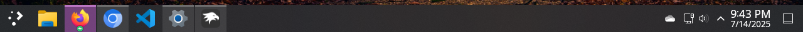

# Plasma theme for Windows 11 Taskbar Styler

This theme aims to recreate the default Panel from KDE Plasma.

**Author**: [SandTechStuff](https://github.com/SandTechStuff)



> [!NOTE]
> An internet connection is required to use this theme, as the relevant images are downloaded from this repository. This is also the reason images may be slow to load on first use.
>
> This theme was designed for 100% display scaling.

> [!TIP]
> This theme will use the Noto Sans font if it is installed. It can be downloaded from here: https://fonts.google.com/noto/specimen/Noto+Sans. 
> 
> Install the `NotoSans-Regular.ttf` version included in the archive.

## Required additional mod configuration

Mod: [Taskbar Height and Icon Size](https://windhawk.net/mods/taskbar-icon-size)

<details>
<summary>Content to import (click to expand)</summary>

```yaml
TaskbarHeight: 44
IconSize: 30
TaskbarButtonWidth: 52
IconSizeSmall: 16
TaskbarButtonWidthSmall: 32
```

</details>

## Customization options

This theme has two available Start button images. You can choose between them by adding a Style Constant in the Windhawk GUI.

* `StartButton=default`
    * The default start button from the Breeze theme.
* `StartButton=kubuntu`
    * The start button available in the Kubuntu Linux distro.

This theme has two available blur options. WindhawkBlur works properly on multiple monitors, while Acrylic is transparency mode aware (e.g., blur is disabled in Battery Saver). You can choose between them by adding a style in the Windhawk GUI.

Target:
```
Taskbar.TaskbarFrame > Grid#RootGrid > Taskbar.TaskbarBackground > Grid > Rectangle#BackgroundFill
```
Style:
```
Fill:=$WindhawkBlur
```
-- or --
```
Fill:=$Acrylic
```

## Theme selection

The theme is integrated into the mod and can be selected directly from the mod's
settings:

* Open the Windows 11 Taskbar Styler mod in Windhawk.
* Go to the "Settings" tab.
* Select the theme and save the settings.

## Manual installation

The theme styles can also be imported manually. To do that, follow these steps:

* Open the Windows 11 Taskbar Styler mod in Windhawk.
* Go to the "Settings" tab and select "Textual mode".
* Copy the content below to the text box and click "Save settings".

<details>
<summary>Content to import (click to expand)</summary>

```yaml
styleConstants:
  - taskbandInactiveNormal=<SolidColorBrush Color="Gray" Opacity="0.25" />
  - taskbandPointerOver=<SolidColorBrush Color="{ThemeResource SystemAccentColorLight1}" Opacity="0.4" />
  - taskbandActive=<SolidColorBrush Color="{ThemeResource SystemAccentColorLight1}" Opacity="0.5" />
  - indicatorActive=<SolidColorBrush Color="{ThemeResource SystemAccentColorLight2}" Opacity="0.7" />
  - indicatorInactive=<SolidColorBrush Color="Gray" Opacity="0.7" />
  - indicatorPointerOver=<SolidColorBrush Color="{ThemeResource SystemAccentColorLight2}" Opacity="0.8" />
  - taskbandAttention=<SolidColorBrush Color="#ce640c" Opacity="0.5" />
  - indicatorAttention=<SolidColorBrush Color="#ce640c" Opacity="0.9" />
  - selectionBorder=<LinearGradientBrush StartPoint='0,0' EndPoint='1,0'><GradientStop Color='Transparent' Offset='0.0' /><GradientStop Color='Transparent' Offset='0.2' /><GradientStop Color='{ThemeResource SystemAccentColorLight2}' Offset='0.2' /><GradientStop Color='{ThemeResource SystemAccentColorLight2}' Offset='0.8' /><GradientStop Color='Transparent' Offset='0.8' /><GradientStop Color='Transparent' Offset='1.0' /></LinearGradientBrush>
  - selectionBorderExtended=<SolidColorBrush Color="{ThemeResource SystemAccentColorLight2}" />
  - desktopButton=https://raw.githubusercontent.com/ramensoftware/windows-11-taskbar-styling-guide/refs/heads/main/Themes/Plasma/ThemeResources/desktop.png
  - plusIndicator=https://raw.githubusercontent.com/ramensoftware/windows-11-taskbar-styling-guide/refs/heads/main/Themes/Plasma/ThemeResources/plus.png
  - StartButton=default
  - WindhawkBlur=<WindhawkBlur BlurAmount="30" TintColor="#cc2a2e32" />
  - Acrylic=<AcrylicBrush TintColor="#2a2e32" TintOpacity="0.8" FallbackColor="#2a2e32" />
controlStyles:
  - target: Taskbar.TaskListButton > Taskbar.TaskListLabeledButtonPanel
    styles:
      - Padding=0
  - target: Taskbar.TaskListButton > Taskbar.TaskListLabeledButtonPanel@CommonStates > Windows.UI.Xaml.Controls.Border#BackgroundElement
    styles:
      - CornerRadius=0
      - BorderThickness=1,0,1,0
      - BorderBrush=Transparent
      - Background@ActiveNormal:=$taskbandActive
      - Background@InactiveNormal:=$taskbandInactiveNormal
      - Background@ActivePointerOver:=$taskbandPointerOver
      - Background@MultiWindowNormal:=$taskbandInactiveNormal
      - Background@MultiWindowPointerOver:=$taskbandPointerOver
      - Background@InactivePointerOver:=$taskbandPointerOver
      - Background@ActivePressed:=$taskbandPointerOver
      - Background@InactivePressed:=$taskbandPointerOver
      - Margin=0
      - Background@MultiWindowPressed:=$taskbandPointerOver
      - Background@MultiWindowActive:=$taskbandActive
      - Background@RequestingAttention:=$taskbandAttention
      - Background@RequestingAttentionPointerOver:=$taskbandPointerOver
      - Background@RequestingAttentionPressed:=$taskbandPointerOver
      - Background@RequestingAttentionMulti:=$taskbandAttention
      - Background@RequestingAttentionMultiPointerOver:=$taskbandPointerOver
      - Background@RequestingAttentionMultiPressed:=$taskbandPointerOver
  - target: Taskbar.TaskListButton > Taskbar.TaskListLabeledButtonPanel@RunningIndicatorStates > Windows.UI.Xaml.Controls.Border#BackgroundElement
    styles:
      - Opacity@NoRunningIndicator=0
  - target: Taskbar.TaskListLabeledButtonPanel#IconPanel > Windows.UI.Xaml.Controls.Image#Icon
    styles:
      - RenderTransform:=<TranslateTransform X="2" />
  - target: Taskbar.TaskListLabeledButtonPanel@CommonStates > Windows.UI.Xaml.Shapes.Rectangle#RunningIndicator
    styles:
      - Width=50
      - RadiusX=0
      - RadiusY=0
      - Height=3
      - VerticalAlignment=Top
      - RenderTransform:=<TranslateTransform X="2" />
      - Margin=-1,0,-1,0
      - Fill@ActiveNormal:=$indicatorActive
      - Fill@ActivePointerOver:=$indicatorPointerOver
      - Fill:=$indicatorInactive
      - Fill@InactivePointerOver:=$indicatorPointerOver
      - Fill@ActivePressed:=$indicatorPointerOver
      - Fill@InactivePressed:=$indicatorPointerOver
      - Fill@MultiWindowNormal:=$indicatorInactive
      - Fill@MultiWindowPointerOver:=$indicatorPointerOver
      - Fill@MultiWindowPressed:=$indicatorPointerOver
      - Fill@MultiWindowActive:=$indicatorActive
      - Fill@RequestingAttention:=$indicatorAttention
      - Fill@RequestingAttentionPointerOver:=$indicatorPointerOver
      - Fill@RequestingAttentionPressed:=$indicatorPointerOver
      - Fill@RequestingAttentionMulti:=$indicatorAttention
      - Fill@RequestingAttentionMultiPointerOver:=$indicatorPointerOver
      - Fill@RequestingAttentionMultiPressed:=$indicatorPointerOver
  - target: Rectangle#BackgroundStroke
    styles:
      - Visibility=Collapsed
  - target: Taskbar.TaskbarFrame > Grid#RootGrid > Taskbar.TaskbarBackground > Grid > Rectangle#BackgroundFill
    styles:
      - Fill:=$WindhawkBlur
  - target: Windows.UI.Xaml.Controls.Border#MultiWindowElement
    styles:
      - Visibility=Collapsed
  - target: Taskbar.TaskListLabeledButtonPanel@CommonStates > Windows.UI.Xaml.Shapes.Rectangle#DefaultIcon
    styles:
      - Fill:=<ImageBrush Stretch="Uniform" ImageSource="$plusIndicator" />
      - Width=11
      - Height=11
      - RadiusX=0
      - RadiusY=0
      - VerticalAlignment=Bottom
      - RenderTransform:=<TranslateTransform X="1" />
      - Visibility@MultiWindowNormal=Visible
      - Visibility@MultiWindowActive=Visible
      - Visibility@MultiWindowPointerOver=Visible
      - HorizontalAlignment=Center
      - Visibility@MultiWindowPressed=Visible
      - Visibility=Collapsed
  - target: Taskbar.TaskListButtonPanel#ExperienceToggleButtonRootPanel
    styles:
      - Padding=0
      - Width=50
  - target: Taskbar.TaskListButtonPanel#ExperienceToggleButtonRootPanel@CommonStates > Windows.UI.Xaml.Controls.Border#BackgroundElement
    styles:
      - CornerRadius=0
      - BorderThickness=0
      - Width=32
      - Background=Transparent
  - target: Taskbar.ExperienceToggleButton#LaunchListButton[AutomationProperties.AutomationId=StartButton] > Taskbar.TaskListButtonPanel > Microsoft.UI.Xaml.Controls.AnimatedVisualPlayer#Icon
    styles:
      - Visibility=Collapsed
  - target: Taskbar.TaskListButtonPanel#ExperienceToggleButtonRootPanel@CommonStates
    styles:
      - BorderThickness@ActiveNormal=0,3,0,0
      - Width=50
      - BorderBrush:=$selectionBorder
      - BorderThickness@ActivePointerOver=0,3,0,0
      - BorderThickness@ActivePressed=0,3,0,0
  - target: Taskbar.ExperienceToggleButton#LaunchListButton[AutomationProperties.AutomationId=StartButton] > Taskbar.TaskListButtonPanel > Border#BackgroundElement
    styles:
      - Background:=<ImageBrush Stretch="Uniform" ImageSource="https://raw.githubusercontent.com/ramensoftware/windows-11-taskbar-styling-guide/refs/heads/main/Themes/Plasma/ThemeResources/$StartButton.png" />
  - target: Taskbar.AugmentedEntryPointButton[AutomationProperties.AutomationId=WidgetsButton] > Taskbar.TaskListButtonPanel#ExperienceToggleButtonRootPanel
    styles:
      - Width=Auto
  - target: SystemTray.Stack#NotifyIconStack
    styles:
      - Grid.Column=5
  - target: SystemTray.NotificationAreaIcons#NotificationAreaIcons
    styles:
      - Grid.Column=0
  - target: SystemTray.OmniButton#ControlCenterButton
    styles:
      - Grid.Column=1
  - target: SystemTray.OmniButton > Windows.UI.Xaml.Controls.Grid > Windows.UI.Xaml.Controls.Border#BackgroundBorder
    styles:
      - Background=Transparent
      - Margin=1,0,1,0
      - CornerRadius=0
  - target: Windows.UI.Xaml.Controls.Grid#ContainerGrid@ > Windows.UI.Xaml.Controls.Border#BackgroundBorder
    styles:
      - BorderBrush@CheckedNormal:=$selectionBorderExtended
      - BorderThickness@CheckedNormal:=0,3,0,0
      - BorderBrush@CheckedPointerOver:=$selectionBorderExtended
      - BorderThickness@CheckedPointerOver:=0,3,0,0
      - BorderBrush@CheckedPressed:=$selectionBorderExtended
      - BorderThickness@CheckedPressed:=0,3,0,0
      - BorderThickness=0
  - target: SystemTray.OmniButton > Windows.UI.Xaml.Controls.Grid@CommonStates > Windows.UI.Xaml.Controls.Border#BackgroundBorder
    styles:
      - BorderBrush@Checked:=$selectionBorderExtended
      - BorderThickness@Checked:=0,3,0,0
      - BorderBrush@CheckedPointerOver:=$selectionBorderExtended
      - BorderThickness@CheckedPointerOver:=0,3,0,0
      - BorderBrush@CheckedPressed:=$selectionBorderExtended
      - BorderThickness@CheckedPressed:=0,3,0,0
      - BorderThickness=0
  - target: Windows.UI.Xaml.Controls.TextBlock#TimeInnerTextBlock
    styles:
      - FontSize=17.33
      - TextAlignment=Center
      - FontFamily=Noto Sans, Segoe UI
      - Foreground=White
  - target: Windows.UI.Xaml.Controls.TextBlock#DateInnerTextBlock
    styles:
      - FontSize=13.33
      - TextAlignment=Center
      - FontFamily=Noto Sans, Segoe UI
      - Margin=0,-5,0,0
      - Foreground=White
  - target: SystemTray.DateTimeIconContent > Windows.UI.Xaml.Controls.Grid#ContainerGrid
    styles:
      - Padding=0
  - target: SystemTray.ChevronIconView > Windows.UI.Xaml.Controls.Grid#ContainerGrid > Windows.UI.Xaml.Controls.ContentPresenter#ContentPresenter > Windows.UI.Xaml.Controls.Grid#ContentGrid > SystemTray.TextIconContent > Windows.UI.Xaml.Controls.Grid#ContainerGrid > SystemTray.AdaptiveTextBlock#Base > Windows.UI.Xaml.Controls.TextBlock#InnerTextBlock
    styles:
      - FontSize=17.33
      - Foreground=White
  - target: SystemTray.ChevronIconView
    styles:
      - Margin=-5,0
  - target: SystemTray.NotifyIconView#NotifyItemIcon
    styles:
      - MinWidth=28
  - target: SystemTray.Stack#ShowDesktopStack
    styles:
      - Width=48
      - Height=Auto
  - target: SystemTray.IconView[AutomationProperties.Name=Show Desktop]
    styles:
      - Width=48
  - target: Windows.UI.Xaml.Shapes.Rectangle#ShowDesktopPipe
    styles:
      - Width=48
      - Height=50
      - Fill:=<ImageBrush Stretch="None" ImageSource="$desktopButton" />
  - target: SystemTray.ChevronIconView > Windows.UI.Xaml.Controls.Grid > Windows.UI.Xaml.Controls.Border#BackgroundBorder
    styles:
      - Background=Transparent
      - Margin=1,0,1,0
      - CornerRadius=0
  - target: SystemTray.NotifyIconView > Windows.UI.Xaml.Controls.Grid > Windows.UI.Xaml.Controls.Border#BackgroundBorder
    styles:
      - Background=Transparent
      - Margin=1,0,1,0
      - CornerRadius=0
  - target: SystemTray.Stack#MainStack
    styles:
      - //Grid.Column=2
  - target: SystemTray.Stack#NonActivatableStack
    styles:
      - Grid.Column=3
  - target: SystemTray.IconView#SystemTrayIcon > Windows.UI.Xaml.Controls.Grid > Windows.UI.Xaml.Controls.Border#BackgroundBorder
    styles:
      - Background=Transparent
      - Margin=1,0,1,0
      - CornerRadius=0
  - target: SystemTray.StackListView[AutomationProperties.AutomationId=Main]
    styles:
      - Margin=-8,0,0,0
  - target: SystemTray.AdaptiveTextBlock#LanguageInnerTextBlock > Windows.UI.Xaml.Controls.TextBlock
    styles:
      - FontFamily=Noto Sans, Segoe UI
```
</details>
