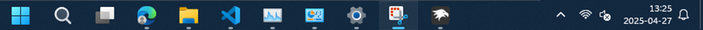

# Sinistra theme for Windows 11 Taskbar Styler
**Author**: [roushinkai](https://github.com/roushinkai)

Theme for use with a left aligned taskbar. Ideal for small screens.



## Taskbar height and icon size
* Use these settings in the [Taskbar height and icon size](https://windhawk.net/mods/taskbar-icon-size) Windhawk mod:

  ```json
  {
    "IconSize": 24,
    "TaskbarHeight": 40,
    "TaskbarButtonWidth": 54
  }
  ```
## Windows settings
Right click on taskbar > Taskbar settings:
* Search icon only
* Task View on
* Widgets off
* Chat off
* Taskbar behaviors > Taskbar alignment > Left
* Taskbar behaviors > ✔ Select the far corner of the taskbar to show the desktop

Right click on desktop > Personalize > Colors > Choose your mode > Custom:
* Choose your default Windows mode: Dark
* Choose your default app mode: Light

Not recommended to use with the Windows Light mode as visibility is subpar.
## Theme selection

The theme is integrated into the mod, and can be simply selected from the mod's
settings:

* Open the Windows 11 Taskbar Styler mod in Windhawk.
* Go to the "Settings" tab.
* Select the theme and save the settings.

## Manual installation

The theme styles can also be imported manually. To do that, follow these steps:

* Open the Windows 11 Taskbar Styler mod in Windhawk.
* Go to the "Advanced" tab.
* Copy the content below to the text box under "Mod settings" and click "Save".

<details>
<summary>Content to import (click to expand)</summary>

```json
{
"theme":"","controlStyles[0].target":"Taskbar.TaskListLabeledButtonPanel@RunningIndicatorStates > Rectangle#RunningIndicator","controlStyles[1].target":"Taskbar.TaskListButton","controlStyles[1].styles[0]":"CornerRadius=0","controlStyles[2].target":"Taskbar.SearchBoxButton","controlStyles[2].styles[0]":"CornerRadius=0","controlStyles[3].target":"Taskbar.ExperienceToggleButton","controlStyles[3].styles[0]":"CornerRadius=0","controlStyles[4].target":"Border#MultiWindowElement","controlStyles[4].styles[0]":"CornerRadius=0","controlStyles[2].styles[1]":"Padding=2,0,2,0","controlStyles[5].target":"Taskbar.TaskListLabeledButtonPanel","controlStyles[5].styles[0]":"Padding=2,1,2,1","resourceVariables[0].variableKey":"","controlStyles[6].target":"Target: Rectangle[3]","controlStyles[6].styles[0]":" Style: Width=12","controlStyles[7].target":"Rectangle#ShowDesktopPipe@CommonStates","controlStyles[7].styles[0]":"Width=12","controlStyles[7].styles[1]":"Margin=0,0,-10,0","controlStyles[7].styles[2]":"Height=50","controlStyles[7].styles[3]":"Fill@Active:=<AcrylicBrush TintOpacity=\"0.14\" TintColor=\"White\" Opacity=\"1\"/>","controlStyles[7].styles[4]":"Stroke:=<AcrylicBrush TintOpacity=\"0.14\" TintColor=\"White\" Opacity=\"1\"/>","controlStyles[0].styles[0]":"","controlStyles[8].target":"SystemTray.OmniButton","controlStyles[8].styles[0]":"CornerRadius=0","controlStyles[8].styles[1]":"Padding=2,0,2,0","controlStyles[9].target":"SystemTray.ChevronIconView","controlStyles[9].styles[0]":"Padding=2,0,2,0","controlStyles[10].target":"Windows.UI.Xaml.Controls.Border#BackgroundBorder","controlStyles[10].styles[0]":"CornerRadius=2","controlStyles[3].styles[1]":"Width=54","controlStyles[3].styles[2]":"Padding=2,0,2,0","controlStyles[1].styles[1]":"Padding=2,0,2,0","controlStyles[2].styles[2]":"Width=54","controlStyles[1].styles[2]":"","controlStyles[11].target":"Taskbar.TaskListButtonPanel#ExperienceToggleButtonRootPanel","controlStyles[11].styles[0]":"Padding=2,0,2,0","controlStyles[12].target":"Taskbar.ExperienceToggleButton#LaunchListButton","controlStyles[12].styles[0]":"Width=54","controlStyles[13].target":"Taskbar.TaskListButtonPanel#ExperienceToggleButtonRootPanel","controlStyles[13].styles[0]":"Width=54","controlStyles[9].styles[1]":"CornerRadius=0","controlStyles[0].styles[1]":"","controlStyles[0].styles[2]":""}
```
</details>
