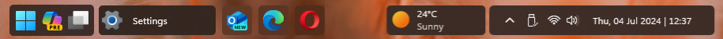

# Squircle theme for Windows 11 Taskbar Styler

This theme was originally [shared on
Reddit](https://www.reddit.com/r/desktops/comments/1dna90y/comment/la4vxw1/).

**Author**: [AsvnDG](https://github.com/AsvnDG)

 \


## Notes

* This theme is intended and has been designed to be used with the search box
  set to either "Icon only" or "Hidden". If you choose one of the other search
  box styles, you may need to adjust the margins slightly due to all search
  styles sharing the same IDs in Windows. This note will be edited should this
  change.
* Available in 2 variants. Please choose the style that matches the location of
  your weather widget, regardless of whether you have it enabled or not.

## Theme selection

The theme is integrated into the mod and can simply be selected from the mod's
settings:

* Open the Windows 11 Taskbar Styler mod in Windhawk.
* Go to the "Settings" tab.
* Select the theme and save the settings.

## Manual installation

The theme styles can also be imported manually. To do that, follow these steps:

* Open the Windows 11 Taskbar Styler mod in Windhawk.
* Go to the "Advanced" tab.
* Copy the content below to the text box under "Mod settings" and click "Save".

#### Weather on Left:
<details>
<summary>Content to import (click to expand)</summary>

```json
{
  "controlStyles[0].target": "Taskbar.TaskbarFrame > Grid#RootGrid > Taskbar.TaskbarBackground > Grid > Rectangle#BackgroundFill",
  "controlStyles[0].styles[0]": "Fill=Transparent",
  "controlStyles[1].target": "Taskbar.TaskbarBackground#HoverFlyoutBackgroundControl > Grid > Rectangle#BackgroundFill",
  "controlStyles[1].styles[0]": "Fill=#CC222222",
  "controlStyles[2].target": "Taskbar.TaskListButtonPanel@CommonStates > Border#BackgroundElement",
  "controlStyles[2].styles[0]": "CornerRadius=5",
  "controlStyles[2].styles[1]": "Background:=<AcrylicBrush TintColor=\"Black\" TintOpacity=\"0.8\" FallbackColor=\"#BB222222\" />",
  "controlStyles[2].styles[2]": "Background@InactivePointerOver:=<AcrylicBrush TintColor=\"Black\" TintOpacity=\"0.8\" FallbackColor=\"#CC222222\" />",
  "controlStyles[2].styles[3]": "Background@ActivePointerOver:=<AcrylicBrush TintColor=\"Black\" TintOpacity=\"0.9\" FallbackColor=\"#CC222222\" />",
  "controlStyles[2].styles[4]": "Background@ActiveNormal:=<AcrylicBrush TintColor=\"Black\" TintOpacity=\"0.8\" FallbackColor=\"#CC222222\" />",
  "controlStyles[2].styles[5]": "Background@InactiveNormal:=<AcrylicBrush TintColor=\"Black\" TintOpacity=\"0.7\" FallbackColor=\"#BB222222\" />",
  "controlStyles[2].styles[6]": "Background@InactivePressed:=<AcrylicBrush TintColor=\"Black\" TintOpacity=\"0.8\" FallbackColor=\"#CC222222\" />",
  "controlStyles[2].styles[7]": "Background@ActivePressed:=<AcrylicBrush TintColor=\"Black\" TintOpacity=\"0.8\" FallbackColor=\"#CC222222\" />",
  "controlStyles[3].target": "Grid#SystemTrayFrameGrid",
  "controlStyles[3].styles[0]": "Background:=<AcrylicBrush TintColor=\"Black\" TintOpacity=\"0.8\" FallbackColor=\"#BB222222\"/>",
  "controlStyles[3].styles[1]": "CornerRadius=5",
  "controlStyles[3].styles[2]": "Margin=0,5,14,5",
  "controlStyles[3].styles[3]": "Padding=10,0,0,0",
  "controlStyles[4].target": "Rectangle#RunningIndicator",
  "controlStyles[4].styles[0]": "Fill=Transparent",
  "controlStyles[4].styles[1]": "RadiusX=5",
  "controlStyles[4].styles[2]": "RadiusY=5",
  "controlStyles[4].styles[3]": "Height=38",
  "controlStyles[4].styles[4]": "Width=40",
  "controlStyles[5].target": "Taskbar.TaskListLabeledButtonPanel > TextBlock#LabelControl",
  "controlStyles[5].styles[0]": "Margin=4,0,0,0",
  "controlStyles[5].styles[1]": "Foreground=White",
  "controlStyles[6].target": "Taskbar.SearchBoxButton",
  "controlStyles[6].styles[0]": "Foreground=White",
  "controlStyles[6].styles[1]": "Margin=-11,0,0,0",
  "controlStyles[7].target": "TextBlock#SearchBoxTextBlock",
  "controlStyles[7].styles[0]": "FontSize=12",
  "controlStyles[7].styles[1]": "Foreground=White",
  "controlStyles[8].target": "Rectangle#BackgroundStroke",
  "controlStyles[8].styles[0]": "Fill=Transparent",
  "controlStyles[9].target": "Grid",
  "controlStyles[9].styles[0]": "RequestedTheme=2",
  "controlStyles[10].target": "Taskbar.TaskListButton#TaskListButton[AutomationProperties.Name=Copilot] > Taskbar.TaskListLabeledButtonPanel#IconPanel > Border#BackgroundElement",
  "controlStyles[10].styles[0]": "Background:=<AcrylicBrush TintColor=\"Red\" TintOpacity=\"0.8\" />",
  "controlStyles[11].target": "Border#BackgroundBorder",
  "controlStyles[11].styles[0]": "Margin=0,3,0,3",
  "controlStyles[11].styles[1]": "CornerRadius=5",
  "controlStyles[12].target": "Taskbar.AugmentedEntryPointButton#AugmentedEntryPointButton > Taskbar.TaskListButtonPanel#ExperienceToggleButtonRootPanel > Border#BackgroundElement@CommonStates",
  "controlStyles[12].styles[0]": "Background@InactivePointerOver:=<AcrylicBrush TintColor=\"Black\" TintOpacity=\"0\" />",
  "controlStyles[12].styles[1]": "Background:=<AcrylicBrush TintColor=\"Black\" TintOpacity=\"0.8\" FallbackColor=\"#BB222222\" />",
  "controlStyles[13].target": "Border#MultiWindowElement",
  "controlStyles[13].styles[0]": "Background:=<AcrylicBrush TintColor=\"Black\" TintOpacity=\"0.8\" FallbackColor=\"#CC222222\" />",
  "controlStyles[14].target": "TextBlock#TimeInnerTextBlock",
  "controlStyles[14].styles[0]": "Foreground=White",
  "controlStyles[15].target": "TextBlock#DateInnerTextBlock",
  "controlStyles[15].styles[0]": "Foreground=White",
  "controlStyles[16].target": "SystemTray.TextIconContent > Grid > SystemTray.AdaptiveTextBlock#Base > TextBlock",
  "controlStyles[16].styles[0]": "Foreground=White",
  "controlStyles[17].target": "Border#BackgroundElement",
  "controlStyles[17].styles[0]": "BorderThickness=0",
  "controlStyles[18].target": "Taskbar.AugmentedEntryPointButton#AugmentedEntryPointButton",
  "controlStyles[18].styles[0]": "Margin=-11,0,0,0",
  "controlStyles[19].target": "Taskbar.ExperienceToggleButton#LaunchListButton[AutomationProperties.Name=Task View]",
  "controlStyles[19].styles[0]": "Margin=-12,0,0,0",
  "controlStyles[20].target": "taskbar:TaskListLabeledButtonPanel@RunningIndicatorStates > Border",
  "controlStyles[20].styles[0]": "Background@ActiveRunningIndicator:=<AcrylicBrush TintOpacity=\"0.8\" TintColor=\"Black\" />",
  "controlStyles[20].styles[1]": "Background@InactiveRunningIndicator:=<AcrylicBrush TintOpacity=\"0.8\" TintColor=\"Black\" />",
  "controlStyles[20].styles[2]": "Background@InactiveRunningIndicatorPointerOver:=<AcrylicBrush TintOpacity=\"0.8\" TintColor=\"Black\" />",
  "controlStyles[21].target": "Taskbar.TaskListLabeledButtonPanel@CommonStates > Border#BackgroundElement",
  "controlStyles[21].styles[0]": "Background@InactivePointerOver:=<AcrylicBrush TintOpacity=\"0.8\" TintColor=\"Black\" FallbackColor=\"#DD222222\"/>",
  "controlStyles[21].styles[1]": "Background@ActivePointerOver:=<AcrylicBrush TintOpacity=\"0.8\" TintColor=\"Black\" FallbackColor=\"#EE222222\"/>",
  "controlStyles[21].styles[2]": "Background@InactiveNormal:=<AcrylicBrush TintOpacity=\"0.2\" TintColor=\"Black\" FallbackColor=\"#BB222222\"/>",
  "controlStyles[21].styles[3]": "Background@ActiveNormal:=<AcrylicBrush TintOpacity=\"0.8\" TintColor=\"Black\" FallbackColor=\"#CC222222\"/>",
  "controlStyles[21].styles[4]": "Background@ActivePressed:=<AcrylicBrush TintOpacity=\"0.8\" TintColor=\"#333333\" FallbackColor=\"#BB333333\" />",
  "controlStyles[21].styles[5]": "Background@InactivePressed:=<AcrylicBrush TintOpacity=\"0.8\" TintColor=\"#333333\" FallbackColor=\"#BB333333\" />",
  "controlStyles[21].styles[6]": "CornerRadius=5",
  "controlStyles[21].styles[7]": "Margin=1"
}
```
</details>

#### Weather on Right:
<details>
<summary>Content to import (click to expand)</summary>

```json
{
  "controlStyles[0].target": "Taskbar.TaskbarFrame > Grid#RootGrid > Taskbar.TaskbarBackground > Grid > Rectangle#BackgroundFill",
  "controlStyles[0].styles[0]": "Fill=Transparent",
  "controlStyles[1].target": "Taskbar.TaskbarBackground#HoverFlyoutBackgroundControl > Grid > Rectangle#BackgroundFill",
  "controlStyles[1].styles[0]": "Fill=#CC222222",
  "controlStyles[2].target": "Taskbar.TaskListButtonPanel@CommonStates > Border#BackgroundElement",
  "controlStyles[2].styles[0]": "CornerRadius=5",
  "controlStyles[2].styles[1]": "Background:=<AcrylicBrush TintColor=\"Black\" TintOpacity=\"0.8\" FallbackColor=\"#BB222222\" />",
  "controlStyles[2].styles[2]": "Background@InactivePointerOver:=<AcrylicBrush TintColor=\"Black\" TintOpacity=\"0.8\" FallbackColor=\"#CC222222\" />",
  "controlStyles[2].styles[3]": "Background@ActivePointerOver:=<AcrylicBrush TintColor=\"Black\" TintOpacity=\"0.8\" FallbackColor=\"#CC222222\" />",
  "controlStyles[2].styles[4]": "Background@ActiveNormal:=<AcrylicBrush TintColor=\"Black\" TintOpacity=\"0.8\" FallbackColor=\"#CC222222\" />",
  "controlStyles[2].styles[5]": "Background@InactivePressed:=<AcrylicBrush TintColor=\"Black\" TintOpacity=\"0.8\" FallbackColor=\"#CC222222\" />",
  "controlStyles[2].styles[6]": "Background@ActivePressed:=<AcrylicBrush TintColor=\"Black\" TintOpacity=\"0.8\" FallbackColor=\"#CC222222\" />",
  "controlStyles[2].styles[7]": "Background@MultiWindowNormal=#444444",
  "controlStyles[2].styles[8]": "Background@MultiWindowPointerOver=White",
  "controlStyles[2].styles[9]": "BorderThickness@MultiWindowNormal=2",
  "controlStyles[2].styles[10]": "BorderBrush@MultiWindowNormal=White",
  "controlStyles[3].target": "Grid#SystemTrayFrameGrid",
  "controlStyles[3].styles[0]": "Background:=<AcrylicBrush TintColor=\"Black\" TintOpacity=\"0.8\" FallbackColor=\"#BB222222\" />",
  "controlStyles[3].styles[1]": "CornerRadius=5",
  "controlStyles[3].styles[2]": "Margin=0,5,18,5",
  "controlStyles[3].styles[3]": "Padding=10,0,0,0",
  "controlStyles[4].target": "Rectangle#RunningIndicator",
  "controlStyles[4].styles[0]": "Fill=Transparent",
  "controlStyles[4].styles[1]": "Visibility=Collapsed",
  "controlStyles[5].target": "TextBlock#SearchBoxTextBlock",
  "controlStyles[5].styles[0]": "FontSize=12",
  "controlStyles[5].styles[1]": "Foreground=White",
  "controlStyles[6].target": "Rectangle#BackgroundStroke",
  "controlStyles[6].styles[0]": "Fill=Transparent",
  "controlStyles[7].target": "Grid",
  "controlStyles[7].styles[0]": "RequestedTheme=2",
  "controlStyles[8].target": "Taskbar.TaskListButton#TaskListButton[AutomationProperties.Name=Copilot]",
  "controlStyles[8].styles[0]": "Background:=<AcrylicBrush TintColor=\"Black\" TintOpacity=\"0.8\" />",
  "controlStyles[8].styles[1]": "Margin=12,0,12,0",
  "controlStyles[8].styles[2]": "CornerRadius=0",
  "controlStyles[9].target": "Border#BackgroundBorder",
  "controlStyles[9].styles[0]": "Margin=0,3,0,3",
  "controlStyles[9].styles[1]": "CornerRadius=5",
  "controlStyles[10].target": "Taskbar.AugmentedEntryPointButton#AugmentedEntryPointButton > Taskbar.TaskListButtonPanel#ExperienceToggleButtonRootPanel > Border#BackgroundElement@CommonStates",
  "controlStyles[10].styles[0]": "Background@InactivePointerOver:=<AcrylicBrush TintColor=\"Black\" TintOpacity=\"0\" />",
  "controlStyles[10].styles[1]": "Background:=<AcrylicBrush TintColor=\"Black\" TintOpacity=\"0.8\" FallbackColor=\"#BB222222\"/>",
  "controlStyles[10].styles[2]": "Width=125",
  "controlStyles[11].target": "Border#BackgroundElement",
  "controlStyles[11].styles[0]": "BorderThickness=0",
  "controlStyles[12].target": "Taskbar.AugmentedEntryPointButton#AugmentedEntryPointButton",
  "controlStyles[12].styles[0]": "Margin=20,1,-20,1",
  "controlStyles[13].target": "Grid#AugmentedEntryPointContentGrid",
  "controlStyles[13].styles[0]": "Margin=10,0,-5,0",
  "controlStyles[14].target": "taskbar:TaskListLabeledButtonPanel@CommonStates > Border[1]",
  "controlStyles[14].styles[0]": "Background@InactivePointerOver:=<AcrylicBrush TintOpacity=\"0.8\" TintColor=\"Black\" FallbackColor=\"#DD222222\" />",
  "controlStyles[14].styles[1]": "Background@ActivePointerOver:=<AcrylicBrush TintOpacity=\"0.8\" TintColor=\"Black\" FallbackColor=\"#EE222222\" />",
  "controlStyles[14].styles[2]": "Background@InactiveNormal:=<AcrylicBrush TintOpacity=\"0.2\" TintColor=\"Black\" FallbackColor=\"#BB222222\" />",
  "controlStyles[14].styles[3]": "Background@ActiveNormal:=<AcrylicBrush TintOpacity=\"0.8\" TintColor=\"Black\" FallbackColor=\"#CC222222\" />",
  "controlStyles[14].styles[4]": "Background@ActivePressed:=<AcrylicBrush TintOpacity=\"0.8\" TintColor=\"#333333\" FallbackColor=\"#BB333333\" />",
  "controlStyles[14].styles[5]": "Background@InactivePressed:=<AcrylicBrush TintOpacity=\"0.8\" TintColor=\"#333333\" FallbackColor=\"#BB333333\" />",
  "controlStyles[14].styles[6]": "CornerRadius=5",
  "controlStyles[14].styles[7]": "RenderTransform:=<ScaleTransform ScaleX=\"0.5\" />",
  "controlStyles[14].styles[8]": "Background@MultiWindowNormal=#444444",
  "controlStyles[14].styles[9]": "Background@MultiWindowPointerOver=White",
  "controlStyles[14].styles[10]": "BorderBrush@MultiWindowNormal=White",
  "controlStyles[14].styles[11]": "BorderThickness@MultiWindowNormal=2",
  "controlStyles[15].target": "SearchUx.SearchUI.SearchButtonRootGrid@CommonStates > Border#BackgroundElement",
  "controlStyles[15].styles[0]": "CornerRadius=5",
  "controlStyles[15].styles[1]": "Background:=<AcrylicBrush TintColor=\"Black\" TintOpacity=\"0.8\" FallbackColor=\"#BB222222\" />",
  "controlStyles[16].target": "Taskbar.ExperienceToggleButton#LaunchListButton[AutomationProperties.Name=Task View] > Taskbar.TaskListButtonPanel > Border",
  "controlStyles[16].styles[0]": "CornerRadius=0,5,5,0",
  "controlStyles[16].styles[1]": "Background:=<AcrylicBrush TintOpacity=\"0.82\" TintColor=\"Black\" />",
  "controlStyles[17].target": "SearchUx.SearchUI.SearchBoxButton",
  "controlStyles[17].styles[0]": "Background:=<AcrylicBrush TintOpacity=\"0.8\" TintColor=\"Black\" FallbackColor=\"#BB333333\" />",
  "controlStyles[18].target": "SearchUx.SearchUI.SearchButtonRootGrid > Border",
  "controlStyles[18].styles[0]": "Opacity=0",
  "controlStyles[19].target": "SearchUx.SearchUI.SearchButtonRootGrid",
  "controlStyles[19].styles[0]": "Background:=<AcrylicBrush TintOpacity=\"0.8\" TintColor=\"Black\" FallbackColor=\"#EE000000\" />",
  "controlStyles[19].styles[1]": "MinWidth=44",
  "controlStyles[19].styles[2]": "CornerRadius=0,5,5,0",
  "controlStyles[19].styles[3]": "Margin=0,4,2,4",
  "controlStyles[20].styles[0]": "Margin=14,0,0,0",
  "controlStyles[20].target": "SearchUx.SearchUI.SearchBoxButton#SearchBox > SearchUx.SearchUI.SearchButtonRootGrid@CommonStates > Microsoft.UI.Xaml.Controls.AnimatedVisualPlayer#Icon",
  "controlStyles[21].target": "taskbar:TaskListLabeledButtonPanel@RunningIndicatorStates > Border#BackgroundElement",
  "controlStyles[21].styles[0]": "Background@NoRunningIndicator:=<AcrylicBrush TintOpacity=\"0.2\" TintColor=\"Black\" FallbackColor=\"#BB222222\" />",
  "controlStyles[21].styles[1]": "Background@InactiveRunningIndicator:=<AcrylicBrush TintOpacity=\"0.8\" TintColor=\"Black\" />",
  "controlStyles[21].styles[2]": "Background@InactiveRunningIndicatorPointerOver:=<AcrylicBrush TintOpacity=\"0.8\" TintColor=\"Black\" />",
  "controlStyles[21].styles[3]": "Background@ActiveRunningIndicator:=<AcrylicBrush TintOpacity=\"0.8\" TintColor=\"Black\" />",
  "controlStyles[21].styles[4]": "Background@ActiveRunningIndicatorPointerOver:=<AcrylicBrush TintOpacity=\"0.8\" TintColor=\"Black\" />",
  "controlStyles[22].target": "Border#MultiWindowElement",
  "controlStyles[22].styles[0]": "Opacity=0",
  "controlStyles[23].styles[0]": "RenderTransform:=<TranslateTransform X=\"-9\" />",
  "controlStyles[23].target": "Taskbar.ExperienceToggleButton#LaunchListButton[AutomationProperties.Name=Task View] > Taskbar.TaskListButtonPanel ",
  "controlStyles[23].styles[1]": "Margin=0,0,-4,0",
  "controlStyles[23].styles[2]": "CornerRadius=0",
  "controlStyles[24].styles[0]": "Background:=<AcrylicBrush TintOpacity=\"0.85\" TintColor=\"Black\" />",
  "controlStyles[24].target": "Taskbar.ExperienceToggleButton#LaunchListButton[AutomationProperties.Name=Start] > Taskbar.TaskListButtonPanel > Border",
  "controlStyles[25].target": "Taskbar.ExperienceToggleButton#LaunchListButton[AutomationProperties.Name=Start] > Taskbar.TaskListButtonPanel",
  "controlStyles[25].styles[0]": "RenderTransform:=<TranslateTransform X=\"6\" />"
}
```
</details>
