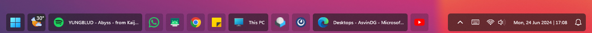
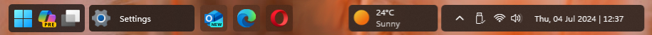

# Squircle theme for Windows 11 Taskbar Styler

This theme was originally [shared on
Reddit](https://www.reddit.com/r/desktops/comments/1dna90y/comment/la4vxw1/).

**Author**: [AsvnDG](https://github.com/AsvnDG)

 \


## Notes

* This theme is intended and has been designed to be used with the search box
  set to either "Icon only" or "Hidden". If you choose one of the other search
  box styles, you may need to adjust the margins slightly due to all search
  styles sharing the same IDs in Windows. This note will be edited should this
  change.
* Available in 2 variants. Please choose the style that matches the location of
  your weather widget, regardless of whether you have it enabled or not.

## Theme selection

The theme is integrated into the mod and can be selected directly from the mod's
settings:

* Open the Windows 11 Taskbar Styler mod in Windhawk.
* Go to the "Settings" tab.
* Select the theme and save the settings.

## Manual installation

The theme styles can also be imported manually. To do that, follow these steps:

* Open the Windows 11 Taskbar Styler mod in Windhawk.
* Go to the "Settings" tab and select "Textual mode".
* Copy the content below to the text box and click "Save settings".

#### Weather on Left:
<details>
<summary>Content to import (click to expand)</summary>

```yaml
controlStyles:
  - target: Taskbar.TaskbarFrame > Grid#RootGrid > Taskbar.TaskbarBackground > Grid > Rectangle#BackgroundFill
    styles:
      - Fill=Transparent
  - target: Taskbar.TaskbarBackground#HoverFlyoutBackgroundControl > Grid > Rectangle#BackgroundFill
    styles:
      - Fill=#CC222222
  - target: Taskbar.TaskListButtonPanel@CommonStates > Border#BackgroundElement
    styles:
      - CornerRadius=5
      - Background:=<AcrylicBrush TintColor="Black" TintOpacity="0.8" FallbackColor="#BB222222" />
      - Background@InactivePointerOver:=<AcrylicBrush TintColor="Black" TintOpacity="0.8" FallbackColor="#CC222222" />
      - Background@ActivePointerOver:=<AcrylicBrush TintColor="Black" TintOpacity="0.9" FallbackColor="#CC222222" />
      - Background@ActiveNormal:=<AcrylicBrush TintColor="Black" TintOpacity="0.8" FallbackColor="#CC222222" />
      - Background@InactiveNormal:=<AcrylicBrush TintColor="Black" TintOpacity="0.7" FallbackColor="#BB222222" />
      - Background@InactivePressed:=<AcrylicBrush TintColor="Black" TintOpacity="0.8" FallbackColor="#CC222222" />
      - Background@ActivePressed:=<AcrylicBrush TintColor="Black" TintOpacity="0.8" FallbackColor="#CC222222" />
  - target: Grid#SystemTrayFrameGrid
    styles:
      - Background:=<AcrylicBrush TintColor="Black" TintOpacity="0.8" FallbackColor="#BB222222"/>
      - CornerRadius=5
      - Margin=0,5,14,5
      - Padding=10,0,0,0
  - target: Rectangle#RunningIndicator
    styles:
      - Fill=Transparent
      - RadiusX=5
      - RadiusY=5
      - Height=38
      - Width=40
  - target: Taskbar.TaskListLabeledButtonPanel > TextBlock#LabelControl
    styles:
      - Margin=4,0,0,0
      - Foreground=White
  - target: Taskbar.SearchBoxButton
    styles:
      - Foreground=White
      - Margin=-11,0,0,0
  - target: TextBlock#SearchBoxTextBlock
    styles:
      - FontSize=12
      - Foreground=White
  - target: Rectangle#BackgroundStroke
    styles:
      - Fill=Transparent
  - target: Grid
    styles:
      - RequestedTheme=2
  - target: Taskbar.TaskListButton#TaskListButton[AutomationProperties.Name=Copilot] > Taskbar.TaskListLabeledButtonPanel#IconPanel > Border#BackgroundElement
    styles:
      - Background:=<AcrylicBrush TintColor="Red" TintOpacity="0.8" />
  - target: Border#BackgroundBorder
    styles:
      - Margin=0,3,0,3
      - CornerRadius=5
  - target: Taskbar.AugmentedEntryPointButton#AugmentedEntryPointButton > Taskbar.TaskListButtonPanel#ExperienceToggleButtonRootPanel > Border#BackgroundElement@CommonStates
    styles:
      - Background@InactivePointerOver:=<AcrylicBrush TintColor="Black" TintOpacity="0" />
      - Background:=<AcrylicBrush TintColor="Black" TintOpacity="0.8" FallbackColor="#BB222222" />
  - target: Border#MultiWindowElement
    styles:
      - Background:=<AcrylicBrush TintColor="Black" TintOpacity="0.8" FallbackColor="#CC222222" />
  - target: TextBlock#TimeInnerTextBlock
    styles:
      - Foreground=White
  - target: TextBlock#DateInnerTextBlock
    styles:
      - Foreground=White
  - target: SystemTray.TextIconContent > Grid > SystemTray.AdaptiveTextBlock#Base > TextBlock
    styles:
      - Foreground=White
  - target: Border#BackgroundElement
    styles:
      - BorderThickness=0
  - target: Taskbar.AugmentedEntryPointButton#AugmentedEntryPointButton
    styles:
      - Margin=-11,0,0,0
  - target: Taskbar.ExperienceToggleButton#LaunchListButton[AutomationProperties.Name=Task View]
    styles:
      - Margin=-12,0,0,0
  - target: taskbar:TaskListLabeledButtonPanel@RunningIndicatorStates > Border
    styles:
      - Background@ActiveRunningIndicator:=<AcrylicBrush TintOpacity="0.8" TintColor="Black" />
      - Background@InactiveRunningIndicator:=<AcrylicBrush TintOpacity="0.8" TintColor="Black" />
      - Background@InactiveRunningIndicatorPointerOver:=<AcrylicBrush TintOpacity="0.8" TintColor="Black" />
  - target: Taskbar.TaskListLabeledButtonPanel@CommonStates > Border#BackgroundElement
    styles:
      - Background@InactivePointerOver:=<AcrylicBrush TintOpacity="0.8" TintColor="Black" FallbackColor="#DD222222"/>
      - Background@ActivePointerOver:=<AcrylicBrush TintOpacity="0.8" TintColor="Black" FallbackColor="#EE222222"/>
      - Background@InactiveNormal:=<AcrylicBrush TintOpacity="0.2" TintColor="Black" FallbackColor="#BB222222"/>
      - Background@ActiveNormal:=<AcrylicBrush TintOpacity="0.8" TintColor="Black" FallbackColor="#CC222222"/>
      - Background@ActivePressed:=<AcrylicBrush TintOpacity="0.8" TintColor="#333333" FallbackColor="#BB333333" />
      - Background@InactivePressed:=<AcrylicBrush TintOpacity="0.8" TintColor="#333333" FallbackColor="#BB333333" />
      - CornerRadius=5
      - Margin=1
```
</details>

#### Weather on Right:
<details>
<summary>Content to import (click to expand)</summary>

```yaml
controlStyles:
  - target: Rectangle#BackgroundFill
    styles:
      - Fill=Transparent
  - target: Taskbar.TaskListLabeledButtonPanel@RunningIndicatorStates > Border#BackgroundElement
    styles:
      - Background@NoRunningIndicator:=<AcrylicBrush TintOpacity="0.2" TintColor="#222222" FallbackColor="#DD222222" />
      - Background:=<AcrylicBrush TintOpacity="0.8" TintColor="Black" FallbackColor="#DD222222" />
      - Margin=0
      - BorderThickness@NoRunningIndicator=1
      - Background@InactiveRunningIndicator:=<AcrylicBrush TintOpacity="0.7" TintColor="Black" FallbackColor="#DD222222" />
      - Background@ActiveRunningIndicator:=<AcrylicBrush TintOpacity="1" TintColor="Black" FallbackColor="#DD222222" />
  - target: Grid#SystemTrayFrameGrid
    styles:
      - Background:=<AcrylicBrush TintOpacity="0.8" TintColor="Black" FallbackColor="#BB222222" />
      - Margin=0,5,18,5
      - Padding=10,0,0,0
      - CornerRadius=5
  - target: Taskbar.SearchBoxButton
    styles:
      - Margin=0,-2,0,0
  - target: Border#MultiWindowElement
    styles:
      - Height=0
  - target: Grid#OverflowRootGrid > Border
    styles:
      - Background:=<AcrylicBrush TintOpacity="0.8" TintColor="Black" FallbackColor="#BB222222" />
  - target: Grid
    styles:
      - RequestedTheme=2
  - target: Taskbar.AugmentedEntryPointButton#AugmentedEntryPointButton > Taskbar.TaskListButtonPanel#ExperienceToggleButtonRootPanel > Border#BackgroundElement@CommonStates
    styles:
      - Background:=<AcrylicBrush TintOpacity="0.8" TintColor="Black" FallbackColor="#BB222222" />
      - Width=125
      - BorderBrush=Transparent
  - target: Grid#OverflowRootGrid
    styles:
      - Background:=<AcrylicBrush TintOpacity="0.8" TintColor="Black" FallbackColor="#BB222222" />
      - Padding=0
      - Margin=0,0,0,12
      - CornerRadius=5
  - target: Taskbar.ExperienceToggleButton#LaunchListButton > Taskbar.TaskListButtonPanel > Border
    styles:
      - Background:=<AcrylicBrush TintOpacity="0.8" TintColor="Black" FallbackColor="#BB222222" />
  - target: Taskbar.AugmentedEntryPointButton#AugmentedEntryPointButton
    styles:
      - Margin=20,1,-20,1
  - target: Grid#AugmentedEntryPointContentGrid
    styles:
      - Margin=10,0,-5,0
  - target: Taskbar.ExperienceToggleButton#LaunchListButton[AutomationProperties.Name=Task View] > Taskbar.TaskListButtonPanel > Border
    styles:
      - CornerRadius=0,5,5,0
  - target: SearchUx.SearchUI.SearchBoxButton
    styles:
      - Background:=<AcrylicBrush TintOpacity="0.8" TintColor="Black" FallbackColor="#BB333333" />
  - target: SearchUx.SearchUI.SearchButtonRootGrid > Border
    styles:
      - Opacity=0
  - target: SearchUx.SearchUI.SearchButtonRootGrid
    styles:
      - Background:=<AcrylicBrush TintOpacity="0.8" TintColor="Black" FallbackColor="#BB222222" />
      - MinWidth=0
      - CornerRadius=0,5,5,0
      - Margin=0,4,2,4
  - target: SearchUx.SearchUI.SearchBoxButton#SearchBox > SearchUx.SearchUI.SearchButtonRootGrid@CommonStates > Microsoft.UI.Xaml.Controls.AnimatedVisualPlayer#Icon
    styles:
      - Margin=14,0,0,0
  - target: Taskbar.ExperienceToggleButton#LaunchListButton[AutomationProperties.Name=Start] > Taskbar.TaskListButtonPanel > Border
    styles:
      - Margin=1,0,0,0
  - target: Taskbar.ExperienceToggleButton#LaunchListButton[AutomationProperties.Name=Start] > Taskbar.TaskListButtonPanel
    styles:
      - RenderTransform:=<TranslateTransform X="5" />
  - target: Taskbar.ExperienceToggleButton#LaunchListButton[AutomationProperties.Name=Task View] > Taskbar.TaskListButtonPanel
    styles:
      - RenderTransform:=<TranslateTransform X="-9" />
  - target: Border#BackgroundBorder
    styles:
      - Margin=0,3,0,3
  - target: Taskbar.TaskbarBackground#HoverFlyoutBackgroundControl > Grid > Rectangle#BackgroundFill
    styles:
      - Fill:=<WindhawkBlur BlurAmount="12" TintColor="#00000000" />
  - target: Border#BackgroundElement
    styles:
      - BorderThickness=0
  - target: Rectangle#BackgroundStroke
    styles:
      - Visibility=Collapsed
  - target: Taskbar.TaskListLabeledButtonPanel@CommonStates > Border#BackgroundElement
    styles:
      - BorderBrush=Transparent
      - BorderBrush@ActivePointerOver:=<AcrylicBrush TintOpacity="0.2" TintColor="Black" FallbackColor="#DD222222" />
      - BorderBrush@InactivePointerOver:=<AcrylicBrush TintOpacity="0.2" TintColor="Black" FallbackColor="#DD222222" />
      - CornerRadius=5
  - target: Taskbar.TaskListLabeledButtonPanel@CommonStates > Rectangle#RunningIndicator
    styles:
      - Fill=Transparent
      - Fill@ActivePointerOver:=<AcrylicBrush TintOpacity="0.4" TintColor="#88444444" FallbackColor="#BB222222" />
      - Fill@InactivePointerOver:=<AcrylicBrush TintOpacity="0.2" TintColor="#88444444" FallbackColor="#BB222222" />
      - Fill@MultiWindowNormal=#22AAAABB
      - Fill@MultiWindowPointerOver=#88AAAABB
      - Fill@MultiWindowActive=#88AAAABB
      - Fill@MultiWindowPressed=#88AAAABB
      - Fill@RequestingAttention:=<SolidColorBrush Opacity="0.4" Color="DarkOrange" />
      - Fill@RequestingAttentionPointerOver:=<SolidColorBrush Opacity="0.4" Color="Orange" />
      - RadiusX=5
      - RadiusY=5
      - Height=38
      - Width=39
      - MinWidth=Auto
```
</details>
