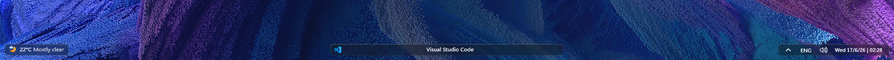
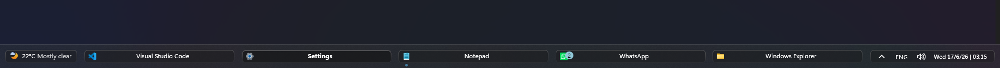
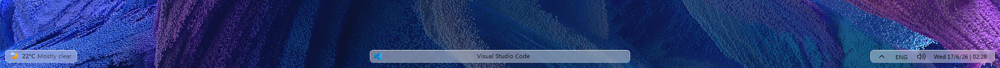
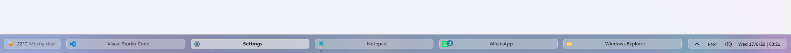

# Strips theme for Windows 11 Taskbar Styler

**Author**: [Deen-0x](https://github.com/Deen-0x)

## Dark Mode
Normal - One window

Maximized with multiple windows


## Light Mode
Normal - One window

Maximized with multiple windows


## Notes
- Theme is designed on Windows 11 - 25H2.
- Mainly designed for dark mode, but compatible with light mode as well.
- Designed to work with:
  - Widgets - On
  - Task view - Off
  - Search - Hidden
  - Taskbar alignment - Center
  - Show smaller taskbar buttons - Never

## Required Windhawk Mods for similar results
To achieve similar results, install and configure the following Windhawk mods in addition to Taskbar Styler:

- Taskbar Clock Customization – for styling the clock.

  <details>
  <summary>Click to expand Taskbar Clock Customization settings</summary>

  ```yaml
  ShowSeconds: 0
  TimeFormat: ''
  DateFormat: d/M/y
  WeekdayFormat: custom
  WeekdayFormatCustom: Sun, Mon, Tue, Wed, Thu, Fri, Sat
  TopLine: ''
  BottomLine: '%weekday% %date% | %time%'
  MiddleLine: '%weekday%'
  TooltipLine: '%web1_full%'
  TooltipLineMode: append
  Width: 180
  Height: 60
  MaxWidth: 0
  TextSpacing: 1
  DataCollection:
    NetworkMetricsFormat: mbs
    NetworkMetricsFixedDecimals: -1
    PercentageFormat: spacePaddingAndSymbol
    UpdateInterval: 1
    NetworkAdapterName: ''
    GpuAdapterName: ''
  MediaPlayer:
    IgnoredPlayers:
      - ''
    MaxLength: 28
    NoMediaText: No media
    RemoveBrackets: 0
  WebContentWeatherLocation: ''
  WebContentWeatherFormat: '%c 🌡️%t 🌬️%w'
  WebContentWeatherUnits: autoDetect
  WebContentsItems:
    - Url: https://rss.nytimes.com/services/xml/rss/nyt/World.xml
      BlockStart: <item>
      Start: <title>
      End: </title>
      ContentMode: xmlHtml
      SearchReplace:
        - Search: ''
          Replace: ''
      MaxLength: 28
  WebContentsUpdateInterval: 10
  TimeZones:
    - Eastern Standard Time
  TimeStyle:
    Hidden: 1
    TextColor: ''
    TextAlignment: Right
    FontSize: 0
    FontFamily: ''
    FontWeight: ''
    FontStyle: ''
    FontStretch: ''
    CharacterSpacing: 0
    Visible: 0
  DateStyle:
    Hidden: 0
    TextColor: ''
    TextAlignment: ''
    FontSize: 11
    FontFamily: ''
    FontWeight: Medium
    FontStyle: Normal
    FontStretch: ''
    CharacterSpacing: 0
  oldTaskbarOnWin11: 0
  ```
  </details><br>


- Taskbar Height and Icon Size

  <details>
  <summary>Click to expand Taskbar Height and Icon Size settings</summary>

  ```yaml
  TaskbarHeight: 46
  IconSize: 15
  TaskbarButtonWidth: 30
  IconSizeSmall: 14
  TaskbarButtonWidthSmall: 15
  ```
  </details><br>

- Taskbar Background Helper

  <details>
  <summary>Click to expand Taskbar Background Helper settings</summary>

  ```yaml
  backgroundStyle: acrylicBlur
  color:
    red: 200
    green: 200
    blue: 200
    accentColor: 0
    transparency: 150
  onlyWhenMaximized: 1
  excludedPrograms:
    - ''
  styleForDarkMode:
    use: 1
    backgroundStyle: acrylicBlur
    color:
      red: 40
      green: 40
      blue: 40
      accentColor: 0
      transparency: 255
  ```
  </details>


## Recommended visual Windhawk Mods
To achieve maximum Taskbar aesthetics, install and configure the following Windhawk mods.

- Taskbar tray system icon tweaks - to declutter the system tray icons (you may also disable the language indicator if you don't need it).
  <details>
  <summary>Click to expand Taskbar tray system icon tweaks settings</summary>

  ```yaml
  hideVolumeIcon: 0
  hideNetworkIcon: 1
  hideBatteryIcon: 1
  grayscaleBatteryIcon: 1
  hideMicrophoneIcon: 0
  hideGeolocationIcon: 1
  hideStudioEffectsIcon: 0
  hideRecallIcon: 0
  hideLanguageBar: 0
  hideLanguageSupplementaryIcons: 1
  hideBellIcon: never
  showDesktopButtonWidth: 12
  ```
  </details><br>

- Windows 11 Notification Center Styler - to remove Notification Center shadows copy the content below (flyout shadows look truncated with transparent taskbar).

  <details>
  <summary>Click to expand Windows 11 Notification Center Styler settings</summary>

  ```yaml
  controlStyles:
    - target: Grid#NotificationCenterGrid
      styles:
        - Shadow :=
    - target: Grid#CalendarCenterGrid
      styles:
        - Shadow :=
    - target: Grid#ControlCenterRegion
      styles:
        - Shadow :=
  ```
  </details><br>

- Windows 11 Start Menu Styler - to remove Start Menu shadows copy the content below (shadows look truncated with transparent taskbar).
  <details>
  <summary>Click to expand Windows 11 Start Menu Styler settings</summary>

  ```yaml
  controlStyles:
    - target: Windows.UI.Xaml.Controls.Border#DropShadow
      styles:
        - Visibility=Collapsed
    - target: Windows.UI.Xaml.Controls.Border#StartDropShadow
      styles:
        - Visibility=Collapsed
    - target: Windows.UI.Xaml.Controls.Border#RootGridDropShadow
      styles:
        - Visibility=Collapsed
    - target: Windows.UI.Xaml.Controls.Border#RightCompanionDropShadow
      styles:
        - Visibility=Collapsed
  ```
  </details>

## Recommended functional Windhawk Mods

To achieve compatible Taskbar functionality, install and configure the following Windhawk mods:

- Taskbar minimize/restore on scroll.
  <details>
  <summary>Click to expand Taskbar minimize/restore on scroll settings</summary>

  ```yaml
  scrollOverTaskbarButtons: 1
  scrollOverThumbnailPreviews: 1
  maximizeAndRestore: 0
  reverseScrollingDirection: 0
  oldTaskbarOnWin11: 0
  ```
  </details><br>

- Taskbar Volume Control - to control volume by mouse scroll wheel while hovering over the tray area.
  <details>
  <summary>Click to expand Taskbar Volume Control settings</summary>

  ```yaml
  volumeIndicator: win11
  scrollArea: notification_area
  additionalScrollRegions: ''
  middleClickToMute: 1
  ctrlScrollVolumeChange: 0
  scrollAnywhereKeys:
    shift: 0
    ctrl: 0
    alt: 0
    win: 0
  fullScreenScrolling: disabled
  noAutomaticMuteToggle: 0
  volumeChangeStep: 2
  oldTaskbarOnWin11: 0
  ```
  </details><br>

- Middle click to close on the taskbar.
  <details>
  <summary>Click to expand Middle click to close on the taskbar settings</summary>

  ```yaml
  multipleItemsBehavior: closeAll
  keysToEndTask:
    Ctrl: 1
    Alt: 0
  oldTaskbarOnWin11: 0
  ```
  </details><br>

- Taskbar Thumbnail Reorder.
</details>


## Theme selection

The theme is integrated into the mod and can be selected directly from the mod's
settings:

* Open the Windows 11 Taskbar Styler mod in Windhawk.
* Go to the "Settings" tab.
* Select the theme "Strips" and save the settings.

## Manual installation

The theme styles can also be imported manually. To do that, follow these steps:

* Open the Windows 11 Taskbar Styler mod in Windhawk.
* Go to the "Settings" tab and select "Textual mode".
* Copy the content below to the text box and click "Save settings".

<details>
<summary>Theme content to import (click to expand)</summary>

```yaml
styleConstants:
  - mainRadius = 6
  - transparent = <SolidColorBrush Color="Transparent"/>
  - base = <WindhawkBlur BlurAmount="2" TintColor="{ThemeResource SystemChromeMediumColor}" TintOpacity="0.3" TintLuminosityOpacity="0.3" NoiseOpacity="0.1" NoiseDensity="0.5" />
  - overlay = <WindhawkBlur BlurAmount="2" TintColor="{ThemeResource SystemChromeMediumLowColor}" TintOpacity="0.35" TintLuminosityOpacity="0.3" NoiseOpacity="0.1" NoiseDensity="0.5" />
  - overlay2 = <WindhawkBlur BlurAmount="2" TintColor="{ThemeResource SystemChromeMediumLowColor}" TintOpacity="0.5" TintLuminosityOpacity="0.3" NoiseOpacity="0.1" NoiseDensity="0.5" />
  - active = <WindhawkBlur BlurAmount="2" TintColor="{ThemeResource SystemChromeLowColor}" TintOpacity="0.55" TintLuminosityOpacity="0.3" NoiseOpacity="0.1" NoiseDensity="0.5" />
  - accent = <AcrylicBrush TintColor="{ThemeResource SystemAccentColor}"/>
  - BorderThickness=1
  - BorderBrush=<LinearGradientBrush StartPoint="0,0" EndPoint="0,1"><GradientStop Color="{ThemeResource AdaptiveLight}" Offset="0.0" /><GradientStop Color="{ThemeResource AdaptiveFade}" Offset="2" /></LinearGradientBrush>
controlStyles:
  - target: Taskbar.TaskbarFrame > Grid#RootGrid > Taskbar.TaskbarBackground > Grid > Rectangle#BackgroundFill
    styles:
      - Fill := $transparent
  - target: Rectangle#BackgroundStroke
    styles:
      - Fill := $transparent
  - target: Taskbar.TaskbarBackground#HoverFlyoutBackgroundControl
    styles:
      - Fill:=$base
      - CornerRadius = $mainRadius
  - target: Taskbar.TaskListButtonPanel@CommonStates > Border#BackgroundElement
    styles:
      - CornerRadius = $mainRadius
      - Background :=$base
      - Background@InactivePointerOver :=$overlay
      - Background@ActivePointerOver:=$overlay
      - Background@ActiveNormal :=$active
      - Margin = 0,7,0,6
  - target: Taskbar.TaskListButton#TaskListButton[AutomationProperties.Name=Copilot] > Taskbar.TaskListLabeledButtonPanel#IconPanel > Border#BackgroundElement
    styles:
      - Visibility = 1
  - target: Taskbar.SearchBoxButton
    styles:
      - Margin=0,0,2,0
  - target: Border#BackgroundElement
    styles:
      - BorderThickness=0
  - target: Taskbar.TaskListButton#TaskListButton
    styles:
      - Margin = 0,0,10,0
  - target: ScrollViewer > ScrollContentPresenter > Border > Grid > Taskbar.TaskbarFrame#TaskbarFrame > Grid#RootGrid > Microsoft.UI.Xaml.Controls.ItemsRepeater#TaskbarFrameRepeater > Taskbar.TaskListButton#TaskListButton > Taskbar.TaskListLabeledButtonPanel#IconPanel
    styles:
      - MinWidth=32
  - target: Taskbar.TaskListLabeledButtonPanel@CommonStates > Border#BackgroundElement
    styles:
      - BorderBrush:=$BorderBrush
      - CornerRadius = $mainRadius
      - BorderThickness:=$BorderThickness
      - Background@InactiveNormal :=$base
      - Background@ActiveNormal :=$active
      - Background@InactivePointerOver :=$overlay
      - Background@ActivePointerOver:=$overlay2
      - Background@ActivePressed:=$overlay2
      - Background@InactivePressed:=$base
      - Background@MultiWindowNormal:=$base
      - Background@MultiWindowActive:=$active
      - Background@MultiWindowPointerOver:=$overlay
      - Background@MultiWindowPressed:=$overlay
      - Margin = 0,7,0,6
  - target: Border#MultiWindowElement
    styles:
      - Width = 0
      - Height = 0
      - Padding = 0,0,0,0
      - Background:=$transparent
      - BorderThickness=0
  - target: Taskbar.TaskListLabeledButtonPanel > TextBlock#LabelControl
    styles:
      - HorizontalAlignment = Stretch
      - TextAlignment = Center
      - Margin=0,0,5,2
  - target: Grid#SystemTrayFrameGrid
    styles:
      - CornerRadius = $mainRadius
      - Background:=$base
      - BorderThickness:=$BorderThickness
      - BorderBrush:=$BorderBrush
      - Margin=-55,11,10,10
      - Padding=5,0,-5,0
  - target: ScrollViewer > ScrollContentPresenter > Border > Grid > Taskbar.TaskbarFrame#TaskbarFrame > Grid#RootGrid > Microsoft.UI.Xaml.Controls.ItemsRepeater#TaskbarFrameRepeater > Taskbar.AugmentedEntryPointButton#AugmentedEntryPointButton
    styles:
      - Margin=0,0,2,0
  - target: ScrollViewer > ScrollContentPresenter > Border > Grid > Taskbar.TaskbarFrame#TaskbarFrame > Grid#RootGrid > Microsoft.UI.Xaml.Controls.ItemsRepeater#TaskbarFrameRepeater > Taskbar.AugmentedEntryPointButton#AugmentedEntryPointButton > Taskbar.TaskListButtonPanel#ExperienceToggleButtonRootPanel > Border#BackgroundElement
    styles:
      - BorderThickness:=$BorderThickness
      - BorderBrush:=$BorderBrush
  - target: Border#LargeTicker2 > AdaptiveCards.Rendering.Uwp.WholeItemsPanel > Windows.UI.Xaml.Controls.TextBlock[2]
    styles:
      - RenderTransform:=<TranslateTransform X="30" Y="-8" />
      - ActualWidth=>WeatherTempWidth
  - target: Border#LargeTicker2 > AdaptiveCards.Rendering.Uwp.WholeItemsPanel > Windows.UI.Xaml.Controls.TextBlock[1]
    styles:
      - RenderTransform:=<TranslateTransform X="0" Y="8" />
      - ActualWidth=>WeatherCondWidth
  - target: ScrollViewer > ScrollContentPresenter > Border > Grid > Taskbar.TaskbarFrame#TaskbarFrame > Grid#RootGrid > Microsoft.UI.Xaml.Controls.ItemsRepeater#TaskbarFrameRepeater > Taskbar.AugmentedEntryPointButton#AugmentedEntryPointButton > Taskbar.TaskListButtonPanel#ExperienceToggleButtonRootPanel
    styles:
      - Width = {{WeatherTempWidth+WeatherCondWidth+50}}
      - Padding = 0,0,0,0
      - Margin = 10,4,0,4
  - target: ScrollViewer > ScrollContentPresenter > Border > Grid > Taskbar.TaskbarFrame#TaskbarFrame > Grid#RootGrid > Microsoft.UI.Xaml.Controls.ItemsRepeater#TaskbarFrameRepeater > Taskbar.AugmentedEntryPointButton#AugmentedEntryPointButton > Taskbar.TaskListButtonPanel#ExperienceToggleButtonRootPanel > Grid#AugmentedEntryPointContentGrid
    styles:
      - Margin = 7,0,0,0
  - target: Taskbar.TaskListLabeledButtonPanel#IconPanel > Image#OverlayIcon
    styles:
      - Height=15
      - Width=15
      - Margin=10,4,0,0
  - target: Taskbar.TaskListLabeledButtonPanel#IconPanel > Taskbar.Badge#BadgeControl
    styles:
      - Height=15
      - Width=15
      - Margin=0,2,0,0
      - RenderTransform := <TranslateTransform X="4" Y="2" />
      - HorizontalAlignment= 1
      - VerticalAlignment= 1
  - target: Grid#OverflowRootGrid > Border
    styles:
      - Shadow :=
  - target: Taskbar.TaskListLabeledButtonPanel@CommonStates > Rectangle#RunningIndicator
    styles:
      - Height=5
      - Width=5
      - RadiusX=30
      - RadiusY=30
      - StrokeThickness=0
      - Margin=12,1,0,0
      - VerticalAlignment=0
      - HorizontalAlignment=0
      - Canvas.ZIndex=1
      - Fill@MultiWindowNormal:=$accent
      - Fill@MultiWindowActive:=$accent
      - Fill@MultiWindowPointerOver:=$accent
      - Fill@MultiWindowPressed:=$accent
      - Fill=transparent
  - target: ScrollViewer > ScrollContentPresenter > Border > Grid > Taskbar.TaskbarFrame#TaskbarFrame > Grid#RootGrid > Microsoft.UI.Xaml.Controls.ItemsRepeater#TaskbarFrameRepeater > Taskbar.ExperienceToggleButton#LaunchListButton
    styles:
      - Margin=0,0,10,0
  - target: ScrollViewer > ScrollContentPresenter > Border > Grid > Taskbar.TaskbarFrame#TaskbarFrame > Grid#RootGrid > Microsoft.UI.Xaml.Controls.ItemsRepeater#TaskbarFrameRepeater > Taskbar.ExperienceToggleButton#LaunchListButton > Taskbar.TaskListButtonPanel#ExperienceToggleButtonRootPanel
    styles:
      - Height=0
      - Width=0
  - target: Taskbar.TaskListLabeledButtonPanel@CommonStates > TextBlock#LabelControl
    styles:
      - FontWeight = Normal
      - FontWeight@InactiveNormal = Normal
      - FontWeight@InactivePointerOver = Normal
      - FontWeight@InactivePressed = Normal
      - FontWeight@ActiveNormal = Bold
      - FontWeight@ActivePointerOver = Bold
      - FontWeight@ActivePressed = Bold
      - FontWeight@MultiWindowNormal = Normal
      - FontWeight@MultiWindowPointerOver = Normal
      - FontWeight@MultiWindowActive = Bold
      - FontWeight@MultiWindowPressed = Bold
themeResourceVariables:
  - AdaptiveLight@Light=#DCDCDC
  - AdaptiveLight@Dark=#CC646464
  - AdaptiveFade@Light=#00ffffff
  - AdaptiveFade@Dark=#00000000
```
</details>
