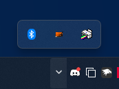
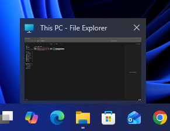

# SunValley theme for Windows 11 Taskbar Styler

This theme tries to replicate how the Windows 10 taskbar would've looked with the Windows 11 design, which includes:
* Windows 10-like system tray
* Redesigned acrylic with accent color support
* Windows 10-like search box
* Windows 10-like taskbar icon spacing/open indicators
* Custom Task View icon based on the Windows 10 1507-1709 design but with the same design as the 11 one
* New entrance animations for context menus and tooltips

#
**Author**: [Tails](https://github.com/milestprower92)
#
**Taskbar**

[](screenshot.png)

**Tray Overflow**

[](screenshot-overflow.png)

**Window Thumbnails**

[](screenshot-thumbnails.png)
#
## Theme selection

The theme is integrated into the mod and can simply be selected from the mod's
settings:

* Open the Windows 11 Taskbar Styler mod in Windhawk.
* Go to the "Settings" tab.
* Select the theme and save the settings.

## Manual installation

The theme styles can also be imported manually. To do that, follow these steps:

* Open the Windows 11 Taskbar Styler mod in Windhawk.
* Go to the "Advanced" tab.
* Copy the content below to the text box under "Mod settings" and click "Save".

<details>
<summary>Content to import (click to expand)</summary>

```json
{
"controlStyles[0].target":"Taskbar.SearchBoxButton#SearchBoxButton > Taskbar.TaskListButtonPanel#ExperienceToggleButtonRootPanel > Windows.UI.Xaml.Controls.Border#BackgroundElement", 
"controlStyles[0].styles[0]":"CornerRadius=4", 
"controlStyles[0].styles[1]":"BorderThickness=0,1,0,0", 
"controlStyles[1].target":"Taskbar.SearchBoxButton", 
"controlStyles[1].styles[0]":"Margin=0", 
"controlStyles[2].target":"SystemTray.OmniButton#NotificationCenterButton > Grid > ContentPresenter > ItemsPresenter > StackPanel > ContentPresenter > SystemTray.IconView#SystemTrayIcon > Grid > Grid > SystemTray.TextIconContent > Windows.UI.Xaml.Controls.Grid > SystemTray.AdaptiveTextBlock#Base > Windows.UI.Xaml.Controls.TextBlock", 
"controlStyles[2].styles[0]":"Text=‎ ‎‎‎ ", 
"controlStyles[2].styles[1]":"FontSize=17.3", 
"controlStyles[2].styles[2]":"Width=30", 
"controlStyles[2].styles[3]":"FontWeight=ExtraLight", 
"controlStyles[2].styles[4]":"Foreground:=<SolidColorBrush Color=\"{ThemeResource SystemBaseHighColor}\" />", 
"controlStyles[3].target":"Windows.UI.Xaml.Controls.FontIcon#SearchBoxFontIcon", 
"controlStyles[3].styles[0]":"FontFamily=Segoe Fluent Icons", 
"controlStyles[4].target":"SearchUx.SearchUI.SearchBoxButton#SearchBox > SearchUx.SearchUI.SearchButtonRootGrid#SearchBoxButtonRootPanel > Windows.UI.Xaml.Controls.TextBlock#SearchBoxTextBlock", 
"controlStyles[4].styles[0]":"Text=Type here to search", 
"controlStyles[4].styles[1]":"FontSize=15", 
"controlStyles[4].styles[2]":"FontFamily=Segoe UI Variable Text", 
"controlStyles[4].styles[3]":"Margin=35,0,0,0", 
"controlStyles[5].target":"SystemTray.NotifyIconView#NotifyItemIcon", 
"controlStyles[5].styles[0]":"CornerRadius=3", 
"controlStyles[5].styles[1]":"Height=Auto", 
"controlStyles[5].styles[2]":"Margin=0,0,0,0", 
"controlStyles[5].styles[3]":"Padding=0,4,0,2", 
"controlStyles[5].styles[4]":"BorderThickness=0,1,0,0", 
"controlStyles[6].target":"SystemTray.ChevronIconView", 
"controlStyles[6].styles[0]":"CornerRadius=3", 
"controlStyles[6].styles[1]":"Height=Auto", 
"controlStyles[6].styles[2]":"Width=24", 
"controlStyles[6].styles[3]":"BorderThickness=0,1,0,0", 
"controlStyles[6].styles[4]":"Padding=0,2,0,2", 
"controlStyles[7].target":"Windows.UI.Xaml.Controls.Grid > Windows.UI.Xaml.Controls.Button#GleamEntryPointButton > Windows.UI.Xaml.Controls.Border", 
"controlStyles[7].styles[0]":"CornerRadius=4", 
"controlStyles[8].target":"Windows.UI.Xaml.Controls.Grid#DynamicSearchBoxGleamContainer", 
"controlStyles[8].styles[0]":"CornerRadius=3", 
"controlStyles[9].target":"SystemTray.OmniButton#NotificationCenterButton", 
"controlStyles[9].styles[0]":"CornerRadius=3", 
"controlStyles[9].styles[1]":"Padding=0,2,0,2", 
"controlStyles[9].styles[2]":"Margin=0,0,5,0", 
"controlStyles[9].styles[3]":"BorderThickness=0,1,0,0", 
"controlStyles[10].target":"SystemTray.Stack#NonActivatableStack", 
"controlStyles[10].styles[0]":"Height=Auto", 
"controlStyles[10].styles[1]":"CornerRadius=3", 
"controlStyles[10].styles[2]":"Margin=0,0,0,0", 
"controlStyles[10].styles[3]":"Padding=0,2,0,2", 
"controlStyles[10].styles[4]":"BorderThickness=0,1,0,0", 
"controlStyles[10].styles[5]":"Grid.Column=4", 
"controlStyles[11].target":"Rectangle#ShowDesktopPipe@CommonStates", 
"controlStyles[11].styles[0]":"Width=9", 
"controlStyles[11].styles[1]":"Margin=0,0,-10,0", 
"controlStyles[11].styles[2]":"Height=500", 
"controlStyles[11].styles[3]":"Fill@Active:=<AcrylicBrush TintColor=\"{ThemeResource SystemBaseLowColor}\" TintOpacity=\"0.5\" Opacity=\"0\"/>", 
"controlStyles[11].styles[4]":"Stroke:=<SolidColorBrush Color=\"{ThemeResource SystemBaseHighColor}\" Opacity=\"0.3\"/>", 
"controlStyles[12].target":"SystemTray.OmniButton#ControlCenterButton", 
"controlStyles[12].styles[0]":"Padding=0,2,0,2", 
"controlStyles[12].styles[1]":"CornerRadius=3", 
"controlStyles[12].styles[2]":"Margin=0,0,0,0", 
"controlStyles[12].styles[3]":"BorderThickness=0,1,0,0", 
"controlStyles[12].styles[4]":"Grid.Column=3", 
"controlStyles[13].target":"SystemTray.AdaptiveTextBlock#LanguageInnerTextBlock > TextBlock#InnerTextBlock", 
"controlStyles[13].styles[0]":"FontFamily=Segoe UI Variable Text", 
"controlStyles[13].styles[1]":"Margin=-8,0,0,0", 
"controlStyles[13].styles[2]":"FontSize=12", 
"controlStyles[14].target":"SystemTray.SystemTrayFrame > Windows.UI.Xaml.Controls.Grid#SystemTrayFrameGrid > SystemTray.Stack#NotifyIconStack > Windows.UI.Xaml.Controls.Grid#Content > SystemTray.StackListView#IconStack > Windows.UI.Xaml.Controls.ItemsPresenter > Windows.UI.Xaml.Controls.StackPanel > Windows.UI.Xaml.Controls.ContentPresenter > SystemTray.ChevronIconView > Windows.UI.Xaml.Controls.Grid#ContainerGrid > Windows.UI.Xaml.Controls.ContentPresenter#ContentPresenter > Windows.UI.Xaml.Controls.Grid#ContentGrid > SystemTray.TextIconContent > Windows.UI.Xaml.Controls.Grid#ContainerGrid > SystemTray.AdaptiveTextBlock#Base > Windows.UI.Xaml.Controls.TextBlock#InnerTextBlock", 
"controlStyles[14].styles[0]":"FontFamily=Segoe Fluent Icons", 
"controlStyles[14].styles[1]":"FontSize=12.4", 
"controlStyles[14].styles[2]":"Foreground:=<SolidColorBrush Color=\"{ThemeResource SystemBaseHighColor}\" />", 
"controlStyles[15].target":"SystemTray.SystemTrayFrame > Windows.UI.Xaml.Controls.Grid#SystemTrayFrameGrid > SystemTray.Stack#NotifyIconStack > Windows.UI.Xaml.Controls.Grid#Content > SystemTray.StackListView#IconStack > Windows.UI.Xaml.Controls.ItemsPresenter > Windows.UI.Xaml.Controls.StackPanel > Windows.UI.Xaml.Controls.ContentPresenter", 
"controlStyles[15].styles[0]":"Width=30", 
"controlStyles[16].target":"SystemTray.AdaptiveTextBlock#Base > Windows.UI.Xaml.Controls.TextBlock#InnerTextBlock", 
"controlStyles[16].styles[0]":"FontFamily=Segoe Fluent Icons", 
"controlStyles[16].styles[1]":"Foreground:=<SolidColorBrush Color=\"{ThemeResource SystemBaseHighColor}\" />", 
"controlStyles[17].target":"SystemTray.AdaptiveTextBlock#AccentOverlay > Windows.UI.Xaml.Controls.TextBlock#InnerTextBlock", 
"controlStyles[17].styles[0]":"FontFamily=Segoe Fluent Icons", 
"controlStyles[18].target":"SystemTray.AdaptiveTextBlock#Underlay > Windows.UI.Xaml.Controls.TextBlock#InnerTextBlock", 
"controlStyles[18].styles[0]":"FontFamily=Segoe Fluent Icons", 
"controlStyles[19].target":"SystemTray.OmniButton#ControlCenterButton > Grid > ContentPresenter > ItemsPresenter > StackPanel > ContentPresenter[1] > SystemTray.IconView > Grid > Grid", 
"controlStyles[19].styles[0]":"Margin=-3,0,0,0", 
"controlStyles[20].target":"SystemTray.Stack#MainStack > Windows.UI.Xaml.Controls.Grid#Content", 
"controlStyles[20].styles[0]":"CornerRadius=3", 
"controlStyles[20].styles[1]":"Height=Auto", 
"controlStyles[20].styles[2]":"Margin=0,0,0,0", 
"controlStyles[20].styles[3]":"Padding=0,4,0,4", 
"controlStyles[20].styles[4]":"BorderThickness=0,1,0,0", 
"controlStyles[21].target":"Windows.UI.Xaml.Controls.StackPanel > Windows.UI.Xaml.Controls.TextBlock#TimeInnerTextBlock", 
"controlStyles[21].styles[0]":"FontFamily=Segoe UI Variable Display", 
"controlStyles[21].styles[1]":"TextAlignment=0", 
"controlStyles[21].styles[2]":"FontSize=12", 
"controlStyles[21].styles[3]":"Margin=0,1,0,0", 
"controlStyles[22].target":"Windows.UI.Xaml.Controls.StackPanel > Windows.UI.Xaml.Controls.TextBlock#DateInnerTextBlock", 
"controlStyles[22].styles[0]":"FontFamily=Segoe UI Variable", 
"controlStyles[22].styles[1]":"TextAlignment=0", 
"controlStyles[22].styles[2]":"FontSize=12", 
"controlStyles[22].styles[3]":"Margin=0,0,0,0", 
"controlStyles[23].target":"SystemTray.NotificationAreaIcons#NotificationAreaIcons > Windows.UI.Xaml.Controls.ItemsPresenter > Windows.UI.Xaml.Controls.StackPanel > Windows.UI.Xaml.Controls.ContentPresenter", 
"controlStyles[23].styles[0]":"Width=23", 
"controlStyles[23].styles[1]":"Margin=0,-2,0,0", 
"controlStyles[24].target":"SystemTray.NotificationAreaIcons#NotificationAreaIcons > Windows.UI.Xaml.Controls.ItemsPresenter > Windows.UI.Xaml.Controls.StackPanel > Windows.UI.Xaml.Controls.ContentPresenter > SystemTray.NotifyIconView#NotifyItemIcon > Windows.UI.Xaml.Controls.Grid#ContainerGrid", 
"controlStyles[24].styles[0]":"Transform3D:=<CompositeTransform3D TranslateY=\"0\" TranslateX=\"0\" />", 
"controlStyles[24].styles[1]":"HorizontalAlignment=0", 
"controlStyles[25].target":"SystemTray.Stack#NotifyIconStack", 
"controlStyles[25].styles[0]":"Width=24", 
"controlStyles[26].target":"SystemTray.OmniButton#ControlCenterButton > Grid > ContentPresenter > ItemsPresenter > StackPanel > ContentPresenter > SystemTray.IconView#SystemTrayIcon > Grid > Grid > SystemTray.TextIconContent > Windows.UI.Xaml.Controls.Grid > SystemTray.AdaptiveTextBlock > Windows.UI.Xaml.Controls.TextBlock", 
"controlStyles[26].styles[0]":"FontSize=16", 
"controlStyles[26].styles[1]":"Margin=0,-1,-0,0", 
"controlStyles[26].styles[2]":"FontWeight=0", 
"controlStyles[27].target":"SystemTray.CopilotIcon#CopilotIcon", 
"controlStyles[27].styles[0]":"Visibility=Visible", 
"controlStyles[27].styles[1]":"Padding=2", 
"controlStyles[27].styles[2]":"Height=61", 
"controlStyles[28].target":"SystemTray.NotificationAreaOverflow > Windows.UI.Xaml.Controls.Grid#OverflowRootGrid > Windows.UI.Xaml.Controls.Border#OverflowFlyoutBackgroundBorder", 
"controlStyles[28].styles[0]":"CornerRadius=7", 
"controlStyles[28].styles[1]":"Background:=<AcrylicBrush TintColor=\"{ThemeResource SystemChromeMediumHighColor}\" TintOpacity=\"0\" TintLuminosityOpacity=\"0.8\" FallbackColor=\"{ThemeResource SystemChromeMediumColor}\" />", 
"controlStyles[28].styles[2]":"Margin=0,0,0,0", 
"controlStyles[28].styles[3]":"BorderBrush:=<SolidColorBrush Color=\"{ThemeResource SystemChromeHighColor}\" Opacity=\"0.5\" />", 
"controlStyles[28].styles[4]":"BorderThickness=1", 
"controlStyles[29].target":"SystemTray.NotificationAreaOverflow > Windows.UI.Xaml.Controls.Grid#OverflowRootGrid > Windows.UI.Xaml.Controls.ItemsControl > Windows.UI.Xaml.Controls.ItemsPresenter > Windows.UI.Xaml.Controls.WrapGrid", 
"controlStyles[29].styles[0]":"Margin=0,0,0,0", 
"controlStyles[30].target":"SystemTray.NotifyIconView", 
"controlStyles[30].styles[0]":"CornerRadius=3", 
"controlStyles[31].target":"Windows.UI.Xaml.Controls.ScrollViewer > Windows.UI.Xaml.Controls.ScrollContentPresenter > Windows.UI.Xaml.Controls.Border > SystemTray.NotificationAreaOverflow", 
"controlStyles[31].styles[0]":"Transform3D:=<CompositeTransform3D TranslateY=\"0\" />", 
"controlStyles[32].target":"SystemTray.OmniButton#ControlCenterButton", 
"controlStyles[32].styles[0]":"Visibility=Visible", 
"controlStyles[33].target":"Taskbar.TaskbarBackground#BackgroundControl > Grid", 
"controlStyles[33].styles[0]":"Background:=<AcrylicBrush TintColor=\"{ThemeResource SystemChromeAltHighColor}\" TintOpacity=\"0.4\" TintLuminosityOpacity=\"0.4\" FallbackColor=\"{ThemeResource SystemChromeMediumColor}\" />", 
"controlStyles[34].target":"Taskbar.TaskbarBackground#BackgroundControl > Grid > Windows.UI.Xaml.Shapes.Rectangle#BackgroundFill", 
"controlStyles[34].styles[0]":"Opacity=0.5", 
"controlStyles[35].target":"Windows.UI.Xaml.Shapes.Rectangle#BackgroundStroke", 
"controlStyles[35].styles[0]":"Opacity=0.5", 
"controlStyles[36].target":"SystemTray.OmniButton#ControlCenterButton > Grid > ContentPresenter > ItemsPresenter > StackPanel > ContentPresenter[3] > SystemTray.IconView > Grid > Grid", 
"controlStyles[36].styles[0]":"Margin=2,0,-4,0", 
"controlStyles[36].styles[1]":"RenderTransform:=<ScaleTransform ScaleX=\"1\" /> ", 
"controlStyles[37].target":"Windows.UI.Xaml.Controls.ContentPresenter#HoverFlyoutContent", 
"controlStyles[37].styles[0]":"CornerRadius=7", 
"controlStyles[37].styles[1]":"Margin=0,0,0,0", 
"controlStyles[37].styles[2]":"Background:=<AcrylicBrush TintColor=\"{ThemeResource SystemChromeMediumHighColor}\" TintOpacity=\"0\" TintLuminosityOpacity=\"0.8\" FallbackColor=\"{ThemeResource SystemChromeMediumColor}\" />", 
"controlStyles[37].styles[3]":"BorderBrush:=<SolidColorBrush Color=\"{ThemeResource SystemChromeHighColor}\" Opacity=\"0.5\" />", 
"controlStyles[37].styles[4]":"BorderThickness=1", 
"controlStyles[38].target":"Taskbar.TaskItemThumbnailView > Grid > TextBlock", 
"controlStyles[38].styles[0]":"FontFamily=Segoe UI", 
"controlStyles[38].styles[1]":"FontSize=12", 
"controlStyles[38].styles[2]":"Margin=3,0,8,8", 
"controlStyles[39].target":"Taskbar.TaskItemThumbnailView > Windows.UI.Xaml.Controls.Grid > Microsoft.UI.Xaml.Controls.ItemsRepeater > Windows.UI.Xaml.Controls.Image", 
"controlStyles[39].styles[0]":"Margin=0,-7,0,0", 
"controlStyles[40].target":"Taskbar.TaskItemThumbnailView > Grid > Button > ContentPresenter > TextBlock", 
"controlStyles[40].styles[0]":"FontFamily=Segoe Fluent Icons", 
"controlStyles[41].target":"Taskbar.TaskItemThumbnailView > Grid > Button", 
"controlStyles[41].styles[0]":"CornerRadius=4", 
"controlStyles[41].styles[1]":"Height=31", 
"controlStyles[41].styles[2]":"Margin=0,0,0,8", 
"controlStyles[41].styles[3]":"Width=31", 
"controlStyles[42].target":"Grid#DetailedViewGrid", 
"controlStyles[42].styles[0]":"Margin=0,-7,0,0", 
"controlStyles[43].target":"Taskbar.TaskItemThumbnailView > Grid > Border", 
"controlStyles[43].styles[0]":"BorderBrush:=<SolidColorBrush Color=\"{ThemeResource SystemBaseHighColor}\" Opacity=\"0.5\" />", 
"controlStyles[43].styles[1]":"CornerRadius=0", 
"controlStyles[44].target":"SystemTray.OmniButton#NotificationCenterButton > Windows.UI.Xaml.Controls.Grid > Windows.UI.Xaml.Controls.ContentPresenter > Windows.UI.Xaml.Controls.ItemsPresenter > Windows.UI.Xaml.Controls.StackPanel > Windows.UI.Xaml.Controls.ContentPresenter > SystemTray.IconView > Windows.UI.Xaml.Controls.Grid > Windows.UI.Xaml.Controls.ContentPresenter > Windows.UI.Xaml.Controls.Grid > SystemTray.TextIconContent > Windows.UI.Xaml.Controls.Grid > SystemTray.AdaptiveTextBlock#Base > Windows.UI.Xaml.Controls.TextBlock", 
"controlStyles[44].styles[0]":"Text=‎", 
"controlStyles[44].styles[1]":"FontWeight=Light", 
"controlStyles[44].styles[2]":"FontSize=17.3", 
"controlStyles[44].styles[3]":"Foreground:=<SolidColorBrush Color=\"{ThemeResource SystemBaseHighColor}\" />", 
"controlStyles[44].styles[4]":"Margin=-0.5,0,1,0", 
"controlStyles[45].target":"SystemTray.OmniButton#NotificationCenterButton > Windows.UI.Xaml.Controls.Grid > Windows.UI.Xaml.Controls.ContentPresenter > Windows.UI.Xaml.Controls.ItemsPresenter > Windows.UI.Xaml.Controls.StackPanel > Windows.UI.Xaml.Controls.ContentPresenter > SystemTray.IconView", 
"controlStyles[45].styles[0]":"CornerRadius=0", 
"controlStyles[45].styles[1]":"Padding=0,0,0,0", 
"controlStyles[46].target":"SystemTray.DateTimeIconContent > Windows.UI.Xaml.Controls.Grid > Windows.UI.Xaml.Controls.StackPanel > Windows.UI.Xaml.Controls.TextBlock", 
"controlStyles[46].styles[0]":"FontFamily=Segoe UI", 
"controlStyles[46].styles[1]":"TextAlignment=Center", 
"controlStyles[47].target":"SystemTray.OmniButton#ControlCenterButton > Grid > ContentPresenter > ItemsPresenter > StackPanel > ContentPresenter[2] > SystemTray.IconView > Grid > Grid", 
"controlStyles[47].styles[0]":"Margin=0,0,-3,0", 
"controlStyles[48].target":"Taskbar.ThumbBarButton > ContentPresenter", 
"controlStyles[48].styles[0]":"CornerRadius=4", 
"controlStyles[48].styles[1]":"Background:=<SolidColorBrush Color=\"{ThemeResource SystemChromeMediumHighColor}\" Opacity=\"0.3\" />", 
"controlStyles[48].styles[2]":"BorderBrush:=<SolidColorBrush Color=\"{ThemeResource SystemChromeHighColor}\" Opacity=\"0.3\" />", 
"controlStyles[48].styles[3]":"BorderThickness=1", 
"controlStyles[49].target":"Taskbar.ThumbBarButton > ContentPresenter > Image", 
"controlStyles[49].styles[0]":"Height=15", 
"controlStyles[49].styles[1]":"Width=15", 
"controlStyles[50].target":"SearchUx.SearchUI.SearchButtonRootGrid > Border", 
"controlStyles[50].styles[0]":"CornerRadius=4", 
"controlStyles[51].target":"TextBlock#BatteryTextBlock", 
"controlStyles[51].styles[0]":"FontFamily=Segoe UI Variable Text", 
"controlStyles[51].styles[1]":"Margin=2,0,-2,0", 
"controlStyles[52].target":"SystemTray.BatteryIconContent > Grid > Windows.UI.Xaml.Controls.StackPanel > Grid > TextBlock", 
"controlStyles[52].styles[0]":"RenderTransform:=<ScaleTransform ScaleX=\"1\" />", 
"controlStyles[53].target":"SystemTray.IconView#SystemTrayIcon > Grid#ContainerGrid > Border#BackgroundBorder", 
"controlStyles[53].styles[0]":"CornerRadius=0", 
"controlStyles[53].styles[1]":"Opacity=0", 
"controlStyles[54].target":"Windows.UI.Xaml.Controls.Button#GleamEntryPointButton > Windows.UI.Xaml.Controls.Border > Windows.UI.Xaml.Controls.ContentPresenter", 
"controlStyles[54].styles[0]":"CornerRadius=3", 
"controlStyles[55].target":"SearchUx.SearchUI.SearchButtonRootGrid ", 
"controlStyles[55].styles[0]":"Margin=2,0,2,0", 
"controlStyles[56].target":"SystemTray.ChevronIconView > Grid > ContentPresenter", 
"controlStyles[56].styles[0]":"Transform3D:=<CompositeTransform3D TranslateY=\"-1\" TranslateX=\"2\" />", 
"controlStyles[56].styles[1]":"HorizontalAlignment=0", 
"controlStyles[57].target":"Border#SearchPillBackgroundElement", 
"controlStyles[57].styles[0]":"CornerRadius=4", 
"controlStyles[58].target":"Grid#ConfirmatorMainGrid", 
"controlStyles[58].styles[0]":"Background:=<AcrylicBrush TintColor=\"{ThemeResource SystemChromeMediumHighColor}\" TintOpacity=\"0\" TintLuminosityOpacity=\"0.8\" FallbackColor=\"{ThemeResource SystemChromeMediumColor}\" />", 
"controlStyles[58].styles[1]":"BorderBrush:=<SolidColorBrush Color=\"{ThemeResource SystemChromeHighColor}\" Opacity=\"0.5\" />", 
"controlStyles[58].styles[2]":"CornerRadius=6", 
"controlStyles[58].styles[3]":"BorderThickness=1", 
"controlStyles[59].target":"Slider > Grid > Grid > Grid > Windows.UI.Xaml.Controls.Primitives.Thumb#HorizontalThumb", 
"controlStyles[59].styles[0]":"Visibility=Visible", 
"controlStyles[59].styles[1]":"Height=18", 
"controlStyles[59].styles[2]":"Width=18", 
"controlStyles[60].target":"Slider > Grid > Grid > Grid > Windows.UI.Xaml.Controls.Primitives.Thumb#HorizontalThumb > Border", 
"controlStyles[60].styles[0]":"BorderBrush:=<AcrylicBrush TintColor=\"{ThemeResource SystemChromeLowColor}\" TintOpacity=\"0.7\" TintLuminosityOpacity=\"0.7\" FallbackColor=\"{ThemeResource SystemChromeMediumColor}\" />", 
"controlStyles[60].styles[1]":"BorderThickness=4", 
"controlStyles[60].styles[2]":"Background:=<SolidColorBrush Color=\"{ThemeResource SystemAccentColorLight1}\" />", 
"controlStyles[60].styles[3]":"CornerRadius=10", 
"controlStyles[61].target":"Slider > Grid > Grid > Grid > Rectangle#HorizontalDecreaseRect", 
"controlStyles[61].styles[0]":"Fill:=<SolidColorBrush Color=\"{ThemeResource SystemAccentColorLight1}\" />", 
"controlStyles[62].target":"Slider > Grid > Grid > Grid > Windows.UI.Xaml.Controls.Primitives.Thumb#HorizontalThumb", 
"controlStyles[62].styles[0]":"BorderBrush:=<AcrylicBrush TintColor=\"{ThemeResource SystemChromeHighColor}\" TintOpacity=\"0.7\" TintLuminosityOpacity=\"0.7\" FallbackColor=\"{ThemeResource SystemChromeMediumColor}\" />", 
"controlStyles[62].styles[1]":"BorderThickness=0,1,0,0", 
"controlStyles[63].target":"SearchUx.SearchUI.SearchBoxButton", 
"controlStyles[63].styles[0]":"Width=340", 
"controlStyles[64].target":"SearchUx.SearchUI.SearchBoxButton > SearchUx.SearchUI.SearchButtonRootGrid", 
"controlStyles[64].styles[0]":"Width=340", 
"controlStyles[64].styles[1]":"Margin=-5,-6,-4,-6", 
"controlStyles[65].target":"SearchUx.SearchUI.SearchBoxButton > SearchUx.SearchUI.SearchButtonRootGrid > Grid", 
"controlStyles[65].styles[0]":"Margin=0,-1,-1,-1", 
"controlStyles[65].styles[1]":"Width=80", 
"controlStyles[65].styles[2]":"Transitions:=<TransitionCollection>              <ContentThemeTransition/>           </TransitionCollection> ", 
"controlStyles[66].target":"SearchUx.SearchUI.SearchBoxButton > SearchUx.SearchUI.SearchButtonRootGrid > Grid > Grid > Image", 
"controlStyles[66].styles[0]":"Width=80", 
"controlStyles[66].styles[1]":"Height=40", 
"controlStyles[67].target":"Taskbar.ExperienceToggleButton#LaunchListButton[AutomationProperties.AutomationId=StartButton] > Taskbar.TaskListButtonPanel", 
"controlStyles[67].styles[0]":"Width=48", 
"controlStyles[67].styles[1]":"Background:=<ImageBrush Stretch=\"Uniform\" ImageSource=\"https://i.imgur.com/1nLvznS.png\" />", 
"controlStyles[68].target":"Taskbar.ExperienceToggleButton#LaunchListButton[AutomationProperties.AutomationId=StartButton] > Taskbar.TaskListButtonPanel > Microsoft.UI.Xaml.Controls.AnimatedVisualPlayer#Icon", 
"controlStyles[68].styles[0]":"Visibility=Collapsed", 
"controlStyles[69].target":"ToolTip > ContentPresenter > TextBlock", 
"controlStyles[69].styles[0]":"FontFamily=Segoe UI Variable Text", 
"controlStyles[69].styles[1]":"FontSize=13", 
"controlStyles[69].styles[2]":"Margin=0,1,0,-2", 
"controlStyles[70].target":"ToolTip > ContentPresenter > StackPanel > TextBlock", 
"controlStyles[70].styles[0]":"FontFamily=Segoe UI Variable Text", 
"controlStyles[70].styles[1]":"FontSize=13", 
"controlStyles[70].styles[2]":"Margin=0,1,0,-2", 
"controlStyles[71].target":"ToolTip", 
"controlStyles[71].styles[0]":"Background:=<AcrylicBrush TintColor=\"{ThemeResource SystemChromeMediumHighColor}\" TintOpacity=\"0\" TintLuminosityOpacity=\"0.8\" FallbackColor=\"{ThemeResource SystemChromeMediumColor}\" />", 
"controlStyles[71].styles[1]":"BorderBrush:=<SolidColorBrush Color=\"{ThemeResource SystemChromeHighColor}\" Opacity=\"0.5\" />", 
"controlStyles[71].styles[2]":"BorderThickness=1", 
"controlStyles[72].target":"ToolTip > ContentPresenter", 
"controlStyles[72].styles[0]":"Transitions:=<TransitionCollection>              <ContentThemeTransition VerticalOffset=\"60\" />           </TransitionCollection> ", 
"controlStyles[73].target":"Taskbar.AugmentedEntryPointButton#AugmentedEntryPointButton[AutomationProperties.AutomationId=WidgetsButton] > Taskbar.TaskListButtonPanel#ExperienceToggleButtonRootPanel", 
"controlStyles[73].styles[0]":"Padding=0,2,0,2", 
"controlStyles[74].target":"TextBlock#VirtualDesktopNameBlock", 
"controlStyles[74].styles[0]":"FontFamily=Segoe UI Variable Text", 
"controlStyles[74].styles[1]":"FontSize=13", 
"controlStyles[75].target":"Grid#RootGrid > Grid#TitleGrid > TextBlock#DisplayName", 
"controlStyles[75].styles[0]":"FontFamily=Segoe UI Variable Text", 
"controlStyles[75].styles[1]":"FontSize=13", 
"controlStyles[76].target":"Grid#MainGrid > TextBlock", 
"controlStyles[76].styles[0]":"FontFamily=Segoe UI Variable Text", 
"controlStyles[76].styles[1]":"FontSize=13", 
"controlStyles[77].target":"Windows.UI.Xaml.Controls.Border#BackgroundDimmingLayer", 
"controlStyles[77].styles[0]":"Background:=<AcrylicBrush TintColor=\"{ThemeResource SystemChromeMediumHighColor}\" TintOpacity=\"0\" TintLuminosityOpacity=\"0.7\" FallbackColor=\"{ThemeResource SystemChromeMediumColor}\" />", 
"controlStyles[78].target":"Taskbar.ExperienceToggleButton#LaunchListButton[AutomationProperties.AutomationId=TaskViewButton] > Taskbar.TaskListButtonPanel > Microsoft.UI.Xaml.Controls.AnimatedVisualPlayer#Icon", 
"controlStyles[78].styles[0]":"RenderTransform:=<ScaleTransform ScaleX=\"1.1\" ScaleY=\"0.9\" />", 
"controlStyles[78].styles[1]":"Transform3D:=<CompositeTransform3D TranslateY=\"2\" TranslateX=\"-2\" />", 
"controlStyles[78].styles[2]":"FlowDirection=1", 
"controlStyles[79].target":"Windows.UI.Xaml.Controls.Grid#ModalRootGrid > Windows.UI.Xaml.Controls.Border#BackgroundElement", 
"controlStyles[79].styles[0]":"Background:=<AcrylicBrush TintColor=\"{ThemeResource SystemChromeMediumHighColor}\" TintOpacity=\"0.2\" TintLuminosityOpacity=\"0.9\" FallbackColor=\"{ThemeResource SystemChromeMediumColor}\" />", 
"controlStyles[79].styles[1]":"Transitions:=<TransitionCollection>              <ContentThemeTransition VerticalOffset=\"-1000\" />           </TransitionCollection> ", 
"controlStyles[80].target":"SearchUx.SearchUI.SearchBoxButton > SearchUx.SearchUI.SearchButtonRootGrid > Microsoft.UI.Xaml.Controls.AnimatedVisualPlayer", 
"controlStyles[80].styles[0]":"Height=18", 
"controlStyles[80].styles[1]":"Width=18", 
"controlStyles[80].styles[2]":"Transform3D:=<CompositeTransform3D TranslateX=\"0\" />", 
"controlStyles[81].target":"SearchUx.SearchUI.SearchPillButton > SearchUx.SearchUI.SearchButtonRootGrid", 
"controlStyles[81].styles[0]":"Margin=-3,-6,-3,-6", 
"controlStyles[81].styles[1]":"Width=346", 
"controlStyles[82].target":"SearchUx.SearchUI.SearchPillButton > SearchUx.SearchUI.SearchButtonRootGrid > Grid#SearchBoxContentGrid", 
"controlStyles[82].styles[0]":"HorizontalAlignment=0", 
"controlStyles[83].target":"SearchUx.SearchUI.SearchPillButton > SearchUx.SearchUI.SearchButtonRootGrid > Grid#SearchBoxContentGrid > FontIcon", 
"controlStyles[83].styles[0]":"Transform3D:=<CompositeTransform3D TranslateY=\"-1\" TranslateX=\"-10.5\" />", 
"controlStyles[83].styles[1]":"FontSize=19.4", 
"controlStyles[83].styles[2]":"FontFamily=Segoe Fluent Icons", 
"controlStyles[83].styles[3]":"FontWeight=SemiLight", 
"controlStyles[83].styles[4]":"Opacity=0.7", 
"controlStyles[83].styles[5]":"Grid.Column=0", 
"controlStyles[83].styles[6]":"HorizontalAlignment=0", 
"controlStyles[84].target":"SearchUx.SearchUI.SearchPillButton > SearchUx.SearchUI.SearchButtonRootGrid > Grid#SearchBoxContentGrid > TextBlock", 
"controlStyles[84].styles[0]":"Transform3D:=<CompositeTransform3D TranslateX=\"-5\" />", 
"controlStyles[84].styles[1]":"FontFamily=Segoe UI", 
"controlStyles[84].styles[2]":"Opacity=0.7", 
"controlStyles[84].styles[3]":"Text=Type here to search", 
"controlStyles[84].styles[4]":"Grid.Column=1", 
"controlStyles[84].styles[5]":"HorizontalAlignment=0", 
"controlStyles[84].styles[6]":"FontSize=15", 
"controlStyles[85].target":"SearchUx.SearchUI.SearchPillButton > SearchUx.SearchUI.SearchButtonRootGrid > Border#SearchPillBackgroundElement", 
"controlStyles[85].styles[0]":"CornerRadius=4", 
"controlStyles[85].styles[1]":"BorderThickness=1", 
"controlStyles[85].styles[2]":"BorderBrush:=<SolidColorBrush Color=\"{ThemeResource SystemChromeHighColor}\" Opacity=\"0.7\" />", 
"controlStyles[86].target":"Grid#SearchBoxContentGrid", 
"controlStyles[86].styles[0]":"Visibility=Visible", 
"controlStyles[87].target":"Taskbar.TaskListButton#TaskListButton > Taskbar.TaskListLabeledButtonPanel#IconPanel", 
"controlStyles[87].styles[0]":"Padding=2", 
"controlStyles[87].styles[1]":"Margin=2,0,2,0", 
"controlStyles[88].target":"Taskbar.TaskListButton > Taskbar.TaskListLabeledButtonPanel > Rectangle", 
"controlStyles[88].styles[0]":"RadiusX=2", 
"controlStyles[88].styles[1]":"Margin=0,0,0,0", 
"controlStyles[89].target":"Taskbar.ExperienceToggleButton > Taskbar.TaskListButtonPanel", 
"controlStyles[89].styles[0]":"Padding=2", 
"controlStyles[89].styles[1]":"Margin=1,0,2,0", 
"controlStyles[90].target":"MenuFlyoutPresenter", 
"controlStyles[90].styles[0]":"CornerRadius=7", 
"controlStyles[91].styles[0]":"Background:=<AcrylicBrush TintColor=\"{ThemeResource SystemChromeMediumHighColor}\" TintOpacity=\"0.3\" TintLuminosityOpacity=\"0.8\" FallbackColor=\"{ThemeResource SystemChromeMediumColor}\" />", 
"controlStyles[91].target":"MenuFlyoutPresenter > Border", 
"controlStyles[91].styles[1]":"Transitions:=<TransitionCollection>              <ContentThemeTransition VerticalOffset=\"100\" />           </TransitionCollection> ", 
"controlStyles[91].styles[2]":"BorderThickness=1", 
"controlStyles[91].styles[3]":"BorderBrush:=<SolidColorBrush Color=\"{ThemeResource SystemChromeHighColor}\" Opacity=\"0.5\" />", 
"controlStyles[92].target":"Taskbar.TaskListLabeledButtonPanel#IconPanel > Image#OverlayIcon", 
"controlStyles[92].styles[0]":"Transform3D:=<CompositeTransform3D TranslateY=\"15\" TranslateX=\"-2\" />", 
"controlStyles[93].target":"Taskbar.TaskListLabeledButtonPanel#IconPanel > Taskbar.Badge", 
"controlStyles[93].styles[0]":"Transform3D:=<CompositeTransform3D TranslateY=\"15\" TranslateX=\"-2\" />", 
"controlStyles[94].target":"Taskbar.TaskListLabeledButtonPanel#IconPanel > Taskbar.Badge > Grid > Rectangle", 
"controlStyles[94].styles[0]":"Fill=Transparent", 
"controlStyles[95].target":"Taskbar.TaskListLabeledButtonPanel#IconPanel > Taskbar.Badge > Grid", 
"controlStyles[95].styles[0]":"Background:=<AcrylicBrush TintColor=\"{ThemeResource SystemChromeMediumHighColor}\" TintOpacity=\"0\" TintLuminosityOpacity=\"0,7\" FallbackColor=\"{ThemeResource SystemChromeMediumColor}\" />", 
"controlStyles[95].styles[1]":"BorderBrush:=<AcrylicBrush TintColor=\"{ThemeResource SystemChromeHighColor}\" TintOpacity=\"0\" TintLuminosityOpacity=\"0.5\" FallbackColor=\"{ThemeResource SystemChromeMediumColor}\" />", 
"controlStyles[95].styles[2]":"BorderThickness=0,1,0,0", 
"controlStyles[95].styles[3]":"CornerRadius=15", 
"controlStyles[96].target":"Taskbar.TaskListLabeledButtonPanel#IconPanel > Taskbar.Badge > Grid > TextBlock", 
"controlStyles[96].styles[0]":"Foreground:=<SolidColorBrush Color=\"{ThemeResource SystemBaseHighColor}\" />", 
"controlStyles[96].styles[1]":"Transform3D:=<CompositeTransform3D TranslateY=\"-1\" />", 
"controlStyles[97].target":"Taskbar.TaskListLabeledButtonPanel#IconPanel > Taskbar.Badge", 
"controlStyles[97].styles[0]":"Height=17", 
"controlStyles[97].styles[1]":"Width=17", 
"controlStyles[98].target":"SearchUx.SearchUI.SearchIconButton > SearchUx.SearchUI.SearchButtonRootGrid", 
"controlStyles[98].styles[0]":"Padding=0,2,2,2", 
"controlStyles[98].styles[1]":"Width=48", 
"controlStyles[99].target":"SearchUx.SearchUI.SearchBoxButton > SearchUx.SearchUI.SearchButtonRootGrid > TextBlock", 
"controlStyles[99].styles[0]":"Transform3D:=<CompositeTransform3D TranslateX=\"5\" TranslateY=\"1\" />", 
"controlStyles[100].target":"SearchUx.SearchUI.SearchButtonRootGrid#SearchV2ButtonRootPanel", 
"controlStyles[100].styles[0]":"Padding=0,2,0,2", 
"controlStyles[101].target":"SearchUx.SearchUI.SearchV2Button", 
"controlStyles[101].styles[0]":"CornerRadius=4", 
"controlStyles[101].styles[1]":"Width=346", 
"controlStyles[102].target":"Grid#SearchV2ButtonInactiveUIGrid", 
"controlStyles[102].styles[0]":"MaxWidth=346", 
"controlStyles[102].styles[1]":"MinWidth=346", 
"controlStyles[103].target":"Grid#SearchV2ButtonActiveUIGridWithAnimations", 
"controlStyles[103].styles[0]":"Width=346", 
"controlStyles[104].target":"Grid#SearchV2ButtonActiveUIGridWithAnimations > StackPanel", 
"controlStyles[104].styles[0]":"HorizontalAlignment=0", 
"controlStyles[104].styles[1]":"Margin=13,0,0,0", 
"controlStyles[105].target":"Grid#SearchV2ButtonInactiveUIGrid > Button", 
"controlStyles[105].styles[0]":"Height=40", 
"controlStyles[105].styles[1]":"Width=30", 
"controlStyles[105].styles[2]":"CornerRadius=4", 
"controlStyles[106].target":"TextBlock#SearchV2OnTaskbarButtonText", 
"controlStyles[106].styles[0]":"FontFamily=Segoe UI", 
"controlStyles[106].styles[1]":"FontSize=15", 
"controlStyles[106].styles[2]":"Transform3D:=<CompositeTransform3D TranslateY=\"-1\" />", 
"controlStyles[106].styles[3]":"Text=Ask me anything", 
"controlStyles[107].target":"Taskbar.ExperienceToggleButton#LaunchListButton[AutomationProperties.AutomationId=TaskViewButton] > Taskbar.TaskListButtonPanel > Microsoft.UI.Xaml.Controls.AnimatedVisualPlayer#Icon", 
"controlStyles[107].styles[0]":"Visibility=Collapsed", 
"controlStyles[108].target":"Taskbar.ExperienceToggleButton#LaunchListButton[AutomationProperties.AutomationId=TaskViewButton] > Taskbar.TaskListButtonPanel@CommonStates", 
"controlStyles[108].styles[0]":"Background:=<ImageBrush Stretch=\"Uniform\" ImageSource=\"https://i.imgur.com/muu0YpP.png\" />", 
"controlStyles[108].styles[1]":"Width=48", 
"controlStyles[109].target":"SearchUx.SearchUI.SearchIconButton > SearchUx.SearchUI.SearchButtonRootGrid > Grid#SearchBoxContentGrid > FontIcon > Grid > TextBlock", 
"controlStyles[109].styles[0]":"FontWeight=Light", 
"controlStyles[110].target":"SystemTray.NotificationAreaOverflow > Windows.UI.Xaml.Controls.Grid#OverflowRootGrid", 
"controlStyles[110].styles[0]":"Margin=7,0,0,0", 
"controlStyles[111].target":"Taskbar.TaskListButton#TaskListButton > Taskbar.TaskListLabeledButtonPanel#IconPanel > Border#BackgroundElement", 
"controlStyles[111].styles[0]":"Margin=-3,0,-3,0", 
"controlStyles[112].target":"Taskbar.TaskListButton#TaskListButton > Taskbar.TaskListLabeledButtonPanel#IconPanel@RunningIndicatorStates > Rectangle", 
"controlStyles[112].styles[0]":"Width@ActiveRunningIndicator=40", 
"controlStyles[112].styles[1]":"RadiusX=2", 
"controlStyles[112].styles[2]":"RadiusY=2", 
"controlStyles[112].styles[3]":"Width@InactiveRunningIndicator=35", 
"controlStyles[113].target":"Taskbar.ExperienceToggleButton > Taskbar.TaskListButtonPanel > Border", 
"controlStyles[113].styles[0]":"Margin=-3,0,-3,0", 
"controlStyles[114].target":"SearchUx.SearchUI.SearchIconButton > SearchUx.SearchUI.SearchButtonRootGrid > Border", 
"controlStyles[114].styles[0]":"Margin=-1,0,-1,0", 
"controlStyles[114].styles[1]":"Opacity=0.5", 
"controlStyles[115].target":"Taskbar.TaskListButton#TaskListButton > Taskbar.TaskListLabeledButtonPanel#IconPanel@CommonStates > Border#MultiWindowElement", 
"controlStyles[115].styles[0]":"Margin=-4,0,-4,0", 
"controlStyles[115].styles[1]":"Opacity=0.5", 
"controlStyles[116].target":"Taskbar.TaskListButtonPanel#ExperienceToggleButtonRootPanel > Border", 
"controlStyles[116].styles[0]":"Opacity=0.5", 
"controlStyles[117].target":"Taskbar.TaskListLabeledButtonPanel > Border#BackgroundElement", 
"controlStyles[117].styles[0]":"Opacity=0.5", 
"controlStyles[118].target":"SearchUx.SearchUI.SearchPillButton > SearchUx.SearchUI.SearchButtonRootGrid > Grid#SearchBoxContentGrid", 
"controlStyles[118].styles[0]":"Width=344", 
"controlStyles[119].target":"SearchUx.SearchUI.SearchBoxButton > SearchUx.SearchUI.SearchButtonRootGrid@CommonStates > Border", 
"controlStyles[119].styles[0]":"BorderBrush@InactiveNormal_SearchBox_Wave3:=<SolidColorBrush Color=\"{ThemeResource SystemChromeHighColor}\" Opacity=\"0.7\" />", 
"controlStyles[119].styles[1]":"Background@InactiveNormal_SearchBox_Wave3:=<SolidColorBrush Color=\"{ThemeResource SystemBaseHighColor}\" Opacity=\"0.06\" />", 
"controlStyles[119].styles[2]":"Background@InactivePointerOver_SearchBox_Wave3:=<SolidColorBrush Color=\"{ThemeResource SystemChromeHighColor}\" Opacity=\"0.2\" />", 
"controlStyles[119].styles[3]":"Background@InactivePressed_SearchBox_Wave3:=<SolidColorBrush Color=\"{ThemeResource SystemChromeHighColor}\" Opacity=\"0.05\" />", 
"controlStyles[119].styles[4]":"BorderThickness@InactivePointerOver_SearchBox_Wave3=2", 
"controlStyles[119].styles[5]":"BorderThickness@InactivePressed_SearchBox_Wave3=2", 
"controlStyles[119].styles[6]":"BorderThickness@InactiveNormal_SearchBox_Wave3=1", 
"controlStyles[119].styles[7]":"Background@ActivePointerOver_SearchBox_Wave3:=<SolidColorBrush Color=\"{ThemeResource SystemChromeHighColor}\" Opacity=\"0\" />", 
"controlStyles[119].styles[8]":"Background@ActivePressed_SearchBox_Wave3:=<SolidColorBrush Color=\"{ThemeResource SystemChromeHighColor}\" Opacity=\"0\" />", 
"controlStyles[119].styles[9]":"Background@ActiveNormal_SearchBox_Wave3:=<SolidColorBrush Color=\"{ThemeResource SystemChromeHighColor}\" Opacity=\"0\" />", 
"controlStyles[119].styles[10]":"BorderBrush@InactivePointerOver_SearchBox_Wave3:=<SolidColorBrush Color=\"{ThemeResource SystemChromeHighColor}\" Opacity=\"0.7\" />", 
"controlStyles[119].styles[11]":"BorderBrush@InactivePressed_SearchBox_Wave3:=<SolidColorBrush Color=\"{ThemeResource SystemChromeHighColor}\" Opacity=\"0.7\" />", 
"controlStyles[119].styles[12]":"BorderThickness@InactivePointerOver_SearchBoxCustomTheme=2", 
"controlStyles[119].styles[13]":"BorderThickness@InactivePressed_SearchBoxCustomTheme=2", 
"controlStyles[119].styles[14]":"BorderThickness@InactiveNormal_SearchBoxCustomTheme=1", 
"controlStyles[119].styles[15]":"BorderBrush@InactiveNormal_SearchBoxCustomTheme:=<SolidColorBrush Color=\"{ThemeResource SystemChromeHighColor}\" Opacity=\"0.7\" />", 
"controlStyles[119].styles[16]":"BorderBrush@InactivePointerOver_SearchBoxCustomTheme:=<SolidColorBrush Color=\"{ThemeResource SystemChromeHighColor}\" Opacity=\"0.7\" />", 
"controlStyles[119].styles[17]":"BorderBrush@InactivePressed_SearchBoxCustomTheme:=<SolidColorBrush Color=\"{ThemeResource SystemChromeHighColor}\" Opacity=\"0.7\" />", 
"controlStyles[119].styles[18]":"Background@InactivePointerOver_SearchBoxCustomTheme:=<SolidColorBrush Color=\"White\" Opacity=\"1\" />", 
"controlStyles[119].styles[19]":"Background@InactiveNormal_SearchBoxCustomTheme:=<SolidColorBrush Color=\"White\" Opacity=\"0.9\" />", 
"controlStyles[119].styles[20]":"Background@InactivePressed_SearchBoxCustomTheme:=<SolidColorBrush Color=\"White\" Opacity=\"0.7\" />"
}
```
</details>
