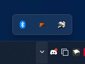
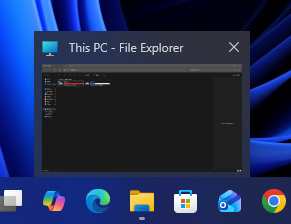

# SunValley theme for Windows 11 Taskbar Styler

This theme tries to replicate how the Windows 10 taskbar would've looked with the Windows 11 design, which includes:
* Windows 10-like system tray
* Redesigned acrylic with accent color support
* Windows 10-like search box
* Windows 10-like taskbar icon spacing/open indicators
* Custom Task View icon based on the Windows 10 1507-1709 design but with the same design as the 11 one
* New entrance animations for context menus and tooltips

#
**Author**: [Tails](https://github.com/milestprower92)
#
**Taskbar**

[](screenshot.png)

**Tray Overflow**

[](screenshot-overflow.png)

**Window Thumbnails**

[](screenshot-thumbnails.png)
#
## Theme selection

The theme is integrated into the mod and can be selected directly from the mod's
settings:

* Open the Windows 11 Taskbar Styler mod in Windhawk.
* Go to the "Settings" tab.
* Select the theme and save the settings.

## Manual installation

The theme styles can also be imported manually. To do that, follow these steps:

* Open the Windows 11 Taskbar Styler mod in Windhawk.
* Go to the "Settings" tab and select "Textual mode".
* Copy the content below to the text box and click "Save settings".

<details>
<summary>Content to import (click to expand)</summary>

```yaml
controlStyles:
  - target: Taskbar.SearchBoxButton#SearchBoxButton > Taskbar.TaskListButtonPanel#ExperienceToggleButtonRootPanel > Windows.UI.Xaml.Controls.Border#BackgroundElement
    styles:
      - CornerRadius=4
      - BorderThickness=0,1,0,0
  - target: Taskbar.SearchBoxButton
    styles:
      - Margin=0
  - target: SystemTray.OmniButton#NotificationCenterButton > Grid > ContentPresenter > ItemsPresenter > StackPanel > ContentPresenter > SystemTray.IconView#SystemTrayIcon > Grid > Grid > SystemTray.TextIconContent > Windows.UI.Xaml.Controls.Grid > SystemTray.AdaptiveTextBlock#Base > Windows.UI.Xaml.Controls.TextBlock
    styles:
      - Text=‎ ‎‎‎
      - FontSize=17.3
      - Width=30
      - FontWeight=ExtraLight
      - Foreground:=<SolidColorBrush Color="{ThemeResource SystemBaseHighColor}" />
  - target: Windows.UI.Xaml.Controls.FontIcon#SearchBoxFontIcon
    styles:
      - FontFamily=Segoe Fluent Icons
  - target: SearchUx.SearchUI.SearchBoxButton#SearchBox > SearchUx.SearchUI.SearchButtonRootGrid#SearchBoxButtonRootPanel > Windows.UI.Xaml.Controls.TextBlock#SearchBoxTextBlock
    styles:
      - Text=Type here to search
      - FontSize=15
      - FontFamily=Segoe UI Variable Text
      - Margin=35,0,0,0
  - target: SystemTray.NotifyIconView#NotifyItemIcon
    styles:
      - CornerRadius=3
      - Height=Auto
      - Margin=0,0,0,0
      - Padding=0,4,0,2
      - BorderThickness=0,1,0,0
  - target: SystemTray.ChevronIconView
    styles:
      - CornerRadius=3
      - Height=Auto
      - Width=24
      - BorderThickness=0,1,0,0
      - Padding=0,2,0,2
  - target: Windows.UI.Xaml.Controls.Grid > Windows.UI.Xaml.Controls.Button#GleamEntryPointButton > Windows.UI.Xaml.Controls.Border
    styles:
      - CornerRadius=4
  - target: Windows.UI.Xaml.Controls.Grid#DynamicSearchBoxGleamContainer
    styles:
      - CornerRadius=3
  - target: SystemTray.OmniButton#NotificationCenterButton
    styles:
      - CornerRadius=3
      - Padding=0,2,0,2
      - Margin=0,0,5,0
      - BorderThickness=0,1,0,0
  - target: SystemTray.Stack#NonActivatableStack
    styles:
      - Height=Auto
      - CornerRadius=3
      - Margin=0,0,0,0
      - Padding=0,2,0,2
      - BorderThickness=0,1,0,0
      - Grid.Column=4
  - target: Rectangle#ShowDesktopPipe@CommonStates
    styles:
      - Width=9
      - Margin=0,0,-10,0
      - Height=500
      - Fill@Active:=<AcrylicBrush TintColor="{ThemeResource SystemBaseLowColor}" TintOpacity="0.5" Opacity="0"/>
      - Stroke:=<SolidColorBrush Color="{ThemeResource SystemBaseHighColor}" Opacity="0.3"/>
  - target: SystemTray.OmniButton#ControlCenterButton
    styles:
      - Padding=0,2,0,2
      - CornerRadius=3
      - Margin=0,0,0,0
      - BorderThickness=0,1,0,0
      - Grid.Column=3
  - target: SystemTray.AdaptiveTextBlock#LanguageInnerTextBlock > TextBlock#InnerTextBlock
    styles:
      - FontFamily=Segoe UI Variable Text
      - Margin=-8,0,0,0
      - FontSize=12
  - target: SystemTray.SystemTrayFrame > Windows.UI.Xaml.Controls.Grid#SystemTrayFrameGrid > SystemTray.Stack#NotifyIconStack > Windows.UI.Xaml.Controls.Grid#Content > SystemTray.StackListView#IconStack > Windows.UI.Xaml.Controls.ItemsPresenter > Windows.UI.Xaml.Controls.StackPanel > Windows.UI.Xaml.Controls.ContentPresenter > SystemTray.ChevronIconView > Windows.UI.Xaml.Controls.Grid#ContainerGrid > Windows.UI.Xaml.Controls.ContentPresenter#ContentPresenter > Windows.UI.Xaml.Controls.Grid#ContentGrid > SystemTray.TextIconContent > Windows.UI.Xaml.Controls.Grid#ContainerGrid > SystemTray.AdaptiveTextBlock#Base > Windows.UI.Xaml.Controls.TextBlock#InnerTextBlock
    styles:
      - FontFamily=Segoe Fluent Icons
      - FontSize=12.4
      - Foreground:=<SolidColorBrush Color="{ThemeResource SystemBaseHighColor}" />
  - target: SystemTray.SystemTrayFrame > Windows.UI.Xaml.Controls.Grid#SystemTrayFrameGrid > SystemTray.Stack#NotifyIconStack > Windows.UI.Xaml.Controls.Grid#Content > SystemTray.StackListView#IconStack > Windows.UI.Xaml.Controls.ItemsPresenter > Windows.UI.Xaml.Controls.StackPanel > Windows.UI.Xaml.Controls.ContentPresenter
    styles:
      - Width=30
  - target: SystemTray.AdaptiveTextBlock#Base > Windows.UI.Xaml.Controls.TextBlock#InnerTextBlock
    styles:
      - FontFamily=Segoe Fluent Icons
      - Foreground:=<SolidColorBrush Color="{ThemeResource SystemBaseHighColor}" />
  - target: SystemTray.AdaptiveTextBlock#AccentOverlay > Windows.UI.Xaml.Controls.TextBlock#InnerTextBlock
    styles:
      - FontFamily=Segoe Fluent Icons
  - target: SystemTray.AdaptiveTextBlock#Underlay > Windows.UI.Xaml.Controls.TextBlock#InnerTextBlock
    styles:
      - FontFamily=Segoe Fluent Icons
  - target: SystemTray.OmniButton#ControlCenterButton > Grid > ContentPresenter > ItemsPresenter > StackPanel > ContentPresenter[1] > SystemTray.IconView > Grid > Grid
    styles:
      - Margin=-3,0,0,0
  - target: SystemTray.Stack#MainStack > Windows.UI.Xaml.Controls.Grid#Content
    styles:
      - CornerRadius=3
      - Height=Auto
      - Margin=0,0,0,0
      - Padding=0,4,0,4
      - BorderThickness=0,1,0,0
  - target: Windows.UI.Xaml.Controls.StackPanel > Windows.UI.Xaml.Controls.TextBlock#TimeInnerTextBlock
    styles:
      - FontFamily=Segoe UI Variable Display
      - TextAlignment=0
      - FontSize=12
      - Margin=0,1,0,0
  - target: Windows.UI.Xaml.Controls.StackPanel > Windows.UI.Xaml.Controls.TextBlock#DateInnerTextBlock
    styles:
      - FontFamily=Segoe UI Variable
      - TextAlignment=0
      - FontSize=12
      - Margin=0,0,0,0
  - target: SystemTray.NotificationAreaIcons#NotificationAreaIcons > Windows.UI.Xaml.Controls.ItemsPresenter > Windows.UI.Xaml.Controls.StackPanel > Windows.UI.Xaml.Controls.ContentPresenter
    styles:
      - Width=23
      - Margin=0,-2,0,0
  - target: SystemTray.NotificationAreaIcons#NotificationAreaIcons > Windows.UI.Xaml.Controls.ItemsPresenter > Windows.UI.Xaml.Controls.StackPanel > Windows.UI.Xaml.Controls.ContentPresenter > SystemTray.NotifyIconView#NotifyItemIcon > Windows.UI.Xaml.Controls.Grid#ContainerGrid
    styles:
      - Transform3D:=<CompositeTransform3D TranslateY="0" TranslateX="0" />
      - HorizontalAlignment=0
  - target: SystemTray.Stack#NotifyIconStack
    styles:
      - Width=24
  - target: SystemTray.OmniButton#ControlCenterButton > Grid > ContentPresenter > ItemsPresenter > StackPanel > ContentPresenter > SystemTray.IconView#SystemTrayIcon > Grid > Grid > SystemTray.TextIconContent > Windows.UI.Xaml.Controls.Grid > SystemTray.AdaptiveTextBlock > Windows.UI.Xaml.Controls.TextBlock
    styles:
      - FontSize=16
      - Margin=0,-1,-0,0
      - FontWeight=0
  - target: SystemTray.CopilotIcon#CopilotIcon
    styles:
      - Visibility=Visible
      - Padding=2
      - Height=61
  - target: SystemTray.NotificationAreaOverflow > Windows.UI.Xaml.Controls.Grid#OverflowRootGrid > Windows.UI.Xaml.Controls.Border#OverflowFlyoutBackgroundBorder
    styles:
      - CornerRadius=7
      - Background:=<AcrylicBrush TintColor="{ThemeResource SystemChromeMediumHighColor}" TintOpacity="0" TintLuminosityOpacity="0.8" FallbackColor="{ThemeResource SystemChromeMediumColor}" />
      - Margin=0,0,0,0
      - BorderBrush:=<SolidColorBrush Color="{ThemeResource SystemChromeHighColor}" Opacity="0.5" />
      - BorderThickness=1
  - target: SystemTray.NotificationAreaOverflow > Windows.UI.Xaml.Controls.Grid#OverflowRootGrid > Windows.UI.Xaml.Controls.ItemsControl > Windows.UI.Xaml.Controls.ItemsPresenter > Windows.UI.Xaml.Controls.WrapGrid
    styles:
      - Margin=0,0,0,0
  - target: SystemTray.NotifyIconView
    styles:
      - CornerRadius=3
  - target: Windows.UI.Xaml.Controls.ScrollViewer > Windows.UI.Xaml.Controls.ScrollContentPresenter > Windows.UI.Xaml.Controls.Border > SystemTray.NotificationAreaOverflow
    styles:
      - Transform3D:=<CompositeTransform3D TranslateY="0" />
  - target: SystemTray.OmniButton#ControlCenterButton
    styles:
      - Visibility=Visible
  - target: Taskbar.TaskbarBackground#BackgroundControl > Grid
    styles:
      - Background:=<AcrylicBrush TintColor="{ThemeResource SystemChromeAltHighColor}" TintOpacity="0.4" TintLuminosityOpacity="0.4" FallbackColor="{ThemeResource SystemChromeMediumColor}" />
  - target: Taskbar.TaskbarBackground#BackgroundControl > Grid > Windows.UI.Xaml.Shapes.Rectangle#BackgroundFill
    styles:
      - Opacity=0.5
  - target: Windows.UI.Xaml.Shapes.Rectangle#BackgroundStroke
    styles:
      - Opacity=0.5
  - target: SystemTray.OmniButton#ControlCenterButton > Grid > ContentPresenter > ItemsPresenter > StackPanel > ContentPresenter[3] > SystemTray.IconView > Grid > Grid
    styles:
      - Margin=2,0,-4,0
      - RenderTransform:=<ScaleTransform ScaleX="1" />
  - target: Windows.UI.Xaml.Controls.ContentPresenter#HoverFlyoutContent
    styles:
      - CornerRadius=7
      - Margin=0,0,0,0
      - Background:=<AcrylicBrush TintColor="{ThemeResource SystemChromeMediumHighColor}" TintOpacity="0" TintLuminosityOpacity="0.8" FallbackColor="{ThemeResource SystemChromeMediumColor}" />
      - BorderBrush:=<SolidColorBrush Color="{ThemeResource SystemChromeHighColor}" Opacity="0.5" />
      - BorderThickness=1
  - target: Taskbar.TaskItemThumbnailView > Grid > TextBlock
    styles:
      - FontFamily=Segoe UI
      - FontSize=12
      - Margin=3,0,8,8
  - target: Taskbar.TaskItemThumbnailView > Windows.UI.Xaml.Controls.Grid > Microsoft.UI.Xaml.Controls.ItemsRepeater > Windows.UI.Xaml.Controls.Image
    styles:
      - Margin=0,-7,0,0
  - target: Taskbar.TaskItemThumbnailView > Grid > Button > ContentPresenter > TextBlock
    styles:
      - FontFamily=Segoe Fluent Icons
  - target: Taskbar.TaskItemThumbnailView > Grid > Button
    styles:
      - CornerRadius=4
      - Height=31
      - Margin=0,0,0,8
      - Width=31
  - target: Grid#DetailedViewGrid
    styles:
      - Margin=0,-7,0,0
  - target: Taskbar.TaskItemThumbnailView > Grid > Border
    styles:
      - BorderBrush:=<SolidColorBrush Color="{ThemeResource SystemBaseHighColor}" Opacity="0.5" />
      - CornerRadius=0
  - target: SystemTray.OmniButton#NotificationCenterButton > Windows.UI.Xaml.Controls.Grid > Windows.UI.Xaml.Controls.ContentPresenter > Windows.UI.Xaml.Controls.ItemsPresenter > Windows.UI.Xaml.Controls.StackPanel > Windows.UI.Xaml.Controls.ContentPresenter > SystemTray.IconView > Windows.UI.Xaml.Controls.Grid > Windows.UI.Xaml.Controls.ContentPresenter > Windows.UI.Xaml.Controls.Grid > SystemTray.TextIconContent > Windows.UI.Xaml.Controls.Grid > SystemTray.AdaptiveTextBlock#Base > Windows.UI.Xaml.Controls.TextBlock
    styles:
      - Text=‎
      - FontWeight=Light
      - FontSize=17.3
      - Foreground:=<SolidColorBrush Color="{ThemeResource SystemBaseHighColor}" />
      - Margin=-0.5,0,1,0
  - target: SystemTray.OmniButton#NotificationCenterButton > Windows.UI.Xaml.Controls.Grid > Windows.UI.Xaml.Controls.ContentPresenter > Windows.UI.Xaml.Controls.ItemsPresenter > Windows.UI.Xaml.Controls.StackPanel > Windows.UI.Xaml.Controls.ContentPresenter > SystemTray.IconView
    styles:
      - CornerRadius=0
      - Padding=0,0,0,0
  - target: SystemTray.DateTimeIconContent > Windows.UI.Xaml.Controls.Grid > Windows.UI.Xaml.Controls.StackPanel > Windows.UI.Xaml.Controls.TextBlock
    styles:
      - FontFamily=Segoe UI
      - TextAlignment=Center
  - target: SystemTray.OmniButton#ControlCenterButton > Grid > ContentPresenter > ItemsPresenter > StackPanel > ContentPresenter[2] > SystemTray.IconView > Grid > Grid
    styles:
      - Margin=0,0,-3,0
  - target: Taskbar.ThumbBarButton > ContentPresenter
    styles:
      - CornerRadius=4
      - Background:=<SolidColorBrush Color="{ThemeResource SystemChromeMediumHighColor}" Opacity="0.3" />
      - BorderBrush:=<SolidColorBrush Color="{ThemeResource SystemChromeHighColor}" Opacity="0.3" />
      - BorderThickness=1
  - target: Taskbar.ThumbBarButton > ContentPresenter > Image
    styles:
      - Height=15
      - Width=15
  - target: SearchUx.SearchUI.SearchButtonRootGrid > Border
    styles:
      - CornerRadius=4
  - target: TextBlock#BatteryTextBlock
    styles:
      - FontFamily=Segoe UI Variable Text
      - Margin=2,0,-2,0
  - target: SystemTray.BatteryIconContent > Grid > Windows.UI.Xaml.Controls.StackPanel > Grid > TextBlock
    styles:
      - RenderTransform:=<ScaleTransform ScaleX="1" />
  - target: SystemTray.IconView#SystemTrayIcon > Grid#ContainerGrid > Border#BackgroundBorder
    styles:
      - CornerRadius=0
      - Opacity=0
  - target: Windows.UI.Xaml.Controls.Button#GleamEntryPointButton > Windows.UI.Xaml.Controls.Border > Windows.UI.Xaml.Controls.ContentPresenter
    styles:
      - CornerRadius=3
  - target: SearchUx.SearchUI.SearchButtonRootGrid
    styles:
      - Margin=2,0,2,0
  - target: SystemTray.ChevronIconView > Grid > ContentPresenter
    styles:
      - Transform3D:=<CompositeTransform3D TranslateY="-1" TranslateX="2" />
      - HorizontalAlignment=0
  - target: Border#SearchPillBackgroundElement
    styles:
      - CornerRadius=4
  - target: Grid#ConfirmatorMainGrid
    styles:
      - Background:=<AcrylicBrush TintColor="{ThemeResource SystemChromeMediumHighColor}" TintOpacity="0" TintLuminosityOpacity="0.8" FallbackColor="{ThemeResource SystemChromeMediumColor}" />
      - BorderBrush:=<SolidColorBrush Color="{ThemeResource SystemChromeHighColor}" Opacity="0.5" />
      - CornerRadius=6
      - BorderThickness=1
  - target: Slider > Grid > Grid > Grid > Windows.UI.Xaml.Controls.Primitives.Thumb#HorizontalThumb
    styles:
      - Visibility=Visible
      - Height=18
      - Width=18
  - target: Slider > Grid > Grid > Grid > Windows.UI.Xaml.Controls.Primitives.Thumb#HorizontalThumb > Border
    styles:
      - BorderBrush:=<AcrylicBrush TintColor="{ThemeResource SystemChromeLowColor}" TintOpacity="0.7" TintLuminosityOpacity="0.7" FallbackColor="{ThemeResource SystemChromeMediumColor}" />
      - BorderThickness=4
      - Background:=<SolidColorBrush Color="{ThemeResource SystemAccentColorLight1}" />
      - CornerRadius=10
  - target: Slider > Grid > Grid > Grid > Rectangle#HorizontalDecreaseRect
    styles:
      - Fill:=<SolidColorBrush Color="{ThemeResource SystemAccentColorLight1}" />
  - target: Slider > Grid > Grid > Grid > Windows.UI.Xaml.Controls.Primitives.Thumb#HorizontalThumb
    styles:
      - BorderBrush:=<AcrylicBrush TintColor="{ThemeResource SystemChromeHighColor}" TintOpacity="0.7" TintLuminosityOpacity="0.7" FallbackColor="{ThemeResource SystemChromeMediumColor}" />
      - BorderThickness=0,1,0,0
  - target: SearchUx.SearchUI.SearchBoxButton
    styles:
      - Width=340
  - target: SearchUx.SearchUI.SearchBoxButton > SearchUx.SearchUI.SearchButtonRootGrid
    styles:
      - Width=340
      - Margin=-5,-6,-4,-6
  - target: SearchUx.SearchUI.SearchBoxButton > SearchUx.SearchUI.SearchButtonRootGrid > Grid
    styles:
      - Margin=0,-1,-1,-1
      - Width=80
      - Transitions:=<TransitionCollection>              <ContentThemeTransition/>           </TransitionCollection>
  - target: SearchUx.SearchUI.SearchBoxButton > SearchUx.SearchUI.SearchButtonRootGrid > Grid > Grid > Image
    styles:
      - Width=80
      - Height=40
  - target: Taskbar.ExperienceToggleButton#LaunchListButton[AutomationProperties.AutomationId=StartButton] > Taskbar.TaskListButtonPanel
    styles:
      - Width=48
      - Background:=<ImageBrush Stretch="Uniform" ImageSource="https://raw.githubusercontent.com/ramensoftware/windows-11-taskbar-styling-guide/refs/heads/main/Themes/SunValley/Assets/start.png" />
  - target: Taskbar.ExperienceToggleButton#LaunchListButton[AutomationProperties.AutomationId=StartButton] > Taskbar.TaskListButtonPanel > Microsoft.UI.Xaml.Controls.AnimatedVisualPlayer#Icon
    styles:
      - Visibility=Collapsed
  - target: ToolTip > ContentPresenter > TextBlock
    styles:
      - FontFamily=Segoe UI Variable Text
      - FontSize=13
      - Margin=0,1,0,-2
  - target: ToolTip > ContentPresenter > StackPanel > TextBlock
    styles:
      - FontFamily=Segoe UI Variable Text
      - FontSize=13
      - Margin=0,1,0,-2
  - target: ToolTip
    styles:
      - Background:=<AcrylicBrush TintColor="{ThemeResource SystemChromeMediumHighColor}" TintOpacity="0" TintLuminosityOpacity="0.8" FallbackColor="{ThemeResource SystemChromeMediumColor}" />
      - BorderBrush:=<SolidColorBrush Color="{ThemeResource SystemChromeHighColor}" Opacity="0.5" />
      - BorderThickness=1
  - target: ToolTip > ContentPresenter
    styles:
      - Transitions:=<TransitionCollection>              <ContentThemeTransition VerticalOffset="60" />           </TransitionCollection>
  - target: Taskbar.AugmentedEntryPointButton#AugmentedEntryPointButton[AutomationProperties.AutomationId=WidgetsButton] > Taskbar.TaskListButtonPanel#ExperienceToggleButtonRootPanel
    styles:
      - Padding=0,2,0,2
  - target: TextBlock#VirtualDesktopNameBlock
    styles:
      - FontFamily=Segoe UI Variable Text
      - FontSize=13
  - target: Grid#RootGrid > Grid#TitleGrid > TextBlock#DisplayName
    styles:
      - FontFamily=Segoe UI Variable Text
      - FontSize=13
  - target: Grid#MainGrid > TextBlock
    styles:
      - FontFamily=Segoe UI Variable Text
      - FontSize=13
  - target: Windows.UI.Xaml.Controls.Border#BackgroundDimmingLayer
    styles:
      - Background:=<AcrylicBrush TintColor="{ThemeResource SystemChromeMediumHighColor}" TintOpacity="0" TintLuminosityOpacity="0.7" FallbackColor="{ThemeResource SystemChromeMediumColor}" />
  - target: Taskbar.ExperienceToggleButton#LaunchListButton[AutomationProperties.AutomationId=TaskViewButton] > Taskbar.TaskListButtonPanel > Microsoft.UI.Xaml.Controls.AnimatedVisualPlayer#Icon
    styles:
      - RenderTransform:=<ScaleTransform ScaleX="1.1" ScaleY="0.9" />
      - Transform3D:=<CompositeTransform3D TranslateY="2" TranslateX="-2" />
      - FlowDirection=1
  - target: Windows.UI.Xaml.Controls.Grid#ModalRootGrid > Windows.UI.Xaml.Controls.Border#BackgroundElement
    styles:
      - Background=Transparent
      - Transitions:=<TransitionCollection>              <ContentThemeTransition VerticalOffset="-1000" />           </TransitionCollection>
  - target: Windows.UI.Xaml.Controls.Grid#ModalRootGrid > Windows.UI.Xaml.Controls.Border#BackgroundElement > WindowsInternal.ComposableShell.Experiences.Switcher.SwitchItemList
    styles:
      - Background:=<AcrylicBrush TintColor="{ThemeResource SystemChromeMediumHighColor}" TintOpacity="0.2" TintLuminosityOpacity="0.9" FallbackColor="{ThemeResource SystemChromeMediumColor}" />
  - target: SearchUx.SearchUI.SearchBoxButton > SearchUx.SearchUI.SearchButtonRootGrid > Microsoft.UI.Xaml.Controls.AnimatedVisualPlayer
    styles:
      - Height=18
      - Width=18
      - Transform3D:=<CompositeTransform3D TranslateX="0" />
  - target: SearchUx.SearchUI.SearchPillButton > SearchUx.SearchUI.SearchButtonRootGrid
    styles:
      - Margin=-3,-6,-3,-6
      - Width=346
  - target: SearchUx.SearchUI.SearchPillButton > SearchUx.SearchUI.SearchButtonRootGrid > Grid#SearchBoxContentGrid
    styles:
      - HorizontalAlignment=0
  - target: SearchUx.SearchUI.SearchPillButton > SearchUx.SearchUI.SearchButtonRootGrid > Grid#SearchBoxContentGrid > FontIcon
    styles:
      - Transform3D:=<CompositeTransform3D TranslateY="-1" TranslateX="-10.5" />
      - FontSize=19.4
      - FontFamily=Segoe Fluent Icons
      - FontWeight=SemiLight
      - Opacity=0.7
      - Grid.Column=0
      - HorizontalAlignment=0
  - target: SearchUx.SearchUI.SearchPillButton > SearchUx.SearchUI.SearchButtonRootGrid > Grid#SearchBoxContentGrid > TextBlock
    styles:
      - Transform3D:=<CompositeTransform3D TranslateX="-5" />
      - FontFamily=Segoe UI
      - Opacity=0.7
      - Text=Type here to search
      - Grid.Column=1
      - HorizontalAlignment=0
      - FontSize=15
  - target: SearchUx.SearchUI.SearchPillButton > SearchUx.SearchUI.SearchButtonRootGrid > Border#SearchPillBackgroundElement
    styles:
      - CornerRadius=4
      - BorderThickness=1
      - BorderBrush:=<SolidColorBrush Color="{ThemeResource SystemChromeHighColor}" Opacity="0.7" />
  - target: Grid#SearchBoxContentGrid
    styles:
      - Visibility=Visible
  - target: Taskbar.TaskListButton#TaskListButton > Taskbar.TaskListLabeledButtonPanel#IconPanel
    styles:
      - Padding=2
      - Margin=2,0,2,0
  - target: Taskbar.TaskListButton > Taskbar.TaskListLabeledButtonPanel > Rectangle
    styles:
      - RadiusX=2
      - Margin=0,0,0,0
  - target: Taskbar.ExperienceToggleButton > Taskbar.TaskListButtonPanel
    styles:
      - Padding=2
      - Margin=1,0,2,0
  - target: MenuFlyoutPresenter
    styles:
      - CornerRadius=7
  - target: MenuFlyoutPresenter > Border
    styles:
      - Background:=<AcrylicBrush TintColor="{ThemeResource SystemChromeMediumHighColor}" TintOpacity="0.3" TintLuminosityOpacity="0.8" FallbackColor="{ThemeResource SystemChromeMediumColor}" />
      - Transitions:=<TransitionCollection>              <ContentThemeTransition VerticalOffset="100" />           </TransitionCollection>
      - BorderThickness=1
      - BorderBrush:=<SolidColorBrush Color="{ThemeResource SystemChromeHighColor}" Opacity="0.5" />
  - target: Taskbar.TaskListLabeledButtonPanel#IconPanel > Image#OverlayIcon
    styles:
      - Transform3D:=<CompositeTransform3D TranslateY="15" TranslateX="-2" />
  - target: Taskbar.TaskListLabeledButtonPanel#IconPanel > Taskbar.Badge
    styles:
      - Transform3D:=<CompositeTransform3D TranslateY="15" TranslateX="-2" />
  - target: Taskbar.TaskListLabeledButtonPanel#IconPanel > Taskbar.Badge > Grid > Rectangle
    styles:
      - Fill=Transparent
  - target: Taskbar.TaskListLabeledButtonPanel#IconPanel > Taskbar.Badge > Grid
    styles:
      - Background:=<AcrylicBrush TintColor="{ThemeResource SystemChromeMediumHighColor}" TintOpacity="0" TintLuminosityOpacity="0,7" FallbackColor="{ThemeResource SystemChromeMediumColor}" />
      - BorderBrush:=<AcrylicBrush TintColor="{ThemeResource SystemChromeHighColor}" TintOpacity="0" TintLuminosityOpacity="0.5" FallbackColor="{ThemeResource SystemChromeMediumColor}" />
      - BorderThickness=0,1,0,0
      - CornerRadius=15
  - target: Taskbar.TaskListLabeledButtonPanel#IconPanel > Taskbar.Badge > Grid > TextBlock
    styles:
      - Foreground:=<SolidColorBrush Color="{ThemeResource SystemBaseHighColor}" />
      - Transform3D:=<CompositeTransform3D TranslateY="-1" />
  - target: Taskbar.TaskListLabeledButtonPanel#IconPanel > Taskbar.Badge
    styles:
      - Height=17
      - Width=17
  - target: SearchUx.SearchUI.SearchIconButton > SearchUx.SearchUI.SearchButtonRootGrid
    styles:
      - Padding=0,2,2,2
      - Width=48
  - target: SearchUx.SearchUI.SearchBoxButton > SearchUx.SearchUI.SearchButtonRootGrid > TextBlock
    styles:
      - Transform3D:=<CompositeTransform3D TranslateX="5" TranslateY="1" />
  - target: SearchUx.SearchUI.SearchButtonRootGrid#SearchV2ButtonRootPanel
    styles:
      - Padding=0,2,0,2
  - target: SearchUx.SearchUI.SearchV2Button
    styles:
      - CornerRadius=4
      - Width=346
  - target: Grid#SearchV2ButtonInactiveUIGrid
    styles:
      - MaxWidth=346
      - MinWidth=346
  - target: Grid#SearchV2ButtonActiveUIGridWithAnimations
    styles:
      - Width=346
  - target: Grid#SearchV2ButtonActiveUIGridWithAnimations > StackPanel
    styles:
      - HorizontalAlignment=0
      - Margin=13,0,0,0
  - target: Grid#SearchV2ButtonInactiveUIGrid > Button
    styles:
      - Height=40
      - Width=30
      - CornerRadius=4
  - target: TextBlock#SearchV2OnTaskbarButtonText
    styles:
      - FontFamily=Segoe UI
      - FontSize=15
      - Transform3D:=<CompositeTransform3D TranslateY="-1" />
      - Text=Ask me anything
  - target: Taskbar.ExperienceToggleButton#LaunchListButton[AutomationProperties.AutomationId=TaskViewButton] > Taskbar.TaskListButtonPanel > Microsoft.UI.Xaml.Controls.AnimatedVisualPlayer#Icon
    styles:
      - Visibility=Collapsed
  - target: Taskbar.ExperienceToggleButton#LaunchListButton[AutomationProperties.AutomationId=TaskViewButton] > Taskbar.TaskListButtonPanel@CommonStates
    styles:
      - Background:=<ImageBrush Stretch="Uniform" ImageSource="https://raw.githubusercontent.com/ramensoftware/windows-11-taskbar-styling-guide/refs/heads/main/Themes/SunValley/Assets/taskview.png" />
      - Width=48
  - target: SearchUx.SearchUI.SearchIconButton > SearchUx.SearchUI.SearchButtonRootGrid > Grid#SearchBoxContentGrid > FontIcon > Grid > TextBlock
    styles:
      - FontWeight=Light
  - target: SystemTray.NotificationAreaOverflow > Windows.UI.Xaml.Controls.Grid#OverflowRootGrid
    styles:
      - Margin=7,0,0,0
  - target: Taskbar.TaskListButton#TaskListButton > Taskbar.TaskListLabeledButtonPanel#IconPanel > Border#BackgroundElement
    styles:
      - Margin=-3,0,-3,0
  - target: Taskbar.TaskListButton#TaskListButton > Taskbar.TaskListLabeledButtonPanel#IconPanel@RunningIndicatorStates > Rectangle
    styles:
      - Width@ActiveRunningIndicator=40
      - RadiusX=2
      - RadiusY=2
      - Width@InactiveRunningIndicator=35
  - target: Taskbar.ExperienceToggleButton > Taskbar.TaskListButtonPanel > Border
    styles:
      - Margin=-3,0,-3,0
  - target: SearchUx.SearchUI.SearchIconButton > SearchUx.SearchUI.SearchButtonRootGrid > Border
    styles:
      - Margin=-1,0,-1,0
      - Opacity=0.5
  - target: Taskbar.TaskListButton#TaskListButton > Taskbar.TaskListLabeledButtonPanel#IconPanel@CommonStates > Border#MultiWindowElement
    styles:
      - Margin=-4,0,-4,0
      - Opacity=0.5
  - target: Taskbar.TaskListButtonPanel#ExperienceToggleButtonRootPanel > Border
    styles:
      - Opacity=0.5
  - target: Taskbar.TaskListLabeledButtonPanel > Border#BackgroundElement
    styles:
      - Opacity=0.5
  - target: SearchUx.SearchUI.SearchPillButton > SearchUx.SearchUI.SearchButtonRootGrid > Grid#SearchBoxContentGrid
    styles:
      - Width=344
  - target: SearchUx.SearchUI.SearchBoxButton > SearchUx.SearchUI.SearchButtonRootGrid@CommonStates > Border
    styles:
      - BorderBrush@InactiveNormal_SearchBox_Wave3:=<SolidColorBrush Color="{ThemeResource SystemChromeHighColor}" Opacity="0.7" />
      - Background@InactiveNormal_SearchBox_Wave3:=<SolidColorBrush Color="{ThemeResource SystemBaseHighColor}" Opacity="0.06" />
      - Background@InactivePointerOver_SearchBox_Wave3:=<SolidColorBrush Color="{ThemeResource SystemChromeHighColor}" Opacity="0.2" />
      - Background@InactivePressed_SearchBox_Wave3:=<SolidColorBrush Color="{ThemeResource SystemChromeHighColor}" Opacity="0.05" />
      - BorderThickness@InactivePointerOver_SearchBox_Wave3=2
      - BorderThickness@InactivePressed_SearchBox_Wave3=2
      - BorderThickness@InactiveNormal_SearchBox_Wave3=1
      - Background@ActivePointerOver_SearchBox_Wave3:=<SolidColorBrush Color="{ThemeResource SystemChromeHighColor}" Opacity="0" />
      - Background@ActivePressed_SearchBox_Wave3:=<SolidColorBrush Color="{ThemeResource SystemChromeHighColor}" Opacity="0" />
      - Background@ActiveNormal_SearchBox_Wave3:=<SolidColorBrush Color="{ThemeResource SystemChromeHighColor}" Opacity="0" />
      - BorderBrush@InactivePointerOver_SearchBox_Wave3:=<SolidColorBrush Color="{ThemeResource SystemChromeHighColor}" Opacity="0.7" />
      - BorderBrush@InactivePressed_SearchBox_Wave3:=<SolidColorBrush Color="{ThemeResource SystemChromeHighColor}" Opacity="0.7" />
      - BorderThickness@InactivePointerOver_SearchBoxCustomTheme=2
      - BorderThickness@InactivePressed_SearchBoxCustomTheme=2
      - BorderThickness@InactiveNormal_SearchBoxCustomTheme=1
      - BorderBrush@InactiveNormal_SearchBoxCustomTheme:=<SolidColorBrush Color="{ThemeResource SystemChromeHighColor}" Opacity="0.7" />
      - BorderBrush@InactivePointerOver_SearchBoxCustomTheme:=<SolidColorBrush Color="{ThemeResource SystemChromeHighColor}" Opacity="0.7" />
      - BorderBrush@InactivePressed_SearchBoxCustomTheme:=<SolidColorBrush Color="{ThemeResource SystemChromeHighColor}" Opacity="0.7" />
      - Background@InactivePointerOver_SearchBoxCustomTheme:=<SolidColorBrush Color="White" Opacity="1" />
      - Background@InactiveNormal_SearchBoxCustomTheme:=<SolidColorBrush Color="White" Opacity="0.9" />
      - Background@InactivePressed_SearchBoxCustomTheme:=<SolidColorBrush Color="White" Opacity="0.7" />
```
</details>
