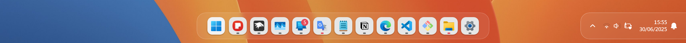
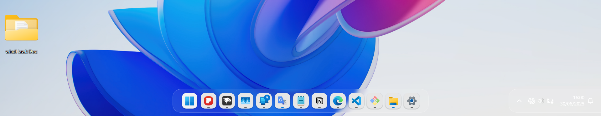
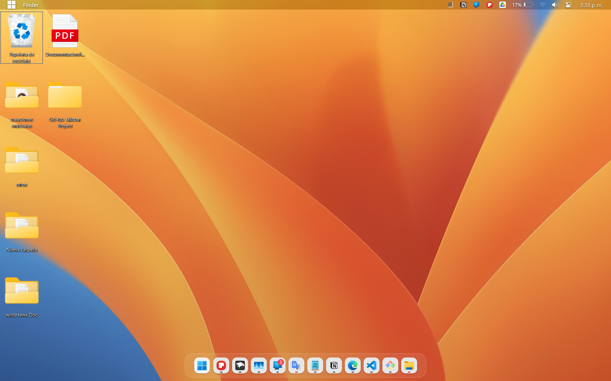
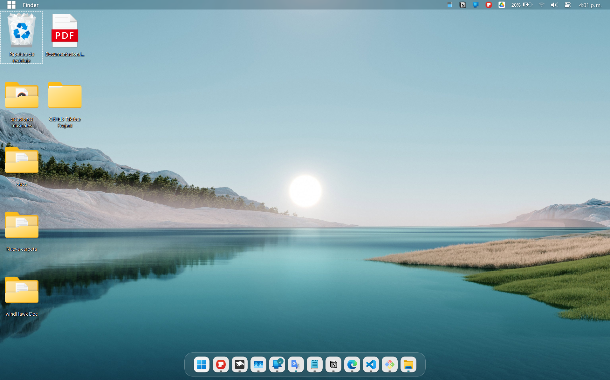

# Surface Theme para windows 11 Taskbar Styler

**Author**: [Jimmy](https://github.com/JimmyLlancaMelo)

 \
 \
 \
 \
 \

## Notes

* Este tema esta pensado para ser usado tanto con el programa "MyDockFinder" como sin el, de no usar "MyDockFinder" podrias tener algunos inconvenientes con ciertos fondos de pantalla demasiados claros, me refiero a la seccion de los iconos del sistema (Fecha, Hora, Wifi, Sonido, Bateria, Etc). Si usas "MyDockFinder" podrias solocionar ese problema
* Seguramente te preguntaras puedo usar "MyDockFinder" tambien para el dock, yo te diria que si pero, el dock de "MyDockFinder" tiene ciertos limites y problemas, ademas de tener que configurarlo manualmente el archivo "config.ini" para solucionar uno que cuantos bugs. Yo te recomendaria solo usar el "Finder" como sustituto del area de iconos del sistema
* Este configuracion de windHawk es mi vision de como se podria tener la apariencia de MacOS en windows, usted tiene toda la libertad para cambiar los ajustes a sus necesidades

## Requisitos

* Este tema requiere de tener windows 11 como sistema operativo. No se hicieron pruebas en windows 10.
* Tener instalado el mod "Taksbar height and icon size" con estos ajustes (Icon size : 24, Taksbar Height : 70, Taksbar Button With : 47)
* Resolución de pantalla "1920 x 1200"
* Tener el escalado en 125 %
* Opcional (MyDockFinder)

## Instalación

Para que puedas instalar este tema, sigue los siguiente pasos

* Abre windhawk
* Selecciona el mod llamado "Windows 11 Taksbar Styler" e instalalo
* Dirigete en la parte de "Avanzado".
* Copia y pega el json.

#### Puedes obtener el codigo aqui:
<details>
<summary>Contenido json para copiar y pegar en windhawk</summary>

```json
{
  "controlStyles[0].target": "Grid#RootGrid > Taskbar.TaskbarBackground > Grid",
  "controlStyles[0].styles[0]": "CornerRadius=20",
  "controlStyles[0].styles[1]": "BorderThickness=1",
  "controlStyles[0].styles[2]": "Margin=-20,0,-20,0",
  "controlStyles[0].styles[3]": "BorderBrush=#40FFFFFF",
  "controlStyles[0].styles[4]": "Padding=-1",

  "controlStyles[1].target": "Rectangle#BackgroundStroke",
  "controlStyles[1].styles[0]": "Fill=Transparent",

  "controlStyles[2].target": "Taskbar.TaskbarFrame",
  "controlStyles[2].styles[0]": "Width=Auto",
  "controlStyles[2].styles[1]": "HorizontalAlignment=Center",

  "controlStyles[3].target": "Taskbar.TaskbarFrame > Grid#RootGrid",
  "controlStyles[3].styles[0]": "Visibility=visible",
  "controlStyles[3].styles[1]": "Margin=0,0,0,10",
  "controlStyles[3].styles[2]": "Padding=20,0,20,0",

  "controlStyles[4].target": "Grid#SystemTrayFrameGrid",
  "controlStyles[4].styles[0]": "Margin=0,0,0,10",
  "controlStyles[4].styles[1]": "CornerRadius=20,0,0,20",
  "controlStyles[4].styles[2]": "BorderThickness=1,1,0,1",
  "controlStyles[4].styles[3]": "BorderBrush=#66FFFFFF",
  "controlStyles[4].styles[4]": "Padding=10,5,0,5",
  "controlStyles[4].styles[5]": "Background:=<WindhawkBlur BlurAmount=\"5\" TintColor=\"#12FFFFFF\"/>",
  "controlStyles[4].styles[6]": "Visibility=Visible",

  "controlStyles[5].target": "Taskbar.TaskbarFrame > Grid#RootGrid > Taskbar.TaskbarBackground > Grid > Rectangle#BackgroundFill",
  "controlStyles[5].styles[0]": "Fill:=<WindhawkBlur BlurAmount=\"5\" TintColor=\"#12FFFFFF\"/>",

  "controlStyles[6].target": "Taskbar.TaskListLabeledButtonPanel@RunningIndicatorStates > Border#BackgroundElement",
  "controlStyles[6].styles[0]": "Background:=<AcrylicBrush TintColor=\"{ThemeResource SystemChromeAltHighColor}\" TintOpacity=\"0.9\" FallbackColor=\"{ThemeResource SystemChromeMediumColor}\" />",
  "controlStyles[6].styles[1]": "Margin=-1,5.5,1,4",
  "controlStyles[6].styles[2]": "CornerRadius=12",
  "controlStyles[6].styles[3]": "BorderThickness=2,1,0.5,2",
  "controlStyles[6].styles[4]": "BorderBrush:=<LinearGradientBrush StartPoint=\"0,0\" EndPoint=\"0.5,1\">     <GradientStop Color=\"#00000000\" Offset=\"0\" />     <GradientStop Color=\"#33000000\" Offset=\"1.5\" /> </LinearGradientBrush>",

  "controlStyles[7].target": "Taskbar.TaskListButtonPanel#ExperienceToggleButtonRootPanel > Border#BackgroundElement",
  "controlStyles[7].styles[0]": "Background:=<AcrylicBrush TintColor=\"{ThemeResource SystemChromeAltHighColor}\" TintOpacity=\"0.8\" FallbackColor=\"{ThemeResource SystemChromeLowColor}\" />",
  "controlStyles[7].styles[1]": "CornerRadius=12",
  "controlStyles[7].styles[2]": "Margin=-1,5.5,2.5,4",
  "controlStyles[7].styles[3]": "BorderThickness=2,1,0.5,2",
  "controlStyles[7].styles[4]": "BorderBrush:=<LinearGradientBrush StartPoint=\"0,0\" EndPoint=\"0.5,1\">     <GradientStop Color=\"#00000000\" Offset=\"0\" />     <GradientStop Color=\"#33000000\" Offset=\"1.5\" /> </LinearGradientBrush>",

  "controlStyles[8].target": "Taskbar.TaskListLabeledButtonPanel@CommonStates > Rectangle#RunningIndicator",
  "controlStyles[8].styles[0]": "Margin=0,0,0,8",
  "controlStyles[8].styles[1]": "Fill@InactiveNormal=#656565",
  "controlStyles[8].styles[2]": "Fill@InactivePointerOver=#656565",
  "controlStyles[8].styles[3]": "Fill@ActiveNormal:=<SolidColorBrush Color=\"{ThemeResource SystemAccentColor}\" />",
  "controlStyles[8].styles[4]": "Fill@ActivePointerOver:=<SolidColorBrush Color=\"{ThemeResource SystemAccentColor}\" />",
  "controlStyles[8].styles[5]": "Fill@MultiWindowNormal:=<SolidColorBrush Color=\"{ThemeResource SystemAccentColor}\" />",
  "controlStyles[8].styles[6]": "Fill@MultiWindowPointerOver:=<SolidColorBrush Color=\"{ThemeResource SystemAccentColor}\" />",
  "controlStyles[8].styles[7]": "Fill@MultiWindowActive:=<SolidColorBrush Color=\"{ThemeResource SystemAccentColor}\" />",
  "controlStyles[8].styles[8]": "Fill@RequestingAttention:=<SolidColorBrush Color=\"{ThemeResource SystemAccentColor}\" />",
  "controlStyles[8].styles[9]": "Fill@ActivePressed:=<SolidColorBrush Color=\"{ThemeResource SystemAccentColor}\" />",
  "controlStyles[8].styles[10]": "Fill@InactivePressed:=<SolidColorBrush Color=\"{ThemeResource SystemAccentColor}\" />",

  "controlStyles[9].target": "SystemTray.TextIconContent > Grid > SystemTray.AdaptiveTextBlock#Base > TextBlock",
  "controlStyles[9].styles[0]": "Foreground=White",

  "controlStyles[10].target": "TextBlock#DateInnerTextBlock",
  "controlStyles[10].styles[0]": "Foreground=White",

  "controlStyles[11].target": "TextBlock#TimeInnerTextBlock",
  "controlStyles[11].styles[0]": "Foreground=White",

  "controlStyles[12].target": "taskbar:ExperienceToggleButton#LaunchListButton[AutomationProperties.AutomationId=StartButton]",
  "controlStyles[12].styles[0]": "Visibility=Visible",

  "controlStyles[13].target": "Border#MultiWindowElement",
  "controlStyles[13].styles[0]": "Height=0"
}
```
</details>

#### (Opcional) Si quisieras usar "MyDockFinder", podrias ocultar los iconos del sistema:
<details>
<summary>Solamente cambia el valor de "Visibility=Visible" por "Visibility=Collapsed" dentro del target "Grid#SystemTrayFrameGrid"</summary>

```json
{
  "controlStyles[4].target": "Grid#SystemTrayFrameGrid",
  "controlStyles[4].styles[0]": "Margin=0,0,0,10",
  "controlStyles[4].styles[1]": "CornerRadius=20,0,0,20",
  "controlStyles[4].styles[2]": "BorderThickness=1,1,0,1",
  "controlStyles[4].styles[3]": "BorderBrush=#66FFFFFF",
  "controlStyles[4].styles[4]": "Padding=10,5,0,5",
  "controlStyles[4].styles[5]": "Background:=<WindhawkBlur BlurAmount=\"5\" TintColor=\"#12FFFFFF\"/>",
  "controlStyles[4].styles[6]": "Visibility=Visible",
}
```
</details>

#### (Opciones de Ayuda)
<details>
<summary>Si usted quisiera cambiar la transparencia de color (TintColor), puede usar esta guía</summary>

```plaintext
Nivel de Opacidad (%)

Blanco :

0%		#00FFFFFF
5%	0D	#0DFFFFFF
10%	1A	#1AFFFFFF
15%	26	#26FFFFFF
20%	33	#33FFFFFF
25%	40	#40FFFFFF
30%	4D	#4DFFFFFF
35%	59	#59FFFFFF
40%	66	#66FFFFFF
45%	73	#73FFFFFF
50%	80	#80FFFFFF
55%	8C	#8CFFFFFF
60%	99	#99FFFFFF
65%	A6	#A6FFFFFF
70%	B3	#B3FFFFFF
75%	BF	#BFFFFFFF
80%	CC	#CCFFFFFF
85%	D9	#D9FFFFFF
90%	E6	#E6FFFFFF
95%	F2	#F2FFFFFF
100%	FF	#FFFFFFFF

Negro :

0%	00	#00000000
5%	0D	#0D000000
10%	1A	#1A000000
15%	26	#26000000
20%	33	#33000000
25%	40	#40000000
30%	4D	#4D000000
35%	59	#59000000
40%	66	#66000000
45%	73	#73000000
50%	80	#80000000
55%	8C	#8C000000
60%	99	#99000000
65%	A6	#A6000000
70%	B3	#B3000000
75%	BF	#BF000000
80%	CC	#CC000000
85%	D9	#D9000000
90%	E6	#E6000000
95%	F2	#F2000000
100%	FF	#FF000000

```
</details>

#### Guía para identificar componentes usados del tema
<details>
<summary>Esto es una guia para que pueda identificar los target usados del Tema (Surface)</summary>

```plaintext
#
#---------------------BORDE DEL DOCK
#

Grid#RootGrid > Taskbar.TaskbarBackground > Grid

    CornerRadius=20
    BorderThickness=0.8
    Margin=-20,0,-20,0
    BorderBrush=#40FFFFFF
    Padding=-1

#
#---------------------BORDE POR DEFECTO DEL DOCK
#

Rectangle#BackgroundStroke

    Fill=Transparent

#
#---------------------DOCK EN GENERAL
#

Taskbar.TaskbarFrame

    Width=Auto
    HorizontalAlignment=Center

#
#---------------------GRID DEL DOCK
#

Taskbar.TaskbarFrame > Grid#RootGrid

    Visibility=visible
    Margin=0,0,0,10
    Padding=20,0,20,0

#
#---------------------AREA DE ICONOS DEL SISTEMA
#

Grid#SystemTrayFrameGrid

    Margin=0,0,0,10
    CornerRadius=20,0,0,20
    BorderThickness=0.8,0.8,0,0.8
    BorderBrush=#40FFFFFF
    Padding=10,5,0,5
    Background:=<AcrylicBrush TintColor="{ThemeResource SystemChromeAltHighColor}" TintOpacity="0" FallbackColor="#00FFFFFF" />

#
#---------------------FONDO DEL DOCK
#

Taskbar.TaskbarFrame > Grid#RootGrid > Taskbar.TaskbarBackground > Grid > Rectangle#BackgroundFill

    Fill:=<AcrylicBrush TintColor="{ThemeResource SystemChromeAltHighColor}" TintOpacity="0" FallbackColor="#00FFFFFF" />

#
#---------------------FONDO DE LAS APPS DEL DOCK
#

Taskbar.TaskListLabeledButtonPanel@RunningIndicatorStates > Border#BackgroundElement

    Background@NoRunningIndicator:=<AcrylicBrush TintColor="{ThemeResource SystemChromeAltHighColor}" TintOpacity="0.9" FallbackColor="{ThemeResource SystemChromeMediumColor}" />
    Background:=<AcrylicBrush TintColor="{ThemeResource SystemChromeAltHighColor}" TintOpacity="0.9" FallbackColor="{ThemeResource SystemChromeMediumColor}" />
    Margin=0,3,0,3
    CornerRadius=12

#
#---------------------ICONO DEL MENU DE INICIO (LABEL)
#

Taskbar.TaskListButtonPanel#ExperienceToggleButtonRootPanel > Border#BackgroundElement

    Background:=<AcrylicBrush TintColor="{ThemeResource SystemChromeAltHighColor}" TintOpacity="0.8" FallbackColor="{ThemeResource SystemChromeLowColor}" />
    CornerRadius=10
    Margin=-1.5,3,1,3

#
#---------------------INDICADORES DE LAS APPS
#

Taskbar.TaskListLabeledButtonPanel@CommonStates > Rectangle#RunningIndicator

    Fill@InactiveNormal=#656565
    Fill@InactivePointerOver=#656565
    Fill@ActiveNormal:=<SolidColorBrush Color="{ThemeResource SystemAccentColor}" />
    Fill@ActivePointerOver:=<SolidColorBrush Color="{ThemeResource SystemAccentColor}" />
    Fill@MultiWindowNormal:=<SolidColorBrush Color="{ThemeResource SystemAccentColor}" />
    Fill@MultiWindowPointerOver:=<SolidColorBrush Color="{ThemeResource SystemAccentColor}" />
    Fill@MultiWindowActive:=<SolidColorBrush Color="{ThemeResource SystemAccentColor}" />
    Fill@RequestingAttention:=<SolidColorBrush Color="{ThemeResource SystemAccentColor}" />
    Fill@ActivePressed:=<SolidColorBrush Color="{ThemeResource SystemAccentColor}" />
    Fill@InactivePressed:=<SolidColorBrush Color="{ThemeResource SystemAccentColor}" />

#
#---------------------ICONOS DEL SISTEMA
#

SystemTray.TextIconContent > Grid > SystemTray.AdaptiveTextBlock#Base > TextBlock

    Foreground=White

#
#---------------------ICONO FECHA
#

TextBlock#DateInnerTextBlock

#
#---------------------ICONO HORA
#

TextBlock#TimeInnerTextBlock

    Foreground=White

#
#---------------------ICONO DEL MENU DE INICIO (GRID)
#

taskbar:ExperienceToggleButton#LaunchListButton[AutomationProperties.AutomationId=StartButton]

    Visibility=Visible

#
#---------------------MULTIVENTANAS DE UNA APP
#

Border#MultiWindowElement

    Height=0

```
</details>