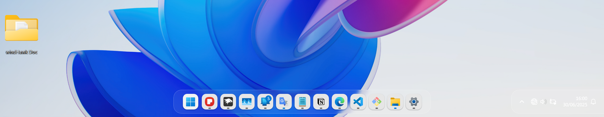
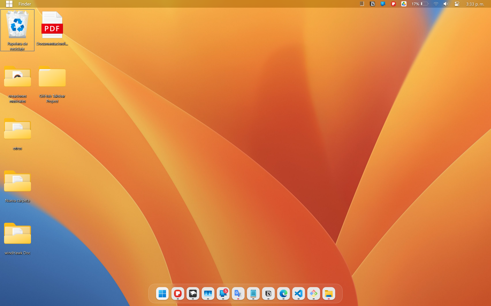
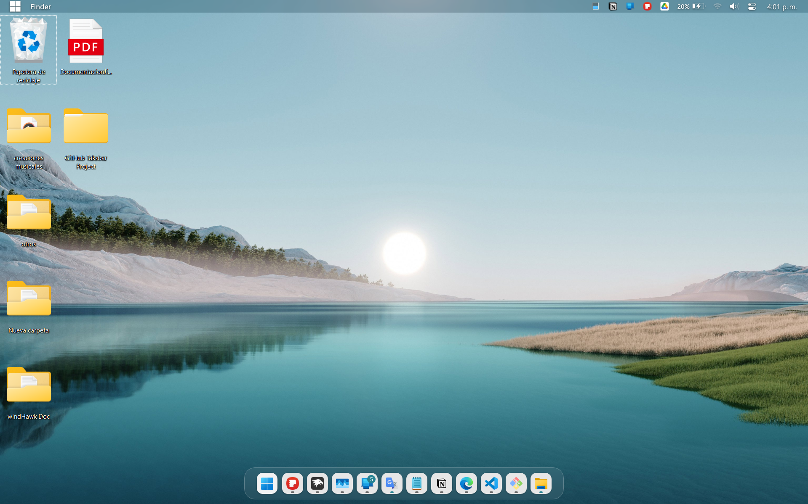

# Surface theme for Windows 11 Taskbar Styler

**Author**: [Jimmy](https://github.com/JimmyLlancaMelo)

 \
 \
 \
 \


## Notes

* This theme is intended to be used with a status bar program such as "MyDockFinder", but it can also be used without it.
* "MyDockFinder" has a dock built in, but it has certain limitations. This theme acts as an alternative to its dock.

## Required additional mod configuration

Mod: [Taskbar Height and Icon Size](https://windhawk.net/mods/taskbar-icon-size)

<details>
<summary>Content to import (click to expand)</summary>

```yaml
TaskbarHeight: 70
IconSize: 24
TaskbarButtonWidth: 47
IconSizeSmall: 16
TaskbarButtonWidthSmall: 32
```
</details>

## Removing system tray

If you are using "MyDockFinder", you can hide the system tray with this style:

Target: `Grid#SystemTrayFrameGrid`
Style: `Visibility=Collapsed`

## Customization

To apply the customizations below, set the corresponding style constants in the mod settings under "Style constants".

### Task item background

The background and border of pinned and running task items. Set `TaskItemBackground` and `TaskItemBorder` to change them. Example values:
* `TaskItemBackground=#E6202020` → Dark gray, mostly opaque
* `TaskItemBackground=#B31A1A2E` → Dark navy, 70% opacity
* `TaskItemBorder=#33000000`    → Subtle dark border
* `TaskItemBorder=#40FFFFFF`    → Subtle light border

### System item background

The background and border of system items such as the Start button and Task View button. Set `SystemItemBackground` and `SystemItemBorder` to change them. Example values:
* `SystemItemBackground=#CC202020` → Dark gray, 80% opacity
* `SystemItemBackground=#B31A1A2E` → Dark navy, 70% opacity
* `SystemItemBorder=#33000000`     → Subtle dark border
* `SystemItemBorder=#40FFFFFF`     → Subtle light border

## Theme selection

The theme is integrated into the mod and can be selected directly from the mod's
settings:

* Open the Windows 11 Taskbar Styler mod in Windhawk.
* Go to the "Settings" tab.
* Select the theme and save the settings.

## Manual installation

The theme styles can also be imported manually. To do that, follow these steps:

* Open the Windows 11 Taskbar Styler mod in Windhawk.
* Go to the "Settings" tab and select "Textual mode".
* Copy the content below to the text box and click "Save settings".

<details>
<summary>Content to import (click to expand)</summary>

```yaml
styleConstants:
  - TaskItemBackground=<AcrylicBrush TintColor="{ThemeResource SystemChromeAltHighColor}" TintOpacity="0.9" FallbackColor="{ThemeResource SystemChromeMediumColor}" />
  - TaskItemBorder=<LinearGradientBrush StartPoint="0,0" EndPoint="0.5,1"><GradientStop Color="#00000000" Offset="0" /><GradientStop Color="#33000000" Offset="1.5" /></LinearGradientBrush>
  - SystemItemBackground=<AcrylicBrush TintColor="{ThemeResource SystemChromeAltHighColor}" TintOpacity="0.8" FallbackColor="{ThemeResource SystemChromeLowColor}" />
  - SystemItemBorder=<LinearGradientBrush StartPoint="0,0" EndPoint="0.5,1"><GradientStop Color="#00000000" Offset="0" /><GradientStop Color="#33000000" Offset="1.5" /></LinearGradientBrush>
controlStyles:
  - target: Grid#RootGrid > Taskbar.TaskbarBackground > Grid
    styles:
      - CornerRadius=20
      - BorderThickness=1
      - Margin=-20,0,-20,0
      - BorderBrush=#40FFFFFF
      - Padding=-1
  - target: Rectangle#BackgroundStroke
    styles:
      - Fill=Transparent
  - target: Taskbar.TaskbarFrame
    styles:
      - Width=Auto
      - HorizontalAlignment=Center
  - target: Taskbar.TaskbarFrame > Grid#RootGrid
    styles:
      - Visibility=Visible
      - Margin=0,0,0,10
      - Padding=20,0,20,0
  - target: Grid#SystemTrayFrameGrid
    styles:
      - Margin=0,0,0,10
      - CornerRadius=20,0,0,20
      - BorderThickness=1,1,0,1
      - BorderBrush=#66FFFFFF
      - Padding=10,5,0,5
      - Background:=<WindhawkBlur BlurAmount="5" TintColor="{ThemeResource SystemChromeAltHighColor}" TintOpacity="0.5" />
      - Visibility=Visible
  - target: Taskbar.TaskbarFrame > Grid#RootGrid > Taskbar.TaskbarBackground > Grid > Rectangle#BackgroundFill
    styles:
      - Fill:=<WindhawkBlur BlurAmount="5" TintColor="#12FFFFFF"/>
  - target: Taskbar.TaskListLabeledButtonPanel@RunningIndicatorStates > Border#BackgroundElement
    styles:
      - Background:=$TaskItemBackground
      - Margin=-1,5.5,1,4
      - CornerRadius=12
      - BorderThickness=2,1,0.5,2
      - BorderBrush:=$TaskItemBorder
  - target: Taskbar.TaskListButtonPanel#ExperienceToggleButtonRootPanel > Border#BackgroundElement
    styles:
      - Background:=$SystemItemBackground
      - CornerRadius=12
      - Margin=-1,5.5,2.5,4
      - BorderThickness=2,1,0.5,2
      - BorderBrush:=$SystemItemBorder
  - target: Taskbar.TaskListLabeledButtonPanel@CommonStates > Rectangle#RunningIndicator
    styles:
      - Margin=0,0,0,8
  - target: Border#MultiWindowElement
    styles:
      - Height=0
```
</details>
