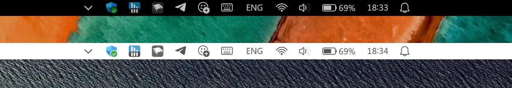
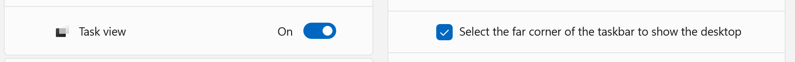
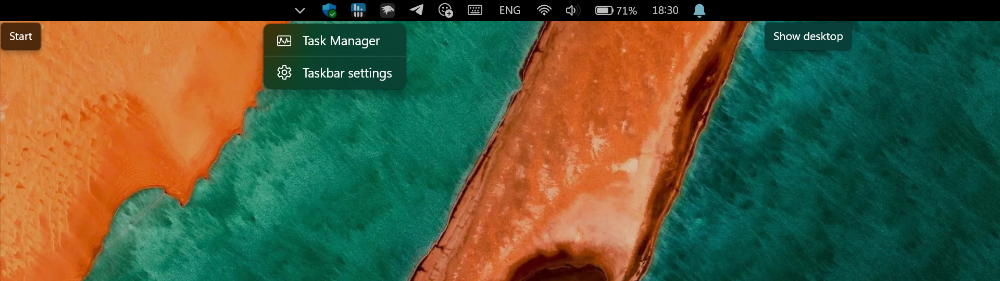
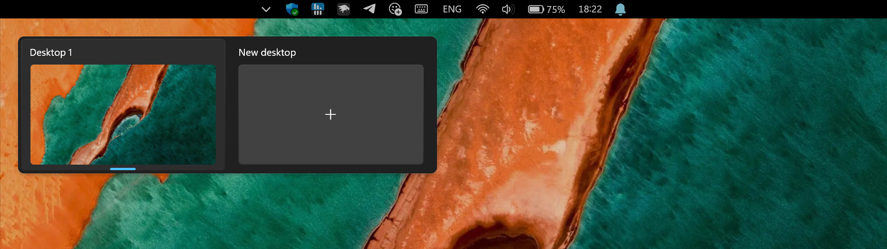
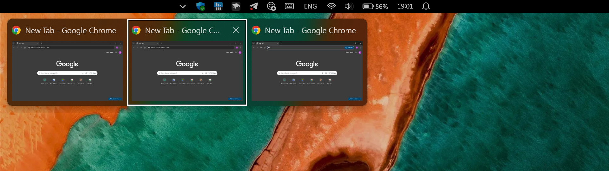

# TaskbarToStatusbar theme for Windows 11 Taskbar Styler

**Author**: [HTImen](https://github.com/HTImen)



This theme turns the taskbar into a true single-line statusbar. Get an experience similar to Windows Phone or Android (Holo UI).

* Click the left corner of the statusbar to show the Start menu.
* Click the area to the left of the tray to show the task view.
* Click the area to the right of the tray to show the desktop.

> [!NOTE]
> You can enable or disable activation areas in the standard Windows taskbar settings if you need access to the taskbar context menu with the task manager.


## More details

* I tested the theme for 3 months on Windows 11 25H2 (24H2). There are no known issues. All pop-ups and keyboard shortcuts work.
* Compatible with both light and dark mode.
* Compatible with both left and center alignment of the Start menu.

 \
 \


## Suggested additional mods

* [Taskbar height and icon size](https://windhawk.net/mods/taskbar-icon-size) - to customize the height of the statusbar.
* [Taskbar on top for Windows 11](https://windhawk.net/mods/taskbar-on-top) - to move the statusbar to the top of the screen.

## Theme selection

The theme is integrated into the mod and can be selected directly from the mod's
settings:

* Open the Windows 11 Taskbar Styler mod in Windhawk.
* Go to the "Settings" tab.
* Select the theme and save the settings.

## Manual installation

The theme styles can also be imported manually. To do that, follow these steps:

* Open the Windows 11 Taskbar Styler mod in Windhawk.
* Go to the "Advanced" tab.
* Copy the content below to the text box under "Mod settings" and click "Save".

<details>
<summary>Content to import (click to expand)</summary>

```json
{
	"controlStyles[0].target":"Taskbar.TaskbarFrame > Grid#RootGrid > Microsoft.UI.Xaml.Controls.ItemsRepeater#TaskbarFrameRepeater",
	"controlStyles[0].styles[0]":"Width=Auto",
	"controlStyles[0].styles[1]":"HorizontalAlignment=Left",
	
	"controlStyles[1].target":"Taskbar.ExperienceToggleButton#LaunchListButton[AutomationProperties.AutomationId=TaskViewButton] > Taskbar.TaskListButtonPanel#ExperienceToggleButtonRootPanel",
	"controlStyles[1].styles[0]":"Width=3840",
	"controlStyles[1].styles[1]":"Margin=0,0,-3840,0",

	"controlStyles[2].target":"Taskbar.ExperienceToggleButton#LaunchListButton > Taskbar.TaskListButtonPanel > Microsoft.UI.Xaml.Controls.AnimatedVisualPlayer#Icon",
	"controlStyles[2].styles[0]":"Visibility=Collapsed",
	"controlStyles[3].target":"Taskbar.TaskListButtonPanel@CommonStates > Border#BackgroundElement",
	"controlStyles[3].styles[0]":"Visibility=Collapsed",

	"controlStyles[4].target":"Taskbar.SearchBoxButton#SearchBoxButton[AutomationProperties.AutomationId=SearchButton] > Taskbar.TaskListButtonPanel",
	"controlStyles[4].styles[0]":"Visibility=Collapsed",
	"controlStyles[5].target":"Taskbar.TaskbarExtensionElement",
	"controlStyles[5].styles[0]":"Visibility=Collapsed",
	"controlStyles[6].target":"Taskbar.AugmentedEntryPointButton#AugmentedEntryPointButton",
	"controlStyles[6].styles[0]":"Visibility=Collapsed",

	"controlStyles[7].target":"Taskbar.TaskListLabeledButtonPanel#IconPanel",
	"controlStyles[7].styles[0]":"Visibility=Collapsed",
	"controlStyles[8].target":"Taskbar.TaskListButtonPanel#OverflowToggleButtonRootPanel",
	"controlStyles[8].styles[0]":"Visibility=Collapsed",


	"controlStyles[9].target":"SystemTray.SystemTrayFrame",
	"controlStyles[9].styles[0]":"HorizontalAlignment=Center",

	"controlStyles[10].target":"SystemTray.Stack#ShowDesktopStack",
	"controlStyles[10].styles[0]":"Width=1920",
	"controlStyles[10].styles[1]":"Margin=0,0,-1920,0",
	"controlStyles[11].target":"SystemTray.StackListView#IconStack[AutomationProperties.AutomationId=ShowDesktop] > ItemsPresenter > StackPanel > ContentPresenter > SystemTray.IconView#SystemTrayIcon",
	"controlStyles[11].styles[0]":"Width=1920",
	
	"controlStyles[12].target":"SystemTray.IconView#SystemTrayIcon > Grid#ContainerGrid@ > Rectangle#ShowDesktopPipe",
	"controlStyles[12].styles[0]":"Fill=Transparent",

	"controlStyles[13].target":"SystemTray.OmniButton#ControlCenterButton > Grid > ContentPresenter > ItemsPresenter > StackPanel > ContentPresenter > SystemTray.IconView#SystemTrayIcon > Grid#ContainerGrid",
	"controlStyles[13].styles[0]":"Padding=4,0,4,0",
	"controlStyles[14].target":"SystemTray.OmniButton#NotificationCenterButton > Grid > ContentPresenter > ItemsPresenter > StackPanel > ContentPresenter > SystemTray.IconView#SystemTrayIcon > Grid#ContainerGrid",
	"controlStyles[14].styles[0]":"Padding=4,0,4,0",

	"controlStyles[15].target":"SystemTray.AdaptiveTextBlock#LanguageInnerTextBlock > Windows.UI.Xaml.Controls.TextBlock#InnerTextBlock",
	"controlStyles[15].styles[0]":"TextTrimming=1",
	"controlStyles[15].styles[1]":"Height=20",
	"controlStyles[15].styles[2]":"FontSize=14",
	"controlStyles[16].target":"TextBlock#BatteryTextBlock",
	"controlStyles[16].styles[0]":"FontSize=14",
	"controlStyles[17].target":"TextBlock#TimeInnerTextBlock",
	"controlStyles[17].styles[0]":"FontSize=14",

	"controlStyles[18].target":"TextBlock#DateInnerTextBlock",
	"controlStyles[18].styles[0]":"Visibility=Collapsed",


	"controlStyles[19].target":"Grid#SystemTrayFrameGrid",
	"controlStyles[19].styles[0]":"Margin=0,-4,0,-4",
	"controlStyles[19].styles[1]":"Opacity=0.75",
	
	"controlStyles[20].target":"Taskbar.TaskbarFrame > Grid#RootGrid > Taskbar.TaskbarBackground > Grid > Rectangle#BackgroundStroke",
	"controlStyles[20].styles[0]":"Visibility=Collapsed",

	"controlStyles[21].target":"Taskbar.TaskbarFrame > Grid#RootGrid > Taskbar.TaskbarBackground > Grid > Rectangle#BackgroundFill",
	"controlStyles[21].styles[0]":"Fill:=<SolidColorBrush Color=\"{ThemeResource TextFillColorInverse}\"  Opacity=\"1.0\" />",
	"controlStyles[22].target":"Taskbar.TaskbarFrame > Grid#RootGrid > Taskbar.TaskbarBackground > Grid",
	"controlStyles[22].styles[0]":"Background=Black"
}
```
</details>
