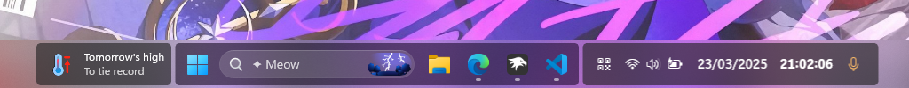
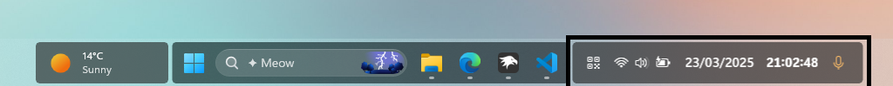
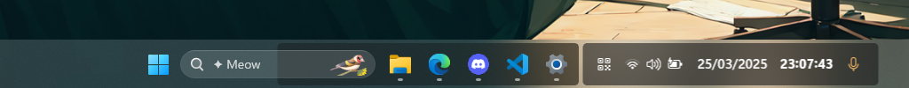
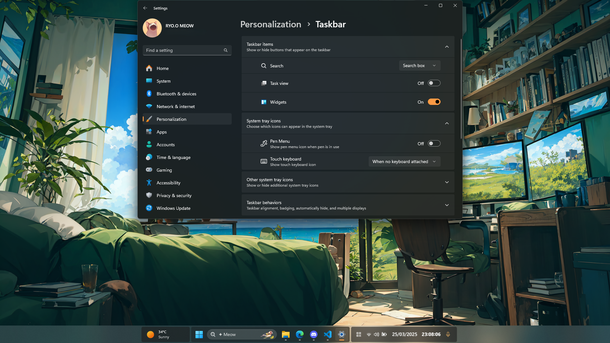

# ✦ TaskbarXII theme for Windows 11 Taskbar Styler :3

**Author**: [ryokr](https://github.com/ryokr)

 \


## Notes

- Currently, this theme is in a fixed position. If you have many pinned apps, it is recommended to use the `Search pill` or `Search icon`.

- If your monitor resolution differs from **1920x1080 at 100% scale**, you may need to adjust the value of `TranslateX` by adding the following styles to the mod's settings:

```
Target:
Taskbar.TaskbarFrame#TaskbarFrame

Styles:
HorizontalAlignment=Right
Transform3D:=<CompositeTransform3D TranslateX="-820"/>
Width=Auto
Height=56
```

  

```
Target:
SystemTray.SystemTrayFrame

Styles:
HorizontalAlignment=Left
Transform3D:=<CompositeTransform3D TranslateX="1104.5"/>
Width=Auto
Height=56
```
  

- If you notice the background is missing under the window button, it means the `Widget` feature is disabled.

  

  To fix this, either enable the `Widget` feature, or add the following styles to the mod's settings:

```
Target:
Taskbar.TaskbarBackground#BackgroundControl

Styles:
Height=48
Transform3D:=<CompositeTransform3D TranslateX="0"/>
Opacity=0.7
```
This will override the default value of TranslateX="156.5"

  

## Suggested Windows settings

- Use default taskbar alignment (center).
- The widget should be enabled.
- The display scale should be at 100 percent.
- You can hide the bell icon via Notifications in Settings.

## Theme selection

The theme is integrated into the mod and can simply be selected from the mod's
settings:

* Open the Windows 11 Taskbar Styler mod in Windhawk.
* Go to the "Settings" tab.
* Select the theme and save the settings.

## Manual installation

The theme styles can also be imported manually. To do that, follow these steps:

* Open the Windows 11 Taskbar Styler mod in Windhawk.
* Go to the "Advanced" tab.
* Copy the content below to the text box under "Mod settings" and click "Save".

<details>
<summary>Content to import (click to expand)</summary>

```json
{
  "controlStyles[0].target": "ScrollViewer > ScrollContentPresenter > Border > Grid",
  "controlStyles[0].styles[0]": "Background:=<AcrylicBrush TintColor=\"{ThemeResource SystemListLowColor}\" TintOpacity=\"0.1\" FallbackColor=\"{ThemeResource SystemChromeHighColor}\" />",
  "controlStyles[1].target": "Taskbar.TaskbarFrame#TaskbarFrame",
  "controlStyles[1].styles[0]": "HorizontalAlignment=Right",
  "controlStyles[1].styles[1]": "Transform3D:=<CompositeTransform3D TranslateX=\"-820\"/>",
  "controlStyles[1].styles[2]": "Width=Auto",
  "controlStyles[1].styles[3]": "Height=56",
  "controlStyles[2].target": "Taskbar.TaskbarFrame#TaskbarFrame > Grid",
  "controlStyles[2].styles[0]": "Height=48",
  "controlStyles[2].styles[1]": "CornerRadius=4",
  "controlStyles[3].target": "Taskbar.TaskbarBackground#BackgroundControl",
  "controlStyles[3].styles[0]": "Height=48",
  "controlStyles[3].styles[1]": "Transform3D:=<CompositeTransform3D TranslateX=\"156.5\"/>",
  "controlStyles[3].styles[2]": "Opacity=0.7",
  "controlStyles[4].target": "Taskbar.TaskbarBackground > Grid",
  "controlStyles[4].styles[0]": "CornerRadius=4",
  "controlStyles[4].styles[1]": "Opacity=1",
  "controlStyles[5].target": "Microsoft.UI.Xaml.Controls.ItemsRepeater#TaskbarFrameRepeater",
  "controlStyles[5].styles[0]": "Margin=0,0,3,0",
  "controlStyles[6].target": "Taskbar.SearchBoxButton > Taskbar.TaskListButtonPanel",
  "controlStyles[6].styles[0]": "Margin=2,0,6,0",
  "controlStyles[7].target": "TextBlock#SearchBoxTextBlock",
  "controlStyles[7].styles[0]": "Text=✦ Meow",
  "controlStyles[8].target": "Windows.UI.Xaml.Shapes.Rectangle#BackgroundStroke",
  "controlStyles[8].styles[0]": "Visibility=Collapsed",
  "controlStyles[9].target": "Taskbar.AugmentedEntryPointButton > Taskbar.TaskListButtonPanel",
  "controlStyles[9].styles[0]": "Background:=<SolidColorBrush Color=\"{ThemeResource SystemChromeAltHighColor}\" Opacity=\"0.6\" />",
  "controlStyles[9].styles[1]": "CornerRadius=4",
  "controlStyles[9].styles[2]": "Padding=0",
  "controlStyles[9].styles[3]": "Margin=0,0,7,0",
  "controlStyles[10].target": "Taskbar.AugmentedEntryPointButton > Taskbar.TaskListButtonPanel > Grid",
  "controlStyles[10].styles[0]": "Margin=8,0,0,0",
  "controlStyles[11].target": "Border#LargeTicker1",
  "controlStyles[11].styles[0]": "Margin=0,2,4,0",
  "controlStyles[12].target": "Border#LargeTicker1 > AdaptiveCards.Rendering.Uwp.WholeItemsPanel > Image",
  "controlStyles[12].styles[0]": "MaxHeight=27",
  "controlStyles[12].styles[1]": "MaxWidth=27",
  "controlStyles[13].target": "Border#LargeTicker1 > AdaptiveCards.Rendering.Uwp.WholeItemsPanel > Microsoft.UI.Xaml.Controls.AnimatedVisualPlayer",
  "controlStyles[13].styles[0]": "MaxHeight=27",
  "controlStyles[13].styles[1]": "MaxWidth=27",
  "controlStyles[14].target": "SystemTray.SystemTrayFrame",
  "controlStyles[14].styles[0]": "HorizontalAlignment=Left",
  "controlStyles[14].styles[1]": "Transform3D:=<CompositeTransform3D TranslateX=\"1104.5\"/>",
  "controlStyles[15].target": "Grid#SystemTrayFrameGrid",
  "controlStyles[15].styles[0]": "Background:=<SolidColorBrush Color=\"{ThemeResource SystemChromeAltHighColor}\" Opacity=\"0.6\" />",
  "controlStyles[15].styles[1]": "CornerRadius=4",
  "controlStyles[15].styles[2]": "Padding=8,3,0,3",
  "controlStyles[16].target": "SystemTray.Stack#SecondaryClockStack",
  "controlStyles[16].styles[0]": "Grid.Column=8",
  "controlStyles[17].target": "SystemTray.OmniButton#ControlCenterButton",
  "controlStyles[17].styles[0]": "Grid.Column=4",
  "controlStyles[18].target": "SystemTray.OmniButton#NotificationCenterButton",
  "controlStyles[18].styles[0]": "Grid.Column=5",
  "controlStyles[19].target": "SystemTray.Stack#MainStack",
  "controlStyles[19].styles[0]": "Grid.Column=6",
  "controlStyles[20].target": "SystemTray.Stack#ShowDesktopStack",
  "controlStyles[20].styles[0]": "Grid.Column=7",
  "controlStyles[21].target": "TextBlock#InnerTextBlock[Text=]",
  "controlStyles[21].styles[0]": "Text=",
  "controlStyles[22].target": "TextBlock#TimeInnerTextBlock",
  "controlStyles[22].styles[0]": "Transform3D:=<CompositeTransform3D TranslateY=\"10\"/>",
  "controlStyles[22].styles[1]": "FontSize=15",
  "controlStyles[22].styles[2]": "FontWeight=Bold",
  "controlStyles[22].styles[3]": "Margin=94,0,0,0",
  "controlStyles[23].target": "TextBlock#DateInnerTextBlock",
  "controlStyles[23].styles[0]": "Transform3D:=<CompositeTransform3D TranslateY=\"-10\"/>",
  "controlStyles[23].styles[1]": "FontSize=15",
  "controlStyles[23].styles[2]": "FontWeight=SemiBold",
  "controlStyles[23].styles[3]": "HorizontalAlignment=Left"
}
```
</details>
