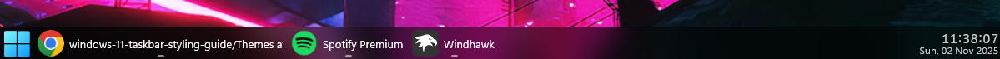

# TintedGlass theme for Windows 11 Taskbar Styler

**Author**: [TheRealCisWhiteMale](https://github.com/TheRealCisWhiteMale)



## Notes
* This taskbar theme is designed to be used in dark mode.

## Required Windhawk Mods for similar results
To achieve similar results, install and configure the following Windhawk mods in addition to Windows 11 Taskbar Styler:

- Taskbar Clock Customization – for styling the clock. You will need to add your weather location if you have the desire to use that function and may need to change date formatting if you wish.

<details>
<summary>Click to expand JSON content</summary>

```json
{
  "ShowSeconds": 1,
  "TimeFormat": "HH':'mm':'ss",
  "DateFormat": "ddd',' dd MMM yyyy",
  "WeekdayFormat": "custom",
  "WeekdayFormatCustom": "Mon, Tue, Wed, Thu, Fri, Sat, Sun",
  "TopLine": "%time%",
  "BottomLine": "%date%",
  "MiddleLine": "%weekday%",
  "TooltipLine": "%weather%",
  "Width": 180,
  "Height": 60,
  "MaxWidth": 0,
  "TextSpacing": -4,
  "WebContentsUpdateInterval": 10,
  "TimeStyle.Hidden": 0,
  "TimeStyle.TextColor": "",
  "TimeStyle.TextAlignment": "Right",
  "TimeStyle.FontSize": 16,
  "TimeStyle.FontFamily": "",
  "TimeStyle.FontWeight": "Medium",
  "TimeStyle.FontStyle": "",
  "TimeStyle.FontStretch": "",
  "TimeStyle.CharacterSpacing": 70,
  "DateStyle.Hidden": 0,
  "DateStyle.TextColor": "",
  "DateStyle.TextAlignment": "Right",
  "DateStyle.FontSize": 12,
  "DateStyle.FontFamily": "",
  "DateStyle.FontWeight": "",
  "DateStyle.FontStyle": "",
  "DateStyle.FontStretch": "",
  "DateStyle.CharacterSpacing": 0,
  "oldTaskbarOnWin11": 0,
  "DataCollectionUpdateInterval": 1,
  "WebContentsItems[0].Url": "https://rss.nytimes.com/services/xml/rss/nyt/World.xml",
  "WebContentsItems[0].BlockStart": "<item>",
  "WebContentsItems[0].Start": "<title>",
  "WebContentsItems[0].End": "</title>",
  "WebContentsItems[0].ContentMode": "xmlHtml",
  "WebContentsItems[0].SearchReplace[0].Search": "",
  "WebContentsItems[0].SearchReplace[0].Replace": "",
  "WebContentsItems[0].MaxLength": 28,
  "WebContentWeatherLocation": "",
  "WebContentWeatherFormat": "%c 🌡️%t 🌬️%w",
  "TimeZones[0]": "GMT Standard Time"
}
```
</details>

---

- Taskbar Height and Icon Size

<details>
<summary>Click to expand JSON content</summary>

```json
{
  "IconSize": 32,
  "TaskbarHeight": 40,
  "TaskbarButtonWidth": 40,
  "IconSizeSmall": 16,
  "TaskbarButtonWidthSmall": 32
}
```
</details>

---

- Taskbar Labels for Windows 11

<details>
<summary>Click to expand JSON content</summary>

```json
{
  "mode": "labelsWithoutCombining",
  "taskbarItemWidth": 0,
  "runningIndicatorStyle": "centerFixed",
  "progressIndicatorStyle": "sameAsRunningIndicatorStyle",
  "excludedPrograms[0]": "excluded1.exe",
  "minimumTaskbarItemWidth": 43,
  "maximumTaskbarItemWidth": 300,
  "fontSize": 13,
  "fontFamily": "",
  "textTrimming": "clip",
  "leftAndRightPaddingSize": 6,
  "spaceBetweenIconAndLabel": 6,
  "runningIndicatorHeight": 0,
  "runningIndicatorVerticalOffset": 0,
  "alwaysShowThumbnailLabels": 0,
  "labelForSingleItem": "%name%",
  "labelForMultipleItems": "[%amount%] %name%"
}
```
</details>

---

## Suggested Windhawk mods for full theme continuity
To achieve the full look, install and configure the following Windhawk mods in addition to Windows 11 Taskbar Styler:

- Windows 11 Start Menu Styler

[TintedGlass theme for Windows 11 Start Menu Styler](https://github.com/ramensoftware/windows-11-start-menu-styling-guide/blob/main/Themes/TintedGlass/README.md).

---

- Windows 11 Notification Center Styler

[TintedGlass theme for Windows 11 Notification Center Styler](https://github.com/ramensoftware/windows-11-notification-center-styling-guide/blob/main/Themes/TintedGlass/README.md).

---

- Windows 11 File Explorer Styler

[TintedGlass theme for Windows 11 File Explorer Styler](https://github.com/ramensoftware/windows-11-file-explorer-styling-guide/blob/main/Themes/TintedGlass/README.md).

---

- Translucent Windows

<details>
<summary>Click to expand JSON content</summary>

```json
{
  "RenderingMod.ThemeBackground": 1,
  "RenderingMod.AccentColorControls": 1,
  "type": "acrylicblur",
  "AccentBlurBehind": "80000000",
  "ImmersiveDarkTitle": 1,
  "ExtendFrame": 1,
  "CornerOption": "smallround",
  "RainbowSpeed": 1,
  "TitlebarColor.ColorTitlebar": 0,
  "TitlebarColor.RainbowTitlebar": 0,
  "TitlebarColor.titlerbarstyles_active": "0",
  "TitlebarColor.titlerbarstyles_inactive": "0",
  "TitlebarTextColor.ColorTitlebarText": 0,
  "TitlebarTextColor.RainbowTextColor": 0,
  "TitlebarTextColor.titlerbarcolorstyles_active": "FFFFFF",
  "TitlebarTextColor.titlerbarcolorstyles_inactive": "FFFFFF",
  "BorderColor.ColorBorder": 1,
  "BorderColor.RainbowBorder": 0,
  "BorderColor.borderstyles_active": "0",
  "BorderColor.borderstyles_inactive": "0",
  "BorderColor.MenuBorderColor": 1,
  "RenderingMod.TextAlphaBlend": 1,
  "RuledPrograms[0].target": "notepad.exe",
  "RuledPrograms[0].type": "acrylicsystem",
  "RuledPrograms[0].ImmersiveDarkTitle": 1,
  "RuledPrograms[0].ExtendFrame": 0,
  "RuledPrograms[0].BorderColor.ColorBorder": 1,
  "RuledPrograms[0].BorderColor.borderstyles_active": "0",
  "RuledPrograms[0].BorderColor.borderstyles_inactive": "0",
  "RuledPrograms[0].TitlebarTextColor.ColorTitlebarText": 0,
  "RuledPrograms[0].TitlebarTextColor.titlerbarcolorstyles_active": "FFFFFF",
  "RuledPrograms[0].TitlebarTextColor.titlerbarcolorstyles_inactive": "FFFFFF",
  "RuledPrograms[0].AccentBlurBehind": "80000000",
  "RuledPrograms[0].CornerOption": "smallround",
  "RuledPrograms[1].target": "notepad++.exe",
  "RuledPrograms[1].type": "acrylicsystem",
  "RuledPrograms[1].ImmersiveDarkTitle": 1,
  "RuledPrograms[1].ExtendFrame": 0,
  "RuledPrograms[1].BorderColor.ColorBorder": 1,
  "RuledPrograms[1].BorderColor.borderstyles_active": "0",
  "RuledPrograms[1].BorderColor.borderstyles_inactive": "0",
  "RuledPrograms[1].TitlebarTextColor.ColorTitlebarText": 0,
  "RuledPrograms[1].TitlebarTextColor.titlerbarcolorstyles_active": "FFFFFF",
  "RuledPrograms[1].TitlebarTextColor.titlerbarcolorstyles_inactive": "FFFFFF",
  "RuledPrograms[1].AccentBlurBehind": "80000000",
  "RuledPrograms[1].CornerOption": "smallround"
}
```
</details>

---

- Taskbar Background Helper

<details>
<summary>Click to expand JSON content</summary>

```json
{
  "backgroundStyle": "blur",
  "color.red": 255,
  "color.green": 127,
  "color.blue": 39,
  "color.accentColor": 0,
  "color.transparency": 128,
  "onlyWhenMaximized": 1,
  "excludedPrograms[0]": "",
  "styleForDarkMode.use": 0,
  "styleForDarkMode.backgroundStyle": "blur",
  "styleForDarkMode.color.red": 255,
  "styleForDarkMode.color.green": 127,
  "styleForDarkMode.color.blue": 39,
  "styleForDarkMode.color.accentColor": 0,
  "styleForDarkMode.color.transparency": 128
}
```
</details>

---

## Theme selection

The theme is integrated into the mod and can simply be selected from the mod's
settings:

* Open the Windows 11 Taskbar Styler mod in Windhawk.
* Go to the "Settings" tab.
* Select the theme and save the settings.

## Manual installation

The theme styles can also be imported manually. To do that, follow these steps:

* Open the Windows 11 Taskbar Styler mod in Windhawk.
* Go to the "Advanced" tab.
* Copy the content below to the text box under "Mod settings" and click "Save".

<details>
<summary>Content to import (click to expand)</summary>

```json
{
  "controlStyles[0].target": "Taskbar.TaskbarFrame > Grid#RootGrid > Taskbar.TaskbarBackground > Grid > Rectangle#BackgroundFill",
  "controlStyles[0].styles[0]": "Fill=$CommonBgBrush",
  "controlStyles[1].target": "Taskbar.TaskbarBackground#HoverFlyoutBackgroundControl > Grid > Rectangle#BackgroundFill",
  "controlStyles[1].styles[0]": "Fill=$CommonBgBrush",
  "controlStyles[2].target": "Windows.UI.Xaml.Controls.Grid#ModalRootGrid > Windows.UI.Xaml.Controls.Border#BackgroundElement",
  "controlStyles[2].styles[0]": "Background=$CommonBgBrush",
  "controlStyles[3].target": "Windows.UI.Xaml.Controls.Border#BackgroundDimmingLayer",
  "controlStyles[3].styles[0]": "Background=$CommonBgBrush",
  "controlStyles[4].target": "MenuFlyoutPresenter > Border",
  "controlStyles[4].styles[0]": "Fill=$CommonBgBrush",
  "controlStyles[4].styles[1]": "BorderThickness=0,0,0,0",
  "controlStyles[4].styles[2]": "CornerRadius=14",
  "controlStyles[4].styles[3]": "Padding=2,2,2,2",
  "controlStyles[5].target": "Border#OverflowFlyoutBackgroundBorder",
  "controlStyles[5].styles[0]": "Fill=$CommonBgBrush",
  "controlStyles[5].styles[1]": "BorderThickness=0,0,0,0",
  "controlStyles[5].styles[2]": "CornerRadius=14",
  "controlStyles[5].styles[3]": "Margin=-2,-2,-2,-2",
  "controlStyles[6].target": "SystemTray.AdaptiveTextBlock#Base > TextBlock#InnerTextBlock",
  "controlStyles[6].styles[0]": "FontSize=18",
  "controlStyles[7].target": "SystemTray.ImageIconContent > Grid#ContainerGrid > Image",
  "controlStyles[7].styles[0]": "Width=18",
  "controlStyles[7].styles[1]": "Height=18",
  "controlStyles[8].target": "SystemTray.Stack#ShowDesktopStack",
  "controlStyles[8].styles[0]": "Visibility=Collapsed",
  "controlStyles[9].target": "Taskbar.ExperienceToggleButton#LaunchListButton[AutomationProperties.AutomationId=StartButton] > Taskbar.TaskListButtonPanel > Microsoft.UI.Xaml.Controls.AnimatedVisualPlayer#Icon",
  "controlStyles[9].styles[0]": "Height=32",
  "controlStyles[9].styles[1]": "Width=32",
  "controlStyles[10].target": "Taskbar.TaskListLabeledButtonPanel#IconPanel",
  "controlStyles[10].styles[0]": "Padding=2,2,2,2",
  "controlStyles[11].target": "Taskbar.TaskListButtonPanel#ExperienceToggleButtonRootPanel",
  "controlStyles[11].styles[0]": "Padding=2,2,2,2",
  "controlStyles[12].target": "Grid#ContainerGrid",
  "controlStyles[12].styles[0]": "Padding=2,2,2,2",
  "controlStyles[13].target": "Taskbar.FlyoutFrame > Canvas#HoverFlyoutCanvas > Grid#HoverFlyoutGrid",
  "controlStyles[13].styles[0]": "Padding=2,2,2,2",
  "styleConstants[0]": "CommonBgBrush=<WindhawkBlur BlurAmount=\"18\" TintColor=\"#80000000\"/>",
  "controlStyles[14].target": "Image#Icon",
  "controlStyles[14].styles[0]": "Margin=2,2,2,2",
  "controlStyles[15].target": "Rectangle#BackgroundStroke",
  "controlStyles[15].styles[0]": "Fill:=<WindhawkBlur BlurAmount=\"18\" TintColor=\"#1AFFFFFF\"/>",
  "controlStyles[16].target": "Grid#OverflowRootGrid > Border",
  "controlStyles[16].styles[0]": "Background=$CommonBgBrush",
  "controlStyles[17].target": "Grid#ConfirmatorMainGrid",
  "controlStyles[17].styles[0]": "Background=$CommonBgBrush",
  "controlStyles[17].styles[1]": "BorderThickness=0",
  "controlStyles[18].target": "WindowsInternal.ComposableShell.Experiences.TextInput.Common.InputSwitcher > ContentControl > ContentPresenter > Grid",
  "controlStyles[18].styles[0]": "Background=$CommonBgBrush",
  "controlStyles[18].styles[1]": "BorderThickness=0",
  "controlStyles[19].target": "WindowsInternal.ComposableShell.Experiences.TextInput.Common.InputSwitcher > ContentControl > ContentPresenter > Grid > Grid",
  "controlStyles[19].styles[0]": "Fill:=<WindhawkBlur BlurAmount=\"18\" TintColor=\"#1AFFFFFF\"/>"
}
```
</details>
