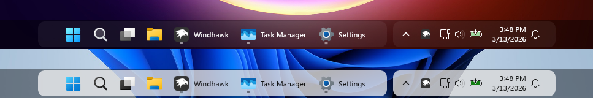

# UltraWideFriendly theme for Windows 11 Taskbar Styler

A minimal, floating dual-island taskbar inspired by macOS dock aesthetics. Separates the app icons and system tray into two distinct rounded islands with a semi-transparent ghost bar behind them.

**Author**: [CryptoProgenitor](https://github.com/CryptoProgenitor)



## Features

- **Dual Islands**: App icons and system tray float as separate rounded containers
- **Ghost Bar**: Semi-transparent backdrop ties the composition together
- **Centered Layout**: Both islands center automatically using flexible grid columns
- **Floating Effect**: Small vertical margin creates a subtle lift from screen edge
- **Clean Aesthetic**: Theme-aware backgrounds with rounded corners (10px radius)

## Customization

To apply the customizations below, set the corresponding style constants in the mod settings under "Style constants".

### Taskbar frame max width

By default, the app island can grow indefinitely, eventually pushing the system tray outside the screen. To prevent this, set `TaskbarFrameMaxWidth` to limit the maximum width of the app island. For example: `TaskbarFrameMaxWidth=800` will cap the app island at 800px.

### Island background color

Set `IslandBackgroundColor` to your preferred color. Example values:
* `IslandBackgroundColor=#FF202020`  → Dark gray (default)
* `IslandBackgroundColor=#FF000000`  → Pure black
* `IslandBackgroundColor=#FF1a1a2e`  → Dark navy

### Ghost bar opacity

Set `GhostBarBackgroundColor` to adjust the opacity of the ghost bar behind the islands. The default is `#66000000`, which is black with 40% opacity. You can increase or decrease the opacity by changing the alpha channel (the first two digits):
* `GhostBarBackgroundColor=#66000000`   → 40% opacity (default)
* `GhostBarBackgroundColor=#99000000`   → 60% opacity
* `GhostBarBackgroundColor=#33000000`   → 20% opacity
* `GhostBarBackgroundColor=Transparent` → No ghost bar

### Adjust island float (vertical gap)

Set `IslandVerticalMargin` to adjust the vertical margins of the islands, creating more or less of a floating effect:
* `IslandVerticalMargin=3`  → 3px float (default)
* `IslandVerticalMargin=6`  → 6px float (more dramatic)
* `IslandVerticalMargin=0`  → No float

### Adjust island gap

Set `IslandHorizontalMargin` to change the horizontal margins between islands:
* `IslandHorizontalMargin=5`  → 10px gap (default)
* `IslandHorizontalMargin=10` → 20px gap

## Notes

- Designed for Windows 11 with taskbar icons centered
- Works with both light and dark system themes
- The app island has wider padding (25px) for more clickable area; tray has tighter padding (5px)

## Theme selection

The theme is integrated into the mod and can be selected directly from the mod's
settings:

* Open the Windows 11 Taskbar Styler mod in Windhawk.
* Go to the "Settings" tab.
* Select the theme and save the settings.

## Manual installation

The theme styles can also be imported manually. To do that, follow these steps:

* Open the Windows 11 Taskbar Styler mod in Windhawk.
* Go to the "Advanced" tab.
* Copy the content below to the text box under "Mod settings" and click "Save".

<details>
<summary>Content to import (click to expand)</summary>

```json
{
  "controlStyles[0].target": "ScrollViewer > ScrollContentPresenter > Border > Grid",
  "controlStyles[0].styles[0]": "ColumnDefinitions:=<ColumnDefinitionCollection><ColumnDefinition Width=\"*\"/><ColumnDefinition Width=\"Auto\"/><ColumnDefinition Width=\"Auto\"/><ColumnDefinition Width=\"*\"/></ColumnDefinitionCollection>",
  "controlStyles[0].styles[1]": "HorizontalAlignment=Stretch",
  "controlStyles[0].styles[2]": "Background:=<SolidColorBrush Color=\"$GhostBarBackgroundColor\"/>",
  "controlStyles[1].target": "Taskbar.TaskbarFrame#TaskbarFrame",
  "controlStyles[1].styles[0]": "Grid.Column=1",
  "controlStyles[1].styles[1]": "Width=Auto",
  "controlStyles[1].styles[2]": "HorizontalAlignment=Right",
  "controlStyles[1].styles[3]": "Margin=0,0,$IslandHorizontalMargin,0",
  "controlStyles[1].styles[4]": "MaxWidth=$TaskbarFrameMaxWidth",
  "controlStyles[2].target": "Taskbar.TaskbarFrame#TaskbarFrame > Grid",
  "controlStyles[2].styles[0]": "Background:=<SolidColorBrush Color=\"$IslandBackgroundColor\"/>",
  "controlStyles[2].styles[1]": "CornerRadius=10",
  "controlStyles[2].styles[2]": "Padding=25,0,25,0",
  "controlStyles[2].styles[3]": "Margin=0,$IslandVerticalMargin,0,$IslandVerticalMargin",
  "controlStyles[3].target": "SystemTray.SystemTrayFrame",
  "controlStyles[3].styles[0]": "Grid.Column=2",
  "controlStyles[3].styles[1]": "Width=Auto",
  "controlStyles[3].styles[2]": "HorizontalAlignment=Left",
  "controlStyles[3].styles[3]": "Margin=$IslandHorizontalMargin,0,0,0",
  "controlStyles[4].target": "Grid#SystemTrayFrameGrid",
  "controlStyles[4].styles[0]": "Background:=<SolidColorBrush Color=\"$IslandBackgroundColor\"/>",
  "controlStyles[4].styles[1]": "CornerRadius=10",
  "controlStyles[4].styles[2]": "Padding=5,0,5,0",
  "controlStyles[4].styles[3]": "Margin=0,$IslandVerticalMargin,0,$IslandVerticalMargin",
  "controlStyles[5].target": "Taskbar.TaskbarBackground#BackgroundControl",
  "controlStyles[5].styles[0]": "Visibility=Collapsed",
  "controlStyles[6].target": "Taskbar.TaskbarFrame > Grid#RootGrid > Taskbar.TaskbarBackground > Grid > Rectangle#BackgroundFill",
  "controlStyles[6].styles[0]": "Fill=Transparent",
  "styleConstants[0]": "GhostBarBackgroundColor=#66000000",
  "styleConstants[1]": "IslandBackgroundColor={ThemeResource ControlFillColorDefault}",
  "styleConstants[2]": "IslandVerticalMargin=3",
  "styleConstants[3]": "IslandHorizontalMargin=5",
  "styleConstants[4]": "TaskbarFrameMaxWidth=Infinity"
}
```
</details>
