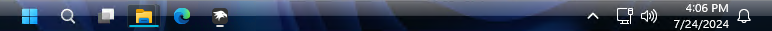

# Windows Vista theme for Windows 11 Taskbar Styler

**Author**: [Haitch-1](https://github.com/Haitch-1)



## Notes

This theme was intended to be used with a slim taskbar, you may achieve a slim taskbar with this mod:

* [Taskbar height and icon size](https://windhawk.net/mods/taskbar-icon-size)

  With these settings:

  ```json
  {
    "IconSize": 16,
    "TaskbarHeight": 32,
    "TaskbarButtonWidth": 38
  }
  ```


## Theme selection

The theme is integrated into the mod, and can be simply selected from the mod's
settings:

* Open the Windows 11 Taskbar Styler mod in Windhawk.
* Go to the "Settings" tab.
* Select the theme and save the settings.

## Manual installation

The theme styles can also be imported manually. To do that, follow these steps:

* Open the Windows 11 Taskbar Styler mod in Windhawk.
* Go to the "Advanced" tab.
* Copy the content below to the text box under "Mod settings" and click "Save".

<details>
<summary>Content to import (click to expand)</summary>

```json
{
  "theme": "",
  "controlStyles[0].target": "Taskbar.ExperienceToggleButton",
  "controlStyles[0].styles[0]": "CornerRadius=2",
  "controlStyles[1].target": "Taskbar.SearchBoxButton",
  "controlStyles[2].target": "Taskbar.TaskListButton",
  "controlStyles[1].styles[0]": "CornerRadius=2",
  "controlStyles[2].styles[0]": "CornerRadius=2",
  "controlStyles[3].target": "Taskbar.TaskListLabeledButtonPanel@RunningIndicatorStates > Rectangle#RunningIndicator",
  "controlStyles[3].styles[0]": "Height=2",
  "controlStyles[3].styles[1]": "Width@ActiveRunningIndicator=30",
  "resourceVariables[0].variableKey": "",
  "resourceVariables[0].value": "",
  "controlStyles[3].styles[2]": "Width@InactiveRunningIndicator=8",
  "controlStyles[3].styles[3]": "Fill@ActiveRunningIndicator=#00BEE0",
  "controlStyles[3].styles[4]": "Fill@InactiveRunningIndicator=#DDDDDD",
  "controlStyles[4].target": "Rectangle#BackgroundFill",
  "controlStyles[4].styles[0]": "Fill:=<LinearGradientBrush StartPoint=\"0,0\" EndPoint=\"0,1\" Opacity=\"0.75\"><GradientStop Color=\"#B5B9BC\" Offset=\"0.0\" /><GradientStop Color=\"#B5B9BC\" Offset=\"0.03125\" /><GradientStop Color=\"#909296\" Offset=\"0.03125\" /><GradientStop Color=\"#464B51\" Offset=\"0.5\" /><GradientStop Color=\"#060F15\" Offset=\"0.5\" /><GradientStop Color=\"#040C11\" Offset=\"0.96875\" /><GradientStop Color=\"#000000\" Offset=\"0.96875\" /><GradientStop Color=\"#000000\" Offset=\"1.0\" /></LinearGradientBrush>",
  "controlStyles[5].target": "Taskbar.TaskListLabeledButtonPanel@RunningIndicatorStates > Border",
  "controlStyles[5].styles[0]": "Background@ActiveRunningIndicator:=<LinearGradientBrush StartPoint=\"0,0\" EndPoint=\"0,1\" Opacity=\"0.2\">     <GradientStop Color=\"#111111\" Offset=\"0.0\" />     <GradientStop Color=\"#111111\" Offset=\"1.0\" /> </LinearGradientBrush>",
  "controlStyles[5].styles[1]": "CornerRadius=2",
  "controlStyles[5].styles[2]": "Background@RequestingAttentionRunningIndicator:=<LinearGradientBrush StartPoint=\"0,0\" EndPoint=\"0,1\" Opacity=\"0.2\">     <GradientStop Color=\"#D53300\" Offset=\"0.0\" />     <GradientStop Color=\"#111111\" Offset=\"1.0\" /> </LinearGradientBrush>"
}
```
</details>
